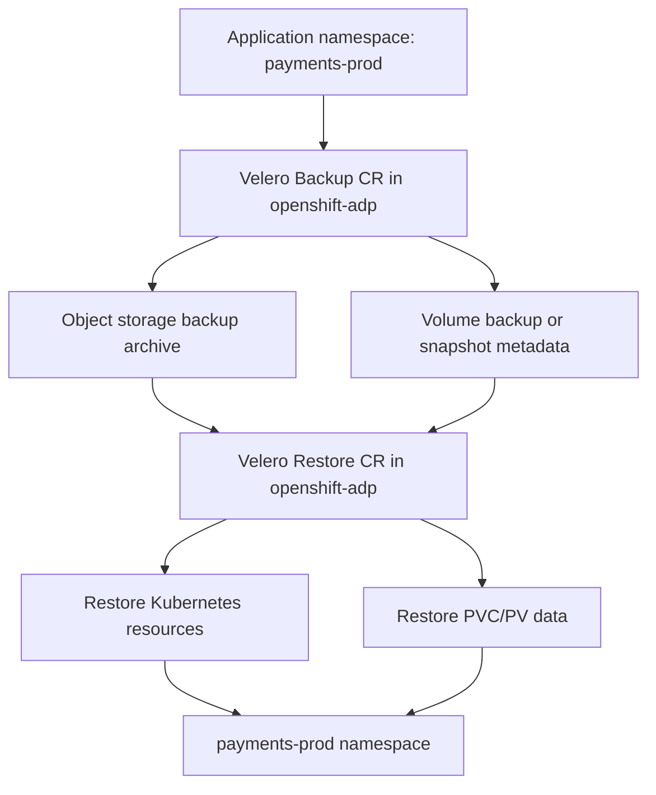

# Restore Application to the Same Namespace in OpenShift APIs for Data Protection — OADP

**Audience:** Advanced OpenShift administrators with production experience  
**Level:** Senior / 10+ years operations depth  
**Scope:** Restoring an application backup back into the original namespace by using OADP / Velero  
**Primary use case:** Recover a deleted, corrupted, or broken application in the same namespace name from which it was backed up

---

## 1. Executive Summary

A **restore application to the same namespace** operation means that an application backed up from namespace `app-prod` is restored back into `app-prod`, not into a new namespace such as `app-restore` or `app-dr`.

In OADP, this is done by creating a Velero `Restore` custom resource in the OADP namespace, usually `openshift-adp`, and pointing it to a completed `Backup` custom resource. If you do **not** use `namespaceMapping`, Velero restores namespace-scoped resources into the same namespace names stored in the backup. If the target namespace does not exist, Velero creates it during restore.

This restore style is common in real production incidents such as:

- a namespace was accidentally deleted;
- a deployment, route, secret, config map, or PVC was accidentally removed;
- an application upgrade failed and you need to roll back to the backup state;
- a stateful application needs data recovery in its original namespace;
- a disaster recovery cluster is built with the same namespace naming convention;
- a production application must come back with the same DNS route, labels, service account names, role bindings, and PVC names.

The most important senior-admin point is this:

> **Restoring to the same namespace is safest when the target namespace or target resources are clean.** By default, Velero is non-destructive. If a resource already exists, Velero skips it instead of overwriting it. This protects running clusters, but it also means that an in-place restore might not actually roll back objects that already exist.

---

## 2. Key References

This guide is based on the current Red Hat OpenShift backup and restore documentation and Velero restore behavior.

- Red Hat OpenShift Container Platform 4.21 Backup and Restore documentation — OADP backs up and restores Kubernetes resources and internal images at namespace granularity, and restores application backups by creating a `Restore` CR.
- Red Hat OADP restoring procedure — restore prerequisites include OADP Operator installed, `DataProtectionApplication` ready, an existing Velero `Backup` CR, and matching PV capacity.
- Velero restore reference — Velero validates the `Restore`, fetches backup data from object storage, applies filters, ensures the target namespace exists, creates eligible resources, and restores PV data depending on backup method.
- Velero restore behavior — by default, Velero does not overwrite existing resources; `existingResourcePolicy: update` is available but only best-effort and does not overwrite PV data.

Reference URLs are listed at the end of this file.

---

## 3. What “Same Namespace Restore” Means

Assume this backup was taken from namespace:

```text
payments-prod
```

A same namespace restore restores the application back into:

```text
payments-prod
```

A different namespace restore would restore it into something like:

```text
payments-restore
payments-dr
payments-test
```

For **same namespace restore**, you normally do **not** configure this field:

```yaml
namespaceMapping:
  payments-prod: payments-restore
```

Instead, you either omit `namespaceMapping`, or explicitly include the namespace without remapping:

```yaml
spec:
  backupName: payments-prod-backup-2026-07-03
  includedNamespaces:
  - payments-prod
```

The `Restore` CR itself still lives in the OADP namespace:

```yaml
metadata:
  namespace: openshift-adp
```

This is a frequent point of confusion. The restore CR is created in `openshift-adp`, but the application resources are restored into the application namespace.

---

## 4. High-Level Architecture



OADP uses Velero underneath. OADP provides the OpenShift-supported operator lifecycle, plugins, backup storage configuration, CSI/File System Backup integration, OpenShift-specific plugins, and CR-based workflows. Velero performs the actual backup and restore control-loop work.

---

## 5. Restore Modes for the Same Namespace

There are two major modes.

### 5.1 Clean Same Namespace Restore

This is the recommended production approach for a real rollback or disaster recovery operation.

Use this when:

- the namespace was deleted;
- the namespace is corrupted;
- PVC data must be restored;
- resources must match the backup state as closely as possible;
- existing resources might block restore;
- you want predictable results.

Typical flow:

```text
Verify backup -> Stop traffic -> Delete broken namespace/resources -> Create Restore CR -> Validate app
```

This avoids many `AlreadyExists`, skipped-resource, and stale-PVC problems.

### 5.2 In-Place Same Namespace Restore

This means the namespace still exists and you create a restore pointing to the same namespace.

Use this only when:

- you know exactly which resources are missing;
- you want to recover deleted objects but not overwrite existing ones;
- PVC data overwrite is not required;
- you accept that existing resources are skipped by default.

Example:

```text
Secret accidentally deleted -> Restore same namespace -> Existing deployments skipped -> Missing secret restored
```

This is not a full application rollback unless you carefully delete the target resources first or use `existingResourcePolicy: update` with full understanding of its limits.

---

## 6. Critical Senior-Admin Concept: Existing Resource Policy

Velero is non-destructive by default.

That means:

```text
If resource exists in target namespace -> Velero skips it
If resource does not exist -> Velero creates it
```

This protects production clusters from accidental overwrites, but it also surprises many administrators during same-namespace restores.

### 6.1 Default Behavior

Default restore behavior:

```yaml
existingResourcePolicy: none
```

or omitted:

```yaml
spec:
  backupName: my-backup
```

Effect:

- existing `Deployment` is skipped;
- existing `StatefulSet` is skipped;
- existing `Service` is skipped;
- existing `Route` is skipped;
- existing `PVC` is skipped;
- existing `ConfigMap` is skipped;
- existing `Secret` is skipped;
- missing resources are created.

Exception: Velero has special merge behavior for existing `ServiceAccount` objects.

### 6.2 Update Behavior

You can request update behavior:

```yaml
spec:
  backupName: my-backup
  existingResourcePolicy: update
```

or by CLI:

```bash
velero restore create restore1 \
  --from-backup my-backup \
  --existing-resource-policy update
```

Effect:

- Velero tries to patch existing resources to match the backup;
- if patch succeeds, labels such as `velero.io/backup-name` and `velero.io/restore-name` are added;
- if patch fails, Velero logs warning/error and continues;
- this is best-effort;
- it does not overwrite PV data.

### 6.3 Production Recommendation

For stateless metadata recovery:

```text
In-place restore with default policy can be acceptable.
```

For stateful application recovery:

```text
Prefer clean restore. Delete broken application resources/PVCs/namespace after confirming backup validity.
```

For full rollback of an application release:

```text
Do not assume restore will overwrite everything. Existing resources usually block a real rollback.
```

---

## 7. Persistent Volume Restore Behavior in Same Namespace

The most sensitive part of same namespace restore is storage.

OADP/Velero can restore volume data by different mechanisms:

1. CSI snapshots
2. native cloud snapshots
3. File System Backup using Kopia or Restic
4. data movement from snapshot to object storage, depending on configuration

### 7.1 `restorePVs: true`

The common restore setting is:

```yaml
restorePVs: true
```

This tells Velero/OADP to restore persistent volume data where volume backup information exists.

Red Hat documents that `restorePVs` can be set to `false` to turn off PersistentVolume restore from CSI/native snapshots when a `VolumeSnapshotLocation` is configured.

### 7.2 If PVC Already Exists

If the target PVC already exists in the same namespace, default restore behavior usually skips the PVC. That means the volume data behind that existing PVC is not restored or rolled back.

This is why same-namespace stateful restores are usually performed after deleting the existing PVC/application namespace, or after moving the broken workload aside.

### 7.3 PV Name Collision

Velero can rename PVs in some remap scenarios, but if you restore a PV/PVC into the original namespace without namespace remapping and the PV/PVC already exists, the restore can fail with an `AlreadyExists` style error.

For same namespace restore, the cleanest design is:

```text
No old PVC/PV binding should exist if you expect volume data to be recreated from backup.
```

### 7.4 StorageClass Considerations

Before restore, validate:

```bash
oc get storageclass
oc get volumesnapshotclass
oc get volumesnapshotlocation -n openshift-adp
oc get backupstoragelocation -n openshift-adp
```

Common failure patterns:

- StorageClass from backup does not exist anymore.
- StorageClass exists but points to a different backend.
- VolumeSnapshotClass is missing.
- CSI driver is not installed or not healthy.
- Object storage credentials changed.
- PVC requested size differs from backed-up PV capacity.
- Namespace UID/GID range changes affect pod startup after restore.

---

## 8. Prerequisites

Before doing a same namespace restore, verify the following.

### 8.1 OADP Installed

```bash
oc get operators -n openshift-adp
oc get pods -n openshift-adp
oc get deployment -n openshift-adp
```

Expected components usually include:

```text
velero
openshift-adp-controller-manager
node-agent daemonset, if File System Backup / Kopia / Restic is enabled
```

### 8.2 DataProtectionApplication Ready

```bash
oc get dpa -n openshift-adp
oc describe dpa -n openshift-adp
```

Look for a reconciled or ready state.

### 8.3 Backup Storage Location Available

```bash
oc get backupstoragelocations.velero.io -n openshift-adp
oc describe backupstoragelocation -n openshift-adp
```

Expected phase:

```text
Available
```

### 8.4 Backup Exists and Completed

```bash
oc get backups.velero.io -n openshift-adp
oc get backup <backup-name> -n openshift-adp -o jsonpath='{.status.phase}{"\n"}'
```

Expected:

```text
Completed
```

Check details:

```bash
velero backup describe <backup-name> --details
velero backup logs <backup-name>
```

### 8.5 Application Dependency Readiness

Validate all external dependencies:

- operator already installed, if the app is operator-managed;
- CRDs present before restoring custom resources;
- image registry reachable;
- required ImageStreams exist if used;
- external database/network dependencies reachable;
- required SecurityContextConstraints are available;
- storage backend healthy;
- route wildcard DNS and ingress controller healthy;
- cluster resource quotas and project quotas are not blocking restore.

### 8.6 Operators Should Not Be Treated Like Normal App Objects

For operator-managed applications, do not blindly back up and restore the operator installation as part of the application namespace. Red Hat documents that Operators must be excluded from application backup for backup and restore to succeed.

Preferred pattern:

```text
Install operator first -> Restore operand/application CRs and application data -> Let operator reconcile
```

---

## 9. Define Lab Variables

Use variables to avoid mistakes.

```bash
export OADP_NS=openshift-adp
export APP_NS=payments-prod
export BACKUP_NAME=payments-prod-backup-2026-07-03
export RESTORE_NAME=payments-prod-same-ns-restore-$(date +%Y%m%d%H%M%S)
```

Verify:

```bash
echo "OADP_NS=$OADP_NS"
echo "APP_NS=$APP_NS"
echo "BACKUP_NAME=$BACKUP_NAME"
echo "RESTORE_NAME=$RESTORE_NAME"
```

---

## 10. Pre-Restore Assessment Checklist

Run these before touching the workload.

### 10.1 Confirm Backup Phase

```bash
oc get backup -n $OADP_NS $BACKUP_NAME -o wide
oc get backup -n $OADP_NS $BACKUP_NAME -o jsonpath='{.status.phase}{"\n"}'
```

Expected:

```text
Completed
```

### 10.2 Check Backup Contents

```bash
velero backup describe $BACKUP_NAME --details
```

Look for:

- included namespaces;
- included resources;
- excluded resources;
- snapshot count;
- file system backup count;
- warnings;
- errors.

### 10.3 Check Backup Logs

```bash
velero backup logs $BACKUP_NAME | less
```

Search for:

```text
error
warning
failed
skipping
snapshot
podvolumebackup
```

### 10.4 Capture Current Broken State

Before deleting or restoring anything, capture evidence.

```bash
mkdir -p /tmp/oadp-restore-$APP_NS

oc get all -n $APP_NS -o wide > /tmp/oadp-restore-$APP_NS/all.before.txt 2>&1
oc get pvc -n $APP_NS -o wide > /tmp/oadp-restore-$APP_NS/pvc.before.txt 2>&1
oc get pv -o wide > /tmp/oadp-restore-$APP_NS/pv.before.txt 2>&1
oc get route -n $APP_NS -o yaml > /tmp/oadp-restore-$APP_NS/routes.before.yaml 2>&1
oc get cm,secret -n $APP_NS > /tmp/oadp-restore-$APP_NS/config.before.txt 2>&1
oc get events -n $APP_NS --sort-by=.lastTimestamp > /tmp/oadp-restore-$APP_NS/events.before.txt 2>&1
```

### 10.5 Confirm Business Decision

For a real production restore, confirm:

```text
RPO: Which backup timestamp will be restored?
RTO: How long can application be down?
Data loss: What writes after the backup will be lost?
Traffic: Who will stop application traffic?
Rollback: What if restore partially fails?
Owner: Who signs off after validation?
```

---

## 11. Same Namespace Restore Strategies

## 11.1 Strategy A — Namespace Was Deleted

This is the cleanest restore case.

Current state:

```bash
oc get ns $APP_NS
```

Expected:

```text
Error from server (NotFound): namespaces "payments-prod" not found
```

Restore will recreate namespace and resources.

Use the Restore CR shown later.

---

## 11.2 Strategy B — Namespace Exists but App Is Broken

You must decide whether to restore missing resources only or perform a clean restore.

### Option B1: Restore Missing Resources Only

Use when a few resources were deleted:

```text
secret deleted
route deleted
configmap deleted
service deleted
```

In this case, keep namespace and run restore with default `existingResourcePolicy: none`.

Velero will skip existing resources and recreate missing ones.

### Option B2: Clean Restore Full Namespace

Use when application state must match backup closely.

High-level flow:

```text
Drain traffic -> scale down app -> delete namespace -> wait until namespace gone -> restore
```

Commands:

```bash
oc project $APP_NS

# Optional: scale down workloads first to stop writes gracefully
oc scale deployment --all --replicas=0 -n $APP_NS || true
oc scale statefulset --all --replicas=0 -n $APP_NS || true
oc scale dc --all --replicas=0 -n $APP_NS || true

# Delete the namespace only after backup is verified and business approval exists
oc delete project $APP_NS

# Wait until deletion completes
oc wait --for=delete namespace/$APP_NS --timeout=15m
```

If namespace deletion hangs:

```bash
oc get ns $APP_NS -o json | jq '.spec.finalizers'
oc get apiservice | grep False
oc get all -n $APP_NS
```

Do not force-remove finalizers unless you understand what data and resources may be orphaned.

---

## 12. Create the Restore CR for Same Namespace

Create a file:

```bash
cat > restore-same-namespace.yaml <<EOF
apiVersion: velero.io/v1
kind: Restore
metadata:
  name: ${RESTORE_NAME}
  namespace: ${OADP_NS}
spec:
  backupName: ${BACKUP_NAME}
  includedNamespaces:
  - ${APP_NS}
  excludedResources:
  - nodes
  - events
  - events.events.k8s.io
  - backups.velero.io
  - restores.velero.io
  - resticrepositories.velero.io
  restorePVs: true
  existingResourcePolicy: none
EOF
```

Apply it:

```bash
oc apply -f restore-same-namespace.yaml
```

Important notes:

- `metadata.namespace` is `openshift-adp` because the Velero server watches restore CRs there.
- `includedNamespaces` limits restore to the application namespace if the backup contains multiple namespaces.
- No `namespaceMapping` is used because this is same namespace restore.
- `restorePVs: true` requests PV restore where volume backup/snapshot metadata exists.
- `existingResourcePolicy: none` keeps the restore non-destructive.

---

## 13. CLI Alternative

You can also create the restore with the Velero CLI.

```bash
velero restore create $RESTORE_NAME \
  --from-backup $BACKUP_NAME \
  --include-namespaces $APP_NS \
  --restore-volumes=true
```

For update behavior:

```bash
velero restore create $RESTORE_NAME \
  --from-backup $BACKUP_NAME \
  --include-namespaces $APP_NS \
  --existing-resource-policy update \
  --restore-volumes=true
```

For senior production operation, the CR YAML method is often preferred because it is auditable, reviewable, and GitOps-friendly.

---

## 14. Monitor Restore Progress

### 14.1 Check Restore Phase

```bash
oc get restores.velero.io -n $OADP_NS
oc get restore -n $OADP_NS $RESTORE_NAME -o jsonpath='{.status.phase}{"\n"}'
```

Common phases:

```text
New
InProgress
WaitingForPluginOperations
WaitingForPluginOperationsPartiallyFailed
Completed
PartiallyFailed
Failed
FailedValidation
```

### 14.2 Describe Restore

```bash
velero restore describe $RESTORE_NAME --details
```

or:

```bash
oc describe restore -n $OADP_NS $RESTORE_NAME
```

Look for:

- warnings;
- errors;
- skipped resources;
- resource counts;
- volume restore status;
- namespace-specific failures.

### 14.3 Check Restore Logs

```bash
velero restore logs $RESTORE_NAME | less
```

Search:

```text
error
warning
already exists
skipping
podvolumerestore
datadownload
snapshot
failed
```

### 14.4 Watch Application Namespace

```bash
watch -n 5 "oc get all,pvc -n $APP_NS"
```

### 14.5 Check PVCs

```bash
oc get pvc -n $APP_NS -o wide
oc describe pvc -n $APP_NS
```

Expected:

```text
STATUS: Bound
```

### 14.6 Check PVs

```bash
oc get pv -o wide | grep $APP_NS || true
```

### 14.7 Check File System Backup Restore Objects

Depending on OADP/Velero version and configuration:

```bash
oc get podvolumerestores.velero.io -n $OADP_NS
oc get backuprepositories.velero.io -n $OADP_NS
oc get datadownloads.velero.io -n $OADP_NS 2>/dev/null || true
```

### 14.8 Check Node Agent

For Kopia/Restic File System Backup restores:

```bash
oc get ds -n $OADP_NS
oc get pods -n $OADP_NS -o wide | grep -E 'node-agent|restic'
oc logs -n $OADP_NS ds/node-agent --tail=100
```

---

## 15. Post-Restore Application Validation

A restore is not successful just because the `Restore` CR says `Completed`. You must validate the application.

### 15.1 Resource Validation

```bash
oc get all -n $APP_NS
oc get pvc -n $APP_NS
oc get route -n $APP_NS
oc get ingress -n $APP_NS 2>/dev/null || true
oc get secret,cm -n $APP_NS
oc get sa,role,rolebinding -n $APP_NS
```

### 15.2 Pod Health

```bash
oc get pods -n $APP_NS -o wide
oc describe pod -n $APP_NS <pod-name>
oc logs -n $APP_NS <pod-name> --all-containers=true --tail=200
```

### 15.3 Deployment Health

```bash
oc rollout status deployment/<deployment-name> -n $APP_NS
oc rollout status statefulset/<statefulset-name> -n $APP_NS
```

For DeploymentConfig:

```bash
oc rollout status dc/<dc-name> -n $APP_NS
```

### 15.4 Service and Route Health

```bash
oc get svc -n $APP_NS
oc get endpoints -n $APP_NS
oc get route -n $APP_NS
```

Test route:

```bash
curl -kI https://<route-host>
```

### 15.5 Stateful Application Validation

For databases, validate from application or database tools:

```bash
oc rsh -n $APP_NS <db-pod>
```

Examples:

```bash
psql -c '\l'
mysql -e 'show databases;'
mongosh --eval 'db.adminCommand({listDatabases:1})'
redis-cli ping
```

### 15.6 Data Validation

Validate:

- latest expected transaction timestamp;
- row counts;
- object counts;
- file counts;
- application login;
- API health checks;
- message queue offsets;
- cache rebuild behavior;
- integration endpoints.

---

## 16. DeploymentConfig and Post-Restore Cleanup

OpenShift `DeploymentConfig` deserves special attention.

During restore, OADP Velero plugins can scale down `DeploymentConfig` objects and restore pods as standalone pods to prevent the cluster from deleting restored pods immediately and to allow restore hooks to complete.

If you restore `DeploymentConfig` objects with volumes, or if you use post-restore hooks, Red Hat documents a `dc-post-restore.sh` cleanup process.

In practice, check for disconnected pods:

```bash
oc get pods --all-namespaces -l oadp.openshift.io/disconnected-from-dc
```

Check modified deployment configs:

```bash
oc get dc --all-namespaces -l oadp.openshift.io/replicas-modified
```

If required, run the supported cleanup script from the Red Hat OADP documentation for your OpenShift/OADP version.

---

## 17. Restore Hooks

Restore hooks can run commands during restore.

Two major hook types:

1. **init hook** — adds an init container to restored pod before the main container starts;
2. **exec hook** — runs command/script in a restored pod container.

Use cases:

- database recovery commands;
- file permission correction;
- application cache cleanup;
- application-specific migration/rollback;
- service registration;
- post-restore validation script.

Example skeleton:

```yaml
apiVersion: velero.io/v1
kind: Restore
metadata:
  name: payments-prod-same-ns-restore
  namespace: openshift-adp
spec:
  backupName: payments-prod-backup
  includedNamespaces:
  - payments-prod
  hooks:
    resources:
    - name: post-restore-db-check
      includedNamespaces:
      - payments-prod
      includedResources:
      - pods
      labelSelector:
        matchLabels:
          app: postgres
      postHooks:
      - exec:
          container: postgres
          command:
          - /bin/bash
          - -c
          - "pg_isready -U postgres"
          waitTimeout: 5m
          execTimeout: 1m
          onError: Fail
```

Use hooks carefully. A bad hook can turn a good restore into a `PartiallyFailed` restore.

---

## 18. Same Namespace Restore for Different Application Types

### 18.1 Stateless Application

Examples:

- nginx;
- simple Java service;
- API service with no PVC;
- frontend application.

Same namespace restore mainly restores:

- deployment;
- service;
- route;
- config map;
- secret;
- service account;
- role/rolebinding;
- HPA;
- network policy.

Risk is low compared with stateful restore.

### 18.2 StatefulSet Application

Examples:

- PostgreSQL;
- MongoDB;
- Kafka;
- Elasticsearch;
- Redis with persistence.

Same namespace restore must account for:

- PVC names;
- volume claim templates;
- ordered pod startup;
- storage class availability;
- snapshot consistency;
- write quiescing during backup;
- application-level recovery.

For true rollback, avoid in-place restore over existing PVCs. Use clean restore.

### 18.3 Operator-Managed Application

Examples:

- AMQ;
- Crunchy PostgreSQL;
- 3scale;
- OpenShift Data Foundation components;
- custom operator-managed workloads.

Recommended pattern:

```text
Install operator -> Restore operand namespace data -> Let operator reconcile -> Validate custom resources
```

Do not blindly restore operator subscription, CSV, install plan, and operator pod state unless the official application backup/restore guide requires it.

### 18.4 Application with Routes and TLS

Validate:

```bash
oc get route -n $APP_NS -o yaml
oc get secret -n $APP_NS | grep -i tls
```

Common issue:

```text
Route restored, but TLS secret missing or different.
```

### 18.5 Application with ImageStreams

Validate:

```bash
oc get imagestream -n $APP_NS
oc get istag -n $APP_NS
```

If images were internal registry images and not backed up/restored correctly, pods might fail with:

```text
ImagePullBackOff
ErrImagePull
```

---

## 19. Advanced Production Runbook

Use this as a real-world runbook.

### Step 1: Announce Freeze Window

Notify stakeholders:

```text
Application: payments-prod
Restore source backup: payments-prod-backup-2026-07-03
Restore target namespace: payments-prod
Expected data loss: all writes after backup timestamp
Expected downtime: 30 minutes
Approver: application owner
```

### Step 2: Stop Traffic

Depending on architecture:

```bash
# Option: remove/patch route
oc annotate route -n $APP_NS --all restore.openshift.io/traffic-stopped="$(date -Is)" --overwrite

# Option: scale app
oc scale deployment --all --replicas=0 -n $APP_NS || true
oc scale statefulset --all --replicas=0 -n $APP_NS || true
oc scale dc --all --replicas=0 -n $APP_NS || true
```

External load balancer or DNS traffic might need separate change control.

### Step 3: Confirm Backup

```bash
oc get backup -n $OADP_NS $BACKUP_NAME -o jsonpath='{.status.phase}{"\n"}'
velero backup describe $BACKUP_NAME --details
```

Do not continue if backup is not `Completed` or has unexplained errors.

### Step 4: Decide Clean or In-Place

Use this decision rule:

| Requirement | Recommended Mode |
|---|---|
| Namespace deleted | Clean restore |
| Full rollback required | Clean restore |
| PVC data rollback required | Clean restore |
| Only missing secret/configmap/route | In-place restore |
| Existing PVC must be preserved | In-place metadata-only restore or app-specific restore |
| Production DB recovery | App-consistent DB restore plus OADP volume restore if validated |

### Step 5: Clean Target If Required

```bash
oc delete project $APP_NS
oc wait --for=delete namespace/$APP_NS --timeout=15m
```

### Step 6: Apply Restore CR

```bash
oc apply -f restore-same-namespace.yaml
```

### Step 7: Monitor

```bash
watch -n 5 "oc get restore -n $OADP_NS $RESTORE_NAME -o jsonpath='{.status.phase}{\"\\n\"}'; oc get pods,pvc -n $APP_NS 2>/dev/null"
```

### Step 8: Review Logs

```bash
velero restore describe $RESTORE_NAME --details
velero restore logs $RESTORE_NAME > /tmp/$RESTORE_NAME.log
```

### Step 9: Validate Application

```bash
oc get all,pvc,route -n $APP_NS
curl -kI https://<route-host>
```

### Step 10: Sign-Off

Capture:

```text
Restore phase: Completed / PartiallyFailed
Application health: Pass / Fail
Data validation: Pass / Fail
Business owner sign-off: Name/time
Follow-up actions: yes/no
```

---

## 20. Troubleshooting Same Namespace Restore

## 20.1 Restore Completed but Resources Are Missing

Check filters:

```bash
oc get restore -n $OADP_NS $RESTORE_NAME -o yaml
velero restore describe $RESTORE_NAME --details
```

Possible causes:

- `includedNamespaces` does not include the namespace;
- backup did not include the resource;
- resource was excluded in backup;
- resource was excluded in restore;
- CRD does not exist on target cluster;
- existing resource was skipped;
- restore item action skipped unsupported object.

## 20.2 Restore Shows `PartiallyFailed`

Run:

```bash
velero restore describe $RESTORE_NAME --details
velero restore logs $RESTORE_NAME | grep -i error -C 5
```

Common causes:

- API version not available;
- CRD missing;
- SCC/admission denied;
- PVC already exists;
- PV already exists;
- StorageClass missing;
- Route host conflict;
- NodePort conflict;
- quota exceeded;
- image pull secret missing.

## 20.3 `AlreadyExists` Errors

This is common in same namespace restore.

Meaning:

```text
Velero tried to create an object that already exists.
```

Actions:

```bash
oc get <resource> -n $APP_NS <name> -o yaml
```

Decide:

- keep existing object;
- delete the object and restore again with a new restore name;
- use `existingResourcePolicy: update` if appropriate;
- perform clean namespace restore.

Remember that deleting and recreating a `Restore` CR does not automatically delete resources created by the previous restore.

## 20.4 PVC Pending After Restore

Check:

```bash
oc get pvc -n $APP_NS
oc describe pvc -n $APP_NS <pvc-name>
oc get storageclass
oc get events -n $APP_NS --sort-by=.lastTimestamp
```

Possible causes:

- missing StorageClass;
- no default StorageClass;
- CSI provisioner down;
- topology constraint;
- insufficient capacity;
- quota exceeded;
- selected-node annotation/topology issue;
- snapshot restore failed.

## 20.5 Pod Stuck in Init During File System Backup Restore

Check:

```bash
oc get pod -n $APP_NS
oc describe pod -n $APP_NS <pod-name>
oc logs -n $OADP_NS ds/node-agent --tail=200
oc get podvolumerestores.velero.io -n $OADP_NS
```

Possible causes:

- node-agent cannot access volume path;
- backup repository inaccessible;
- Kopia/Restic restore still running;
- pod not scheduled;
- image pull failure for init container;
- resource limits too low;
- object storage latency.

## 20.6 Application Pods Running but Failing SCC

Check:

```bash
oc describe pod -n $APP_NS <pod-name>
oc get ns $APP_NS -o yaml | grep -E 'uid-range|supplemental-groups|mcs' -C 2
oc get scc
```

Issue:

```text
Namespace UID/GID range might be different after namespace recreation.
```

Fix depends on security policy. Do not randomly assign privileged SCC. Validate application image UID expectations and namespace annotations.

## 20.7 Route Restored but App Not Reachable

Check:

```bash
oc get route -n $APP_NS
oc describe route -n $APP_NS <route-name>
oc get endpoints -n $APP_NS
oc get pods -n $APP_NS -o wide
```

Possible causes:

- route admitted=false;
- host conflict;
- service selector mismatch;
- pods not ready;
- TLS secret missing;
- ingress controller issue;
- network policy blocking traffic.

## 20.8 Restore Stuck in Finalizing

Check:

```bash
oc get restore -n $OADP_NS $RESTORE_NAME -o yaml
velero restore logs $RESTORE_NAME | tail -200
oc get pods -n $OADP_NS
```

Known area to inspect:

- storage plugin operations;
- CSI restore operation;
- File System Backup restore operations;
- Azure file CSI behavior if applicable;
- finalizers on Velero restore-related CRs.

## 20.9 CRD Not Found / No Matches for Kind

Example error:

```text
no matches for kind "Example" in version "example.com/v1"
```

Fix:

```bash
oc get crd | grep -i example
```

Install the operator or CRD first, then retry restore with a new restore name.

## 20.10 ImagePullBackOff After Restore

Check:

```bash
oc describe pod -n $APP_NS <pod-name>
oc get secret -n $APP_NS
oc get imagestream -n $APP_NS
```

Possible causes:

- image pull secret missing;
- internal image not backed up/restored;
- registry route changed;
- external registry credential expired;
- service account missing imagePullSecret.

---

## 21. Restore YAML Patterns

### 21.1 Minimal Same Namespace Restore

```yaml
apiVersion: velero.io/v1
kind: Restore
metadata:
  name: myapp-restore
  namespace: openshift-adp
spec:
  backupName: myapp-backup
  includedNamespaces:
  - myapp
  restorePVs: true
```

### 21.2 Safer Same Namespace Restore with Exclusions

```yaml
apiVersion: velero.io/v1
kind: Restore
metadata:
  name: myapp-restore
  namespace: openshift-adp
spec:
  backupName: myapp-backup
  includedNamespaces:
  - myapp
  excludedResources:
  - nodes
  - events
  - events.events.k8s.io
  - backups.velero.io
  - restores.velero.io
  - resticrepositories.velero.io
  restorePVs: true
  existingResourcePolicy: none
```

### 21.3 Same Namespace Restore with Update Policy

Use cautiously.

```yaml
apiVersion: velero.io/v1
kind: Restore
metadata:
  name: myapp-restore-update
  namespace: openshift-adp
spec:
  backupName: myapp-backup
  includedNamespaces:
  - myapp
  restorePVs: true
  existingResourcePolicy: update
```

Remember:

```text
This updates Kubernetes resource specs best-effort. It does not overwrite existing PV data.
```

### 21.4 Restore Only Secrets and ConfigMaps

Useful when app namespace exists and only config was deleted.

```yaml
apiVersion: velero.io/v1
kind: Restore
metadata:
  name: myapp-config-restore
  namespace: openshift-adp
spec:
  backupName: myapp-backup
  includedNamespaces:
  - myapp
  includedResources:
  - secrets
  - configmaps
  restorePVs: false
```

### 21.5 Restore Only PVC-Related Resources

Use only when you understand storage implications.

```yaml
apiVersion: velero.io/v1
kind: Restore
metadata:
  name: myapp-pvc-restore
  namespace: openshift-adp
spec:
  backupName: myapp-backup
  includedNamespaces:
  - myapp
  includedResources:
  - persistentvolumeclaims
  - persistentvolumes
  - pods
  restorePVs: true
```

---

## 22. What Not to Do

Avoid these mistakes:

```text
1. Do not restore over a running database and expect PV data rollback.
2. Do not assume existing resources are overwritten by default.
3. Do not delete a namespace before verifying backup completion and restore logs.
4. Do not restore operators blindly with the application.
5. Do not ignore restore warnings.
6. Do not use namespaceMapping for same namespace restore.
7. Do not use existingResourcePolicy update for PVC data rollback.
8. Do not forget routes, secrets, service accounts, SCC, and network policies.
9. Do not treat Restore CR deletion as application rollback; it does not delete restored objects.
10. Do not force namespace finalizers unless you understand the orphaning risk.
```

---

## 23. Advanced Operational Notes

### 23.1 Restore CR Name Must Be Unique

Each restore should have a unique name.

```bash
export RESTORE_NAME=${APP_NS}-restore-$(date +%Y%m%d%H%M%S)
```

Do not reuse old restore names.

### 23.2 A Restore Is Not Automatically Reversible

Deleting a Restore CR does not delete the Kubernetes resources created during restore.

If restore creates objects and you need to undo it, you must delete those application resources manually or use labels to identify restored resources.

Velero adds labels like:

```text
velero.io/backup-name
velero.io/restore-name
```

Check:

```bash
oc get all -n $APP_NS -l velero.io/restore-name=$RESTORE_NAME
```

### 23.3 Same Namespace Restore and Quotas

If the namespace exists with quotas, restore can fail because the restored resources exceed quota.

Check:

```bash
oc get resourcequota -n $APP_NS
oc describe resourcequota -n $APP_NS
oc get limitrange -n $APP_NS
```

### 23.4 Same Namespace Restore and NetworkPolicy

Network policies might restore before application is ready, causing readiness checks to fail.

Check:

```bash
oc get networkpolicy -n $APP_NS
```

### 23.5 Same Namespace Restore and Service Mesh

If the application uses Service Mesh, validate:

```bash
oc get smcp -A
oc get smmr -A
oc get pods -n $APP_NS -o jsonpath='{range .items[*]}{.metadata.name}{"\t"}{.metadata.annotations.sidecar\.istio\.io/status}{"\n"}{end}'
```

Sidecar injection, mTLS policy, and service mesh control plane availability can affect post-restore startup.

### 23.6 Same Namespace Restore and GitOps

If Argo CD or another GitOps controller manages the namespace, it might immediately modify restored resources.

Before restore:

```bash
oc get applications.argoproj.io -A | grep $APP_NS
```

Recommended pattern:

```text
Pause GitOps sync -> Restore -> Validate -> Resume GitOps carefully
```

---

## 24. Senior-Level Decision Matrix

| Situation | Best Action |
|---|---|
| Namespace accidentally deleted | Restore to same namespace with no namespaceMapping |
| Deployment accidentally deleted | In-place restore, includedResources deployments/replicasets/pods if needed |
| Secret accidentally deleted | In-place restore only secrets |
| PVC accidentally deleted | Clean restore if volume backup exists; validate storage method |
| Database corrupted | Prefer application-aware DB restore; OADP volume restore only if backup consistency is proven |
| Failed release rollout | Clean namespace restore or GitOps rollback plus data plan |
| Existing resources conflict | Delete conflicting resources or use clean restore |
| Need safe test before prod restore | Restore to different namespace using namespaceMapping first |
| Operator-managed app | Install operator first, restore operands/data |
| Restore partially failed | Inspect logs, fix root cause, create a new restore CR |

---

## 25. Example End-to-End Same Namespace Restore

Scenario:

```text
Application namespace: payments-prod
Backup name: payments-prod-daily-20260703
OADP namespace: openshift-adp
Goal: restore application back into payments-prod
Mode: clean restore
```

### 25.1 Set Variables

```bash
export OADP_NS=openshift-adp
export APP_NS=payments-prod
export BACKUP_NAME=payments-prod-daily-20260703
export RESTORE_NAME=payments-prod-restore-$(date +%Y%m%d%H%M%S)
```

### 25.2 Verify Backup

```bash
oc get backup -n $OADP_NS $BACKUP_NAME -o jsonpath='{.status.phase}{"\n"}'
velero backup describe $BACKUP_NAME --details
```

### 25.3 Stop Workload

```bash
oc scale deployment --all --replicas=0 -n $APP_NS || true
oc scale statefulset --all --replicas=0 -n $APP_NS || true
oc scale dc --all --replicas=0 -n $APP_NS || true
```

### 25.4 Delete Broken Namespace

```bash
oc delete project $APP_NS
oc wait --for=delete namespace/$APP_NS --timeout=15m
```

### 25.5 Create Restore YAML

```bash
cat > restore-same-namespace.yaml <<EOF
apiVersion: velero.io/v1
kind: Restore
metadata:
  name: ${RESTORE_NAME}
  namespace: ${OADP_NS}
spec:
  backupName: ${BACKUP_NAME}
  includedNamespaces:
  - ${APP_NS}
  excludedResources:
  - nodes
  - events
  - events.events.k8s.io
  - backups.velero.io
  - restores.velero.io
  - resticrepositories.velero.io
  restorePVs: true
  existingResourcePolicy: none
EOF
```

### 25.6 Start Restore

```bash
oc apply -f restore-same-namespace.yaml
```

### 25.7 Monitor Restore

```bash
watch -n 5 "oc get restore -n $OADP_NS $RESTORE_NAME; oc get pods,pvc -n $APP_NS 2>/dev/null"
```

### 25.8 Validate Restore Status

```bash
oc get restore -n $OADP_NS $RESTORE_NAME -o jsonpath='{.status.phase}{"\n"}'
velero restore describe $RESTORE_NAME --details
velero restore logs $RESTORE_NAME > /tmp/$RESTORE_NAME.log
```

### 25.9 Validate Application

```bash
oc get all,pvc,route -n $APP_NS
oc get events -n $APP_NS --sort-by=.lastTimestamp | tail -50
```

### 25.10 Validate Route

```bash
ROUTE_HOST=$(oc get route -n $APP_NS -o jsonpath='{.items[0].spec.host}')
curl -kI https://$ROUTE_HOST
```

---

## 26. Interview-Style Deep Explanation

When asked, “How do you restore an application to the same namespace using OADP?” answer like this:

> I first confirm that OADP is healthy, the DPA is ready, the backup storage location is available, and the backup phase is completed. Then I decide whether this is an in-place restore or a clean same-namespace restore. In same namespace restore I do not use namespaceMapping; I create a Velero Restore CR in `openshift-adp` and include the original namespace in `includedNamespaces`. For stateful apps, I avoid restoring over existing PVCs because Velero is non-destructive by default and existing resources are skipped. If a full rollback is required, I stop traffic, scale down or delete the broken namespace/resources, then restore with `restorePVs: true`. After restore, I check the Restore CR phase, Velero restore logs, PVC binding, pod status, route admission, app logs, and business-level data validation. If the restore is partial, I inspect warnings/errors and usually create a new restore after fixing the root cause.

---

## 27. Exam/Practice Commands

```bash
# Check OADP namespace
oc get pods -n openshift-adp

# Check DPA
oc get dpa -n openshift-adp
oc describe dpa -n openshift-adp

# Check backup storage
oc get backupstoragelocation -n openshift-adp

# List backups
oc get backups.velero.io -n openshift-adp

# Check backup status
oc get backup myapp-backup -n openshift-adp -o jsonpath='{.status.phase}{"\n"}'

# Describe backup
velero backup describe myapp-backup --details

# Create restore CR
oc apply -f restore-same-namespace.yaml

# Check restore status
oc get restore -n openshift-adp myapp-restore -o jsonpath='{.status.phase}{"\n"}'

# Describe restore
velero restore describe myapp-restore --details

# Check restore logs
velero restore logs myapp-restore

# Validate app namespace
oc get all,pvc,route -n myapp

# Check restored resources by label
oc get all -n myapp -l velero.io/restore-name=myapp-restore
```

---

## 28. Quick Checklist

```text
[ ] OADP Operator installed
[ ] Velero pod running
[ ] Node-agent running if FSB/Kopia/Restic is used
[ ] DPA ready
[ ] BackupStorageLocation available
[ ] Backup phase completed
[ ] Backup logs reviewed
[ ] Restore target namespace decision made: clean or in-place
[ ] App traffic stopped if needed
[ ] Existing PVC/resource conflict understood
[ ] Restore CR created in openshift-adp
[ ] includedNamespaces points to original namespace
[ ] namespaceMapping not used for same namespace restore
[ ] restorePVs set correctly
[ ] Restore phase completed
[ ] Restore logs reviewed
[ ] PVCs bound
[ ] Pods running and ready
[ ] Routes admitted
[ ] Application functional validation passed
[ ] Business owner sign-off completed
```

---

## 29. Final Senior Notes

Same namespace restore looks simple, but it has high production risk because the restore target name already exists or recently existed. The most common mistake is assuming OADP will overwrite the current application. It usually will not. Velero’s default safety model is non-destructive.

For an advanced OpenShift administrator, the correct mindset is:

```text
Backup is technical.
Restore is operational.
Same namespace restore is change control + data consistency + storage recovery + application validation.
```

Always restore with a known backup, a clear RPO/RTO decision, a clean conflict strategy, and post-restore validation.

---

## 30. References

1. Red Hat OpenShift Container Platform 4.21 Backup and Restore — OADP Application Backup and Restore: https://docs.redhat.com/en/documentation/openshift_container_platform/4.21/pdf/backup_and_restore/OpenShift_Container_Platform-4.21-Backup_and_restore-en-US.pdf
2. Velero v1.17 Restore Reference: https://velero.io/docs/v1.17/restore-reference/
3. Velero v1.17 Restore API Type: https://velero.io/docs/v1.17/api-types/restore/
4. Velero v1.17 Resource Filtering: https://velero.io/docs/v1.17/resource-filtering/
