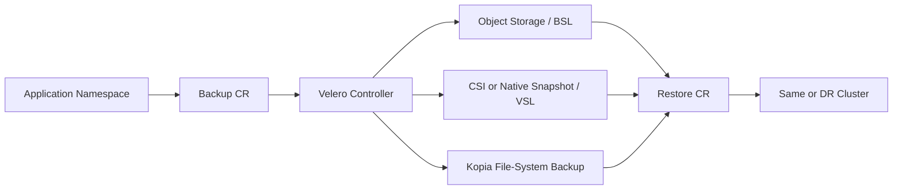
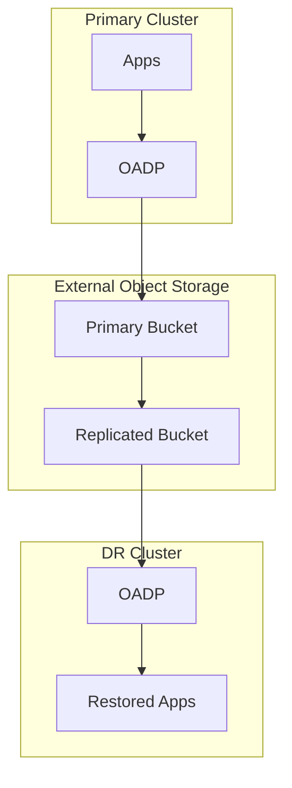

# Disaster Recovery Planning in OpenShift APIs for Data Protection — OADP

**Audience:** Advanced OpenShift Administrators / Platform Engineers with ~10 years of Linux, Kubernetes, storage, networking, and production operations experience.  
**Goal:** Build a practical, production-grade disaster recovery plan for OpenShift applications using **OpenShift APIs for Data Protection (OADP)**, Velero, CSI snapshots, Kopia file-system backup, schedules, restore validation, security controls, and tested runbooks.  
**Version note:** Always verify exact fields and support matrix for your OpenShift and OADP minor version. OADP capabilities evolve across 1.4, 1.5, and 1.6. In modern OADP, prefer **Kopia** for file-system backup; Restic as a new backup uploader is removed in OADP 1.6, while restoring older Restic backups remains supported through compatibility behavior.

---

## Table of Contents

1. [Executive Summary](#1-executive-summary)
2. [Where OADP Fits in OpenShift DR](#2-where-oadp-fits-in-openshift-dr)
3. [DR Terminology](#3-dr-terminology)
4. [Failure Scenarios](#4-failure-scenarios)
5. [OADP Architecture for DR](#5-oadp-architecture-for-dr)
6. [DR Planning Workflow](#6-dr-planning-workflow)
7. [Application Classification](#7-application-classification)
8. [Backup Method Selection](#8-backup-method-selection)
9. [BackupStorageLocation Design](#9-backupstoragelocation-design)
10. [VolumeSnapshotLocation Design](#10-volumesnapshotlocation-design)
11. [Consistency Planning](#11-consistency-planning)
12. [Security and Compliance](#12-security-and-compliance)
13. [Network and Performance](#13-network-and-performance)
14. [OADP Installation Readiness](#14-oadp-installation-readiness)
15. [Backup YAML Examples](#15-backup-yaml-examples)
16. [Restore YAML Examples](#16-restore-yaml-examples)
17. [Cross-Cluster / Cross-Region DR](#17-cross-cluster--cross-region-dr)
18. [Production DR Runbooks](#18-production-dr-runbooks)
19. [Validation and DR Drills](#19-validation-and-dr-drills)
20. [Monitoring and Alerting](#20-monitoring-and-alerting)
21. [Troubleshooting](#21-troubleshooting)
22. [Common Mistakes](#22-common-mistakes)
23. [Enterprise Checklist](#23-enterprise-checklist)
24. [Interview and Exam Notes](#24-interview-and-exam-notes)
25. [References](#25-references)

---

## 1. Executive Summary

In OpenShift, **disaster recovery planning** means designing, implementing, validating, and periodically rehearsing how you will recover business services after failure. OADP is the OpenShift-supported data protection framework that provides Kubernetes-native APIs for backing up and restoring applications, application-related cluster resources, persistent volumes, internal images, and supported virtual machine workloads.

For an experienced administrator, the most important point is this:

```text
OADP is application-level disaster recovery orchestration.
It is not a full replacement for OpenShift control-plane/etcd disaster recovery.
```

A production-grade DR design normally combines:

- **OADP** for application resources and persistent volume data.
- **etcd backup** for OpenShift control-plane state.
- **GitOps/IaC** for reproducible cluster and application configuration.
- **External object storage** for durable backup artifacts.
- **Storage replication or data mover** for cross-site data durability.
- **Application-native backups** for complex databases.
- **Restore tests** to prove the plan works.

A weak plan says: “Backup is scheduled.”  
A strong plan says: “Application `payment-prod` has 15-minute RPO, 1-hour RTO, off-cluster immutable object storage, tested namespace restore, PVC restore evidence, DNS cutover procedure, secret rotation process, and application owner sign-off.”

---

## 2. Where OADP Fits in OpenShift DR

OpenShift DR has several layers. OADP covers important application layers, but not all layers.

| Layer | Main Tool / Process | DR Purpose |
|---|---|---|
| OpenShift control plane state | etcd backup and restore | Recover cluster API state after serious control-plane failure or quorum loss |
| Cluster installation baseline | IaC, install-config, MachineConfig, GitOps | Rebuild platform consistently |
| Operators and CRDs | OLM, GitOps, subscriptions | Reinstall operators before restoring operands |
| Application manifests | OADP + GitOps | Restore app resources |
| Persistent application data | CSI snapshots, Kopia, storage-native replication, DB backup | Restore PVC data |
| Images | External registry replication, ImageStreams, OADP where applicable | Ensure pods can pull images after restore |
| Identity | External IdP backup, OAuth config, GitOps | Restore authentication and authorization |
| DNS / Ingress | DNS provider automation, routes, ingress config | Restore client access |
| Observability | Monitoring/logging backup, GitOps, external metrics/logs | Confirm service health after recovery |

### OADP vs etcd backup

| OADP | etcd Backup |
|---|---|
| Application-level backup and restore | Cluster state backup and restore |
| Uses Kubernetes APIs and Velero/OADP CRs | Uses etcd snapshot and static pod resources |
| Can restore selected namespaces/resources | Restores cluster to previous state |
| Useful for migration and app recovery | Used for serious control-plane disaster |
| Requires a working API server to run normally | Used when cluster state recovery is required |

**Production rule:** Take regular etcd backups and regular OADP backups. They solve different DR problems.

---

## 3. DR Terminology

### RPO — Recovery Point Objective

RPO answers: **How much data loss can the business accept?**

| RPO | Example Design |
|---:|---|
| 24 hours | Daily OADP schedule |
| 4 hours | 4-hour schedule + app data backup |
| 1 hour | Hourly OADP + database backup |
| 15 minutes | App/database replication + frequent metadata backup |
| Near zero | Active/active or synchronous replication; OADP used as metadata safety net |

### RTO — Recovery Time Objective

RTO answers: **How long can the service be unavailable?**

| RTO | Required Maturity |
|---:|---|
| 24 hours | Manual restore acceptable |
| 4 hours | Documented runbook and tested backups |
| 1 hour | Automated restore and warm target cluster |
| 15 minutes | Pre-provisioned DR environment and DNS automation |
| Near zero | Active/active design; backup is not the primary failover mechanism |

### RLO — Recovery Level Objective

RLO defines what “restored” means:

- Namespace restored only
- App resources restored
- PVC data restored
- Route/DNS restored
- External database connectivity restored
- Business transaction validated

### MTD — Maximum Tolerable Downtime

MTD is the business upper limit. Your RTO must be less than MTD.

---

## 4. Failure Scenarios

### Scenarios OADP handles well

| Scenario | OADP Value |
|---|---|
| Namespace deleted | Restore namespace and PVCs |
| Deployment, Route, ConfigMap, Secret damaged | Restore selected resources |
| PVC deleted | Restore PV/PVC data if protected |
| App migration to another cluster | Restore backup into target cluster |
| Pre-upgrade safety backup | Roll back app state if upgrade causes damage |
| Ransomware in namespace | Restore clean backup after isolation and validation |
| DR cluster rebuild | Restore workloads after new cluster and OADP are ready |
| OpenShift Virtualization backup | Protect supported VMs with KubeVirt/OADP features |

### Scenarios OADP alone does not solve

| Scenario | Why Not Enough | Additional Control |
|---|---|---|
| etcd quorum loss | OADP depends on cluster API | etcd backup and control-plane recovery |
| Complete site loss | Need target cluster and backup storage | IaC + external object storage + cross-site plan |
| External DB corruption | DB might not live in OpenShift PVC | DB-native backup/replication |
| Object bucket deletion | Backups are gone | Versioning, immutability, replication |
| IAM role deleted | OADP cannot access backups | Cloud IAM IaC and break-glass access |
| DNS provider failure | OADP does not own DNS zone state | DNS automation and backup |
| Storage array disaster | Local snapshots may be lost | Remote replication/data mover/object backup |

---

## 5. OADP Architecture for DR

OADP installs and manages Velero components on OpenShift.

| Component | Purpose |
|---|---|
| OADP Operator | Installs and reconciles OADP/Velero components |
| `DataProtectionApplication` | Main OADP configuration object |
| Velero server | Processes `Backup`, `Restore`, and `Schedule` CRs |
| Node Agent | Performs file-system backup/restore with Kopia |
| `Backup` | One backup operation |
| `Restore` | One restore operation |
| `Schedule` | Recurring backup policy using cron expression |
| `BackupStorageLocation` | Object storage for backup artifacts |
| `VolumeSnapshotLocation` | Provider-specific snapshot configuration |
| OpenShift plugin | OpenShift-specific resources |
| CSI plugin | CSI snapshot API integration |
| Cloud provider plugin | AWS/Azure/GCP/S3-compatible integration |
| KubeVirt plugin | OpenShift Virtualization workloads where enabled |

### Flow



### What goes where?

| Data | Stored In |
|---|---|
| Kubernetes objects | Object storage archive |
| Backup metadata and logs | Object storage and Backup CR status |
| CSI snapshot metadata | Object storage |
| Storage snapshots | Storage provider snapshot system |
| Kopia file-system backup data | Object storage repository |
| Restored objects | Target OpenShift API |
| Restored PV data | Target storage backend |

---

## 6. DR Planning Workflow

### Step 1 — Inventory applications

Collect per namespace:

- Owner and escalation contact
- Business criticality
- RPO/RTO
- PVCs and storage classes
- Routes and external DNS
- Secrets and certificates
- Operators and CRDs
- External services and databases
- Image sources
- Network policies
- Backup labels
- Restore validation method

Commands:

```bash
oc get ns
oc get all -n <namespace>
oc get pvc,pv -n <namespace>
oc get route,ingress -n <namespace>
oc get secret,configmap -n <namespace>
oc get sa,role,rolebinding -n <namespace>
oc get csv,subscription,installplan -n <namespace>
oc get networkpolicy -n <namespace>
```

### Step 2 — Classify by tier

| Tier | RPO | RTO | Backup Pattern | Restore Test |
|---|---:|---:|---|---|
| Tier 0 | 0-15 min | < 1h | App replication + OADP metadata/data backup | Monthly |
| Tier 1 | 1h | 1-4h | Hourly or 2-hour schedule | Quarterly |
| Tier 2 | 4-12h | 8h | Daily OADP backup | Twice yearly |
| Tier 3 | 24h+ | 24h+ | Daily/weekly backup | Yearly |

### Step 3 — Select backup method

For each app decide:

- Resource-only backup
- CSI snapshot
- Native cloud snapshot
- Kopia file-system backup
- App-native backup plus OADP

### Step 4 — Define backup policy

Policy must include:

- Included namespaces
- Label selectors
- Excluded resources
- Backup frequency
- TTL
- Storage location
- Volume method
- Hooks
- Security controls
- Validation process

### Step 5 — Define restore policy

Policy must include:

- Restore target: same namespace, mapped namespace, or DR cluster
- Restore order
- Operator prerequisites
- StorageClass mapping
- Route/DNS handling
- Secret rotation
- Health checks
- Owner sign-off

### Step 6 — Test and improve

A backup is not production-ready until a restore is proven.

---

## 7. Application Classification

### Example classification sheet

| App | Namespace | Tier | RPO | RTO | Data | Method | Test Frequency |
|---|---|---:|---:|---:|---|---|---|
| Payment API | `payment-prod` | 0 | 15m | 30m | External DB + PVC config | DB replication + OADP | Monthly |
| Jenkins | `jenkins-prod` | 1 | 4h | 2h | PVC home | OADP + Kopia/CSI | Quarterly |
| HR Portal | `hr-prod` | 2 | 12h | 8h | PVC uploads | Daily OADP | Twice yearly |
| Static Docs | `docs-prod` | 3 | 24h | 24h | Git only | GitOps + resource backup | Yearly |

### Recommended labels

```yaml
backup-enabled: "true"
backup-tier: tier1
app.kubernetes.io/name: payroll
app.kubernetes.io/part-of: finance-suite
app.kubernetes.io/managed-by: gitops
```

Use labels to build predictable backup selection.

---

## 8. Backup Method Selection

### Resource-only backup

Use for stateless apps or apps whose data lives outside OpenShift.

Pros:

- Fast
- Small
- Portable

Cons:

- Does not protect PVC data

### CSI snapshot backup

Use when the storage class supports CSI snapshots.

Pros:

- Fast
- Efficient
- Good for large block volumes

Cons:

- Often tied to storage backend or region
- Usually crash-consistent unless quiesced

### Kopia file-system backup

Use when snapshot support is missing or cross-storage portability is required.

Pros:

- Works with many volume types
- Stores data in object storage
- Useful for migration

Cons:

- Slower for large data sets
- More CPU/network usage
- Requires node agent
- Consistency depends on application behavior

### Application-native backup

Use for databases and complex stateful systems.

Examples:

- PostgreSQL base backup + WAL archive
- MySQL dump/binlog backup
- MongoDB backup
- Kafka replication

Best practice:

```text
Application-native backup + OADP metadata backup + tested restore
```

### Decision table

| Workload | Recommended DR Protection |
|---|---|
| Stateless frontend | GitOps + OADP resource backup |
| App with external DB | OADP metadata + external DB backup |
| Simple PVC app | CSI snapshot or Kopia |
| NFS-backed app | Kopia |
| PostgreSQL on PVC | DB backup + CSI/Kopia + hooks |
| Jenkins | OADP + PVC backup + plugin validation |
| VM | OADP KubeVirt support + supported volume protection |

---

## 9. BackupStorageLocation Design

`BackupStorageLocation` defines where Velero/OADP stores backup data.

A production BSL should be:

- Outside the cluster failure domain
- Encrypted
- Versioned
- Protected from deletion
- Replicated for critical workloads
- Audited
- Monitored
- Tested from a DR cluster

### Bad design

```text
Cluster PVs, snapshots, and OADP object bucket all live on the same unreplicated storage platform.
```

If storage fails, both workloads and backups may be lost.

### Better design

```text
Cluster A writes backups to external S3-compatible object storage.
Bucket versioning and immutability are enabled.
Bucket replicates to another region/site.
Cluster B can read the replicated backup for restore.
```

### Verify BSL

```bash
oc get backupstoragelocations.velero.io -n openshift-adp
oc describe backupstoragelocation <bsl-name> -n openshift-adp
```

Expected:

```text
PHASE: Available
DEFAULT: true
LAST VALIDATED: recent
```

### Object storage controls

- Dedicated bucket or prefix
- Server-side encryption
- TLS endpoint
- Versioning
- Object lock / immutability where required
- Lifecycle policy aligned with OADP TTL
- Least-privilege credentials
- Separate write and delete/admin roles
- Cross-region replication for Tier 0/Tier 1

---

## 10. VolumeSnapshotLocation Design

`VolumeSnapshotLocation` defines provider-specific snapshot configuration.

Before using snapshots, answer:

- Does the storage class support CSI snapshots?
- Is `VolumeSnapshotClass` present?
- Is the CSI snapshot controller healthy?
- Are snapshots restorable in another cluster?
- Are snapshots region-bound?
- Are snapshots encrypted?
- Who can delete snapshots?
- Do snapshots meet RPO/RTO?

### Validate CSI snapshot support

```bash
oc get crd | grep snapshot.storage.k8s.io
oc get volumesnapshotclass
oc get volumesnapshot -A
oc get volumesnapshotcontent
```

### Label VolumeSnapshotClass for Velero CSI

```bash
oc label volumesnapshotclass <snapshot-class-name> \
  velero.io/csi-volumesnapshot-class=true
```

Example:

```yaml
apiVersion: snapshot.storage.k8s.io/v1
kind: VolumeSnapshotClass
metadata:
  name: csi-snapclass
  labels:
    velero.io/csi-volumesnapshot-class: "true"
driver: <csi-driver-name>
deletionPolicy: Delete
```

Use `Delete` or `Retain` according to retention governance. Do not manually delete OADP-managed snapshots unless your runbook says so.

---

## 11. Consistency Planning

### Types of consistency

| Type | Meaning |
|---|---|
| Crash-consistent | Like sudden power loss; app must recover on restart |
| Application-consistent | App flushes buffers or pauses writes before backup |
| Transaction-consistent | Database guarantees committed transaction recovery |

### Kubernetes object consistency

Backups are not a global atomic snapshot of every changing API object. Avoid high-change windows for critical workloads or rely on GitOps for declarative state.

### PVC consistency

For databases:

- Raw CSI snapshot is usually crash-consistent.
- Live file-system backup may be unsafe without app support.
- DB-native backup is safer for point-in-time recovery.

### Backup hooks

Hooks can run commands before/after backup or restore.

Example annotation:

```yaml
apiVersion: apps/v1
kind: Deployment
metadata:
  name: app-with-hook
  namespace: app-prod
spec:
  template:
    metadata:
      annotations:
        pre.hook.backup.velero.io/container: app
        pre.hook.backup.velero.io/command: '["/bin/sh", "-c", "sync && echo pre-backup"]'
        post.hook.backup.velero.io/container: app
        post.hook.backup.velero.io/command: '["/bin/sh", "-c", "echo post-backup"]'
```

For advanced storage/database workloads, hooks might perform:

- Database checkpoint
- `fsfreeze`
- Maintenance mode enable/disable
- Queue pause/resume
- Cache flush

Test hooks carefully. A failed unfreeze or hung command can create outages.

---

## 12. Security and Compliance

Backups can contain sensitive data:

- Kubernetes Secrets
- TLS private keys
- Pull secrets
- Database credentials
- OAuth client secrets
- Application data inside PVCs
- Personally identifiable or regulated data

### Security controls

| Control | Why |
|---|---|
| Encrypt object storage | Protect data at rest |
| TLS to S3 endpoint | Protect data in transit |
| Least privilege IAM | Reduce blast radius |
| Restrict delete permission | Ransomware resilience |
| Bucket versioning | Recover accidental delete/overwrite |
| Object lock | Immutability for critical backups |
| Audit logs | Forensics and compliance |
| Secret rotation after restore | Prevent stale/compromised credentials |
| RBAC for backup/restore | Prevent unauthorized restore/delete |

### Suggested RBAC model

| Role | Permissions |
|---|---|
| Backup viewer | View backups and schedules |
| App backup operator | Create backups for allowed namespaces |
| App restore operator | Restore to non-prod/test namespaces |
| DR admin | Restore production during declared DR |
| Backup storage admin | Manage object storage retention/replication |
| Security auditor | Review reports and audit logs |

### Ransomware protection

For critical workloads:

- Use object lock or immutability.
- Replicate bucket to another account/region.
- Separate backup write and delete permissions.
- Alert on backup deletion.
- Test restore from older clean backups.

---

## 13. Network and Performance

OADP performance depends heavily on network stability, object storage latency, storage speed, API responsiveness, and Velero/node-agent resources.

### Network checks

```bash
oc get pods -n openshift-adp
oc rsh -n openshift-adp deploy/velero
# Inside container, test DNS/TLS/object endpoint if tools are present.
```

Validate:

- DNS resolution for object endpoint
- TLS trust chain
- Proxy/noProxy settings
- Firewall rules
- Egress from `openshift-adp`
- S3-compatible endpoint availability

### Performance questions

- How many namespaces are backed up?
- How many PVCs and how large?
- Are backups staggered?
- Is object storage remote/high-latency?
- Is Velero OOMKilled?
- Are node agents scheduled on all required nodes?
- Does backup overlap peak business traffic?

### Good scheduling practice

Do not run all backups at the same minute.

| Tier | Example Schedule |
|---|---|
| Tier 0 | App-native replication + frequent OADP metadata backup |
| Tier 1 | Hourly, staggered by namespace group |
| Tier 2 | Daily off-peak |
| Tier 3 | Weekly or daily low priority |

---

## 14. OADP Installation Readiness

### Check OpenShift and OADP

```bash
oc version
oc get clusterversion
oc get csv -A | grep -i oadp || true
oc get subscription -A | grep -i oadp || true
```

### Common namespace

```text
openshift-adp
```

### Check OADP resources

```bash
oc get pods -n openshift-adp
oc get dpa -n openshift-adp
oc get backupstoragelocations.velero.io -n openshift-adp
oc get volumesnapshotlocations.velero.io -n openshift-adp
```

### Example cloud credentials secret

`credentials-velero`:

```ini
[default]
aws_access_key_id=<access-key>
aws_secret_access_key=<secret-key>
```

Create secret:

```bash
oc create secret generic cloud-credentials \
  -n openshift-adp \
  --from-file cloud=./credentials-velero
```

### Example DPA for S3-compatible storage, CSI, and Kopia

Adjust to your exact OADP version and storage provider.

```yaml
apiVersion: oadp.openshift.io/v1alpha1
kind: DataProtectionApplication
metadata:
  name: oadp-dr
  namespace: openshift-adp
spec:
  configuration:
    nodeAgent:
      enable: true
      uploaderType: kopia
    velero:
      defaultPlugins:
      - openshift
      - aws
      - csi
      defaultVolumesToFsBackup: false
      defaultSnapshotMoveData: true
      podConfig:
        resourceAllocations:
          requests:
            cpu: 500m
            memory: 512Mi
          limits:
            cpu: "2"
            memory: 2Gi
  backupLocations:
  - velero:
      provider: aws
      default: true
      credential:
        name: cloud-credentials
        key: cloud
      objectStorage:
        bucket: <bucket-name>
        prefix: <cluster-or-environment-prefix>
      config:
        region: <region>
        s3Url: <https://s3-endpoint.example.com>
        s3ForcePathStyle: "true"
  snapshotLocations:
  - velero:
      provider: aws
      config:
        region: <region>
```

### Readiness validation

```bash
oc get dpa -n openshift-adp -o yaml
oc get backupstoragelocations.velero.io -n openshift-adp
oc get pods -n openshift-adp
```

Expected:

- `DataProtectionApplication` reconciled successfully
- `BackupStorageLocation` phase `Available`
- Velero pod running
- Node agent pods running if file-system backup is enabled

---

## 15. Backup YAML Examples

### One-time namespace backup

```yaml
apiVersion: velero.io/v1
kind: Backup
metadata:
  name: hr-prod-manual-20260703
  namespace: openshift-adp
spec:
  includedNamespaces:
  - hr-prod
  storageLocation: primary-s3
  ttl: 720h0m0s
```

Commands:

```bash
oc apply -f backup-hr-prod.yaml
oc get backup -n openshift-adp hr-prod-manual-20260703 -o yaml
oc describe backup hr-prod-manual-20260703 -n openshift-adp
velero backup describe hr-prod-manual-20260703 --details
```

### Scheduled daily backup

```yaml
apiVersion: velero.io/v1
kind: Schedule
metadata:
  name: daily-hr-prod
  namespace: openshift-adp
spec:
  schedule: "0 1 * * *"
  template:
    includedNamespaces:
    - hr-prod
    storageLocation: primary-s3
    ttl: 720h0m0s
```

Verify:

```bash
oc get schedule -n openshift-adp
oc describe schedule daily-hr-prod -n openshift-adp
oc get backup -n openshift-adp | grep daily-hr-prod
```

### Hourly Tier 1 backup

```yaml
apiVersion: velero.io/v1
kind: Schedule
metadata:
  name: hourly-payment-prod
  namespace: openshift-adp
spec:
  schedule: "15 * * * *"
  template:
    includedNamespaces:
    - payment-prod
    storageLocation: primary-s3
    ttl: 168h0m0s
```

### Backup with resource exclusions

```yaml
apiVersion: velero.io/v1
kind: Backup
metadata:
  name: app-prod-clean
  namespace: openshift-adp
spec:
  includedNamespaces:
  - app-prod
  excludedResources:
  - events
  - events.events.k8s.io
  - endpoints
  - endpointslices.discovery.k8s.io
  - pods
  - replicasets.apps
  storageLocation: primary-s3
  ttl: 720h0m0s
```

### Backup with Kopia file-system backup

```yaml
apiVersion: velero.io/v1
kind: Backup
metadata:
  name: nfs-app-fsb-20260703
  namespace: openshift-adp
spec:
  includedNamespaces:
  - nfs-app-prod
  storageLocation: primary-s3
  defaultVolumesToFsBackup: true
  ttl: 720h0m0s
```

Verify:

```bash
oc get podvolumebackups.velero.io -n openshift-adp
oc describe podvolumebackup <name> -n openshift-adp
```

### Pre-change backup

```bash
BACKUP_NAME="pre-change-$(date +%Y%m%d-%H%M)"
cat <<EOM | oc apply -f -
apiVersion: velero.io/v1
kind: Backup
metadata:
  name: ${BACKUP_NAME}
  namespace: openshift-adp
spec:
  includedNamespaces:
  - app-prod
  storageLocation: primary-s3
  ttl: 168h0m0s
EOM

oc wait backup/${BACKUP_NAME} -n openshift-adp \
  --for=jsonpath='{.status.phase}'=Completed \
  --timeout=60m
```

---

## 16. Restore YAML Examples

### Restore to same namespace

```yaml
apiVersion: velero.io/v1
kind: Restore
metadata:
  name: restore-hr-prod-20260703
  namespace: openshift-adp
spec:
  backupName: hr-prod-manual-20260703
  restorePVs: true
  excludedResources:
  - nodes
  - events
  - events.events.k8s.io
  - backups.velero.io
  - restores.velero.io
```

Verify:

```bash
oc get restore -n openshift-adp restore-hr-prod-20260703 -o yaml
oc get all -n hr-prod
oc get pvc -n hr-prod
```

### Restore to different namespace

```yaml
apiVersion: velero.io/v1
kind: Restore
metadata:
  name: restore-hr-prod-to-drtest
  namespace: openshift-adp
spec:
  backupName: hr-prod-manual-20260703
  namespaceMapping:
    hr-prod: hr-drtest
  restorePVs: true
```

After namespace mapping, validate and patch environment-specific items:

- Routes
- ConfigMaps
- External endpoints
- Secrets
- NetworkPolicies
- ResourceQuotas

### Restore selected resources only

```yaml
apiVersion: velero.io/v1
kind: Restore
metadata:
  name: restore-app-config-only
  namespace: openshift-adp
spec:
  backupName: app-prod-backup
  includedResources:
  - configmaps
  - secrets
  includedNamespaces:
  - app-prod
  restorePVs: false
```

### Restore without PVs

```yaml
apiVersion: velero.io/v1
kind: Restore
metadata:
  name: restore-app-metadata-only
  namespace: openshift-adp
spec:
  backupName: app-prod-backup
  restorePVs: false
```

---

## 17. Cross-Cluster / Cross-Region DR

Cross-cluster restore requires more planning than same-cluster restore.

### Target cluster prerequisites

- Compatible OpenShift version
- Compatible OADP version
- OADP installed
- Access to same or replicated object bucket
- Required operators installed
- Required CRDs present
- Compatible storage classes
- Compatible CSI drivers
- Image registry access
- DNS/Route strategy
- Network policies and egress rules
- Secret rotation or restore plan

### Recommended architecture



### Restore order

1. Build or validate DR cluster.
2. Install OADP.
3. Configure BSL access.
4. Install required operators and CRDs.
5. Restore namespaces and RBAC.
6. Restore secrets/config.
7. Restore PVC data.
8. Restore workload controllers.
9. Restore services/routes.
10. Patch environment-specific values.
11. Run health checks.
12. Cut over DNS.
13. Record RPO/RTO achieved.

### Common cross-cluster issues

| Issue | Fix |
|---|---|
| StorageClass missing | Create equivalent class or use restore modification |
| Route hostname conflict | Restore without routes or patch hostnames |
| Missing CRD | Install operator first |
| Image pull failure | Replicate image or restore pull secret |
| PVC pending | Validate CSI driver, quota, storage class, topology |
| App starts but unhealthy | Validate external DB, secrets, endpoints, NetworkPolicy |

---

## 18. Production DR Runbooks

### Runbook A — Namespace deleted

```bash
NS=app-prod
BACKUP=<known-good-backup>
RESTORE="restore-${NS}-$(date +%Y%m%d-%H%M)"

oc get backup -n openshift-adp $BACKUP -o jsonpath='{.status.phase}{"\n"}'

cat <<EOM | oc apply -f -
apiVersion: velero.io/v1
kind: Restore
metadata:
  name: ${RESTORE}
  namespace: openshift-adp
spec:
  backupName: ${BACKUP}
  restorePVs: true
  excludedResources:
  - nodes
  - events
  - events.events.k8s.io
  - backups.velero.io
  - restores.velero.io
EOM

oc get restore -n openshift-adp $RESTORE -w
oc get all,pvc,route -n $NS
```

Validation:

- Pods running
- PVCs bound
- Route works
- App owner confirms data

### Runbook B — PVC corruption

1. Stop writes.

```bash
oc scale deploy/<app> -n <namespace> --replicas=0
```

2. Restore from known-good backup into test namespace first.

```yaml
apiVersion: velero.io/v1
kind: Restore
metadata:
  name: restore-data-validation
  namespace: openshift-adp
spec:
  backupName: <backup-name>
  namespaceMapping:
    app-prod: app-restore-test
  restorePVs: true
```

3. Validate data.

```bash
oc get pvc -n app-restore-test
oc rsh -n app-restore-test <pod>
ls -lah /data
```

4. Promote restored data according to application runbook.

### Runbook C — Primary cluster lost

1. Declare DR event.
2. Stop changes on primary if reachable.
3. Confirm DR cluster access.
4. Install/validate OADP.
5. Confirm BSL is available.
6. Confirm backups are visible.
7. Install required operators.
8. Restore Tier 0 apps first.
9. Validate services.
10. Cut over DNS.
11. Communicate service status.
12. Document achieved RTO/RPO.

Commands:

```bash
oc get pods -n openshift-adp
oc get dpa -n openshift-adp
oc get backupstoragelocation -n openshift-adp
oc get backup -n openshift-adp
oc get csv -A
```

### Runbook D — Ransomware / malicious deletion

1. Preserve evidence.
2. Isolate affected namespace.
3. Stop compromised workloads.
4. Identify last clean backup.
5. Restore to quarantine namespace.
6. Scan and validate.
7. Rotate secrets.
8. Restore to production or cut over.
9. Review audit logs.
10. Improve controls.

Example quarantine restore:

```yaml
apiVersion: velero.io/v1
kind: Restore
metadata:
  name: restore-clean-to-quarantine
  namespace: openshift-adp
spec:
  backupName: <clean-backup>
  namespaceMapping:
    compromised-prod: quarantine-restore
  restorePVs: true
```

---

## 19. Validation and DR Drills

### Backup validation commands

```bash
oc get backup -n openshift-adp <backup-name> -o jsonpath='{.status.phase}{"\n"}'
oc describe backup <backup-name> -n openshift-adp
velero backup describe <backup-name> --details
velero backup logs <backup-name>
```

Check:

- Phase is `Completed`
- No critical errors
- Expected namespaces included
- Expected resources included
- Expected PVC/snapshot/file-system backups included
- TTL correct
- Backup size reasonable

### Restore validation commands

```bash
oc get restore -n openshift-adp <restore-name> -o yaml
oc get all -n <namespace>
oc get pvc -n <namespace>
oc get route -n <namespace>
oc get events -n <namespace> --sort-by=.lastTimestamp | tail -50
```

### App validation checklist

| Check | Pass Criteria |
|---|---|
| Pods | Running/Ready |
| PVCs | Bound |
| Services | Endpoints exist |
| Routes | HTTP/HTTPS works |
| Logs | No fatal errors |
| Data | Expected records/files present |
| Login | Works |
| Dependencies | Reachable |
| Monitoring | Targets healthy |

### DR drill report template

```markdown
# DR Drill Report

Application:
Namespace:
Backup name:
Backup timestamp:
Restore name:
Target cluster/namespace:
RPO target:
RPO achieved:
RTO target:
RTO achieved:
Data validation:
Application owner sign-off:
Issues:
Corrective actions:
Next drill date:
```

### Recommended drill frequency

| Tier | Restore Test Frequency |
|---|---|
| Tier 0 | Monthly |
| Tier 1 | Quarterly |
| Tier 2 | Twice yearly |
| Tier 3 | Yearly |

---

## 20. Monitoring and Alerting

Monitor:

- Backup failures
- Restore failures
- No recent successful backup within RPO
- BSL unavailable
- Velero pod restarts
- Velero OOMKilled
- Node agent failures
- PodVolumeBackup failures
- PodVolumeRestore failures
- Snapshot failures
- Backup repository maintenance failures
- Object storage capacity and access errors

Commands:

```bash
oc get backup -n openshift-adp
oc get restore -n openshift-adp
oc get schedule -n openshift-adp
oc get backupstoragelocation -n openshift-adp
oc get podvolumebackup -n openshift-adp
oc get podvolumerestore -n openshift-adp
oc logs deploy/velero -n openshift-adp
```

Example status script:

```bash
#!/usr/bin/env bash
set -euo pipefail
NS=openshift-adp

echo "== BackupStorageLocations =="
oc get backupstoragelocations.velero.io -n $NS

echo "== Recent backups =="
oc get backups.velero.io -n $NS --sort-by=.metadata.creationTimestamp | tail -20

echo "== Failed backups =="
oc get backups.velero.io -n $NS -o jsonpath='{range .items[*]}{.metadata.name}{"\t"}{.status.phase}{"\n"}{end}' \
  | egrep 'Failed|PartiallyFailed' || true
```

---

## 21. Troubleshooting

### Backup stuck in `InProgress`

```bash
oc describe backup <backup-name> -n openshift-adp
oc logs deploy/velero -n openshift-adp --tail=200
oc get podvolumebackup -n openshift-adp
oc get volumesnapshot -A
```

Possible causes:

- CSI snapshot pending
- Object storage slow/unreachable
- Velero resource limit too low
- Node agent missing
- Hook hung
- API server slow

### BSL unavailable

```bash
oc get backupstoragelocation -n openshift-adp
oc describe backupstoragelocation <bsl> -n openshift-adp
oc logs deploy/velero -n openshift-adp | grep -i error
```

Possible causes:

- Wrong S3 URL
- Wrong region
- Invalid credentials
- Expired STS/IAM token
- Custom CA missing
- Proxy/noProxy issue
- Bucket policy changed

### Restore completed but pods fail

```bash
oc get pods -n <namespace>
oc describe pod <pod> -n <namespace>
oc get pvc -n <namespace>
oc describe pvc <pvc> -n <namespace>
oc get events -n <namespace> --sort-by=.lastTimestamp | tail -100
```

Possible causes:

- Missing StorageClass
- PVC pending
- Missing image pull secret
- Missing CRD/operator
- SCC/security context issue
- Route conflict
- External DB unavailable
- NetworkPolicy blocking traffic

### Missing CRD during restore

Install the operator first:

```bash
oc get crd | grep <kind>
oc get csv -A | grep <operator>
```

Then restore custom resources.

### Velero OOMKilled

```bash
oc describe pod -n openshift-adp -l deploy=velero
oc logs deploy/velero -n openshift-adp --previous
```

Increase DPA resource allocation:

```yaml
spec:
  configuration:
    velero:
      podConfig:
        resourceAllocations:
          requests:
            cpu: 500m
            memory: 1Gi
          limits:
            cpu: "2"
            memory: 4Gi
```

---

## 22. Common Mistakes

1. Treating OADP as a full cluster backup replacement.
2. Not taking etcd backups.
3. Keeping backup object storage inside the same failure domain.
4. Using snapshots without remote replication.
5. Never testing restore.
6. Backing up operators incorrectly instead of reinstalling them first.
7. Ignoring external databases and services.
8. Not protecting backup storage from deletion.
9. Not defining RPO/RTO per app.
10. Not documenting DNS and route changes.
11. Forgetting secret rotation after restore.
12. Scheduling all backups at the same minute.
13. Not monitoring BSL availability.
14. Not validating PVC restore.
15. Assuming successful backup equals successful recovery.

---

## 23. Enterprise Checklist

### Platform

- [ ] etcd backup schedule exists.
- [ ] etcd backups are stored securely off-cluster.
- [ ] Cluster install/IaC is version controlled.
- [ ] Operators are managed through GitOps or documented OLM process.
- [ ] OADP version is supported for OpenShift version.
- [ ] DPA is reconciled.
- [ ] Velero is running.
- [ ] Node agent is running where needed.

### Backup storage

- [ ] BSL is `Available`.
- [ ] Object storage is external to cluster failure domain.
- [ ] Encryption enabled.
- [ ] Versioning enabled.
- [ ] Immutability/object lock enabled where required.
- [ ] Cross-region replication configured for critical workloads.
- [ ] Delete permissions restricted.
- [ ] Audit logging enabled.

### Volume protection

- [ ] Storage classes inventoried.
- [ ] CSI snapshot support validated.
- [ ] VolumeSnapshotClass configured.
- [ ] Kopia enabled where snapshots are not enough.
- [ ] Large PVC restore time measured.
- [ ] Cross-cluster storage mapping documented.

### Application

- [ ] App inventory complete.
- [ ] RPO/RTO defined.
- [ ] Backup schedule mapped to RPO.
- [ ] Restore runbook mapped to RTO.
- [ ] External dependencies documented.
- [ ] Secret rotation plan exists.
- [ ] Route/DNS cutover plan exists.
- [ ] Owner validation checklist exists.

### Validation

- [ ] Backups monitored.
- [ ] Restore drills performed by tier.
- [ ] DR drill reports retained.
- [ ] Corrective actions tracked.
- [ ] Application owners sign off.

---

## 24. Interview and Exam Notes

### Explain OADP DR planning

OADP DR planning is the process of defining how OpenShift applications and their persistent data are backed up, stored, secured, restored, and validated. It includes selecting namespaces/resources, choosing CSI snapshots or Kopia for volumes, scheduling backups based on RPO, designing restore workflows based on RTO, protecting backup storage, testing restores, and integrating with etcd backup, GitOps, identity, DNS, and application-native backup.

### BackupStorageLocation

`BackupStorageLocation` defines where OADP/Velero stores backup artifacts such as Kubernetes object archives, metadata, logs, and file-system backup repositories.

### VolumeSnapshotLocation

`VolumeSnapshotLocation` defines provider-specific configuration for persistent volume snapshots.

### CSI snapshot vs Kopia

| CSI Snapshot | Kopia File-System Backup |
|---|---|
| Storage snapshot | File-level backup |
| Fast for supported storage | Portable across more volume types |
| Storage/provider dependent | Object-storage based |
| Usually crash-consistent | Depends on app/file consistency |
| Good for large block volumes | Useful where snapshots are unavailable |

### Why exclude operators?

Restore the operator through OLM/GitOps first, then restore the custom resources and data. This avoids stale CSV/subscription/operator pod conflicts.

### What makes backup DR-ready?

A backup is DR-ready only when:

- It completed successfully.
- It contains expected resources and data.
- It is stored outside the failure domain.
- It is protected from deletion/tampering.
- It has been restored successfully.
- Application owner validated service and data.

---

## 25. References

Validate all production steps against your exact OpenShift/OADP version.

1. Red Hat OpenShift Container Platform 4.21 Backup and Restore documentation  
   https://docs.redhat.com/en/documentation/openshift_container_platform/4.21/html-single/backup_and_restore/index

2. Red Hat OpenShift Service on AWS Backup and Restore / OADP documentation  
   https://docs.redhat.com/en/documentation/red_hat_openshift_service_on_aws/4/html-single/backup_and_restore/index

3. Red Hat OADP FAQ  
   https://access.redhat.com/articles/5456281

4. Velero BackupStorageLocation and VolumeSnapshotLocation documentation  
   https://velero.io/docs/main/locations/

5. Velero File System Backup documentation  
   https://velero.io/docs/main/file-system-backup/

---

## Final Practical Summary

For a senior OpenShift administrator:

```text
OADP is not just backup YAML.
OADP is application recovery architecture.
```

A real OADP DR plan defines:

- What is protected
- What is excluded
- Backup frequency and TTL
- Where backups are stored
- How PVCs are protected
- How backups are secured
- How restores are performed
- How success is validated
- How RPO/RTO are measured
- How OADP integrates with etcd backup, GitOps, storage replication, DNS, identity, and application-native backup

The real test is not whether the backup completed.  
The real test is whether the business service can be restored within the agreed RPO/RTO during a real incident.
