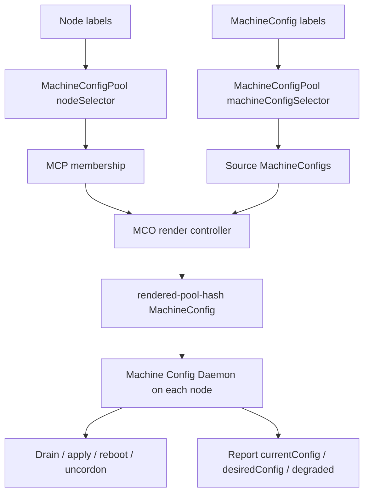

# MachineConfigPool in OpenShift: Cluster Partitioning and Dedicated Node Pools

**Audience:** Advanced OpenShift Administration / DO380-style senior administrator notes  
**Experience level:** 10+ years Linux, Kubernetes, OpenShift, platform operations  
**Focus area:** Cluster Partitioning and Dedicated Node Pools  
**Resource:** `MachineConfigPool` / `mcp` / `machineconfiguration.openshift.io/v1`

---

## 1. Executive summary

A **MachineConfigPool**, commonly called an **MCP**, is the OpenShift object that groups nodes for **host-level operating system and runtime configuration management**. It is managed by the **Machine Config Operator** and is one of the most important resources when you partition an OpenShift cluster into dedicated node pools such as:

- default worker nodes
- infrastructure nodes
- logging nodes
- monitoring nodes
- storage nodes
- GPU nodes
- application-specific nodes
- canary update pools
- hardware-specific pools
- low-latency / performance-tuned pools

A MachineConfigPool is not only a scheduling concept. It is a **node lifecycle and configuration boundary**. It controls which nodes receive which rendered machine configuration, how many nodes can be unavailable during an update, whether a pool is paused, and whether the pool is healthy, updating, or degraded.

In simple words:

> **Node labels decide pool membership. MachineConfig labels decide what configuration applies to that pool. The Machine Config Operator renders the final configuration and rolls it out node by node.**

For a senior OpenShift administrator, MCPs are critical because a mistake at this layer can reboot worker nodes, make nodes degraded, pause certificate rotation, delay upgrades, or accidentally apply host-level changes to a larger set of nodes than intended.

---

## 2. Where MachineConfigPool fits in OpenShift architecture

OpenShift uses the **Machine Config Operator**, or **MCO**, to manage host-level configuration on RHCOS-based nodes. The MCO manages operating system and runtime-level settings such as:

- RHCOS updates
- kernel arguments
- systemd units
- files under the host filesystem
- CRI-O configuration
- kubelet configuration
- NetworkManager configuration
- container registry configuration
- node reboot orchestration
- drift detection

The MCO is built around several components:

| Component | Purpose |
|---|---|
| `machine-config-controller` | Watches MachineConfigs, MachineConfigPools, KubeletConfig, ContainerRuntimeConfig, and coordinates rendered configuration generation and rollout. |
| `machine-config-daemon` | Runs on every node. Applies the desired rendered config, drains when required, reboots when required, and reports node config status. |
| `machine-config-server` | Provides Ignition configuration to machines joining the cluster. |
| `MachineConfig` | Declarative host-level configuration object. |
| `MachineConfigPool` | Groups nodes and selects the MachineConfigs that should apply to those nodes. |
| rendered MachineConfig | Generated final config, for example `rendered-worker-xxxxx`, created by combining source MachineConfigs. |

A normal OpenShift cluster starts with at least two primary MCPs:

```bash
oc get mcp
```

Typical output:

```text
NAME      CONFIG                                             UPDATED   UPDATING   DEGRADED   MACHINECOUNT   READYMACHINECOUNT   UPDATEDMACHINECOUNT   DEGRADEDMACHINECOUNT
master    rendered-master-xxxxx                             True      False      False      3              3                   3                     0
worker    rendered-worker-yyyyy                             True      False      False      6              6                   6                     0
```

In newer OpenShift versions, the control plane MCP might still be named `master`, even though documentation and UI increasingly use the term **control plane**.

---

## 3. Why MCP matters in cluster partitioning

Cluster partitioning means dividing the cluster into logical and operational pools so that different types of workloads run on different nodes and different nodes receive different host-level configurations.

There are two sides to cluster partitioning:

### 3.1 Scheduling partitioning

This controls **where pods run**.

Common objects and mechanisms:

- node labels
- node selectors
- project node selectors
- taints and tolerations
- pod affinity / anti-affinity
- topology spread constraints
- scheduler profiles
- workload placement policies

Example:

```bash
oc label node worker-1 node-role.kubernetes.io/infra=
oc adm taint nodes worker-1 node-role.kubernetes.io/infra=:NoSchedule
```

This affects scheduling.

### 3.2 Machine configuration partitioning

This controls **what host-level configuration nodes receive**.

Common objects:

- `MachineConfigPool`
- `MachineConfig`
- `KubeletConfig`
- `ContainerRuntimeConfig`
- `PerformanceProfile`
- `Tuned` profiles

Example:

```yaml
apiVersion: machineconfiguration.openshift.io/v1
kind: MachineConfigPool
metadata:
  name: infra
spec:
  machineConfigSelector:
    matchExpressions:
      - key: machineconfiguration.openshift.io/role
        operator: In
        values:
          - worker
          - infra
  nodeSelector:
    matchLabels:
      node-role.kubernetes.io/infra: ""
```

This affects host configuration and node lifecycle.

### 3.3 Senior-admin rule

Do not confuse these three concepts:

| Concept | Controls | Example |
|---|---|---|
| MachineSet | Creates machines on supported platforms | AWS/Azure/vSphere worker machines |
| MachineConfigPool | Applies host-level configuration to selected nodes | infra MCP, GPU MCP, canary MCP |
| Scheduler placement | Places pods onto nodes | taints, tolerations, node selectors |

A node can be created by one MachineSet, belong to one MachineConfigPool, and accept many different workloads depending on scheduling policy.

---

## 4. What exactly is a MachineConfigPool?

A **MachineConfigPool** describes a pool of MachineConfigs and the machines/nodes they apply to.

It has two important selectors:

```yaml
spec:
  machineConfigSelector: {}
  nodeSelector: {}
```

### 4.1 `spec.nodeSelector`

This selects **which nodes belong to the pool**.

Example:

```yaml
nodeSelector:
  matchLabels:
    node-role.kubernetes.io/infra: ""
```

Any node with this label becomes part of the `infra` MCP.

### 4.2 `spec.machineConfigSelector`

This selects **which MachineConfigs are included in the rendered configuration for that pool**.

Example:

```yaml
machineConfigSelector:
  matchExpressions:
    - key: machineconfiguration.openshift.io/role
      operator: In
      values:
        - worker
        - infra
```

This means:

- include MachineConfigs labeled `machineconfiguration.openshift.io/role: worker`
- include MachineConfigs labeled `machineconfiguration.openshift.io/role: infra`

This is how a custom worker-derived pool inherits the base worker configuration and also allows pool-specific configuration.

---

## 5. Important MCP mental model

Think of an MCP as a mapping layer:

```text
Node label  ----------------------->  MCP nodeSelector
MachineConfig label  -------------->  MCP machineConfigSelector
MCO render controller  ------------>  rendered-<pool>-<hash>
MCD on node  ---------------------->  applies rendered config
Node annotations  ----------------->  current/desired config tracking
```

Or visually:



---

## 6. Default MCPs: `master` and `worker`

A standard OpenShift cluster has default pools.

```bash
oc get machineconfigpool
oc get mcp
```

Default pools usually include:

| MCP | Node role label | Typical purpose |
|---|---|---|
| `master` | `node-role.kubernetes.io/master` | Control plane nodes |
| `worker` | `node-role.kubernetes.io/worker` | General workload nodes |

Example default worker MCP:

```bash
oc get mcp worker -o yaml
```

Typical structure:

```yaml
apiVersion: machineconfiguration.openshift.io/v1
kind: MachineConfigPool
metadata:
  name: worker
spec:
  machineConfigSelector:
    matchLabels:
      machineconfiguration.openshift.io/role: worker
  nodeSelector:
    matchLabels:
      node-role.kubernetes.io/worker: ""
  paused: false
```

Example default master MCP:

```yaml
apiVersion: machineconfiguration.openshift.io/v1
kind: MachineConfigPool
metadata:
  name: master
spec:
  machineConfigSelector:
    matchLabels:
      machineconfiguration.openshift.io/role: master
  nodeSelector:
    matchLabels:
      node-role.kubernetes.io/master: ""
```

### Important point

You should not create custom MCPs for control plane nodes. Custom MCPs are mainly for worker-derived pools.

---

## 7. MachineConfigPool vs node role label

OpenShift uses node role labels such as:

```text
node-role.kubernetes.io/worker=
node-role.kubernetes.io/master=
node-role.kubernetes.io/infra=
node-role.kubernetes.io/gpu=
node-role.kubernetes.io/logging=
node-role.kubernetes.io/monitoring=
```

These labels are special because OpenShift uses them for role-based grouping and display.

Example:

```bash
oc label node worker-1 node-role.kubernetes.io/infra=""
```

Now `oc get nodes` might show:

```text
NAME       STATUS   ROLES          AGE   VERSION
worker-1   Ready    worker,infra   10d   v1.xx.x
```

But adding a role label alone does **not always mean** the node has a dedicated MCP. You need a matching MachineConfigPool if you want host-level configuration specific to that role.

---

## 8. Why a node can belong to only one MCP

A node can have multiple role labels, for example:

```text
worker,infra
```

But it should be managed by only one MCP at a time.

Example:

```bash
oc get mcp
```

If one node is moved from `worker` to `infra`, you might see:

```text
NAME     MACHINECOUNT
worker   5
infra    1
```

The node is still logically a worker-derived node, but for machine configuration management, it is now counted under the custom MCP.

This matters because multiple MCP ownership would create conflicting desired rendered configs for the same node.

---

## 9. MCP and MachineConfig relationship

A MachineConfig is host-level desired state. Example:

```yaml
apiVersion: machineconfiguration.openshift.io/v1
kind: MachineConfig
metadata:
  name: 99-worker-example-file
  labels:
    machineconfiguration.openshift.io/role: worker
spec:
  config:
    ignition:
      version: 3.4.0
    storage:
      files:
        - path: /etc/example-worker-file
          mode: 0644
          contents:
            source: data:,hello-worker
```

This MachineConfig applies to MCPs whose `machineConfigSelector` selects:

```yaml
machineconfiguration.openshift.io/role: worker
```

For a default worker MCP, it applies to worker nodes.

For a custom infra MCP with this selector:

```yaml
machineConfigSelector:
  matchExpressions:
    - key: machineconfiguration.openshift.io/role
      operator: In
      values: [worker, infra]
```

It also applies to infra nodes because the custom infra pool inherits worker configs.

---

## 10. Custom MCP inheritance model

A common pattern is to create custom pools that inherit from `worker`.

Example:

```yaml
machineConfigSelector:
  matchExpressions:
    - key: machineconfiguration.openshift.io/role
      operator: In
      values:
        - worker
        - infra
```

This is intentional.

It means:

1. Start with the base worker configuration.
2. Add custom `infra` configuration.
3. Render a pool-specific final config.
4. Apply it only to infra-labeled nodes.

### Why include `worker`?

Because custom worker-derived pools must still receive the base worker OS, kubelet, CRI-O, registry, and platform configuration. If you select only `infra`, you risk excluding core worker configuration and producing an incomplete or unsupported node state.

### Senior-admin rule

For custom worker-derived MCPs, normally use:

```yaml
values: [worker, <custom-pool-name>]
```

Examples:

```yaml
values: [worker, infra]
values: [worker, logging]
values: [worker, monitoring]
values: [worker, gpu]
values: [worker, storage]
values: [worker, workerpool-canary]
```

---

## 11. Custom MCP override behavior

When a custom pool inherits worker MachineConfigs, both worker and custom MachineConfigs might define the same file, systemd unit, kernel arg, or runtime setting.

In that case, custom-pool-specific MachineConfigs can override worker-targeted MachineConfigs for the same fields in current OpenShift behavior.

Example:

Worker MachineConfig:

```yaml
metadata:
  name: 50-worker-example
  labels:
    machineconfiguration.openshift.io/role: worker
spec:
  config:
    storage:
      files:
        - path: /etc/example
          contents:
            source: data:,worker-value
```

Infra MachineConfig:

```yaml
metadata:
  name: 51-infra-example
  labels:
    machineconfiguration.openshift.io/role: infra
spec:
  config:
    storage:
      files:
        - path: /etc/example
          contents:
            source: data:,infra-value
```

The infra pool can end up with `/etc/example` containing `infra-value`.

### Practical risk

This is powerful but dangerous. You should avoid accidental conflicts by using clear file paths, naming conventions, and change reviews.

---

## 12. MachineConfig rendering order

MachineConfigs are processed in lexicographic order by name. The MCO render controller combines selected MachineConfigs into a rendered MachineConfig.

Example selected source configs:

```text
00-worker
01-worker-container-runtime
01-worker-kubelet
50-worker-custom-base
51-infra-custom-file
99-worker-generated-kubelet
```

Rendered result:

```text
rendered-infra-0f2a3b4c5d6e...
```

You can inspect rendered configs:

```bash
oc get mc | grep rendered
oc describe mc rendered-infra-<hash>
```

You can inspect the current MCP configuration source list:

```bash
oc get mcp infra -o jsonpath='{.status.configuration.name}{"\n"}'
oc get mcp infra -o jsonpath='{range .status.configuration.source[*]}{.name}{"\n"}{end}'
```

---

## 13. Lifecycle of a MachineConfig change

When you create or update a MachineConfig:

1. The MCO notices the MachineConfig.
2. The render controller checks which MCPs select it.
3. A new rendered MachineConfig is generated.
4. The affected MCP `CONFIG` changes to the new rendered config.
5. Nodes in that MCP get a new desired config annotation.
6. The Machine Config Daemon on each node starts reconciliation.
7. If required, the node is cordoned and drained.
8. The MCD applies host-level changes.
9. If required, the node reboots.
10. Node comes back `Ready`.
11. MCD marks current config equal to desired config.
12. MCP status moves back to `UPDATED=True`, `UPDATING=False`, `DEGRADED=False`.

Useful watch command:

```bash
watch -n 5 'oc get mcp; echo; oc get nodes'
```

Detailed node config annotations:

```bash
oc get node <node> -o jsonpath='{.metadata.annotations.machineconfiguration\.openshift\.io/currentConfig}{"\n"}'
oc get node <node> -o jsonpath='{.metadata.annotations.machineconfiguration\.openshift\.io/desiredConfig}{"\n"}'
oc get node <node> -o jsonpath='{.metadata.annotations.machineconfiguration\.openshift\.io/state}{"\n"}'
```

Common values:

```text
currentConfig: rendered-worker-xxxxx
desiredConfig: rendered-worker-yyyyy
state: Done / Working / Degraded
```

---

## 14. MCP status fields

Run:

```bash
oc get mcp
```

Important columns:

| Column | Meaning |
|---|---|
| `CONFIG` | Current rendered MachineConfig targeted by the pool. |
| `UPDATED` | Whether all nodes in the pool are updated to the desired rendered config. |
| `UPDATING` | Whether nodes are currently being reconciled. |
| `DEGRADED` | Whether the pool has failed or at least one node is degraded. |
| `MACHINECOUNT` | Total nodes targeted by the pool. |
| `READYMACHINECOUNT` | Nodes in the pool that are ready. |
| `UPDATEDMACHINECOUNT` | Nodes that have the current rendered config. |
| `DEGRADEDMACHINECOUNT` | Nodes marked degraded. |

Example healthy state:

```text
NAME     CONFIG                    UPDATED   UPDATING   DEGRADED   MACHINECOUNT   READYMACHINECOUNT   UPDATEDMACHINECOUNT   DEGRADEDMACHINECOUNT
worker   rendered-worker-abc123    True      False      False      6              6                   6                     0
```

Example update in progress:

```text
NAME     CONFIG                    UPDATED   UPDATING   DEGRADED   MACHINECOUNT   READYMACHINECOUNT   UPDATEDMACHINECOUNT   DEGRADEDMACHINECOUNT
worker   rendered-worker-def456    False     True       False      6              5                   3                     0
```

Example degraded state:

```text
NAME     CONFIG                    UPDATED   UPDATING   DEGRADED   MACHINECOUNT   READYMACHINECOUNT   UPDATEDMACHINECOUNT   DEGRADEDMACHINECOUNT
worker   rendered-worker-def456    False     True       True       6              5                   4                     1
```

---

## 15. Important MCP spec fields

Example:

```yaml
apiVersion: machineconfiguration.openshift.io/v1
kind: MachineConfigPool
metadata:
  name: infra
spec:
  machineConfigSelector:
    matchExpressions:
      - key: machineconfiguration.openshift.io/role
        operator: In
        values:
          - worker
          - infra
  nodeSelector:
    matchLabels:
      node-role.kubernetes.io/infra: ""
  maxUnavailable: 1
  paused: false
```

### 15.1 `machineConfigSelector`

Selects MachineConfigs.

Use this to define what configuration is rendered for the pool.

### 15.2 `nodeSelector`

Selects nodes.

Use this to define which nodes are managed by the pool.

### 15.3 `maxUnavailable`

Controls how many nodes in the pool can be unavailable during an update.

Examples:

```yaml
maxUnavailable: 1
```

```yaml
maxUnavailable: 20%
```

Senior guidance:

- Keep control plane pool at default behavior.
- Be careful increasing `maxUnavailable` on production worker pools.
- Consider PodDisruptionBudgets, application replicas, zone spread, and capacity.
- `maxUnavailable: 0` is not the right way to stop updates. Use `paused: true`.

### 15.4 `paused`

Controls whether the MCO applies changes to that pool.

Example:

```bash
oc patch mcp/workerpool-canary --type=merge --patch '{"spec":{"paused":true}}'
```

Unpause:

```bash
oc patch mcp/workerpool-canary --type=merge --patch '{"spec":{"paused":false}}'
```

Use pause carefully. Paused MCPs do not receive new machine configuration, and long pauses can interfere with certificate rotation and cluster maintenance.

---

## 16. Creating a dedicated infrastructure MCP

This is one of the most common cluster partitioning tasks.

### 16.1 Goal

Move selected worker nodes into a dedicated `infra` MCP so they can receive infra-specific host configuration and run infrastructure workloads such as:

- routers / ingress controllers
- internal registry
- monitoring stack, when designed that way
- logging stack, when designed that way
- cluster operators with infra tolerations

### 16.2 Label the nodes

```bash
oc label node worker-1 node-role.kubernetes.io/infra=""
oc label node worker-2 node-role.kubernetes.io/infra=""
oc label node worker-3 node-role.kubernetes.io/infra=""
```

Keep the worker label unless you have a very specific reason and know the consequences:

```bash
oc get nodes
```

Expected role example:

```text
worker-1   Ready   worker,infra
worker-2   Ready   worker,infra
worker-3   Ready   worker,infra
```

### 16.3 Create the MCP

File: `infra-mcp.yaml`

```yaml
apiVersion: machineconfiguration.openshift.io/v1
kind: MachineConfigPool
metadata:
  name: infra
spec:
  machineConfigSelector:
    matchExpressions:
      - key: machineconfiguration.openshift.io/role
        operator: In
        values:
          - worker
          - infra
  nodeSelector:
    matchLabels:
      node-role.kubernetes.io/infra: ""
  maxUnavailable: 1
  paused: false
```

Apply:

```bash
oc apply -f infra-mcp.yaml
```

### 16.4 Verify

```bash
oc get mcp
oc describe mcp infra
oc get nodes -l node-role.kubernetes.io/infra=
oc get mc | grep rendered-infra
```

You should see:

```text
infra   rendered-infra-xxxxx   True   False   False   3   3   3   0
```

### 16.5 Add infra-specific MachineConfig

File: `51-infra-example-file.yaml`

```yaml
apiVersion: machineconfiguration.openshift.io/v1
kind: MachineConfig
metadata:
  name: 51-infra-example-file
  labels:
    machineconfiguration.openshift.io/role: infra
spec:
  config:
    ignition:
      version: 3.4.0
    storage:
      files:
        - path: /etc/infra-node
          mode: 0644
          contents:
            source: data:,infra-node
```

Apply:

```bash
oc apply -f 51-infra-example-file.yaml
```

Watch:

```bash
watch -n 5 'oc get mcp infra; oc get nodes -l node-role.kubernetes.io/infra='
```

---

## 17. Dedicated logging node pool example

### 17.1 Design goal

Create dedicated logging nodes for workloads such as log collectors, Elasticsearch/OpenSearch-style backends, LokiStack components, or other log storage workloads, depending on your cluster logging design.

### 17.2 Label logging nodes

```bash
oc label node worker-4 node-role.kubernetes.io/logging=""
oc label node worker-5 node-role.kubernetes.io/logging=""
oc label node worker-6 node-role.kubernetes.io/logging=""
```

### 17.3 Create logging MCP

```yaml
apiVersion: machineconfiguration.openshift.io/v1
kind: MachineConfigPool
metadata:
  name: logging
spec:
  machineConfigSelector:
    matchExpressions:
      - key: machineconfiguration.openshift.io/role
        operator: In
        values:
          - worker
          - logging
  nodeSelector:
    matchLabels:
      node-role.kubernetes.io/logging: ""
  maxUnavailable: 1
  paused: false
```

### 17.4 Optional taint

```bash
oc adm taint nodes -l node-role.kubernetes.io/logging= node-role.kubernetes.io/logging=:NoSchedule
```

Then ensure logging workloads have matching tolerations.

### 17.5 Logging-specific MachineConfig example

Example placeholder for a host file marker:

```yaml
apiVersion: machineconfiguration.openshift.io/v1
kind: MachineConfig
metadata:
  name: 51-logging-node-marker
  labels:
    machineconfiguration.openshift.io/role: logging
spec:
  config:
    ignition:
      version: 3.4.0
    storage:
      files:
        - path: /etc/node-purpose
          mode: 0644
          contents:
            source: data:,logging
```

In real production, logging pool changes might involve:

- CRI-O log settings through `ContainerRuntimeConfig`
- disk layout planning outside MCP
- kubelet eviction thresholds through `KubeletConfig`
- tuned/performance settings, if required
- storage class and local volume design

---

## 18. Dedicated monitoring node pool example

### 18.1 Label monitoring nodes

```bash
oc label node worker-7 node-role.kubernetes.io/monitoring=""
oc label node worker-8 node-role.kubernetes.io/monitoring=""
oc label node worker-9 node-role.kubernetes.io/monitoring=""
```

### 18.2 Create monitoring MCP

```yaml
apiVersion: machineconfiguration.openshift.io/v1
kind: MachineConfigPool
metadata:
  name: monitoring
spec:
  machineConfigSelector:
    matchExpressions:
      - key: machineconfiguration.openshift.io/role
        operator: In
        values:
          - worker
          - monitoring
  nodeSelector:
    matchLabels:
      node-role.kubernetes.io/monitoring: ""
  maxUnavailable: 1
  paused: false
```

### 18.3 Add scheduling isolation

```bash
oc adm taint nodes -l node-role.kubernetes.io/monitoring= node-role.kubernetes.io/monitoring=:NoSchedule
```

Then configure monitoring workloads with node selectors and tolerations.

For OpenShift cluster monitoring, placement is normally managed through cluster monitoring configuration, not by directly editing monitoring deployments.

---

## 19. GPU node MCP example

### 19.1 Why use a GPU MCP?

GPU nodes often need different host-level configuration:

- GPU driver/operator prerequisites
- kernel module considerations
- special runtime configuration
- tuned/performance settings
- hardware-specific node labels
- taints to isolate expensive GPU nodes

### 19.2 Label nodes

```bash
oc label node worker-gpu-1 node-role.kubernetes.io/gpu=""
oc label node worker-gpu-2 node-role.kubernetes.io/gpu=""
```

### 19.3 Create GPU MCP

```yaml
apiVersion: machineconfiguration.openshift.io/v1
kind: MachineConfigPool
metadata:
  name: gpu
spec:
  machineConfigSelector:
    matchExpressions:
      - key: machineconfiguration.openshift.io/role
        operator: In
        values:
          - worker
          - gpu
  nodeSelector:
    matchLabels:
      node-role.kubernetes.io/gpu: ""
  maxUnavailable: 1
  paused: false
```

### 19.4 Taint GPU nodes

```bash
oc adm taint node worker-gpu-1 nvidia.com/gpu=true:NoSchedule
oc adm taint node worker-gpu-2 nvidia.com/gpu=true:NoSchedule
```

Workloads must tolerate the taint and request GPU resources.

---

## 20. Canary update MCP example

A canary MCP is used to update a small group of worker nodes before the full worker pool.

### 20.1 Use case

You have 50 worker nodes and want to update only 2 nodes first, validate applications, then proceed with the remaining nodes.

### 20.2 Label canary node

```bash
oc label node worker-1 node-role.kubernetes.io/workerpool-canary=""
```

Do not remove the worker label.

### 20.3 Create canary MCP

```yaml
apiVersion: machineconfiguration.openshift.io/v1
kind: MachineConfigPool
metadata:
  name: workerpool-canary
spec:
  machineConfigSelector:
    matchExpressions:
      - key: machineconfiguration.openshift.io/role
        operator: In
        values:
          - worker
          - workerpool-canary
  nodeSelector:
    matchLabels:
      node-role.kubernetes.io/workerpool-canary: ""
  maxUnavailable: 1
  paused: false
```

### 20.4 Pause or unpause strategy

Pause non-canary pools when needed:

```bash
oc patch mcp/workerpool-A --type=merge --patch '{"spec":{"paused":true}}'
oc patch mcp/workerpool-B --type=merge --patch '{"spec":{"paused":true}}'
```

Unpause one pool at a time:

```bash
oc patch mcp/workerpool-A --type=merge --patch '{"spec":{"paused":false}}'
watch -n 5 oc get mcp
```

### 20.5 Important warning

Do not keep MCPs paused longer than necessary. Paused MCPs do not apply new machine configuration and can interfere with automatic certificate rotation and operational maintenance.

---

## 21. KubeletConfig with MCP

`KubeletConfig` lets you change kubelet parameters for a selected MCP.

### 21.1 Label the MCP

```bash
oc label mcp infra custom-kubelet=infra-tuning
```

### 21.2 Create KubeletConfig

```yaml
apiVersion: machineconfiguration.openshift.io/v1
kind: KubeletConfig
metadata:
  name: infra-kubelet-config
spec:
  machineConfigPoolSelector:
    matchLabels:
      custom-kubelet: infra-tuning
  kubeletConfig:
    maxPods: 250
    podsPerCore: 0
```

Apply:

```bash
oc apply -f infra-kubelet-config.yaml
```

### 21.3 Verify generated MachineConfig

```bash
oc get kubeletconfig
oc get mc | grep kubelet
oc get mcp infra
```

### 21.4 Senior warning

Invalid kubelet settings can make nodes unavailable. Test first in a non-production pool or canary pool.

---

## 22. ContainerRuntimeConfig with MCP

`ContainerRuntimeConfig` lets you modify CRI-O runtime settings for selected pools.

### 22.1 Label the MCP

```bash
oc label mcp logging custom-crio=logging-runtime
```

### 22.2 Example ContainerRuntimeConfig

```yaml
apiVersion: machineconfiguration.openshift.io/v1
kind: ContainerRuntimeConfig
metadata:
  name: logging-runtime-config
spec:
  machineConfigPoolSelector:
    matchLabels:
      custom-crio: logging-runtime
  containerRuntimeConfig:
    logLevel: info
    overlaySize: 20G
```

Apply:

```bash
oc apply -f logging-runtime-config.yaml
```

Verify:

```bash
oc get ctrcfg
oc get mc | grep containerruntime
oc get mcp logging
```

### 22.3 Revert behavior

To revert a `ContainerRuntimeConfig`, delete the CR. Simply removing the label from the MCP is not a clean revert strategy for the generated configuration.

---

## 23. MCP with PerformanceProfile and low-latency nodes

In telco, RAN, trading, media, and high-performance environments, MCPs are often used with the Node Tuning Operator and Performance Addon Operator patterns.

Common requirements:

- reserved CPUs
- isolated CPUs
- huge pages
- real-time kernel
- IRQ balancing control
- CPU manager policy
- topology manager policy
- NUMA alignment
- SR-IOV networking

A performance profile usually targets a MachineConfigPool through labels and node selectors.

Example conceptual design:

```text
worker-rt nodes
  labels:
    node-role.kubernetes.io/worker-rt=
  MCP:
    worker-rt
  MachineConfig selector:
    worker + worker-rt
  PerformanceProfile:
    targets worker-rt nodes
  Scheduling:
    taints + tolerations + CPU pinning workloads
```

Senior guidance:

- Use a dedicated pool for low-latency nodes.
- Do not mix general application workloads with latency-sensitive workloads.
- Avoid frequent MCP changes because reboots are disruptive.
- Validate BIOS, firmware, CPU topology, NIC, and kernel requirements before applying cluster-wide changes.

---

## 24. MCP and node draining behavior

When a MachineConfig change requires node disruption, the MCO can:

1. cordon the node
2. drain pods
3. apply changes
4. reboot the node
5. uncordon the node
6. mark the node updated

This means MCP changes are not just configuration edits. They are controlled maintenance events.

### 24.1 Workloads affected by drain

Node drain can affect:

- single-replica applications
- pods without PDB-aware availability
- local storage workloads
- DaemonSets
- StatefulSets
- routers
- monitoring/logging workloads
- quorum-based systems

### 24.2 Before applying MCP-impacting change

Check:

```bash
oc get pdb -A
oc get pods -A -o wide | grep <node>
oc adm top nodes
oc get mcp
oc get clusterversion
oc get co machine-config
```

For production:

- confirm maintenance window
- ensure enough spare capacity
- check PodDisruptionBudgets
- avoid simultaneous storage and network maintenance
- update one pool at a time
- monitor ClusterOperators

---

## 25. `maxUnavailable` deep dive

`maxUnavailable` controls how many nodes in the pool can be unavailable during MCP rollout.

Example:

```yaml
maxUnavailable: 1
```

This is the safest default because only one node at a time is drained and rebooted.

Example percentage:

```yaml
maxUnavailable: 10%
```

For a 50-node worker pool, around 5 nodes might be unavailable at a time, depending on rounding and implementation behavior.

### 25.1 When to increase it

You might increase `maxUnavailable` when:

- you have many workers
- workloads are highly replicated
- PDBs are correct
- spare capacity is available
- maintenance window is short
- your SLO allows it
- you have tested the behavior

### 25.2 When not to increase it

Avoid increasing it when:

- control plane pool is involved
- storage workloads are sensitive
- application replicas are low
- PDBs are missing or too permissive
- cluster capacity is tight
- node reboot time is unpredictable
- nodes are bare metal with slow boot cycles

### 25.3 Do not set it to zero

`maxUnavailable: 0` is not the correct way to stop updates. Use:

```yaml
paused: true
```

or:

```bash
oc patch mcp/<pool> --type=merge --patch '{"spec":{"paused":true}}'
```

---

## 26. Pausing an MCP

Pausing prevents the MCO from applying new machine configuration to the pool.

### 26.1 Pause

```bash
oc patch mcp/infra --type=merge --patch '{"spec":{"paused":true}}'
```

### 26.2 Check

```bash
oc get mcp infra -o jsonpath='{.spec.paused}{"\n"}'
```

### 26.3 Unpause

```bash
oc patch mcp/infra --type=merge --patch '{"spec":{"paused":false}}'
```

### 26.4 Use cases

Good use cases:

- staged/canary update
- short maintenance freeze
- controlled rollout
- emergency prevention of immediate node reboot

Bad use cases:

- permanent update blocking
- avoiding fixing a degraded pool
- hiding operational problems
- pausing because of fear without a rollback plan

### 26.5 Risk

A paused MCP does not receive new rendered machine config. This can delay important node-level changes, including certificate-related updates. Long-lived pauses can cause operational failures such as `oc debug`, `oc logs`, `oc exec`, or `oc attach` failing when related certificate rotation is missed.

---

## 27. MCP degraded state

An MCP becomes degraded when one or more nodes cannot reconcile to the desired configuration.

Check:

```bash
oc get mcp
oc describe mcp <pool>
oc get co machine-config
```

Example:

```text
DEGRADED=True
DEGRADEDMACHINECOUNT=1
```

### 27.1 Common causes

| Cause | Example |
|---|---|
| Configuration drift | Admin manually edited a file managed by MachineConfig. |
| Invalid MachineConfig | Bad Ignition, invalid file mode, wrong base64/data URL. |
| KubeletConfig error | Invalid kubelet parameter. |
| CRI-O config error | Bad runtime setting. |
| Node drain failure | PDB prevents eviction or static/local pods block drain. |
| Node boot failure | Kernel arg or OS change breaks boot. |
| Disk pressure | Node cannot apply image or config. |
| MCD problem | Machine Config Daemon crash or failure. |
| Conflicting configs | Multiple MachineConfigs define incompatible content. |

### 27.2 Inspect MCP

```bash
oc describe mcp worker
```

Look for:

```text
Type: NodeDegraded
Message: Node <node> is reporting: "content mismatch for file ..."
```

### 27.3 Inspect node annotations

```bash
oc describe node <node>
oc get node <node> -o jsonpath='{.metadata.annotations.machineconfiguration\.openshift\.io/state}{"\n"}'
oc get node <node> -o jsonpath='{.metadata.annotations.machineconfiguration\.openshift\.io/reason}{"\n"}'
```

### 27.4 Inspect MCD logs

Find the MCD pod running on the node:

```bash
oc get pod -n openshift-machine-config-operator -o wide | grep machine-config-daemon | grep <node>
```

Check logs:

```bash
oc logs -n openshift-machine-config-operator <machine-config-daemon-pod> -c machine-config-daemon --since=2h
```

Or filter all MCD logs:

```bash
oc logs -n openshift-machine-config-operator ds/machine-config-daemon -c machine-config-daemon --since=1h
```

### 27.5 Check rendered config source

```bash
oc get mcp worker -o jsonpath='{.status.configuration.name}{"\n"}'
oc get mcp worker -o jsonpath='{range .status.configuration.source[*]}{.name}{"\n"}{end}'
```

Then inspect suspicious MachineConfigs:

```bash
oc get mc <name> -o yaml
```

---

## 28. Configuration drift

Configuration drift happens when a file or systemd drop-in managed by MachineConfig is changed outside of MCO control.

Example:

1. MachineConfig creates `/etc/example`.
2. Admin SSHs into node and edits `/etc/example` manually.
3. MCD detects mismatch.
4. Node and MCP become degraded.

### 28.1 Why OpenShift does this

MCO treats MachineConfig-managed content as declarative desired state. Manual changes break the contract.

### 28.2 Correct fix

Do not manually edit managed files. Fix the source MachineConfig and let MCO reconcile.

### 28.3 Emergency investigation

```bash
oc debug node/<node>
chroot /host
ls -l /etc/example
cat /etc/example
```

Compare with MachineConfig content.

### 28.4 Recovery pattern

1. Identify degraded file or unit from `oc describe mcp` or MCD logs.
2. Confirm whether file is managed by MachineConfig.
3. Restore expected content manually only if necessary to allow recovery.
4. Prefer updating or deleting the offending MachineConfig.
5. Wait for MCD to reconcile.
6. Confirm MCP is no longer degraded.

---

## 29. Moving nodes between MCPs

A node moves between MCPs when labels change and selectors match differently.

### 29.1 Move worker node to infra MCP

```bash
oc label node worker-1 node-role.kubernetes.io/infra=""
```

If the `infra` MCP exists and selects that label, the node is counted in the infra MCP.

### 29.2 Move node back to worker MCP

Remove custom label:

```bash
oc label node worker-1 node-role.kubernetes.io/infra-
```

Watch:

```bash
watch -n 5 oc get mcp
```

### 29.3 Important

Make sure the node still has a valid role label such as:

```text
node-role.kubernetes.io/worker=
```

A node without a recognized role and without a matching custom MCP can be unmanaged or incorrectly represented.

---

## 30. Deleting a custom MCP

Before deleting a custom MCP:

1. Remove custom labels from nodes or move nodes to another MCP.
2. Confirm `MACHINECOUNT` for the custom MCP is `0`.
3. Delete pool-specific MachineConfigs if no longer needed.
4. Delete the MCP.

Example:

```bash
oc label node worker-1 node-role.kubernetes.io/infra-
oc label node worker-2 node-role.kubernetes.io/infra-
watch -n 5 oc get mcp
oc delete mcp infra
```

If pool-specific MachineConfigs remain, they might not affect nodes if no MCP selects them, but leaving unused MachineConfigs creates confusion.

List pool-specific MachineConfigs:

```bash
oc get mc -l machineconfiguration.openshift.io/role=infra
```

Delete carefully:

```bash
oc delete mc 51-infra-example-file
```

---

## 31. MCP and MachineSet relationship

Many admins confuse MachineSet and MachineConfigPool.

### 31.1 MachineSet

A MachineSet manages machines on supported infrastructure platforms.

Example:

```bash
oc get machineset -n openshift-machine-api
```

It controls infrastructure objects such as VM replicas.

### 31.2 MachineConfigPool

An MCP manages node configuration after nodes exist.

Example:

```bash
oc get mcp
```

### 31.3 Common production pattern

For infrastructure nodes on cloud/vSphere:

1. Create or clone a MachineSet.
2. Add node labels in MachineSet template.
3. Add taints in MachineSet template if required.
4. Create matching MCP.
5. Configure infra workloads to schedule there.

Conceptual MachineSet node label snippet:

```yaml
spec:
  template:
    spec:
      metadata:
        labels:
          node-role.kubernetes.io/infra: ""
```

Depending on platform and OpenShift version, taints may also be added through MachineSet provider/template configuration.

---

## 32. MCP and scheduling isolation

Creating an MCP does not automatically prevent normal workloads from running on those nodes.

Example:

```yaml
kind: MachineConfigPool
metadata:
  name: infra
```

This only controls node configuration. For workload isolation, you also need scheduler controls.

### 32.1 Typical infra isolation

```bash
oc adm taint nodes -l node-role.kubernetes.io/infra= node-role.kubernetes.io/infra=:NoSchedule
```

Then infra workloads need tolerations.

### 32.2 Node selector example

```yaml
spec:
  template:
    spec:
      nodeSelector:
        node-role.kubernetes.io/infra: ""
      tolerations:
        - key: node-role.kubernetes.io/infra
          operator: Exists
          effect: NoSchedule
```

### 32.3 Senior-admin rule

MCP answers: **What config does this node receive?**  
Scheduler answers: **What pods can run here?**

You normally need both for dedicated pools.

---

## 33. Practical command reference

### List MCPs

```bash
oc get mcp
oc get machineconfigpool
```

### Describe MCP

```bash
oc describe mcp worker
oc describe mcp infra
```

### Output YAML

```bash
oc get mcp worker -o yaml
```

### Watch rollout

```bash
watch -n 5 oc get mcp
```

### List rendered configs

```bash
oc get mc | grep rendered
```

### List MachineConfigs for role

```bash
oc get mc -l machineconfiguration.openshift.io/role=worker
oc get mc -l machineconfiguration.openshift.io/role=infra
```

### Show MCP rendered config

```bash
oc get mcp worker -o jsonpath='{.status.configuration.name}{"\n"}'
```

### Show MCP source configs

```bash
oc get mcp worker -o jsonpath='{range .status.configuration.source[*]}{.name}{"\n"}{end}'
```

### Show node current/desired config

```bash
oc get node <node> -o jsonpath='{.metadata.annotations.machineconfiguration\.openshift\.io/currentConfig}{"\n"}'
oc get node <node> -o jsonpath='{.metadata.annotations.machineconfiguration\.openshift\.io/desiredConfig}{"\n"}'
oc get node <node> -o jsonpath='{.metadata.annotations.machineconfiguration\.openshift\.io/state}{"\n"}'
```

### Pause MCP

```bash
oc patch mcp/<pool> --type=merge --patch '{"spec":{"paused":true}}'
```

### Unpause MCP

```bash
oc patch mcp/<pool> --type=merge --patch '{"spec":{"paused":false}}'
```

### Change maxUnavailable

```bash
oc patch mcp/worker --type=merge --patch '{"spec":{"maxUnavailable":2}}'
```

Percentage:

```bash
oc patch mcp/worker --type=merge --patch '{"spec":{"maxUnavailable":"20%"}}'
```

### Check MCO ClusterOperator

```bash
oc get co machine-config
oc describe co machine-config
```

### MCO namespace pods

```bash
oc get pods -n openshift-machine-config-operator -o wide
```

---

## 34. Full production-style infra pool workflow

This workflow combines MCP configuration, scheduling isolation, and verification.

### Step 1: Choose nodes

```bash
oc get nodes -o wide
oc adm top nodes
```

Select nodes with enough CPU, memory, network, and storage profile.

### Step 2: Label nodes

```bash
for n in worker-1 worker-2 worker-3; do
  oc label node "$n" node-role.kubernetes.io/infra="" --overwrite
done
```

### Step 3: Create MCP

```bash
cat > infra-mcp.yaml <<'EOF'
apiVersion: machineconfiguration.openshift.io/v1
kind: MachineConfigPool
metadata:
  name: infra
spec:
  machineConfigSelector:
    matchExpressions:
      - key: machineconfiguration.openshift.io/role
        operator: In
        values:
          - worker
          - infra
  nodeSelector:
    matchLabels:
      node-role.kubernetes.io/infra: ""
  maxUnavailable: 1
  paused: false
EOF

oc apply -f infra-mcp.yaml
```

### Step 4: Watch MCP transition

```bash
watch -n 5 'oc get mcp; echo; oc get nodes'
```

### Step 5: Taint infra nodes

```bash
oc adm taint nodes -l node-role.kubernetes.io/infra= node-role.kubernetes.io/infra=:NoSchedule
```

### Step 6: Move platform workloads deliberately

Depending on your design, configure components such as:

- IngressController placement
- image registry placement
- monitoring placement
- logging placement
- custom operators

Do not assume MCP alone moves workloads.

### Step 7: Validate

```bash
oc get mcp infra
oc get nodes -l node-role.kubernetes.io/infra=
oc get pods -A -o wide | grep -E 'worker-1|worker-2|worker-3'
oc get co
```

---

## 35. Example: pool-specific sysctl through MachineConfig

Use caution. Many sysctl settings should be handled through Kubernetes security context or tuned profiles instead. This example shows the MCP targeting concept.

```yaml
apiVersion: machineconfiguration.openshift.io/v1
kind: MachineConfig
metadata:
  name: 51-infra-sysctl-example
  labels:
    machineconfiguration.openshift.io/role: infra
spec:
  config:
    ignition:
      version: 3.4.0
    storage:
      files:
        - path: /etc/sysctl.d/99-infra-example.conf
          mode: 0644
          contents:
            source: data:,net.core.somaxconn%20%3D%204096%0A
```

Apply:

```bash
oc apply -f 51-infra-sysctl-example.yaml
```

Watch:

```bash
oc get mcp infra -w
```

Validate on node:

```bash
oc debug node/<infra-node>
chroot /host
cat /etc/sysctl.d/99-infra-example.conf
```

---

## 36. Example: pool-specific systemd unit

```yaml
apiVersion: machineconfiguration.openshift.io/v1
kind: MachineConfig
metadata:
  name: 51-infra-systemd-example
  labels:
    machineconfiguration.openshift.io/role: infra
spec:
  config:
    ignition:
      version: 3.4.0
    systemd:
      units:
        - name: example-infra.service
          enabled: true
          contents: |
            [Unit]
            Description=Example Infra Service
            After=network-online.target

            [Service]
            Type=oneshot
            ExecStart=/usr/bin/bash -c 'echo infra > /etc/example-infra-service-ran'

            [Install]
            WantedBy=multi-user.target
```

Use systemd MachineConfigs carefully. A broken unit can make node reconciliation fail.

---

## 37. Example: pool-specific kernel argument

```yaml
apiVersion: machineconfiguration.openshift.io/v1
kind: MachineConfig
metadata:
  name: 51-worker-custom-kernelarg
  labels:
    machineconfiguration.openshift.io/role: worker
spec:
  kernelArguments:
    - loglevel=7
```

If targeted to `worker`, it also affects custom worker-derived pools that inherit worker configs. For pool-specific kernel args, label with the custom role:

```yaml
metadata:
  labels:
    machineconfiguration.openshift.io/role: infra
```

Kernel arguments generally require reboot.

---

## 38. MCP design patterns

### 38.1 Infra pool

Use for infrastructure services that should not run on general application workers.

Typical controls:

- `infra` MCP
- `infra` node role label
- `NoSchedule` taint
- platform component placement configs

### 38.2 Logging pool

Use for heavy log ingestion/storage workloads.

Typical controls:

- `logging` MCP
- logging node label
- disk/storage planning
- taints/tolerations
- logging operator placement

### 38.3 Monitoring pool

Use when monitoring workload resource usage must be isolated.

Typical controls:

- `monitoring` MCP
- monitoring node label
- cluster monitoring config
- taints/tolerations

### 38.4 Storage pool

Use for ODF/Ceph/local-storage-heavy nodes.

Typical controls:

- `storage` MCP
- storage labels
- local disk planning
- taints/tolerations
- ODF placement
- disruption controls

### 38.5 GPU pool

Use for expensive accelerator nodes.

Typical controls:

- `gpu` MCP
- GPU Operator
- GPU-specific taints
- workload tolerations and resource requests

### 38.6 Canary pool

Use for controlled updates.

Typical controls:

- `workerpool-canary` MCP
- small number of nodes
- staged unpause
- application validation

### 38.7 Performance pool

Use for low-latency workloads.

Typical controls:

- custom MCP
- PerformanceProfile
- Node Tuning Operator
- CPU/NUMA isolation
- workload pinning

---

## 39. Common mistakes

### Mistake 1: Creating a custom MCP without `worker` inheritance

Bad:

```yaml
values:
  - infra
```

Better:

```yaml
values:
  - worker
  - infra
```

### Mistake 2: Thinking MCP schedules pods

MCP does not schedule pods. Use taints, tolerations, node selectors, and placement configs.

### Mistake 3: Forgetting that worker MachineConfigs affect custom worker pools

If your custom MCP inherits `worker`, all worker-targeted MachineConfigs also affect the custom pool.

### Mistake 4: Creating conflicting MachineConfigs

Avoid multiple MachineConfigs writing the same file or unit unless intentional and tested.

### Mistake 5: Leaving MCP paused too long

Paused MCPs can miss important changes and certificate updates.

### Mistake 6: Increasing `maxUnavailable` without capacity review

This can cause application outages during upgrades.

### Mistake 7: Removing all role labels from a node

A node needs a proper role and MCP ownership.

### Mistake 8: Applying experimental kubelet config to the entire worker pool

Use a custom/canary MCP first.

### Mistake 9: Editing managed files by SSH

This can trigger configuration drift and degrade the node/MCP.

### Mistake 10: Deleting MCP before moving nodes

Move nodes out first, confirm machine count is zero, then delete.

---

## 40. Troubleshooting scenarios

### Scenario 1: MCP stuck updating

Symptoms:

```bash
oc get mcp
```

```text
UPDATED=False
UPDATING=True
DEGRADED=False
```

Check:

```bash
oc describe mcp <pool>
oc get nodes
oc get pods -A -o wide | grep <node>
oc get pdb -A
oc logs -n openshift-machine-config-operator ds/machine-config-daemon -c machine-config-daemon --since=2h
```

Possible causes:

- drain blocked by PDB
- node not rebooting
- node NotReady
- MCD pod not healthy
- local storage workload prevents eviction

### Scenario 2: MCP degraded after MachineConfig

Check:

```bash
oc describe mcp <pool>
oc get node <node> -o yaml | grep -A5 machineconfiguration.openshift.io
```

Rollback options:

- delete the bad MachineConfig
- fix the MachineConfig and apply corrected version
- restore drifted content
- unpause MCP if paused
- reboot affected node if required and safe

### Scenario 3: Custom MCP has zero nodes

Check label mismatch:

```bash
oc get mcp <pool> -o yaml
oc get nodes --show-labels | grep <label>
```

Common issue:

```yaml
nodeSelector:
  matchLabels:
    node-role.kubernetes.io/infra: ""
```

But node has:

```text
node-role.kubernetes.io/infrastructure=
```

Fix label or selector.

### Scenario 4: MachineConfig not applying to custom pool

Check MachineConfig label:

```bash
oc get mc <mc-name> --show-labels
```

Expected:

```text
machineconfiguration.openshift.io/role=infra
```

Check MCP selector:

```bash
oc get mcp infra -o yaml
```

Expected:

```yaml
values:
  - worker
  - infra
```

### Scenario 5: Node moved to custom MCP unexpectedly

Check node labels:

```bash
oc get node <node> --show-labels
```

Remove unintended custom role:

```bash
oc label node <node> node-role.kubernetes.io/<role>-
```

Watch MCP counts:

```bash
watch oc get mcp
```

### Scenario 6: `oc debug`, `oc logs`, or `oc exec` failures after long pause

Check if MCPs were paused:

```bash
oc get mcp -o custom-columns=NAME:.metadata.name,PAUSED:.spec.paused,UPDATED:.status.conditions[?(@.type=="Updated")].status
```

Unpause pools if appropriate:

```bash
oc patch mcp/<pool> --type=merge --patch '{"spec":{"paused":false}}'
```

Then monitor cluster operators:

```bash
oc get co
oc get mcp
```

---

## 41. Safe change process for production MCP changes

Use this process before touching MCPs in production.

### 41.1 Preparation

```bash
oc get clusterversion
oc get co
oc get mcp
oc get nodes -o wide
oc get pdb -A
oc adm top nodes
```

Confirm:

- cluster operators healthy
- no MCP degraded
- enough worker capacity
- no unrelated upgrade in progress
- workloads have replicas and PDBs
- maintenance window approved

### 41.2 Backup current objects

```bash
mkdir -p backup-mcp-$(date +%F)
oc get mcp -o yaml > backup-mcp-$(date +%F)/all-mcp.yaml
oc get mc -o yaml > backup-mcp-$(date +%F)/all-machineconfigs.yaml
oc get nodes --show-labels > backup-mcp-$(date +%F)/nodes-labels.txt
```

### 41.3 Apply change to canary pool first

Do not test risky host-level changes on the entire worker pool.

```bash
oc apply -f canary-mcp.yaml
oc apply -f canary-machineconfig.yaml
watch oc get mcp
```

### 41.4 Validate

```bash
oc get co
oc get mcp
oc get nodes
oc get pods -A | grep -v Running | grep -v Completed
```

Application validation:

```bash
curl -k https://route.example.com/health
oc get events -A --sort-by=.lastTimestamp | tail -50
```

### 41.5 Roll out gradually

Update one pool at a time.

---

## 42. MCP and upgrades

During OpenShift updates, the MCO applies updated rendered configurations to nodes in MCPs. The rollout is controlled by MCP status and `maxUnavailable`.

Important behavior:

- MCPs update concurrently unless paused or otherwise controlled.
- The MCO drains and cordons nodes up to the `maxUnavailable` setting.
- Nodes reboot when OS-level changes require it.
- Zone labels can influence update order.
- Paused MCPs do not update until unpaused.

### Upgrade checklist

```bash
oc get clusterversion
oc get co
oc get mcp
oc adm upgrade
```

Before upgrade:

- no degraded MCPs
- no long-paused pools
- enough capacity
- PDBs reviewed
- storage workloads reviewed
- infra/router availability verified

During upgrade:

```bash
watch -n 10 'oc get clusterversion; echo; oc get co; echo; oc get mcp; echo; oc get nodes'
```

After upgrade:

```bash
oc get clusterversion
oc get co
oc get mcp
oc get nodes
```

---

## 43. Advanced JSONPath and jq commands

### MCP summary

```bash
oc get mcp -o custom-columns=NAME:.metadata.name,PAUSED:.spec.paused,CONFIG:.status.configuration.name,MACHINECOUNT:.status.machineCount,READY:.status.readyMachineCount,UPDATED:.status.updatedMachineCount,DEGRADED:.status.degradedMachineCount
```

### Nodes by current config

```bash
oc get nodes -o json | jq -r '.items[] | [.metadata.name, .metadata.annotations["machineconfiguration.openshift.io/currentConfig"], .metadata.annotations["machineconfiguration.openshift.io/desiredConfig"], .metadata.annotations["machineconfiguration.openshift.io/state"]] | @tsv'
```

### MachineConfigs by role

```bash
oc get mc -o json | jq -r '.items[] | [.metadata.name, .metadata.labels["machineconfiguration.openshift.io/role"]] | @tsv' | sort
```

### Show MCP source MachineConfigs

```bash
for p in $(oc get mcp -o jsonpath='{range .items[*]}{.metadata.name}{"\n"}{end}'); do
  echo "=== $p ==="
  oc get mcp "$p" -o jsonpath='{range .status.configuration.source[*]}{.name}{"\n"}{end}'
  echo
done
```

---

## 44. Exam and interview-style points

### Question: What is a MachineConfigPool?

A MachineConfigPool is an OpenShift custom resource that groups nodes and selects the MachineConfigs that should be rendered and applied to those nodes by the Machine Config Operator.

### Question: What are the two main selectors in an MCP?

- `nodeSelector`: selects nodes that belong to the pool.
- `machineConfigSelector`: selects MachineConfigs used to build the rendered config for that pool.

### Question: Does MCP schedule pods?

No. MCP controls host-level configuration. Scheduling is controlled by labels, node selectors, taints/tolerations, affinity, and related scheduler mechanisms.

### Question: Why does a custom infra MCP include both `worker` and `infra` in `machineConfigSelector`?

Because custom worker-derived pools inherit base worker configuration and add pool-specific configuration. This keeps the node aligned with standard worker configuration while enabling infra-specific changes.

### Question: What happens after a MachineConfig is applied?

The MCO renders a new config, updates the MCP desired config, and the MCD applies the change on nodes. Depending on the change, nodes may be drained and rebooted.

### Question: What does `maxUnavailable` do?

It controls how many nodes in the pool can be unavailable during an update. Default behavior is conservative. Increasing it can speed updates but increases disruption risk.

### Question: How do you pause an MCP?

```bash
oc patch mcp/<pool> --type=merge --patch '{"spec":{"paused":true}}'
```

### Question: Why is long-term MCP pause dangerous?

Because the pool does not receive new machine configuration while paused, including important updates and certificate-related changes.

### Question: How do you troubleshoot a degraded MCP?

```bash
oc get mcp
oc describe mcp <pool>
oc get co machine-config
oc logs -n openshift-machine-config-operator ds/machine-config-daemon -c machine-config-daemon --since=2h
oc describe node <node>
```

### Question: Can one node be in multiple MCPs?

Operationally, a node should be managed by only one MCP, even if it has multiple role labels.

---

## 45. Real-world design example

### Requirement

A bank wants a production OpenShift cluster with separated pools:

- 3 control plane nodes
- 6 general worker nodes
- 3 infra nodes
- 3 logging nodes
- 3 monitoring nodes
- 2 GPU nodes

### MCP design

| Pool | Node labels | MCP selector | Taint | Purpose |
|---|---|---|---|---|
| `master` | `node-role.kubernetes.io/master` | `master` | control-plane defaults | API, etcd, controllers |
| `worker` | `node-role.kubernetes.io/worker` | `worker` | none | general apps |
| `infra` | `worker,infra` | `worker,infra` | `infra=:NoSchedule` | routers, registry |
| `logging` | `worker,logging` | `worker,logging` | `logging=:NoSchedule` | log stack |
| `monitoring` | `worker,monitoring` | `worker,monitoring` | `monitoring=:NoSchedule` | metrics stack |
| `gpu` | `worker,gpu` | `worker,gpu` | `nvidia.com/gpu=true:NoSchedule` | AI/ML workloads |

### Operational rules

- Never apply experimental MachineConfig to `worker` first.
- Use canary MCP for risky changes.
- Keep `maxUnavailable: 1` unless tested.
- Do not leave pools paused beyond the maintenance window.
- Use GitOps for MCP and MachineConfig definitions.
- Keep a rollback plan for every host-level change.

---

## 46. GitOps recommendations

Store MCP and MachineConfig YAML in Git.

Suggested repository layout:

```text
cluster-config/
  machine-config/
    pools/
      infra-mcp.yaml
      logging-mcp.yaml
      monitoring-mcp.yaml
      gpu-mcp.yaml
    machineconfigs/
      51-infra-custom.yaml
      51-logging-custom.yaml
      51-monitoring-custom.yaml
    kubeletconfig/
      infra-kubeletconfig.yaml
    containerruntimeconfig/
      logging-runtimeconfig.yaml
```

Review process:

1. Pull request required.
2. Explain whether node drain/reboot is expected.
3. Identify target MCP.
4. Include rollback instructions.
5. Test on canary pool.
6. Apply during maintenance window.

---

## 47. Rollback strategies

Rollback depends on the type of change.

### 47.1 Bad MachineConfig

Delete or fix it:

```bash
oc delete mc 51-infra-bad-config
```

or:

```bash
oc apply -f 51-infra-fixed-config.yaml
```

Watch:

```bash
watch oc get mcp
```

### 47.2 Bad KubeletConfig

Edit or delete the `KubeletConfig` CR:

```bash
oc get kubeletconfig
oc delete kubeletconfig infra-kubelet-config
```

### 47.3 Bad ContainerRuntimeConfig

Delete the `ContainerRuntimeConfig` CR:

```bash
oc get containerruntimeconfig
oc delete containerruntimeconfig logging-runtime-config
```

### 47.4 Bad node membership

Remove wrong label:

```bash
oc label node <node> node-role.kubernetes.io/<wrong-role>-
```

### 47.5 Pool stuck paused

Unpause:

```bash
oc patch mcp/<pool> --type=merge --patch '{"spec":{"paused":false}}'
```

---

## 48. Best practices

1. Use custom MCPs only when you need node-level configuration separation or controlled update sequencing.
2. For scheduling-only isolation, MCP is not enough; use taints/tolerations and placement configuration.
3. Custom worker-derived MCPs should normally inherit `worker` MachineConfigs.
4. Keep pool names simple and aligned with role labels: `infra`, `logging`, `monitoring`, `gpu`, `storage`.
5. Avoid conflicting MachineConfigs writing the same host path.
6. Treat MachineConfig changes like production host changes: review, test, maintenance window.
7. Keep `maxUnavailable` conservative unless capacity and PDBs are validated.
8. Do not create custom control plane MCPs.
9. Do not leave MCPs paused for long periods.
10. Use `oc describe mcp` and MCD logs for troubleshooting.
11. Do not manually edit MachineConfig-managed files on nodes.
12. Keep MCP, MachineConfig, KubeletConfig, and ContainerRuntimeConfig in Git.
13. Use canary pools for risky or large changes.
14. Monitor `ClusterOperator/machine-config` during changes.
15. Always verify MCP health before and after OpenShift upgrades.

---

## 49. Quick lab: create and verify a custom app pool

### Objective

Create an `app-highmem` MCP for high-memory application nodes.

### Step 1: Label node

```bash
oc label node worker-10 node-role.kubernetes.io/app-highmem=""
```

### Step 2: Create MCP

```yaml
apiVersion: machineconfiguration.openshift.io/v1
kind: MachineConfigPool
metadata:
  name: app-highmem
spec:
  machineConfigSelector:
    matchExpressions:
      - key: machineconfiguration.openshift.io/role
        operator: In
        values:
          - worker
          - app-highmem
  nodeSelector:
    matchLabels:
      node-role.kubernetes.io/app-highmem: ""
  maxUnavailable: 1
  paused: false
```

```bash
oc apply -f app-highmem-mcp.yaml
```

### Step 3: Add marker MachineConfig

```yaml
apiVersion: machineconfiguration.openshift.io/v1
kind: MachineConfig
metadata:
  name: 51-app-highmem-marker
  labels:
    machineconfiguration.openshift.io/role: app-highmem
spec:
  config:
    ignition:
      version: 3.4.0
    storage:
      files:
        - path: /etc/node-pool
          mode: 0644
          contents:
            source: data:,app-highmem
```

```bash
oc apply -f 51-app-highmem-marker.yaml
```

### Step 4: Verify MCP

```bash
oc get mcp app-highmem
oc describe mcp app-highmem
oc get mc | grep app-highmem
```

### Step 5: Verify file on node

```bash
oc debug node/worker-10
chroot /host
cat /etc/node-pool
exit
exit
```

Expected:

```text
app-highmem
```

---

## 50. Final senior-admin summary

A MachineConfigPool is one of the most important operational boundaries in OpenShift. It is not just a label group and not just an upgrade object. It is the point where node identity, rendered host configuration, reboot orchestration, and update safety meet.

For cluster partitioning and dedicated node pools, remember this formula:

```text
Dedicated node pool = node labels + MCP + MachineConfigs + scheduling controls + operational process
```

And remember this safety rule:

```text
Any MCP change can become a node maintenance event.
```

Use MCPs deliberately, test them through canary pools, keep configuration in Git, monitor rollout carefully, and always understand exactly which nodes and which MachineConfigs are selected before applying changes.

---

## 51. Source references

The guide was prepared using current Red Hat OpenShift documentation concepts and field behavior from the following official documentation pages:

- Red Hat OpenShift Container Platform 4.19 Machine configuration documentation: https://docs.redhat.com/en/documentation/openshift_container_platform/4.19/html-single/machine_configuration/index
- Red Hat OpenShift Container Platform 4.20 Architecture documentation: https://docs.redhat.com/en/documentation/openshift_container_platform/4.20/html-single/architecture/index
- Red Hat OpenShift Container Platform MachineConfigPool API documentation: https://docs.redhat.com/en/documentation/openshift_container_platform/4.16/html/machine_apis/machineconfigpool-machineconfiguration-openshift-io-v1
- Red Hat OpenShift Container Platform infrastructure MachineConfigPool guidance: https://docs.redhat.com/en/documentation/openshift_container_platform/4.15/html/machine_management/creating-infrastructure-machinesets
- Red Hat OpenShift Container Platform canary rollout update using custom MCPs: https://docs.redhat.com/en/documentation/openshift_container_platform/4.10/html/updating_clusters/update-using-custom-machine-config-pools
- Red Hat OpenShift Container Platform 4.21 updating clusters documentation: https://docs.redhat.com/en/documentation/openshift_container_platform/4.21/html-single/updating_clusters/index

