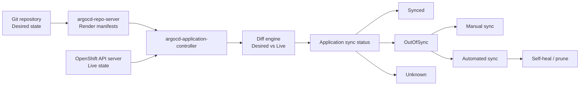

# Application Drift Detection in OpenShift GitOps Argo CD

**Audience:** Advanced OpenShift Administrators, SREs, Platform Engineers, OpenShift GitOps operators, and Kubernetes administrators with production experience.  
**Experience level:** Written for an administrator with approximately 10 years of Linux, Kubernetes, OpenShift, DevOps, and operations experience.  
**Scope:** Red Hat OpenShift GitOps with Argo CD, Application reconciliation, drift detection, diffing, self-healing, pruning, resource tracking, troubleshooting, observability, and production operating practices.

---

## 1. What Is Application Drift Detection?

**Application drift detection** is the process by which Argo CD compares the **desired state** of an application stored in Git with the **live state** running inside the OpenShift cluster.

In a GitOps model:

- **Git is the source of truth.**
- The OpenShift cluster is the execution environment.
- Argo CD continuously compares both states.
- Any difference between Git and the cluster is called **drift**.

In simple words:

> Application drift means the cluster is no longer running exactly what Git says it should run.

Example:

Git says the Deployment should run with 3 replicas:

```yaml
spec:
  replicas: 3
```

But someone manually scales it in OpenShift:

```bash
oc scale deployment payment-api -n prod --replicas=5
```

Now the live cluster has 5 replicas, while Git has 3. Argo CD detects this difference and marks the application as:

```text
OutOfSync
```

If self-healing is enabled, Argo CD can automatically revert the live Deployment back to 3 replicas.

---

## 2. Why Drift Detection Matters in Production

In a mature OpenShift environment, drift detection is not just a GitOps feature. It is a control mechanism for production reliability, compliance, security, and operational discipline.

Without drift detection, production clusters slowly become inconsistent because of:

- Emergency manual fixes.
- Direct `oc edit` changes.
- Developers changing live resources from the OpenShift web console.
- Operators mutating resources.
- Admission controllers injecting defaults.
- HPA changing replica counts.
- Security teams changing NetworkPolicies manually.
- Platform teams changing SCC, Route, Service, Secret, or ConfigMap objects outside Git.
- Failed or partial rollouts.
- Removed YAML files not being pruned from the cluster.
- Multiple Argo CD Applications accidentally managing the same object.

A 10-year experienced administrator should treat drift detection as a **production safety system**.

It answers these questions:

| Question | Drift detection answer |
|---|---|
| Is production exactly matching Git? | `Synced` or `OutOfSync` |
| Did someone manually change a live object? | Argo CD diff shows live vs desired difference |
| Did a Git change not reach the cluster? | App remains `OutOfSync` or sync operation failed |
| Did a resource disappear from the cluster? | Resource becomes `Missing` / `OutOfSync` |
| Did Git remove a resource but cluster still has it? | Resource requires pruning |
| Did an operator/controller mutate fields? | Diff shows managed/defaulted fields |
| Are unmanaged objects present in the namespace? | Orphaned resource monitoring can warn |

---

## 3. Core GitOps State Model

Argo CD drift detection depends on understanding three states.

### 3.1 Desired State

The **desired state** is the rendered Kubernetes/OpenShift manifest produced from Git.

Git content can be written as:

- Plain YAML.
- Kustomize overlays.
- Helm charts.
- Jsonnet.
- Config Management Plugin output.
- ApplicationSet-generated Applications.

Example desired state in Git:

```yaml
apiVersion: apps/v1
kind: Deployment
metadata:
  name: payment-api
  namespace: payment-prod
spec:
  replicas: 3
  selector:
    matchLabels:
      app: payment-api
  template:
    metadata:
      labels:
        app: payment-api
    spec:
      containers:
        - name: payment-api
          image: registry.example.com/payment-api:v1.4.2
          ports:
            - containerPort: 8080
```

### 3.2 Live State

The **live state** is what currently exists in the OpenShift API server.

You see it with commands like:

```bash
oc get deployment payment-api -n payment-prod -o yaml
oc get route payment-api -n payment-prod -o yaml
oc get svc payment-api -n payment-prod -o yaml
```

The live state usually contains extra fields generated by Kubernetes/OpenShift:

- `metadata.resourceVersion`
- `metadata.uid`
- `metadata.generation`
- `metadata.managedFields`
- `status`
- controller-added annotations
- admission-controller defaults
- OpenShift Route admission status
- Deployment rollout status
- Service cluster IP
- Secret-generated data

Argo CD must normalize and compare meaningful fields while ignoring many system-generated fields.

### 3.3 Target Revision

The **target revision** is the Git revision Argo CD is tracking.

It can be:

```yaml
spec:
  source:
    targetRevision: main
```

or:

```yaml
spec:
  source:
    targetRevision: v1.4.2
```

or a specific commit SHA:

```yaml
spec:
  source:
    targetRevision: 7f84c0e9c1a5e...
```

Production best practice:

- Use branch tracking for lower environments.
- Use tags or commit SHAs for production promotion.
- Avoid deploying production directly from uncontrolled `main` without review, promotion, and rollback strategy.

---

## 4. Drift Detection Architecture in OpenShift GitOps

A typical OpenShift GitOps installation runs Argo CD components in the `openshift-gitops` namespace unless you create additional Argo CD instances.

Main components involved in drift detection:

| Component | Role in drift detection |
|---|---|
| OpenShift GitOps Operator | Installs and manages Argo CD components |
| `argocd-application-controller` | Core reconciliation engine; compares desired and live state |
| `argocd-repo-server` | Clones Git repositories and renders manifests |
| `argocd-server` | UI/API server used by dashboard and CLI |
| Redis | Cache for application state, repo data, and cluster data depending on configuration |
| Application CR | Defines source repo, destination cluster/namespace, sync policy |
| AppProject CR | Defines boundaries, allowed repos, destinations, resources, orphan monitoring |
| OpenShift API server | Source of live state |

### 4.1 High-Level Drift Detection Flow



### 4.2 What Actually Happens Internally

At a practical admin level, Argo CD performs this workflow:

1. Watches the `Application` object.
2. Reads the Git repository, revision, and path/chart configuration.
3. Renders Kubernetes manifests through Helm, Kustomize, plain YAML, or plugin.
4. Queries/caches the live resources from the OpenShift cluster.
5. Identifies which live resources belong to the Application.
6. Normalizes resources by ignoring noisy fields such as `status` and generated metadata.
7. Compares rendered desired state with live state.
8. Sets sync status:
   - `Synced`
   - `OutOfSync`
   - `Unknown`
9. Displays diffs in UI/CLI.
10. Optionally performs sync, self-heal, prune, or replacement depending on policy.

---

## 5. Sync Status vs Health Status

A strong OpenShift GitOps administrator must not confuse **sync status** and **health status**.

### 5.1 Sync Status

Sync status answers:

> Does the live cluster match Git?

Common sync statuses:

| Sync status | Meaning |
|---|---|
| `Synced` | Desired state and live state match |
| `OutOfSync` | Desired state and live state differ |
| `Unknown` | Argo CD could not determine state because of error, missing access, repo failure, cluster issue, or comparison problem |

Example:

```bash
argocd app get payment-api
```

Possible output:

```text
Name:               payment-api
Project:            production
Sync Status:        OutOfSync from main (7f84c0e)
Health Status:      Healthy
```

This means the app is running successfully, but it does not match Git.

### 5.2 Health Status

Health status answers:

> Is the application operational from a Kubernetes/OpenShift resource health perspective?

Common health statuses:

| Health status | Meaning |
|---|---|
| `Healthy` | Resource appears operational |
| `Progressing` | Rollout or reconciliation is in progress |
| `Degraded` | Resource failed or is unhealthy |
| `Suspended` | Resource is intentionally suspended, depending on kind |
| `Missing` | Expected resource does not exist |
| `Unknown` | Argo CD cannot determine health |

### 5.3 Important Matrix

| Sync | Health | Meaning | Admin response |
|---|---|---|---|
| `Synced` | `Healthy` | Ideal state | Monitor only |
| `OutOfSync` | `Healthy` | App works but differs from Git | Investigate drift |
| `Synced` | `Degraded` | Git applied correctly, but app is broken | Troubleshoot workload, image, probes, quota, SCC, storage, network |
| `OutOfSync` | `Degraded` | App differs from Git and is unhealthy | Treat as incident |
| `Unknown` | Any | Argo CD cannot compare or access state | Check repo, credentials, RBAC, API, CRDs, controller logs |

Production mistake:

> Seeing `Healthy` and assuming GitOps compliance is correct.

Correct interpretation:

> You need both `Synced` and `Healthy` for a clean GitOps state.

---

## 6. Common Drift Categories

### 6.1 Manual Live Drift

Manual live drift happens when someone changes a live OpenShift object directly.

Examples:

```bash
oc edit deployment payment-api -n payment-prod
oc scale deployment payment-api -n payment-prod --replicas=5
oc set image deployment/payment-api payment-api=registry.example.com/payment-api:v1.4.3 -n payment-prod
oc patch route payment-api -n payment-prod --type merge -p '{"spec":{"tls":{"termination":"edge"}}}'
```

Argo CD detects the live object no longer matches Git.

### 6.2 Git Drift

Git drift happens when Git changes but the cluster has not yet been synced.

Example:

- Developer commits image `v1.4.3` to Git.
- Application is configured with manual sync.
- Argo CD detects Git changed.
- App becomes `OutOfSync` until a sync is performed.

### 6.3 Missing Resource Drift

Git expects a resource, but the resource is missing in OpenShift.

Example:

```bash
oc delete svc payment-api -n payment-prod
```

Git still defines the Service. Argo CD marks the Service as missing and the app as `OutOfSync`.

### 6.4 Extra Resource / Prune Drift

Git no longer defines a resource, but it still exists in the cluster.

Example:

- A Deployment YAML is removed from Git.
- The Deployment still exists in OpenShift.
- Argo CD sees the resource as extra.
- If pruning is enabled, Argo CD can delete it.
- If pruning is disabled, the Application stays `OutOfSync`.

### 6.5 Orphaned Resource Drift

An orphaned resource is a top-level namespaced resource that exists in a target namespace but does not belong to any Argo CD Application.

Example:

```bash
oc create configmap manual-debug -n payment-prod --from-literal=debug=true
```

This ConfigMap is not in Git and is not tracked by any Argo CD Application.

Orphaned resource monitoring can warn administrators about such resources.

### 6.6 Controller Mutation Drift

Kubernetes/OpenShift controllers may change resources after creation.

Examples:

- HPA changes Deployment replicas.
- OpenShift Route controller updates `.status.ingress`.
- Service controller allocates `clusterIP`.
- Admission webhooks inject sidecars or init containers.
- Cert-manager injects CA bundles.
- Operators update CR fields.
- Kube-controller-manager updates generated values.

Some of these differences are normal. Some should be ignored. Some indicate bad Git modeling.

### 6.7 Helm Template Drift

Helm charts can create drift if templates generate nondeterministic values.

Bad examples:

```yaml
password: {{ randAlphaNum 16 }}
rollme: {{ now | quote }}
```

Every render produces a different desired state, so Argo CD may repeatedly mark the app `OutOfSync`.

Production rule:

> GitOps manifests must render deterministically.

### 6.8 OpenShift-Specific Drift

OpenShift has platform-specific objects and defaulting behavior that may cause noisy diffs if not modeled carefully.

Examples:

- `Route.status.ingress`
- generated Route hostnames
- ImageStream tag status
- BuildConfig trigger status
- DeploymentConfig rollout fields
- SCC-related security defaults
- namespace annotations/labels added by cluster operators
- service-serving certificate annotations
- injected CA bundles
- LimitRange defaulted container requests/limits
- Operator-managed CR fields

---

## 7. Argo CD Application Object for Drift Detection

A basic OpenShift GitOps Application looks like this:

```yaml
apiVersion: argoproj.io/v1alpha1
kind: Application
metadata:
  name: payment-api
  namespace: openshift-gitops
spec:
  project: production
  source:
    repoURL: https://git.example.com/platform/payment-api-gitops.git
    targetRevision: main
    path: overlays/prod
  destination:
    server: https://kubernetes.default.svc
    namespace: payment-prod
  syncPolicy: {}
```

With this configuration:

- Argo CD detects drift.
- Argo CD shows `OutOfSync`.
- Argo CD does **not** automatically fix drift.
- An administrator must manually sync.

---

## 8. Manual Sync vs Automated Sync vs Self-Heal

### 8.1 Manual Sync

Manual sync means Argo CD detects drift but waits for human approval.

```yaml
spec:
  syncPolicy: {}
```

Manual sync is common for:

- Production.
- Regulated environments.
- Change-control windows.
- High-risk cluster-scoped resources.
- Operator upgrades.
- NetworkPolicy changes.

CLI sync:

```bash
argocd app sync payment-api
```

OpenShift-native view:

```bash
oc get application payment-api -n openshift-gitops
oc describe application payment-api -n openshift-gitops
```

### 8.2 Automated Sync

Automated sync means Argo CD automatically applies Git changes when it detects differences.

```yaml
spec:
  syncPolicy:
    automated: {}
```

This handles Git changes automatically but does not necessarily correct live manual drift unless self-heal is configured.

### 8.3 Automated Sync with Self-Healing

Self-healing allows Argo CD to correct live drift automatically.

```yaml
spec:
  syncPolicy:
    automated:
      selfHeal: true
```

If someone changes the Deployment replicas directly in OpenShift, Argo CD changes it back to the Git value.

### 8.4 Automated Sync with Pruning

Pruning allows Argo CD to delete resources that are no longer present in Git.

```yaml
spec:
  syncPolicy:
    automated:
      prune: true
      selfHeal: true
```

Production warning:

> `prune: true` is powerful. A bad Git commit can remove resources from the cluster.

Use branch protection, pull requests, code owners, sync windows, and AppProject restrictions.

### 8.5 Production-Grade Automated Sync Policy

```yaml
apiVersion: argoproj.io/v1alpha1
kind: Application
metadata:
  name: payment-api
  namespace: openshift-gitops
spec:
  project: production
  source:
    repoURL: https://git.example.com/platform/payment-api-gitops.git
    targetRevision: main
    path: overlays/prod
  destination:
    server: https://kubernetes.default.svc
    namespace: payment-prod
  syncPolicy:
    automated:
      prune: true
      selfHeal: true
    syncOptions:
      - CreateNamespace=false
      - PruneLast=true
      - ApplyOutOfSyncOnly=true
```

Explanation:

| Option | Meaning |
|---|---|
| `prune: true` | Delete tracked resources removed from Git |
| `selfHeal: true` | Revert manual live drift |
| `CreateNamespace=false` | Do not let app create namespaces automatically in production |
| `PruneLast=true` | Prune after other resources are applied |
| `ApplyOutOfSyncOnly=true` | Sync only resources that are out of sync |

---

## 9. Drift Detection Lab: Manual Change to Deployment Replicas

### 9.1 Verify Application Is Synced

```bash
argocd app get payment-api
```

Expected:

```text
Sync Status:   Synced
Health Status: Healthy
```

OpenShift view:

```bash
oc get application payment-api -n openshift-gitops -o wide
```

### 9.2 Create Manual Drift

```bash
oc scale deployment payment-api -n payment-prod --replicas=5
```

### 9.3 Watch Argo CD Detect Drift

```bash
watch -n 2 'oc get application payment-api -n openshift-gitops'
```

Or:

```bash
argocd app get payment-api --refresh
```

Expected:

```text
Sync Status: OutOfSync
```

### 9.4 View Difference

```bash
argocd app diff payment-api
```

You should see a difference similar to:

```diff
spec:
- replicas: 3
+ replicas: 5
```

Interpretation:

- Git desired replicas: `3`
- Live cluster replicas: `5`
- The Application drifted.

### 9.5 Fix Drift Manually

Option 1: sync from Argo CD:

```bash
argocd app sync payment-api
```

Option 2: manually return live state:

```bash
oc scale deployment payment-api -n payment-prod --replicas=3
```

Correct GitOps option:

```bash
argocd app sync payment-api
```

---

## 10. Drift Detection Lab: Image Changed Outside Git

### 10.1 Git Desired State

```yaml
containers:
  - name: payment-api
    image: registry.example.com/payment-api:v1.4.2
```

### 10.2 Manual Live Change

```bash
oc set image deployment/payment-api \
  payment-api=registry.example.com/payment-api:v1.4.3 \
  -n payment-prod
```

### 10.3 Detect Drift

```bash
argocd app get payment-api --refresh
argocd app diff payment-api
```

Expected diff:

```diff
- image: registry.example.com/payment-api:v1.4.2
+ image: registry.example.com/payment-api:v1.4.3
```

### 10.4 Correct Admin Decision

Ask:

1. Was this an emergency production fix?
2. Is `v1.4.3` approved?
3. Should Git be updated to `v1.4.3`?
4. Or should Argo CD revert to `v1.4.2`?

Decision matrix:

| Situation | Correct action |
|---|---|
| Manual change was unauthorized | Sync app back to Git |
| Manual change was emergency-approved | Commit same change to Git, then sync |
| Image is bad | Roll back in Git or sync to previous Git revision |
| App is automated with self-heal | Argo CD may revert automatically |

---

## 11. Drift Detection Lab: Resource Deleted from Cluster

### 11.1 Delete a Service Manually

```bash
oc delete service payment-api -n payment-prod
```

### 11.2 Argo CD Status

```bash
argocd app get payment-api --refresh
```

Expected:

```text
Sync Status: OutOfSync
Health Status: Missing or Degraded depending on resource tree
```

### 11.3 Fix

```bash
argocd app sync payment-api
```

Argo CD recreates the missing Service from Git.

---

## 12. Drift Detection Lab: Resource Removed from Git but Still Exists

### 12.1 Remove Resource from Git

Example: remove `route.yaml` from Git.

```bash
git rm overlays/prod/route.yaml
git commit -m "Remove payment-api route"
git push
```

### 12.2 Application Becomes OutOfSync

```bash
argocd app get payment-api --refresh
```

Argo CD identifies the Route as live but no longer desired.

### 12.3 If Prune Is Disabled

The app remains `OutOfSync` until you prune manually:

```bash
argocd app sync payment-api --prune
```

### 12.4 If Prune Is Enabled

With:

```yaml
syncPolicy:
  automated:
    prune: true
```

Argo CD deletes the Route automatically during sync.

Production warning:

> Never enable automatic pruning in production without strong Git controls.

---

## 13. Resource Tracking: How Argo CD Knows What It Owns

Argo CD must know which OpenShift resources belong to which Application.

It uses resource tracking.

Common tracking methods:

| Method | Description |
|---|---|
| Label tracking | Uses an application instance label such as `app.kubernetes.io/instance` |
| Annotation tracking | Uses Argo CD tracking annotations |
| Annotation + label | Uses annotation for tracking and label for ecosystem compatibility |

### 13.1 Why Resource Tracking Matters for Drift

If tracking is wrong, Argo CD can:

- Miss resources it should manage.
- Think resources are orphaned.
- Show resources under the wrong application.
- Fail pruning.
- Fight with another Argo CD Application.
- Show persistent `OutOfSync` even after sync.

### 13.2 Tracking Conflict Example

Two Applications manage the same Deployment:

```text
Application A -> deployment/payment-api in payment-prod
Application B -> deployment/payment-api in payment-prod
```

Symptoms:

- App A is `Synced`, then App B syncs and App A becomes `OutOfSync`.
- Deployment fields flip between two values.
- Argo CD UI shows shared-resource warnings depending on version/configuration.
- Production rollouts become unpredictable.

Admin fix:

- One resource must belong to one Application.
- Refactor Git repository structure.
- Use clear AppProject boundaries.
- Avoid overlapping `path` definitions.
- Avoid one Application managing a namespace and another managing the same objects unless intentionally designed.

---

## 14. Orphaned Resource Monitoring

Orphaned resource monitoring helps detect objects that exist in a namespace but are not managed by any Argo CD Application.

Enable it in `AppProject`:

```yaml
apiVersion: argoproj.io/v1alpha1
kind: AppProject
metadata:
  name: production
  namespace: openshift-gitops
spec:
  sourceRepos:
    - https://git.example.com/platform/*
  destinations:
    - namespace: payment-prod
      server: https://kubernetes.default.svc
  orphanedResources:
    warn: true
```

### 14.1 What It Detects

Example manual resource:

```bash
oc create configmap manual-config -n payment-prod --from-literal=debug=true
```

If this ConfigMap is not part of any Application, Argo CD can show an orphan warning.

### 14.2 What To Do With Orphans

For each orphaned object, decide:

| Object type | Action |
|---|---|
| Valid production object | Add it to Git and let Argo CD manage it |
| Temporary debug object | Delete it after investigation |
| Operator-generated object | Configure ignore rules or project exceptions carefully |
| Security-sensitive object | Investigate owner and change history |
| Old leftover resource | Delete after impact analysis |

### 14.3 Production Approach

Start with warning mode:

```yaml
orphanedResources:
  warn: true
```

Then review noise before enforcing cleanup.

---

## 15. Diffing: How Argo CD Compares Desired and Live State

Argo CD calculates differences between rendered desired manifests and live OpenShift objects.

### 15.1 Basic Diff Command

```bash
argocd app diff payment-api
```

### 15.2 Refresh Before Diff

```bash
argocd app get payment-api --refresh
argocd app diff payment-api
```

### 15.3 Hard Refresh

A hard refresh invalidates cache and forces Argo CD to re-evaluate repository manifests and cluster state.

CLI:

```bash
argocd app get payment-api --hard-refresh
```

Kubernetes annotation:

```bash
oc annotate application payment-api \
  -n openshift-gitops \
  argocd.argoproj.io/refresh=hard \
  --overwrite
```

Use hard refresh when:

- Helm chart content changed but chart version did not change.
- Repo-server cache seems stale.
- Live state cache seems stale.
- Troubleshooting persistent inaccurate drift status.
- A Config Management Plugin generated stale output.

Do not use hard refresh as a normal operating habit. Fix the underlying cache/versioning problem.

---

## 16. Diff Strategies

Depending on Argo CD version and configuration, diffing can involve different strategies.

### 16.1 Legacy Diff

Legacy diff is based on:

- Desired state.
- Live state.
- Last-applied configuration annotation where applicable.

It is common in client-side apply workflows.

### 16.2 Structured-Merge Diff

Structured-merge diff is related to Server-Side Apply behavior and field ownership.

It is useful when Kubernetes managed fields matter and resources are applied with server-side semantics.

### 16.3 Server-Side Diff

Server-side diff asks the Kubernetes API server to calculate what would happen through a dry-run Server-Side Apply operation.

Useful for:

- Admission webhook defaulting.
- Server-side field ownership.
- More accurate prediction of actual live object after apply.

Production caution:

- Server-side diff may increase API server interaction.
- It depends on cluster-side behavior.
- Test before enabling broadly in large clusters.

---

## 17. Diff Customization: Ignoring Expected Differences

Some differences are expected and should not make an Application permanently `OutOfSync`.

Argo CD supports `ignoreDifferences` at the Application level and system-level customizations in `argocd-cm`.

### 17.1 Ignore Deployment Replicas

Common when HPA manages replicas.

```yaml
apiVersion: argoproj.io/v1alpha1
kind: Application
metadata:
  name: payment-api
  namespace: openshift-gitops
spec:
  project: production
  source:
    repoURL: https://git.example.com/platform/payment-api-gitops.git
    targetRevision: main
    path: overlays/prod
  destination:
    server: https://kubernetes.default.svc
    namespace: payment-prod
  ignoreDifferences:
    - group: apps
      kind: Deployment
      name: payment-api
      namespace: payment-prod
      jsonPointers:
        - /spec/replicas
```

Why:

- Git may define initial replicas.
- HPA adjusts replicas at runtime.
- Without ignoring replicas, HPA and Argo CD can fight.

### 17.2 Ignore Fields Managed by a Controller

```yaml
spec:
  ignoreDifferences:
    - group: '*'
      kind: '*'
      managedFieldsManagers:
        - kube-controller-manager
```

Use carefully. This can hide real drift if too broad.

### 17.3 Ignore Injected Init Container

Some service meshes or admission webhooks inject containers.

```yaml
spec:
  ignoreDifferences:
    - group: apps
      kind: Deployment
      jqPathExpressions:
        - '.spec.template.spec.initContainers[] | select(.name == "injected-init-container")'
```

### 17.4 Ignore Webhook CA Bundle at System Level

For mutating/validating webhook configurations, CA bundles may be injected by cert management controllers.

In `argocd-cm`:

```yaml
apiVersion: v1
kind: ConfigMap
metadata:
  name: argocd-cm
  namespace: openshift-gitops
data:
  resource.customizations.ignoreDifferences.admissionregistration.k8s.io_MutatingWebhookConfiguration: |
    jqPathExpressions:
      - '.webhooks[]?.clientConfig.caBundle'
```

### 17.5 Very Important: Ignore Difference vs Sync Behavior

`ignoreDifferences` affects comparison. It does not always mean Argo CD will preserve live values during sync unless sync options are configured appropriately.

For sync-time behavior, use:

```yaml
spec:
  syncPolicy:
    syncOptions:
      - RespectIgnoreDifferences=true
```

Example:

```yaml
spec:
  ignoreDifferences:
    - group: apps
      kind: Deployment
      jsonPointers:
        - /spec/replicas
  syncPolicy:
    syncOptions:
      - RespectIgnoreDifferences=true
```

Admin interpretation:

- `ignoreDifferences` controls drift detection noise.
- `RespectIgnoreDifferences=true` tells sync to respect those ignored fields for existing resources.

---

## 18. Dangerous Diff Customization Mistakes

### 18.1 Ignoring Too Much

Bad example:

```yaml
ignoreDifferences:
  - group: '*'
    kind: '*'
    jsonPointers:
      - /spec
```

This hides almost all meaningful drift.

### 18.2 Ignoring Security Fields

Be careful before ignoring:

- `securityContext`
- `runAsUser`
- `privileged`
- `allowPrivilegeEscalation`
- `hostNetwork`
- `hostPath`
- `NetworkPolicy.spec`
- `RoleBinding.subjects`
- `ClusterRole.rules`
- `Route.spec.tls`
- `Secret.data`

Ignoring these can hide security incidents.

### 18.3 Ignoring Operator Drift Blindly

Operators often mutate CRs, but not every mutation should be ignored.

Correct process:

1. Identify field owner.
2. Understand controller behavior.
3. Confirm expected mutation from vendor docs.
4. Add narrow ignore rule.
5. Document reason in Git.
6. Review periodically.

---

## 19. OpenShift Namespace Management and Drift

In OpenShift GitOps, namespace management is important because Argo CD must be allowed to manage resources in target namespaces.

For the default OpenShift GitOps instance, namespaces commonly need a management label:

```bash
oc label namespace payment-prod argocd.argoproj.io/managed-by=openshift-gitops
```

Verify:

```bash
oc get namespace payment-prod --show-labels
```

If the namespace is not allowed/managed, symptoms may include:

- Application sync fails.
- Resources are not created.
- Argo CD shows permission errors.
- Application status becomes `Unknown`.
- Drift detection cannot fully compare resources.

Production practice:

- Manage namespace onboarding through Git.
- Avoid manual namespace labeling without audit.
- Use AppProject destinations to restrict which namespaces an app can target.

---

## 20. AppProject Boundaries for Drift Safety

`AppProject` is a major production safety control.

Example:

```yaml
apiVersion: argoproj.io/v1alpha1
kind: AppProject
metadata:
  name: production
  namespace: openshift-gitops
spec:
  description: Production application project
  sourceRepos:
    - https://git.example.com/platform/*
  destinations:
    - server: https://kubernetes.default.svc
      namespace: payment-prod
    - server: https://kubernetes.default.svc
      namespace: orders-prod
  clusterResourceWhitelist:
    - group: ''
      kind: Namespace
  namespaceResourceWhitelist:
    - group: '*'
      kind: '*'
  orphanedResources:
    warn: true
```

A production AppProject should define:

- Allowed Git repositories.
- Allowed destination clusters.
- Allowed namespaces.
- Allowed/denied resource kinds.
- Sync windows if required.
- Orphaned resource monitoring.

Why this matters for drift:

- Prevents accidental sync to wrong namespace.
- Prevents unauthorized cluster-scoped resource drift.
- Reduces blast radius of bad Git commits.
- Keeps ownership boundaries clean.

---

## 21. Drift Detection for OpenShift Routes

OpenShift `Route` resources are commonly managed by GitOps.

Example Git Route:

```yaml
apiVersion: route.openshift.io/v1
kind: Route
metadata:
  name: payment-api
  namespace: payment-prod
spec:
  host: payment.apps.example.com
  to:
    kind: Service
    name: payment-api
  port:
    targetPort: http
  tls:
    termination: edge
    insecureEdgeTerminationPolicy: Redirect
```

### 21.1 Common Route Drift

Manual change:

```bash
oc patch route payment-api -n payment-prod --type merge -p \
  '{"spec":{"tls":{"insecureEdgeTerminationPolicy":"Allow"}}}'
```

Argo CD detects:

```diff
- insecureEdgeTerminationPolicy: Redirect
+ insecureEdgeTerminationPolicy: Allow
```

### 21.2 Route Fields Usually Not Managed in Git

Do not try to manage Route status:

```yaml
status:
  ingress:
    - host: ...
```

`status` is controller-owned.

### 21.3 Production Rule

Route `spec` should be Git-managed. Route `status` should be ignored as normal cluster state.

---

## 22. Drift Detection for ConfigMaps and Secrets

### 22.1 ConfigMap Drift

Manual change:

```bash
oc edit configmap payment-config -n payment-prod
```

Argo CD detects change in `.data`.

ConfigMap drift can be dangerous because it may not restart pods automatically unless your rollout mechanism handles it.

Production approaches:

- Use checksum annotations on pod templates.
- Use reloader controllers carefully.
- Version ConfigMaps.
- Sync Git changes through Argo CD.

### 22.2 Secret Drift

Secrets are sensitive. GitOps options include:

- Sealed Secrets.
- External Secrets Operator.
- HashiCorp Vault integration.
- SOPS with Argo CD plugin/integration.
- OpenShift GitOps with approved secret-management workflow.

Do not store plain production secrets in Git.

Manual secret drift example:

```bash
oc patch secret payment-db -n payment-prod --type merge -p \
  '{"data":{"password":"...base64..."}}'
```

Admin questions:

- Is Git the source for this Secret?
- Is an external secret controller the source?
- Is Argo CD supposed to ignore generated secret data?
- Is this a credential rotation?

---

## 23. Drift Detection with HPA

HorizontalPodAutoscaler commonly changes Deployment replica count.

Bad GitOps behavior:

- Git says replicas: 3.
- HPA scales to 8.
- Argo CD sees drift.
- Argo CD self-heals back to 3.
- HPA scales again.
- Controllers fight.

Correct approach:

- Let HPA manage replicas.
- Ignore `/spec/replicas` on the Deployment.
- Manage HPA object in Git.

Example HPA:

```yaml
apiVersion: autoscaling/v2
kind: HorizontalPodAutoscaler
metadata:
  name: payment-api
  namespace: payment-prod
spec:
  scaleTargetRef:
    apiVersion: apps/v1
    kind: Deployment
    name: payment-api
  minReplicas: 3
  maxReplicas: 10
  metrics:
    - type: Resource
      resource:
        name: cpu
        target:
          type: Utilization
          averageUtilization: 70
```

Ignore Deployment replicas:

```yaml
spec:
  ignoreDifferences:
    - group: apps
      kind: Deployment
      name: payment-api
      namespace: payment-prod
      jsonPointers:
        - /spec/replicas
```

---

## 24. Drift Detection with Operators

OpenShift heavily uses Operators. Operators often reconcile custom resources and generate secondary resources.

Examples:

- cert-manager updates certificates and webhook bundles.
- OpenShift Logging Operator manages collector DaemonSets.
- OpenShift Service Mesh injects sidecars.
- OpenShift GitOps Operator manages Argo CD components.
- OLM manages CSVs, InstallPlans, Subscriptions.

### 24.1 Operator-Managed CR Drift

If Git manages a custom resource and the operator modifies `.spec`, Argo CD may show drift.

Admin workflow:

```bash
argocd app diff operator-managed-app
oc get <crd-kind> <name> -n <namespace> -o yaml
oc explain <crd-kind>.spec
oc describe <crd-kind> <name> -n <namespace>
```

Check:

- Is the operator defaulting missing fields?
- Are defaults documented?
- Should Git include those defaulted fields?
- Is the operator changing fields that should be user-owned?
- Is there a version mismatch?

### 24.2 Best Practice

For operator-managed CRs:

- Prefer adding stable defaulted fields to Git if they are part of desired spec.
- Ignore only generated fields.
- Never ignore the entire CR spec.
- Avoid GitOps managing resources that the Operator fully owns unless documented.

---

## 25. Drift Detection with Server-Side Apply

Server-Side Apply can improve field ownership behavior.

Enable per Application:

```yaml
spec:
  syncPolicy:
    syncOptions:
      - ServerSideApply=true
```

Use cases:

- Large resources that exceed client-side apply annotation limits.
- Better field ownership semantics.
- Partial field management.
- Working with resources also touched by controllers.

Caution:

- Test carefully.
- Understand managed fields.
- Field conflicts can occur.
- Do not enable blindly for all cluster resources without validation.

---

## 26. Sync Options That Affect Drift Correction

### 26.1 `Prune=false`

Prevents pruning of a resource.

```yaml
metadata:
  annotations:
    argocd.argoproj.io/sync-options: Prune=false
```

Effect:

- Argo CD will not delete this resource even if removed from Git.
- App may stay `OutOfSync` if pruning is expected.

### 26.2 `Prune=confirm`

Requires manual approval before pruning critical resources.

```yaml
metadata:
  annotations:
    argocd.argoproj.io/sync-options: Prune=confirm
```

Good for:

- Namespaces.
- PersistentVolumeClaims.
- Cluster-scoped resources.
- Production Routes.
- Security resources.

### 26.3 `PruneLast=true`

Prunes after apply phase.

```yaml
spec:
  syncPolicy:
    syncOptions:
      - PruneLast=true
```

Useful when new resources must become ready before old resources are removed.

### 26.4 `ApplyOutOfSyncOnly=true`

Only applies resources that are out of sync.

```yaml
spec:
  syncPolicy:
    syncOptions:
      - ApplyOutOfSyncOnly=true
```

Useful in large Applications to reduce API calls.

### 26.5 `Replace=true`

Uses replace/create instead of apply for selected resources or app-level configuration.

Danger:

- Can cause resource recreation.
- May cause downtime.
- Be careful with Services, PVCs, Deployments, Routes, CRDs.

### 26.6 `Force=true`

Allows delete/recreate behavior for certain immutable-field changes.

Danger:

- Can delete and recreate resources.
- Never use broadly without understanding impact.

---

## 27. Automated Self-Healing Behavior

Self-healing is automatic drift correction.

Application:

```yaml
apiVersion: argoproj.io/v1alpha1
kind: Application
metadata:
  name: payment-api
  namespace: openshift-gitops
spec:
  project: production
  source:
    repoURL: https://git.example.com/platform/payment-api-gitops.git
    targetRevision: main
    path: overlays/prod
  destination:
    server: https://kubernetes.default.svc
    namespace: payment-prod
  syncPolicy:
    automated:
      selfHeal: true
      prune: true
```

### 27.1 What Self-Heal Corrects

Self-heal can correct:

- Changed replicas.
- Changed container image.
- Changed env vars.
- Changed labels/annotations.
- Deleted resources.
- Modified Service ports.
- Modified Route TLS configuration.
- Modified ConfigMap data.

### 27.2 What Self-Heal Does Not Solve

Self-heal does not solve:

- Bad Git commits.
- Broken images.
- Invalid manifests.
- Cluster quota shortage.
- SCC denial.
- Missing CRDs.
- Operator failure.
- Registry outage.
- Node/pod scheduling issues.
- PVC binding failure.
- Application runtime bugs.

Self-heal enforces Git. It does not guarantee application correctness.

---

## 28. Production Drift Incident Workflow

When an Application is `OutOfSync`, use this workflow.

### Step 1: Identify Application State

```bash
argocd app get payment-api
```

Or:

```bash
oc describe application payment-api -n openshift-gitops
```

Check:

- Sync status.
- Health status.
- Target revision.
- Last sync revision.
- Conditions.
- Operation state.
- Resource list.

### Step 2: Refresh State

```bash
argocd app get payment-api --refresh
```

If still confusing:

```bash
argocd app get payment-api --hard-refresh
```

### Step 3: View Diff

```bash
argocd app diff payment-api
```

For a specific resource:

```bash
argocd app diff payment-api --resource apps:Deployment:payment-api
```

If namespace is needed depending on CLI/version/resource form, inspect the resource tree:

```bash
argocd app resources payment-api
```

### Step 4: Classify Drift

| Drift type | Evidence | Action |
|---|---|---|
| Manual live edit | Live differs from Git, no Git commit | Revert with sync or commit approved change |
| Git change not synced | Git revision changed, live old | Sync app |
| Missing resource | Resource absent from cluster | Sync app, check RBAC/quota/SCC if recreate fails |
| Extra resource | Resource removed from Git but live exists | Prune if safe |
| Operator mutation | Field manager/controller changed field | Add field to Git or ignore narrowly |
| HPA replica drift | Only replicas differ | Ignore replicas and manage HPA in Git |
| Helm nondeterminism | Render changes every refresh | Fix Helm templates |
| RBAC/access issue | Comparison/sync errors | Fix GitOps service account/AppProject/RBAC |

### Step 5: Check Git History

```bash
git log --oneline --decorate -n 10
git show <commit>
git diff <old-commit>..<new-commit>
```

### Step 6: Check Live Object Ownership

```bash
oc get deployment payment-api -n payment-prod -o yaml | less
```

Look at:

- labels
- annotations
- managedFields
- ownerReferences
- last-applied annotations
- field managers

### Step 7: Decide Remediation

| Scenario | Best remediation |
|---|---|
| Unauthorized manual change | Sync from Git |
| Emergency manual fix should remain | Commit same change to Git |
| Bad Git commit | Revert Git commit, sync rollback |
| Expected controller mutation | Add narrow ignore rule |
| Extra resource no longer needed | Prune |
| Extra resource still needed | Add to Git or move to correct Application |
| Argo CD access denied | Fix RBAC/AppProject/namespace labels |

### Step 8: Confirm Resolution

```bash
argocd app wait payment-api --sync --health --timeout 300
argocd app get payment-api
```

OpenShift check:

```bash
oc get all -n payment-prod
oc get events -n payment-prod --sort-by=.lastTimestamp
```

---

## 29. Troubleshooting Persistent OutOfSync

### 29.1 App Shows OutOfSync Immediately After Sync

Possible causes:

- HPA changing replicas.
- Admission webhook injecting sidecar/init container.
- Operator defaulting spec fields.
- Helm template produces random values.
- Resource has immutable fields requiring replace.
- Argo CD lacks permission to update resource.
- Another controller/Application overwrites fields.
- Server-side defaulting changes fields after apply.

Commands:

```bash
argocd app diff payment-api
argocd app get payment-api -o yaml
oc get events -n payment-prod --sort-by=.lastTimestamp
oc get deployment payment-api -n payment-prod -o yaml
```

### 29.2 Diff Shows Only `metadata.managedFields`

Usually safe to ignore. Argo CD normally filters many generated metadata fields. If still visible due to special resources/custom diffing, configure resource customization carefully.

### 29.3 Diff Shows `status`

Do not put `status` in Git manifests.

Remove status from Git:

```bash
yq 'del(.status)' -i route.yaml
```

### 29.4 Diff Shows Service `clusterIP`

Do not hardcode generated `clusterIP` unless intentionally preserving a service IP.

Bad:

```yaml
spec:
  clusterIP: 172.30.10.20
```

Usually correct:

```yaml
spec:
  ports:
    - port: 8080
      targetPort: 8080
  selector:
    app: payment-api
```

### 29.5 Diff Shows Secret Data Always Changing

Possible causes:

- Helm `randAlphaNum` function.
- External secret controller changing value.
- Secret generated outside Git.
- Incorrect base64 encoding.
- Different newline characters.

Fix:

- Use deterministic secret source.
- Use External Secrets/Sealed Secrets/SOPS.
- Do not generate random values during Helm render.

### 29.6 Diff Shows Route Host Changing

Possible causes:

- Git omits `spec.host`, OpenShift generates one.
- Git expects a fixed host, cluster generated another.
- Manual route change.

Production best practice:

- Define important production route hosts explicitly in Git.

---

## 30. Troubleshooting `Unknown` Sync Status

`Unknown` means Argo CD cannot reliably compare desired and live state.

Common causes:

| Cause | Symptoms | Check |
|---|---|---|
| Git repo unreachable | Manifest generation error | repo-server logs, repository credentials |
| Bad YAML/Helm/Kustomize | ComparisonError | `argocd app get`, repo-server logs |
| Missing CRD | Resource mapping error | `oc api-resources`, install CRD/operator |
| RBAC denied | permission denied | service account permissions |
| Destination namespace missing | resource creation/comparison issue | `oc get ns` |
| Cluster secret invalid | cannot connect to cluster | Argo CD cluster list |
| AppProject denies source/destination | project permission error | `oc get appproject -n openshift-gitops -o yaml` |
| Repo-server cache/plugin issue | stale or failed render | hard refresh, repo-server logs |

Useful logs:

```bash
oc logs -n openshift-gitops deployment/openshift-gitops-application-controller
oc logs -n openshift-gitops deployment/openshift-gitops-repo-server
oc logs -n openshift-gitops deployment/openshift-gitops-server
```

Resource names can vary depending on your Argo CD instance name. List pods first:

```bash
oc get pods -n openshift-gitops
```

---

## 31. Drift Detection and RBAC in OpenShift

Argo CD can only detect and correct drift for resources it can read and update.

### 31.1 Read Permission Required

For drift detection, Argo CD needs read/list/watch permissions for target resources.

If it cannot read resources:

- App may show `Unknown`.
- Some resources may not appear in resource tree.
- Diff may fail.

### 31.2 Write Permission Required

For drift correction, Argo CD needs create/update/patch/delete permissions.

If it can detect but not fix:

- App shows `OutOfSync`.
- Sync fails with RBAC errors.

Example error:

```text
deployments.apps "payment-api" is forbidden: User "system:serviceaccount:openshift-gitops:openshift-gitops-argocd-application-controller" cannot patch resource "deployments" in API group "apps" in namespace "payment-prod"
```

### 31.3 OpenShift Namespace Labeling

For default OpenShift GitOps behavior, target namespaces commonly need:

```bash
oc label namespace payment-prod argocd.argoproj.io/managed-by=openshift-gitops
```

### 31.4 Production RBAC Principle

Do not give every Argo CD instance full cluster-admin by default.

Use:

- Separate Argo CD instances for platform vs application teams.
- AppProject restrictions.
- Namespace-scoped permissions where possible.
- Reviewable Git repos.
- Least privilege service accounts.

---

## 32. Drift Detection with SCC and Security Context

OpenShift Security Context Constraints can affect workloads after sync.

Example Deployment in Git:

```yaml
securityContext:
  runAsUser: 0
```

If the service account does not have an SCC allowing UID 0, sync may succeed in creating the Deployment object, but pods fail admission.

Application may be:

```text
Synced + Degraded
```

This is not drift. Git matches the cluster, but the app is unhealthy.

Check:

```bash
oc get pods -n payment-prod
oc describe pod <pod> -n payment-prod
oc get events -n payment-prod --sort-by=.lastTimestamp
```

Fix options:

- Change app to run with arbitrary UID.
- Use proper OpenShift-compatible image.
- Bind required SCC only if justified.
- Manage SCC/RoleBinding through Git if part of desired platform state.

Example SCC binding:

```bash
oc adm policy add-scc-to-user anyuid -z payment-api -n payment-prod
```

Production warning:

> Do not use `anyuid` or privileged SCC as a quick drift fix. This is a security decision.

---

## 33. Drift Detection and NetworkPolicy

NetworkPolicy drift is high-risk because it can silently change application reachability.

Example Git-managed NetworkPolicy:

```yaml
apiVersion: networking.k8s.io/v1
kind: NetworkPolicy
metadata:
  name: allow-frontend-to-payment
  namespace: payment-prod
spec:
  podSelector:
    matchLabels:
      app: payment-api
  policyTypes:
    - Ingress
  ingress:
    - from:
        - namespaceSelector:
            matchLabels:
              team: frontend
          podSelector:
            matchLabels:
              app: frontend
      ports:
        - protocol: TCP
          port: 8080
```

Manual drift example:

```bash
oc delete networkpolicy allow-frontend-to-payment -n payment-prod
```

Argo CD detects missing policy.

Security response:

- Treat unauthorized NetworkPolicy drift as security-relevant.
- Check audit logs if available.
- Restore from Git.
- Confirm traffic behavior with debug pods.

Example test:

```bash
oc run curl-test -n frontend --image=registry.access.redhat.com/ubi9/ubi -- sleep 3600
oc exec -n frontend curl-test -- curl -sv http://payment-api.payment-prod.svc:8080
```

---

## 34. Drift Detection and ResourceQuota / LimitRange

OpenShift administrators often manage namespace guardrails through Git.

Example ResourceQuota:

```yaml
apiVersion: v1
kind: ResourceQuota
metadata:
  name: payment-quota
  namespace: payment-prod
spec:
  hard:
    pods: "20"
    requests.cpu: "4"
    requests.memory: 8Gi
    limits.cpu: "8"
    limits.memory: 16Gi
```

Example LimitRange:

```yaml
apiVersion: v1
kind: LimitRange
metadata:
  name: payment-limits
  namespace: payment-prod
spec:
  limits:
    - type: Container
      defaultRequest:
        cpu: 100m
        memory: 128Mi
      default:
        cpu: 500m
        memory: 512Mi
      min:
        cpu: 10m
        memory: 64Mi
      max:
        cpu: "1"
        memory: 1Gi
```

Manual changes to quotas/limits create drift.

Impact:

- Pods may fail scheduling/admission.
- Deployments may become degraded.
- GitOps state may be violated.

Production rule:

> Namespace guardrails should be Git-managed, reviewed, and protected.

---

## 35. Drift Detection with CRDs and Cluster-Scoped Resources

Cluster-scoped resources require extra care.

Examples:

- `Namespace`
- `ClusterRole`
- `ClusterRoleBinding`
- `CustomResourceDefinition`
- `SecurityContextConstraints`
- `MutatingWebhookConfiguration`
- `ValidatingWebhookConfiguration`
- `OperatorGroup`
- `Subscription`

Production risks:

- Pruning a CRD can delete all custom resources of that type.
- Replacing webhooks can break admission.
- Wrong ClusterRoleBinding can create privilege escalation.
- Bad SCC changes can break workloads.

Recommended approach:

- Separate platform Application from app Application.
- Use manual sync for high-risk cluster-scoped resources.
- Use `Prune=confirm` for dangerous resources.
- Restrict cluster resources in AppProject.
- Use sync waves for ordering.
- Review diffs before sync.

Example prune confirmation annotation:

```yaml
metadata:
  annotations:
    argocd.argoproj.io/sync-options: Prune=confirm
```

---

## 36. Sync Waves and Drift Correction Order

Argo CD can sync resources in waves using annotations.

Example:

```yaml
metadata:
  annotations:
    argocd.argoproj.io/sync-wave: "0"
```

Typical ordering:

| Wave | Resource |
|---|---|
| `-2` | Namespace, RBAC, ServiceAccount |
| `-1` | Secrets, ConfigMaps, PVCs |
| `0` | Deployments, Services |
| `1` | Routes, HPAs, PodDisruptionBudgets |
| `2` | Smoke test Jobs or post-sync validation |

Why this matters for drift:

- During correction, dependencies must exist first.
- Pruning should not remove old dependencies too early.
- Route should not point to missing Service.
- Deployment should not start before Secret exists.

---

## 37. Hooks and Drift Detection

Argo CD hooks are resources executed during sync phases.

Common hook annotations:

```yaml
metadata:
  annotations:
    argocd.argoproj.io/hook: PreSync
```

Hook phases:

- `PreSync`
- `Sync`
- `PostSync`
- `SyncFail`
- `PostDelete`

Example PostSync smoke test:

```yaml
apiVersion: batch/v1
kind: Job
metadata:
  name: payment-smoke-test
  namespace: payment-prod
  annotations:
    argocd.argoproj.io/hook: PostSync
    argocd.argoproj.io/hook-delete-policy: HookSucceeded
spec:
  template:
    spec:
      restartPolicy: Never
      containers:
        - name: curl
          image: registry.access.redhat.com/ubi9/ubi
          command:
            - /bin/bash
            - -c
            - curl -sf http://payment-api:8080/healthz
```

Hooks are not normal long-lived desired resources. Understand their lifecycle to avoid confusing hook execution with drift.

---

## 38. ApplicationSet and Drift Detection

ApplicationSet generates multiple Argo CD Applications from templates.

Drift can occur at two levels:

1. The generated Application differs from the ApplicationSet template.
2. The workload managed by each generated Application differs from Git.

Example:

```yaml
apiVersion: argoproj.io/v1alpha1
kind: ApplicationSet
metadata:
  name: payment-api-envs
  namespace: openshift-gitops
spec:
  generators:
    - list:
        elements:
          - env: dev
            namespace: payment-dev
          - env: prod
            namespace: payment-prod
  template:
    metadata:
      name: 'payment-api-{{env}}'
    spec:
      project: production
      source:
        repoURL: https://git.example.com/platform/payment-api-gitops.git
        targetRevision: main
        path: 'overlays/{{env}}'
      destination:
        server: https://kubernetes.default.svc
        namespace: '{{namespace}}'
```

Admin concern:

- Do not manually edit generated Applications.
- Change the ApplicationSet template instead.
- Generated Application drift will be reconciled by the ApplicationSet controller.

---

## 39. Notifications and Alerting for Drift

Drift detection is only useful if the right people know about it.

Alert on:

- Application `OutOfSync` for more than a threshold.
- Application `Degraded`.
- Sync failures.
- Repeated self-healing events.
- Unknown comparison status.
- Orphaned resource warnings.
- Drift in production namespaces.

Prometheus metric commonly used:

```promql
argocd_app_info{sync_status="OutOfSync"}
```

Count out-of-sync apps:

```promql
sum(argocd_app_info{sync_status="OutOfSync"})
```

By namespace:

```promql
sum(argocd_app_info{sync_status="OutOfSync"}) by (dest_namespace)
```

By health:

```promql
sum(argocd_app_info{health_status!="Healthy"}) by (health_status)
```

Production alert example:

```yaml
apiVersion: monitoring.coreos.com/v1
kind: PrometheusRule
metadata:
  name: argocd-application-drift
  namespace: openshift-gitops
spec:
  groups:
    - name: argocd.application.drift
      rules:
        - alert: ArgoCDApplicationOutOfSync
          expr: argocd_app_info{sync_status="OutOfSync"} == 1
          for: 15m
          labels:
            severity: warning
          annotations:
            summary: "Argo CD application is OutOfSync"
            description: "Application {{ $labels.name }} in project {{ $labels.project }} is OutOfSync."
```

Adjust metric labels based on your installed Argo CD/OpenShift GitOps version.

---

## 40. Audit and Compliance Use Cases

Drift detection supports compliance by proving that cluster state is controlled through Git.

Useful evidence:

- Git commit history.
- Pull request approvals.
- Argo CD sync history.
- Argo CD Application events.
- Kubernetes audit logs.
- OpenShift user activity.
- Prometheus alerts for drift.
- Argo CD RBAC logs.

For production audits, keep:

```bash
argocd app history payment-api
argocd app get payment-api -o yaml
oc get application payment-api -n openshift-gitops -o yaml
```

Important audit questions:

| Audit question | Evidence |
|---|---|
| Who changed production? | Git commit and PR |
| When was it applied? | Argo CD sync history |
| Did cluster drift from Git? | OutOfSync alerts/events |
| Who manually changed live cluster? | Kubernetes/OpenShift audit logs |
| Was drift corrected? | Sync/self-heal event |
| Was pruning approved? | Git review and Argo CD operation history |

---

## 41. Git Repository Design to Reduce Drift

Good Git layout reduces drift noise.

Example:

```text
payment-api-gitops/
├── base/
│   ├── deployment.yaml
│   ├── service.yaml
│   ├── route.yaml
│   └── kustomization.yaml
└── overlays/
    ├── dev/
    │   ├── kustomization.yaml
    │   └── patch-replicas.yaml
    ├── stage/
    │   ├── kustomization.yaml
    │   └── patch-route.yaml
    └── prod/
        ├── kustomization.yaml
        ├── patch-replicas.yaml
        ├── patch-hpa.yaml
        └── patch-route.yaml
```

Best practices:

- Keep one clear owner for each resource.
- Use overlays for environment differences.
- Avoid manually changing live cluster.
- Avoid nondeterministic Helm templates.
- Pin chart versions.
- Pin production revisions.
- Keep generated fields out of Git.
- Keep `status` out of Git.
- Document intentional ignore rules.
- Use CODEOWNERS for production directories.

---

## 42. Drift Prevention Controls

Drift detection finds problems. Mature operations also prevent drift.

### 42.1 Restrict Manual Access

Use RBAC so most users cannot directly modify production resources.

Recommended:

- Developers get view access in production.
- Platform/SRE team owns production sync.
- Emergency break-glass access is audited.
- Argo CD service account applies changes.

### 42.2 Protect Git Branches

Use:

- Pull requests.
- Required reviewers.
- CODEOWNERS.
- CI validation.
- YAML linting.
- Kubernetes schema validation.
- Policy checks.
- Secret scanning.

### 42.3 Use Admission Policy

Use policy engines to prevent unsafe live changes.

Examples:

- OpenShift admission controls.
- Kyverno.
- Gatekeeper/OPA.
- Red Hat Advanced Cluster Security policy.

Policies can require:

- GitOps labels.
- No privileged containers.
- No hostPath.
- Approved registries only.
- Required resource requests/limits.

### 42.4 Use Sync Windows

For production change windows, configure sync windows in AppProject.

Use cases:

- Allow sync during approved windows.
- Deny sync during freeze periods.
- Allow manual override only for admins.

---

## 43. Advanced Drift Scenarios

### 43.1 Drift Caused by Admission Webhook

Symptom:

```text
OutOfSync immediately after sync
```

Diff:

```diff
+ initContainers:
+ - name: injected-init-container
```

Cause:

- Mutating admission webhook injects init container.

Fix options:

1. Add injected container to Git if deterministic and desired.
2. Ignore injected field using `jqPathExpressions`.
3. Configure webhook to skip GitOps-managed namespace if appropriate.

### 43.2 Drift Caused by Helm Random Values

Symptom:

- App becomes `OutOfSync` after every refresh.
- Diff shows generated secret/password/checksum changing.

Cause:

```yaml
password: {{ randAlphaNum 16 }}
```

Fix:

- Generate secret once outside Helm.
- Store encrypted secret in Git.
- Use external secret provider.
- Do not use random functions in GitOps-rendered desired state.

### 43.3 Drift Caused by HPA

Symptom:

```diff
- replicas: 3
+ replicas: 7
```

Cause:

- HPA scaled workload.

Fix:

- Ignore `/spec/replicas` for HPA-managed Deployment.
- Manage HPA in Git.

### 43.4 Drift Caused by Multiple Applications

Symptom:

- Resource changes back and forth.
- Two apps show diffs for same resource.

Fix:

```bash
argocd app resources app-a | grep payment-api
argocd app resources app-b | grep payment-api
```

Refactor Git ownership.

### 43.5 Drift Caused by OpenShift Console Edits

Symptom:

- Console user changes env var, image, route, replicas.
- Argo CD marks app `OutOfSync`.

Fix:

- Sync back to Git.
- Train teams to change Git, not live console.
- Reduce edit access in production.

---

## 44. Command Reference for Drift Detection

### 44.1 Application Status

```bash
argocd app list
argocd app get <app-name>
argocd app get <app-name> --refresh
argocd app get <app-name> --hard-refresh
```

### 44.2 Diff

```bash
argocd app diff <app-name>
argocd app diff <app-name> --local ./overlays/prod
```

### 44.3 Resources

```bash
argocd app resources <app-name>
```

### 44.4 Sync

```bash
argocd app sync <app-name>
argocd app sync <app-name> --prune
argocd app wait <app-name> --sync --health --timeout 300
```

### 44.5 History

```bash
argocd app history <app-name>
```

### 44.6 OpenShift Native Commands

```bash
oc get applications.argoproj.io -n openshift-gitops
oc get application <app-name> -n openshift-gitops -o yaml
oc describe application <app-name> -n openshift-gitops
oc get appprojects.argoproj.io -n openshift-gitops
oc get events -n <target-namespace> --sort-by=.lastTimestamp
```

### 44.7 Logs

```bash
oc get pods -n openshift-gitops
oc logs -n openshift-gitops deployment/openshift-gitops-application-controller
oc logs -n openshift-gitops deployment/openshift-gitops-repo-server
oc logs -n openshift-gitops deployment/openshift-gitops-server
```

### 44.8 Force Refresh by Annotation

```bash
oc annotate application <app-name> \
  -n openshift-gitops \
  argocd.argoproj.io/refresh=hard \
  --overwrite
```

---

## 45. Production Checklist for Drift Detection

Use this checklist for production OpenShift GitOps applications.

### Application Configuration

- [ ] Application source repo is correct.
- [ ] Target revision is appropriate for environment.
- [ ] Destination namespace is correct.
- [ ] AppProject restricts allowed repos and namespaces.
- [ ] Namespace is labeled/authorized for OpenShift GitOps management.
- [ ] Sync policy is intentionally manual or automated.
- [ ] Prune policy is reviewed.
- [ ] Self-heal policy is reviewed.
- [ ] Dangerous resources have prune confirmation.
- [ ] Sync waves are used where ordering matters.

### Diff and Drift

- [ ] `argocd app diff` is clean after sync.
- [ ] HPA-managed replicas are handled correctly.
- [ ] Operator-generated fields are understood.
- [ ] Ignore rules are narrow and documented.
- [ ] Helm templates are deterministic.
- [ ] Generated `status` fields are not in Git.
- [ ] Secrets are managed safely.
- [ ] Resource tracking conflicts are absent.
- [ ] Orphaned resource monitoring is enabled or planned.

### Security

- [ ] Production manual edit access is restricted.
- [ ] Git branches are protected.
- [ ] CODEOWNERS are configured.
- [ ] Secret scanning is enabled.
- [ ] NetworkPolicy changes require review.
- [ ] RBAC and SCC changes require review.
- [ ] Cluster-scoped resources are separated into platform apps.

### Observability

- [ ] Alerts exist for `OutOfSync` production apps.
- [ ] Alerts exist for degraded apps.
- [ ] Argo CD controller logs are collected.
- [ ] Sync failures are monitored.
- [ ] Drift incidents are tracked.
- [ ] Audit logs are available for manual live changes.

---

## 46. Real Production Example: Payment API Drift Incident

### Situation

Production application:

```text
Application: payment-api
Namespace: payment-prod
Status: OutOfSync / Healthy
```

### Investigation

```bash
argocd app get payment-api --refresh
argocd app diff payment-api
```

Diff:

```diff
spec:
  template:
    spec:
      containers:
      - name: payment-api
-       image: registry.example.com/payment-api:v1.4.2
+       image: registry.example.com/payment-api:v1.4.3-hotfix
```

### Meaning

The live cluster is running `v1.4.3-hotfix`, but Git still says `v1.4.2`.

### Questions

- Was this hotfix approved?
- Who changed it?
- Is this image signed/scanned?
- Is Git missing the emergency change?
- Should Argo CD revert or should Git be updated?

### Correct Resolution A: Hotfix Unauthorized

```bash
argocd app sync payment-api
argocd app wait payment-api --sync --health --timeout 300
```

This reverts live state to Git.

### Correct Resolution B: Hotfix Approved

```bash
cd payment-api-gitops
sed -i 's/v1.4.2/v1.4.3-hotfix/' overlays/prod/deployment.yaml
git add overlays/prod/deployment.yaml
git commit -m "Promote approved payment-api hotfix v1.4.3"
git push
argocd app sync payment-api
```

This makes Git match the approved production state.

### Post-Incident Action

- Check audit logs for manual change.
- Review production RBAC.
- Confirm branch protection.
- Add alert if not present.
- Document emergency hotfix workflow.

---

## 47. Best Practices for 10-Year Experienced Admins

### 47.1 Treat Git as the Only Normal Change Path

Do not normalize manual production edits.

Correct mindset:

> Manual change is an exception. Git change is the standard.

### 47.2 Investigate Before Syncing Production

For production `OutOfSync`, do not blindly click Sync.

First check:

```bash
argocd app diff <app>
argocd app history <app>
git log --oneline -n 5
```

### 47.3 Use Self-Heal Carefully

Self-heal is excellent for lower environments and stable production apps, but risky when:

- Emergency live changes are common.
- HPA/operator mutation is not handled.
- Ignore rules are not tuned.
- App ownership is unclear.
- Multiple controllers manage same fields.

### 47.4 Use Prune Carefully

Prune is necessary for clean GitOps but dangerous without control.

Use:

- Pull request review.
- `Prune=confirm` for critical resources.
- Separate apps for high-risk resources.
- Backup/restore plan for PVC and data resources.

### 47.5 Do Not Hide Drift to Make Dashboard Green

Bad admin habit:

> Add broad ignore rules until everything is green.

Good admin habit:

> Understand every difference, then intentionally decide whether to model it, fix it, or ignore it narrowly.

---

## 48. Interview and Exam-Style Questions

### Q1. What is application drift in Argo CD?

Application drift is a difference between the desired manifests rendered from Git and the live resources running in the OpenShift cluster.

### Q2. What Argo CD status indicates drift?

`OutOfSync`.

### Q3. Can an app be `OutOfSync` and `Healthy`?

Yes. It means the application appears operational, but it does not match Git.

### Q4. What is self-healing?

Self-healing is Argo CD automatically correcting live cluster drift back to the desired Git state.

### Q5. What is pruning?

Pruning deletes tracked live resources that are no longer defined in Git.

### Q6. Why can HPA cause drift?

HPA changes Deployment replica count at runtime, while Git may define a fixed replica value. Argo CD sees the runtime replica change as drift unless replicas are ignored.

### Q7. How do you check drift from CLI?

```bash
argocd app get <app> --refresh
argocd app diff <app>
```

### Q8. What is the difference between sync and health?

Sync compares Git desired state with live cluster state. Health evaluates operational condition of resources.

### Q9. What is an orphaned resource?

A top-level namespaced resource that exists in a target namespace but is not managed by any Argo CD Application.

### Q10. Why should you avoid random Helm functions in GitOps?

They render different values on each comparison, causing repeated drift.

---

## 49. Quick Admin Runbook

When an app is `OutOfSync`:

```bash
argocd app get <app> --refresh
argocd app diff <app>
argocd app resources <app>
oc describe application <app> -n openshift-gitops
```

Then classify:

```text
Git changed?              -> Sync or rollback Git
Live manually changed?    -> Sync back or commit approved hotfix
Resource missing?         -> Sync and check errors
Resource extra?           -> Prune if safe
Only replicas changed?    -> HPA? Ignore /spec/replicas
Operator fields changed?  -> Add defaults to Git or narrow ignore
Comparison failed?        -> Check repo, RBAC, CRD, controller logs
```

Fix:

```bash
argocd app sync <app>
argocd app wait <app> --sync --health --timeout 300
```

Confirm:

```bash
argocd app get <app>
oc get events -n <namespace> --sort-by=.lastTimestamp
```

---

## 50. Summary

Application drift detection in OpenShift GitOps Argo CD is the continuous comparison between:

```text
Git desired state  <---->  OpenShift live state
```

When both match:

```text
Synced
```

When they differ:

```text
OutOfSync
```

A senior OpenShift administrator must understand that drift detection is not only a dashboard status. It is a production control system that protects:

- reliability
- compliance
- security
- auditability
- change management
- platform consistency

The most important operational principles are:

1. Git is the source of truth.
2. Manual live edits create drift.
3. `OutOfSync` means investigate before syncing production.
4. `Healthy` does not mean GitOps-compliant.
5. Self-heal corrects drift but must be used carefully.
6. Prune cleans removed resources but can be dangerous.
7. Ignore rules must be narrow and documented.
8. HPA, operators, admission webhooks, and Helm randomness are common drift sources.
9. AppProject, RBAC, namespace labels, and resource tracking define safe ownership.
10. Mature teams monitor drift, alert on it, and treat unexpected production drift as an incident.

---

## 51. Reference Links

Use version-specific product documentation for your installed Red Hat OpenShift GitOps version.

- Argo CD documentation: https://argo-cd.readthedocs.io/
- Argo CD automated sync policy: https://argo-cd.readthedocs.io/en/latest/user-guide/auto_sync/
- Argo CD sync options: https://argo-cd.readthedocs.io/en/latest/user-guide/sync-options/
- Argo CD diff customization: https://argo-cd.readthedocs.io/en/stable/user-guide/diffing/
- Argo CD diff strategies: https://argo-cd.readthedocs.io/en/stable/user-guide/diff-strategies/
- Argo CD resource tracking: https://argo-cd.readthedocs.io/en/latest/user-guide/resource_tracking/
- Argo CD orphaned resources monitoring: https://argo-cd.readthedocs.io/en/latest/user-guide/orphaned-resources/
- Argo CD metrics: https://argo-cd.readthedocs.io/en/latest/operator-manual/metrics/
- Red Hat OpenShift GitOps documentation: https://docs.redhat.com/en/documentation/red_hat_openshift_gitops/
