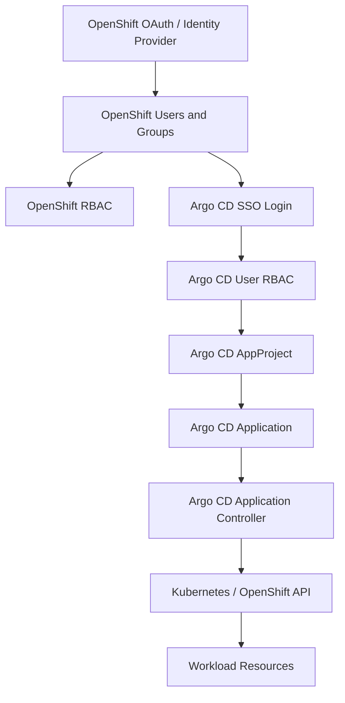

# GitOps for RBAC in OpenShift GitOps / Argo CD

**Audience:** Advanced OpenShift administrators, platform engineers, SREs, and OpenShift GitOps operators with production responsibility.  
**Experience level:** Written from a 10-year Linux/OpenShift/DevOps operations point of view.  
**Focus:** Managing OpenShift and Argo CD RBAC declaratively using GitOps, with practical enterprise patterns, YAML, commands, troubleshooting, and security guidance.  
**Validated against:** Red Hat OpenShift GitOps 1.17 documentation, Argo CD stable documentation, OpenShift RBAC documentation, and Kubernetes RBAC concepts as available on **03 July 2026**.

---

## Table of Contents

1. [What “GitOps for RBAC” Means](#1-what-gitops-for-rbac-means)
2. [Why RBAC Must Be Treated as GitOps Code](#2-why-rbac-must-be-treated-as-gitops-code)
3. [RBAC Layers in OpenShift GitOps](#3-rbac-layers-in-openshift-gitops)
4. [Mental Model: Four Permission Planes](#4-mental-model-four-permission-planes)
5. [OpenShift RBAC Refresher](#5-openshift-rbac-refresher)
6. [Argo CD RBAC Refresher](#6-argo-cd-rbac-refresher)
7. [OpenShift GitOps Operator RBAC Configuration](#7-openshift-gitops-operator-rbac-configuration)
8. [AppProject as the GitOps RBAC Boundary](#8-appproject-as-the-gitops-rbac-boundary)
9. [Git Repository Structure for RBAC](#9-git-repository-structure-for-rbac)
10. [Bootstrap Pattern for RBAC GitOps](#10-bootstrap-pattern-for-rbac-gitops)
11. [Managing OpenShift Groups Declaratively](#11-managing-openshift-groups-declaratively)
12. [Managing Namespaced RBAC by GitOps](#12-managing-namespaced-rbac-by-gitops)
13. [Managing Cluster RBAC by GitOps](#13-managing-cluster-rbac-by-gitops)
14. [Argo CD Global RBAC Policy Examples](#14-argo-cd-global-rbac-policy-examples)
15. [Project-Level Argo CD RBAC Examples](#15-project-level-argo-cd-rbac-examples)
16. [Application Controller Permissions](#16-application-controller-permissions)
17. [Aggregated ClusterRoles in OpenShift GitOps](#17-aggregated-clusterroles-in-openshift-gitops)
18. [Multi-Tenant RBAC Design](#18-multi-tenant-rbac-design)
19. [Production RBAC Scenarios](#19-production-rbac-scenarios)
20. [Security Anti-Patterns](#20-security-anti-patterns)
21. [Policy Validation and Testing](#21-policy-validation-and-testing)
22. [Troubleshooting GitOps RBAC](#22-troubleshooting-gitops-rbac)
23. [Operational Runbook](#23-operational-runbook)
24. [Best Practices Checklist](#24-best-practices-checklist)
25. [Interview / Exam Style Questions](#25-interview--exam-style-questions)
26. [Complete Reference Manifests](#26-complete-reference-manifests)
27. [References](#27-references)

---

## 1. What “GitOps for RBAC” Means

**GitOps for RBAC** means storing, reviewing, approving, applying, auditing, and reverting access-control configuration through Git instead of manually changing permissions from the OpenShift console or CLI.

In OpenShift GitOps, this usually includes:

- OpenShift `Group`, `Role`, `ClusterRole`, `RoleBinding`, and `ClusterRoleBinding` objects.
- Argo CD `AppProject` objects.
- Argo CD user-level RBAC policies.
- Argo CD SSO/OAuth integration settings.
- ServiceAccount access used by workloads and automation.
- Controller-level permissions used by Argo CD to apply manifests.
- Namespace ownership and team isolation configuration.

A simple definition:

> RBAC GitOps is the practice of making Git the source of truth for **who can do what, where, and through which deployment path**.

In a production OpenShift environment, RBAC is not only a security topic. It is also an operations, compliance, reliability, and incident-response topic.

---

## 2. Why RBAC Must Be Treated as GitOps Code

Manual RBAC changes are dangerous in large OpenShift clusters because they are easy to apply, hard to review, and often forgotten after incidents.

Common real-world problems:

| Problem | Example | Risk |
|---|---|---|
| Manual role binding | `oc adm policy add-cluster-role-to-user cluster-admin user1` | No peer review, excessive access |
| Temporary access never removed | Developer gets `edit` during incident | Long-term privilege drift |
| Namespace-by-namespace inconsistency | Team A has `admin`, Team B has `edit`, Team C has custom role | Hard troubleshooting and audit gaps |
| ClusterRoleBinding sprawl | Many users directly bound to powerful roles | Privilege escalation |
| Argo CD default project left open | Any repo, any namespace, any resource kind | Multi-tenant security failure |
| Argo CD sync allowed too broadly | Developers can sync prod without approval | Production outage |

GitOps solves this by making RBAC:

- **Declarative**: Desired access is written as YAML or policy strings.
- **Versioned**: Every access change has history.
- **Reviewable**: Pull requests enforce approval.
- **Auditable**: Git commit history shows who changed what.
- **Reversible**: A bad RBAC change can be reverted.
- **Consistent**: Environments can share tested patterns.
- **Automated**: Argo CD continuously reconciles desired RBAC state.

For a senior administrator, the goal is not just to “create RoleBindings”. The goal is to create a controlled access-delivery system.

---

## 3. RBAC Layers in OpenShift GitOps

GitOps RBAC in OpenShift has multiple layers. Confusing these layers is one of the biggest mistakes administrators make.



The important layers are:

| Layer | Object / Mechanism | Controls |
|---|---|---|
| Identity | OpenShift OAuth, LDAP, HTPasswd, OIDC, groups | Who the user is |
| OpenShift RBAC | `Role`, `ClusterRole`, `RoleBinding`, `ClusterRoleBinding` | What users/service accounts can do through Kubernetes API |
| Argo CD user RBAC | Argo CD `policy.csv`, roles, groups | What users can do in Argo CD UI/API/CLI |
| Argo CD AppProject | `AppProject` | What repos, destinations, and resource kinds an app can use |
| Argo CD controller RBAC | Controller ServiceAccount permissions | What Argo CD itself can apply to the cluster |
| Git permissions | Branch protection, CODEOWNERS, pull requests | Who can change desired state |

A user may have permission in one layer but still fail in another.

Example:

- User has OpenShift `edit` in namespace `dev-a`.
- User logs into Argo CD but has no Argo CD RBAC policy.
- Result: User can run `oc` commands but cannot sync applications from Argo CD.

Another example:

- User has Argo CD `sync` permission.
- Argo CD AppProject does not allow destination namespace `prod-a`.
- Result: Sync is blocked by AppProject restrictions.

Another example:

- AppProject allows deploying `ClusterRole`.
- Argo CD Application Controller lacks cluster-level permission to create `ClusterRole`.
- Result: Sync fails with `forbidden` from the Kubernetes API.

---

## 4. Mental Model: Four Permission Planes

When troubleshooting GitOps RBAC, always ask four questions.

### Plane 1: Can the human user log in?

This is identity and SSO.

Check:

```bash
oc whoami
oc get users
oc get groups
oc get oauth cluster -o yaml
oc get argocd -n openshift-gitops
```

For OpenShift GitOps with Dex OpenShift OAuth, the Argo CD instance can use OpenShift users and groups through the platform OAuth server.

### Plane 2: Can the human user perform the Argo CD action?

This is Argo CD RBAC.

Examples of Argo CD actions:

- View application.
- Sync application.
- Delete application.
- View logs.
- Exec into pod from Argo CD UI.
- Manage repositories.
- Manage clusters.
- Manage projects.

Check Argo CD RBAC policy:

```bash
oc get argocd openshift-gitops -n openshift-gitops -o yaml
oc get cm argocd-rbac-cm -n openshift-gitops -o yaml
argocd account can-i sync applications team-a/myapp
```

### Plane 3: Does the AppProject allow the deployment?

This is Argo CD project isolation.

Check:

```bash
oc get appproject -n openshift-gitops
oc get appproject team-a -n openshift-gitops -o yaml
argocd proj get team-a
```

Look at:

- `sourceRepos`
- `destinations`
- `clusterResourceWhitelist`
- `clusterResourceBlacklist`
- `namespaceResourceWhitelist`
- `namespaceResourceBlacklist`
- `roles`

### Plane 4: Can Argo CD controller apply the resource?

This is Kubernetes/OpenShift authorization for the Argo CD Application Controller ServiceAccount.

Check controller identity:

```bash
oc get sa -n openshift-gitops
oc get clusterrolebinding | grep argocd
oc auth can-i create rolebindings \
  --as=system:serviceaccount:openshift-gitops:openshift-gitops-argocd-application-controller \
  -n team-a-dev
```

For cluster-scoped resources:

```bash
oc auth can-i create clusterroles \
  --as=system:serviceaccount:openshift-gitops:openshift-gitops-argocd-application-controller
```

---

## 5. OpenShift RBAC Refresher

OpenShift uses Kubernetes RBAC with OpenShift-specific defaults and operational behavior.

### 5.1 Role vs ClusterRole

| Object | Scope | Purpose |
|---|---|---|
| `Role` | Namespace | Defines permissions only inside one namespace |
| `ClusterRole` | Cluster | Defines permissions cluster-wide or reusable permissions |
| `RoleBinding` | Namespace | Binds a `Role` or `ClusterRole` to users/groups/service accounts in one namespace |
| `ClusterRoleBinding` | Cluster | Binds a `ClusterRole` cluster-wide |

Important point:

A `RoleBinding` can reference a `ClusterRole`, but the binding is still namespace-scoped.

Example:

```bash
oc adm policy add-role-to-group edit dev-team -n dev-a
```

This gives group `dev-team` the `edit` cluster role only in namespace `dev-a`.

### 5.2 Default OpenShift ClusterRoles

Common default roles:

| Role | Meaning |
|---|---|
| `view` | Can view most resources but cannot modify them |
| `edit` | Can modify most namespace resources but cannot manage roles/bindings |
| `admin` | Can manage most namespace resources including role bindings inside that namespace |
| `cluster-reader` | Can view most cluster resources |
| `cluster-admin` | Full cluster administrator |
| `self-provisioner` | Can create projects |

Senior-admin warning:

Do not manually edit default ClusterRoles such as `admin`, `edit`, `view`, or `cluster-admin`. Create custom roles or use aggregation instead.

### 5.3 Authorization Evaluation

OpenShift evaluates authorization by checking:

1. User identity and groups.
2. ClusterRoleBindings that apply.
3. RoleBindings in the target namespace.
4. Rules from matching roles.
5. Deny by default if no rule matches.

Useful command:

```bash
oc auth can-i <verb> <resource> -n <namespace>
```

Examples:

```bash
oc auth can-i create pods -n dev-a --as=alice
oc auth can-i create rolebindings -n dev-a --as=alice
oc auth can-i create clusterroles --as=alice
oc auth can-i '*' '*' --as=system:serviceaccount:openshift-gitops:openshift-gitops-argocd-application-controller -n dev-a
```

---

## 6. Argo CD RBAC Refresher

Argo CD RBAC controls what authenticated Argo CD users can do inside Argo CD.

It does **not** directly replace Kubernetes RBAC.

Argo CD RBAC answers questions like:

- Can this user see application `team-a/payment-api`?
- Can this user sync it?
- Can this user delete it?
- Can this user change its source repo?
- Can this user view logs?
- Can this user exec into a pod?
- Can this user create repositories or clusters?

### 6.1 Where Argo CD RBAC Lives

In upstream Argo CD, RBAC is commonly defined in `argocd-rbac-cm`:

```yaml
apiVersion: v1
kind: ConfigMap
metadata:
  name: argocd-rbac-cm
  namespace: argocd
data:
  policy.default: role:readonly
  policy.csv: |
    p, role:dev-sync, applications, get, team-a/*, allow
    p, role:dev-sync, applications, sync, team-a/*, allow
    g, team-a-devs, role:dev-sync
```

In Red Hat OpenShift GitOps, user-level access can be configured through the `ArgoCD` custom resource under the `rbac` section. The Operator reconciles the generated Argo CD configuration.

Example:

```yaml
apiVersion: argoproj.io/v1beta1
kind: ArgoCD
metadata:
  name: openshift-gitops
  namespace: openshift-gitops
spec:
  rbac:
    defaultPolicy: role:readonly
    policy: |
      p, role:team-a-sync, applications, get, team-a/*, allow
      p, role:team-a-sync, applications, sync, team-a/*, allow
      g, ocp-team-a, role:team-a-sync
    scopes: '[groups]'
```

### 6.2 Argo CD Built-In Roles

Argo CD has two common built-in roles:

| Role | Meaning |
|---|---|
| `role:readonly` | Read-only access to Argo CD resources |
| `role:admin` | Unrestricted Argo CD access |

Do not confuse `role:admin` in Argo CD with OpenShift `cluster-admin`.

`role:admin` means full Argo CD privileges. It does not automatically mean full Kubernetes API privileges. However, if Argo CD controller has powerful cluster access, Argo CD admin can effectively trigger high-impact cluster changes through Argo CD.

### 6.3 Argo CD Policy Format

Argo CD RBAC policy format:

```text
p, <subject>, <resource>, <action>, <object>, <effect>
g, <user-or-group>, <role>
```

Example:

```text
p, role:team-a-sync, applications, get, team-a/*, allow
p, role:team-a-sync, applications, sync, team-a/*, allow
g, ocp-team-a, role:team-a-sync
```

Meaning:

- Create role `team-a-sync`.
- Allow it to get and sync applications in project `team-a`.
- Map OpenShift/OIDC group `ocp-team-a` to that role.

### 6.4 Common Argo CD Resources and Actions

| Resource | Common Actions | Notes |
|---|---|---|
| `applications` | `get`, `create`, `update`, `delete`, `sync`, `action`, `override` | Main resource for app operations |
| `applicationsets` | `get`, `create`, `update`, `delete` | Can indirectly create Applications |
| `projects` | `get`, `create`, `update`, `delete` | Powerful; limit to platform team |
| `repositories` | `get`, `create`, `update`, `delete` | Controls Git sources |
| `clusters` | `get`, `create`, `update`, `delete` | Controls managed clusters |
| `logs` | `get` | Allows viewing pod logs through Argo CD |
| `exec` | `create` | Allows pod exec through Argo CD UI |
| `accounts` | `get`, `update` | Local account management |

High-risk actions:

- `applications, override`: can sync arbitrary manifests instead of the configured Git source.
- `exec, create`: allows shell access into application pods.
- `repositories, create/update/delete`: can redirect deployment source.
- `clusters, create/update/delete`: can change target clusters.
- `projects, update`: can weaken project guardrails.
- `applicationsets, create`: can indirectly create many Applications.

### 6.5 Default Policy Warning

`policy.default` applies to authenticated users. If `policy.default` is too powerful, every authenticated user inherits that access.

Safer pattern:

```yaml
data:
  policy.default: role:authenticated
  policy.csv: |
    p, role:authenticated, applications, get, */*, deny
    p, role:team-a-read, applications, get, team-a/*, allow
    g, ocp-team-a, role:team-a-read
```

In practice, keep default policy minimal. Grant actual permissions through explicit group mappings.

---

## 7. OpenShift GitOps Operator RBAC Configuration

Red Hat OpenShift GitOps installs Argo CD using the OpenShift GitOps Operator. The primary custom resource is `ArgoCD`.

### 7.1 Default Namespace

Default instance is usually in:

```bash
openshift-gitops
```

Check:

```bash
oc get argocd -A
oc get pods -n openshift-gitops
oc get route -n openshift-gitops
```

### 7.2 Enable OpenShift OAuth Login

Modern OpenShift GitOps uses `.spec.sso`.

Example:

```yaml
apiVersion: argoproj.io/v1beta1
kind: ArgoCD
metadata:
  name: openshift-gitops
  namespace: openshift-gitops
spec:
  sso:
    provider: dex
    dex:
      openShiftOAuth: true
  rbac:
    defaultPolicy: role:readonly
    scopes: '[groups]'
    policy: |
      g, cluster-admins, role:admin
```

Operational notes:

- Dex can use OpenShift OAuth users and groups.
- `scopes: '[groups]'` tells Argo CD to evaluate group claims.
- Direct OpenShift `ClusterRoleBinding` membership does not always translate cleanly to Argo CD role mapping. Use OpenShift groups and map those groups in Argo CD RBAC.

### 7.3 Recommended Group Strategy

Create OpenShift groups that represent platform and application teams:

```bash
oc adm groups new gitops-platform-admins
oc adm groups new gitops-team-a-admins
oc adm groups new gitops-team-a-developers
oc adm groups new gitops-team-a-readonly
```

Add users:

```bash
oc adm groups add-users gitops-team-a-developers alice bob
oc adm groups add-users gitops-platform-admins platform1 platform2
```

Then map groups in Argo CD RBAC:

```yaml
spec:
  rbac:
    defaultPolicy: role:readonly
    scopes: '[groups]'
    policy: |
      g, gitops-platform-admins, role:admin
      g, gitops-team-a-developers, role:team-a-sync
      p, role:team-a-sync, applications, get, team-a/*, allow
      p, role:team-a-sync, applications, sync, team-a/*, allow
      p, role:team-a-sync, logs, get, team-a/*, allow
```

### 7.4 Do Not Give Everyone Argo CD Admin

Bad:

```text
g, system:authenticated, role:admin
```

Bad:

```text
g, developers, role:admin
```

Better:

```text
g, gitops-platform-admins, role:admin
g, gitops-team-a-developers, role:team-a-sync
```

---

## 8. AppProject as the GitOps RBAC Boundary

`AppProject` is one of the most important Argo CD security objects.

It controls:

- Which Git repositories are trusted.
- Which clusters and namespaces applications may deploy to.
- Which Kubernetes resource kinds may be deployed.
- Which users/groups can perform app-level operations inside that project.
- Sync windows, depending on configuration.

### 8.1 Why AppProject Matters

Without AppProject restrictions, a user with application create/update privileges can potentially point an app to:

- Another Git repo.
- Another namespace.
- Another cluster.
- A manifest containing powerful RBAC resources.
- A manifest containing cluster-scoped resources.

`AppProject` is the policy boundary between **Argo CD access** and **Kubernetes impact**.

### 8.2 Default Project Risk

The Argo CD `default` project is often very permissive when first created.

A strict platform should not run production apps in the default project.

Hardened default project:

```yaml
apiVersion: argoproj.io/v1alpha1
kind: AppProject
metadata:
  name: default
  namespace: openshift-gitops
spec:
  sourceRepos: []
  destinations: []
  sourceNamespaces: []
  namespaceResourceBlacklist:
    - group: '*'
      kind: '*'
```

This blocks accidental deployments through the default project.

### 8.3 Team Project Example

```yaml
apiVersion: argoproj.io/v1alpha1
kind: AppProject
metadata:
  name: team-a
  namespace: openshift-gitops
  labels:
    owner: team-a
    environment: shared
spec:
  description: Team A application boundary

  sourceRepos:
    - 'https://git.example.com/platform/team-a-apps.git'
    - 'https://git.example.com/platform/team-a-config.git'

  destinations:
    - server: https://kubernetes.default.svc
      namespace: team-a-dev
    - server: https://kubernetes.default.svc
      namespace: team-a-test
    - server: https://kubernetes.default.svc
      namespace: team-a-prod

  clusterResourceWhitelist: []

  namespaceResourceBlacklist:
    - group: rbac.authorization.k8s.io
      kind: RoleBinding
    - group: rbac.authorization.k8s.io
      kind: Role
    - group: ''
      kind: ResourceQuota
    - group: ''
      kind: LimitRange

  roles:
    - name: readonly
      description: Read-only access to Team A applications
      groups:
        - gitops-team-a-readonly
      policies:
        - p, proj:team-a:readonly, applications, get, team-a/*, allow
        - p, proj:team-a:readonly, logs, get, team-a/*, allow

    - name: sync-dev-test
      description: Sync Team A non-prod applications
      groups:
        - gitops-team-a-developers
      policies:
        - p, proj:team-a:sync-dev-test, applications, get, team-a/*, allow
        - p, proj:team-a:sync-dev-test, applications, sync, team-a/team-a-*-dev, allow
        - p, proj:team-a:sync-dev-test, applications, sync, team-a/team-a-*-test, allow
        - p, proj:team-a:sync-dev-test, logs, get, team-a/*, allow

    - name: prod-sync
      description: Production sync access for release managers
      groups:
        - gitops-team-a-release-managers
      policies:
        - p, proj:team-a:prod-sync, applications, get, team-a/*, allow
        - p, proj:team-a:prod-sync, applications, sync, team-a/team-a-*-prod, allow
        - p, proj:team-a:prod-sync, logs, get, team-a/*, allow
```

Important design decision:

- Application teams can manage app manifests.
- Platform team owns namespace-level RBAC, quotas, limits, and high-risk objects.
- Production sync is separated from development sync.

---

## 9. Git Repository Structure for RBAC

A clean repository structure is critical.

### 9.1 Recommended Split

Use at least two repositories:

| Repository | Owner | Purpose |
|---|---|---|
| `cluster-config` | Platform team | Cluster-wide and namespace baseline RBAC |
| `app-config` | Application teams | Application manifests only |

Example:

```text
cluster-config/
├── clusters/
│   ├── prod/
│   │   ├── argocd/
│   │   │   ├── argocd-cr.yaml
│   │   │   ├── appprojects/
│   │   │   │   ├── default-locked.yaml
│   │   │   │   ├── team-a.yaml
│   │   │   │   └── team-b.yaml
│   │   │   └── applications/
│   │   │       ├── team-a-root.yaml
│   │   │       └── platform-rbac-root.yaml
│   │   ├── namespaces/
│   │   │   ├── team-a-dev.yaml
│   │   │   ├── team-a-test.yaml
│   │   │   └── team-a-prod.yaml
│   │   ├── groups/
│   │   │   ├── gitops-platform-admins.yaml
│   │   │   └── gitops-team-a.yaml
│   │   ├── rbac/
│   │   │   ├── clusterroles/
│   │   │   ├── clusterrolebindings/
│   │   │   └── namespace-bindings/
│   │   └── policies/
│   │       ├── kyverno/
│   │       └── gatekeeper/
│   └── nonprod/
│       └── ...
└── README.md
```

Application repo:

```text
team-a-apps/
├── apps/
│   ├── payment-api/
│   │   ├── base/
│   │   │   ├── deployment.yaml
│   │   │   ├── service.yaml
│   │   │   └── kustomization.yaml
│   │   └── overlays/
│   │       ├── dev/
│   │       ├── test/
│   │       └── prod/
│   └── frontend/
└── README.md
```

### 9.2 Do Not Mix Ownership Blindly

Bad pattern:

```text
team-a-apps/
├── deployment.yaml
├── service.yaml
├── clusterrolebinding-admin.yaml
└── namespace-prod.yaml
```

This lets application developers control security boundaries.

Better pattern:

- Application repo contains workload manifests only.
- Platform repo contains namespace, RBAC, quotas, NetworkPolicies, SCC bindings, and AppProjects.

### 9.3 Kustomize Layout for RBAC

```text
rbac/
├── base/
│   ├── roles/
│   │   ├── app-viewer.yaml
│   │   └── app-operator.yaml
│   ├── rolebindings/
│   │   ├── team-a-dev-view.yaml
│   │   └── team-a-dev-edit.yaml
│   └── kustomization.yaml
└── overlays/
    ├── dev/
    │   ├── kustomization.yaml
    │   └── patch-rolebindings.yaml
    ├── test/
    └── prod/
```

---

## 10. Bootstrap Pattern for RBAC GitOps

The first RBAC GitOps problem is chicken-and-egg:

> Argo CD needs permissions to apply RBAC, but RBAC is supposed to be managed by Argo CD.

### 10.1 Bootstrap Steps

Recommended sequence:

1. Install OpenShift GitOps Operator.
2. Create or configure Argo CD instance.
3. Configure SSO and minimal Argo CD admin group.
4. Bootstrap a platform root application manually.
5. Argo CD syncs platform RBAC repository.
6. Platform RBAC repository creates AppProjects, namespaces, groups, RoleBindings, and additional Applications.
7. Application teams deploy through their constrained AppProjects.

### 10.2 Manual Bootstrap Commands

```bash
oc new-project openshift-gitops

oc get argocd -n openshift-gitops

oc apply -f argocd-cr.yaml

oc apply -f platform-root-application.yaml
```

After bootstrap, avoid manual changes. All future changes should be pull requests.

### 10.3 Platform Root Application

```yaml
apiVersion: argoproj.io/v1alpha1
kind: Application
metadata:
  name: platform-rbac-root
  namespace: openshift-gitops
spec:
  project: platform
  source:
    repoURL: https://git.example.com/platform/cluster-config.git
    targetRevision: main
    path: clusters/prod
  destination:
    server: https://kubernetes.default.svc
    namespace: openshift-gitops
  syncPolicy:
    automated:
      prune: true
      selfHeal: true
    syncOptions:
      - CreateNamespace=false
```

### 10.4 Bootstrap Safety

Use manual approval for high-risk syncs initially:

```yaml
syncPolicy: {}
```

Then move to automated sync after validation:

```yaml
syncPolicy:
  automated:
    prune: true
    selfHeal: true
```

For production RBAC, consider manual sync or sync windows for cluster-level permissions.

---

## 11. Managing OpenShift Groups Declaratively

OpenShift groups can be represented as Kubernetes-style API objects.

### 11.1 Group Manifest

```yaml
apiVersion: user.openshift.io/v1
kind: Group
metadata:
  name: gitops-team-a-developers
users:
  - alice
  - bob
```

Another group:

```yaml
apiVersion: user.openshift.io/v1
kind: Group
metadata:
  name: gitops-team-a-release-managers
users:
  - release1
  - release2
```

### 11.2 When to Manage Groups in Git

Good candidates:

- Platform groups.
- Service groups.
- Lab or exam groups.
- Static team groups.
- Break-glass groups with strict review.

Be careful with:

- HR-driven enterprise identity groups.
- LDAP/AD synced groups.
- Groups controlled by external IAM automation.

If groups come from LDAP/IdP, do not duplicate them manually in OpenShift unless your organization intentionally uses local OpenShift groups.

### 11.3 Group Naming Standards

Recommended names:

```text
gitops-platform-admins
gitops-platform-readonly
gitops-team-a-admins
gitops-team-a-developers
gitops-team-a-release-managers
gitops-team-a-readonly
ocp-team-a-admins
ocp-team-a-edit
ocp-team-a-view
```

Avoid vague names:

```text
admins
users
devs
team1
superusers
```

---

## 12. Managing Namespaced RBAC by GitOps

Namespaced RBAC is the most common production use case.

### 12.1 Namespace Manifest

```yaml
apiVersion: v1
kind: Namespace
metadata:
  name: team-a-dev
  labels:
    owner: team-a
    environment: dev
    managed-by: gitops
```

In OpenShift, `Project` and `Namespace` are related. You can create a `Project` or a `Namespace`. For GitOps, `Namespace` is commonly used in manifests.

### 12.2 RoleBinding to Default ClusterRole

Give developers edit access in dev:

```yaml
apiVersion: rbac.authorization.k8s.io/v1
kind: RoleBinding
metadata:
  name: team-a-developers-edit
  namespace: team-a-dev
subjects:
  - kind: Group
    apiGroup: rbac.authorization.k8s.io
    name: gitops-team-a-developers
roleRef:
  kind: ClusterRole
  apiGroup: rbac.authorization.k8s.io
  name: edit
```

Give release managers admin access in prod:

```yaml
apiVersion: rbac.authorization.k8s.io/v1
kind: RoleBinding
metadata:
  name: team-a-release-admin
  namespace: team-a-prod
subjects:
  - kind: Group
    apiGroup: rbac.authorization.k8s.io
    name: gitops-team-a-release-managers
roleRef:
  kind: ClusterRole
  apiGroup: rbac.authorization.k8s.io
  name: admin
```

Give developers read-only prod access:

```yaml
apiVersion: rbac.authorization.k8s.io/v1
kind: RoleBinding
metadata:
  name: team-a-developers-prod-view
  namespace: team-a-prod
subjects:
  - kind: Group
    apiGroup: rbac.authorization.k8s.io
    name: gitops-team-a-developers
roleRef:
  kind: ClusterRole
  apiGroup: rbac.authorization.k8s.io
  name: view
```

### 12.3 Custom Namespaced Role

Sometimes `edit` is too broad.

Example custom role for deployment operations without secret read:

```yaml
apiVersion: rbac.authorization.k8s.io/v1
kind: Role
metadata:
  name: deployment-operator
  namespace: team-a-dev
rules:
  - apiGroups: ['apps']
    resources: ['deployments', 'deployments/scale', 'replicasets']
    verbs: ['get', 'list', 'watch', 'create', 'update', 'patch']
  - apiGroups: ['']
    resources: ['pods', 'services', 'configmaps', 'events']
    verbs: ['get', 'list', 'watch']
  - apiGroups: ['route.openshift.io']
    resources: ['routes']
    verbs: ['get', 'list', 'watch']
```

Bind it:

```yaml
apiVersion: rbac.authorization.k8s.io/v1
kind: RoleBinding
metadata:
  name: team-a-deployment-operator
  namespace: team-a-dev
subjects:
  - kind: Group
    apiGroup: rbac.authorization.k8s.io
    name: gitops-team-a-developers
roleRef:
  kind: Role
  apiGroup: rbac.authorization.k8s.io
  name: deployment-operator
```

### 12.4 ServiceAccount RBAC

Workload ServiceAccount:

```yaml
apiVersion: v1
kind: ServiceAccount
metadata:
  name: payment-api
  namespace: team-a-dev
```

Role for reading ConfigMaps only:

```yaml
apiVersion: rbac.authorization.k8s.io/v1
kind: Role
metadata:
  name: config-reader
  namespace: team-a-dev
rules:
  - apiGroups: ['']
    resources: ['configmaps']
    verbs: ['get', 'list', 'watch']
```

RoleBinding:

```yaml
apiVersion: rbac.authorization.k8s.io/v1
kind: RoleBinding
metadata:
  name: payment-api-config-reader
  namespace: team-a-dev
subjects:
  - kind: ServiceAccount
    name: payment-api
    namespace: team-a-dev
roleRef:
  kind: Role
  apiGroup: rbac.authorization.k8s.io
  name: config-reader
```

Senior-admin note:

Always specify `namespace` for `ServiceAccount` subjects in RoleBindings and ClusterRoleBindings. ServiceAccounts are namespace-scoped identities.

---

## 13. Managing Cluster RBAC by GitOps

Cluster RBAC should be owned by the platform team only.

### 13.1 ClusterRole Example

Example read-only role for platform observers:

```yaml
apiVersion: rbac.authorization.k8s.io/v1
kind: ClusterRole
metadata:
  name: platform-observer
  labels:
    rbac.example.com/managed-by: gitops
rules:
  - apiGroups: ['']
    resources: ['nodes', 'namespaces', 'persistentvolumes']
    verbs: ['get', 'list', 'watch']
  - apiGroups: ['apps']
    resources: ['deployments', 'daemonsets', 'statefulsets']
    verbs: ['get', 'list', 'watch']
  - apiGroups: ['route.openshift.io']
    resources: ['routes']
    verbs: ['get', 'list', 'watch']
```

Binding:

```yaml
apiVersion: rbac.authorization.k8s.io/v1
kind: ClusterRoleBinding
metadata:
  name: platform-observer-binding
  labels:
    rbac.example.com/managed-by: gitops
subjects:
  - kind: Group
    apiGroup: rbac.authorization.k8s.io
    name: gitops-platform-readonly
roleRef:
  kind: ClusterRole
  apiGroup: rbac.authorization.k8s.io
  name: platform-observer
```

### 13.2 Avoid User-Specific ClusterRoleBindings

Bad:

```yaml
subjects:
  - kind: User
    name: alice
```

Better:

```yaml
subjects:
  - kind: Group
    name: gitops-platform-admins
    apiGroup: rbac.authorization.k8s.io
```

Why?

- Groups are easier to audit.
- User movement does not require RBAC YAML edits.
- Integrates better with SSO/IAM.
- Better access review process.

### 13.3 High-Risk ClusterRoles

Review very carefully if a role includes:

```yaml
verbs: ['*']
resources: ['*']
apiGroups: ['*']
```

Also review access to:

- `secrets`
- `serviceaccounts/token`
- `rolebindings`
- `clusterrolebindings`
- `roles`
- `clusterroles`
- `securitycontextconstraints`
- `oauths`
- `nodes/proxy`
- `pods/exec`
- `pods/attach`
- `pods/portforward`
- `validatingwebhookconfigurations`
- `mutatingwebhookconfigurations`
- `customresourcedefinitions`

### 13.4 Role Escalation Risk

Giving a user permission to create RoleBindings can be privilege escalation if they can bind powerful ClusterRoles.

Example risk:

- User can create RoleBindings in namespace `prod`.
- User creates RoleBinding to `admin` or another powerful ClusterRole.
- User gains higher access.

Kubernetes/OpenShift has built-in escalation checks, but do not rely on that alone. Design policies so users do not manage RBAC unless they are namespace owners.

---

## 14. Argo CD Global RBAC Policy Examples

Global RBAC belongs in the Argo CD instance configuration.

### 14.1 Platform Admin

```yaml
spec:
  rbac:
    defaultPolicy: role:readonly
    scopes: '[groups]'
    policy: |
      g, gitops-platform-admins, role:admin
```

Use for a small trusted platform team only.

### 14.2 Global Read-Only for Auditors

```yaml
spec:
  rbac:
    defaultPolicy: role:authenticated
    scopes: '[groups]'
    policy: |
      p, role:authenticated, applications, get, */*, deny
      p, role:auditor, applications, get, */*, allow
      p, role:auditor, projects, get, *, allow
      p, role:auditor, logs, get, */*, allow
      g, gitops-auditors, role:auditor
```

### 14.3 Team Sync Role

```yaml
spec:
  rbac:
    defaultPolicy: role:readonly
    scopes: '[groups]'
    policy: |
      p, role:team-a-sync, applications, get, team-a/*, allow
      p, role:team-a-sync, applications, sync, team-a/*, allow
      p, role:team-a-sync, logs, get, team-a/*, allow
      g, gitops-team-a-developers, role:team-a-sync
```

### 14.4 Restrict Delete

```yaml
spec:
  rbac:
    policy: |
      p, role:team-a-sync, applications, get, team-a/*, allow
      p, role:team-a-sync, applications, sync, team-a/*, allow
      p, role:team-a-sync, applications, delete, team-a/*, deny
      g, gitops-team-a-developers, role:team-a-sync
```

`deny` takes priority when it matches. Use deny rules carefully and test them.

### 14.5 Allow Logs but Not Exec

```yaml
spec:
  rbac:
    policy: |
      p, role:team-a-observe, applications, get, team-a/*, allow
      p, role:team-a-observe, logs, get, team-a/*, allow
      p, role:team-a-observe, exec, create, team-a/*, deny
      g, gitops-team-a-readonly, role:team-a-observe
```

### 14.6 Do Not Grant Override Casually

Bad:

```text
p, role:dev, applications, override, team-a/*, allow
```

Why bad?

`override` can allow users to sync arbitrary manifests instead of the desired Git source. This breaks the GitOps control model.

Use only for controlled troubleshooting or dedicated non-production workflows.

---

## 15. Project-Level Argo CD RBAC Examples

Project-level roles are defined inside `AppProject`.

### 15.1 Read-Only Project Role

```yaml
apiVersion: argoproj.io/v1alpha1
kind: AppProject
metadata:
  name: team-a
  namespace: openshift-gitops
spec:
  sourceRepos:
    - https://git.example.com/apps/team-a.git
  destinations:
    - server: https://kubernetes.default.svc
      namespace: team-a-dev
  roles:
    - name: read-only
      description: Read-only privileges for Team A applications
      groups:
        - gitops-team-a-readonly
      policies:
        - p, proj:team-a:read-only, applications, get, team-a/*, allow
        - p, proj:team-a:read-only, logs, get, team-a/*, allow
```

### 15.2 Sync Only Specific Applications

```yaml
apiVersion: argoproj.io/v1alpha1
kind: AppProject
metadata:
  name: team-a
  namespace: openshift-gitops
spec:
  roles:
    - name: payment-sync
      description: Can sync only payment applications
      groups:
        - gitops-payment-release
      policies:
        - p, proj:team-a:payment-sync, applications, get, team-a/payment-*, allow
        - p, proj:team-a:payment-sync, applications, sync, team-a/payment-*, allow
```

### 15.3 CI/CD Token Role

Project roles can be used with JWT tokens for automation.

```yaml
apiVersion: argoproj.io/v1alpha1
kind: AppProject
metadata:
  name: team-a
  namespace: openshift-gitops
spec:
  roles:
    - name: ci-sync
      description: CI token can sync selected non-prod apps
      policies:
        - p, proj:team-a:ci-sync, applications, get, team-a/*-dev, allow
        - p, proj:team-a:ci-sync, applications, sync, team-a/*-dev, allow
      jwtTokens: []
```

Create token using CLI:

```bash
argocd proj role create-token team-a ci-sync
```

Operational warning:

- Store tokens in a secure secret manager.
- Rotate tokens.
- Use short TTL if supported by your process.
- Do not store tokens in Git.

### 15.4 Prod Sync Through Release Group

```yaml
roles:
  - name: prod-release
    description: Production release managers
    groups:
      - gitops-team-a-release-managers
    policies:
      - p, proj:team-a:prod-release, applications, get, team-a/*-prod, allow
      - p, proj:team-a:prod-release, applications, sync, team-a/*-prod, allow
      - p, proj:team-a:prod-release, logs, get, team-a/*-prod, allow
```

---

## 16. Application Controller Permissions

Argo CD Application Controller is the component that applies manifests to the cluster.

Even if a user has Argo CD permission, sync can fail if the controller lacks Kubernetes permission.

### 16.1 Identify Controller ServiceAccount

Default OpenShift GitOps instance often uses ServiceAccounts similar to:

```bash
oc get sa -n openshift-gitops | grep application-controller
```

Example:

```text
openshift-gitops-argocd-application-controller
```

Check permission:

```bash
oc auth can-i create deployments \
  --as=system:serviceaccount:openshift-gitops:openshift-gitops-argocd-application-controller \
  -n team-a-dev
```

Check RBAC resources:

```bash
oc auth can-i create rolebindings \
  --as=system:serviceaccount:openshift-gitops:openshift-gitops-argocd-application-controller \
  -n team-a-dev
```

Check cluster-scoped resource:

```bash
oc auth can-i create clusterroles \
  --as=system:serviceaccount:openshift-gitops:openshift-gitops-argocd-application-controller
```

### 16.2 Namespaced Argo CD vs Cluster-Scoped Argo CD

| Mode | Behavior | Use Case |
|---|---|---|
| Namespace-scoped Argo CD | Manages limited namespaces | Team-specific Argo CD instances |
| Cluster-scoped Argo CD | Can manage multiple namespaces/clusters depending on permissions | Central platform GitOps |

Enterprise pattern:

- Central cluster-scoped Argo CD for platform-owned resources.
- Optional team-scoped Argo CD instances for strict tenant isolation.
- Strong AppProject boundaries in both cases.

### 16.3 Least Privilege for Controller

Do not automatically give the controller `cluster-admin` unless the instance is intentionally a platform root instance and protected by strong Git/Argo RBAC.

Better:

- Give controller only required namespaces.
- Restrict AppProjects.
- Restrict repos.
- Restrict cluster-scoped resources.
- Use aggregated ClusterRoles for specific additional permissions.

---

## 17. Aggregated ClusterRoles in OpenShift GitOps

OpenShift GitOps supports customizing Argo CD Application Controller permissions using user-defined or aggregated ClusterRoles for cluster-scoped Argo CD instances.

This matters when the default controller permissions are not enough, but you do not want to manually edit Operator-managed roles.

### 17.1 Why Aggregation Helps

The GitOps Operator manages some ClusterRoles. Manually editing Operator-managed ClusterRoles is bad because:

- The Operator may overwrite changes.
- Upgrades may reset permissions.
- Manual changes are hard to audit.

Aggregated ClusterRoles allow you to add permissions through separate user-defined ClusterRoles with labels.

### 17.2 Enable Aggregated ClusterRoles

Example ArgoCD CR:

```yaml
apiVersion: argoproj.io/v1beta1
kind: ArgoCD
metadata:
  name: platform-gitops
  namespace: platform-gitops
spec:
  aggregatedClusterRoles: true
```

Check generated roles:

```bash
oc get clusterrole | grep platform-gitops
oc get clusterrolebinding | grep platform-gitops
```

### 17.3 Add User-Defined Permissions

Example: allow Application Controller to manage `MachineConfigPool` resources only if your platform GitOps instance is intended to manage machine configuration.

```yaml
apiVersion: rbac.authorization.k8s.io/v1
kind: ClusterRole
metadata:
  name: argocd-application-controller-machineconfigpool-admin
  labels:
    argocd/aggregate-to-admin: 'true'
rules:
  - apiGroups:
      - machineconfiguration.openshift.io
    resources:
      - machineconfigpools
    verbs:
      - get
      - list
      - watch
      - create
      - update
      - patch
      - delete
```

Example: allow controller to manage selected custom resources:

```yaml
apiVersion: rbac.authorization.k8s.io/v1
kind: ClusterRole
metadata:
  name: argocd-application-controller-customres-view
  labels:
    argocd/aggregate-to-view: 'true'
rules:
  - apiGroups:
      - example.com
    resources:
      - widgets
    verbs:
      - get
      - list
      - watch
```

### 17.4 Verify Aggregated Permissions

```bash
oc describe clusterrole <argocd-name>-<namespace>-argocd-application-controller

oc auth can-i update machineconfigpools \
  --as=system:serviceaccount:platform-gitops:platform-gitops-argocd-application-controller
```

### 17.5 Important Caveats

- Aggregated ClusterRoles are for the Application Controller component of a cluster-scoped Argo CD instance.
- Enabling aggregation does not automatically delete user-defined ClusterRoles when you remove configuration.
- You must clean up user-defined roles manually if no longer needed.
- Treat aggregation changes as high-risk platform changes.

---

## 18. Multi-Tenant RBAC Design

A mature OpenShift GitOps platform usually has many teams and environments.

### 18.1 Tenant Model

Example tenant model:

| Tenant | Namespaces | Git Repo | AppProject | Groups |
|---|---|---|---|---|
| Team A | `team-a-dev`, `team-a-test`, `team-a-prod` | `team-a-apps.git` | `team-a` | `gitops-team-a-*` |
| Team B | `team-b-dev`, `team-b-test`, `team-b-prod` | `team-b-apps.git` | `team-b` | `gitops-team-b-*` |
| Platform | `openshift-*`, `platform-*` | `cluster-config.git` | `platform` | `gitops-platform-*` |

### 18.2 Access Matrix

| Group | Argo CD Access | OpenShift Access | Environment |
|---|---|---|---|
| `gitops-platform-admins` | Argo CD admin | Cluster admin or tightly scoped platform admin | All |
| `gitops-team-a-developers` | View/sync non-prod Team A apps | `edit` in dev/test, `view` in prod | Team A |
| `gitops-team-a-release-managers` | Sync prod Team A apps | `view` or `admin` in prod depending process | Team A prod |
| `gitops-team-a-readonly` | View apps/logs | `view` | Team A |
| `gitops-auditors` | Read-only all apps | Read-only cluster | All |

### 18.3 Team A AppProject

```yaml
apiVersion: argoproj.io/v1alpha1
kind: AppProject
metadata:
  name: team-a
  namespace: openshift-gitops
spec:
  description: Team A tenant boundary

  sourceRepos:
    - https://git.example.com/apps/team-a-apps.git

  destinations:
    - server: https://kubernetes.default.svc
      namespace: team-a-dev
    - server: https://kubernetes.default.svc
      namespace: team-a-test
    - server: https://kubernetes.default.svc
      namespace: team-a-prod

  clusterResourceWhitelist: []

  namespaceResourceBlacklist:
    - group: rbac.authorization.k8s.io
      kind: Role
    - group: rbac.authorization.k8s.io
      kind: RoleBinding
    - group: authorization.openshift.io
      kind: Role
    - group: authorization.openshift.io
      kind: RoleBinding

  roles:
    - name: dev-sync
      groups:
        - gitops-team-a-developers
      policies:
        - p, proj:team-a:dev-sync, applications, get, team-a/*, allow
        - p, proj:team-a:dev-sync, applications, sync, team-a/*-dev, allow
        - p, proj:team-a:dev-sync, applications, sync, team-a/*-test, allow
        - p, proj:team-a:dev-sync, logs, get, team-a/*, allow

    - name: prod-release
      groups:
        - gitops-team-a-release-managers
      policies:
        - p, proj:team-a:prod-release, applications, get, team-a/*-prod, allow
        - p, proj:team-a:prod-release, applications, sync, team-a/*-prod, allow
        - p, proj:team-a:prod-release, logs, get, team-a/*-prod, allow
```

### 18.4 Namespace RBAC

```yaml
apiVersion: rbac.authorization.k8s.io/v1
kind: RoleBinding
metadata:
  name: team-a-dev-edit
  namespace: team-a-dev
subjects:
  - kind: Group
    apiGroup: rbac.authorization.k8s.io
    name: gitops-team-a-developers
roleRef:
  kind: ClusterRole
  apiGroup: rbac.authorization.k8s.io
  name: edit
---
apiVersion: rbac.authorization.k8s.io/v1
kind: RoleBinding
metadata:
  name: team-a-prod-view
  namespace: team-a-prod
subjects:
  - kind: Group
    apiGroup: rbac.authorization.k8s.io
    name: gitops-team-a-developers
roleRef:
  kind: ClusterRole
  apiGroup: rbac.authorization.k8s.io
  name: view
```

### 18.5 Why Both Argo CD RBAC and OpenShift RBAC?

Because users interact with the platform through two paths:

1. Argo CD UI/API/CLI.
2. OpenShift API directly through `oc`, console, or automation.

Both must be controlled.

If you secure only Argo CD, users may bypass it with `oc`.

If you secure only OpenShift, users may use Argo CD to trigger changes indirectly.

A senior platform design secures both paths.

---

## 19. Production RBAC Scenarios

### Scenario 1: Developers Can Sync Dev but Not Prod

Requirements:

- Developers can view all Team A apps.
- Developers can sync dev/test apps.
- Developers cannot sync prod apps.
- Release managers can sync prod.

AppProject policies:

```yaml
roles:
  - name: developer
    groups:
      - gitops-team-a-developers
    policies:
      - p, proj:team-a:developer, applications, get, team-a/*, allow
      - p, proj:team-a:developer, applications, sync, team-a/*-dev, allow
      - p, proj:team-a:developer, applications, sync, team-a/*-test, allow
      - p, proj:team-a:developer, applications, sync, team-a/*-prod, deny

  - name: release-manager
    groups:
      - gitops-team-a-release-managers
    policies:
      - p, proj:team-a:release-manager, applications, get, team-a/*, allow
      - p, proj:team-a:release-manager, applications, sync, team-a/*-prod, allow
```

### Scenario 2: Developers Can View Logs but Cannot Exec

```yaml
roles:
  - name: observer
    groups:
      - gitops-team-a-developers
    policies:
      - p, proj:team-a:observer, applications, get, team-a/*, allow
      - p, proj:team-a:observer, logs, get, team-a/*, allow
      - p, proj:team-a:observer, exec, create, team-a/*, deny
```

### Scenario 3: Application Team Cannot Deploy RBAC Objects

```yaml
namespaceResourceBlacklist:
  - group: rbac.authorization.k8s.io
    kind: Role
  - group: rbac.authorization.k8s.io
    kind: RoleBinding
clusterResourceWhitelist: []
```

Platform team manages RBAC separately in `cluster-config`.

### Scenario 4: Team Can Deploy NetworkPolicy but Not RoleBinding

```yaml
namespaceResourceBlacklist:
  - group: rbac.authorization.k8s.io
    kind: Role
  - group: rbac.authorization.k8s.io
    kind: RoleBinding
namespaceResourceWhitelist:
  - group: networking.k8s.io
    kind: NetworkPolicy
  - group: apps
    kind: Deployment
  - group: ''
    kind: Service
  - group: route.openshift.io
    kind: Route
```

Note:

Use either whitelist or blacklist carefully. A whitelist is safer but requires maintaining allowed resource kinds.

### Scenario 5: Break-Glass Admin

Create a small group:

```yaml
apiVersion: user.openshift.io/v1
kind: Group
metadata:
  name: gitops-breakglass-admins
users: []
```

Map in Argo CD:

```yaml
spec:
  rbac:
    policy: |
      g, gitops-breakglass-admins, role:admin
```

Operational process:

1. Add user through emergency PR or controlled manual process.
2. Record incident ticket.
3. Set expiry time.
4. Remove user after incident.
5. Review Git and cluster audit logs.

### Scenario 6: Platform GitOps Manages Cluster Operators

If Argo CD manages cluster-level operators, it may need permissions for:

- `operators.coreos.com`
- `operatorgroups`
- `subscriptions`
- `installplans`
- `clusterserviceversions`
- CRDs owned by operators.

Use dedicated platform AppProject:

```yaml
apiVersion: argoproj.io/v1alpha1
kind: AppProject
metadata:
  name: platform-operators
  namespace: openshift-gitops
spec:
  sourceRepos:
    - https://git.example.com/platform/cluster-config.git
  destinations:
    - server: https://kubernetes.default.svc
      namespace: openshift-operators
    - server: https://kubernetes.default.svc
      namespace: openshift-logging
    - server: https://kubernetes.default.svc
      namespace: openshift-monitoring
  clusterResourceWhitelist:
    - group: apiextensions.k8s.io
      kind: CustomResourceDefinition
    - group: operators.coreos.com
      kind: ClusterServiceVersion
    - group: operators.coreos.com
      kind: Subscription
    - group: operators.coreos.com
      kind: OperatorGroup
```

Only platform admins should have sync permission here.

---

## 20. Security Anti-Patterns

### Anti-Pattern 1: Argo CD Admin for All Developers

Bad:

```text
g, developers, role:admin
```

Impact:

- Developers can modify projects.
- Developers can add repos.
- Developers can create apps to unauthorized destinations.
- Developers may delete applications.

Fix:

Use project-level roles and team-specific policies.

### Anti-Pattern 2: Default Project Used in Production

Bad:

```yaml
spec:
  project: default
```

Fix:

Use dedicated AppProjects.

### Anti-Pattern 3: Application Repos Contain ClusterRoleBinding

Bad:

```yaml
kind: ClusterRoleBinding
roleRef:
  name: cluster-admin
```

Fix:

ClusterRoleBindings belong in platform-owned repository with strict review.

### Anti-Pattern 4: Argo CD Controller Has Cluster-Admin Without Guardrails

This may be acceptable for a tightly controlled platform instance, but dangerous if:

- AppProjects are permissive.
- Many users are Argo CD admins.
- Git repo branch protection is weak.
- Application teams can modify platform apps.

### Anti-Pattern 5: Secrets Read Access Through `edit`

In Kubernetes/OpenShift, users with broad edit-like access may have indirect access to sensitive objects depending on exact policy. Be careful with default roles and secret access.

Use custom roles when secret read must be restricted.

### Anti-Pattern 6: `policy.default: role:admin`

Bad:

```yaml
policy.default: role:admin
```

Impact:

Every authenticated Argo CD user gets admin-level Argo CD access.

Fix:

```yaml
policy.default: role:readonly
```

or stricter:

```yaml
policy.default: role:authenticated
```

with minimal permissions.

### Anti-Pattern 7: No Git Branch Protection

RBAC in Git is only secure if Git is secure.

Required controls:

- Protected `main` branch.
- Pull request approval.
- CODEOWNERS.
- Signed commits where possible.
- CI policy validation.
- No direct pushes for high-risk paths.

Example CODEOWNERS:

```text
/clusters/prod/rbac/ @platform-security @platform-admins
/clusters/prod/argocd/ @platform-admins
/clusters/prod/namespaces/ @platform-admins
/apps/team-a/ @team-a-leads
```

---

## 21. Policy Validation and Testing

### 21.1 Validate YAML

```bash
oc apply --dry-run=server -f rbac.yaml
```

For Kustomize:

```bash
kustomize build overlays/prod | oc apply --dry-run=server -f -
```

For Argo CD app:

```bash
argocd app diff platform-rbac-root
```

### 21.2 Test OpenShift RBAC

As a user:

```bash
oc auth can-i create deployments -n team-a-dev --as=alice
oc auth can-i create rolebindings -n team-a-dev --as=alice
oc auth can-i get secrets -n team-a-prod --as=alice
```

As a group:

```bash
oc auth can-i sync applications \
  --as=alice \
  --as-group=gitops-team-a-developers
```

For ServiceAccount:

```bash
oc auth can-i get configmaps \
  --as=system:serviceaccount:team-a-dev:payment-api \
  -n team-a-dev
```

For Argo CD controller:

```bash
oc auth can-i create deployments \
  --as=system:serviceaccount:openshift-gitops:openshift-gitops-argocd-application-controller \
  -n team-a-dev
```

### 21.3 Test Argo CD RBAC

```bash
argocd account can-i get applications team-a/payment-api-dev
argocd account can-i sync applications team-a/payment-api-dev
argocd account can-i delete applications team-a/payment-api-prod
argocd account can-i get logs team-a/payment-api-dev
argocd account can-i create exec team-a/payment-api-dev
```

Depending on CLI version and login method, syntax may vary. The concept is to test the requested resource/action/object combination before production rollout.

### 21.4 Validate AppProject Restrictions

Check project:

```bash
argocd proj get team-a
```

Try to create application to unauthorized namespace:

```yaml
apiVersion: argoproj.io/v1alpha1
kind: Application
metadata:
  name: invalid-destination-test
  namespace: openshift-gitops
spec:
  project: team-a
  source:
    repoURL: https://git.example.com/apps/team-a-apps.git
    targetRevision: main
    path: apps/payment-api/overlays/dev
  destination:
    server: https://kubernetes.default.svc
    namespace: kube-system
```

Expected result:

```text
application destination is not permitted in project
```

---

## 22. Troubleshooting GitOps RBAC

### Problem 1: User Can Log In but Sees No Applications

Possible causes:

- Argo CD RBAC does not map the user/group.
- SSO group claim is missing.
- `scopes` is not set correctly.
- AppProject role does not include the user/group.
- Application belongs to a different project.

Commands:

```bash
oc get argocd openshift-gitops -n openshift-gitops -o yaml | yq '.spec.rbac'
oc get groups
argocd account get-user-info
argocd account can-i get applications team-a/payment-api
```

Fix:

```yaml
spec:
  rbac:
    scopes: '[groups]'
    policy: |
      p, role:team-a-read, applications, get, team-a/*, allow
      g, gitops-team-a-developers, role:team-a-read
```

### Problem 2: User Can View App but Cannot Sync

Cause:

RBAC allows `get` but not `sync`.

Fix:

```text
p, role:team-a-sync, applications, sync, team-a/*, allow
```

Also check project-level role if using AppProject roles.

### Problem 3: Argo CD Sync Fails with Forbidden

Error example:

```text
roles.rbac.authorization.k8s.io is forbidden: User "system:serviceaccount:openshift-gitops:openshift-gitops-argocd-application-controller" cannot create resource "roles" in API group "rbac.authorization.k8s.io" in namespace "team-a-dev"
```

Meaning:

The Argo CD Application Controller lacks Kubernetes permission.

Check:

```bash
oc auth can-i create roles \
  --as=system:serviceaccount:openshift-gitops:openshift-gitops-argocd-application-controller \
  -n team-a-dev
```

Fix options:

1. Grant controller permission if this is intended.
2. Move RBAC resource to platform AppProject.
3. Block app teams from deploying RBAC and have platform manage it.

### Problem 4: AppProject Blocks Resource

Error example:

```text
resource rbac.authorization.k8s.io:RoleBinding is not permitted in project team-a
```

Check:

```bash
oc get appproject team-a -n openshift-gitops -o yaml
```

Fix:

- Add kind to whitelist if allowed.
- Remove from blacklist if policy allows.
- Better: keep RBAC objects in platform-owned Git path.

### Problem 5: SSO Group Not Recognized

Symptoms:

- User logs in.
- User is in OpenShift group.
- Argo CD does not apply group policy.

Check:

```bash
oc get groups gitops-team-a-developers -o yaml
oc get argocd openshift-gitops -n openshift-gitops -o yaml | grep -A20 rbac
argocd account get-user-info
```

Fix:

```yaml
spec:
  rbac:
    scopes: '[groups]'
```

Also ensure the group name in policy exactly matches the identity provider claim.

### Problem 6: Direct ClusterRoleBinding Does Not Make User Argo CD Admin

OpenShift cluster admin does not automatically mean Argo CD `role:admin` unless mapped.

Recommended pattern:

```bash
oc adm groups new cluster-admins
oc adm groups add-users cluster-admins alice
oc adm policy add-cluster-role-to-group cluster-admin cluster-admins
```

Then Argo CD RBAC:

```yaml
spec:
  rbac:
    policy: |
      g, cluster-admins, role:admin
    scopes: '[groups]'
```

### Problem 7: ApplicationSet Can Bypass Application Creation Policy

If user can create ApplicationSets, they may indirectly create Applications.

Restrict ApplicationSet access:

```text
p, role:team-a-appset, applicationsets, *, team-a/*, allow
```

Do not grant broad ApplicationSet create/update access unless needed.

### Problem 8: Prod Sync Happens Without Approval

Possible causes:

- Automated sync enabled for prod.
- Too broad `sync` permissions.
- Release process depends only on Git merge.

Controls:

- Disable automated sync for production apps.
- Use sync windows.
- Use Argo CD RBAC to limit prod sync.
- Use branch protection and CODEOWNERS.
- Require separate release-manager group.

---

## 23. Operational Runbook

### 23.1 Add New Team to GitOps

1. Create OpenShift groups.
2. Create namespaces.
3. Create RoleBindings.
4. Create AppProject.
5. Create root Application or team Applications.
6. Configure repository access.
7. Test with `oc auth can-i`.
8. Test with `argocd account can-i`.
9. Document ownership.

Example checklist:

```text
[ ] Group created: gitops-team-x-developers
[ ] Group created: gitops-team-x-release-managers
[ ] Namespace created: team-x-dev
[ ] Namespace created: team-x-test
[ ] Namespace created: team-x-prod
[ ] RoleBindings applied
[ ] AppProject created
[ ] Repo allowed in AppProject
[ ] Destinations restricted
[ ] Cluster resources restricted
[ ] Default project not used
[ ] Argo CD RBAC tested
[ ] OpenShift RBAC tested
[ ] Pull request approved by platform team
```

### 23.2 Grant Temporary Prod Sync

1. Add user to release group through PR.
2. Include ticket number and expiry date in PR description.
3. Merge after approval.
4. Argo CD syncs group update.
5. User performs prod sync.
6. Remove user through follow-up PR.
7. Verify removal.

Group manifest example:

```yaml
apiVersion: user.openshift.io/v1
kind: Group
metadata:
  name: gitops-team-a-release-managers
  annotations:
    access-review.example.com/ticket: INC-12345
    access-review.example.com/expires: '2026-07-10'
users:
  - release1
  - temporary-user
```

### 23.3 Revoke Access Quickly

Fast manual emergency:

```bash
oc adm groups remove-users gitops-team-a-release-managers temporary-user
```

Then immediately fix Git:

```bash
git checkout -b revoke-temporary-user
# remove user from group YAML
git commit -m "Revoke temporary prod release access for temporary-user"
git push
```

If Git still contains the user, Argo CD self-heal may re-add the user. Always update Git.

### 23.4 Audit Current RBAC

```bash
oc get rolebindings -A
oc get clusterrolebindings
oc get clusterroles
oc get groups
oc get appprojects -n openshift-gitops
oc get argocd -n openshift-gitops -o yaml
```

Find cluster-admin bindings:

```bash
oc get clusterrolebindings -o jsonpath='{range .items[?(@.roleRef.name=="cluster-admin")]}{.metadata.name}{"\n"}{end}'
```

Find RoleBindings to admin:

```bash
oc get rolebindings -A -o jsonpath='{range .items[?(@.roleRef.name=="admin")]}{.metadata.namespace}{"/"}{.metadata.name}{"\n"}{end}'
```

Find Argo CD admins:

```bash
oc get argocd openshift-gitops -n openshift-gitops -o yaml | grep -i 'role:admin'
```

---

## 24. Best Practices Checklist

### 24.1 Design

- [ ] Separate platform RBAC from application manifests.
- [ ] Use groups, not individual users, in bindings.
- [ ] Use dedicated AppProjects per tenant/team/environment.
- [ ] Lock down the default AppProject.
- [ ] Restrict `sourceRepos` to trusted repos.
- [ ] Restrict `destinations` to approved namespaces and clusters.
- [ ] Restrict cluster-scoped resources.
- [ ] Do not allow application teams to deploy ClusterRoleBindings.
- [ ] Keep production sync permissions separate from non-production sync.
- [ ] Treat Argo CD `role:admin` as highly privileged.

### 24.2 Git Controls

- [ ] Protected branch enabled.
- [ ] Pull request approval required.
- [ ] CODEOWNERS configured.
- [ ] Security team owns high-risk RBAC paths.
- [ ] CI validates YAML and policy.
- [ ] No secrets in Git.
- [ ] Commit messages include ticket/change reference.

### 24.3 OpenShift Controls

- [ ] Use `oc auth can-i` before rollout.
- [ ] Avoid direct user ClusterRoleBindings.
- [ ] Avoid wildcard roles unless justified.
- [ ] Review access to secrets, pods/exec, rolebindings, clusterrolebindings.
- [ ] Use custom roles where default roles are too broad.
- [ ] Document break-glass access.

### 24.4 Argo CD Controls

- [ ] Use `scopes: '[groups]'` when mapping groups.
- [ ] Keep `policy.default` minimal.
- [ ] Avoid broad `applications, *, */*, allow`.
- [ ] Avoid `override` except controlled cases.
- [ ] Avoid `exec` except controlled cases.
- [ ] Limit repository and cluster management to platform admins.
- [ ] Use AppProject roles for team-specific access.
- [ ] Test with `argocd account can-i`.

### 24.5 Operations

- [ ] Audit RBAC monthly or quarterly.
- [ ] Remove unused groups and bindings.
- [ ] Review Argo CD admin mappings.
- [ ] Review cluster-admin bindings.
- [ ] Monitor Argo CD sync failures caused by forbidden errors.
- [ ] Keep GitOps Operator and Argo CD versions supported.

---

## 25. Interview / Exam Style Questions

### Q1. What is the difference between OpenShift RBAC and Argo CD RBAC?

OpenShift RBAC controls access to the Kubernetes/OpenShift API. Argo CD RBAC controls actions inside Argo CD, such as viewing, syncing, deleting applications, managing projects, and managing repositories. A user can have OpenShift access but no Argo CD access, or Argo CD access but still fail sync if the Argo CD controller lacks OpenShift permissions.

### Q2. Why is AppProject important for GitOps RBAC?

AppProject restricts which Git repositories, target clusters/namespaces, and Kubernetes resource kinds applications can use. It is the main multi-tenant boundary in Argo CD. Without AppProject restrictions, users with application permissions may deploy from unauthorized repos or to unauthorized namespaces.

### Q3. Why should production not use the default AppProject?

The default project is often permissive initially. It may allow any repository, namespace, cluster, and resource kind. Production should use dedicated AppProjects with explicit allow lists.

### Q4. What happens if a user has Argo CD sync permission but the Application Controller lacks Kubernetes permission?

The user can initiate sync, but sync fails with a Kubernetes `forbidden` error. The error usually names the Application Controller ServiceAccount and the resource it cannot create/update/delete.

### Q5. Why should groups be used instead of users in RoleBindings?

Groups simplify audit, onboarding, offboarding, SSO integration, and access review. User-specific bindings are harder to manage and often create stale access.

### Q6. What is the danger of allowing developers to manage RoleBindings in their application repo?

They may bind themselves or their workloads to more powerful roles, causing privilege escalation. RBAC objects should usually be managed by platform-owned Git repositories.

### Q7. What is the difference between a RoleBinding to `cluster-admin` and a ClusterRoleBinding to `cluster-admin`?

A RoleBinding is namespace-scoped even if it references a ClusterRole. A ClusterRoleBinding applies cluster-wide. A local RoleBinding to a powerful ClusterRole grants permissions only within that namespace, not true cluster-wide administrator rights.

### Q8. Why is `applicationsets, create` sensitive in Argo CD RBAC?

ApplicationSets can create Applications. If users can create ApplicationSets broadly, they may indirectly create Applications across projects unless policy and AppProject restrictions are strict.

### Q9. Why is `applications, override` dangerous?

It can allow syncing arbitrary local manifests instead of the configured Git source, bypassing normal GitOps desired state controls.

### Q10. How do you test whether Argo CD controller can create RoleBindings in a namespace?

```bash
oc auth can-i create rolebindings \
  --as=system:serviceaccount:openshift-gitops:openshift-gitops-argocd-application-controller \
  -n team-a-dev
```

---

## 26. Complete Reference Manifests

This section provides a complete example for one team.

### 26.1 Groups

```yaml
apiVersion: user.openshift.io/v1
kind: Group
metadata:
  name: gitops-team-a-developers
users:
  - alice
  - bob
---
apiVersion: user.openshift.io/v1
kind: Group
metadata:
  name: gitops-team-a-release-managers
users:
  - release1
---
apiVersion: user.openshift.io/v1
kind: Group
metadata:
  name: gitops-team-a-readonly
users:
  - auditor1
```

### 26.2 Namespaces

```yaml
apiVersion: v1
kind: Namespace
metadata:
  name: team-a-dev
  labels:
    owner: team-a
    environment: dev
    managed-by: gitops
---
apiVersion: v1
kind: Namespace
metadata:
  name: team-a-test
  labels:
    owner: team-a
    environment: test
    managed-by: gitops
---
apiVersion: v1
kind: Namespace
metadata:
  name: team-a-prod
  labels:
    owner: team-a
    environment: prod
    managed-by: gitops
```

### 26.3 Namespace RoleBindings

```yaml
apiVersion: rbac.authorization.k8s.io/v1
kind: RoleBinding
metadata:
  name: team-a-dev-edit
  namespace: team-a-dev
subjects:
  - kind: Group
    apiGroup: rbac.authorization.k8s.io
    name: gitops-team-a-developers
roleRef:
  kind: ClusterRole
  apiGroup: rbac.authorization.k8s.io
  name: edit
---
apiVersion: rbac.authorization.k8s.io/v1
kind: RoleBinding
metadata:
  name: team-a-test-edit
  namespace: team-a-test
subjects:
  - kind: Group
    apiGroup: rbac.authorization.k8s.io
    name: gitops-team-a-developers
roleRef:
  kind: ClusterRole
  apiGroup: rbac.authorization.k8s.io
  name: edit
---
apiVersion: rbac.authorization.k8s.io/v1
kind: RoleBinding
metadata:
  name: team-a-prod-view
  namespace: team-a-prod
subjects:
  - kind: Group
    apiGroup: rbac.authorization.k8s.io
    name: gitops-team-a-developers
roleRef:
  kind: ClusterRole
  apiGroup: rbac.authorization.k8s.io
  name: view
---
apiVersion: rbac.authorization.k8s.io/v1
kind: RoleBinding
metadata:
  name: team-a-prod-admin-release
  namespace: team-a-prod
subjects:
  - kind: Group
    apiGroup: rbac.authorization.k8s.io
    name: gitops-team-a-release-managers
roleRef:
  kind: ClusterRole
  apiGroup: rbac.authorization.k8s.io
  name: admin
```

### 26.4 ArgoCD CR RBAC

```yaml
apiVersion: argoproj.io/v1beta1
kind: ArgoCD
metadata:
  name: openshift-gitops
  namespace: openshift-gitops
spec:
  sso:
    provider: dex
    dex:
      openShiftOAuth: true
  rbac:
    defaultPolicy: role:readonly
    scopes: '[groups]'
    policy: |
      g, gitops-platform-admins, role:admin

      p, role:team-a-global-read, applications, get, team-a/*, allow
      p, role:team-a-global-read, logs, get, team-a/*, allow
      g, gitops-team-a-readonly, role:team-a-global-read
```

### 26.5 AppProject

```yaml
apiVersion: argoproj.io/v1alpha1
kind: AppProject
metadata:
  name: team-a
  namespace: openshift-gitops
  labels:
    owner: team-a
spec:
  description: Team A AppProject with GitOps RBAC boundaries

  sourceRepos:
    - https://git.example.com/apps/team-a-apps.git

  destinations:
    - server: https://kubernetes.default.svc
      namespace: team-a-dev
    - server: https://kubernetes.default.svc
      namespace: team-a-test
    - server: https://kubernetes.default.svc
      namespace: team-a-prod

  clusterResourceWhitelist: []

  namespaceResourceBlacklist:
    - group: rbac.authorization.k8s.io
      kind: Role
    - group: rbac.authorization.k8s.io
      kind: RoleBinding

  roles:
    - name: readonly
      description: Read-only access to Team A apps
      groups:
        - gitops-team-a-readonly
      policies:
        - p, proj:team-a:readonly, applications, get, team-a/*, allow
        - p, proj:team-a:readonly, logs, get, team-a/*, allow

    - name: developer-sync
      description: Developers can sync dev and test only
      groups:
        - gitops-team-a-developers
      policies:
        - p, proj:team-a:developer-sync, applications, get, team-a/*, allow
        - p, proj:team-a:developer-sync, applications, sync, team-a/*-dev, allow
        - p, proj:team-a:developer-sync, applications, sync, team-a/*-test, allow
        - p, proj:team-a:developer-sync, applications, sync, team-a/*-prod, deny
        - p, proj:team-a:developer-sync, logs, get, team-a/*, allow
        - p, proj:team-a:developer-sync, exec, create, team-a/*, deny

    - name: prod-release
      description: Release managers can sync production apps
      groups:
        - gitops-team-a-release-managers
      policies:
        - p, proj:team-a:prod-release, applications, get, team-a/*-prod, allow
        - p, proj:team-a:prod-release, applications, sync, team-a/*-prod, allow
        - p, proj:team-a:prod-release, logs, get, team-a/*-prod, allow
        - p, proj:team-a:prod-release, exec, create, team-a/*-prod, deny
```

### 26.6 Applications

Dev app:

```yaml
apiVersion: argoproj.io/v1alpha1
kind: Application
metadata:
  name: payment-api-dev
  namespace: openshift-gitops
spec:
  project: team-a
  source:
    repoURL: https://git.example.com/apps/team-a-apps.git
    targetRevision: main
    path: apps/payment-api/overlays/dev
  destination:
    server: https://kubernetes.default.svc
    namespace: team-a-dev
  syncPolicy:
    automated:
      prune: true
      selfHeal: true
```

Prod app:

```yaml
apiVersion: argoproj.io/v1alpha1
kind: Application
metadata:
  name: payment-api-prod
  namespace: openshift-gitops
spec:
  project: team-a
  source:
    repoURL: https://git.example.com/apps/team-a-apps.git
    targetRevision: main
    path: apps/payment-api/overlays/prod
  destination:
    server: https://kubernetes.default.svc
    namespace: team-a-prod
  syncPolicy: {}
```

Production app uses manual sync in this example.

### 26.7 Kustomization

```yaml
apiVersion: kustomize.config.k8s.io/v1beta1
kind: Kustomization
resources:
  - groups.yaml
  - namespaces.yaml
  - rolebindings.yaml
  - appproject-team-a.yaml
  - applications/payment-api-dev.yaml
  - applications/payment-api-prod.yaml
```

---

## 27. References

Official documentation used to validate this guide:

1. Red Hat OpenShift GitOps 1.17 - Access control and user management  
   `https://docs.redhat.com/en/documentation/red_hat_openshift_gitops/1.17/html-single/access_control_and_user_management/index`

2. Red Hat OpenShift GitOps 1.17 - Declarative cluster configuration / aggregated ClusterRoles  
   `https://docs.redhat.com/en/documentation/red_hat_openshift_gitops/1.17/html/declarative_cluster_configuration/customizing-permissions-by-creating-aggregated-cluster-roles`

3. Argo CD stable documentation - RBAC Configuration  
   `https://argo-cd.readthedocs.io/en/stable/operator-manual/rbac/`

4. Argo CD stable documentation - Projects and AppProjects  
   `https://argo-cd.readthedocs.io/en/stable/user-guide/projects/`

5. Red Hat OpenShift Container Platform - Using RBAC to define and apply permissions  
   `https://docs.redhat.com/en/documentation/openshift_container_platform/4.8/html/authentication_and_authorization/using-rbac`

6. Kubernetes documentation - Using RBAC Authorization  
   `https://kubernetes.io/docs/reference/access-authn-authz/rbac/`

---

## Final Senior-Admin Summary

For advanced OpenShift administration, GitOps for RBAC means more than storing RoleBindings in Git.

A production-grade design must control:

1. **Who users are** through OpenShift OAuth/SSO and groups.
2. **What users can do in OpenShift** through Kubernetes/OpenShift RBAC.
3. **What users can do in Argo CD** through Argo CD RBAC policies.
4. **What applications can deploy** through AppProjects.
5. **What Argo CD itself can apply** through controller ServiceAccount permissions.
6. **Who can change desired state** through Git branch protection and CODEOWNERS.

The best design is layered:

- Git controls desired state.
- OpenShift RBAC controls API authorization.
- Argo CD RBAC controls GitOps actions.
- AppProject controls tenant boundaries.
- Controller RBAC controls actual apply permissions.
- Pull requests control change approval.

In real production, never trust only one layer. Strong GitOps RBAC is defense in depth.
