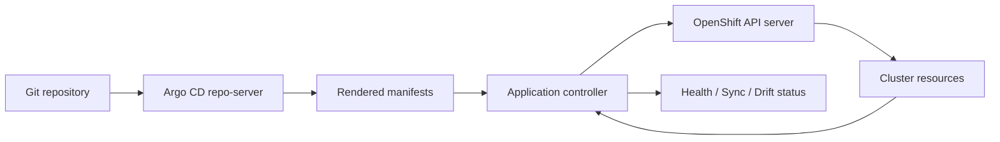

# GitOps for Cluster Config in OpenShift GitOps / Argo CD

**Audience:** Advanced OpenShift administrators, platform engineers, SREs, and OpenShift L3 operators with ~10 years of Linux/Kubernetes/OpenShift experience.  
**Scope:** Managing **OpenShift cluster configuration** declaratively through **Red Hat OpenShift GitOps** and **Argo CD**, not only application deployment.  
**Last reviewed:** 2026-07-03  

---

## 1. What “GitOps for cluster config” means

In normal application GitOps, Argo CD deploys application objects such as `Deployment`, `Service`, `Route`, `ConfigMap`, `Secret`, and `HorizontalPodAutoscaler` into application namespaces.

In **cluster configuration GitOps**, Argo CD manages the desired state of the OpenShift platform itself. That means Git becomes the source of truth for day-2 cluster configuration such as:

- namespaces and project templates
- groups, RBAC, `RoleBinding`, `ClusterRoleBinding`
- `ResourceQuota`, `LimitRange`, default requests and limits
- `NetworkPolicy`
- SCC bindings and service account permissions
- OpenShift Operators through OLM `Subscription` and `OperatorGroup`
- cluster logging, monitoring, GitOps, Pipelines, Service Mesh, Cert Manager, etc.
- `OAuth`, identity providers, console links, console customizations
- image registry configuration, ingress configuration, scheduler configuration
- `MachineConfig`, `KubeletConfig`, `MachineConfigPool`, node labels, taints
- storage classes, CSI operator configuration, default storage settings
- compliance, security policies, namespace onboarding templates

The goal is simple:

> A rebuilt cluster plus the Git repository should reproduce the approved cluster configuration.

For a senior administrator, GitOps is not only “auto apply YAML.” It is a **controlled operating model** for platform changes:

1. Change is proposed in Git.
2. Review happens through merge request / pull request.
3. CI validates syntax, policy, schema, and safety.
4. Argo CD detects desired-state change.
5. Argo CD syncs or waits for manual approval depending on policy.
6. Drift is visible when live cluster state differs from Git.
7. Rollback is performed by reverting Git to a known-good commit.

---

## 2. Why cluster config GitOps matters in OpenShift

OpenShift clusters usually grow complex after a few months. Admins add projects, quotas, network policies, groups, SCC exceptions, operators, monitoring changes, OAuth providers, custom CA bundles, custom ingress controllers, node pools, and storage settings. If those changes are made manually, you get:

- undocumented changes
- inconsistent dev/test/prod clusters
- difficult audits
- unclear ownership
- slow disaster recovery
- drift between intended and actual state
- high risk during upgrades
- dependency on one or two senior admins remembering “what was done”

With GitOps, cluster configuration becomes:

| Area | Manual administration | GitOps administration |
|---|---|---|
| Change history | Scattered in shell history or tickets | Git commit history |
| Approval | Informal or ticket-based | Pull request review |
| Rollback | Manual reverse commands | Git revert / previous commit |
| Audit | Hard to prove | Commit + reviewer + CI logs |
| Multi-cluster consistency | Manual duplication | Same base with overlays |
| Drift detection | Human inspection | Argo CD OutOfSync status |
| Disaster recovery | Recreate from notes/backups | Recreate from Git desired state |

Red Hat positions OpenShift GitOps as a way to use Git as the foundation for infrastructure and application definitions, with benefits such as version control, auditability, single source of truth, collaboration, consistency, and disaster recovery.

---

## 3. Important distinction: application GitOps vs cluster-config GitOps

### 3.1 Application GitOps

Application GitOps usually manages namespace-scoped application objects:

```yaml
apiVersion: apps/v1
kind: Deployment
metadata:
  name: orders-api
  namespace: orders-dev
```

The Argo CD instance can be restricted to specific namespaces. Developers or app teams can own their own repositories and sync policies.

### 3.2 Cluster-config GitOps

Cluster-config GitOps manages cluster-level objects:

```yaml
apiVersion: config.openshift.io/v1
kind: OAuth
metadata:
  name: cluster
```

```yaml
apiVersion: machineconfiguration.openshift.io/v1
kind: MachineConfigPool
metadata:
  name: infra
```

```yaml
apiVersion: rbac.authorization.k8s.io/v1
kind: ClusterRoleBinding
metadata:
  name: platform-admins
```

These resources affect the whole cluster. A wrong sync can break login, networking, SCC admission, operator installation, node rollout, or user access. Therefore, cluster config GitOps needs stricter governance than application GitOps.

---

## 4. OpenShift GitOps architecture for cluster configuration

A typical OpenShift GitOps installation creates an Argo CD control plane in the `openshift-gitops` namespace. Main components are:

| Component | Purpose |
|---|---|
| `openshift-gitops-server` | Argo CD API and web UI |
| `openshift-gitops-application-controller` | Reconciliation engine; compares live state with Git and applies changes |
| `openshift-gitops-repo-server` | Clones Git repositories and renders Helm/Kustomize/manifests |
| `openshift-gitops-applicationset-controller` | Generates many `Application` objects from templates/generators |
| `openshift-gitops-redis` | Caching/state support |
| Dex / SSO component | Login integration with OpenShift OAuth or another provider |
| GitOps Operator | Manages Argo CD installation lifecycle |

A simplified flow:



For cluster config, the most important identity is usually:

```text
system:serviceaccount:openshift-gitops:openshift-gitops-argocd-application-controller
```

This service account is what applies resources to the cluster. If it lacks permission, sync fails. If it has excessive permission and your Git workflow is weak, Git becomes a high-risk privileged path.

---

## 5. Default OpenShift GitOps instance and cluster permissions

Red Hat documentation states that the default OpenShift GitOps Operator creates an Argo CD instance in the `openshift-gitops` namespace. That default instance is intended for the **cluster configuration** use case and has elevated privileges compared with normal application instances.

However, you still need to configure two layers:

1. **Argo CD RBAC** — who can use the Argo CD UI/API/CLI and what they can do inside Argo CD.
2. **Kubernetes/OpenShift RBAC** — what the Argo CD application controller service account can create/update/delete in the OpenShift API.

These are separate. A user may be allowed to sync an Argo CD application, but the application controller can still fail if Kubernetes RBAC denies the target resource.

### 5.1 Verify OpenShift GitOps pods

```bash
oc get pods -n openshift-gitops
oc get pods -n openshift-gitops-operator
```

Expected components usually include server, repo-server, application-controller, applicationset-controller, redis, Dex/SSO component, and operator controller manager.

### 5.2 Check the Argo CD custom resource

```bash
oc get argocd openshift-gitops -n openshift-gitops -o yaml
```

Check these areas:

```yaml
spec:
  rbac:
    defaultPolicy: ''
    policy: |
      g, cluster-admins, role:admin
    scopes: '[groups]'
```

### 5.3 Argo CD RBAC for cluster admins

A common OpenShift pattern is to create an OpenShift group named `cluster-admins`, add admin users, and map that group to Argo CD `role:admin`.

```bash
oc adm groups new cluster-admins rakesh
oc adm policy add-cluster-role-to-group cluster-admin cluster-admins
```

Verify:

```bash
oc get groups cluster-admins
oc get argocd openshift-gitops -n openshift-gitops -o=jsonpath='{.spec.rbac}'
```

Important operational point: after group membership changes, log out of Argo CD and log back in so group claims are refreshed.

### 5.4 Kubernetes RBAC for the application controller

For full cluster configuration management, the application controller often needs broad permissions. Red Hat documentation shows granting `cluster-admin` to the application controller service account for the default cluster-config instance:

```bash
oc adm policy add-cluster-role-to-user \
  --rolebinding-name="openshift-gitops-cluster-admin" \
  cluster-admin \
  -z openshift-gitops-argocd-application-controller \
  -n openshift-gitops
```

Verify:

```bash
oc get clusterrolebinding openshift-gitops-cluster-admin -o yaml
oc auth can-i '*' '*' \
  --as system:serviceaccount:openshift-gitops:openshift-gitops-argocd-application-controller
```

### 5.5 Production recommendation

For learning and lab work, `cluster-admin` is simple. For production, decide between two models:

#### Model A: Dedicated privileged cluster-config Argo CD

Use one Argo CD instance for platform configuration and grant it broad permissions. Protect it heavily through:

- restricted repository write access
- mandatory merge request approvals
- signed commits if required
- branch protection
- Argo CD RBAC
- AppProject restrictions
- CI policy checks
- manual sync for dangerous areas

#### Model B: Least-privilege segmented Argo CD

Create multiple Argo CD instances or AppProjects:

- one for namespace onboarding
- one for operator installation
- one for monitoring/logging
- one for network/security policies
- one for app delivery

Grant each instance only the permissions it needs. This reduces blast radius but increases operational complexity.

---

## 6. Enabling cluster-scoped management for custom Argo CD namespaces

For the default `openshift-gitops` instance, OpenShift GitOps is designed for cluster configuration. For additional cluster-scoped Argo CD instances, older and current Red Hat docs describe the need to make the Operator aware of namespaces that host cluster-scoped Argo CD instances through the `ARGOCD_CLUSTER_CONFIG_NAMESPACES` environment variable on the GitOps Operator subscription.

Example concept:

```yaml
apiVersion: operators.coreos.com/v1alpha1
kind: Subscription
metadata:
  name: openshift-gitops-operator
  namespace: openshift-gitops-operator
spec:
  config:
    env:
      - name: ARGOCD_CLUSTER_CONFIG_NAMESPACES
        value: openshift-gitops,platform-gitops
```

After changing this, verify whether the application controller can manage required cluster-scoped resources:

```bash
oc auth can-i create oauth \
  --as system:serviceaccount:openshift-gitops:openshift-gitops-argocd-application-controller

oc auth can-i create subscriptions.operators.coreos.com \
  --as system:serviceaccount:openshift-gitops:openshift-gitops-argocd-application-controller

oc auth can-i create machineconfigs.machineconfiguration.openshift.io \
  --as system:serviceaccount:openshift-gitops:openshift-gitops-argocd-application-controller
```

---

## 7. Repository design for OpenShift cluster config

Good repository design is critical. A poor Git structure becomes painful when you manage many clusters.

### 7.1 Recommended repository layout

```text
openshift-cluster-config/
├── README.md
├── bootstrap/
│   ├── 00-gitops-operator/
│   │   ├── namespace.yaml
│   │   ├── operatorgroup.yaml
│   │   └── subscription.yaml
│   ├── 01-argocd-rbac/
│   │   ├── cluster-admins-group.yaml
│   │   └── argocd-rbac-patch.yaml
│   └── 02-root-app/
│       └── root-application.yaml
├── clusters/
│   ├── dev/
│   │   ├── kustomization.yaml
│   │   ├── cluster-values.yaml
│   │   └── apps.yaml
│   ├── test/
│   │   ├── kustomization.yaml
│   │   └── apps.yaml
│   └── prod/
│       ├── kustomization.yaml
│       └── apps.yaml
├── components/
│   ├── namespaces/
│   ├── rbac/
│   ├── quotas-limits/
│   ├── networkpolicies/
│   ├── operators/
│   ├── monitoring/
│   ├── logging/
│   ├── oauth/
│   ├── ingress/
│   ├── registry/
│   ├── storage/
│   ├── machineconfig/
│   └── security/
├── policies/
│   ├── kyverno/
│   ├── gatekeeper/
│   └── conftest/
└── docs/
    ├── change-process.md
    ├── rollback.md
    └── troubleshooting.md
```

### 7.2 Alternative layout by ownership

```text
cluster-config/
├── platform-team/
│   ├── operators/
│   ├── monitoring/
│   └── logging/
├── security-team/
│   ├── oauth/
│   ├── rbac/
│   ├── scc/
│   └── networkpolicies/
├── infra-team/
│   ├── ingress/
│   ├── registry/
│   ├── machineconfig/
│   └── storage/
└── tenants/
    ├── team-a/
    ├── team-b/
    └── team-c/
```

This can work well in large organizations, but it requires strong CODEOWNERS and AppProject boundaries.

### 7.3 Branching strategy

Use one of these models:

#### Model 1: Directory per environment, one branch

```text
main
└── clusters/dev
└── clusters/test
└── clusters/prod
```

Pros:

- easy comparison across environments
- one source of truth
- pull request can promote from dev to prod by changing prod overlay

Cons:

- requires careful review to avoid accidental prod changes

#### Model 2: Branch per environment

```text
main/dev
main/test
main/prod
```

Pros:

- easier branch protection per environment
- promotion through merge/cherry-pick

Cons:

- drift between branches is common
- harder to compare environments

For OpenShift platform configuration, I prefer **directory per environment** with strict CODEOWNERS and CI checks.

---

## 8. Bootstrap pattern: how GitOps starts managing itself

Cluster-config GitOps has a chicken-and-egg problem: Argo CD must exist before Argo CD can manage configuration.

Use this approach:

1. Install OpenShift cluster.
2. Manually apply the minimal GitOps Operator subscription.
3. Verify `openshift-gitops` is running.
4. Grant required Argo CD RBAC and application-controller RBAC.
5. Create one root Argo CD `Application` manually.
6. From that point, the root app manages all other cluster configuration.

### 8.1 Minimal bootstrap commands

```bash
oc create ns openshift-gitops-operator
oc apply -f bootstrap/00-gitops-operator/operatorgroup.yaml
oc apply -f bootstrap/00-gitops-operator/subscription.yaml

oc get pods -n openshift-gitops
oc get pods -n openshift-gitops-operator

oc adm policy add-cluster-role-to-user \
  --rolebinding-name="openshift-gitops-cluster-admin" \
  cluster-admin \
  -z openshift-gitops-argocd-application-controller \
  -n openshift-gitops

oc apply -f bootstrap/02-root-app/root-application.yaml
```

### 8.2 Root application example

```yaml
apiVersion: argoproj.io/v1alpha1
kind: Application
metadata:
  name: cluster-config-root
  namespace: openshift-gitops
spec:
  project: cluster-config
  source:
    repoURL: https://git.example.com/platform/openshift-cluster-config.git
    targetRevision: main
    path: clusters/prod
  destination:
    server: https://kubernetes.default.svc
    namespace: openshift-gitops
  syncPolicy:
    automated:
      prune: false
      selfHeal: true
    syncOptions:
      - CreateNamespace=false
      - ServerSideApply=true
      - ApplyOutOfSyncOnly=true
```

Why `prune: false` at the root? Because the root app may point to many dangerous resources. Start with prune disabled until your structure and ownership model are mature. Enable prune selectively for lower-risk child apps.

---

## 9. App of Apps pattern for cluster config

The root app should not directly manage every object. It should manage child `Application` objects.

```text
root Application
├── namespaces Application
├── rbac Application
├── quotas-limits Application
├── networkpolicies Application
├── operators Application
├── monitoring Application
├── logging Application
├── oauth Application
├── machineconfig Application
└── security-baseline Application
```

This gives you independent health, sync windows, pruning policy, and rollback boundaries.

### 9.1 Child application example: namespaces

```yaml
apiVersion: argoproj.io/v1alpha1
kind: Application
metadata:
  name: cluster-namespaces
  namespace: openshift-gitops
spec:
  project: cluster-config
  source:
    repoURL: https://git.example.com/platform/openshift-cluster-config.git
    targetRevision: main
    path: components/namespaces/overlays/prod
  destination:
    server: https://kubernetes.default.svc
    namespace: default
  syncPolicy:
    automated:
      prune: true
      selfHeal: true
    syncOptions:
      - ServerSideApply=true
```

### 9.2 Child application example: machine config

```yaml
apiVersion: argoproj.io/v1alpha1
kind: Application
metadata:
  name: cluster-machineconfig
  namespace: openshift-gitops
spec:
  project: cluster-config
  source:
    repoURL: https://git.example.com/platform/openshift-cluster-config.git
    targetRevision: main
    path: components/machineconfig/overlays/prod
  destination:
    server: https://kubernetes.default.svc
    namespace: openshift-machine-config-operator
  syncPolicy:
    automated:
      prune: false
      selfHeal: false
    syncOptions:
      - ServerSideApply=true
```

For `MachineConfig`, `KubeletConfig`, MCP changes, and other disruptive resources, avoid uncontrolled auto-sync. These changes can reboot nodes.

---

## 10. AppProject design for cluster config

`AppProject` is a security boundary inside Argo CD. It controls:

- which Git repositories are allowed
- which clusters/namespaces are allowed as destinations
- which cluster-scoped and namespace-scoped resource kinds are allowed or denied
- project-level RBAC roles
- orphaned resource monitoring

### 10.1 Example AppProject for platform cluster config

```yaml
apiVersion: argoproj.io/v1alpha1
kind: AppProject
metadata:
  name: cluster-config
  namespace: openshift-gitops
spec:
  description: Platform-owned OpenShift cluster configuration

  sourceRepos:
    - https://git.example.com/platform/openshift-cluster-config.git

  destinations:
    - server: https://kubernetes.default.svc
      namespace: '*'

  clusterResourceWhitelist:
    - group: '*'
      kind: '*'

  namespaceResourceWhitelist:
    - group: '*'
      kind: '*'

  orphanedResources:
    warn: true

  roles:
    - name: platform-admin
      description: Full access for platform administrators
      policies:
        - p, proj:cluster-config:platform-admin, applications, *, cluster-config/*, allow
      groups:
        - cluster-admins
```

This is intentionally broad. For production, create narrower projects where possible.

### 10.2 More restrictive AppProject for namespace onboarding

```yaml
apiVersion: argoproj.io/v1alpha1
kind: AppProject
metadata:
  name: namespace-onboarding
  namespace: openshift-gitops
spec:
  sourceRepos:
    - https://git.example.com/platform/openshift-cluster-config.git
  destinations:
    - server: https://kubernetes.default.svc
      namespace: '*'
  clusterResourceWhitelist:
    - group: project.openshift.io
      kind: Project
    - group: user.openshift.io
      kind: Group
    - group: rbac.authorization.k8s.io
      kind: ClusterRoleBinding
  namespaceResourceWhitelist:
    - group: ''
      kind: ResourceQuota
    - group: ''
      kind: LimitRange
    - group: rbac.authorization.k8s.io
      kind: RoleBinding
    - group: networking.k8s.io
      kind: NetworkPolicy
```

---

## 11. Sync policy for cluster configuration

Argo CD can sync manually or automatically. It can also prune removed resources and self-heal manual drift.

### 11.1 Recommended sync policy by resource type

| Resource category | Auto sync | Self-heal | Prune | Reason |
|---|---:|---:|---:|---|
| Namespaces / Projects | Yes | Yes | Carefully | Safe if ownership is clear |
| Quotas / LimitRanges | Yes | Yes | Yes | Usually low risk |
| NetworkPolicy | Manual or staged | Yes | Carefully | Can break traffic |
| RBAC RoleBindings | Yes | Yes | Carefully | Can remove access |
| ClusterRoleBinding | Manual | Yes | No initially | High blast radius |
| OAuth / IdP | Manual | No/Yes after testing | No | Can break login |
| OLM Subscriptions | Manual/Auto depending on channel | Yes | No initially | Can install/upgrade operators |
| MachineConfig / KubeletConfig | Manual | No | No | Can reboot/degrade nodes |
| IngressController | Manual | Yes after testing | No | Can break routing |
| Image registry config | Manual | Yes after testing | No | Can affect image pulls/builds |
| Monitoring/logging config | Manual/Auto | Yes | Carefully | Can affect observability |
| Security policies | Manual first, Auto later | Yes | Carefully | Can block workloads |

### 11.2 Automated sync with self-heal

```yaml
syncPolicy:
  automated:
    enabled: true
    prune: false
    selfHeal: true
  syncOptions:
    - ServerSideApply=true
    - ApplyOutOfSyncOnly=true
```

### 11.3 Manual sync for dangerous configuration

```yaml
syncPolicy:
  syncOptions:
    - ServerSideApply=true
```

Manual sync is appropriate for resources that can cause outages:

- `OAuth`
- `IngressController`
- `MachineConfig`
- `KubeletConfig`
- `Scheduler`
- cluster-wide proxy/CA changes
- SCC policy changes
- cluster-wide network configuration

---

## 12. Sync waves and ordering

Cluster configuration has dependencies. Example:

1. Namespace must exist before namespace RBAC.
2. Operator namespace and `OperatorGroup` must exist before `Subscription`.
3. CRDs must exist before custom resources.
4. ServiceAccount must exist before SCC binding.
5. MachineConfigPool must exist before MachineConfig targeting that pool.

Argo CD supports sync waves through annotations:

```yaml
metadata:
  annotations:
    argocd.argoproj.io/sync-wave: "0"
```

Recommended wave convention:

| Wave | Resource type |
|---:|---|
| `-10` | CRDs, base namespaces, groups |
| `-5` | Operator namespaces, OperatorGroups |
| `0` | Subscriptions, common RBAC, service accounts |
| `5` | Operator custom resources |
| `10` | workload-level quotas, limits, network policies |
| `20` | disruptive cluster changes requiring manual approval |

### 12.1 Example: operator install ordering

Namespace first:

```yaml
apiVersion: v1
kind: Namespace
metadata:
  name: openshift-logging
  annotations:
    argocd.argoproj.io/sync-wave: "-10"
```

OperatorGroup next:

```yaml
apiVersion: operators.coreos.com/v1
kind: OperatorGroup
metadata:
  name: cluster-logging
  namespace: openshift-logging
  annotations:
    argocd.argoproj.io/sync-wave: "-5"
spec:
  targetNamespaces:
    - openshift-logging
```

Subscription after that:

```yaml
apiVersion: operators.coreos.com/v1alpha1
kind: Subscription
metadata:
  name: cluster-logging
  namespace: openshift-logging
  annotations:
    argocd.argoproj.io/sync-wave: "0"
spec:
  channel: stable
  installPlanApproval: Manual
  name: cluster-logging
  source: redhat-operators
  sourceNamespace: openshift-marketplace
```

Operator custom resource later:

```yaml
apiVersion: logging.openshift.io/v1
kind: ClusterLogging
metadata:
  name: instance
  namespace: openshift-logging
  annotations:
    argocd.argoproj.io/sync-wave: "5"
spec:
  managementState: Managed
```

---

## 13. Managing namespaces and project onboarding

Namespace onboarding is one of the best starting points for cluster-config GitOps.

### 13.1 Project manifest

```yaml
apiVersion: project.openshift.io/v1
kind: Project
metadata:
  name: payments-prod
  labels:
    owner: payments
    environment: prod
    cost-center: cc-1001
  annotations:
    openshift.io/description: Payments production namespace
    openshift.io/display-name: Payments Production
    argocd.argoproj.io/sync-wave: "-10"
```

### 13.2 ResourceQuota

```yaml
apiVersion: v1
kind: ResourceQuota
metadata:
  name: payments-prod-quota
  namespace: payments-prod
spec:
  hard:
    requests.cpu: "8"
    requests.memory: 16Gi
    limits.cpu: "16"
    limits.memory: 32Gi
    pods: "100"
    services: "20"
    secrets: "50"
    configmaps: "50"
    persistentvolumeclaims: "20"
```

### 13.3 LimitRange

```yaml
apiVersion: v1
kind: LimitRange
metadata:
  name: default-container-limits
  namespace: payments-prod
spec:
  limits:
    - type: Container
      defaultRequest:
        cpu: 100m
        memory: 256Mi
      default:
        cpu: 500m
        memory: 512Mi
      min:
        cpu: 10m
        memory: 64Mi
      max:
        cpu: "2"
        memory: 2Gi
```

### 13.4 RoleBinding

```yaml
apiVersion: rbac.authorization.k8s.io/v1
kind: RoleBinding
metadata:
  name: payments-admins
  namespace: payments-prod
subjects:
  - kind: Group
    apiGroup: rbac.authorization.k8s.io
    name: payments-admins
roleRef:
  apiGroup: rbac.authorization.k8s.io
  kind: ClusterRole
  name: admin
```

### 13.5 Default deny NetworkPolicy

```yaml
apiVersion: networking.k8s.io/v1
kind: NetworkPolicy
metadata:
  name: default-deny-all
  namespace: payments-prod
spec:
  podSelector: {}
  policyTypes:
    - Ingress
    - Egress
```

### 13.6 Allow same namespace traffic

```yaml
apiVersion: networking.k8s.io/v1
kind: NetworkPolicy
metadata:
  name: allow-same-namespace
  namespace: payments-prod
spec:
  podSelector: {}
  ingress:
    - from:
        - podSelector: {}
  egress:
    - to:
        - podSelector: {}
  policyTypes:
    - Ingress
    - Egress
```

---

## 14. GitOps for RBAC and access control

RBAC is sensitive because a bad commit can lock out users or over-grant permissions.

### 14.1 Group management

```yaml
apiVersion: user.openshift.io/v1
kind: Group
metadata:
  name: payments-admins
users:
  - alice
  - bob
```

In enterprise environments, prefer identity provider groups from LDAP/AD/OIDC and manage group membership outside OpenShift. Use GitOps for OpenShift `RoleBinding` and `ClusterRoleBinding`, not necessarily for user membership.

### 14.2 ClusterRoleBinding example

```yaml
apiVersion: rbac.authorization.k8s.io/v1
kind: ClusterRoleBinding
metadata:
  name: platform-viewers
subjects:
  - kind: Group
    apiGroup: rbac.authorization.k8s.io
    name: platform-viewers
roleRef:
  apiGroup: rbac.authorization.k8s.io
  kind: ClusterRole
  name: cluster-reader
```

### 14.3 Guardrails

Before merging RBAC changes, run:

```bash
oc auth can-i create pods -n payments-prod --as alice
oc auth can-i delete projects --as alice
oc auth can-i '*' '*' --as bob
```

Add CI checks to block risky patterns:

- wildcard `*` in `ClusterRole` unless approved
- `cluster-admin` bindings outside allowlist
- service account bound to `anyuid` or `privileged` SCC without approval
- developers granted `self-provisioner` unexpectedly

---

## 15. GitOps for SCC bindings

OpenShift SCC assignment is commonly done with `oc adm policy add-scc-to-user`. In GitOps, represent the generated RBAC as YAML instead of relying on imperative commands.

Example: binding `anyuid` SCC to a service account:

```yaml
apiVersion: rbac.authorization.k8s.io/v1
kind: RoleBinding
metadata:
  name: system-openshift-scc-anyuid
  namespace: legacy-app
subjects:
  - kind: ServiceAccount
    name: legacy-sa
    namespace: legacy-app
roleRef:
  apiGroup: rbac.authorization.k8s.io
  kind: ClusterRole
  name: system:openshift:scc:anyuid
```

Verify:

```bash
oc auth can-i use scc/anyuid \
  --as system:serviceaccount:legacy-app:legacy-sa \
  -n legacy-app
```

Production advice:

- Avoid binding `privileged` unless truly required.
- Prefer custom SCC only when built-in SCCs are insufficient.
- Make SCC exceptions visible in Git with owner, justification, and expiry annotation.

Example annotation:

```yaml
metadata:
  annotations:
    security.openshift.io/justification: "Legacy image requires fixed UID during migration"
    security.openshift.io/review-after: "2026-09-30"
```

---

## 16. GitOps for NetworkPolicy

NetworkPolicy is a strong candidate for GitOps because it should be reviewed like firewall rules.

### 16.1 Namespace label convention

Use namespace labels consistently:

```yaml
apiVersion: project.openshift.io/v1
kind: Project
metadata:
  name: database
  labels:
    team: devsecops
    environment: prod
```

### 16.2 Allow app namespace to MySQL on 3306

Target namespace: `database`  
Source namespace label: `team=devsecops`  
Source pod label: `deployment=web-mysq`  
Port: `3306/TCP`

```yaml
apiVersion: networking.k8s.io/v1
kind: NetworkPolicy
metadata:
  name: mysql-db-conn
  namespace: database
spec:
  podSelector:
    matchLabels:
      app: mysql
  policyTypes:
    - Ingress
  ingress:
    - from:
        - namespaceSelector:
            matchLabels:
              team: devsecops
          podSelector:
            matchLabels:
              deployment: web-mysq
      ports:
        - protocol: TCP
          port: 3306
```

Troubleshooting commands:

```bash
oc get netpol -n database
oc describe netpol mysql-db-conn -n database
oc get ns --show-labels
oc get pods -n database --show-labels
oc get pods -n checker --show-labels
oc get svc,endpoints -n database
```

Connectivity test with a debug pod:

```bash
oc run net-debug -n checker --rm -it --image=registry.access.redhat.com/ubi9/ubi -- bash
curl -v mysql.database.svc.cluster.local:3306
```

For MySQL, `curl` may not speak the protocol but can still show TCP connection behavior. Use `nc` if available:

```bash
nc -vz mysql.database.svc.cluster.local 3306
```

---

## 17. GitOps for OLM Operators

OpenShift Operators can be installed declaratively using:

- `Namespace`
- `OperatorGroup`
- `Subscription`
- sometimes custom resources after CRDs are available

### 17.1 Cluster-scoped Operator subscription

Many cluster-scoped operators install through `openshift-operators`, which already has a global operator group.

```yaml
apiVersion: operators.coreos.com/v1alpha1
kind: Subscription
metadata:
  name: grafana-operator
  namespace: openshift-operators
spec:
  channel: v5
  installPlanApproval: Manual
  name: grafana-operator
  source: redhat-operators
  sourceNamespace: openshift-marketplace
```

### 17.2 Namespace-scoped Operator

```yaml
apiVersion: v1
kind: Namespace
metadata:
  name: openshift-pipelines
  annotations:
    argocd.argoproj.io/sync-wave: "-10"
---
apiVersion: operators.coreos.com/v1
kind: OperatorGroup
metadata:
  name: openshift-pipelines
  namespace: openshift-pipelines
  annotations:
    argocd.argoproj.io/sync-wave: "-5"
spec:
  targetNamespaces:
    - openshift-pipelines
---
apiVersion: operators.coreos.com/v1alpha1
kind: Subscription
metadata:
  name: openshift-pipelines-operator-rh
  namespace: openshift-pipelines
  annotations:
    argocd.argoproj.io/sync-wave: "0"
spec:
  channel: latest
  installPlanApproval: Manual
  name: openshift-pipelines-operator-rh
  source: redhat-operators
  sourceNamespace: openshift-marketplace
```

### 17.3 Why `installPlanApproval: Manual` is often better

For production platform operators, use manual approval to prevent unexpected upgrades. GitOps creates the `Subscription`, but an admin approves the generated `InstallPlan` during a maintenance window.

Check pending plans:

```bash
oc get installplan -A
oc get subscription -A
oc describe subscription <name> -n <namespace>
```

Approve:

```bash
oc patch installplan <installplan-name> -n <namespace> \
  --type merge \
  -p '{"spec":{"approved":true}}'
```

---

## 18. GitOps for MachineConfig and node pools

MachineConfig is powerful and risky. It can change files on RHCOS nodes, kubelet configuration, kernel arguments, systemd units, registries, and more.

### 18.1 Example MachineConfig

```yaml
apiVersion: machineconfiguration.openshift.io/v1
kind: MachineConfig
metadata:
  name: 99-worker-example-sysctl
  labels:
    machineconfiguration.openshift.io/role: worker
spec:
  config:
    ignition:
      version: 3.4.0
    storage:
      files:
        - path: /etc/sysctl.d/99-custom.conf
          mode: 0644
          contents:
            source: data:text/plain;charset=utf-8;base64,bmV0LmlwdjQuaXBfZm9yd2FyZCA9IDEK
```

### 18.2 Operational rules

For MachineConfig GitOps:

- Use manual sync.
- Never combine many node-impacting changes in one commit.
- Check MCP health before sync.
- Pause MCP only when you understand the consequences.
- Apply first in dev, then test, then prod.
- Watch node reboots and drain behavior.

Commands:

```bash
oc get mcp
oc describe mcp worker
oc get mc
oc get nodes
oc adm node-logs <node> -u machine-config-daemon
```

### 18.3 Recommended Argo CD settings for MachineConfig

```yaml
syncPolicy:
  syncOptions:
    - ServerSideApply=true
```

Keep `automated` disabled unless you have a very mature platform process.

---

## 19. GitOps for OAuth and identity providers

OpenShift OAuth configuration is cluster-scoped and high risk.

### 19.1 Example OAuth HTPasswd identity provider

```yaml
apiVersion: config.openshift.io/v1
kind: OAuth
metadata:
  name: cluster
spec:
  identityProviders:
    - name: ex280-idpsecure
      mappingMethod: claim
      type: HTPasswd
      htpasswd:
        fileData:
          name: ex280-secure
```

The referenced secret must exist in `openshift-config`:

```yaml
apiVersion: v1
kind: Secret
metadata:
  name: ex280-secure
  namespace: openshift-config
type: Opaque
data:
  htpasswd: <base64-htpasswd-content>
```

### 19.2 Risk controls

- Keep emergency `kubeadmin` process available until IdP is verified, unless policy forbids it.
- Sync OAuth manually.
- Validate login using a non-admin test user.
- Keep OAuth changes in separate PRs.
- Do not mix OAuth changes with unrelated RBAC or operator changes.

Check OAuth pods:

```bash
oc get pods -n openshift-authentication
oc logs -n openshift-authentication deploy/oauth-openshift
oc get oauth cluster -o yaml
```

---

## 20. GitOps for OpenShift console customization

Cluster admins can manage console links and branding declaratively.

Example console link:

```yaml
apiVersion: console.openshift.io/v1
kind: ConsoleLink
metadata:
  name: platform-runbook
spec:
  href: https://wiki.example.com/openshift/runbooks
  location: HelpMenu
  text: Platform Runbooks
```

This is low risk and good for early GitOps adoption.

---

## 21. Secrets in cluster-config GitOps

Never commit raw secrets to Git.

Use one of these patterns:

| Pattern | Description | Notes |
|---|---|---|
| Sealed Secrets | Encrypted secret safe to store in Git | Cluster private key required |
| External Secrets Operator | Pull secrets from Vault/AWS/GCP/Azure | Strong enterprise option |
| SOPS + KMS/PGP | Encrypt YAML values in Git | Good with Mozilla SOPS |
| Vault Agent / CSI | Runtime secret injection | Less Git-centric |
| Manual secret bootstrap | Apply secrets outside Git | Simple but less reproducible |

### 21.1 Bad pattern

```yaml
apiVersion: v1
kind: Secret
metadata:
  name: ldap-bind-password
stringData:
  password: SuperSecret123
```

Do not commit this.

### 21.2 Better pattern with ExternalSecret concept

```yaml
apiVersion: external-secrets.io/v1beta1
kind: ExternalSecret
metadata:
  name: ldap-bind-password
  namespace: openshift-config
spec:
  refreshInterval: 1h
  secretStoreRef:
    name: vault-platform
    kind: ClusterSecretStore
  target:
    name: ldap-bind-password
  data:
    - secretKey: password
      remoteRef:
        key: openshift/prod/ldap
        property: bindPassword
```

---

## 22. Drift detection and self-healing

Argo CD continuously compares live cluster state with desired Git state. If live state differs, the application becomes `OutOfSync`.

Common drift causes:

- admin manually edits a resource with `oc edit`
- operator mutates fields
- webhook injects annotations/sidecars
- controller adds defaults
- API server changes field ordering
- generated secrets/configs rotate
- Helm chart renders different output after dependency change
- MachineConfig Operator updates status fields

### 22.1 Useful commands

```bash
argocd app list
argocd app get cluster-rbac
argocd app diff cluster-rbac
argocd app sync cluster-rbac

oc get application -n openshift-gitops
oc describe application cluster-rbac -n openshift-gitops
```

### 22.2 Do not blindly ignore drift

Use `ignoreDifferences` only when the field is genuinely controller-managed and safe to ignore.

Example:

```yaml
spec:
  ignoreDifferences:
    - group: apps
      kind: Deployment
      jsonPointers:
        - /spec/replicas
```

For cluster config, avoid ignoring important security fields such as:

- RBAC subjects
- SCC roleRef
- OAuth identity providers
- NetworkPolicy selectors
- MachineConfig spec

---

## 23. Prune strategy for cluster config

`prune: true` means Argo CD deletes live resources that are no longer in Git.

This is useful for application workloads but dangerous for cluster config.

### 23.1 Safe candidates for prune

- test namespace resources
- low-risk ConfigMaps
- namespace-scoped sample apps
- temporary onboarding objects

### 23.2 Dangerous prune candidates

- `Project` / `Namespace`
- `PersistentVolumeClaim`
- `ClusterRoleBinding`
- `OAuth`
- `MachineConfig`
- `StorageClass`
- `Subscription`
- CRDs
- custom resources that trigger data deletion

### 23.3 Use prune confirmation for critical resources

Argo CD supports resource annotations such as sync options. For dangerous resources, avoid automated deletion and use manual confirmation patterns.

Example defensive annotation:

```yaml
metadata:
  annotations:
    argocd.argoproj.io/sync-options: Prune=false
```

You can also set `prune: false` at the application level for dangerous apps.

---

## 24. Server-side apply for cluster config

Many OpenShift and operator-managed resources have large specs or multiple field managers. `ServerSideApply=true` can reduce client-side apply issues and large annotation problems.

```yaml
syncPolicy:
  syncOptions:
    - ServerSideApply=true
```

Use it especially when:

- resources are large
- multiple controllers mutate fields
- `last-applied-configuration` annotation becomes too large
- OpenShift APIs are strict about field ownership

But test carefully. Server-side apply introduces managed field ownership behavior. If another controller owns a field, your apply may conflict.

---

## 25. Multi-cluster GitOps

For multiple OpenShift clusters, there are three common patterns.

### 25.1 One Argo CD per cluster

Each cluster runs its own Argo CD and syncs its own overlay.

```text
cluster-dev Argo CD  -> clusters/dev
cluster-test Argo CD -> clusters/test
cluster-prod Argo CD -> clusters/prod
```

Pros:

- simple failure isolation
- cluster continues reconciling even if other clusters fail
- no central Argo CD blast radius

Cons:

- many Argo CD instances to maintain
- harder central visibility

### 25.2 Hub Argo CD manages many clusters

A central Argo CD instance connects to multiple OpenShift clusters.

Pros:

- central UI
- central policy and visibility
- easier promotion views

Cons:

- hub outage affects reconciliation visibility/control
- credentials to many clusters are concentrated
- network connectivity and RBAC are more complex

### 25.3 Argo CD Agent / hub-spoke model

Newer Red Hat OpenShift GitOps documentation describes Argo CD Agent as a hub-and-spoke model for managing multiple Argo CD instances from one location. This is an advanced model and should be adopted after understanding traditional Argo CD and OpenShift GitOps operations.

For many enterprises, start with one Argo CD per cluster or a traditional hub model, then evaluate agent-based management when multi-cluster scale requires it.

---

## 26. CI validation before Argo CD sync

For cluster config, never rely only on Argo CD validation. Add CI checks before merge.

Recommended CI stages:

```text
1. YAML syntax validation
2. Kustomize/Helm render validation
3. Kubernetes schema validation
4. OpenShift dry-run validation
5. Policy checks
6. Security checks
7. Diff summary generation
8. Required approval from CODEOWNERS
```

### 26.1 Example CI commands

```bash
kustomize build clusters/prod > rendered.yaml
kubectl apply --dry-run=client -f rendered.yaml
oc apply --dry-run=server -f rendered.yaml
```

Policy tools:

- `conftest` with OPA/Rego
- Kyverno CLI
- Gatekeeper policy tests
- kubeconform / kubeval
- kube-score
- Polaris

### 26.2 Example policy checks

Block cluster-admin binding unless approved:

```rego
package openshift.rbac

deny[msg] {
  input.kind == "ClusterRoleBinding"
  input.roleRef.name == "cluster-admin"
  not input.metadata.annotations["platform.example.com/approved"]
  msg := sprintf("ClusterRoleBinding %s grants cluster-admin without approval", [input.metadata.name])
}
```

Block wildcard ClusterRole:

```rego
package openshift.rbac

deny[msg] {
  input.kind == "ClusterRole"
  rule := input.rules[_]
  rule.verbs[_] == "*"
  rule.resources[_] == "*"
  not input.metadata.annotations["platform.example.com/approved"]
  msg := sprintf("ClusterRole %s uses wildcard verbs/resources", [input.metadata.name])
}
```

---

## 27. Promotion strategy: dev to prod

Never test dangerous cluster config directly in production.

Recommended promotion:

```text
feature branch
   ↓ PR + CI
clusters/dev overlay
   ↓ soak + validation
clusters/test overlay
   ↓ change advisory / maintenance window
clusters/prod overlay
```

For Kustomize overlays:

```text
components/oauth/base
components/oauth/overlays/dev
components/oauth/overlays/test
components/oauth/overlays/prod
```

Base:

```yaml
resources:
  - oauth.yaml
```

Prod overlay:

```yaml
resources:
  - ../../base
patches:
  - path: prod-ldap-provider-patch.yaml
```

---

## 28. Rollback and disaster recovery

### 28.1 Rollback using Git

If a bad change was merged:

```bash
git revert <bad-commit>
git push
```

Then sync the affected application:

```bash
argocd app sync cluster-oauth
```

### 28.2 Rollback using targetRevision

For emergency rollback, temporarily pin the Argo CD application to a known-good tag:

```yaml
spec:
  source:
    targetRevision: prod-good-2026-07-01
```

### 28.3 Disaster recovery model

A mature cluster-config GitOps repository should answer:

- Which operators are installed?
- Which namespaces exist?
- Which groups and RBAC bindings exist?
- Which quotas and limits apply?
- Which network policies apply?
- Which identity provider config applies?
- Which ingress, registry, storage, monitoring, and logging config applies?
- Which node pools and machine configs exist?

Backup still matters. GitOps does not replace etcd backup or application data backup. GitOps recreates desired configuration; it does not restore runtime data by itself.

---

## 29. Troubleshooting Argo CD cluster-config sync failures

### 29.1 Permission denied

Symptoms:

```text
namespaces is forbidden
clusterroles.rbac.authorization.k8s.io is forbidden
machineconfigs.machineconfiguration.openshift.io is forbidden
```

Check:

```bash
oc auth can-i create namespaces \
  --as system:serviceaccount:openshift-gitops:openshift-gitops-argocd-application-controller

oc auth can-i create clusterrolebindings \
  --as system:serviceaccount:openshift-gitops:openshift-gitops-argocd-application-controller
```

Fix RBAC or narrow the application to allowed resources.

### 29.2 Resource exists but not managed by Argo CD

Symptoms:

```text
resource already exists
invalid ownership metadata
```

Options:

- import the resource into Git exactly as it exists
- add Argo CD tracking labels/annotations if appropriate
- delete/recreate only when safe
- use server-side apply if field ownership is the problem

### 29.3 CRD not found

Symptoms:

```text
no matches for kind "ClusterLogging"
```

Cause: custom resource applied before operator/CRD exists.

Fix:

- split operator subscription and custom resources into different apps
- use sync waves
- wait for CRD health before applying CRs

Check:

```bash
oc get crd | grep logging
oc get csv -n openshift-logging
oc get subscription -n openshift-logging
```

### 29.4 Application stuck Progressing

Check:

```bash
oc describe application <app> -n openshift-gitops
argocd app get <app>
argocd app wait <app> --health
```

Look at controller logs:

```bash
oc logs -n openshift-gitops statefulset/openshift-gitops-application-controller
```

### 29.5 MachineConfig degraded after sync

Check:

```bash
oc get mcp
oc describe mcp worker
oc get nodes
oc adm node-logs <node> -u machine-config-daemon
```

Immediate action:

- stop further syncs
- identify bad MachineConfig
- revert Git
- sync only the MachineConfig app if safe
- follow MCO recovery process if node is degraded

### 29.6 OAuth login broken

Check:

```bash
oc get oauth cluster -o yaml
oc get pods -n openshift-authentication
oc logs -n openshift-authentication deploy/oauth-openshift
oc get secret -n openshift-config
```

Use break-glass access if configured.

---

## 30. Operational best practices for senior admins

### 30.1 Separate platform GitOps from app GitOps

Do not let application teams modify cluster configuration repositories directly. Use separate repos or at least separate paths with CODEOWNERS.

### 30.2 Treat Git merge as privileged access

If Argo CD has cluster-admin, then merge access to the Git repo is effectively cluster-admin. Protect it like production admin access.

### 30.3 Keep root app small

Root app should manage only child apps and projects. Avoid putting all cluster resources directly under one massive app.

### 30.4 Use manual sync for high-risk resources

High-risk cluster resources should have manual sync and maintenance windows.

### 30.5 Use clear ownership labels

Every resource should include owner metadata:

```yaml
metadata:
  labels:
    app.kubernetes.io/managed-by: openshift-gitops
    platform.example.com/owner: platform-team
    platform.example.com/environment: prod
```

### 30.6 Do not hide real drift

Do not overuse `ignoreDifferences`. If drift matters for security or availability, fix the source instead of hiding it.

### 30.7 Test with server-side dry-run

Before merge:

```bash
oc apply --dry-run=server -f rendered.yaml
```

### 30.8 Keep emergency access outside GitOps

Break-glass access must survive a broken GitOps change. Store it securely, audit it, and test it.

### 30.9 Use stable operator channels carefully

Do not use broad `latest` everywhere in production. Pin channels deliberately and use manual install plan approval where appropriate.

### 30.10 Document rollback per component

Rollback for `ResourceQuota` is not the same as rollback for `MachineConfig` or `OAuth`. Each high-risk component needs a runbook.

---

## 31. Example complete cluster-config ApplicationSet

For many clusters with the same repository layout, `ApplicationSet` can generate one app per cluster/path.

```yaml
apiVersion: argoproj.io/v1alpha1
kind: ApplicationSet
metadata:
  name: cluster-configs
  namespace: openshift-gitops
spec:
  generators:
    - git:
        repoURL: https://git.example.com/platform/openshift-cluster-config.git
        revision: main
        directories:
          - path: clusters/*
  template:
    metadata:
      name: '{{path.basename}}-cluster-config'
    spec:
      project: cluster-config
      source:
        repoURL: https://git.example.com/platform/openshift-cluster-config.git
        targetRevision: main
        path: '{{path}}'
      destination:
        server: https://kubernetes.default.svc
        namespace: openshift-gitops
      syncPolicy:
        automated:
          prune: false
          selfHeal: true
        syncOptions:
          - ServerSideApply=true
```

Use this carefully. ApplicationSet can create or modify many apps at once.

---

## 32. Hands-on lab: cluster config GitOps baseline

### Objective

Create a GitOps-managed namespace baseline with:

- project
- group
- admin rolebinding
- quota
- limitrange
- default deny network policy

### Directory

```text
components/tenant-baseline/base/
├── project.yaml
├── group.yaml
├── rolebinding.yaml
├── resourcequota.yaml
├── limitrange.yaml
├── networkpolicy-default-deny.yaml
└── kustomization.yaml
```

### kustomization.yaml

```yaml
apiVersion: kustomize.config.k8s.io/v1beta1
kind: Kustomization
resources:
  - project.yaml
  - group.yaml
  - rolebinding.yaml
  - resourcequota.yaml
  - limitrange.yaml
  - networkpolicy-default-deny.yaml
```

### Application

```yaml
apiVersion: argoproj.io/v1alpha1
kind: Application
metadata:
  name: tenant-baseline-payments-dev
  namespace: openshift-gitops
spec:
  project: cluster-config
  source:
    repoURL: https://git.example.com/platform/openshift-cluster-config.git
    targetRevision: main
    path: components/tenant-baseline/overlays/payments-dev
  destination:
    server: https://kubernetes.default.svc
    namespace: payments-dev
  syncPolicy:
    automated:
      prune: true
      selfHeal: true
    syncOptions:
      - ServerSideApply=true
```

### Validate

```bash
oc get project payments-dev
oc get quota -n payments-dev
oc get limitrange -n payments-dev
oc get netpol -n payments-dev
oc auth can-i create deployments -n payments-dev --as alice
argocd app get tenant-baseline-payments-dev
```

---

## 33. Interview / real-world talking points

Use these points when explaining GitOps for cluster config in interviews or L3 discussions:

1. OpenShift GitOps uses Argo CD to reconcile desired state from Git into OpenShift.
2. Cluster config GitOps is more sensitive than app GitOps because it manages cluster-scoped resources.
3. Argo CD RBAC and OpenShift RBAC are separate and both must be designed.
4. The application controller service account is the real Kubernetes actor applying resources.
5. Git write/merge permission becomes a privileged operational path.
6. Use AppProject to restrict repositories, destinations, and resource kinds.
7. Use App of Apps or ApplicationSet to manage many cluster-config components.
8. Use sync waves to order dependencies such as namespace → OperatorGroup → Subscription → custom resources.
9. Enable auto-sync only for safe categories; use manual sync for OAuth, MachineConfig, Ingress, and other high-risk resources.
10. Use CI validation and policy checks before merge.
11. Use `ignoreDifferences` only for safe controller-managed fields.
12. Use `prune` carefully; it can delete critical cluster resources.
13. Use Git revert for rollback, but understand that some resources need manual recovery.
14. GitOps does not replace etcd backup or application data backup.
15. DR means rebuild cluster + apply Git desired state + restore data backups.

---

## 34. Quick command reference

```bash
# GitOps pods
oc get pods -n openshift-gitops
oc get pods -n openshift-gitops-operator

# Argo CD CR
oc get argocd openshift-gitops -n openshift-gitops -o yaml

# Argo CD applications
oc get applications -n openshift-gitops
oc describe application <app> -n openshift-gitops

# Application controller permissions
oc auth can-i create namespaces \
  --as system:serviceaccount:openshift-gitops:openshift-gitops-argocd-application-controller

oc auth can-i create clusterrolebindings \
  --as system:serviceaccount:openshift-gitops:openshift-gitops-argocd-application-controller

oc auth can-i create oauth \
  --as system:serviceaccount:openshift-gitops:openshift-gitops-argocd-application-controller

# Grant cluster-admin for cluster-config instance
oc adm policy add-cluster-role-to-user \
  --rolebinding-name="openshift-gitops-cluster-admin" \
  cluster-admin \
  -z openshift-gitops-argocd-application-controller \
  -n openshift-gitops

# Argo CD CLI
argocd app list
argocd app get <app>
argocd app diff <app>
argocd app sync <app>
argocd app wait <app> --health

# Render and validate
kustomize build clusters/prod > rendered.yaml
oc apply --dry-run=server -f rendered.yaml

# Troubleshoot controller
oc logs -n openshift-gitops statefulset/openshift-gitops-application-controller
```

---

## 35. Final senior-admin summary

GitOps for cluster config in OpenShift is the practice of managing platform state through Git and Argo CD. It is powerful because it gives auditability, repeatability, rollback, and drift detection. It is also risky because the same mechanism can change authentication, RBAC, network policy, operators, node configuration, ingress, and other cluster-wide components.

A mature design should include:

- a dedicated cluster-config Argo CD model
- strict Git repository protection
- AppProject boundaries
- App of Apps or ApplicationSet structure
- CI validation and policy checks
- sync waves for ordering
- conservative prune usage
- manual sync for disruptive resources
- clear rollback and break-glass procedures
- separation between app delivery and platform configuration

For production OpenShift, the safest mindset is:

> Automate the repeatable, review the risky, and never let GitOps become an uncontrolled cluster-admin backdoor.

---

## References

1. Red Hat OpenShift GitOps 1.21 — Managing cluster configuration: https://docs.redhat.com/en/documentation/red_hat_openshift_gitops/1.21/html/managing_cluster_configuration/index
2. Red Hat OpenShift GitOps 1.21 — Managing OpenShift Container Platform cluster configuration: https://docs.redhat.com/en/documentation/red_hat_openshift_gitops/1.21/html/managing_cluster_configuration/managing-openshift-cluster-configuration-1
3. Red Hat OpenShift GitOps 1.21 — Release notes / overview: https://docs.redhat.com/en/documentation/red_hat_openshift_gitops/1.21/html/release_notes/gitops-release-notes
4. Red Hat OpenShift GitOps — Multitenancy: https://docs.redhat.com/en/documentation/red_hat_openshift_gitops/1.21/html/multitenancy/index
5. Argo CD official docs — Overview: https://argo-cd.readthedocs.io/en/stable/
6. Argo CD official docs — Declarative setup: https://argo-cd.readthedocs.io/en/stable/operator-manual/declarative-setup/
7. Argo CD official docs — Automated sync policy: https://argo-cd.readthedocs.io/en/latest/user-guide/auto_sync/
8. Argo CD official docs — Sync phases and waves: https://argo-cd.readthedocs.io/en/stable/user-guide/sync-waves/
9. Argo CD official docs — Diff customization: https://argo-cd.readthedocs.io/en/stable/user-guide/diffing/
10. Argo CD official docs — Projects: https://argo-cd.readthedocs.io/en/stable/user-guide/projects/
11. Argo CD official docs — ApplicationSet Git generator: https://argo-cd.readthedocs.io/en/latest/operator-manual/applicationset/Generators-Git/
