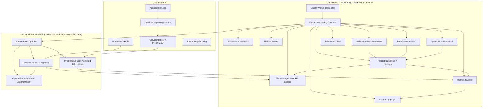

# OpenShift Monitoring Stack — Advanced OpenShift Administration Guide

**Area:** OpenShift Monitoring and Metrics  
**Topic:** OpenShift monitoring stack  
**Audience:** Advanced OpenShift administrators, platform engineers, SREs, and OpenShift engineers with around 10 years of infrastructure / Linux / Kubernetes experience  
**Scope:** Red Hat OpenShift Container Platform 4.x, with emphasis on the current Red Hat OpenShift monitoring stack architecture and operational administration

---

## 1. Executive Summary

The OpenShift monitoring stack is the built-in observability foundation of Red Hat OpenShift. It collects platform and workload metrics, evaluates recording and alerting rules, sends alerts to Alertmanager, exposes data through the OpenShift web console, and optionally forwards selected metrics to external systems by remote write.

For an advanced administrator, the important point is this:

> OpenShift monitoring is not a manually assembled Prometheus deployment. It is an Operator-managed, lifecycle-controlled, supported monitoring platform reconciled by the Cluster Monitoring Operator and upgraded by the OpenShift lifecycle.

The monitoring stack has two major layers:

1. **Core platform monitoring** in `openshift-monitoring`.
2. **User workload monitoring** in `openshift-user-workload-monitoring`, enabled optionally for application teams and custom namespaces.

The stack is based on Prometheus ecosystem components, but Red Hat controls the supported configuration surface. Directly modifying stack-owned objects is usually unsupported because the Cluster Monitoring Operator reconciles them back to the expected state.

---

## 2. Why OpenShift Has a Built-in Monitoring Stack

In a traditional Kubernetes environment, administrators often deploy Prometheus, Alertmanager, Grafana, exporters, service monitors, and custom rules manually. In OpenShift, Red Hat ships a supported stack because core platform health depends on metrics and alerts.

The stack helps you answer questions such as:

- Are cluster operators healthy?
- Are API servers under pressure?
- Are nodes running out of CPU, memory, filesystem, or inode capacity?
- Are etcd latency and leader changes normal?
- Are pods restarting or failing readiness/liveness probes?
- Are application namespaces exposing expected metrics?
- Are alerts being routed to the correct notification receivers?
- Is the monitoring stack itself healthy?

From a 10-year-experience administration perspective, monitoring is not only a dashboard feature. It is part of cluster reliability, capacity planning, incident response, upgrade safety, and postmortem analysis.

---

## 3. High-Level Architecture



### Core idea

- **Platform components** are monitored by the default stack.
- **Application teams** can expose custom metrics through `ServiceMonitor` or `PodMonitor` after user workload monitoring is enabled.
- **Thanos Querier** provides a unified query layer for platform and user workload metrics.
- **Alertmanager** handles alert routing, grouping, inhibition, silencing, and notification delivery.

---

## 4. Main Namespaces

| Namespace | Purpose | Admin Notes |
|---|---|---|
| `openshift-monitoring` | Default platform monitoring stack | Contains Cluster Monitoring Operator, platform Prometheus, Alertmanager, Thanos Querier, exporters, Metrics Server, and related services. Do not manually edit stack-owned resources. |
| `openshift-user-workload-monitoring` | Optional user workload monitoring stack | Created/used when user workload monitoring is enabled. Contains user workload Prometheus, Prometheus Operator, Thanos Ruler, and optionally user workload Alertmanager. |
| User namespaces | Application workloads | Teams create `ServiceMonitor`, `PodMonitor`, `PrometheusRule`, and optionally `AlertmanagerConfig` depending on granted RBAC. |

Useful checks:

```bash
oc get pods -n openshift-monitoring
oc get pods -n openshift-user-workload-monitoring
oc get co monitoring
oc get cm cluster-monitoring-config -n openshift-monitoring -o yaml
oc get cm user-workload-monitoring-config -n openshift-user-workload-monitoring -o yaml
```

---

## 5. Default Platform Monitoring Components

### 5.1 Cluster Monitoring Operator

The **Cluster Monitoring Operator** is the control plane for the monitoring stack. It is deployed by the Cluster Version Operator and reconciles the supported monitoring resources.

Responsibilities:

- Deploys and manages platform Prometheus.
- Deploys and manages Alertmanager.
- Deploys Thanos Querier.
- Deploys Telemeter Client.
- Manages monitoring targets and supporting components.
- Applies supported configuration from `cluster-monitoring-config`.
- Keeps the stack aligned with the OpenShift release version.
- Reverts unsupported direct modifications.

Check status:

```bash
oc -n openshift-monitoring get deploy cluster-monitoring-operator
oc -n openshift-monitoring logs deploy/cluster-monitoring-operator
oc get co monitoring
```

A healthy monitoring ClusterOperator generally shows:

```text
AVAILABLE=True
PROGRESSING=False
DEGRADED=False
```

---

### 5.2 Prometheus Operator

The **Prometheus Operator** manages Prometheus and Alertmanager resources. It converts Kubernetes custom resources and label selectors into actual Prometheus scrape configuration.

In `openshift-monitoring`, it manages platform monitoring. In `openshift-user-workload-monitoring`, it manages user workload monitoring.

Important CRDs:

- `Prometheus`
- `Alertmanager`
- `ServiceMonitor`
- `PodMonitor`
- `PrometheusRule`
- `AlertmanagerConfig`
- `ThanosRuler`

Admin note:

```bash
oc get crd | grep monitoring.coreos.com
oc -n openshift-monitoring get prometheus,alertmanager,servicemonitor,prometheusrule
oc -n openshift-user-workload-monitoring get prometheus,thanosruler,alertmanager
```

---

### 5.3 Prometheus

Prometheus is the time-series database and rule evaluation engine. In OpenShift core monitoring, Prometheus scrapes platform targets such as kubelet, node-exporter, kube-state-metrics, OpenShift state metrics, API servers, etcd, and other platform components.

Prometheus responsibilities:

- Scrapes metrics from configured targets.
- Stores metrics locally in TSDB blocks.
- Evaluates platform alerting and recording rules.
- Sends alerts to Alertmanager.
- Exposes PromQL query API.
- Supports remote write for forwarding metrics externally.

Check platform Prometheus:

```bash
oc -n openshift-monitoring get statefulset prometheus-k8s
oc -n openshift-monitoring get pods -l app.kubernetes.io/name=prometheus
oc -n openshift-monitoring get pvc | grep prometheus
```

Port-forward for troubleshooting only:

```bash
oc -n openshift-monitoring port-forward prometheus-k8s-0 9090:9090
```

Then open:

```text
http://localhost:9090/targets
http://localhost:9090/graph
```

In production, prefer OpenShift console **Observe** pages or authenticated routes/APIs instead of depending on third-party UIs.

---

### 5.4 Alertmanager

Alertmanager receives alerts from Prometheus and Thanos Ruler, then handles:

- Deduplication.
- Grouping.
- Routing.
- Inhibition.
- Silencing.
- Notification delivery.

Common receivers:

- Email.
- Slack-compatible webhook.
- PagerDuty.
- Opsgenie.
- Generic webhook.
- ServiceNow or custom incident bridge.

Check Alertmanager:

```bash
oc -n openshift-monitoring get alertmanager
oc -n openshift-monitoring get pods -l alertmanager=main
oc -n openshift-monitoring get route alertmanager-main
```

Query receivers through API:

```bash
HOST=$(oc -n openshift-monitoring get route alertmanager-main -o jsonpath='{.spec.host}')
TOKEN=$(oc whoami -t)
curl -k -H "Authorization: Bearer ${TOKEN}" "https://${HOST}/api/v2/receivers"
```

---

### 5.5 Thanos Querier

Thanos Querier provides a query aggregation layer. It can aggregate and deduplicate metrics from platform Prometheus and user workload Prometheus under a unified query interface.

Why it matters:

- Users can query metrics from a central OpenShift console experience.
- HA Prometheus replicas scrape the same targets, so deduplication is important.
- It separates query access from direct Prometheus pod access.

Check:

```bash
oc -n openshift-monitoring get deploy thanos-querier
oc -n openshift-monitoring get route thanos-querier
```

---

### 5.6 Metrics Server

Metrics Server collects resource metrics and exposes the Kubernetes `metrics.k8s.io` API. It supports commands and APIs such as:

```bash
oc adm top nodes
oc adm top pods -A
kubectl top nodes
kubectl top pods -A
```

Advanced note:

- Metrics Server serves short-lived CPU and memory usage metrics for autoscaling and `top` commands.
- Prometheus is still the long-term metrics engine for alerting and historical PromQL.
- In recent OpenShift releases, Metrics Server replaced the older Prometheus Adapter path for the `metrics.k8s.io` resource metrics use case.

Check:

```bash
oc get apiservice v1beta1.metrics.k8s.io
oc -n openshift-monitoring get pods | grep metrics-server
oc adm top nodes
```

---

### 5.7 kube-state-metrics

`kube-state-metrics` converts Kubernetes API object state into metrics.

Examples:

- Deployment replica status.
- Pod phase.
- Node conditions.
- PVC status.
- DaemonSet desired/current availability.

Useful queries:

```promql
kube_pod_status_phase
kube_deployment_status_replicas_available
kube_persistentvolumeclaim_status_phase
kube_node_status_condition
```

---

### 5.8 openshift-state-metrics

`openshift-state-metrics` expands the Kubernetes state metric model for OpenShift-specific resources.

Examples include metrics for OpenShift objects and cluster-level OpenShift resources.

Check:

```bash
oc -n openshift-monitoring get deploy openshift-state-metrics
```

---

### 5.9 node-exporter

`node-exporter` runs as a DaemonSet and collects Linux node metrics.

Examples:

- CPU usage.
- Memory usage.
- Filesystem space.
- Disk I/O.
- Network statistics.
- Load average.
- Kernel statistics.

Check:

```bash
oc -n openshift-monitoring get ds node-exporter
oc -n openshift-monitoring get pods -l app.kubernetes.io/name=node-exporter -o wide
```

Useful PromQL:

```promql
node_filesystem_avail_bytes
node_memory_MemAvailable_bytes
rate(node_cpu_seconds_total[5m])
rate(node_network_receive_bytes_total[5m])
rate(node_disk_io_time_seconds_total[5m])
```

---

### 5.10 Telemeter Client

Telemeter Client sends a subset of platform monitoring data to Red Hat for remote health monitoring and connected cluster insights.

Admin perspective:

- It is part of default platform monitoring.
- It helps Red Hat provide remote health analysis and support insights.
- In disconnected or restricted networks, you must understand how telemetry behaves according to your cluster network and support policy.

Check:

```bash
oc -n openshift-monitoring get deploy telemeter-client
oc -n openshift-monitoring logs deploy/telemeter-client
```

---

### 5.11 monitoring-plugin

The monitoring plugin provides Observe pages in the OpenShift web console.

It supports console views for:

- Metrics.
- Dashboards.
- Alerts.
- Alerting rules.
- Silences.
- Targets.

Check:

```bash
oc -n openshift-monitoring get deploy monitoring-plugin
```

---

## 6. User Workload Monitoring

User workload monitoring allows application teams to monitor their own services and pods without deploying a separate unsupported Prometheus stack.

When enabled, OpenShift deploys components in:

```text
openshift-user-workload-monitoring
```

Main components:

| Component | Role |
|---|---|
| Prometheus Operator | Manages user workload Prometheus and Thanos Ruler. |
| Prometheus | Scrapes metrics from user-defined projects. |
| Thanos Ruler | Evaluates user workload recording and alerting rules. |
| Alertmanager | Optional dedicated Alertmanager for user-defined alert routing. |

### 6.1 Enable user workload monitoring

Create or edit `cluster-monitoring-config`:

```bash
oc -n openshift-monitoring edit configmap cluster-monitoring-config
```

Example:

```yaml
apiVersion: v1
kind: ConfigMap
metadata:
  name: cluster-monitoring-config
  namespace: openshift-monitoring
data:
  config.yaml: |
    enableUserWorkload: true
```

Verify:

```bash
oc -n openshift-user-workload-monitoring get pods
oc -n openshift-user-workload-monitoring get prometheus
oc -n openshift-user-workload-monitoring get thanosruler
```

Expected components include:

```text
prometheus-operator
prometheus-user-workload-0
prometheus-user-workload-1
thanos-ruler-user-workload-0
thanos-ruler-user-workload-1
```

### 6.2 Disable user workload monitoring

```yaml
apiVersion: v1
kind: ConfigMap
metadata:
  name: cluster-monitoring-config
  namespace: openshift-monitoring
data:
  config.yaml: |
    enableUserWorkload: false
```

Or remove `enableUserWorkload: true`.

Important: `user-workload-monitoring-config` is not automatically deleted when user workload monitoring is disabled, so custom configuration can remain for future use.

---

## 7. Supported Configuration Model

OpenShift monitoring is configured through supported ConfigMaps, not by editing generated Deployments, StatefulSets, Secrets, Services, or Prometheus objects directly.

### 7.1 Core platform monitoring configuration

ConfigMap:

```text
namespace: openshift-monitoring
name: cluster-monitoring-config
```

Edit:

```bash
oc -n openshift-monitoring edit configmap cluster-monitoring-config
```

### 7.2 User workload monitoring configuration

ConfigMap:

```text
namespace: openshift-user-workload-monitoring
name: user-workload-monitoring-config
```

Edit:

```bash
oc -n openshift-user-workload-monitoring edit configmap user-workload-monitoring-config
```

### 7.3 Why direct modification is dangerous

Do not manually edit stack-managed resources such as:

- `StatefulSet/prometheus-k8s`
- `Deployment/thanos-querier`
- `DaemonSet/node-exporter`
- Generated Prometheus scrape secrets
- Generated rules in platform namespaces
- Stack-owned Services and Routes

The Cluster Monitoring Operator reconciles expected state. Unsupported changes can disappear or can put the cluster into an unsupported condition.

Correct approach:

```bash
# Correct: edit supported CMO config
oc -n openshift-monitoring edit cm cluster-monitoring-config

# Avoid: direct mutation of managed StatefulSet
oc -n openshift-monitoring edit sts prometheus-k8s
```

---

## 8. Persistent Storage for Monitoring

For production, configure persistent storage for stateful monitoring components.

Important components:

- Prometheus.
- Alertmanager.
- Thanos Ruler.

Why storage matters:

- Preserves metrics across pod restart/recreation.
- Preserves Alertmanager silences and notification state.
- Prevents data loss during node maintenance.
- Supports HA expectations more reliably.

### 8.1 Core platform Prometheus persistent storage example

```yaml
apiVersion: v1
kind: ConfigMap
metadata:
  name: cluster-monitoring-config
  namespace: openshift-monitoring
data:
  config.yaml: |
    prometheusK8s:
      volumeClaimTemplate:
        spec:
          storageClassName: fast-block
          resources:
            requests:
              storage: 100Gi
```

### 8.2 Core Alertmanager persistent storage example

```yaml
apiVersion: v1
kind: ConfigMap
metadata:
  name: cluster-monitoring-config
  namespace: openshift-monitoring
data:
  config.yaml: |
    alertmanagerMain:
      volumeClaimTemplate:
        spec:
          storageClassName: fast-block
          resources:
            requests:
              storage: 10Gi
```

### 8.3 User workload Prometheus storage example

```yaml
apiVersion: v1
kind: ConfigMap
metadata:
  name: user-workload-monitoring-config
  namespace: openshift-user-workload-monitoring
data:
  config.yaml: |
    prometheus:
      volumeClaimTemplate:
        spec:
          storageClassName: fast-block
          resources:
            requests:
              storage: 100Gi
```

### 8.4 Thanos Ruler storage example

```yaml
apiVersion: v1
kind: ConfigMap
metadata:
  name: user-workload-monitoring-config
  namespace: openshift-user-workload-monitoring
data:
  config.yaml: |
    thanosRuler:
      volumeClaimTemplate:
        spec:
          storageClassName: fast-block
          resources:
            requests:
              storage: 20Gi
```

### 8.5 Storage best practices

- Prefer fast block storage for Prometheus TSDB.
- Avoid raw block volumes for Prometheus.
- Use POSIX-compliant filesystems.
- Be careful with NFS. Validate vendor support and POSIX behavior before using it for Prometheus data.
- Monitor disk usage and compaction failures.
- Do not over-retain high-cardinality metrics without capacity planning.

Useful checks:

```bash
oc -n openshift-monitoring get pvc
oc -n openshift-user-workload-monitoring get pvc
oc -n openshift-monitoring describe pvc <pvc-name>
oc -n openshift-monitoring logs prometheus-k8s-0 -c prometheus | grep -i tsdb
```

---

## 9. Retention and Retention Size

Prometheus retention has two dimensions:

1. Time-based retention.
2. Size-based retention.

In production, configure both carefully.

### 9.1 User workload Prometheus retention example

```yaml
apiVersion: v1
kind: ConfigMap
metadata:
  name: user-workload-monitoring-config
  namespace: openshift-user-workload-monitoring
data:
  config.yaml: |
    prometheus:
      retention: 15d
      retentionSize: 80GB
```

### 9.2 Thanos Ruler retention example

```yaml
apiVersion: v1
kind: ConfigMap
metadata:
  name: user-workload-monitoring-config
  namespace: openshift-user-workload-monitoring
data:
  config.yaml: |
    thanosRuler:
      retention: 10d
```

### 9.3 Sizing logic

Prometheus storage requirement depends on:

- Number of active time series.
- Scrape interval.
- Number of targets.
- Label cardinality.
- Retention duration.
- WAL size.
- Compaction overhead.
- Remote write buffering.

High-cardinality labels are the most common reason Prometheus memory and storage usage grows unexpectedly.

Bad labels:

```text
request_id
session_id
transaction_id
user_id
pod_uid when unnecessary
full URL path with dynamic IDs
```

Better labels:

```text
method
status_code
route_template
service
namespace
pod
container
cluster
```

---

## 10. Resource Requests, Limits, Placement, and Scheduling

Monitoring is a production workload. Treat it like a platform-critical service.

### 10.1 Resource tuning example for user workload monitoring

```yaml
apiVersion: v1
kind: ConfigMap
metadata:
  name: user-workload-monitoring-config
  namespace: openshift-user-workload-monitoring
data:
  config.yaml: |
    prometheus:
      resources:
        requests:
          cpu: 500m
          memory: 4Gi
        limits:
          memory: 8Gi
    thanosRuler:
      resources:
        requests:
          cpu: 200m
          memory: 1Gi
        limits:
          memory: 2Gi
```

### 10.2 Node placement example

Label nodes:

```bash
oc label node worker-1 node-role.kubernetes.io/monitoring=
oc label node worker-2 node-role.kubernetes.io/monitoring=
```

Configure node selector:

```yaml
apiVersion: v1
kind: ConfigMap
metadata:
  name: user-workload-monitoring-config
  namespace: openshift-user-workload-monitoring
data:
  config.yaml: |
    prometheus:
      nodeSelector:
        node-role.kubernetes.io/monitoring: ""
    thanosRuler:
      nodeSelector:
        node-role.kubernetes.io/monitoring: ""
```

### 10.3 Tolerations example

If dedicated monitoring nodes are tainted:

```bash
oc adm taint node worker-1 dedicated=monitoring:NoSchedule
oc adm taint node worker-2 dedicated=monitoring:NoSchedule
```

Config:

```yaml
apiVersion: v1
kind: ConfigMap
metadata:
  name: user-workload-monitoring-config
  namespace: openshift-user-workload-monitoring
data:
  config.yaml: |
    prometheus:
      tolerations:
      - key: dedicated
        operator: Equal
        value: monitoring
        effect: NoSchedule
```

### 10.4 Topology spread

For HA, do not let both Prometheus replicas land on the same failure domain.

Use topology spread or node anti-affinity where supported by the configuration surface.

Practical checks:

```bash
oc -n openshift-monitoring get pods -o wide | egrep 'prometheus|alertmanager|thanos'
oc -n openshift-user-workload-monitoring get pods -o wide
```

---

## 11. High Availability Behavior

In multi-node clusters, key monitoring components usually run with two replicas.

HA components include:

- Prometheus.
- Alertmanager.
- Thanos Ruler.
- Thanos Querier.
- Metrics Server.
- monitoring-plugin.

### 11.1 Prometheus HA behavior

Both Prometheus replicas scrape the same targets independently.

Important implications:

- Replicas do not share TSDB data with each other.
- Data might differ briefly between replicas.
- Thanos Querier performs deduplication at query time.
- Persistent storage is required for reliable HA data preservation.

### 11.2 Alertmanager HA behavior

Alertmanager replicas synchronize notification and silence state.

Important implications:

- Notifications should be delivered at least once.
- During communication failure, duplicate notifications can happen.
- Persistent storage helps preserve silences and notification state across restarts.

### 11.3 Failure domain thinking

A senior admin should check:

```bash
oc get nodes --show-labels | egrep 'zone|region|topology'
oc -n openshift-monitoring get pods -o wide
oc -n openshift-user-workload-monitoring get pods -o wide
```

Do not place both replicas on the same worker, same rack, same zone, or same storage failure domain when avoidable.

---

## 12. Metrics Flow Deep Dive

### 12.1 Platform metrics flow

1. Platform components expose `/metrics` endpoints.
2. Exporters such as node-exporter, kube-state-metrics, and openshift-state-metrics expose metrics.
3. Prometheus Operator generates scrape configuration.
4. Prometheus scrapes targets.
5. Prometheus stores samples locally.
6. Prometheus evaluates platform rules.
7. Prometheus sends firing alerts to Alertmanager.
8. Thanos Querier exposes unified query access.
9. OpenShift console Observe pages display metrics, dashboards, alerts, and targets.

### 12.2 User workload metrics flow

1. Application exposes metrics, usually `/metrics`.
2. Service exposes named metrics port.
3. Team creates `ServiceMonitor` or `PodMonitor`.
4. User workload Prometheus discovers the target.
5. Prometheus scrapes application metrics.
6. Thanos Ruler evaluates user `PrometheusRule` objects.
7. Alerts route to platform Alertmanager or dedicated user workload Alertmanager.
8. OpenShift console displays metrics and alert state according to RBAC.

---

## 13. ServiceMonitor and PodMonitor

### 13.1 ServiceMonitor

Use `ServiceMonitor` when a Kubernetes Service selects the pods exposing metrics.

Example application:

```yaml
apiVersion: v1
kind: Namespace
metadata:
  name: ns1
---
apiVersion: apps/v1
kind: Deployment
metadata:
  name: prometheus-example-app
  namespace: ns1
  labels:
    app: prometheus-example-app
spec:
  replicas: 1
  selector:
    matchLabels:
      app: prometheus-example-app
  template:
    metadata:
      labels:
        app: prometheus-example-app
    spec:
      containers:
      - name: prometheus-example-app
        image: ghcr.io/rhobs/prometheus-example-app:0.4.2
        ports:
        - containerPort: 8080
          name: web
---
apiVersion: v1
kind: Service
metadata:
  name: prometheus-example-app
  namespace: ns1
  labels:
    app: prometheus-example-app
spec:
  selector:
    app: prometheus-example-app
  ports:
  - name: web
    port: 8080
    targetPort: 8080
```

ServiceMonitor:

```yaml
apiVersion: monitoring.coreos.com/v1
kind: ServiceMonitor
metadata:
  name: prometheus-example-monitor
  namespace: ns1
spec:
  selector:
    matchLabels:
      app: prometheus-example-app
  endpoints:
  - port: web
    interval: 30s
    scheme: http
```

Apply:

```bash
oc apply -f prometheus-example-app.yaml
oc apply -f example-app-service-monitor.yaml
oc -n ns1 get servicemonitor
```

Important detail:

> In user-defined namespaces, a `ServiceMonitor` discovers Services in the same namespace. Do not expect it to scrape arbitrary namespaces through `namespaceSelector` in a tenant namespace.

### 13.2 PodMonitor

Use `PodMonitor` when you want to scrape pods directly without a Service.

Example:

```yaml
apiVersion: monitoring.coreos.com/v1
kind: PodMonitor
metadata:
  name: app-pod-monitor
  namespace: ns1
spec:
  selector:
    matchLabels:
      app: myapp
  podMetricsEndpoints:
  - port: metrics
    interval: 30s
```

### 13.3 Common ServiceMonitor mistakes

| Symptom | Likely Cause | Fix |
|---|---|---|
| Target not visible | User workload monitoring not enabled | Enable `enableUserWorkload: true`. |
| Target not visible | Service label does not match `ServiceMonitor.spec.selector` | Fix labels/selectors. |
| Target down | Wrong port name | Use Service port name, not numeric targetPort only. |
| 403/401 | Metrics endpoint requires auth | Configure supported auth in ServiceMonitor/PodMonitor. |
| Scrape timeout | Endpoint slow or blocked | Tune timeout and app endpoint performance. |
| No metrics in query | Metric name mismatch | Curl `/metrics` and verify exact metric name. |

Debug:

```bash
oc -n ns1 get svc,pod,servicemonitor -o wide
oc -n ns1 describe servicemonitor prometheus-example-monitor
oc -n openshift-user-workload-monitoring port-forward prometheus-user-workload-0 9090:9090
```

Then check:

```text
http://localhost:9090/targets
```

---

## 14. PrometheusRule for Recording and Alerting

`PrometheusRule` defines recording rules and alerting rules.

### 14.1 Recording rule example

```yaml
apiVersion: monitoring.coreos.com/v1
kind: PrometheusRule
metadata:
  name: app-recording-rules
  namespace: ns1
spec:
  groups:
  - name: app-recording.rules
    rules:
    - record: namespace:container_cpu_usage_seconds_total:sum_rate5m
      expr: sum by (namespace) (rate(container_cpu_usage_seconds_total[5m]))
```

### 14.2 Alerting rule example

```yaml
apiVersion: monitoring.coreos.com/v1
kind: PrometheusRule
metadata:
  name: app-alert-rules
  namespace: ns1
spec:
  groups:
  - name: app-alerts.rules
    rules:
    - alert: AppHighErrorRate
      expr: |
        sum(rate(http_requests_total{namespace="ns1",status=~"5.."}[5m]))
        /
        sum(rate(http_requests_total{namespace="ns1"}[5m]))
        > 0.05
      for: 10m
      labels:
        severity: warning
        team: platform
      annotations:
        summary: "High HTTP 5xx rate in ns1"
        description: "More than 5% of requests are failing with 5xx for 10 minutes."
```

### 14.3 Rule design best practices

- Always use `for:` to avoid alert flapping.
- Add useful labels: `severity`, `team`, `service`, `runbook_url`.
- Add actionable annotations.
- Avoid alerts that page humans for self-healing transient states.
- Use recording rules for expensive repeated PromQL.
- Test PromQL in the console before creating rules.
- Keep namespace ownership clear.

---

## 15. Alert Routing

OpenShift supports alert routing for platform and user-defined alerts.

### 15.1 Platform Alertmanager for user-defined alerts

Cluster admins can allow user-defined alert routing through the main platform Alertmanager.

Example:

```yaml
apiVersion: v1
kind: ConfigMap
metadata:
  name: cluster-monitoring-config
  namespace: openshift-monitoring
data:
  config.yaml: |
    enableUserWorkload: true
    alertmanagerMain:
      enableUserAlertmanagerConfig: true
```

### 15.2 Dedicated user workload Alertmanager

This separates user workload alerts from core platform alerts.

```yaml
apiVersion: v1
kind: ConfigMap
metadata:
  name: user-workload-monitoring-config
  namespace: openshift-user-workload-monitoring
data:
  config.yaml: |
    alertmanager:
      enabled: true
      enableAlertmanagerConfig: true
```

Verify:

```bash
oc -n openshift-user-workload-monitoring get alertmanager
oc -n openshift-user-workload-monitoring get pods | grep alertmanager
```

### 15.3 AlertmanagerConfig example

```yaml
apiVersion: monitoring.coreos.com/v1beta1
kind: AlertmanagerConfig
metadata:
  name: team-alert-routing
  namespace: ns1
spec:
  route:
    receiver: team-webhook
    groupBy:
    - alertname
    - namespace
    groupWait: 30s
    groupInterval: 5m
    repeatInterval: 4h
  receivers:
  - name: team-webhook
    webhookConfigs:
    - urlSecret:
        name: team-webhook-secret
        key: url
```

Secret:

```yaml
apiVersion: v1
kind: Secret
metadata:
  name: team-webhook-secret
  namespace: ns1
type: Opaque
stringData:
  url: "https://webhook.example.com/alerts"
```

### 15.4 Alert routing RBAC

Grant alert routing edit access:

```bash
oc -n ns1 adm policy add-role-to-user alert-routing-edit user1
```

Grant monitoring rule edit access:

```bash
oc -n ns1 adm policy add-role-to-user monitoring-rules-edit user1
```

Grant monitoring edit access:

```bash
oc -n ns1 adm policy add-role-to-user monitoring-edit user1
```

---

## 16. Monitoring RBAC for User-Defined Projects

Common roles and cluster roles:

| Role / ClusterRole | Purpose |
|---|---|
| `cluster-monitoring-view` | Allows viewing cluster monitoring data and access required APIs for cluster-level monitoring views. |
| `monitoring-rules-view` | Read access to `PrometheusRule` resources. |
| `monitoring-rules-edit` | Create/edit `PrometheusRule` resources. |
| `monitoring-edit` | Create/edit monitoring resources such as `ServiceMonitor`, `PodMonitor`, and rules in a namespace. |
| `alert-routing-edit` | Configure alert routing with `AlertmanagerConfig` in a namespace. |
| `user-workload-monitoring-config-edit` | Edit the user workload monitoring ConfigMap in `openshift-user-workload-monitoring`. |
| `monitoring-alertmanager-api-reader` | Read access to user workload Alertmanager API if enabled. |
| `monitoring-alertmanager-api-writer` | Read/write access to user workload Alertmanager API if enabled. |

Examples:

```bash
# Allow a developer to create ServiceMonitor and PrometheusRule in one namespace
oc -n ns1 adm policy add-role-to-user monitoring-edit developer1

# Allow alert routing config in one namespace
oc -n ns1 adm policy add-role-to-user alert-routing-edit developer1

# Allow a delegated platform engineer to configure user workload monitoring stack
oc -n openshift-user-workload-monitoring adm policy add-role-to-user \
  user-workload-monitoring-config-edit platform-user \
  --role-namespace openshift-user-workload-monitoring
```

---

## 17. Remote Write

Remote write forwards metrics from Prometheus to external long-term storage or observability systems.

Use cases:

- Long-term retention outside the cluster.
- Centralized multi-cluster metrics.
- Integration with enterprise observability platforms.
- Compliance-driven metric retention.

### 17.1 User workload remote write example

```yaml
apiVersion: v1
kind: ConfigMap
metadata:
  name: user-workload-monitoring-config
  namespace: openshift-user-workload-monitoring
data:
  config.yaml: |
    prometheus:
      remoteWrite:
      - url: "https://remote-write-endpoint.example.com/api/v1/write"
        queueConfig:
          capacity: 2500
          maxShards: 200
          minShards: 1
          maxSamplesPerSend: 500
          batchSendDeadline: 5s
```

### 17.2 Add cluster ID label before remote write

```yaml
apiVersion: v1
kind: ConfigMap
metadata:
  name: user-workload-monitoring-config
  namespace: openshift-user-workload-monitoring
data:
  config.yaml: |
    prometheus:
      remoteWrite:
      - url: "https://remote-write-endpoint.example.com/api/v1/write"
        writeRelabelConfigs:
        - sourceLabels:
          - __tmp_openshift_cluster_id__
          targetLabel: cluster_id
          action: replace
```

### 17.3 Remote write troubleshooting metrics

Useful metrics:

```promql
prometheus_remote_storage_samples_retried_total
prometheus_remote_storage_samples_failed_total
prometheus_remote_storage_samples_pending
prometheus_remote_storage_shards
prometheus_remote_storage_shards_desired
prometheus_remote_storage_queue_highest_sent_timestamp_seconds
prometheus_remote_storage_highest_timestamp_in_seconds
```

Check lag:

```promql
prometheus_remote_storage_highest_timestamp_in_seconds
-
prometheus_remote_storage_queue_highest_sent_timestamp_seconds
```

Common causes of remote write issues:

- Network/DNS/TLS failure.
- Authentication failure.
- External backend throttling.
- Queue too small.
- Too much metric cardinality.
- Remote endpoint outage.
- Proxy or firewall issue.

---

## 18. Cardinality Management

Cardinality is one of the most important advanced monitoring topics.

A time series is uniquely identified by:

```text
metric_name + label set
```

Example:

```text
http_requests_total{method="GET",status="200",pod="app-1",path="/api/orders/12345"}
```

If `path` includes dynamic IDs, cardinality explodes.

### 18.1 Why cardinality is dangerous

High cardinality increases:

- Prometheus memory usage.
- CPU usage.
- WAL size.
- Disk consumption.
- Query latency.
- Remote write volume.
- Risk of OOMKilled Prometheus pods.

### 18.2 Use enforced limits

Example for user workload monitoring:

```yaml
apiVersion: v1
kind: ConfigMap
metadata:
  name: user-workload-monitoring-config
  namespace: openshift-user-workload-monitoring
data:
  config.yaml: |
    prometheus:
      enforcedSampleLimit: 50000
      enforcedLabelLimit: 50
      enforcedLabelNameLengthLimit: 100
      enforcedLabelValueLengthLimit: 200
```

### 18.3 Detect cardinality-heavy metrics

Useful PromQL examples:

```promql
count by (__name__)({__name__=~".+"})
```

```promql
topk(20, count by (__name__)({__name__=~".+"}))
```

```promql
topk(20, count by (job)({__name__=~".+"}))
```

For target-level scrape volume:

```promql
scrape_samples_scraped
```

```promql
topk(20, scrape_samples_scraped)
```

---

## 19. TLS, Certificates, and Secure Access

The monitoring stack uses TLS for internal component communication. The Cluster Monitoring Operator manages internal monitoring certificates and rotates them.

During rotation, CMO updates Secrets and ConfigMaps. This can trigger automatic pod restarts. That behavior is expected.

Admin actions:

```bash
oc -n openshift-monitoring get events --sort-by=.lastTimestamp | tail -50
oc -n openshift-monitoring get secret | egrep 'tls|prometheus|thanos|alertmanager'
oc -n openshift-monitoring logs deploy/cluster-monitoring-operator
```

If monitoring pods restart around certificate rotation events, do not immediately assume a failure. Check whether pods recover and ClusterOperator status returns healthy.

---

## 20. Accessing Metrics, Dashboards, Alerts, and Targets

### 20.1 OpenShift Console

Use:

```text
Observe -> Dashboards
Observe -> Metrics
Observe -> Alerts
Observe -> Alerting rules
Observe -> Silences
Observe -> Targets
```

This is the preferred user interface for most administrators and developers.

### 20.2 CLI access

Basic status:

```bash
oc get --raw /apis/metrics.k8s.io/v1beta1/nodes | jq
oc adm top nodes
oc adm top pods -A
```

Query Prometheus/Thanos through routes when allowed:

```bash
HOST=$(oc -n openshift-monitoring get route thanos-querier -o jsonpath='{.spec.host}')
TOKEN=$(oc whoami -t)
curl -k -H "Authorization: Bearer ${TOKEN}" \
  "https://${HOST}/api/v1/query?query=up"
```

### 20.3 Port-forward for deep troubleshooting

Platform Prometheus:

```bash
oc -n openshift-monitoring port-forward prometheus-k8s-0 9090:9090
```

User workload Prometheus:

```bash
oc -n openshift-user-workload-monitoring port-forward prometheus-user-workload-0 9090:9090
```

Alertmanager:

```bash
oc -n openshift-monitoring port-forward alertmanager-main-0 9093:9093
```

Use port-forward only for admin troubleshooting, not as a permanent access method.

---

## 21. Important PromQL for OpenShift Administrators

### 21.1 Target health

```promql
up
```

```promql
up == 0
```

### 21.2 Node CPU

```promql
100 - (avg by (instance) (rate(node_cpu_seconds_total{mode="idle"}[5m])) * 100)
```

### 21.3 Node memory available

```promql
node_memory_MemAvailable_bytes / node_memory_MemTotal_bytes * 100
```

### 21.4 Filesystem available

```promql
node_filesystem_avail_bytes{fstype!~"tmpfs|overlay"}
/
node_filesystem_size_bytes{fstype!~"tmpfs|overlay"}
* 100
```

### 21.5 Pod restarts

```promql
increase(kube_pod_container_status_restarts_total[15m])
```

### 21.6 Pending pods

```promql
kube_pod_status_phase{phase="Pending"}
```

### 21.7 PVC not bound

```promql
kube_persistentvolumeclaim_status_phase{phase!="Bound"}
```

### 21.8 API server latency

```promql
histogram_quantile(0.99, sum(rate(apiserver_request_duration_seconds_bucket[5m])) by (le, verb, resource))
```

### 21.9 etcd fsync latency

```promql
histogram_quantile(0.99, rate(etcd_disk_wal_fsync_duration_seconds_bucket[5m]))
```

### 21.10 Scrape sample count

```promql
topk(20, scrape_samples_scraped)
```

---

## 22. Excluding a User Namespace from Monitoring

To exclude a project from user workload monitoring:

```bash
oc label namespace my-project openshift.io/user-monitoring=false
```

To re-enable:

```bash
oc label namespace my-project openshift.io/user-monitoring-
```

Use cases:

- Temporary test namespaces.
- High-cardinality experiments.
- Compliance or tenant isolation requirements.
- Reducing scrape overhead.

---

## 23. Troubleshooting Playbooks

## 23.1 Monitoring ClusterOperator is degraded

Check:

```bash
oc get co monitoring
oc describe co monitoring
oc -n openshift-monitoring get pods
oc -n openshift-monitoring logs deploy/cluster-monitoring-operator
oc -n openshift-monitoring get events --sort-by=.lastTimestamp | tail -100
```

Look for:

- Failed reconciliation.
- Invalid ConfigMap YAML.
- Unsupported config key.
- Missing PVC / storage class problem.
- Image pull issue.
- Node scheduling issue.
- Certificate/secret mount issue.
- Resource pressure.

Common fix path:

1. Validate ConfigMap YAML.
2. Revert recent monitoring config changes.
3. Check PVC binding.
4. Check node scheduling and taints.
5. Review CMO logs.
6. Confirm ClusterOperator returns healthy.

---

## 23.2 Prometheus pod Pending

Check:

```bash
oc -n openshift-monitoring describe pod prometheus-k8s-0
oc -n openshift-monitoring get pvc
oc get sc
oc describe node <node>
oc get events -A --sort-by=.lastTimestamp | tail -100
```

Likely causes:

- PVC unbound.
- StorageClass missing.
- No node matches nodeSelector.
- Taint without toleration.
- Insufficient CPU/memory.
- Topology spread impossible.

Fix examples:

```bash
oc get pvc -n openshift-monitoring
oc describe pvc <pvc> -n openshift-monitoring
oc get nodes --show-labels
oc describe node <node-name> | egrep -i 'taint|allocat|memory|cpu'
```

---

## 23.3 Prometheus CrashLoopBackOff or OOMKilled

Check:

```bash
oc -n openshift-monitoring describe pod prometheus-k8s-0
oc -n openshift-monitoring logs prometheus-k8s-0 -c prometheus --previous
oc -n openshift-monitoring logs prometheus-k8s-0 -c prometheus
```

Likely causes:

- Too many time series.
- High-cardinality metrics.
- Insufficient memory limit.
- TSDB corruption.
- Disk full.
- Remote write queue pressure.

Important metrics:

```promql
prometheus_tsdb_head_series
prometheus_tsdb_head_chunks
process_resident_memory_bytes
prometheus_tsdb_wal_corruptions_total
prometheus_remote_storage_samples_pending
```

Mitigation:

- Reduce scrape targets.
- Fix high-cardinality labels.
- Apply enforced sample/label limits.
- Increase resources.
- Increase storage.
- Reduce retention.
- Review recent app metrics changes.

---

## 23.4 Target is Down

Check targets:

```bash
oc -n openshift-user-workload-monitoring port-forward prometheus-user-workload-0 9090:9090
```

Open:

```text
http://localhost:9090/targets
```

Check namespace resources:

```bash
oc -n ns1 get pod,svc,servicemonitor,podmonitor
oc -n ns1 describe servicemonitor <name>
oc -n ns1 get endpoints <service-name> -o yaml
```

Test endpoint from inside cluster:

```bash
oc -n ns1 run curl-test --image=registry.access.redhat.com/ubi9/ubi -- sleep 3600
oc -n ns1 exec -it curl-test -- curl -v http://<service-name>:8080/metrics
```

Common causes:

- Wrong Service selector.
- Service has no endpoints.
- Wrong port name in ServiceMonitor.
- Application not exposing `/metrics`.
- NetworkPolicy blocking traffic.
- TLS/auth mismatch.
- Pod not Ready.

---

## 23.5 ServiceMonitor exists but Prometheus does not scrape it

Checklist:

```bash
oc -n ns1 get servicemonitor -o yaml
oc -n ns1 get svc --show-labels
oc -n ns1 get endpoints
oc -n ns1 get pods --show-labels
oc -n openshift-user-workload-monitoring get pods
```

Verify:

- User workload monitoring is enabled.
- ServiceMonitor namespace is a user-defined namespace.
- Service labels match `spec.selector.matchLabels`.
- Endpoint `port` equals the Service port **name**.
- User has correct RBAC to create monitoring resources.
- Namespace is not labeled `openshift.io/user-monitoring=false`.

---

## 23.6 Alerts are not firing

Check:

```bash
oc -n ns1 get prometheusrule
oc -n ns1 describe prometheusrule <rule-name>
```

PromQL test:

```bash
# Use Observe -> Metrics, or Thanos Querier API
```

Common causes:

- Expression returns no data.
- Label filter too strict.
- Metric name changed.
- Rule syntax invalid.
- Rule created in wrong namespace.
- `for:` duration has not elapsed.
- Thanos Ruler not healthy.

Check Thanos Ruler:

```bash
oc -n openshift-user-workload-monitoring get pods | grep thanos-ruler
oc -n openshift-user-workload-monitoring logs thanos-ruler-user-workload-0 -c thanos-ruler
```

---

## 23.7 Alerts firing but no notifications

Check:

```bash
oc -n openshift-monitoring get alertmanager
oc -n openshift-monitoring logs alertmanager-main-0 -c alertmanager
oc -n ns1 get alertmanagerconfig
oc -n ns1 describe alertmanagerconfig <name>
```

Check Alertmanager API:

```bash
HOST=$(oc -n openshift-monitoring get route alertmanager-main -o jsonpath='{.spec.host}')
TOKEN=$(oc whoami -t)
curl -k -H "Authorization: Bearer ${TOKEN}" "https://${HOST}/api/v2/alerts"
curl -k -H "Authorization: Bearer ${TOKEN}" "https://${HOST}/api/v2/silences"
```

Common causes:

- Alert is inhibited.
- Alert is silenced.
- Receiver misconfigured.
- Secret key missing.
- Webhook endpoint unreachable.
- SMTP/auth failure.
- Alert routing not enabled for user-defined projects.
- User created `AlertmanagerConfig` but lacks correct role.

---

## 23.8 `oc adm top` is not working

Check Metrics Server:

```bash
oc get apiservice v1beta1.metrics.k8s.io
oc describe apiservice v1beta1.metrics.k8s.io
oc -n openshift-monitoring get pods | grep metrics-server
oc -n openshift-monitoring logs deploy/metrics-server
```

Common causes:

- Metrics APIService unavailable.
- Metrics Server pod issue.
- TLS/cert issue.
- API aggregation problem.
- Node/kubelet metrics unreachable.

---

## 23.9 Dashboard shows no data

Check:

- Does the query return data in Observe -> Metrics?
- Is the user authorized to view that namespace?
- Are targets up?
- Is the time range correct?
- Is there a label mismatch?
- Is user workload monitoring enabled?
- Is the namespace excluded?

Useful queries:

```promql
up
count by (namespace) (up)
scrape_samples_scraped
```

---

## 23.10 Remote write lag or failure

Check:

```promql
prometheus_remote_storage_samples_failed_total
prometheus_remote_storage_samples_retried_total
prometheus_remote_storage_samples_pending
prometheus_remote_storage_shards
prometheus_remote_storage_shards_desired
```

Check logs:

```bash
oc -n openshift-monitoring logs prometheus-k8s-0 -c prometheus | grep -i remote
oc -n openshift-user-workload-monitoring logs prometheus-user-workload-0 -c prometheus | grep -i remote
```

Common fixes:

- Validate remote endpoint URL.
- Validate TLS CA / client cert / auth secret.
- Increase queue config if backend can handle it.
- Reduce metric volume.
- Add write relabeling to drop unnecessary metrics.
- Check proxy/firewall.

---

## 24. Must-Gather and Support Data

For Red Hat support or deep troubleshooting:

```bash
oc adm must-gather
```

Monitoring-specific quick capture:

```bash
mkdir -p monitoring-debug
oc get co monitoring -o yaml > monitoring-debug/co-monitoring.yaml
oc -n openshift-monitoring get all,pvc,cm,secret,events -o wide > monitoring-debug/openshift-monitoring.txt
oc -n openshift-user-workload-monitoring get all,pvc,cm,events -o wide > monitoring-debug/user-workload-monitoring.txt
oc -n openshift-monitoring logs deploy/cluster-monitoring-operator > monitoring-debug/cmo.log
oc -n openshift-monitoring get cm cluster-monitoring-config -o yaml > monitoring-debug/cluster-monitoring-config.yaml
oc -n openshift-user-workload-monitoring get cm user-workload-monitoring-config -o yaml > monitoring-debug/user-workload-monitoring-config.yaml
```

Archive:

```bash
tar czf monitoring-debug-$(date +%F-%H%M).tar.gz monitoring-debug/
```

---

## 25. Production Design Recommendations

### 25.1 Platform monitoring

Recommended:

- Configure persistent storage.
- Configure alert receivers.
- Validate Alertmanager notification path.
- Monitor Prometheus TSDB size and series count.
- Avoid unsupported direct changes.
- Keep OpenShift updated.
- Watch monitoring ClusterOperator health before and after upgrades.

### 25.2 User workload monitoring

Recommended:

- Enable only when application teams need platform-integrated metrics.
- Delegate RBAC per namespace.
- Define metric naming and label standards.
- Enforce sample and label limits.
- Use namespace exclusion for noisy/test namespaces.
- Create runbooks for app alerts.
- Route alerts by team ownership.

### 25.3 Storage

Recommended:

- Use fast block storage.
- Configure `retention` and `retentionSize` together.
- Alert on PVC fullness.
- Validate storage performance under load.
- Avoid unreliable NFS for Prometheus TSDB unless vendor confirms POSIX compliance.

### 25.4 Alerting

Recommended:

- Send critical platform alerts to 24x7 channel.
- Do not page on non-actionable warnings.
- Use severity consistently.
- Use silences during planned maintenance.
- Use inhibition for cascading failures.
- Add runbook links in alert annotations.

### 25.5 Security

Recommended:

- Grant least-privilege monitoring RBAC.
- Do not expose unauthenticated Prometheus endpoints.
- Protect Alertmanager webhook secrets.
- Audit who can create alert routing configs.
- Avoid allowing tenants to scrape sensitive endpoints.

---

## 26. Day-2 Operations Checklist

Daily:

```bash
oc get co monitoring
oc -n openshift-monitoring get pods
oc -n openshift-user-workload-monitoring get pods
oc get alerts # if plugin/CLI supports it in your environment
```

Weekly:

```bash
oc adm top nodes
oc adm top pods -A --sort-by=memory
oc -n openshift-monitoring get pvc
oc -n openshift-user-workload-monitoring get pvc
```

Monthly:

- Review alert noise.
- Review silences.
- Review high-cardinality metrics.
- Review remote write lag.
- Review Prometheus disk growth.
- Validate notification receivers.
- Test incident routing.

Before upgrade:

```bash
oc get co monitoring
oc -n openshift-monitoring get pods
oc -n openshift-user-workload-monitoring get pods
oc -n openshift-monitoring get cm cluster-monitoring-config -o yaml
oc -n openshift-user-workload-monitoring get cm user-workload-monitoring-config -o yaml
```

After upgrade:

```bash
oc get co monitoring
oc -n openshift-monitoring get pods -o wide
oc -n openshift-user-workload-monitoring get pods -o wide
oc adm top nodes
```

---

## 27. Advanced Interview / Real-World Questions

### Q1. Why should you not install your own Prometheus Operator through OLM for user workload monitoring?

Because OpenShift provides an integrated, supported user workload monitoring stack. Custom Prometheus instances managed by another Prometheus Operator can conflict with the supported monitoring model and are not the recommended/supported path for built-in user workload monitoring.

### Q2. What is the difference between platform Prometheus and user workload Prometheus?

Platform Prometheus runs in `openshift-monitoring` and monitors OpenShift/Kubernetes platform components. User workload Prometheus runs in `openshift-user-workload-monitoring` and scrapes metrics from user-defined projects through `ServiceMonitor` and `PodMonitor` resources.

### Q3. Why does OpenShift use Thanos Querier?

Thanos Querier aggregates and deduplicates metrics across HA Prometheus replicas and presents a unified query layer for platform and user workload metrics.

### Q4. Why can Alertmanager send duplicate alerts during failure?

In HA mode, Alertmanager replicas synchronize notification state. If replicas cannot communicate or if receiver-side problems occur, notifications can still be sent but might be duplicated.

### Q5. Why is persistent storage important for Prometheus and Alertmanager?

Persistent storage preserves metrics, alert state, and silences across pod restarts. Without persistent storage, restarts can cause metric gaps, lost silences, and repeated notifications.

### Q6. What is the most common cause of Prometheus OOM in large clusters?

High time-series cardinality, often caused by labels with unbounded values such as request IDs, user IDs, session IDs, or full dynamic paths.

### Q7. A ServiceMonitor exists but the target is missing. What do you check first?

Check whether user workload monitoring is enabled, whether the namespace is excluded, whether Service labels match the ServiceMonitor selector, whether the Service port name matches the endpoint port, and whether the Service has endpoints.

### Q8. What is the correct way to configure OpenShift monitoring?

Use `cluster-monitoring-config` for core platform monitoring and `user-workload-monitoring-config` for user workload monitoring. Avoid direct edits to stack-managed resources.

### Q9. What is Metrics Server used for?

Metrics Server exposes Kubernetes resource metrics through the `metrics.k8s.io` API, supporting commands and consumers such as `oc adm top` and resource metrics APIs.

### Q10. How do you separate platform alerts from application alerts?

Use the main platform Alertmanager for core alerts and optionally enable a dedicated user workload Alertmanager for user-defined alert routing.

---

## 28. Command Cheat Sheet

### Cluster health

```bash
oc get co monitoring
oc describe co monitoring
```

### Pods

```bash
oc -n openshift-monitoring get pods -o wide
oc -n openshift-user-workload-monitoring get pods -o wide
```

### ConfigMaps

```bash
oc -n openshift-monitoring get cm cluster-monitoring-config -o yaml
oc -n openshift-user-workload-monitoring get cm user-workload-monitoring-config -o yaml
```

### Enable user workload monitoring

```bash
oc -n openshift-monitoring edit cm cluster-monitoring-config
```

```yaml
data:
  config.yaml: |
    enableUserWorkload: true
```

### Check Metrics Server

```bash
oc get apiservice v1beta1.metrics.k8s.io
oc adm top nodes
oc adm top pods -A
```

### Check ServiceMonitor

```bash
oc -n <ns> get servicemonitor
oc -n <ns> describe servicemonitor <name>
oc -n <ns> get svc --show-labels
oc -n <ns> get endpoints
```

### Check PrometheusRule

```bash
oc -n <ns> get prometheusrule
oc -n <ns> describe prometheusrule <name>
```

### Port-forward Prometheus

```bash
oc -n openshift-monitoring port-forward prometheus-k8s-0 9090:9090
oc -n openshift-user-workload-monitoring port-forward prometheus-user-workload-0 9090:9090
```

### Alertmanager API

```bash
HOST=$(oc -n openshift-monitoring get route alertmanager-main -o jsonpath='{.spec.host}')
TOKEN=$(oc whoami -t)
curl -k -H "Authorization: Bearer ${TOKEN}" "https://${HOST}/api/v2/status"
```

### Thanos Querier API

```bash
HOST=$(oc -n openshift-monitoring get route thanos-querier -o jsonpath='{.spec.host}')
TOKEN=$(oc whoami -t)
curl -k -H "Authorization: Bearer ${TOKEN}" "https://${HOST}/api/v1/query?query=up"
```

---

## 29. Common Mistakes to Avoid

1. Editing monitoring stack Deployments or StatefulSets directly.
2. Installing a separate Prometheus Operator for standard user workload monitoring.
3. Ignoring persistent storage for Prometheus, Alertmanager, and Thanos Ruler.
4. Using high-cardinality labels in application metrics.
5. Creating noisy alerts without `for:` duration.
6. Routing warnings to pager channels.
7. Forgetting RBAC for developers who need to create `ServiceMonitor` or `PrometheusRule`.
8. Using wrong Service port name in `ServiceMonitor`.
9. Assuming `oc adm top` comes from Prometheus instead of Metrics Server.
10. Forgetting to check whether a namespace has `openshift.io/user-monitoring=false`.
11. Expecting `ServiceMonitor.namespaceSelector` in tenant namespaces to scrape other namespaces.
12. Configuring long retention without storage sizing.
13. Enabling query logs permanently without log rotation planning.
14. Not testing Alertmanager receivers after configuration.
15. Not checking monitoring health before OpenShift upgrades.

---

## 30. Practical Lab: End-to-End User Workload Monitoring

### Goal

Deploy a sample app, expose metrics, create a ServiceMonitor, create an alert rule, and verify metrics.

### Step 1: Enable user workload monitoring

```bash
oc -n openshift-monitoring edit cm cluster-monitoring-config
```

```yaml
data:
  config.yaml: |
    enableUserWorkload: true
```

Verify:

```bash
oc -n openshift-user-workload-monitoring get pods
```

### Step 2: Create app namespace

```bash
oc new-project ns1
```

### Step 3: Deploy app and service

```bash
cat <<'EOF_APP' | oc apply -f -
apiVersion: apps/v1
kind: Deployment
metadata:
  name: prometheus-example-app
  namespace: ns1
  labels:
    app: prometheus-example-app
spec:
  replicas: 1
  selector:
    matchLabels:
      app: prometheus-example-app
  template:
    metadata:
      labels:
        app: prometheus-example-app
    spec:
      containers:
      - name: prometheus-example-app
        image: ghcr.io/rhobs/prometheus-example-app:0.4.2
        ports:
        - name: web
          containerPort: 8080
---
apiVersion: v1
kind: Service
metadata:
  name: prometheus-example-app
  namespace: ns1
  labels:
    app: prometheus-example-app
spec:
  selector:
    app: prometheus-example-app
  ports:
  - name: web
    port: 8080
    targetPort: web
EOF_APP
```

### Step 4: Create ServiceMonitor

```bash
cat <<'EOF_SM' | oc apply -f -
apiVersion: monitoring.coreos.com/v1
kind: ServiceMonitor
metadata:
  name: prometheus-example-monitor
  namespace: ns1
spec:
  selector:
    matchLabels:
      app: prometheus-example-app
  endpoints:
  - port: web
    interval: 30s
    scheme: http
EOF_SM
```

### Step 5: Verify target

```bash
oc -n ns1 get servicemonitor
oc -n ns1 get endpoints prometheus-example-app
```

Query in Observe -> Metrics:

```promql
version{namespace="ns1"}
```

### Step 6: Create alert rule

```bash
cat <<'EOF_RULE' | oc apply -f -
apiVersion: monitoring.coreos.com/v1
kind: PrometheusRule
metadata:
  name: prometheus-example-alert
  namespace: ns1
spec:
  groups:
  - name: example.rules
    rules:
    - alert: ExampleAppTargetDown
      expr: up{namespace="ns1", service="prometheus-example-app"} == 0
      for: 2m
      labels:
        severity: warning
      annotations:
        summary: "Example app target is down"
        description: "Prometheus cannot scrape prometheus-example-app in namespace ns1."
EOF_RULE
```

### Step 7: Break and observe

Scale app to zero:

```bash
oc -n ns1 scale deploy/prometheus-example-app --replicas=0
```

Wait and check alerts in the console.

Restore:

```bash
oc -n ns1 scale deploy/prometheus-example-app --replicas=1
```

---

## 31. Senior Admin Mental Model

Think of OpenShift monitoring in layers:

```text
Operator lifecycle
  -> supported config maps
    -> Prometheus / Alertmanager / Thanos / exporters
      -> scrape targets
        -> time-series storage
          -> rules and alerts
            -> routing and notifications
              -> incident response and capacity planning
```

When something breaks, troubleshoot from the top down:

1. Is the monitoring ClusterOperator healthy?
2. Are monitoring pods running?
3. Is supported config valid?
4. Are storage and scheduling healthy?
5. Are targets discovered?
6. Are targets up?
7. Does PromQL return data?
8. Are rules loaded?
9. Are alerts firing?
10. Are notifications routed?

This structured approach prevents random troubleshooting and reduces incident time.

---

## 32. Reference Sources

This guide is based on Red Hat OpenShift monitoring documentation and practical OpenShift administration patterns. Consult the official documentation for exact version-specific supported fields before making production changes.

- Red Hat Documentation — Monitoring stack for Red Hat OpenShift 4.21: About monitoring  
  https://docs.redhat.com/en/documentation/monitoring_stack_for_red_hat_openshift/4.21/html-single/about_monitoring/index

- Red Hat Documentation — Monitoring stack architecture  
  https://docs.redhat.com/en/documentation/monitoring_stack_for_red_hat_openshift/4.17/html/about_monitoring/monitoring-stack-architecture

- Red Hat Documentation — Configuring user workload monitoring 4.21  
  https://docs.redhat.com/en/documentation/monitoring_stack_for_red_hat_openshift/4.21/pdf/configuring_user_workload_monitoring/Monitoring_stack_for_Red_Hat_OpenShift-4.21-Configuring_user_workload_monitoring-en-US.pdf

- Red Hat Documentation — Configuring core platform monitoring 4.21  
  https://docs.redhat.com/en/documentation/monitoring_stack_for_red_hat_openshift/4.21/html-single/configuring_core_platform_monitoring/

- Red Hat Documentation — Support for monitoring 4.21  
  https://docs.redhat.com/en/documentation/monitoring_stack_for_red_hat_openshift/4.21/html-single/support_for_monitoring/index

---

## 33. Final Key Points

- OpenShift monitoring is Operator-managed and support-bound.
- Use `cluster-monitoring-config` for core platform monitoring.
- Use `user-workload-monitoring-config` for user workload monitoring.
- `openshift-monitoring` is for platform monitoring.
- `openshift-user-workload-monitoring` is for user application monitoring components.
- Use `ServiceMonitor`, `PodMonitor`, and `PrometheusRule` for application metrics and alerts.
- Use `AlertmanagerConfig` for delegated alert routing where enabled.
- Use persistent storage for production monitoring.
- Control cardinality aggressively.
- Prefer the OpenShift console Observe section for normal access.
- Use Prometheus/Alertmanager/Thanos APIs for controlled troubleshooting.
- Avoid unsupported direct edits to stack-managed resources.
