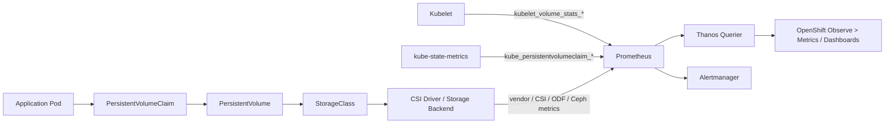

# PVC Metrics in OpenShift Monitoring and Metrics

**Audience:** Advanced OpenShift Administration / DO380-style operations / 10+ years Linux, Kubernetes, and OpenShift experience  
**Scope:** OpenShift Container Platform 4.x, Prometheus/Thanos based monitoring stack, PVC capacity, state, inode, health, alerting, troubleshooting, and operational runbooks  
**Last updated:** 2026-07-03

---

## Table of Contents

1. [What PVC metrics mean in OpenShift](#1-what-pvc-metrics-mean-in-openshift)
2. [PVC monitoring architecture in OpenShift](#2-pvc-monitoring-architecture-in-openshift)
3. [PVC metric families](#3-pvc-metric-families)
4. [Important PVC labels and cardinality](#4-important-pvc-labels-and-cardinality)
5. [Core PVC metrics reference](#5-core-pvc-metrics-reference)
6. [PromQL for PVC monitoring](#6-promql-for-pvc-monitoring)
7. [PVC dashboard design](#7-pvc-dashboard-design)
8. [Alerting rules for PVCs](#8-alerting-rules-for-pvcs)
9. [OpenShift CLI workflow](#9-openshift-cli-workflow)
10. [PVC troubleshooting playbooks](#10-pvc-troubleshooting-playbooks)
11. [PVC resize and expansion metrics](#11-pvc-resize-and-expansion-metrics)
12. [Storage backend correlation](#12-storage-backend-correlation)
13. [Performance and scale considerations](#13-performance-and-scale-considerations)
14. [Production best practices](#14-production-best-practices)
15. [Interview and real-world scenario questions](#15-interview-and-real-world-scenario-questions)
16. [Quick command and query cheat sheet](#16-quick-command-and-query-cheat-sheet)
17. [References](#17-references)

---

## 1. What PVC metrics mean in OpenShift

A **PersistentVolumeClaim (PVC)** is the namespace-scoped request for persistent storage. In OpenShift, a developer or platform team usually creates a PVC, and the cluster binds it to a PersistentVolume (PV), either statically or through dynamic provisioning by a StorageClass.

For monitoring, PVC metrics answer these questions:

- Is the PVC bound, pending, lost, terminating, or stuck in resize?
- How much storage did the workload request?
- How much real capacity does the mounted volume have?
- How much space is used and available inside the mounted filesystem?
- Are filesystem inodes close to exhaustion?
- Is the volume reported unhealthy by the kubelet/CSI path?
- Which namespaces, apps, teams, or storage classes consume the most persistent storage?
- Is a PVC growing fast enough to fill soon?
- Are monitoring components themselves, such as Prometheus, at risk because their own PVCs are filling?

A senior OpenShift administrator should treat PVC metrics as both **capacity management data** and **incident prevention data**. A PVC at 95% usage is not just a storage number. It can become:

- database crash or write failure,
- application `ENOSPC` errors,
- pod restart loops,
- degraded Prometheus/Alertmanager behavior,
- failed backups,
- failed compaction,
- CSI expansion pressure,
- node-level kubelet mount issues,
- storage backend pool exhaustion.

PVC metrics are not a single metric. They come from multiple layers.



---

## 2. PVC monitoring architecture in OpenShift

OpenShift includes a built-in monitoring stack based on Prometheus and related components. The default stack monitors core platform components, and cluster administrators can enable monitoring for user-defined projects. In OpenShift 4.x, the main cluster monitoring stack runs in `openshift-monitoring`, while user workload monitoring runs in `openshift-user-workload-monitoring` when enabled.

For PVC metrics, the usual collection path is:

1. **kubelet** exposes runtime volume usage metrics for mounted PVC-backed volumes.
2. **kube-state-metrics** exposes Kubernetes object-state metrics for PVC API objects.
3. **Prometheus** scrapes kubelet and kube-state-metrics targets.
4. **Thanos Querier** provides a query layer used by the OpenShift web console and APIs.
5. **OpenShift web console** lets administrators query PromQL from **Observe → Metrics** and review dashboards under **Observe → Dashboards**.
6. **Alertmanager** receives firing alerts from platform and custom Prometheus rules.

### 2.1 Platform PVC metrics vs application PVC metrics

There are two common PVC monitoring perspectives:

| Perspective | Examples | Who manages it | Main concern |
|---|---|---|---|
| Platform PVCs | Prometheus PVCs, Alertmanager PVCs, registry PVCs, logging PVCs, ODF internal PVCs | Cluster administrators | Platform reliability |
| Application PVCs | Database PVC, CI cache PVC, app upload PVC, message broker PVC | App/platform teams | Application reliability and quota/capacity control |

### 2.2 Why PVC metrics may differ from `oc get pvc`

`oc get pvc` shows the Kubernetes object state and requested size. It does **not** show live filesystem consumption. Live consumption usually comes from kubelet volume stats after the volume is mounted by a pod.

Example:

```bash
oc get pvc -n prod
```

Output might show:

```text
NAME       STATUS   VOLUME                                     CAPACITY   ACCESS MODES   STORAGECLASS
mysql-db   Bound    pvc-7ad08b3e-6f2e-4a7d-bbfa-aaaaaaaaaaaa   100Gi      RWO            ocs-storagecluster-ceph-rbd
```

But Prometheus might show:

```promql
kubelet_volume_stats_used_bytes{namespace="prod", persistentvolumeclaim="mysql-db"}
```

This is live usage from the mounted volume, not the PVC request object.

### 2.3 Main sources of PVC metrics

| Source | Metric prefix | What it tells you | Typical use |
|---|---|---|---|
| kubelet | `kubelet_volume_stats_*` | Real mounted volume capacity, available bytes, used bytes, inode stats, health | Capacity and filesystem alerting |
| kube-state-metrics | `kube_persistentvolumeclaim_*` | PVC API state, request, phase, storage class, volume name, volume mode | Inventory, lifecycle, pending/lost/terminating alerts |
| Storage backend / CSI / ODF | varies | Backend pool, disk, replication, latency, IOPS, health | Correlate PVC issue with storage system |
| Prometheus internal metrics | `prometheus_tsdb_*`, `scrape_*` | Monitoring stack storage growth and cardinality | Prevent monitoring PVC exhaustion |

---

## 3. PVC metric families

## 3.1 Kubelet volume stats metrics

These are the most important metrics for **actual PVC usage**.

They are emitted by kubelet and usually have these labels:

```text
namespace="<project>"
persistentvolumeclaim="<pvc-name>"
```

Additional labels such as `job`, `instance`, `endpoint`, `service`, `node`, or `metrics_path` can be added by Prometheus scrape configuration.

Important kubelet PVC metrics:

| Metric | Meaning | Unit | Why it matters |
|---|---|---:|---|
| `kubelet_volume_stats_capacity_bytes` | Total filesystem capacity visible for the volume | bytes | Denominator for percentage usage |
| `kubelet_volume_stats_available_bytes` | Available bytes in the volume | bytes | Better alert input than only used bytes |
| `kubelet_volume_stats_used_bytes` | Used bytes in the volume | bytes | Shows real data consumption |
| `kubelet_volume_stats_inodes` | Total inode count | count | Needed for many-small-files workloads |
| `kubelet_volume_stats_inodes_free` | Free inode count | count | Alerts before inode exhaustion |
| `kubelet_volume_stats_inodes_used` | Used inode count | count | Shows inode consumption trend |
| `kubelet_volume_stats_health_status_abnormal` | Volume health, where `1` means abnormal and `0` means healthy | boolean-like gauge | Detects unhealthy volume path where supported |
| `kubelet_volume_metric_collection_duration_seconds` | Time kubelet takes to collect volume stats | seconds | Useful when kubelet volume metric collection is slow |

### 3.1.1 Important behavior

A senior admin should remember this:

- `kubelet_volume_stats_*` is generally visible only when the PVC is **mounted by a pod** on a node.
- If a PVC exists but is not mounted, kubelet might not expose usage metrics for it.
- If a workload is scaled to zero, usage metrics can disappear or become stale depending on scrape and retention behavior.
- Some storage types or drivers might not expose all fields equally.
- Raw block PVCs do not behave like mounted filesystems, so filesystem-style stats might not be meaningful or available.
- `available_bytes` can be lower than `capacity - used` because filesystems reserve space and apply quotas differently.

## 3.2 kube-state-metrics PVC object-state metrics

`kube-state-metrics` exposes the state of Kubernetes API objects. For PVCs, this includes request size, phase, storage class, access mode, labels, annotations, volume mode, creation timestamp, and deletion timestamp.

Important PVC object metrics:

| Metric | Meaning | Useful for |
|---|---|---|
| `kube_persistentvolumeclaim_info` | Static PVC info labels such as namespace, PVC name, storage class, volume name, volume mode | Inventory and joins |
| `kube_persistentvolumeclaim_status_phase` | PVC phase: `Pending`, `Bound`, `Lost` | Lifecycle alerting |
| `kube_persistentvolumeclaim_resource_requests_storage_bytes` | Requested storage from `.spec.resources.requests.storage` | Quota, request vs actual comparison |
| `kube_persistentvolumeclaim_access_mode` | Access mode such as RWO, RWX, ROX | Placement and design validation |
| `kube_persistentvolumeclaim_labels` | Kubernetes labels converted to Prometheus labels, if allowed | Ownership and dashboards |
| `kube_persistentvolumeclaim_annotations` | Kubernetes annotations converted to Prometheus labels, if allowed | Limited metadata enrichment |
| `kube_persistentvolumeclaim_status_condition` | PVC conditions with status true/false/unknown | Resize and condition alerting |
| `kube_persistentvolumeclaim_created` | PVC creation timestamp | Age and lifecycle checks |
| `kube_persistentvolumeclaim_deletion_timestamp` | PVC deletion timestamp | Terminating/stuck PVC detection |

### 3.2.1 Difference between request, capacity, used, and available

| Concept | Metric | Meaning |
|---|---|---|
| Requested size | `kube_persistentvolumeclaim_resource_requests_storage_bytes` | What the PVC asks for |
| Actual mounted capacity | `kubelet_volume_stats_capacity_bytes` | What the mounted filesystem reports |
| Used space | `kubelet_volume_stats_used_bytes` | Data used in filesystem |
| Available space | `kubelet_volume_stats_available_bytes` | Space available for writes |

Example:

```text
PVC request:       100 GiB
Mounted capacity: 100 GiB
Used:              85 GiB
Available:         12 GiB
Missing 3 GiB:     filesystem overhead/reservation/metadata
```

Do not assume:

```text
available = capacity - used
```

That is often close, but not guaranteed.

## 3.3 Storage backend metrics

PVC metrics show the workload view. They do not fully explain backend health.

For example, an app PVC can show 40% used, but the backend storage pool can be 92% full. In that case, PVC expansion or dynamic provisioning can fail even though the application PVC itself does not look full.

Common backend indicators:

- backend pool total capacity,
- backend pool used capacity,
- thin-provisioning overcommitment,
- replication health,
- CSI controller errors,
- storage node disk pressure,
- IOPS/latency/throughput,
- volume attachment and mount errors,
- snapshot and clone capacity.

For OpenShift Data Foundation (ODF), always correlate PVC usage with ODF/Ceph dashboards and alerts.

---

## 4. Important PVC labels and cardinality

Prometheus labels allow filtering and grouping, but labels also create time series cardinality.

Common useful labels:

| Label | Found on | Meaning |
|---|---|---|
| `namespace` | kubelet and kube-state-metrics | OpenShift project |
| `persistentvolumeclaim` | kubelet and kube-state-metrics | PVC name |
| `storageclass` | `kube_persistentvolumeclaim_info` | StorageClass name |
| `volumename` | `kube_persistentvolumeclaim_info` | Bound PV name |
| `volumemode` | `kube_persistentvolumeclaim_info` | `Filesystem` or `Block` |
| `phase` | `kube_persistentvolumeclaim_status_phase` | `Pending`, `Bound`, `Lost` |
| `access_mode` | `kube_persistentvolumeclaim_access_mode` | `ReadWriteOnce`, `ReadWriteMany`, etc. |
| `node` | often added by scrape labels | Node where kubelet metrics were scraped |
| `job` | Prometheus scrape job | Scrape source |

### 4.1 Cardinality warning

Avoid adding high-cardinality labels to custom storage metrics, such as:

- file path,
- object ID,
- request ID,
- pod UID as business metric label,
- transaction ID,
- username,
- customer ID,
- randomly generated volume labels.

High cardinality can increase Prometheus disk usage and memory pressure. This matters because the monitoring stack itself uses persistent storage. A bad custom metric can indirectly fill Prometheus PVCs.

Good label examples:

```text
namespace="prod"
team="payments"
storageclass="ocs-storagecluster-ceph-rbd"
environment="production"
```

Bad label examples:

```text
file="/data/uploads/2026/07/03/user-485923938/file-999921.jpg"
request_id="8a0e2a6c-c4b1-4d1e-92e9-d5a383e0be9a"
customer_id="184829381938193"
```

---

## 5. Core PVC metrics reference

## 5.1 Capacity and usage metrics

### `kubelet_volume_stats_capacity_bytes`

Total capacity of the mounted PVC filesystem.

Example query:

```promql
kubelet_volume_stats_capacity_bytes{namespace="prod", persistentvolumeclaim="mysql-db"}
```

Convert to GiB:

```promql
kubelet_volume_stats_capacity_bytes{namespace="prod", persistentvolumeclaim="mysql-db"} / 1024 / 1024 / 1024
```

### `kubelet_volume_stats_used_bytes`

Used bytes in the mounted PVC filesystem.

```promql
kubelet_volume_stats_used_bytes{namespace="prod", persistentvolumeclaim="mysql-db"} / 1024 / 1024 / 1024
```

### `kubelet_volume_stats_available_bytes`

Available bytes for writes.

```promql
kubelet_volume_stats_available_bytes{namespace="prod", persistentvolumeclaim="mysql-db"} / 1024 / 1024 / 1024
```

### Usage percentage

Preferred formula:

```promql
100 * (1 - (
  kubelet_volume_stats_available_bytes
  /
  kubelet_volume_stats_capacity_bytes
))
```

Why use available/capacity instead of used/capacity? Because `available_bytes` is closer to whether applications can continue writing.

## 5.2 Inode metrics

A filesystem can fail writes even when bytes are available if it runs out of inodes. This is common for workloads that create millions of small files, such as:

- image upload services,
- CI/CD caches,
- Maven/npm repositories,
- log directories,
- mail spools,
- object-like file stores,
- temporary processing directories.

Inode usage percentage:

```promql
100 * (1 - (
  kubelet_volume_stats_inodes_free
  /
  kubelet_volume_stats_inodes
))
```

PVCs with high inode consumption:

```promql
topk(10,
  100 * (1 - (
    kubelet_volume_stats_inodes_free
    /
    kubelet_volume_stats_inodes
  ))
)
```

## 5.3 Health metric

```promql
kubelet_volume_stats_health_status_abnormal == 1
```

Meaning:

- `0`: healthy, if reported
- `1`: abnormal/unhealthy, if reported

Do not assume every CSI driver reports health in the same way. Validate with your storage provider documentation and test alerts in a non-production namespace.

## 5.4 PVC request metric

```promql
kube_persistentvolumeclaim_resource_requests_storage_bytes
```

This is the requested size in the PVC spec.

Useful for namespace requested capacity:

```promql
sum by (namespace) (
  kube_persistentvolumeclaim_resource_requests_storage_bytes
)
```

Convert to TiB:

```promql
sum by (namespace) (
  kube_persistentvolumeclaim_resource_requests_storage_bytes
) / 1024 / 1024 / 1024 / 1024
```

## 5.5 PVC phase metric

```promql
kube_persistentvolumeclaim_status_phase
```

Example values:

```text
phase="Pending"
phase="Bound"
phase="Lost"
```

PVCs not bound:

```promql
kube_persistentvolumeclaim_status_phase{phase=~"Pending|Lost"} == 1
```

PVCs pending for current instant:

```promql
kube_persistentvolumeclaim_status_phase{phase="Pending"} == 1
```

## 5.6 PVC metadata metric

```promql
kube_persistentvolumeclaim_info
```

This metric is useful for joins because it contains metadata labels such as `storageclass`, `volumename`, and `volumemode`.

Example: show capacity usage with storage class label.

```promql
(
  100 * (1 - kubelet_volume_stats_available_bytes / kubelet_volume_stats_capacity_bytes)
)
* on (namespace, persistentvolumeclaim)
group_left(storageclass, volumename, volumemode)
kube_persistentvolumeclaim_info
```

---

## 6. PromQL for PVC monitoring

## 6.1 PVC used percentage by PVC

```promql
100 * (1 - (
  kubelet_volume_stats_available_bytes
  /
  kubelet_volume_stats_capacity_bytes
))
```

## 6.2 PVC used percentage with namespace and PVC labels

```promql
100 * (1 - (
  kubelet_volume_stats_available_bytes{namespace!=""}
  /
  kubelet_volume_stats_capacity_bytes{namespace!=""}
))
```

## 6.3 Top 10 PVCs by used percentage

```promql
topk(10,
  100 * (1 - (
    kubelet_volume_stats_available_bytes
    /
    kubelet_volume_stats_capacity_bytes
  ))
)
```

## 6.4 Top 10 PVCs by used bytes

```promql
topk(10,
  kubelet_volume_stats_used_bytes
)
```

## 6.5 PVC available GiB

```promql
kubelet_volume_stats_available_bytes / 1024 / 1024 / 1024
```

## 6.6 PVC capacity GiB

```promql
kubelet_volume_stats_capacity_bytes / 1024 / 1024 / 1024
```

## 6.7 Namespace total requested PVC storage

```promql
sum by (namespace) (
  kube_persistentvolumeclaim_resource_requests_storage_bytes
) / 1024 / 1024 / 1024
```

## 6.8 Namespace total actual mounted capacity

```promql
sum by (namespace) (
  kubelet_volume_stats_capacity_bytes
) / 1024 / 1024 / 1024
```

Important: this counts only PVCs with visible kubelet volume stats. PVCs not mounted by a pod might not appear here.

## 6.9 Namespace total used PVC storage

```promql
sum by (namespace) (
  kubelet_volume_stats_used_bytes
) / 1024 / 1024 / 1024
```

## 6.10 PVC requested vs actual capacity

```promql
(
  kube_persistentvolumeclaim_resource_requests_storage_bytes
)
-
on (namespace, persistentvolumeclaim)
(
  kubelet_volume_stats_capacity_bytes
)
```

If the result is positive, the PVC request is larger than visible mounted capacity. This can happen during resize transitions or when metrics are stale.

## 6.11 PVCs that exist but have no kubelet volume stats

```promql
kube_persistentvolumeclaim_info{volumename!=""}
unless on (namespace, persistentvolumeclaim)
kubelet_volume_stats_capacity_bytes
```

Interpretation:

- PVC exists and is bound, but no mounted volume stats are visible.
- Possible reasons: no running pod mounts it, raw block mode, driver limitation, scrape issue, or workload scaled to zero.

## 6.12 PVCs pending

```promql
kube_persistentvolumeclaim_status_phase{phase="Pending"} == 1
```

## 6.13 PVCs lost

```promql
kube_persistentvolumeclaim_status_phase{phase="Lost"} == 1
```

## 6.14 PVCs stuck terminating

PVC terminating is not a normal PVC phase. It is usually inferred by combining deletion timestamp and phase.

```promql
kube_persistentvolumeclaim_deletion_timestamp
* on(namespace, persistentvolumeclaim) group_left()
(kube_persistentvolumeclaim_status_phase{phase="Bound"} == 1)
> 0
```

## 6.15 PVCs by storage class

```promql
count by (storageclass) (
  kube_persistentvolumeclaim_info
)
```

## 6.16 Requested capacity by storage class

```promql
sum by (storageclass) (
  kube_persistentvolumeclaim_resource_requests_storage_bytes
* on(namespace, persistentvolumeclaim)
  group_left(storageclass)
  kube_persistentvolumeclaim_info
) / 1024 / 1024 / 1024
```

## 6.17 Used capacity by storage class

```promql
sum by (storageclass) (
  kubelet_volume_stats_used_bytes
* on(namespace, persistentvolumeclaim)
  group_left(storageclass)
  kube_persistentvolumeclaim_info
) / 1024 / 1024 / 1024
```

## 6.18 PVC free capacity by storage class

```promql
sum by (storageclass) (
  kubelet_volume_stats_available_bytes
* on(namespace, persistentvolumeclaim)
  group_left(storageclass)
  kube_persistentvolumeclaim_info
) / 1024 / 1024 / 1024
```

## 6.19 PVC growth rate over 6 hours

```promql
deriv(kubelet_volume_stats_used_bytes[6h])
```

This returns bytes per second trend. Convert to GiB/day:

```promql
deriv(kubelet_volume_stats_used_bytes[6h]) * 86400 / 1024 / 1024 / 1024
```

## 6.20 Predict PVC full within 4 days

```promql
predict_linear(kubelet_volume_stats_available_bytes[6h], 4 * 24 * 3600) < 0
```

Better production condition:

```promql
(
  kubelet_volume_stats_available_bytes / kubelet_volume_stats_capacity_bytes < 0.15
)
and
(
  predict_linear(kubelet_volume_stats_available_bytes[6h], 4 * 24 * 3600) < 0
)
```

## 6.21 PVC health abnormal

```promql
kubelet_volume_stats_health_status_abnormal == 1
```

## 6.22 Inode usage above 85%

```promql
100 * (1 - (
  kubelet_volume_stats_inodes_free
  /
  kubelet_volume_stats_inodes
)) > 85
```

## 6.23 PVCs with zero available bytes

```promql
kubelet_volume_stats_available_bytes == 0
```

This should be treated as critical for mounted read-write workloads.

## 6.24 Join PVC usage with app/team labels

If PVC labels are allowed into kube-state-metrics:

```promql
(
  100 * (1 - kubelet_volume_stats_available_bytes / kubelet_volume_stats_capacity_bytes)
)
* on(namespace, persistentvolumeclaim)
group_left(label_app, label_team, label_environment)
kube_persistentvolumeclaim_labels
```

Use this carefully. Only allow bounded labels such as `app`, `team`, `environment`, or `cost-center`.

---

## 7. PVC dashboard design

A strong PVC dashboard should not be only one graph. It should provide multiple operational views.

## 7.1 Cluster overview panel

Recommended panels:

1. Total requested PVC capacity by namespace.
2. Total mounted PVC used capacity by namespace.
3. Total available PVC capacity by namespace.
4. Top 10 PVCs by usage percentage.
5. Top 10 PVCs by used GiB.
6. PVCs in `Pending` or `Lost` phase.
7. PVCs stuck terminating.
8. PVCs with missing kubelet volume stats.
9. PVCs above inode threshold.
10. PVCs with abnormal health status.

## 7.2 Namespace drilldown panel

For a selected namespace:

- PVC usage percentage by PVC,
- used GiB by PVC,
- available GiB by PVC,
- requested GiB vs capacity GiB,
- PVC phase,
- storage class,
- bound PV name,
- mounted pod name if you add pod/PVC mapping panels,
- growth rate and predicted full date.

## 7.3 StorageClass panel

Useful for platform teams:

- count of PVCs by StorageClass,
- requested capacity by StorageClass,
- mounted used capacity by StorageClass,
- average usage percentage by StorageClass,
- top consumers per StorageClass,
- pending PVCs by StorageClass.

## 7.4 Application owner panel

If PVC labels are standardized:

- total request by `team`,
- total used by `team`,
- top risky PVCs by `app`,
- growth rate by `app`,
- quota pressure by namespace.

## 7.5 Dashboard anti-patterns

Avoid dashboards that:

- show only `used_bytes` without capacity percentage,
- show only request size and not live filesystem usage,
- ignore inode usage,
- ignore `Pending` and `Lost` PVCs,
- join against high-cardinality labels,
- sum kubelet capacity and assume it includes unmounted PVCs,
- hide namespace labels,
- use a single cluster-wide average percentage. Averages hide critical PVCs.

---

## 8. Alerting rules for PVCs

The best PVC alerts combine **current pressure** and **prediction**. A PVC at 90% but stable might be lower priority than a PVC at 70% filling at 100 GiB/day.

## 8.1 PVC filling soon warning

```yaml
apiVersion: monitoring.coreos.com/v1
kind: PrometheusRule
metadata:
  name: pvc-capacity-alerts
  namespace: openshift-monitoring
spec:
  groups:
  - name: pvc-capacity.rules
    rules:
    - alert: PersistentVolumeClaimFillingSoon
      expr: |
        (
          kubelet_volume_stats_available_bytes / kubelet_volume_stats_capacity_bytes < 0.15
        )
        and
        (
          predict_linear(kubelet_volume_stats_available_bytes[6h], 4 * 24 * 3600) < 0
        )
      for: 30m
      labels:
        severity: warning
      annotations:
        summary: "PVC {{ $labels.namespace }}/{{ $labels.persistentvolumeclaim }} is filling soon"
        description: "PVC has less than 15% available and is predicted to fill within 4 days."
```

## 8.2 PVC critically full

```yaml
apiVersion: monitoring.coreos.com/v1
kind: PrometheusRule
metadata:
  name: pvc-critical-alerts
  namespace: openshift-monitoring
spec:
  groups:
  - name: pvc-critical.rules
    rules:
    - alert: PersistentVolumeClaimAlmostFull
      expr: |
        kubelet_volume_stats_available_bytes / kubelet_volume_stats_capacity_bytes < 0.03
      for: 10m
      labels:
        severity: critical
      annotations:
        summary: "PVC {{ $labels.namespace }}/{{ $labels.persistentvolumeclaim }} is almost full"
        description: "PVC has less than 3% available capacity. Writes can fail."
```

## 8.3 PVC inode warning

```yaml
apiVersion: monitoring.coreos.com/v1
kind: PrometheusRule
metadata:
  name: pvc-inode-alerts
  namespace: openshift-monitoring
spec:
  groups:
  - name: pvc-inode.rules
    rules:
    - alert: PersistentVolumeClaimInodesFillingUp
      expr: |
        kubelet_volume_stats_inodes_free / kubelet_volume_stats_inodes < 0.15
      for: 30m
      labels:
        severity: warning
      annotations:
        summary: "PVC {{ $labels.namespace }}/{{ $labels.persistentvolumeclaim }} inode usage is high"
        description: "PVC has less than 15% free inodes. Applications that create many small files can fail even when bytes are available."
```

## 8.4 PVC pending

```yaml
apiVersion: monitoring.coreos.com/v1
kind: PrometheusRule
metadata:
  name: pvc-state-alerts
  namespace: openshift-monitoring
spec:
  groups:
  - name: pvc-state.rules
    rules:
    - alert: PersistentVolumeClaimPending
      expr: |
        kube_persistentvolumeclaim_status_phase{phase="Pending"} == 1
      for: 15m
      labels:
        severity: warning
      annotations:
        summary: "PVC {{ $labels.namespace }}/{{ $labels.persistentvolumeclaim }} is Pending"
        description: "PVC has been Pending for more than 15 minutes. Check StorageClass, provisioner, quota, binding mode, and events."
```

## 8.5 PVC lost

```yaml
apiVersion: monitoring.coreos.com/v1
kind: PrometheusRule
metadata:
  name: pvc-lost-alerts
  namespace: openshift-monitoring
spec:
  groups:
  - name: pvc-lost.rules
    rules:
    - alert: PersistentVolumeClaimLost
      expr: |
        kube_persistentvolumeclaim_status_phase{phase="Lost"} == 1
      for: 5m
      labels:
        severity: critical
      annotations:
        summary: "PVC {{ $labels.namespace }}/{{ $labels.persistentvolumeclaim }} is Lost"
        description: "The PVC is in Lost phase. Investigate PV binding, backend volume, and application data risk."
```

## 8.6 PVC stuck terminating

```yaml
apiVersion: monitoring.coreos.com/v1
kind: PrometheusRule
metadata:
  name: pvc-terminating-alerts
  namespace: openshift-monitoring
spec:
  groups:
  - name: pvc-terminating.rules
    rules:
    - alert: PersistentVolumeClaimBlockedInTerminatingState
      expr: |
        kube_persistentvolumeclaim_deletion_timestamp
        * on(namespace, persistentvolumeclaim) group_left()
        (kube_persistentvolumeclaim_status_phase{phase="Bound"} == 1)
        > 0
      for: 10m
      labels:
        severity: warning
      annotations:
        summary: "PVC {{ $labels.namespace }}/{{ $labels.persistentvolumeclaim }} is blocked in Terminating"
        description: "PVC has a deletion timestamp but remains Bound. Check finalizers, pods using the PVC, and storage backend detach/delete status."
```

## 8.7 PVC health abnormal

```yaml
apiVersion: monitoring.coreos.com/v1
kind: PrometheusRule
metadata:
  name: pvc-health-alerts
  namespace: openshift-monitoring
spec:
  groups:
  - name: pvc-health.rules
    rules:
    - alert: PersistentVolumeClaimHealthAbnormal
      expr: |
        kubelet_volume_stats_health_status_abnormal == 1
      for: 5m
      labels:
        severity: critical
      annotations:
        summary: "PVC {{ $labels.namespace }}/{{ $labels.persistentvolumeclaim }} health abnormal"
        description: "Kubelet reports the volume health status as abnormal. Validate CSI driver, node logs, events, and backend storage health."
```

## 8.8 Missing kubelet stats for bound PVC

```yaml
apiVersion: monitoring.coreos.com/v1
kind: PrometheusRule
metadata:
  name: pvc-missing-stats-alerts
  namespace: openshift-monitoring
spec:
  groups:
  - name: pvc-missing-stats.rules
    rules:
    - alert: PersistentVolumeClaimMissingKubeletStats
      expr: |
        kube_persistentvolumeclaim_info{volumename!="", volumemode="Filesystem"}
        unless on(namespace, persistentvolumeclaim)
        kubelet_volume_stats_capacity_bytes
      for: 1h
      labels:
        severity: info
      annotations:
        summary: "PVC {{ $labels.namespace }}/{{ $labels.persistentvolumeclaim }} has no kubelet volume stats"
        description: "PVC is bound but kubelet volume stats are not visible. This might be normal if no running pod mounts it."
```

Use this as an **info** alert or dashboard signal, not always as a paging alert.

## 8.9 Where to place PrometheusRule objects

For cluster platform alerts, you normally create rules in a namespace monitored by the platform monitoring stack, such as `openshift-monitoring`, depending on your OpenShift support policy and organization standards.

For user workload monitoring, create rules in the application namespace after user workload monitoring is enabled, and make sure RBAC allows the project team to manage its own alerting rules.

---

## 9. OpenShift CLI workflow

## 9.1 List PVCs across all namespaces

```bash
oc get pvc -A
```

With custom columns:

```bash
oc get pvc -A \
  -o custom-columns='NAMESPACE:.metadata.namespace,NAME:.metadata.name,STATUS:.status.phase,REQUEST:.spec.resources.requests.storage,SC:.spec.storageClassName,VOLUME:.spec.volumeName,VOLUMEMODE:.spec.volumeMode'
```

## 9.2 Describe one PVC

```bash
oc describe pvc <pvc-name> -n <namespace>
```

Look for:

- Events,
- finalizers,
- storage class,
- capacity,
- access modes,
- volume mode,
- conditions,
- selected node annotation for WaitForFirstConsumer,
- resize status.

## 9.3 Find bound PV

```bash
oc get pvc <pvc-name> -n <namespace> -o jsonpath='{.spec.volumeName}{"\n"}'
```

Then:

```bash
oc describe pv <pv-name>
```

## 9.4 Find StorageClass details

```bash
oc get sc
oc describe sc <storageclass-name>
```

Important fields:

- provisioner,
- reclaim policy,
- volume binding mode,
- allowVolumeExpansion,
- parameters,
- mount options.

## 9.5 Find pods mounting a PVC

```bash
oc get pods -n <namespace> -o json \
| jq -r --arg pvc "<pvc-name>" '
  .items[]
  | select(.spec.volumes[]? | select(.persistentVolumeClaim.claimName==$pvc))
  | .metadata.name
'
```

Without `jq`, inspect pod YAML:

```bash
oc get pod <pod-name> -n <namespace> -o yaml | grep -A5 persistentVolumeClaim
```

## 9.6 Check filesystem usage from inside the pod

```bash
oc exec -n <namespace> <pod-name> -- df -hT <mount-path>
oc exec -n <namespace> <pod-name> -- df -i <mount-path>
```

Example:

```bash
oc exec -n prod mysql-0 -- df -hT /var/lib/mysql
oc exec -n prod mysql-0 -- df -i /var/lib/mysql
```

## 9.7 Query metrics from OpenShift web console

1. Log in to the OpenShift web console.
2. Go to **Observe → Metrics**.
3. Paste a PromQL query.
4. Select the required project if using project-scoped access.
5. Run the query.

Example:

```promql
100 * (1 - kubelet_volume_stats_available_bytes / kubelet_volume_stats_capacity_bytes)
```

## 9.8 Query metrics by CLI through Thanos Querier

Get the Thanos Querier route:

```bash
THANOS_HOST=$(oc get route -n openshift-monitoring thanos-querier -o jsonpath='{.status.ingress[0].host}')
```

Query Prometheus-compatible API:

```bash
curl -k -H "Authorization: Bearer $(oc whoami -t)" \
  "https://${THANOS_HOST}/api/v1/query?query=kubelet_volume_stats_capacity_bytes"
```

URL-encode complex PromQL queries when scripting.

## 9.9 Check if PVC metrics exist

```bash
THANOS_HOST=$(oc get route -n openshift-monitoring thanos-querier -o jsonpath='{.status.ingress[0].host}')

curl -k -H "Authorization: Bearer $(oc whoami -t)" \
  "https://${THANOS_HOST}/api/v1/metadata" \
| jq '.data | keys[]' \
| grep -E 'kubelet_volume_stats|kube_persistentvolumeclaim'
```

## 9.10 Check kubelet metrics target

From web console:

```text
Observe → Targets
```

From CLI, use Thanos/Prometheus target APIs if exposed and permitted.

---

## 10. PVC troubleshooting playbooks

## 10.1 PVC usage alert firing

### Symptoms

- Alert: `PersistentVolumeClaimAlmostFull` or `KubePersistentVolumeFillingUp`.
- Application logs show `No space left on device`.
- Database cannot checkpoint, compact, or write WAL/binlogs.
- Pod restarts due to application failure.

### Checks

```bash
oc get pvc -n <ns> <pvc>
oc describe pvc -n <ns> <pvc>
```

Find pod:

```bash
oc get pods -n <ns> -o json \
| jq -r --arg pvc "<pvc>" '.items[] | select(.spec.volumes[]? | select(.persistentVolumeClaim.claimName==$pvc)) | .metadata.name'
```

Inside pod:

```bash
oc exec -n <ns> <pod> -- df -hT <mount-path>
oc exec -n <ns> <pod> -- du -xhd1 <mount-path> | sort -h
```

PromQL:

```promql
kubelet_volume_stats_available_bytes{namespace="<ns>", persistentvolumeclaim="<pvc>"}
```

```promql
100 * (1 - kubelet_volume_stats_available_bytes{namespace="<ns>", persistentvolumeclaim="<pvc>"} / kubelet_volume_stats_capacity_bytes{namespace="<ns>", persistentvolumeclaim="<pvc>"})
```

### Fix options

- Delete unnecessary data after application owner approval.
- Move old files to object storage or archive.
- Reduce logs, caches, temporary files, old backups.
- Expand PVC if supported.
- Add retention policy at application layer.
- For databases, use database-native cleanup, vacuum, compaction, or purge methods.
- Validate backend storage pool before expanding.

### Avoid

- Do not delete database files manually unless vendor procedure says so.
- Do not remove PV data directly from the node unless you fully understand the volume backend.
- Do not patch finalizers to force delete a PVC before understanding data impact.

---

## 10.2 PVC pending

### Symptoms

```bash
oc get pvc -n <ns>
```

Shows:

```text
STATUS: Pending
```

### Common causes

- StorageClass does not exist.
- Default StorageClass missing and PVC does not specify one.
- Dynamic provisioner down.
- Quota blocks request.
- `volumeBindingMode: WaitForFirstConsumer` and no pod has been scheduled yet.
- Node selector, taints, affinity, or topology prevents scheduling.
- Storage backend has no capacity.
- CSI controller errors.
- Access mode unsupported by StorageClass.

### Checks

```bash
oc describe pvc -n <ns> <pvc>
oc get events -n <ns> --sort-by=.lastTimestamp
oc get sc
oc describe sc <sc-name>
oc get pods -n <ns> -o wide
```

If using WaitForFirstConsumer:

```bash
oc describe sc <sc-name> | grep -i VolumeBindingMode
```

If it is `WaitForFirstConsumer`, the PVC might remain pending until a pod using it is scheduled.

### PromQL

```promql
kube_persistentvolumeclaim_status_phase{phase="Pending"} == 1
```

---

## 10.3 PVC bound but application cannot write

### Symptoms

- PVC is `Bound`.
- Pod is running.
- Application logs show permission denied or read-only filesystem.
- Metrics show available bytes, but app fails writes.

### Checks

```bash
oc describe pod -n <ns> <pod>
oc exec -n <ns> <pod> -- mount | grep <mount-path>
oc exec -n <ns> <pod> -- id
oc exec -n <ns> <pod> -- ls -ld <mount-path>
oc exec -n <ns> <pod> -- touch <mount-path>/write-test
```

OpenShift-specific areas:

- SecurityContextConstraints (SCC),
- random UID behavior,
- `fsGroup`,
- SELinux labels,
- read-only mount,
- access mode mismatch,
- storage backend export permissions.

Metrics will not always detect permission problems. PVC metrics show capacity and state, not POSIX permissions.

---

## 10.4 PVC metrics missing

### Symptoms

PromQL returns no result:

```promql
kubelet_volume_stats_capacity_bytes{namespace="<ns>", persistentvolumeclaim="<pvc>"}
```

But PVC exists:

```bash
oc get pvc -n <ns> <pvc>
```

### Common causes

- No running pod currently mounts the PVC.
- Workload scaled to zero.
- PVC is `Pending` and not mounted.
- PVC is raw block mode.
- CSI driver or kubelet path does not expose volume stats.
- kubelet target scrape problem.
- Metrics are filtered or relabeled.
- Query is pointed at user workload Prometheus instead of cluster metric source.

### Checks

```promql
kube_persistentvolumeclaim_info{namespace="<ns>", persistentvolumeclaim="<pvc>"}
```

```promql
kube_persistentvolumeclaim_info{namespace="<ns>", persistentvolumeclaim="<pvc>"}
unless on(namespace, persistentvolumeclaim)
kubelet_volume_stats_capacity_bytes{namespace="<ns>", persistentvolumeclaim="<pvc>"}
```

Check pods using PVC:

```bash
oc get pods -n <ns> -o json \
| jq -r --arg pvc "<pvc>" '.items[] | select(.spec.volumes[]? | select(.persistentVolumeClaim.claimName==$pvc)) | .metadata.name + " " + .status.phase'
```

---

## 10.5 Inode exhaustion

### Symptoms

- Application gets `No space left on device`.
- `df -h` shows available bytes.
- `df -i` shows inode usage at or near 100%.

### PromQL

```promql
100 * (1 - kubelet_volume_stats_inodes_free / kubelet_volume_stats_inodes)
```

### Pod check

```bash
oc exec -n <ns> <pod> -- df -i <mount-path>
oc exec -n <ns> <pod> -- find <mount-path> -xdev -type f | wc -l
```

### Fix

- Remove old small files.
- Compact application directories.
- Change app design to avoid tiny-file explosion.
- Use object storage for large file counts.
- Use a filesystem/storage class better suited to the workload.
- Increase capacity only if inode count scales with capacity for that filesystem/storage provider.

---

## 10.6 PVC stuck terminating

### Symptoms

```bash
oc get pvc -n <ns>
```

Shows `Terminating` for a long time.

### PromQL

```promql
kube_persistentvolumeclaim_deletion_timestamp
* on(namespace, persistentvolumeclaim) group_left()
(kube_persistentvolumeclaim_status_phase{phase="Bound"} == 1)
> 0
```

### Checks

```bash
oc describe pvc -n <ns> <pvc>
oc get pvc -n <ns> <pvc> -o yaml | grep -A10 finalizers
oc get pods -n <ns> -o wide | grep -i <app>
oc get events -n <ns> --sort-by=.lastTimestamp
```

### Fix path

1. Confirm no pod still uses the PVC.
2. Check finalizers.
3. Check PV reclaim policy.
4. Check CSI controller logs.
5. Check backend volume deletion/detach status.
6. Remove finalizers only as a last resort and only after confirming data/reclaim impact.

---

## 10.7 Prometheus PVC filling

This is platform-critical. If Prometheus storage fills, alerting and metrics can become unreliable.

### Checks

```bash
oc get pvc -n openshift-monitoring
oc get pods -n openshift-monitoring | grep prometheus
```

PromQL:

```promql
100 * (1 - kubelet_volume_stats_available_bytes{namespace="openshift-monitoring"} / kubelet_volume_stats_capacity_bytes{namespace="openshift-monitoring"})
```

Check high-cardinality sources:

```promql
topk(10, max by(namespace, job) (topk by(namespace, job) (1, scrape_samples_post_metric_relabeling)))
```

```promql
topk(10, sum by(namespace, job) (sum_over_time(scrape_series_added[1h])))
```

### Fix options

- Increase Prometheus PVC size.
- Reduce retention.
- Reduce high-cardinality metrics.
- Apply scrape limits for user workload monitoring where appropriate.
- Use remote write for long-term retention if required.
- Investigate user-defined metrics with unbounded labels.

---

## 11. PVC resize and expansion metrics

PVC expansion is not only a storage operation; it is a metric transition.

## 11.1 Required conditions

Expansion generally requires:

- StorageClass has `allowVolumeExpansion: true`.
- Underlying CSI/storage driver supports expansion.
- Dynamic provisioning is used for many CSI expansion workflows.
- The PVC request is updated to a larger size.
- Filesystem resize completes on the node if required.

Check StorageClass:

```bash
oc get sc <sc-name> -o yaml | grep allowVolumeExpansion
```

Patch PVC:

```bash
oc patch pvc <pvc-name> -n <namespace> \
  -p '{"spec":{"resources":{"requests":{"storage":"200Gi"}}}}'
```

Watch status:

```bash
oc describe pvc <pvc-name> -n <namespace>
oc get pvc <pvc-name> -n <namespace> -w
```

## 11.2 Resize-related metric behavior

During resize:

- `kube_persistentvolumeclaim_resource_requests_storage_bytes` changes immediately after PVC spec update.
- `kubelet_volume_stats_capacity_bytes` might update only after backend and filesystem resize complete.
- PVC conditions can show resizing states.
- Application may not see new space until filesystem resize completes.

PromQL to detect request greater than mounted capacity:

```promql
kube_persistentvolumeclaim_resource_requests_storage_bytes
-
on(namespace, persistentvolumeclaim)
kubelet_volume_stats_capacity_bytes
> 0
```

Add metadata:

```promql
(
  kube_persistentvolumeclaim_resource_requests_storage_bytes
  - on(namespace, persistentvolumeclaim)
  kubelet_volume_stats_capacity_bytes
)
* on(namespace, persistentvolumeclaim)
group_left(storageclass, volumename)
kube_persistentvolumeclaim_info
> 0
```

## 11.3 Resize stuck checklist

```bash
oc describe pvc -n <ns> <pvc>
oc describe pv <pv>
oc describe sc <sc>
oc get events -n <ns> --sort-by=.lastTimestamp
oc get pods -n <ns> -o wide
```

Check CSI components:

```bash
oc get pods -A | grep -i csi
```

StorageClass common issue:

```yaml
allowVolumeExpansion: false
```

If it is false, PVC expansion will not work until supported and enabled by the storage class.

---

## 12. Storage backend correlation

PVC metrics tell you what Kubernetes and kubelet see. Backend metrics tell you what storage actually experiences.

## 12.1 Example correlation matrix

| PVC symptom | PVC metric | Backend area to check |
|---|---|---|
| PVC Pending | `kube_persistentvolumeclaim_status_phase{phase="Pending"}` | Provisioner, pool capacity, topology, quota |
| PVC almost full | `kubelet_volume_stats_available_bytes` | Backend pool free capacity, expansion support |
| PVC health abnormal | `kubelet_volume_stats_health_status_abnormal` | CSI health, storage node, replication, volume attach |
| Resize stuck | request > capacity | CSI resizer, backend expansion task, filesystem resize |
| High latency app | PVC metrics may look normal | Storage latency/IOPS metrics, node IO wait |
| Missing stats | absent `kubelet_volume_stats_*` | driver capability, kubelet scrape, pod mount state |

## 12.2 OpenShift Data Foundation / Ceph style thinking

When OpenShift Data Foundation backs application PVCs:

- PVC usage can be low while Ceph pool usage is high.
- Thin provisioning means requested capacity can exceed physical available capacity.
- Replication increases backend physical consumption.
- Snapshots and clones can consume backend capacity that is not obvious from app PVC usage alone.
- RBD and CephFS have different workload behavior and metrics.

Always correlate:

- PVC used percentage,
- PVC requested capacity,
- StorageClass,
- Ceph pool usage,
- OSD utilization,
- recovery/backfill state,
- CSI provisioner/resizer logs,
- namespace quota.

---

## 13. Performance and scale considerations

## 13.1 PVC metric volume

In a large cluster, PVC metrics can become significant.

Approximate time series per mounted PVC from kubelet volume stats:

```text
capacity
available
used
inodes
inodes_free
inodes_used
health_status_abnormal
```

That is about 6-7 core time series per mounted PVC before scrape-added labels.

kube-state-metrics adds object-state series:

- info,
- phase per phase value,
- access mode,
- labels if enabled,
- annotations if enabled,
- request storage,
- conditions,
- timestamps.

With thousands of PVCs, labels and joins should be designed carefully.

## 13.2 PromQL performance tips

Prefer:

```promql
sum by(namespace) (kubelet_volume_stats_used_bytes)
```

Avoid unnecessary joins for every dashboard panel:

```promql
sum by(namespace, storageclass, volumename, label_app, label_team, label_build_id, label_commit_sha) (...)
```

Avoid high-cardinality labels in dashboards and alerts. Use bounded owner labels.

## 13.3 Recording rules

For very large clusters, create recording rules for expensive expressions.

Example:

```yaml
apiVersion: monitoring.coreos.com/v1
kind: PrometheusRule
metadata:
  name: pvc-recording-rules
  namespace: openshift-monitoring
spec:
  groups:
  - name: pvc-recording.rules
    interval: 1m
    rules:
    - record: namespace:pvc_used_bytes:sum
      expr: sum by(namespace) (kubelet_volume_stats_used_bytes)
    - record: namespace:pvc_available_bytes:sum
      expr: sum by(namespace) (kubelet_volume_stats_available_bytes)
    - record: pvc:used_percent
      expr: 100 * (1 - kubelet_volume_stats_available_bytes / kubelet_volume_stats_capacity_bytes)
    - record: pvc:inode_used_percent
      expr: 100 * (1 - kubelet_volume_stats_inodes_free / kubelet_volume_stats_inodes)
```

Then dashboards can query:

```promql
pvc:used_percent
```

instead of recalculating the expression repeatedly.

---

## 14. Production best practices

## 14.1 Label PVCs consistently

Recommended labels:

```yaml
metadata:
  labels:
    app.kubernetes.io/name: mysql
    app.kubernetes.io/instance: payments-db
    app.kubernetes.io/part-of: payments
    team: payments
    environment: production
    data-class: critical
```

Keep labels bounded. Do not put commit SHA, random IDs, request IDs, or file paths on PVCs if those labels are exported to metrics.

## 14.2 Define SLO-oriented thresholds

Example:

| Workload type | Warning | Critical | Prediction |
|---|---:|---:|---|
| Database | 80-85% | 90-95% | full within 3-5 days |
| Log/cache PVC | 85-90% | 95% | full within 1-2 days |
| CI cache | 90% | 98% | full within 1 day |
| Upload storage | 75-80% | 90% | full within 7 days |
| Prometheus PVC | 85% | 97% | full within 4 days |

Use more conservative thresholds for databases and monitoring components.

## 14.3 Use quota and LimitRange with monitoring

ResourceQuota can limit total PVC requested capacity in a namespace:

```yaml
apiVersion: v1
kind: ResourceQuota
metadata:
  name: storage-quota
  namespace: prod
spec:
  hard:
    requests.storage: 500Gi
    persistentvolumeclaims: "20"
```

Then monitor:

```promql
sum by(namespace) (kube_persistentvolumeclaim_resource_requests_storage_bytes)
```

## 14.4 Separate storage classes by workload

Common design:

| StorageClass | Workload | Notes |
|---|---|---|
| fast-block | databases | Low latency, RWO |
| shared-file | shared content | RWX |
| backup-slow | backup/archive | Capacity optimized |
| monitoring-storage | Prometheus/Alertmanager | Reliable, POSIX filesystem requirement |

Do not use one StorageClass for everything unless the backend and operational model truly support it.

## 14.5 Treat Prometheus PVC as critical infrastructure

- Configure persistent storage for Prometheus and Alertmanager in production.
- Keep enough retention but avoid unnecessary long retention on local Prometheus.
- Use remote write/long-term storage if required.
- Watch `scrape_samples_post_metric_relabeling` and `scrape_series_added`.
- Control user workload metric cardinality.
- Alert before platform monitoring PVCs fill.

## 14.6 Validate metrics after storage driver changes

After installing or upgrading a CSI driver:

```promql
count(kubelet_volume_stats_capacity_bytes)
```

```promql
count(kube_persistentvolumeclaim_info)
```

```promql
kube_persistentvolumeclaim_info{volumemode="Filesystem"}
unless on(namespace, persistentvolumeclaim)
kubelet_volume_stats_capacity_bytes
```

Create a test PVC, mount it, write data, and confirm metrics change.

## 14.7 Monitor PVCs after app deployments

Some deployments change storage behavior:

- app starts writing debug logs,
- migration creates temporary files,
- database index rebuild consumes space,
- cache warms aggressively,
- backup sidecar writes local dumps,
- queue broker retains messages due to downstream outage.

Correlate PVC growth rate with deployment timestamps.

## 14.8 Never rely only on requested size

A namespace can request 2 TiB but use only 100 GiB. Another namespace can request 100 GiB and use 99 GiB. Requested capacity is useful for governance; live usage is useful for incidents.

Use both:

```promql
sum by(namespace) (kube_persistentvolumeclaim_resource_requests_storage_bytes)
```

and:

```promql
sum by(namespace) (kubelet_volume_stats_used_bytes)
```

---

## 15. Interview and real-world scenario questions

## Scenario 1: PVC is Bound but there are no `kubelet_volume_stats_*` metrics. Why?

Possible answers:

- No running pod mounts the PVC.
- Workload is scaled down.
- PVC is raw block volume.
- Storage driver does not expose volume stats properly.
- Kubelet target is not being scraped.
- Query is scoped incorrectly.
- Metrics have been relabeled/dropped.

## Scenario 2: PVC shows 70% used but backend storage is 95% full. How can this happen?

PVC metrics show the filesystem view of a specific volume. Backend storage can be affected by:

- replication overhead,
- snapshots,
- clones,
- thin provisioning,
- other tenants,
- metadata overhead,
- erasure coding overhead,
- deleted data not yet reclaimed.

## Scenario 3: App gets `No space left on device`, but PVC has available bytes.

Check inode usage:

```bash
oc exec -n <ns> <pod> -- df -i <mount-path>
```

PromQL:

```promql
100 * (1 - kubelet_volume_stats_inodes_free / kubelet_volume_stats_inodes)
```

## Scenario 4: PVC expansion request is applied, but app still sees old size.

Possible causes:

- backend expansion still in progress,
- filesystem resize pending,
- pod needs restart for certain volume types,
- CSI resizer issue,
- StorageClass does not allow expansion,
- driver does not support online expansion,
- mounted filesystem has not refreshed.

Compare:

```promql
kube_persistentvolumeclaim_resource_requests_storage_bytes
-
on(namespace, persistentvolumeclaim)
kubelet_volume_stats_capacity_bytes
```

## Scenario 5: Prometheus PVC is filling fast.

Investigate:

```promql
topk(10, max by(namespace, job) (topk by(namespace, job) (1, scrape_samples_post_metric_relabeling)))
```

```promql
topk(10, sum by(namespace, job) (sum_over_time(scrape_series_added[1h])))
```

Look for high-cardinality custom metrics.

---

## 16. Quick command and query cheat sheet

## 16.1 Commands

```bash
# All PVCs
oc get pvc -A

# PVC details
oc describe pvc <pvc> -n <ns>

# PVC YAML
oc get pvc <pvc> -n <ns> -o yaml

# Bound PV name
oc get pvc <pvc> -n <ns> -o jsonpath='{.spec.volumeName}{"\n"}'

# PV details
oc describe pv <pv>

# StorageClasses
oc get sc
oc describe sc <sc>

# Pods using PVC with jq
oc get pods -n <ns> -o json | jq -r --arg pvc "<pvc>" '.items[] | select(.spec.volumes[]? | select(.persistentVolumeClaim.claimName==$pvc)) | .metadata.name'

# Filesystem usage inside pod
oc exec -n <ns> <pod> -- df -hT <mount-path>

# Inode usage inside pod
oc exec -n <ns> <pod> -- df -i <mount-path>

# Events
oc get events -n <ns> --sort-by=.lastTimestamp

# Thanos route
oc get route -n openshift-monitoring thanos-querier -o jsonpath='{.status.ingress[0].host}{"\n"}'
```

## 16.2 PromQL

```promql
# PVC used percent
100 * (1 - kubelet_volume_stats_available_bytes / kubelet_volume_stats_capacity_bytes)
```

```promql
# Top 10 PVCs by used percent
topk(10, 100 * (1 - kubelet_volume_stats_available_bytes / kubelet_volume_stats_capacity_bytes))
```

```promql
# PVC available GiB
kubelet_volume_stats_available_bytes / 1024 / 1024 / 1024
```

```promql
# PVC used GiB
kubelet_volume_stats_used_bytes / 1024 / 1024 / 1024
```

```promql
# PVC requested GiB
kube_persistentvolumeclaim_resource_requests_storage_bytes / 1024 / 1024 / 1024
```

```promql
# Pending PVCs
kube_persistentvolumeclaim_status_phase{phase="Pending"} == 1
```

```promql
# Lost PVCs
kube_persistentvolumeclaim_status_phase{phase="Lost"} == 1
```

```promql
# Inode used percent
100 * (1 - kubelet_volume_stats_inodes_free / kubelet_volume_stats_inodes)
```

```promql
# Health abnormal
kubelet_volume_stats_health_status_abnormal == 1
```

```promql
# PVCs that exist but have no kubelet stats
kube_persistentvolumeclaim_info{volumename!=""}
unless on(namespace, persistentvolumeclaim)
kubelet_volume_stats_capacity_bytes
```

```promql
# Predict full within 4 days
predict_linear(kubelet_volume_stats_available_bytes[6h], 4 * 24 * 3600) < 0
```

```promql
# PVC terminating
kube_persistentvolumeclaim_deletion_timestamp
* on(namespace, persistentvolumeclaim) group_left()
(kube_persistentvolumeclaim_status_phase{phase="Bound"} == 1)
> 0
```

```promql
# Requested storage by namespace
sum by(namespace) (kube_persistentvolumeclaim_resource_requests_storage_bytes) / 1024 / 1024 / 1024
```

```promql
# Used storage by namespace
sum by(namespace) (kubelet_volume_stats_used_bytes) / 1024 / 1024 / 1024
```

---

## 17. References

The guide is based on OpenShift/Kubernetes monitoring behavior and the following official or upstream references:

1. Red Hat OpenShift Container Platform 4.20 Monitoring documentation: OpenShift includes a preconfigured, preinstalled, self-updating monitoring stack and supports optional user-defined project monitoring.  
   <https://docs.redhat.com/en/documentation/openshift_container_platform/4.20/html/monitoring/about-ocp-monitoring>

2. Monitoring stack for Red Hat OpenShift 4.20: Accessing metrics. Covers viewing available metrics, querying PromQL from the OpenShift web console, dashboards, and Thanos Querier API access.  
   <https://docs.redhat.com/en/documentation/monitoring_stack_for_red_hat_openshift/4.20/html-single/accessing_metrics/index>

3. Kubernetes Metrics Reference: kubelet volume metrics including `kubelet_volume_stats_capacity_bytes`, `available_bytes`, `used_bytes`, inode metrics, and health status.  
   <https://kubernetes.io/docs/reference/instrumentation/metrics/>

4. kube-state-metrics PVC metrics reference: `kube_persistentvolumeclaim_*` metrics for PVC info, phase, request size, labels, annotations, deletion timestamp, and terminating-state example.  
   <https://github.com/kubernetes/kube-state-metrics/blob/main/docs/metrics/storage/persistentvolumeclaim-metrics.md>

5. Red Hat OpenShift Container Platform 4.20 Storage documentation: Understanding persistent storage, PV/PVC concepts, PVC fields, access modes, and volume mode.  
   <https://docs.redhat.com/en/documentation/openshift_container_platform/4.20/html/storage/understanding-persistent-storage>

6. Red Hat OpenShift Container Platform 4.20 Storage documentation: Expanding persistent volumes and PVCs, `allowVolumeExpansion`, CSI expansion, resize status, and filesystem resize behavior.  
   <https://docs.redhat.com/en/documentation/openshift_container_platform/4.20/html/storage/expanding-persistent-volumes>

7. Monitoring stack for Red Hat OpenShift 4.20: Troubleshooting monitoring issues, high cardinality metrics, Prometheus disk usage, and `KubePersistentVolumeFillingUp` alert behavior.  
   <https://docs.redhat.com/en/documentation/monitoring_stack_for_red_hat_openshift/4.20/html-single/troubleshooting_monitoring_issues/index>

---

## Final senior-admin takeaway

For OpenShift PVC monitoring, always separate these layers:

```text
PVC object state    -> kube_persistentvolumeclaim_*
Mounted filesystem  -> kubelet_volume_stats_*
Storage backend     -> CSI / ODF / vendor metrics
Monitoring health   -> Prometheus / Alertmanager PVC and TSDB metrics
```

A good OpenShift administrator does not wait for PVCs to become full. They monitor usage percentage, available bytes, growth rate, inode usage, pending/lost states, resize mismatch, missing stats, backend health, and Prometheus storage pressure together.
