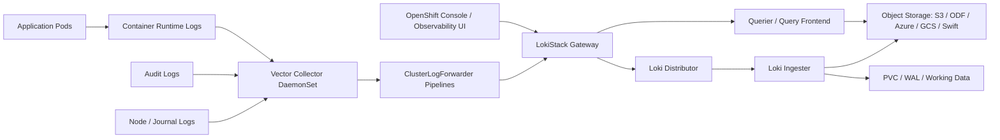

# LokiStack in OpenShift Logging — Advanced Administration Guide

**Audience:** Advanced OpenShift / Kubernetes administrators with production experience  
**Focus:** OpenShift Logging 6.x, Loki Operator, LokiStack CR, ClusterLogForwarder, object storage, tenancy, RBAC, HA, scaling, retention, security, monitoring, and troubleshooting  
**Date:** 2026-07-03

---

## Table of Contents

1. [Executive Summary](#1-executive-summary)
2. [What LokiStack Is in OpenShift Logging](#2-what-lokistack-is-in-openshift-logging)
3. [Why OpenShift Uses LokiStack Instead of Elasticsearch for Managed Log Storage](#3-why-openshift-uses-lokistack-instead-of-elasticsearch-for-managed-log-storage)
4. [Core Architecture](#4-core-architecture)
5. [Main Operators and APIs](#5-main-operators-and-apis)
6. [Log Flow: From Pod to LokiStack](#6-log-flow-from-pod-to-lokistack)
7. [LokiStack Components Deep Dive](#7-lokistack-components-deep-dive)
8. [LokiStack Custom Resource Deep Dive](#8-lokistack-custom-resource-deep-dive)
9. [Object Storage Design](#9-object-storage-design)
10. [Sizing and Capacity Planning](#10-sizing-and-capacity-planning)
11. [Tenancy and Access Control](#11-tenancy-and-access-control)
12. [ClusterLogForwarder Integration](#12-clusterlogforwarder-integration)
13. [Retention Strategy](#13-retention-strategy)
14. [High Availability, Zone Awareness, and Failure Domains](#14-high-availability-zone-awareness-and-failure-domains)
15. [Security Hardening](#15-security-hardening)
16. [Deployment Runbook](#16-deployment-runbook)
17. [Production Validation Checklist](#17-production-validation-checklist)
18. [Day-2 Operations](#18-day-2-operations)
19. [Monitoring, Metrics, and Alerting](#19-monitoring-metrics-and-alerting)
20. [Troubleshooting Runbooks](#20-troubleshooting-runbooks)
21. [Performance Tuning](#21-performance-tuning)
22. [Upgrade and Migration Notes](#22-upgrade-and-migration-notes)
23. [Common Production Patterns](#23-common-production-patterns)
24. [Anti-Patterns](#24-anti-patterns)
25. [Interview / Real-World Scenario Questions](#25-interview--real-world-scenario-questions)
26. [Command Cheat Sheet](#26-command-cheat-sheet)
27. [Example Manifests](#27-example-manifests)
28. [References](#28-references)

---

## 1. Executive Summary

`LokiStack` is the OpenShift-managed deployment of Grafana Loki used by **Red Hat OpenShift Logging** as an on-cluster log store. In modern OpenShift Logging 6.x, log storage is not managed by the old Elasticsearch-based `ClusterLogging` stack. Instead, log collection and forwarding are handled by the **Red Hat OpenShift Logging Operator**, while log storage is handled by the **Loki Operator** through the `LokiStack` custom resource.

In production, think of LokiStack as:

- A **short-term troubleshooting log store**, not a long-term SIEM or compliance archive.
- A **multi-tenant Loki backend** integrated with OpenShift authentication and authorization.
- A **Kubernetes-native, operator-managed logging backend** that uses object storage for log chunks and local PVC-backed storage for temporary/index/cache-related data.
- A **query backend for the OpenShift Observability UI**, enabling users to view logs according to RBAC.
- A platform component that must be planned like any other stateful service: object storage, PVC storage, CPU, memory, network, retention, failure domains, and operational monitoring all matter.

A senior administrator should not treat LokiStack as a simple “install operator and forget” feature. The real work is in correct object storage design, sizing, RBAC boundaries, log selection, retention, network security, and troubleshooting ingestion/query bottlenecks.

---

## 2. What LokiStack Is in OpenShift Logging

### 2.1 Definition

`LokiStack` is a custom resource from the API group:

```yaml
apiVersion: loki.grafana.com/v1
kind: LokiStack
```

It tells the **Loki Operator** how to deploy and manage a Loki-based log store inside OpenShift.

A LokiStack typically includes:

- Loki backend components such as distributor, ingester, querier, query frontend, compactor, index gateway, ruler, and gateway.
- OpenShift-integrated authentication and authorization through a Loki gateway/proxy layer.
- Object storage integration such as AWS S3, S3-compatible storage, OpenShift Data Foundation, Azure, Google Cloud Storage, or Swift.
- Kubernetes persistent storage for component working data.
- Retention and ingestion limits.
- Scheduling configuration, tolerations, anti-affinity, zone awareness, and network policies.

### 2.2 LokiStack Is Not the Collector

A common mistake is to confuse **LokiStack** with the **log collector**.

They are different responsibilities:

| Layer | Main Component | Responsibility |
|---|---|---|
| Collection | Vector collector managed by OpenShift Logging Operator | Reads container, infrastructure, and audit logs from nodes |
| Forwarding | `ClusterLogForwarder` | Selects inputs, applies filters, sends logs to outputs |
| Storage | `LokiStack` managed by Loki Operator | Stores and serves logs |
| Visualization | OpenShift Observability UI plugin / console integration | Lets users query logs with RBAC-aware access |

If logs are missing, do not immediately blame LokiStack. First determine whether the issue is:

1. Log source not generated.
2. Collector not reading logs.
3. ClusterLogForwarder not selecting logs.
4. RBAC missing for collection or viewing.
5. LokiStack ingestion issue.
6. Object storage issue.
7. Query/RBAC/UI issue.

---

## 3. Why OpenShift Uses LokiStack Instead of Elasticsearch for Managed Log Storage

Older OpenShift logging deployments commonly used Elasticsearch as the managed in-cluster log store. In OpenShift Logging 6.x, the supported managed log storage approach is LokiStack.

### 3.1 Operational Advantages

Loki’s model is different from Elasticsearch:

- Elasticsearch indexes large amounts of log content and metadata.
- Loki indexes labels and stores log content in chunks.
- Loki is generally more storage-efficient when label cardinality is controlled.
- Loki works well for “search recent logs by namespace/pod/container/labels/time window” workflows.
- Loki uses object storage as a durable backend, which reduces the need for large stateful search clusters.

### 3.2 OpenShift Fit

LokiStack fits OpenShift because logs are naturally tied to Kubernetes metadata:

- Namespace
- Pod
- Container
- Node
- Workload labels
- Log type: `application`, `infrastructure`, `audit`

The OpenShift Logging integration adds an authentication-aware gateway, which is critical because different users should not see all cluster logs by default.

### 3.3 Important Limitation

LokiStack in OpenShift is best used as a **short-term operational troubleshooting store**. For long-term analytics, compliance, SIEM, or multi-month search, forward logs to an external platform such as Splunk, Elasticsearch/OpenSearch, Kafka-backed pipelines, cloud logging, or a dedicated SIEM.

---

## 4. Core Architecture

High-level architecture:



### 4.1 Important Namespaces

Common namespaces:

| Namespace | Purpose |
|---|---|
| `openshift-logging` | Logging Operator resources, collectors, ClusterLogForwarder, often LokiStack instance |
| `openshift-operators-redhat` | Recommended namespace for Red Hat operators such as Loki Operator in some install paths |
| `openshift-marketplace` | Operator catalog sources |
| `openshift-storage` | OpenShift Data Foundation / NooBaa / Ceph components if used |
| `openshift-monitoring` | Platform monitoring stack that can scrape operator/component metrics |

### 4.2 Key Custom Resources

| CR | API Group | Purpose |
|---|---|---|
| `LokiStack` | `loki.grafana.com/v1` | Deploys and configures Loki log store |
| `ClusterLogForwarder` | `observability.openshift.io/v1` | Defines log collection/forwarding pipelines |
| `LogFileMetricExporter` | Logging/observability API depending on version | Exposes log file metrics |
| `UIPlugin` / observability UI CRs | Cluster Observability Operator APIs | Enables console visualization |

---

## 5. Main Operators and APIs

### 5.1 Loki Operator

The Loki Operator owns the LokiStack lifecycle.

It manages:

- Loki component deployments/statefulsets.
- Services and routes/internal endpoints.
- Gateway integration.
- PVCs and storage-related configuration.
- Network policies if enabled.
- Pod disruption budgets.
- LokiStack status conditions.
- Component placement, tolerations, anti-affinity, and replication.

### 5.2 Red Hat OpenShift Logging Operator

The OpenShift Logging Operator handles log collection and forwarding.

It manages:

- Vector collector DaemonSet.
- ClusterLogForwarder reconciliation.
- Inputs, outputs, filters, and pipelines.
- Collection RBAC requirements.
- Collector service accounts.

### 5.3 Cluster Observability Operator

The Cluster Observability Operator provides visualization integration for logs and observability features in the OpenShift console.

For a complete user experience, you normally need:

1. Loki Operator.
2. Red Hat OpenShift Logging Operator.
3. Cluster Observability Operator / logging UI integration.
4. A LokiStack instance.
5. A ClusterLogForwarder that sends logs to LokiStack.
6. RBAC allowing users to collect and view appropriate log types.

---

## 6. Log Flow From Pod to LokiStack

### 6.1 Application Logs

Application logs are normally written to `stdout` and `stderr` by containers. The container runtime writes those logs on the node. The Vector collector runs as a DaemonSet and tails the relevant files.

Typical metadata attached:

- `kubernetes_namespace_name`
- `kubernetes_pod_name`
- `kubernetes_container_name`
- `kubernetes_host`
- `log_type="application"`

### 6.2 Infrastructure Logs

Infrastructure logs include logs from OpenShift and Kubernetes system namespaces and node/journal sources.

Examples:

- `openshift-*` namespace workloads
- `kube-*` namespace workloads
- `default` namespace infrastructure logs
- Node journal logs

### 6.3 Audit Logs

Audit logs are sensitive and require explicit collection permission. They include:

- Kubernetes API audit logs
- OpenShift API audit logs
- OVN audit logs
- Node auditd logs

Audit logs should be treated as security/compliance data. Do not casually expose them to broad user groups.

### 6.4 Pipeline Flow

A simplified `ClusterLogForwarder` pipeline:

```yaml
inputs:
  - name: app-logs
    type: application
outputs:
  - name: default-lokistack
    type: lokiStack
    lokiStack:
      target:
        name: logging-loki
        namespace: openshift-logging
pipelines:
  - name: apps-to-loki
    inputRefs:
      - app-logs
    outputRefs:
      - default-lokistack
serviceAccount:
  name: logcollector
```

Conceptually:

```text
Input selection -> Optional filters -> Output -> LokiStack gateway -> Loki backend -> Object storage
```

---

## 7. LokiStack Components Deep Dive

Exact pod names may vary by OpenShift Logging / Loki Operator version and selected size, but the following components are important.

### 7.1 Gateway

The gateway is the OpenShift-facing entry point. It provides:

- Authentication integration with OpenShift.
- Authorization enforcement for tenants.
- Routing of push/query requests to backend Loki services.
- Multi-tenancy enforcement.

In OpenShift, users should normally access Loki through the gateway, not by directly exposing raw Loki services.

### 7.2 Distributor

The distributor receives log push requests from collectors.

Responsibilities:

- Validates incoming streams.
- Applies limits.
- Splits/forwards log streams to ingesters.
- Participates in tenant-aware ingestion.

If collectors show `429 Too Many Requests`, check distributor/ingestion limits, stream cardinality, and burst size.

### 7.3 Ingester

The ingester stores incoming log entries in memory and writes chunks to object storage.

Responsibilities:

- Receives streams from distributors.
- Maintains in-memory chunks.
- Writes chunks to object storage.
- Uses WAL/working storage depending on configuration.
- Participates in replication.

Failure impact depends heavily on replication factor and whether recent chunks have been flushed.

### 7.4 Querier

The querier executes LogQL queries by reading indexes/chunks from backend storage and/or ingesters.

Responsibilities:

- Query recent and historical chunks.
- Merge results.
- Enforce query limits.

Slow queries often involve too wide a time range, high label cardinality, too many streams, or insufficient querier resources.

### 7.5 Query Frontend

The query frontend improves query performance and fairness.

Responsibilities:

- Splits large queries.
- Queues requests.
- Provides caching behavior depending on configuration.
- Helps protect queriers from bursty users.

### 7.6 Compactor

The compactor handles index compaction and retention-related deletion workflows.

Responsibilities:

- Compacts index data.
- Supports retention deletion logic when configured.
- Interacts with object storage.

If retention is configured in LokiStack and old logs are not disappearing, inspect compactor health and object storage permissions.

### 7.7 Index Gateway

The index gateway serves index data to queriers. It helps reduce direct object storage pressure and improves query behavior.

### 7.8 Ruler

The ruler evaluates log-based alerting/recording rules.

Use the ruler when you want alerting based on log patterns, but remember it adds CPU, memory, and operational cost.

---

## 8. LokiStack Custom Resource Deep Dive

A minimal production-style `LokiStack` looks like this:

```yaml
apiVersion: loki.grafana.com/v1
kind: LokiStack
metadata:
  name: logging-loki
  namespace: openshift-logging
spec:
  size: 1x.small
  storage:
    schemas:
      - version: v13
        effectiveDate: "2026-07-03"
    secret:
      name: logging-loki-s3
      type: s3
  storageClassName: gp3-csi
  tenants:
    mode: openshift-logging
```

### 8.1 `metadata.name`

Recommended name is commonly:

```yaml
name: logging-loki
```

Using common naming reduces confusion because examples, UI integration, and operational scripts often assume this name.

### 8.2 `metadata.namespace`

Most OpenShift Logging examples use:

```yaml
namespace: openshift-logging
```

This keeps LokiStack close to collectors and logging configuration. If you use another namespace, ensure your ClusterLogForwarder target and RBAC reference the correct namespace.

### 8.3 `spec.size`

Supported production sizes in current OpenShift Logging 6.x documentation include:

- `1x.extra-small`
- `1x.small`
- `1x.medium`

Older/demo options might exist, but production should use supported production sizes.

Important points:

- `1x` is not a scale-out multiplier you freely change.
- Size affects component resources and expected ingestion/query capacity.
- Size does not remove the need for object storage capacity planning.

### 8.4 `spec.storage.schemas`

Example:

```yaml
schemas:
  - version: v13
    effectiveDate: "2026-07-03"
```

The schema controls how Loki organizes index/storage data. Use the recommended schema for your Logging version. For modern OpenShift Logging versions, schema `v13` is commonly recommended for future compatibility.

Rules:

- Do not randomly change schema on an existing production stack.
- The `effectiveDate` matters.
- Schema migration should be planned and tested.
- Review release notes before changing schema.

### 8.5 `spec.storage.secret`

Example:

```yaml
secret:
  name: logging-loki-s3
  type: s3
```

The secret contains object storage connection details.

Common `type` values:

| Provider | `type` |
|---|---|
| AWS S3 | `s3` |
| S3-compatible storage | `s3` |
| OpenShift Data Foundation / NooBaa / RGW style S3 | `s3` |
| Azure | `azure` |
| Google Cloud Storage | `gcs` |
| Swift | `swift` |

### 8.6 `spec.storageClassName`

This is Kubernetes block/PVC storage used by Loki components for temporary or working data.

Best practices:

- Use a reliable block storage class.
- Avoid slow NFS-style storage for hot/working data unless explicitly supported and tested.
- Ensure the storage class supports your failure-domain design.
- Check reclaim policy and expansion support.
- Validate PVC binding before sending production logs.

### 8.7 `spec.tenants.mode`

For OpenShift Logging, use:

```yaml
tenants:
  mode: openshift-logging
```

This enables OpenShift-specific tenancy for application, infrastructure, and audit logs and integrates with OpenShift RBAC.

### 8.8 `spec.managementState`

When present:

```yaml
managementState: Managed
```

`Managed` means the operator actively reconciles the stack. If set to unmanaged or paused depending on API/version behavior, the operator may stop applying changes. Use non-managed modes only for controlled troubleshooting windows.

### 8.9 `spec.limits`

Limits protect Loki from overload.

Common categories:

- Ingestion rate
- Ingestion burst size
- Query limits
- Retention
- Per-tenant overrides

Example ingestion limit tuning:

```yaml
spec:
  limits:
    global:
      ingestion:
        ingestionBurstSize: 16
        ingestionRate: 8
```

Interpretation:

- `ingestionBurstSize` is a hard local burst limit per distributor replica in MB.
- `ingestionRate` is a soft maximum ingestion rate in MB/sec.

Do not increase limits blindly. First check whether the source is a real workload requirement or uncontrolled noisy logging.

### 8.10 `spec.template`

`spec.template` lets you configure component-level scheduling and resources.

Example concept:

```yaml
spec:
  template:
    ingester:
      nodeSelector:
        node-role.kubernetes.io/infra: ""
      tolerations:
        - key: node-role.kubernetes.io/infra
          value: reserved
          effect: NoSchedule
```

Use this when you run infrastructure workloads on infra nodes.

### 8.11 `spec.replication` and `replicationFactor`

Newer configurations use `spec.replication.factor`. Older `replicationFactor` fields can be deprecated/overwritten depending on version.

For production:

- Use replication factor greater than 1 when high availability matters.
- Ensure enough zones/nodes exist to satisfy replication.
- Do not set replication higher than your infrastructure can support.

---

## 9. Object Storage Design

### 9.1 Why Object Storage Is Mandatory

Loki stores log chunks and index-related data in object storage. Without a healthy object store, LokiStack is not a reliable log store.

Object storage must be:

- Available from Loki pods.
- Durable enough for the retention requirement.
- Sized for expected daily log volume and retention.
- Secured with least-privilege credentials.
- Configured with lifecycle policies where possible.

### 9.2 Supported Backends

OpenShift Logging documentation lists support for:

- AWS S3
- S3-compatible storage
- OpenShift Data Foundation / NooBaa / Ceph object gateway style backends
- Azure
- Google Cloud Storage
- Swift

### 9.3 S3-Compatible Secret Example

```bash
oc create secret generic logging-loki-s3 \
  -n openshift-logging \
  --from-literal=bucketnames="loki-logs" \
  --from-literal=endpoint="https://s3.example.com" \
  --from-literal=access_key_id="<access_key>" \
  --from-literal=access_key_secret="<secret_key>" \
  --from-literal=forcepathstyle="true"
```

For many S3-compatible providers, `forcepathstyle="true"` is required. AWS S3 virtual-hosted style behavior can differ.

### 9.4 AWS S3 Secret Example

```bash
oc create secret generic logging-loki-aws \
  -n openshift-logging \
  --from-literal=bucketnames="<bucket_name>" \
  --from-literal=endpoint="<aws_s3_endpoint>" \
  --from-literal=access_key_id="<access_key>" \
  --from-literal=access_key_secret="<secret_key>" \
  --from-literal=region="<region>" \
  --from-literal=forcepathstyle="false"
```

### 9.5 OpenShift Data Foundation Pattern

With ODF, you may use:

- NooBaa ObjectBucketClaim
- Ceph RGW/S3 endpoint
- Secret/ConfigMap generated by OBC
- A block storage class for LokiStack PVCs

Important distinction:

- Object bucket stores Loki chunks/index data.
- `storageClassName` in LokiStack is for local PVC-backed working data.

### 9.6 Object Storage Permissions

Minimum permissions usually include ability to:

- Put objects
- Get objects
- List bucket/prefix
- Delete objects if Loki retention deletion is used

If you rely only on object-store lifecycle policies for deletion, Loki may need fewer delete operations, but still confirm provider-specific requirements.

### 9.7 Retention and Lifecycle

Best practice:

1. Use object storage lifecycle management for cost-effective deletion.
2. Use LokiStack retention rules when lifecycle policies are unavailable or when stream-specific retention is needed.
3. Never leave buckets without a retention/lifecycle plan.

Without retention or lifecycle policy, logs can remain in the bucket forever and eventually consume storage/cost.

---

## 10. Sizing and Capacity Planning

### 10.1 Sizing Philosophy

Do not size LokiStack only by node count. Size by:

- GB/day of logs.
- Query concurrency and query range.
- Number of namespaces/pods/containers.
- Label cardinality.
- Retention duration.
- Audit log volume.
- Burst behavior during incidents.
- Object storage latency.
- Number of users querying logs.

### 10.2 Common Size Classes

OpenShift Logging 6.x docs describe sizing in the form `1x.<size>`. Production sizes include:

| Size | Typical Use |
|---|---|
| `1x.extra-small` | Smaller production environments, lower log volume |
| `1x.small` | Common starting point for moderate clusters |
| `1x.medium` | Larger clusters, higher ingestion/query requirements |

The exact CPU/memory/disk requests vary by version. Always check the version-specific sizing table before production deployment.

### 10.3 Storage Capacity Formula

Rough planning formula:

```text
Object storage needed = daily_log_volume_after_filtering × retention_days × overhead_factor
```

Use an overhead factor such as `1.2` to `1.5` depending on compression, index overhead, replication/object-store behavior, and operational safety.

Example:

```text
300 GB/day × 14 days × 1.3 = 5,460 GB ≈ 5.5 TB
```

### 10.4 Reduce Before You Scale

Before increasing LokiStack size, reduce unnecessary logs:

- Drop noisy debug logs.
- Avoid collecting all audit logs unless required.
- Filter high-volume namespaces.
- Route security/compliance logs externally if long-term retention is needed.
- Reduce application log verbosity.
- Avoid high-cardinality labels.

### 10.5 Query Capacity

Queries become expensive when users search:

- Very broad time ranges.
- All namespaces.
- Regex-heavy patterns.
- High-cardinality label sets.
- Unbounded text searches.

Educate users to start with narrow selectors:

```logql
{kubernetes_namespace_name="payments", kubernetes_pod_name=~"api-.*"} |= "error"
```

Instead of:

```logql
{log_type="application"} |= "error"
```

---

## 11. Tenancy and Access Control

### 11.1 Tenant Types

OpenShift Logging uses logical tenants commonly aligned with:

- `application`
- `infrastructure`
- `audit`

These tenants separate different classes of logs and allow RBAC boundaries.

### 11.2 Viewing Logs Is Not Automatic for Everyone

Users do not automatically get broad access to all logs. Administrators must grant access using appropriate cluster roles and role bindings.

Important cluster roles include:

| Role | Purpose |
|---|---|
| `cluster-logging-application-view` | Read application logs |
| `cluster-logging-infrastructure-view` | Read infrastructure logs |
| `cluster-logging-audit-view` | Read audit logs |

### 11.3 Namespace-Scoped Application Log Access

Example: allow user `alice` to read application logs in namespace `payments`:

```yaml
apiVersion: rbac.authorization.k8s.io/v1
kind: RoleBinding
metadata:
  name: allow-read-application-logs
  namespace: payments
roleRef:
  apiGroup: rbac.authorization.k8s.io
  kind: ClusterRole
  name: cluster-logging-application-view
subjects:
  - kind: User
    apiGroup: rbac.authorization.k8s.io
    name: alice
```

### 11.4 Cluster-Wide Application Log Access

Example: allow a platform SRE group to read application logs cluster-wide:

```yaml
apiVersion: rbac.authorization.k8s.io/v1
kind: ClusterRoleBinding
metadata:
  name: sre-application-logs-reader
roleRef:
  apiGroup: rbac.authorization.k8s.io
  kind: ClusterRole
  name: cluster-logging-application-view
subjects:
  - kind: Group
    apiGroup: rbac.authorization.k8s.io
    name: sre-team
```

### 11.5 Audit Log Access

Audit log access should be restricted to security/platform administrators.

Example:

```bash
oc adm policy add-cluster-role-to-group cluster-logging-audit-view security-auditors
```

Do not bind audit log view permissions to `system:authenticated`.

### 11.6 Collector Permissions

Collection permissions are separate from view permissions.

For collectors, bind roles such as:

```bash
oc adm policy add-cluster-role-to-user collect-application-logs \
  system:serviceaccount:openshift-logging:logcollector

oc adm policy add-cluster-role-to-user collect-infrastructure-logs \
  system:serviceaccount:openshift-logging:logcollector

oc adm policy add-cluster-role-to-user collect-audit-logs \
  system:serviceaccount:openshift-logging:logcollector
```

Only bind `collect-audit-logs` when audit log collection is required.

---

## 12. ClusterLogForwarder Integration

### 12.1 Why ClusterLogForwarder Matters

LokiStack does not collect logs by itself. `ClusterLogForwarder` decides:

- Which logs are collected.
- Which filters are applied.
- Which outputs receive logs.
- Which service account is used.

### 12.2 Basic LokiStack Output

Example:

```yaml
apiVersion: observability.openshift.io/v1
kind: ClusterLogForwarder
metadata:
  name: instance
  namespace: openshift-logging
spec:
  serviceAccount:
    name: logcollector
  outputs:
    - name: default-lokistack
      type: lokiStack
      lokiStack:
        target:
          name: logging-loki
          namespace: openshift-logging
  pipelines:
    - name: application-to-loki
      inputRefs:
        - application
      outputRefs:
        - default-lokistack
```

### 12.3 Forward Application, Infrastructure, and Audit Logs

```yaml
apiVersion: observability.openshift.io/v1
kind: ClusterLogForwarder
metadata:
  name: instance
  namespace: openshift-logging
spec:
  serviceAccount:
    name: logcollector
  outputs:
    - name: default-lokistack
      type: lokiStack
      lokiStack:
        target:
          name: logging-loki
          namespace: openshift-logging
  pipelines:
    - name: apps
      inputRefs:
        - application
      outputRefs:
        - default-lokistack
    - name: infra
      inputRefs:
        - infrastructure
      outputRefs:
        - default-lokistack
    - name: audit
      inputRefs:
        - audit
      outputRefs:
        - default-lokistack
```

Before applying this, ensure the collector service account has all required collection roles.

### 12.4 Selective Application Logging

Collect logs from specific namespaces:

```yaml
apiVersion: observability.openshift.io/v1
kind: ClusterLogForwarder
metadata:
  name: instance
  namespace: openshift-logging
spec:
  serviceAccount:
    name: logcollector
  inputs:
    - name: selected-apps
      type: application
      application:
        namespaces:
          - payments
          - orders
          - inventory
  outputs:
    - name: default-lokistack
      type: lokiStack
      lokiStack:
        target:
          name: logging-loki
          namespace: openshift-logging
  pipelines:
    - name: selected-apps-to-loki
      inputRefs:
        - selected-apps
      outputRefs:
        - default-lokistack
```

### 12.5 Delivery Mode Tuning

For `lokiStack` outputs, tuning may include delivery behavior.

Concept:

```yaml
outputs:
  - name: default-lokistack
    type: lokiStack
    lokiStack:
      target:
        name: logging-loki
        namespace: openshift-logging
      tuning:
        deliveryMode: AtLeastOnce
```

`AtLeastOnce` favors durability and may duplicate logs after restart.  
`AtMostOnce` favors throughput and may lose logs during crashes.

For production operational logs, `AtLeastOnce` is usually safer. For extremely high-volume low-value logs, `AtMostOnce` might be acceptable after business approval.

---

## 13. Retention Strategy

### 13.1 LokiStack Is Short-Term

OpenShift-managed LokiStack is intended for recent troubleshooting, not indefinite storage.

Treat retention as a hard design requirement.

### 13.2 Retention Layers

You can control retention in two main ways:

1. Object storage lifecycle policy.
2. LokiStack stream-based retention.

Best practice is often:

- Use object storage lifecycle policy for broad deletion.
- Use LokiStack retention for tenant/stream-specific rules.

### 13.3 Global Retention Example

```yaml
apiVersion: loki.grafana.com/v1
kind: LokiStack
metadata:
  name: logging-loki
  namespace: openshift-logging
spec:
  limits:
    global:
      retention:
        days: 14
  size: 1x.small
  storage:
    schemas:
      - version: v13
        effectiveDate: "2026-07-03"
    secret:
      name: logging-loki-s3
      type: s3
  storageClassName: gp3-csi
  tenants:
    mode: openshift-logging
```

### 13.4 Per-Tenant Retention Example

```yaml
spec:
  limits:
    global:
      retention:
        days: 14
    tenants:
      application:
        retention:
          days: 7
      infrastructure:
        retention:
          days: 14
      audit:
        retention:
          days: 30
```

Use caution with audit retention. If compliance requires more than short-term retention, forward audit logs externally.

### 13.5 Stream-Based Retention Example

```yaml
spec:
  limits:
    tenants:
      application:
        retention:
          days: 7
          streams:
            - selector: '{kubernetes_namespace_name=~"dev-.*"}'
              days: 2
            - selector: '{kubernetes_namespace_name="payments"}'
              days: 14
```

This means:

- Default application retention: 7 days.
- Dev namespaces: 2 days.
- Payments namespace: 14 days.

### 13.6 Retention Troubleshooting

If old logs are not deleted:

1. Check object storage lifecycle configuration.
2. Check LokiStack `limits` retention block.
3. Check compactor pod status.
4. Check object storage delete permission.
5. Check whether query time range still includes old data due to cache/index behavior.
6. Confirm the selector actually matches stream labels.

---

## 14. High Availability, Zone Awareness, and Failure Domains

### 14.1 HA Is Not Only Replica Count

For LokiStack, HA depends on:

- Replication factor.
- Pod distribution.
- Node availability.
- Zone awareness.
- PVC behavior.
- Object storage availability.
- PodDisruptionBudgets.
- Adequate CPU/memory during cluster upgrades.

### 14.2 PodDisruptionBudgets

The Loki Operator creates PodDisruptionBudget resources to preserve component availability during voluntary disruptions, such as upgrades and node drains.

Validate:

```bash
oc get pdb -n openshift-logging
```

### 14.3 Anti-Affinity

The operator sets preferred anti-affinity for Loki components. For stronger isolation, configure required anti-affinity carefully.

Example concept for ingesters:

```yaml
spec:
  template:
    ingester:
      podAntiAffinity:
        requiredDuringSchedulingIgnoredDuringExecution:
          - labelSelector:
              matchLabels:
                app.kubernetes.io/component: ingester
            topologyKey: kubernetes.io/hostname
```

Warning: required anti-affinity can make pods unschedulable if there are not enough nodes.

### 14.4 Zone-Aware Replication

Example:

```yaml
spec:
  replication:
    factor: 2
    zones:
      - topologyKey: topology.kubernetes.io/zone
        maxSkew: 1
```

Requirements:

- Nodes must have correct zone labels.
- Storage classes must support zone-aware provisioning.
- There must be at least as many usable zones as the replication factor requires.
- Object storage should not be a single hidden failure domain.

### 14.5 Zone Failure Recovery

If a zone fails:

1. Check pending Loki pods.
2. Identify PVCs bound to the failed zone.
3. Confirm replication factor is greater than 1 before deleting PVCs.
4. Delete failed-zone PVCs only when data loss impact is understood.
5. Delete pending pods so StatefulSets can recreate them.

Commands:

```bash
oc get pods -n openshift-logging -o wide
oc get pvc -n openshift-logging
oc describe pod <pod> -n openshift-logging
oc delete pvc <pvc> -n openshift-logging
oc delete pod <pod> -n openshift-logging
```

If PVC is stuck terminating:

```bash
oc patch pvc <pvc_name> \
  -n openshift-logging \
  -p '{"metadata":{"finalizers":null}}'
```

Use finalizer removal carefully; it is a last-resort administrative action.

---

## 15. Security Hardening

### 15.1 Use OpenShift Tenancy Mode

Use:

```yaml
tenants:
  mode: openshift-logging
```

This integrates LokiStack with OpenShift auth and tenant-aware access.

### 15.2 Avoid Exposing Raw Loki

Do not expose raw Loki services directly to users. Use the gateway/proxy path that enforces authentication and tenancy.

### 15.3 Protect Object Storage Credentials

Object storage secrets are sensitive.

Best practices:

- Store them only in required namespace.
- Use least-privilege bucket credentials.
- Rotate credentials periodically.
- Avoid reusing admin keys.
- Prefer short-lived credential modes where supported.
- Monitor failed authentication against object storage.

### 15.4 Restrict Audit Logs

Audit logs can contain security-sensitive information such as API activity and user actions.

Best practices:

- Separate audit retention policy.
- Restrict `cluster-logging-audit-view`.
- Forward to SIEM if required.
- Avoid broad UI visibility.
- Document access approvals.

### 15.5 Network Policies

Loki Operator can create network policies to restrict Loki communications.

Example concept:

```yaml
apiVersion: loki.grafana.com/v1
kind: LokiStack
metadata:
  name: logging-loki
  namespace: openshift-logging
spec:
  size: 1x.small
  storage:
    schemas:
      - version: v13
        effectiveDate: "2026-07-03"
    secret:
      name: logging-loki-s3
      type: s3
  storageClassName: gp3-csi
  tenants:
    mode: openshift-logging
  networkPolicies:
    ruleSet: RestrictIngressEgress
```

Before enabling strict network policies:

- Confirm collector-to-gateway traffic works.
- Confirm Loki-to-object-storage egress works.
- Confirm monitoring scrape traffic works.
- Confirm DNS egress works.
- Confirm console/UI query path works.

### 15.6 TLS and CA Bundles

For private S3-compatible endpoints, validate:

- CA bundle trusted by Loki pods.
- Endpoint certificate CN/SAN matches endpoint hostname.
- No transparent proxy breaks TLS.
- Cluster-wide proxy/no-proxy settings are correct.

---

## 16. Deployment Runbook

### 16.1 Pre-Checks

```bash
oc whoami
oc whoami --show-server
oc get clusterversion
oc get nodes
oc get co
oc get storageclass
oc get ns openshift-logging
```

Check object storage:

```bash
# From an admin workstation or debug pod, validate endpoint DNS/TLS/reachability.
curl -vk https://s3.example.com
```

### 16.2 Install Operators

Required operators:

1. Loki Operator.
2. Red Hat OpenShift Logging Operator.
3. Cluster Observability Operator for UI integration.

General installation can be done through OperatorHub or CLI `Subscription` resources. Ensure Loki Operator and OpenShift Logging Operator versions are compatible.

### 16.3 Create Namespace

```bash
oc create ns openshift-logging --dry-run=client -o yaml | oc apply -f -
```

### 16.4 Create Object Storage Secret

Example S3-compatible:

```bash
oc create secret generic logging-loki-s3 \
  -n openshift-logging \
  --from-literal=bucketnames="loki-logs" \
  --from-literal=endpoint="https://s3.example.com" \
  --from-literal=access_key_id="<access_key>" \
  --from-literal=access_key_secret="<secret_key>" \
  --from-literal=forcepathstyle="true"
```

Validate:

```bash
oc get secret logging-loki-s3 -n openshift-logging
```

### 16.5 Create LokiStack

```yaml
apiVersion: loki.grafana.com/v1
kind: LokiStack
metadata:
  name: logging-loki
  namespace: openshift-logging
spec:
  size: 1x.small
  storage:
    schemas:
      - version: v13
        effectiveDate: "2026-07-03"
    secret:
      name: logging-loki-s3
      type: s3
  storageClassName: gp3-csi
  tenants:
    mode: openshift-logging
```

Apply:

```bash
oc apply -f lokistack.yaml
```

### 16.6 Verify LokiStack

```bash
oc get lokistack -n openshift-logging
oc describe lokistack logging-loki -n openshift-logging
oc get pods -n openshift-logging
oc get pvc -n openshift-logging
oc get svc -n openshift-logging
oc get events -n openshift-logging --sort-by=.lastTimestamp
```

Wait until Loki components are ready.

### 16.7 Create Collector ServiceAccount and RBAC

```bash
oc create sa logcollector -n openshift-logging

oc adm policy add-cluster-role-to-user collect-application-logs \
  system:serviceaccount:openshift-logging:logcollector

oc adm policy add-cluster-role-to-user collect-infrastructure-logs \
  system:serviceaccount:openshift-logging:logcollector
```

Only if collecting audit logs:

```bash
oc adm policy add-cluster-role-to-user collect-audit-logs \
  system:serviceaccount:openshift-logging:logcollector
```

### 16.8 Create ClusterLogForwarder

```yaml
apiVersion: observability.openshift.io/v1
kind: ClusterLogForwarder
metadata:
  name: instance
  namespace: openshift-logging
spec:
  serviceAccount:
    name: logcollector
  outputs:
    - name: default-lokistack
      type: lokiStack
      lokiStack:
        target:
          name: logging-loki
          namespace: openshift-logging
  pipelines:
    - name: application-to-loki
      inputRefs:
        - application
      outputRefs:
        - default-lokistack
    - name: infrastructure-to-loki
      inputRefs:
        - infrastructure
      outputRefs:
        - default-lokistack
```

Apply:

```bash
oc apply -f clf.yaml
```

### 16.9 Verify Collector

```bash
oc get pods -n openshift-logging -l component=collector
oc logs -n openshift-logging -l component=collector --tail=100
oc describe clusterlogforwarder instance -n openshift-logging
```

### 16.10 Verify End-to-End

Create a test workload:

```bash
oc new-project log-test
oc create deployment logtest --image=registry.access.redhat.com/ubi9/ubi -- sleep infinity
oc logs deploy/logtest -n log-test
```

Generate logs:

```bash
oc exec deploy/logtest -n log-test -- bash -c 'for i in {1..20}; do echo "loki-test-$i"; sleep 1; done'
```

Check in UI or with allowed query path.

---

## 17. Production Validation Checklist

Before declaring LokiStack production-ready:

### 17.1 Operators

- [ ] Loki Operator installed and healthy.
- [ ] OpenShift Logging Operator installed and healthy.
- [ ] Cluster Observability Operator/UI plugin installed if UI is required.
- [ ] Operator versions are compatible.

### 17.2 LokiStack

- [ ] `LokiStack` status is ready.
- [ ] All Loki pods are running.
- [ ] PVCs are bound.
- [ ] Services exist.
- [ ] No crash loops.
- [ ] No repeated reconciliation errors.

### 17.3 Object Storage

- [ ] Bucket exists.
- [ ] Credentials work.
- [ ] Endpoint reachable from Loki pods.
- [ ] TLS trust works.
- [ ] Lifecycle policy is configured.
- [ ] Delete permission matches retention design.
- [ ] Capacity alerting exists.

### 17.4 Collection

- [ ] Collector pods running on all schedulable nodes.
- [ ] ClusterLogForwarder is valid.
- [ ] Collector service account has required roles.
- [ ] Application logs are ingested.
- [ ] Infrastructure logs are ingested if required.
- [ ] Audit logs are ingested only if approved.

### 17.5 Access

- [ ] Application teams can see only allowed namespaces.
- [ ] SREs can access expected logs.
- [ ] Audit logs restricted.
- [ ] No broad accidental bindings.

### 17.6 Security

- [ ] Object storage secret protected.
- [ ] Network policies tested if enabled.
- [ ] No raw Loki exposure.
- [ ] TLS endpoints verified.

### 17.7 Operations

- [ ] Dashboards/alerts configured.
- [ ] Runbooks documented.
- [ ] Backup/restore expectation documented.
- [ ] Upgrade procedure tested.
- [ ] Capacity review process defined.

---

## 18. Day-2 Operations

### 18.1 Health Checks

```bash
oc get lokistack -n openshift-logging
oc describe lokistack logging-loki -n openshift-logging
oc get pods -n openshift-logging -o wide
oc get pvc -n openshift-logging
oc get events -n openshift-logging --sort-by=.lastTimestamp | tail -50
```

### 18.2 Operator Logs

```bash
oc logs -n openshift-operators-redhat deploy/loki-operator-controller-manager --tail=200
oc logs -n openshift-logging deploy/cluster-logging-operator --tail=200
```

Deployment names may vary. Use:

```bash
oc get deploy -A | grep -Ei 'loki|logging|observability'
```

### 18.3 Collector Logs

```bash
oc logs -n openshift-logging -l component=collector --tail=200
```

Look for:

- Authentication errors.
- TLS errors.
- 429 rate limit errors.
- Failed sends to Loki.
- Permission denied reading log sources.
- Pipeline validation problems.

### 18.4 Restarting Components

Avoid random restarts. First inspect status and logs.

If required:

```bash
oc delete pod <pod> -n openshift-logging
```

Operator/StatefulSet/Deployment should recreate pods.

### 18.5 Scaling

Scale by changing LokiStack size, not by manually editing deployments/statefulsets.

```bash
oc patch lokistack logging-loki -n openshift-logging --type=merge \
  -p '{"spec":{"size":"1x.medium"}}'
```

Confirm version-specific supported sizes first.

### 18.6 Changing StorageClass

Changing `storageClassName` on an existing LokiStack can be disruptive because PVCs may already exist. Plan migration carefully.

Best practice:

- Do not change storage class casually.
- Test in non-production.
- Understand whether PVC recreation/data loss is involved.
- Review operator documentation for your version.

### 18.7 Rotating Object Storage Credentials

General approach:

1. Create new object storage credential with same bucket access.
2. Update Kubernetes secret.
3. Let operator/pods reload or restart as required.
4. Verify ingestion and query.
5. Disable old credential.

Command pattern:

```bash
oc create secret generic logging-loki-s3-new ...
# or update existing secret carefully
oc delete secret logging-loki-s3 -n openshift-logging
oc create secret generic logging-loki-s3 -n openshift-logging ...
```

For production, prefer controlled rollout and maintenance window.

---

## 19. Monitoring, Metrics, and Alerting

### 19.1 What to Monitor

Monitor four areas:

1. Collection health.
2. LokiStack component health.
3. Object storage health.
4. User query experience.

### 19.2 Collector Signals

Watch for:

- Collector pod restarts.
- Collector CPU throttling.
- Collector memory pressure.
- Send errors.
- Dropped events.
- Buffer growth.
- 429 responses from Loki.

### 19.3 LokiStack Signals

Watch for:

- Distributor request errors.
- Ingester flush failures.
- Object storage request failures.
- Query latency.
- Query errors.
- Compactor failures.
- Ruler evaluation failures.
- Pod restarts.
- PVC usage.

### 19.4 Object Storage Signals

Watch for:

- Bucket size growth.
- Object count growth.
- 4xx/5xx errors.
- Latency.
- Throttling.
- Lifecycle policy failures.
- Credential expiration.

### 19.5 Example Alert Ideas

| Alert | Meaning |
|---|---|
| LokiDistributorHighErrorRate | Ingestion path failing |
| LokiIngesterFlushFailures | Chunks not being persisted |
| LokiObjectStorageErrors | Backend object storage unavailable or permission issue |
| LokiQueryHighLatency | User queries are slow |
| LokiCompactorFailures | Retention/compaction problem |
| CollectorSendErrors | Collector cannot forward logs |
| CollectorPodNotReady | Node log collection gap |
| LokiPVCNearFull | Local working storage risk |

### 19.6 Must-Gather

For Red Hat support cases:

```bash
oc adm must-gather
```

You may also need operator-specific must-gather images depending on product version and support instructions.

Collect:

```bash
oc get lokistack logging-loki -n openshift-logging -o yaml
oc get clusterlogforwarder instance -n openshift-logging -o yaml
oc get pods,pvc,svc,pdb -n openshift-logging -o wide
oc get events -n openshift-logging --sort-by=.lastTimestamp
```

---

## 20. Troubleshooting Runbooks

## 20.1 LokiStack Not Ready

Symptoms:

```bash
oc get lokistack -n openshift-logging
# status not ready
```

Check:

```bash
oc describe lokistack logging-loki -n openshift-logging
oc get pods -n openshift-logging
oc get events -n openshift-logging --sort-by=.lastTimestamp
oc get pvc -n openshift-logging
```

Common causes:

- Object storage secret missing.
- Wrong secret keys.
- Unsupported storage type.
- StorageClass missing.
- PVC pending.
- Image pull issue.
- Insufficient CPU/memory.
- NetworkPolicy blocking required traffic.
- Operator version mismatch.

Fix approach:

1. Read LokiStack conditions.
2. Fix first failing dependency.
3. Avoid editing generated deployments directly.
4. Let operator reconcile.

---

## 20.2 PVC Pending

Symptoms:

```bash
oc get pvc -n openshift-logging
# Pending
```

Check:

```bash
oc describe pvc <pvc> -n openshift-logging
oc get storageclass
oc describe storageclass <storageclass>
oc get events -n openshift-logging --sort-by=.lastTimestamp
```

Common causes:

- Wrong `storageClassName`.
- Storage quota exhausted.
- Zone mismatch.
- No provisioner.
- WaitForFirstConsumer scheduling issue.
- Node affinity conflict.

Fix:

- Correct `storageClassName`.
- Ensure nodes exist in required zones.
- Check CSI operator health.
- Check storage backend capacity.

---

## 20.3 Collector Running but No Logs in Loki

Check CLF:

```bash
oc get clusterlogforwarder -n openshift-logging
oc describe clusterlogforwarder instance -n openshift-logging
oc get clusterlogforwarder instance -n openshift-logging -o yaml
```

Check collector:

```bash
oc get pods -n openshift-logging -l component=collector
oc logs -n openshift-logging -l component=collector --tail=200
```

Check RBAC:

```bash
oc auth can-i collect application/logs --as=system:serviceaccount:openshift-logging:logcollector
oc auth can-i collect infrastructure/logs --as=system:serviceaccount:openshift-logging:logcollector
oc auth can-i collect audit/logs --as=system:serviceaccount:openshift-logging:logcollector
```

If the exact `oc auth can-i` resource syntax differs by version, inspect cluster roles:

```bash
oc get clusterrole | grep collect-.*logs
oc describe clusterrole collect-application-logs
```

Common causes:

- `ClusterLogForwarder` does not include desired input.
- Service account missing collection role.
- Output target name/namespace wrong.
- Collector cannot reach Loki gateway.
- Loki gateway rejects request.
- Loki ingestion limit reached.

---

## 20.4 `429 Too Many Requests`

Symptoms in collector logs:

```text
429 Too Many Requests Ingestion rate limit exceeded
```

Check:

```bash
oc logs -n openshift-logging -l component=collector --tail=200 | grep -i 429
oc logs -n openshift-logging <loki-ingester-pod> --tail=200 | grep -i limit
```

Possible causes:

- Initial backfill after enabling logging.
- Sudden application log spike.
- Too many logs from noisy namespace.
- Ingestion burst too small.
- Ingestion rate too low.
- High-cardinality streams.

Options:

1. Wait if this is temporary backfill and average rate is acceptable.
2. Filter/drop noisy logs.
3. Increase LokiStack size.
4. Tune ingestion limits.

Example tuning:

```yaml
spec:
  limits:
    global:
      ingestion:
        ingestionBurstSize: 16
        ingestionRate: 8
```

Do not tune limits without also reviewing object storage and CPU/memory.

---

## 20.5 Queries Are Slow

Check:

- Query time range.
- Label selector quality.
- User query pattern.
- Querier/query-frontend CPU and memory.
- Object storage latency.
- Index gateway health.
- Query concurrency.

Poor query:

```logql
{log_type="application"} |= "error"
```

Better query:

```logql
{kubernetes_namespace_name="payments", kubernetes_container_name="api"} |= "error"
```

Fix options:

- Educate users to narrow queries.
- Increase stack size.
- Reduce label cardinality.
- Tune query limits if supported.
- Improve object storage latency.
- Add caching where supported.

---

## 20.6 User Cannot See Logs

Check user RBAC:

```bash
oc auth can-i get application/logs --as=<user> -n <namespace>
oc auth can-i get infrastructure/logs --as=<user>
oc auth can-i get audit/logs --as=<user>
```

Also check:

```bash
oc get rolebinding -n <namespace>
oc get clusterrolebinding | grep logging
oc describe clusterrole cluster-logging-application-view
```

Common causes:

- No RoleBinding/ClusterRoleBinding.
- User querying application logs without namespace context.
- User expects infrastructure/audit logs but only has application role.
- Wrong group membership.
- UI plugin issue.

Fix:

- Add namespaced RoleBinding for application logs.
- Add cluster-wide binding only for trusted groups.
- Restrict infrastructure and audit logs.

---

## 20.7 Object Storage Authentication Failure

Symptoms:

- Loki pods crashloop.
- Ingester/compactor logs show access denied.
- Object storage 403 errors.
- Query missing older chunks.

Check:

```bash
oc get secret logging-loki-s3 -n openshift-logging -o yaml
oc logs -n openshift-logging <loki-pod> --tail=200 | grep -Ei 's3|access|denied|forbidden|credentials'
```

Validate:

- Bucket name.
- Endpoint.
- Region.
- Force path style.
- Access key and secret.
- CA trust.
- Network/proxy.
- IAM/bucket policy.

---

## 20.8 Object Storage TLS Failure

Symptoms:

```text
x509: certificate signed by unknown authority
certificate is valid for X, not Y
```

Check:

- Endpoint hostname.
- Certificate SAN.
- CA bundle.
- Secret keys.
- Cluster proxy CA.

Fix:

- Use correct endpoint FQDN.
- Add trusted CA bundle as supported by your configuration.
- Regenerate certificate with correct SAN.

---

## 20.9 Retention Not Working

Check:

```bash
oc get lokistack logging-loki -n openshift-logging -o yaml | yq '.spec.limits'
oc get pods -n openshift-logging | grep compactor
oc logs -n openshift-logging <compactor-pod> --tail=200
```

Common causes:

- No retention configured.
- Object storage lifecycle absent.
- Compactor unhealthy.
- Delete permission missing.
- Wrong LogQL selector in stream retention.
- Expectation mismatch: lifecycle deletion may not be immediate.

---

## 20.10 NetworkPolicy Broke Loki

If strict network policies are enabled and logs stop flowing:

Check:

```bash
oc get networkpolicy -n openshift-logging
oc describe networkpolicy -n openshift-logging
oc logs -n openshift-logging -l component=collector --tail=100
```

Validate traffic:

- Collector to Loki gateway.
- Loki components to each other.
- Loki to object storage.
- Loki to DNS.
- Monitoring to metrics endpoints.
- Console/UI to gateway/query path.

Fix:

- Temporarily relax policy only if necessary.
- Add explicit egress to object storage endpoint and DNS.
- Confirm namespace/pod selectors.

---

## 21. Performance Tuning

### 21.1 First Principle: Control Log Volume

The best tuning is not always more CPU. Often it is fewer useless logs.

Actions:

- Reduce debug logging in applications.
- Drop noisy health-check logs.
- Avoid collecting development namespaces with long retention.
- Separate high-value from low-value logs.
- Use filters in ClusterLogForwarder.

### 21.2 Avoid High Cardinality Labels

High cardinality means too many unique label combinations.

Bad labels:

- Request ID
- User ID
- Session ID
- Trace ID as Loki label
- Dynamic URL path with IDs
- IP address as label

Good labels:

- Namespace
- Pod
- Container
- App
- Environment
- Log type

High cardinality hurts ingestion, memory, and query performance.

### 21.3 Tune Ingestion Carefully

If real workload needs higher ingestion:

```yaml
spec:
  limits:
    global:
      ingestion:
        ingestionBurstSize: 32
        ingestionRate: 16
```

But also check:

- Distributor CPU.
- Ingester memory.
- Object storage throughput.
- Collector retry behavior.
- Network bandwidth.

### 21.4 Query Best Practices

Teach users:

1. Select namespace first.
2. Select pod/container if known.
3. Use shorter time windows.
4. Use exact terms before regex.
5. Avoid querying all logs for 24 hours.

Good:

```logql
{kubernetes_namespace_name="checkout", kubernetes_container_name="api"} |= "timeout"
```

Bad:

```logql
{log_type="application"} |~ ".*timeout.*"
```

### 21.5 Use Infra Nodes

For larger clusters, place logging components on infra nodes.

Example concept:

```yaml
spec:
  template:
    distributor:
      nodeSelector:
        node-role.kubernetes.io/infra: ""
      tolerations:
        - key: node-role.kubernetes.io/infra
          value: reserved
          effect: NoSchedule
    ingester:
      nodeSelector:
        node-role.kubernetes.io/infra: ""
      tolerations:
        - key: node-role.kubernetes.io/infra
          value: reserved
          effect: NoSchedule
```

Apply consistently to all Loki components if infra isolation is required.

---

## 22. Upgrade and Migration Notes

### 22.1 Version Compatibility

Keep these aligned:

- OpenShift Container Platform version.
- Red Hat OpenShift Logging version.
- Loki Operator version.
- Cluster Observability Operator version.

Do not mix unsupported major/minor versions.

### 22.2 Before Upgrade

Capture:

```bash
oc get lokistack logging-loki -n openshift-logging -o yaml > lokistack-before.yaml
oc get clusterlogforwarder instance -n openshift-logging -o yaml > clf-before.yaml
oc get pods,pvc,svc,pdb -n openshift-logging -o wide > logging-objects-before.txt
```

Check:

- Deprecated fields.
- Schema recommendations.
- Operator channel changes.
- Object storage compatibility.
- CRD API changes.
- UI plugin changes.

### 22.3 After Upgrade

Validate:

```bash
oc get csv -A | grep -Ei 'loki|logging|observability'
oc get lokistack -n openshift-logging
oc get clusterlogforwarder -n openshift-logging
oc get pods -n openshift-logging
oc logs -n openshift-logging -l component=collector --tail=100
```

End-to-end test:

- Generate test application log.
- Query in UI.
- Confirm old logs still queryable within retention.
- Confirm no collector errors.

### 22.4 Migration From Elasticsearch Logging

When migrating from old Elasticsearch logging:

- Do not assume old index retention maps directly to Loki retention.
- Rebuild user access model.
- Validate ClusterLogForwarder API changes.
- Train teams on LogQL basics.
- Plan external archival if long-term search existed in Elasticsearch.
- Avoid trying to use Loki as a drop-in Elasticsearch replacement for every search use case.

---

## 23. Common Production Patterns

### 23.1 Platform Troubleshooting Store

Use LokiStack for 7–14 days of application and infrastructure logs.

Forward audit/security logs to SIEM.

### 23.2 Split Routing

Route logs to multiple outputs:

- LokiStack for recent troubleshooting.
- Kafka/Splunk/SIEM for compliance.
- Cloud logging for cloud-native analytics.

Example concept:

```text
application logs -> LokiStack
infrastructure logs -> LokiStack + external platform
security/audit logs -> SIEM only or SIEM + restricted Loki tenant
```

### 23.3 Namespace-Based Cost Control

- Production namespaces: 14 days.
- Development namespaces: 2 days.
- Test namespaces: 1 day.
- Audit logs: external archive.

### 23.4 Infra Node Isolation

Run LokiStack and collectors with dedicated infra capacity to prevent noisy applications from starving logging components.

### 23.5 ODF-Backed On-Prem Logging

On-prem pattern:

- ODF/NooBaa or Ceph RGW for object storage.
- ODF block storage class for Loki PVCs.
- Infra nodes for logging workloads.
- Lifecycle policy aligned to 7–30 days.

---

## 24. Anti-Patterns

Avoid these:

1. **Using LokiStack as indefinite archive**  
   Use external long-term storage instead.

2. **Collect everything without filtering**  
   This creates cost, noise, and performance issues.

3. **Granting audit log access broadly**  
   Audit logs are sensitive.

4. **Ignoring object storage lifecycle**  
   Buckets can grow forever.

5. **Manually editing operator-managed deployments**  
   Changes will be overwritten.

6. **Using high-cardinality dynamic labels**  
   This damages Loki performance.

7. **Increasing rate limits before reducing noise**  
   You may hide an application logging bug.

8. **Not testing network policies**  
   Strict egress can silently break object storage access.

9. **No end-to-end validation after upgrade**  
   Operators may be healthy while pipelines are broken.

10. **Relying only on UI checks**  
   Always check CR status, collector logs, and Loki pod logs.

---

## 25. Interview / Real-World Scenario Questions

### Q1. What is LokiStack in OpenShift Logging?

It is the operator-managed Loki log store deployed through the `LokiStack` CR. It stores application, infrastructure, and audit logs, integrates with OpenShift auth through a gateway, and is normally used as a short-term troubleshooting store.

### Q2. Which operator manages LokiStack?

The Loki Operator manages `LokiStack`. The Red Hat OpenShift Logging Operator manages log collection and forwarding through `ClusterLogForwarder` and collector components.

### Q3. Does LokiStack collect logs from nodes?

No. Collectors such as Vector collect node/container/audit logs. LokiStack receives and stores logs.

### Q4. Why do I need object storage?

Loki stores chunks and index-related data in object storage. The local PVCs are not the complete durable log archive.

### Q5. Why can an application developer not see logs?

Likely RBAC. Users need appropriate log view permissions such as `cluster-logging-application-view`, usually through namespaced RoleBinding for application logs.

### Q6. What causes 429 errors?

The collector is sending data faster or in larger bursts than Loki allows. It can happen during initial backfill, real log spikes, noisy workloads, or insufficient ingestion limits.

### Q7. How do you fix slow LogQL queries?

Narrow namespace/pod/container selectors, reduce time range, avoid broad regex, reduce cardinality, check object storage latency, and scale/tune LokiStack if needed.

### Q8. How do you design retention?

Use object storage lifecycle for broad deletion and LokiStack stream retention for tenant/stream-specific rules. Keep LokiStack short-term and forward long-term logs externally.

### Q9. What should you check if LokiStack is not ready?

Check LokiStack conditions, pod status, PVCs, object storage secret, events, operator logs, storage class, network policies, and object storage reachability.

### Q10. What is the safest way to change Loki component settings?

Edit the `LokiStack` CR. Do not manually edit generated Deployments or StatefulSets.

---

## 26. Command Cheat Sheet

### 26.1 LokiStack

```bash
oc get lokistack -n openshift-logging
oc describe lokistack logging-loki -n openshift-logging
oc get lokistack logging-loki -n openshift-logging -o yaml
oc explain lokistack.spec
oc explain lokistack.spec.storage
oc explain lokistack.spec.limits
oc explain lokistack.spec.template
```

### 26.2 Pods and PVCs

```bash
oc get pods -n openshift-logging -o wide
oc get pvc -n openshift-logging
oc get svc -n openshift-logging
oc get pdb -n openshift-logging
oc get events -n openshift-logging --sort-by=.lastTimestamp
```

### 26.3 Operators

```bash
oc get csv -A | grep -Ei 'loki|logging|observability'
oc get subscription -A | grep -Ei 'loki|logging|observability'
oc get installplan -A
```

### 26.4 Collector

```bash
oc get pods -n openshift-logging -l component=collector
oc logs -n openshift-logging -l component=collector --tail=200
oc describe clusterlogforwarder instance -n openshift-logging
oc get clusterlogforwarder instance -n openshift-logging -o yaml
```

### 26.5 RBAC

```bash
oc get clusterrole | grep logging
oc get clusterrole | grep collect
oc describe clusterrole cluster-logging-application-view
oc describe clusterrole collect-application-logs
oc get rolebinding -A | grep logging
oc get clusterrolebinding | grep logging
```

### 26.6 Object Storage Secret

```bash
oc get secret -n openshift-logging
oc get secret logging-loki-s3 -n openshift-logging -o yaml
```

### 26.7 Logs

```bash
oc logs -n openshift-logging <pod-name> --tail=200
oc logs -n openshift-logging -l app.kubernetes.io/component=ingester --tail=200
oc logs -n openshift-logging -l app.kubernetes.io/component=distributor --tail=200
oc logs -n openshift-logging -l app.kubernetes.io/component=querier --tail=200
```

Labels vary by version, so inspect pod labels:

```bash
oc get pods -n openshift-logging --show-labels
```

---

## 27. Example Manifests

## 27.1 Complete Basic S3 LokiStack

```yaml
apiVersion: loki.grafana.com/v1
kind: LokiStack
metadata:
  name: logging-loki
  namespace: openshift-logging
spec:
  size: 1x.small
  storage:
    schemas:
      - version: v13
        effectiveDate: "2026-07-03"
    secret:
      name: logging-loki-s3
      type: s3
  storageClassName: gp3-csi
  tenants:
    mode: openshift-logging
```

## 27.2 LokiStack With Retention and Network Policy

```yaml
apiVersion: loki.grafana.com/v1
kind: LokiStack
metadata:
  name: logging-loki
  namespace: openshift-logging
spec:
  managementState: Managed
  size: 1x.small
  storage:
    schemas:
      - version: v13
        effectiveDate: "2026-07-03"
    secret:
      name: logging-loki-s3
      type: s3
  storageClassName: gp3-csi
  tenants:
    mode: openshift-logging
  limits:
    global:
      retention:
        days: 14
      ingestion:
        ingestionBurstSize: 16
        ingestionRate: 8
    tenants:
      application:
        retention:
          days: 7
          streams:
            - selector: '{kubernetes_namespace_name=~"dev-.*"}'
              days: 2
      infrastructure:
        retention:
          days: 14
      audit:
        retention:
          days: 30
  networkPolicies:
    ruleSet: RestrictIngressEgress
```

## 27.3 Collector ServiceAccount and RBAC

```yaml
apiVersion: v1
kind: ServiceAccount
metadata:
  name: logcollector
  namespace: openshift-logging
---
apiVersion: rbac.authorization.k8s.io/v1
kind: ClusterRoleBinding
metadata:
  name: logcollector-collect-application-logs
roleRef:
  apiGroup: rbac.authorization.k8s.io
  kind: ClusterRole
  name: collect-application-logs
subjects:
  - kind: ServiceAccount
    name: logcollector
    namespace: openshift-logging
---
apiVersion: rbac.authorization.k8s.io/v1
kind: ClusterRoleBinding
metadata:
  name: logcollector-collect-infrastructure-logs
roleRef:
  apiGroup: rbac.authorization.k8s.io
  kind: ClusterRole
  name: collect-infrastructure-logs
subjects:
  - kind: ServiceAccount
    name: logcollector
    namespace: openshift-logging
```

## 27.4 ClusterLogForwarder to LokiStack

```yaml
apiVersion: observability.openshift.io/v1
kind: ClusterLogForwarder
metadata:
  name: instance
  namespace: openshift-logging
spec:
  serviceAccount:
    name: logcollector
  outputs:
    - name: default-lokistack
      type: lokiStack
      lokiStack:
        target:
          name: logging-loki
          namespace: openshift-logging
        tuning:
          deliveryMode: AtLeastOnce
  pipelines:
    - name: apps-to-loki
      inputRefs:
        - application
      outputRefs:
        - default-lokistack
    - name: infra-to-loki
      inputRefs:
        - infrastructure
      outputRefs:
        - default-lokistack
```

## 27.5 Namespaced User Access to Application Logs

```yaml
apiVersion: rbac.authorization.k8s.io/v1
kind: RoleBinding
metadata:
  name: allow-read-application-logs
  namespace: payments
roleRef:
  apiGroup: rbac.authorization.k8s.io
  kind: ClusterRole
  name: cluster-logging-application-view
subjects:
  - kind: Group
    apiGroup: rbac.authorization.k8s.io
    name: payments-developers
```

---

## 28. References

The guide is based on current Red Hat OpenShift Logging documentation and operational Kubernetes/OpenShift administration practices.

Key references:

1. Red Hat OpenShift Logging 6.4 — Configuring the log store / LokiStack storage.
2. Red Hat OpenShift Logging 6.x — Configuring log forwarding and `ClusterLogForwarder`.
3. Red Hat OpenShift Logging installation documentation covering Loki Operator, OpenShift Logging Operator, and Cluster Observability Operator.
4. Red Hat OpenShift Logging documentation for Loki object storage, sizing, stream retention, RBAC, zone-aware replication, rate limit troubleshooting, and network policies.

Always verify exact fields with your cluster version:

```bash
oc explain lokistack.spec
oc explain clusterlogforwarder.spec
oc get csv -A | grep -Ei 'loki|logging|observability'
```

---

## Final Senior-Admin Notes

For production OpenShift Logging with LokiStack, the most important mindset is this:

> LokiStack is not just a log database. It is a platform logging service with storage, security, tenancy, performance, and lifecycle responsibilities.

A strong administrator should be able to answer these questions before deployment:

1. What logs are truly required?
2. How much log volume is generated per day?
3. What retention is needed by log type?
4. Where will long-term compliance logs go?
5. Who can view application, infrastructure, and audit logs?
6. What object storage backend is used?
7. What happens during node, zone, or object-storage failure?
8. How will 429 errors, slow queries, and missing logs be diagnosed?
9. How will upgrades be tested?
10. How will log growth and cost be controlled?

If these are answered clearly, LokiStack becomes a reliable troubleshooting platform. If not, it becomes an expensive black box that fails exactly when the platform team needs logs most.
