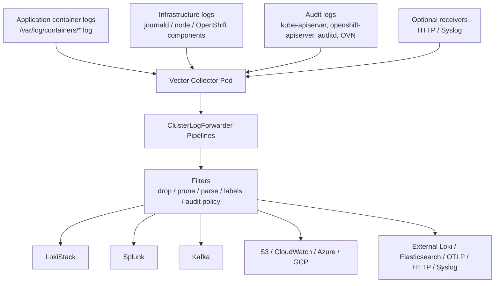

# Vector Collector in OpenShift Logging — Advanced OpenShift Administration Guide

**Audience:** Advanced OpenShift administrators, SREs, platform engineers, and Red Hat OpenShift Logging operators with production responsibilities.  
**Experience level:** Written for an administrator with roughly 10 years of Linux, Kubernetes, OpenShift, DevOps, and observability experience.  
**Scope:** OpenShift Logging collector architecture, Vector collector internals, `ClusterLogForwarder`, LokiStack forwarding, external forwarding, tuning, RBAC, security, performance, troubleshooting, runbooks, and production best practices.  
**Current context:** Red Hat OpenShift Logging 6.x uses Vector as the supported collector implementation. Older Logging 5.x environments might still show Fluentd/Vector transition behavior.

---

## Table of Contents

1. [Executive Summary](#1-executive-summary)
2. [Where Vector Fits in OpenShift Logging](#2-where-vector-fits-in-openshift-logging)
3. [OpenShift Logging Version Context](#3-openshift-logging-version-context)
4. [Core Concepts: Vector vs Fluentd](#4-core-concepts-vector-vs-fluentd)
5. [Vector Collector Architecture in OpenShift](#5-vector-collector-architecture-in-openshift)
6. [Log Sources Collected by Vector](#6-log-sources-collected-by-vector)
7. [ClusterLogForwarder Deep Dive](#7-clusterlogforwarder-deep-dive)
8. [Collector Identity, RBAC, and Authorization](#8-collector-identity-rbac-and-authorization)
9. [Deploying Vector Collection to LokiStack](#9-deploying-vector-collection-to-lokistack)
10. [Inputs, Filters, Outputs, and Pipelines](#10-inputs-filters-outputs-and-pipelines)
11. [Filtering and Data Reduction](#11-filtering-and-data-reduction)
12. [Parsing JSON and Multiline Logs](#12-parsing-json-and-multiline-logs)
13. [Forwarding to External Destinations](#13-forwarding-to-external-destinations)
14. [Delivery Guarantees, Buffers, Retry, and Backpressure](#14-delivery-guarantees-buffers-retry-and-backpressure)
15. [Performance Tuning and Sizing](#15-performance-tuning-and-sizing)
16. [Collector Scheduling, Placement, and Rollout Strategy](#16-collector-scheduling-placement-and-rollout-strategy)
17. [Security Hardening](#17-security-hardening)
18. [Monitoring Vector Collector Health](#18-monitoring-vector-collector-health)
19. [Troubleshooting Runbook](#19-troubleshooting-runbook)
20. [Common Failure Scenarios and Fixes](#20-common-failure-scenarios-and-fixes)
21. [Production Design Patterns](#21-production-design-patterns)
22. [Migration Notes: Fluentd to Vector / Logging 5 to 6](#22-migration-notes-fluentd-to-vector--logging-5-to-6)
23. [Day-2 Operations Checklist](#23-day-2-operations-checklist)
24. [Interview / Real-World Questions](#24-interview--real-world-questions)
25. [Command Cheat Sheet](#25-command-cheat-sheet)
26. [References](#26-references)

---

## 1. Executive Summary

The **Vector collector** is the log collection and forwarding engine used by modern Red Hat OpenShift Logging. It runs on cluster nodes, reads application, infrastructure, and audit logs, applies routing and filtering rules from `ClusterLogForwarder`, and sends log events to LokiStack or external systems such as Splunk, Kafka, Elasticsearch, Amazon CloudWatch, Amazon S3, Azure Monitor, Google Cloud Logging, external Loki, OTLP endpoints, generic HTTP receivers, and syslog receivers.

In simple words:

```text
Pods / Nodes / Audit Logs
        |
        v
Vector collector DaemonSet
        |
        v
ClusterLogForwarder-defined pipelines
        |
        +--> LokiStack
        +--> Splunk
        +--> Kafka
        +--> Elasticsearch
        +--> S3 / CloudWatch / Azure / GCP / HTTP / OTLP / Syslog
```

From an advanced administrator perspective, Vector is not just a replacement for Fluentd. It changes how you think about log collection:

- You design **pipelines**, not only destinations.
- You control **inputs**, **filters**, **outputs**, and **delivery behavior**.
- You explicitly grant collector permissions through RBAC.
- You tune throughput, durability, retry behavior, compression, message size, and rate limits.
- You treat logging as a platform service with SLOs, capacity planning, tenant isolation, and cost controls.

The most important production principle is:

> Do not enable broad log collection without first designing RBAC, pipeline scope, retention, filtering, capacity, and destination limits.

---

## 2. Where Vector Fits in OpenShift Logging

OpenShift Logging provides cluster-wide log collection and forwarding. The main responsibilities are:

1. **Collect logs** from containers, node services, OpenShift components, and audit sources.
2. **Normalize and enrich logs** with Kubernetes metadata such as namespace, pod, container, node, labels, and log type.
3. **Route logs** through pipelines.
4. **Filter, drop, prune, parse, or label logs** before they leave the cluster.
5. **Forward logs** to LokiStack or external destinations.
6. **Expose operational status** through `ClusterLogForwarder` conditions, collector pod health, metrics, and alerts.

In OpenShift Logging 6.x, the functional split is typically:

| Component | Responsibility |
|---|---|
| Red Hat OpenShift Logging Operator | Manages log collection and forwarding resources. |
| Vector collector | Performs node-level collection and forwarding. |
| `ClusterLogForwarder` | Defines collector service account, inputs, filters, outputs, and pipelines. |
| Loki Operator | Manages LokiStack log storage. |
| LokiStack | Stores and serves logs with tenancy model. |
| Cluster Observability Operator | Provides visualization integration for logs in the console. |

Vector is the **collector and forwarder runtime**. You usually do not hand-write raw Vector configuration in OpenShift Logging. Instead, you declare your desired logging behavior in `ClusterLogForwarder`, and the Operator translates that into the required collector deployment and runtime configuration.

---

## 3. OpenShift Logging Version Context

### 3.1 Logging 5.x

In older OpenShift Logging 5.x releases, you commonly saw these resources:

```yaml
apiVersion: logging.openshift.io/v1
kind: ClusterLogging
metadata:
  name: instance
  namespace: openshift-logging
spec:
  collection:
    type: vector   # or fluentd in older deployments
```

and sometimes:

```yaml
apiVersion: logging.openshift.io/v1
kind: ClusterLogForwarder
metadata:
  name: instance
  namespace: openshift-logging
```

In that model:

- `ClusterLogging` controlled the logging stack.
- `ClusterLogForwarder` controlled forwarding.
- Fluentd existed historically, but Vector became the preferred path.

### 3.2 Logging 6.x

In OpenShift Logging 6.x:

- Vector is the supported collection implementation.
- Log collection and forwarding configuration moved to the `observability.openshift.io` API group.
- `ClusterLogging` and older forwarding concepts are consolidated into the newer `ClusterLogForwarder` model.
- Elasticsearch/Kibana-based managed logging is removed from the modern path; LokiStack and the OpenShift console logging UI are the primary Red Hat-managed stack.

Modern example:

```yaml
apiVersion: observability.openshift.io/v1
kind: ClusterLogForwarder
metadata:
  name: instance
  namespace: openshift-logging
spec:
  serviceAccount:
    name: collector
  outputs:
  - name: default-lokistack
    type: lokiStack
    lokiStack:
      authentication:
        token:
          from: serviceAccount
      target:
        name: logging-loki
        namespace: openshift-logging
    tls:
      ca:
        configMapName: logging-loki-gateway-ca-bundle
        key: service-ca.crt
  pipelines:
  - name: default-logstore
    inputRefs:
    - application
    - infrastructure
    outputRefs:
    - default-lokistack
```

### 3.3 Practical Admin Rule

Before applying any YAML from documentation or old notes, first check which API exists in your cluster:

```bash
oc api-resources | grep -i clusterlogforwarder
oc get crd | grep -i clusterlogforwarder
oc explain clusterlogforwarder.spec
```

Also check installed operator versions:

```bash
oc get csv -n openshift-logging
oc get subscription -n openshift-logging
oc get operators
```

---

## 4. Core Concepts: Vector vs Fluentd

### 4.1 What Vector Is

Vector is a high-performance observability data pipeline. Conceptually, Vector works with:

| Vector Concept | Meaning |
|---|---|
| Source | Where events enter Vector. Example: files, journald, HTTP, syslog. |
| Transform | Processing logic. Example: parse, filter, remap, drop, enrich. |
| Sink | Destination where events are sent. Example: Loki, Kafka, Splunk, S3. |
| Pipeline / Topology | Directed graph from sources through transformations to sinks. |
| Event | The unit of data flowing through Vector. For logging, a structured log record. |

OpenShift abstracts these concepts through `ClusterLogForwarder`:

| Raw Vector Concept | OpenShift Logging Object |
|---|---|
| Source | `spec.inputs` or built-in `application`, `infrastructure`, `audit` inputRefs |
| Transform | `spec.filters` and pipeline filterRefs |
| Sink | `spec.outputs` |
| Pipeline | `spec.pipelines` |
| Runtime | Collector DaemonSet managed by Logging Operator |

### 4.2 Why Vector Replaced Fluentd

The practical reasons administrators care about Vector:

- Better performance profile for high-volume collection.
- Lower overhead compared with legacy Ruby-based Fluentd-style collectors.
- Strong pipeline model with modern buffering and backpressure behavior.
- Better fit for cloud-native observability pipelines.
- Native support for many destinations and protocols through the Operator’s APIs.
- Better future enhancement path in OpenShift Logging.

### 4.3 What Does Not Change

Vector does not eliminate the need for good logging design. You still need to manage:

- Application log volume.
- Audit log sensitivity.
- Retention cost.
- Destination ingestion limits.
- TLS trust chains.
- RBAC boundaries.
- Node resource consumption.
- Backpressure and retry behavior.
- Alerting for failed or throttled pipelines.

---

## 5. Vector Collector Architecture in OpenShift

### 5.1 High-Level Architecture



### 5.2 Collector Deployment Model

The Vector collector is normally deployed as a **DaemonSet**, meaning one collector pod runs on each selected node.

Why a DaemonSet?

- Container log files are local to nodes.
- Journald/system logs are local to nodes.
- Audit log files are node-local or control-plane-local depending on log type.
- Node-local collection avoids sending raw log files across the network before processing.

Typical check:

```bash
oc get pods -n openshift-logging -l app.kubernetes.io/component=collector -o wide
```

Expected:

```text
NAME             READY   STATUS    NODE
instance-abcde   1/1     Running   worker-0
instance-fghij   1/1     Running   worker-1
instance-klmno   1/1     Running   master-0
```

### 5.3 Node-Level Flow

On each node:

1. Containers write stdout/stderr.
2. CRI-O writes container logs under `/var/log/pods` and `/var/log/containers` symlink paths.
3. OpenShift components and the OS produce journald logs.
4. Control plane and security components produce audit logs.
5. Vector reads permitted sources.
6. Vector enriches records with Kubernetes metadata.
7. Vector applies pipeline filters.
8. Vector sends events to configured outputs.

### 5.4 Why Collector Runs Privileged-Like Access

The collector needs access to host log paths. That means it requires:

- HostPath mounts for log directories.
- Service account identity.
- RBAC permissions for Kubernetes metadata and selected log types.
- Suitable SCC/security context as managed by the Operator.

Do not treat the collector as an ordinary application pod. It is infrastructure-level software with sensitive visibility.

---

## 6. Log Sources Collected by Vector

OpenShift Logging typically handles three major log categories.

### 6.1 Application Logs

Application logs are generated by user workloads running in non-infrastructure projects.

Examples:

```text
myapp-prod/payment-api-7d8b9d4fdc-abc12/payment-api
myapp-dev/frontend-6f8d9c7559-xyz91/nginx
```

Typical use cases:

- Developer troubleshooting.
- SRE incident analysis.
- Application performance issue investigation.
- Short-term debugging in LokiStack.
- Forwarding selected namespaces to enterprise SIEM/log analytics tools.

Built-in input reference:

```yaml
inputRefs:
- application
```

### 6.2 Infrastructure Logs

Infrastructure logs include OpenShift and Kubernetes system-level logs:

- Pods in `openshift-*` namespaces.
- Pods in `kube-*` namespaces.
- Pods in `default` where applicable.
- Node journald messages.
- Container runtime logs.
- OpenShift control-plane component logs.

Built-in input reference:

```yaml
inputRefs:
- infrastructure
```

Use cases:

- Cluster troubleshooting.
- Node-level incident investigation.
- Platform SRE dashboards.
- Root cause analysis for degraded operators.

### 6.3 Audit Logs

Audit logs are security-sensitive. They include API and security-related events such as:

- Kubernetes API server audit events.
- OpenShift API server audit events.
- OAuth audit events.
- Node audit/auditd logs.
- OVN/network audit logs where applicable.

Built-in input reference:

```yaml
inputRefs:
- audit
```

Audit logs require special care because they are:

- High volume.
- Security-sensitive.
- Potentially compliance-relevant.
- Often subject to retention and immutability rules.
- Expensive if sent unfiltered to SaaS logging platforms.

Production recommendation:

- Send audit logs to compliance storage separately from developer-facing logs.
- Use pruning to remove unnecessary sensitive fields when forwarding to third-party systems.
- Do not enable audit collection casually in a small LokiStack without capacity planning.

---

## 7. ClusterLogForwarder Deep Dive

`ClusterLogForwarder` is the most important resource for Vector collector behavior.

### 7.1 Main Responsibilities

`ClusterLogForwarder` defines:

- Which service account the collector uses.
- Which log inputs are collected.
- Which filters are applied.
- Which outputs receive logs.
- Which pipelines connect inputs to filters and outputs.
- Collector tuning, resources, and logging level options.

Basic skeleton:

```yaml
apiVersion: observability.openshift.io/v1
kind: ClusterLogForwarder
metadata:
  name: instance
  namespace: openshift-logging
spec:
  serviceAccount:
    name: collector
  inputs: []
  filters: []
  outputs: []
  pipelines: []
  collector: {}
```

### 7.2 Built-In Input References

You can reference these directly in pipelines:

```yaml
inputRefs:
- application
- infrastructure
- audit
```

Each one requires matching RBAC permissions for the collector service account.

### 7.3 Pipeline Rule

A pipeline must have:

- A name.
- One or more input references.
- One or more output references.
- Optional filters.

Example:

```yaml
pipelines:
- name: apps-to-loki
  inputRefs:
  - application
  outputRefs:
  - default-lokistack
```

### 7.4 Important Behavior

If you do not define a pipeline for a log type, that log type is not collected/forwarded through that configuration.

Example:

```yaml
pipelines:
- name: apps-only
  inputRefs:
  - application
  outputRefs:
  - default-lokistack
```

Result:

- Application logs are collected.
- Infrastructure logs are not collected by this pipeline.
- Audit logs are not collected by this pipeline.

### 7.5 Status Conditions

Check:

```bash
oc get clusterlogforwarder instance -n openshift-logging \
  -o jsonpath='{.status.conditions}' | python3 -m json.tool
```

Typical healthy status:

```json
[
  {
    "type": "observability.openshift.io/Authorized",
    "status": "True",
    "message": "permitted to collect log types: [application infrastructure]"
  },
  {
    "type": "observability.openshift.io/Valid",
    "status": "True",
    "message": ""
  },
  {
    "type": "Ready",
    "status": "True",
    "message": ""
  }
]
```

Interpretation:

| Condition | Expected | Meaning |
|---|---:|---|
| `observability.openshift.io/Authorized` | `True` | Service account can collect requested log types. |
| `observability.openshift.io/Valid` | `True` | CR is schema-valid and semantically valid. |
| `Ready` | `True` | Operator reconciled and collector can run. |

If `Authorized=False`, the service account lacks a required `ClusterRoleBinding`. In modern Logging, the Operator can remove the collector DaemonSet to prevent insecure or partial collection.

---

## 8. Collector Identity, RBAC, and Authorization

### 8.1 Why Explicit RBAC Matters

OpenShift Logging 6.x requires explicit collector authorization. This is a major operational change from some legacy setups.

The collector service account must be granted only the log types it should collect:

| ClusterRole | Grants access to |
|---|---|
| `collect-application-logs` | User workload/application logs. |
| `collect-infrastructure-logs` | Node, system, and OpenShift infrastructure logs. |
| `collect-audit-logs` | Audit logs. |

### 8.2 Create Collector Service Account

```bash
oc create sa collector -n openshift-logging
```

### 8.3 Grant Application Log Collection

```bash
oc adm policy add-cluster-role-to-user collect-application-logs \
  system:serviceaccount:openshift-logging:collector
```

### 8.4 Grant Infrastructure Log Collection

```bash
oc adm policy add-cluster-role-to-user collect-infrastructure-logs \
  system:serviceaccount:openshift-logging:collector
```

### 8.5 Grant Audit Log Collection

```bash
oc adm policy add-cluster-role-to-user collect-audit-logs \
  system:serviceaccount:openshift-logging:collector
```

### 8.6 Verify RBAC

```bash
oc get clusterrolebinding -o wide | grep collect
```

Also check effective authorization:

```bash
oc auth can-i collect applicationlogs \
  --as=system:serviceaccount:openshift-logging:collector

oc auth can-i collect infrastructurelogs \
  --as=system:serviceaccount:openshift-logging:collector

oc auth can-i collect auditlogs \
  --as=system:serviceaccount:openshift-logging:collector
```

Exact resource names can vary by API implementation; if `oc auth can-i` does not understand the resource, rely on `ClusterLogForwarder` status and cluster role binding verification.

### 8.7 Critical Warning

Always grant RBAC **before** adding a new log type to `inputRefs`.

Bad order:

```text
1. Add audit to ClusterLogForwarder
2. Forget collect-audit-logs binding
3. Collector becomes unauthorized
4. Operator removes collector DaemonSet
5. Log collection stops
```

Good order:

```text
1. Add collect-audit-logs ClusterRoleBinding
2. Confirm binding exists
3. Add audit inputRef
4. Verify ClusterLogForwarder Authorized=True
5. Verify collector pods running
```

---

## 9. Deploying Vector Collection to LokiStack

This is the standard modern OpenShift Logging scenario.

### 9.1 Assumptions

- Red Hat OpenShift Logging Operator installed.
- Loki Operator installed.
- LokiStack instance exists.
- Collector service account exists.
- Required RBAC bindings are created.
- Namespace is `openshift-logging`.
- LokiStack name is `logging-loki`.

Check operators:

```bash
oc get csv -n openshift-logging
oc get csv -A | grep -i loki
```

Check LokiStack:

```bash
oc get lokistack -A
```

### 9.2 Complete Example: Application + Infrastructure to LokiStack

Create `clf-lokistack.yaml`:

```yaml
apiVersion: observability.openshift.io/v1
kind: ClusterLogForwarder
metadata:
  name: instance
  namespace: openshift-logging
spec:
  serviceAccount:
    name: collector
  outputs:
  - name: default-lokistack
    type: lokiStack
    lokiStack:
      authentication:
        token:
          from: serviceAccount
      target:
        name: logging-loki
        namespace: openshift-logging
    tls:
      ca:
        configMapName: logging-loki-gateway-ca-bundle
        key: service-ca.crt
  pipelines:
  - name: default-logstore
    inputRefs:
    - application
    - infrastructure
    outputRefs:
    - default-lokistack
```

Apply:

```bash
oc apply -f clf-lokistack.yaml
```

### 9.3 Verify `ClusterLogForwarder`

```bash
oc get clusterlogforwarder instance -n openshift-logging

oc get clusterlogforwarder instance -n openshift-logging \
  -o jsonpath='{.status.conditions}' | python3 -m json.tool
```

Expected:

```text
Authorized=True
Valid=True
Ready=True
```

### 9.4 Verify Collector Pods

```bash
oc get pods -n openshift-logging -l app.kubernetes.io/component=collector -o wide
```

### 9.5 Check Collector Logs

```bash
oc logs -n openshift-logging \
  -l app.kubernetes.io/component=collector \
  --tail=100
```

### 9.6 Verify in OpenShift Console

Go to:

```text
Observe -> Logs
```

Select:

- Application logs.
- Infrastructure logs.
- Namespace or pod filters.

### 9.7 Critical TLS Detail for LokiStack

When forwarding to LokiStack, include the CA bundle:

```yaml
    tls:
      ca:
        configMapName: logging-loki-gateway-ca-bundle
        key: service-ca.crt
```

Without the CA block, `ClusterLogForwarder` can look `Ready`, but collector delivery can fail because it cannot verify the LokiStack gateway certificate.

---

## 10. Inputs, Filters, Outputs, and Pipelines

### 10.1 Inputs

Inputs define what the collector reads.

Built-in inputs:

```yaml
inputRefs:
- application
- infrastructure
- audit
```

Custom application input by namespace:

```yaml
spec:
  inputs:
  - name: prod-apps
    type: application
    application:
      includes:
      - namespace: production
      - namespace: payments
```

Custom application input by labels:

```yaml
spec:
  inputs:
  - name: high-priority-apps
    type: application
    application:
      selector:
        matchLabels:
          priority: high
```

### 10.2 Outputs

Outputs define destinations.

Example LokiStack output:

```yaml
outputs:
- name: default-lokistack
  type: lokiStack
  lokiStack:
    authentication:
      token:
        from: serviceAccount
    target:
      name: logging-loki
      namespace: openshift-logging
  tls:
    ca:
      configMapName: logging-loki-gateway-ca-bundle
      key: service-ca.crt
```

Example external Splunk output:

```yaml
outputs:
- name: splunk-prod
  type: splunk
  splunk:
    url: https://splunk.example.com:8088
    authentication:
      token:
        secretName: splunk-token
        key: token
```

Example Kafka output:

```yaml
outputs:
- name: kafka-platform
  type: kafka
  kafka:
    brokers:
    - kafka-1.example.com:9092
    - kafka-2.example.com:9092
    topic: openshift-logs
```

### 10.3 Filters

Filters modify or remove log records before output.

Common filters:

| Filter | Use case |
|---|---|
| `drop` | Remove complete records matching conditions. |
| `prune` | Remove selected fields or keep only selected fields. |
| `parse` | Parse structured JSON application logs. |
| `openshiftLabels` | Add labels for routing/search. |
| audit policy filter | Reduce audit event volume/detail. |

### 10.4 Pipelines

Pipelines connect input → filters → outputs.

Example:

```yaml
pipelines:
- name: prod-apps-to-splunk
  inputRefs:
  - prod-apps
  filterRefs:
  - drop-debug
  - prune-sensitive-fields
  outputRefs:
  - splunk-prod
```

Filter order matters:

1. Drop noisy logs early.
2. Parse structured logs before field-based filters.
3. Prune fields after deciding which logs to keep.
4. Add labels late if labels depend on processed content.

---

## 11. Filtering and Data Reduction

Filtering is one of the most important production features because log cost grows quickly.

### 11.1 Drop Filter

Drop logs from a noisy namespace:

```yaml
apiVersion: observability.openshift.io/v1
kind: ClusterLogForwarder
metadata:
  name: instance
  namespace: openshift-logging
spec:
  serviceAccount:
    name: collector
  filters:
  - name: drop-marketplace
    type: drop
    drop:
    - test:
      - field: .kubernetes.namespace_name
        matches: openshift-marketplace
  outputs:
  - name: default-lokistack
    type: lokiStack
    lokiStack:
      authentication:
        token:
          from: serviceAccount
      target:
        name: logging-loki
        namespace: openshift-logging
    tls:
      ca:
        configMapName: logging-loki-gateway-ca-bundle
        key: service-ca.crt
  pipelines:
  - name: filtered-to-loki
    inputRefs:
    - application
    - infrastructure
    filterRefs:
    - drop-marketplace
    outputRefs:
    - default-lokistack
```

### 11.2 AND / OR Logic in Drop Filters

Within one `test` list, conditions are ANDed.

```yaml
filters:
- name: drop-info-from-noisy-app
  type: drop
  drop:
  - test:
    - field: .kubernetes.namespace_name
      matches: noisy-project
    - field: .level
      matches: info
```

This drops records only when both conditions match:

```text
namespace == noisy-project AND level == info
```

Multiple `drop` test blocks act like OR:

```yaml
filters:
- name: drop-multiple
  type: drop
  drop:
  - test:
    - field: .kubernetes.namespace_name
      matches: openshift-marketplace
  - test:
    - field: .message
      matches: "health check passed"
```

This drops records when:

```text
namespace == openshift-marketplace OR message matches "health check passed"
```

### 11.3 Prune Filter

Use prune when you want to remove fields but keep the log record.

Example: remove annotations and labels before sending to external SaaS:

```yaml
filters:
- name: prune-kubernetes-metadata
  type: prune
  prune:
    notIn:
    - .kubernetes.annotations
    - .kubernetes.labels
```

Example: keep only selected fields:

```yaml
filters:
- name: keep-minimal
  type: prune
  prune:
    in:
    - .message
    - .level
    - .log_type
    - .kubernetes.namespace_name
    - .kubernetes.pod_name
    - .kubernetes.container_name
    - .timestamp
```

### 11.4 Practical Filtering Strategy

| Goal | Best Method |
|---|---|
| Exclude entire namespace | Prefer custom input includes/excludes or drop filter. |
| Remove PII fields | Prune filter. |
| Reduce audit volume | Audit policy filter + prune. |
| Remove debug logs | Drop filter by `.level` or message pattern. |
| Reduce app noise | Input rate limit + drop filter. |
| Reduce SaaS bill | Drop early, prune metadata, rate-limit output. |

### 11.5 Do Not Overuse Regex

Regex filtering is powerful but can become expensive at scale. Prefer:

1. Namespace or label selectors.
2. Exact field matches.
3. Application log level conventions.
4. Regex only for unavoidable message patterns.

---

## 12. Parsing JSON and Multiline Logs

### 12.1 JSON Application Logs

Many enterprise applications emit JSON logs:

```json
{"level":"error","trace_id":"abc123","message":"payment failed","customer_id":"redacted"}
```

Structured logs are better than raw text because you can filter on fields.

Example pipeline parse:

```yaml
pipelines:
- name: json-apps-to-loki
  inputRefs:
  - application
  outputRefs:
  - default-lokistack
  parse: json
```

After parsing, filters can operate on structured fields such as:

```text
.level
.trace_id
.message
.customer_id
```

### 12.2 Parse Before Field Filtering

Bad order:

```text
drop .level == debug before JSON parse
```

Result: `.level` might not exist yet.

Good order:

```text
parse JSON -> drop debug -> prune fields -> output
```

### 12.3 Multiline Exception Detection

Java, Python, Node.js, and Go applications often emit stack traces across multiple lines. Without multiline handling, one exception becomes many log records.

Why this matters:

- Search becomes harder.
- Alerting becomes noisy.
- Log volume increases.
- Correlation by trace ID may break.

Use multiline exception detection where supported by your OpenShift Logging version and validate with real app stack traces.

Operational validation:

```bash
oc logs -n <app-namespace> deploy/<app> --tail=100
```

Then compare with Loki/log output to ensure one stack trace is represented correctly.

---

## 13. Forwarding to External Destinations

Vector collector can forward to many external systems through `ClusterLogForwarder` outputs.

### 13.1 Destination Types

Common destination types include:

| Output Type | Typical Use |
|---|---|
| `lokiStack` | Red Hat managed in-cluster LokiStack. |
| `loki` | External Loki endpoint. |
| `splunk` | Splunk HEC. |
| `kafka` | Enterprise event bus / SIEM ingestion. |
| `elasticsearch` | External Elasticsearch-compatible log store. |
| `cloudwatch` | AWS CloudWatch Logs. |
| `s3` | Long-term object storage/archive. |
| `azureMonitor` | Azure Monitor Logs. |
| `googleCloudLogging` | Google Cloud Logging. |
| `http` | Generic HTTP collector. |
| `syslog` | Traditional SIEM/syslog receiver. |
| `otlp` | OpenTelemetry collector or OTLP-compatible backend. |

### 13.2 External Destination Design Questions

Before forwarding externally, answer:

1. Is the destination inside or outside the cluster?
2. Is TLS required?
3. Do we need mTLS?
4. Where are credentials stored?
5. What is the ingestion rate limit?
6. What happens if the destination is down?
7. What logs are allowed to leave the cluster?
8. Is PII removed?
9. Are audit logs subject to legal retention?
10. Do we need at-least-once delivery?
11. Are duplicates acceptable?
12. Does the destination support compression?
13. Is a proxy required?
14. Does NetworkPolicy allow egress?

### 13.3 Example: Application Logs to Splunk, Infrastructure Logs to Loki

```yaml
apiVersion: observability.openshift.io/v1
kind: ClusterLogForwarder
metadata:
  name: instance
  namespace: openshift-logging
spec:
  serviceAccount:
    name: collector
  outputs:
  - name: lokistack
    type: lokiStack
    lokiStack:
      authentication:
        token:
          from: serviceAccount
      target:
        name: logging-loki
        namespace: openshift-logging
    tls:
      ca:
        configMapName: logging-loki-gateway-ca-bundle
        key: service-ca.crt
  - name: splunk-prod
    type: splunk
    splunk:
      url: https://splunk.example.com:8088
      authentication:
        token:
          secretName: splunk-token
          key: token
  pipelines:
  - name: infra-to-loki
    inputRefs:
    - infrastructure
    outputRefs:
    - lokistack
  - name: apps-to-splunk
    inputRefs:
    - application
    outputRefs:
    - splunk-prod
```

### 13.4 Example: Audit Logs to S3 Archive and Security Monitoring

```yaml
apiVersion: observability.openshift.io/v1
kind: ClusterLogForwarder
metadata:
  name: instance
  namespace: openshift-logging
spec:
  serviceAccount:
    name: collector
  filters:
  - name: prune-sensitive-audit-fields
    type: prune
    prune:
      notIn:
      - .requestObject
      - .responseObject
  outputs:
  - name: s3-compliance
    type: s3
    s3:
      bucket: openshift-audit-archive
      region: ap-south-1
      authentication:
        accessKey:
          key: aws_access_key_id
          secretName: aws-secret
        secretKey:
          key: aws_secret_access_key
          secretName: aws-secret
  - name: security-siem
    type: splunk
    splunk:
      url: https://splunk-security.example.com:8088
      authentication:
        token:
          secretName: security-splunk-token
          key: token
  pipelines:
  - name: audit-to-archive-and-siem
    inputRefs:
    - audit
    filterRefs:
    - prune-sensitive-audit-fields
    outputRefs:
    - s3-compliance
    - security-siem
```

Check your exact OpenShift Logging version’s schema before applying S3/Splunk examples because output fields may vary by release.

---

## 14. Delivery Guarantees, Buffers, Retry, and Backpressure

### 14.1 Why Delivery Semantics Matter

Logging pipelines fail in real life:

- LokiStack gateway returns 429.
- Splunk HEC token expires.
- Kafka brokers are unavailable.
- NetworkPolicy blocks egress.
- DNS fails.
- Collector pod restarts.
- Node reboots.
- Destination rate-limits traffic.

A senior administrator must decide what matters more:

| Priority | Design Choice |
|---|---|
| Maximum throughput | In-memory buffering, fewer guarantees, rate control. |
| Maximum durability | AtLeastOnce, disk-backed durability where supported, retries. |
| Cost reduction | Drop/prune/rate-limit early. |
| Compliance | Separate audit pipeline, durable storage, minimal transformation. |
| Low latency | Small batches, fast destination, avoid heavy regex. |

### 14.2 Delivery Mode

Output tuning can define delivery behavior:

```yaml
outputs:
- name: default-lokistack
  type: lokiStack
  lokiStack:
    tuning:
      deliveryMode: AtLeastOnce
      compression: gzip
      maxWrite: 3Mi
      minRetryDuration: 2
      maxRetryDuration: 300
```

Common delivery modes:

| Mode | Meaning | Risk |
|---|---|---|
| `AtLeastOnce` | Collector retries/resends logs not successfully delivered before failure. | Duplicates can occur. |
| `AtMostOnce` | Collector does not attempt durable recovery after crash. | Log loss possible. |
| Unset/default | Usually optimized for performance with in-memory behavior. | Buffered data can be lost on failure. |

### 14.3 AtLeastOnce Is Not ExactlyOnce

At-least-once delivery means logs can be duplicated.

Example:

```text
1. Collector sends batch to destination.
2. Destination receives it.
3. Collector crashes before recording success.
4. Collector restarts and resends.
5. Destination receives duplicate events.
```

For audit/compliance systems, duplicates are usually better than loss. For billing or event-counting systems, duplicates must be handled downstream.

### 14.4 Retry Tuning

```yaml
outputs:
- name: default-lokistack
  type: lokiStack
  lokiStack:
    tuning:
      minRetryDuration: 2
      maxRetryDuration: 300
```

Use cases:

- Short retry for transient network failures.
- Longer max retry to avoid hot-looping during destination outage.
- Avoid overwhelming Loki/Splunk after outage recovery.

### 14.5 Max Write / Batch Size

```yaml
maxWrite: 3Mi
```

This controls the maximum payload size in a single write operation.

Why it matters:

- Some destinations reject large payloads.
- Too-small batches increase overhead.
- Too-large batches increase memory and retry cost.
- LokiStack has default guidance around `3Mi` for writes.

### 14.6 Compression

```yaml
compression: gzip
```

Compression reduces network usage but adds CPU cost.

Use compression when:

- Sending logs across WAN/VPN.
- Egress bandwidth is expensive.
- Destination supports the selected compression algorithm.

Avoid or test carefully when:

- Nodes are CPU-constrained.
- Logs are already compressed or very small.
- Destination compatibility is uncertain.

### 14.7 Backpressure

Backpressure means the downstream destination is slower than log production, and the collector must slow down, buffer, retry, or drop.

Symptoms:

```text
429 Too Many Requests
connection refused
request timed out
buffer full
rate limited
collector CPU high
collector memory rising
logs delayed in UI
```

Backpressure decision tree:

```text
Are logs delayed?
  |
  +-- Is destination returning 429?
  |      +-- Increase destination capacity or reduce log rate.
  |
  +-- Is collector CPU high?
  |      +-- Increase collector CPU, reduce parsing/regex, drop earlier.
  |
  +-- Is collector memory high?
  |      +-- Reduce maxWrite, reduce message size, apply rate limits.
  |
  +-- Is network blocked?
         +-- Check NetworkPolicy, proxy, DNS, TLS, route/firewall.
```

---

## 15. Performance Tuning and Sizing

### 15.1 Collector Resource Requests and Limits

Patch collector resources:

```bash
oc patch clusterlogforwarder instance -n openshift-logging \
  --type=merge \
  -p '{"spec":{"collector":{"resources":{"requests":{"cpu":"100m","memory":"256Mi"},"limits":{"cpu":"500m","memory":"512Mi"}}}}}'
```

Example YAML:

```yaml
spec:
  collector:
    resources:
      requests:
        cpu: 200m
        memory: 512Mi
      limits:
        cpu: "2"
        memory: 2Gi
```

Sizing depends on:

- Logs per second per node.
- Average log line size.
- JSON parsing load.
- Regex/filter complexity.
- Number of outputs.
- Compression use.
- Destination latency.
- Audit log volume.
- Node density.

### 15.2 Input Tuning: Max Message Size

```yaml
inputs:
- name: application
  type: application
  application:
    tuning:
      container:
        maxMessageSize: 16Ki
```

Large log lines can cause:

- High memory usage.
- Destination rejection.
- Expensive ingestion.
- Poor search experience.

Best practice:

- Fix application logging when possible.
- Avoid huge stack dumps or payload dumps.
- Drop/truncate extreme logs based on business needs.
- Do not log secrets, tokens, or full request bodies.

### 15.3 Input Rate Limit

```yaml
inputs:
- name: production
  type: application
  application:
    includes:
    - namespace: production
    tuning:
      rateLimitPerContainer:
        maxRecordsPerSecond: 500
```

This limits each matching container.

Example:

```text
maxRecordsPerSecond: 500
10 containers matched
Potential total: 5000 records/sec from that input on the collector deployment
```

### 15.4 Output Rate Limit

```yaml
outputs:
- name: splunk-prod
  type: splunk
  splunk:
    url: https://splunk.example.com:8088
    authentication:
      token:
        secretName: splunk-token
        key: token
  rateLimit:
    maxRecordsPerSecond: 1000
```

This protects downstream systems.

Important: When a rate limit is exceeded, the collector can drop records. Monitor rate-limited metrics and logs.

### 15.5 Rate Limiting Strategy

| Scenario | Recommended Limit Type |
|---|---|
| One noisy application container | Input rate limit per container. |
| SaaS destination has paid ingestion quota | Output rate limit. |
| Audit logs flood during incident | Separate audit pipeline + destination capacity + audit filter. |
| Cluster-wide Loki 429 | Increase LokiStack size, reduce log volume, tune writes/retry. |
| One namespace dominates logging | Custom input + namespace-specific rate limit. |

### 15.6 Avoiding Collector CPU Burn

High CPU causes:

- Log delay.
- Collector restarts if CPU starvation is severe.
- Node pressure.
- Slow pipeline processing.

Reduce CPU by:

- Dropping noisy logs early.
- Avoiding expensive regex on every record.
- Parsing JSON only where needed.
- Reducing number of outputs per pipeline.
- Avoiding unnecessary enrichment or labels.
- Increasing CPU limits when justified.

### 15.7 Avoiding Collector Memory Pressure

High memory causes:

- OOMKilled collector pods.
- Lost in-memory buffers.
- Delayed logs.
- Node memory pressure.

Reduce memory by:

- Limiting max message size.
- Reducing batch/write size.
- Avoiding too many independent outputs.
- Improving destination availability.
- Avoiding unbounded retry backlog.
- Using appropriate delivery mode.

### 15.8 Capacity Planning Formula

Estimate log ingestion:

```text
Total bytes/sec = nodes × avg pods/node × avg lines/sec/pod × avg bytes/line
Daily volume    = total bytes/sec × 86400
```

Example:

```text
50 nodes
80 pods/node
2 lines/sec/pod
500 bytes/line

Total = 50 × 80 × 2 × 500 = 4,000,000 bytes/sec ≈ 4 MB/sec
Daily = 4 MB/sec × 86400 ≈ 345 GB/day before compression/index overhead
```

If sending to multiple outputs, multiply egress and destination ingestion accordingly.

---

## 16. Collector Scheduling, Placement, and Rollout Strategy

### 16.1 Why Scheduling Matters

The collector must run on nodes where logs are produced. But production clusters often have:

- Control plane nodes.
- Infra nodes.
- Worker nodes.
- Edge nodes.
- GPU nodes.
- Tainted nodes.
- Dedicated workload pools.

If collector pods do not tolerate taints or are not scheduled on a node, logs from that node may not be collected.

### 16.2 Check Placement

```bash
oc get pods -n openshift-logging -l app.kubernetes.io/component=collector -o wide
oc get nodes
```

Compare node count vs collector pod count.

### 16.3 Check Taints

```bash
oc describe node <node-name> | grep -i taint -A3
```

If dedicated nodes have taints, ensure collector tolerations support placement if logs must be collected there.

### 16.4 Rollout Strategy

Collector configuration changes can restart collector pods.

Check restart/age:

```bash
oc get pods -n openshift-logging -l app.kubernetes.io/component=collector
```

For large clusters, think about:

- How many collector pods can restart at once.
- Whether losing collectors temporarily is acceptable.
- Whether destination backlogs will spike after rollout.
- Whether Loki/Splunk/Kafka can handle catch-up traffic.

Use collector rollout settings such as `maxUnavailable` where supported by your Logging version:

```yaml
spec:
  collector:
    maxUnavailable: 10%
```

### 16.5 Operational Rule

Do not apply high-impact logging pipeline changes during an existing production incident unless the change is required to recover observability.

---

## 17. Security Hardening

### 17.1 Least Privilege RBAC

Only grant log types needed by the pipeline.

If you only collect application logs:

```bash
oc adm policy add-cluster-role-to-user collect-application-logs \
  system:serviceaccount:openshift-logging:collector
```

Do not grant audit collection unless required.

### 17.2 Protect Audit Logs

Audit logs can reveal:

- Usernames.
- Service accounts.
- Request paths.
- Object metadata.
- RBAC activity.
- Failed access attempts.
- Potentially request/response bodies depending on audit level.

Best practices:

- Route audit logs separately.
- Restrict destination access.
- Use TLS/mTLS.
- Avoid developer-facing audit access unless approved.
- Use audit filters and prune where appropriate.
- Maintain retention policy.

### 17.3 TLS and CA Trust

Every external output should use TLS unless there is a specific trusted internal reason not to.

Common TLS checks:

```bash
oc get secret -n openshift-logging
oc get configmap -n openshift-logging | grep ca
oc logs -n openshift-logging -l app.kubernetes.io/component=collector | grep -i certificate
```

TLS errors usually mean:

- Missing CA bundle.
- Wrong key name in secret/configmap.
- Destination certificate CN/SAN mismatch.
- Expired certificate.
- mTLS client certificate missing.
- Proxy intercepting TLS.

### 17.4 Secret Management

External outputs often need credentials:

- Splunk HEC token.
- Elasticsearch username/password.
- AWS access keys.
- Azure shared key.
- Google credentials JSON.
- Kafka SASL credentials.

Store credentials in Kubernetes `Secret` in the same namespace as the `ClusterLogForwarder` unless documentation says otherwise.

Example:

```bash
oc create secret generic splunk-token \
  -n openshift-logging \
  --from-literal=token='<HEC_TOKEN>'
```

Never store credentials directly in Git in plain text.

### 17.5 NetworkPolicy

If your cluster uses restrictive NetworkPolicy, allow collector egress to destinations.

Check:

```bash
oc get networkpolicy -A
```

Debug egress from a temporary pod in the same namespace when appropriate:

```bash
oc run net-debug -n openshift-logging --rm -it \
  --image=registry.access.redhat.com/ubi9/ubi -- bash
```

Inside:

```bash
curl -vk https://splunk.example.com:8088
curl -vk https://<loki-gateway-service>:8080
```

### 17.6 Data Sovereignty

If logs leave the cluster or country/region:

- Know what fields are included.
- Prune PII fields.
- Mask secrets at the application source.
- Apply namespace-specific routing.
- Send regulated logs only to approved destinations.

---

## 18. Monitoring Vector Collector Health

### 18.1 Basic Health Checks

```bash
oc get clusterlogforwarder instance -n openshift-logging
oc get pods -n openshift-logging -l app.kubernetes.io/component=collector
oc logs -n openshift-logging -l app.kubernetes.io/component=collector --tail=50
```

### 18.2 LogFileMetricExporter

`LogFileMetricExporter` exposes metrics about logs produced by containers. It is not always deployed by default.

Example:

```yaml
apiVersion: logging.openshift.io/v1alpha1
kind: LogFileMetricExporter
metadata:
  name: instance
  namespace: openshift-logging
spec:
  nodeSelector: {}
  resources:
    limits:
      cpu: 500m
      memory: 256Mi
    requests:
      cpu: 200m
      memory: 128Mi
  tolerations: []
```

Apply:

```bash
oc apply -f log-file-metric-exporter.yaml
```

Verify:

```bash
oc get pods -l app.kubernetes.io/component=logfilesmetricexporter -n openshift-logging
```

### 18.3 Useful Signals

Monitor:

- Collector pod restarts.
- Collector CPU/memory usage.
- Output error rate.
- Dropped/rate-limited log records.
- 429 responses from LokiStack or external sinks.
- LokiStack ingestion health.
- Disk usage if durable buffers are used.
- Node filesystem pressure.
- API audit log volume.

### 18.4 Prometheus Queries to Start With

Exact metric names can vary by version. Use discovery:

```bash
oc -n openshift-monitoring exec -it prometheus-k8s-0 -c prometheus -- sh
```

Or use the web console metrics UI and search for:

```text
vector
collector
observability_log_forwarder
rate_limited
dropped
loki
```

Candidate patterns:

```promql
sum by (namespace, pod) (rate(container_cpu_usage_seconds_total{namespace="openshift-logging"}[5m]))
```

```promql
sum by (namespace, pod) (container_memory_working_set_bytes{namespace="openshift-logging"})
```

```promql
sum(rate(observability_log_forwarder_output_rate_limited_total[5m]))
```

Validate metric names in your cluster because observability metric names can change between releases.

### 18.5 Alerts

Important alert types:

| Alert | Meaning |
|---|---|
| Collector node down | Prometheus cannot scrape a Vector instance. |
| Disk buffer usage high | Collector buffers are consuming too much disk. |
| Loki 429 / ingestion pressure | Destination cannot ingest at current rate. |
| Collector pod restart | OOM, crash, config issue, node issue. |
| Missing collector pods | Authorization/validation error or scheduling issue. |

---

## 19. Troubleshooting Runbook

### 19.1 First Five Commands

Run these first:

```bash
oc get clusterlogforwarder instance -n openshift-logging
```

```bash
oc get clusterlogforwarder instance -n openshift-logging \
  -o jsonpath='{.status.conditions}' | python3 -m json.tool
```

```bash
oc get pods -n openshift-logging -l app.kubernetes.io/component=collector -o wide
```

```bash
oc logs -n openshift-logging -l app.kubernetes.io/component=collector --tail=100
```

```bash
oc get events -n openshift-logging --sort-by=.lastTimestamp | tail -50
```

### 19.2 No Collector Pods Exist

Symptom:

```bash
oc get pods -n openshift-logging -l app.kubernetes.io/component=collector
No resources found
```

Likely causes:

- `ClusterLogForwarder` invalid.
- Service account unauthorized.
- Missing `ClusterRoleBinding`.
- Operator reconciliation failure.
- Operator not watching namespace.

Checks:

```bash
oc get clusterlogforwarder instance -n openshift-logging \
  -o jsonpath='{.status.conditions}' | python3 -m json.tool
```

```bash
oc get sa collector -n openshift-logging
oc get clusterrolebinding -o wide | grep collect
oc logs -n openshift-logging deploy/cluster-logging-operator --tail=100
```

Fix:

```bash
oc adm policy add-cluster-role-to-user collect-application-logs \
  system:serviceaccount:openshift-logging:collector

oc adm policy add-cluster-role-to-user collect-infrastructure-logs \
  system:serviceaccount:openshift-logging:collector
```

Add audit binding only if audit is referenced:

```bash
oc adm policy add-cluster-role-to-user collect-audit-logs \
  system:serviceaccount:openshift-logging:collector
```

### 19.3 `Ready=True` but No Logs in LokiStack

Likely causes:

- Missing LokiStack CA configuration.
- Wrong LokiStack name/namespace.
- LokiStack not ready.
- Collector output TLS failure.
- Loki gateway/service unavailable.
- 429 ingestion pressure.
- Querying wrong tenant/log type in console.

Checks:

```bash
oc get lokistack -A
oc get pods -n openshift-logging | grep loki
oc get configmap logging-loki-gateway-ca-bundle -n openshift-logging -o yaml
oc logs -n openshift-logging -l app.kubernetes.io/component=collector --tail=200 | egrep -i 'error|warn|certificate|429|loki'
```

Fix TLS block:

```yaml
outputs:
- name: default-lokistack
  type: lokiStack
  lokiStack:
    authentication:
      token:
        from: serviceAccount
    target:
      name: logging-loki
      namespace: openshift-logging
  tls:
    ca:
      configMapName: logging-loki-gateway-ca-bundle
      key: service-ca.crt
```

### 19.4 429 Too Many Requests

Symptom:

```text
429 Too Many Requests
```

Meaning:

Destination is receiving more than it can process.

Common causes:

- Initial backlog flush after deployment.
- LokiStack too small.
- Destination temporarily unavailable and collector is catching up.
- Too many pipelines sending same logs.
- Audit logs enabled without capacity planning.

Actions:

```bash
oc logs -n openshift-logging -l app.kubernetes.io/component=collector --tail=200 | grep 429
oc get lokistack -A
oc top pods -n openshift-logging
```

Fix options:

- Wait if it is initial backlog.
- Increase LokiStack size/capacity.
- Drop noisy logs.
- Add rate limits.
- Reduce audit volume.
- Tune `maxWrite`, retry, and compression.
- Reduce duplicate outputs.

### 19.5 Certificate Verification Error

Symptom:

```text
certificate verify failed: self-signed certificate in certificate chain
```

Causes:

- Missing `tls.ca`.
- Wrong CA ConfigMap/Secret.
- Wrong key name.
- Destination certificate changed.
- Intermediate CA missing.

Checks:

```bash
oc get cm -n openshift-logging | grep ca
oc get secret -n openshift-logging
oc logs -n openshift-logging -l app.kubernetes.io/component=collector --tail=100 | grep -i certificate
```

Fix:

- Add correct CA reference.
- Rotate/update secret.
- Confirm destination certificate chain.

### 19.6 Logs Missing for One Namespace

Likely causes:

- Namespace excluded by custom input.
- Drop filter matched namespace.
- Application writes logs to file inside container instead of stdout/stderr.
- Pod not running on node with collector.
- Wrong query tenant/log type.
- RBAC/tenant visibility limitation.

Checks:

```bash
oc logs -n <namespace> <pod> --tail=20
oc get pods -n <namespace> -o wide
oc get clusterlogforwarder instance -n openshift-logging -o yaml
```

If `oc logs` shows logs but Loki does not, collector pipeline/destination/query is the issue.

If `oc logs` does not show logs, application logging design is the issue.

### 19.7 Collector OOMKilled

Check:

```bash
oc get pods -n openshift-logging -l app.kubernetes.io/component=collector
oc describe pod -n openshift-logging <collector-pod>
oc top pod -n openshift-logging <collector-pod>
```

Causes:

- Large messages.
- Destination unavailable.
- Too many logs.
- Too many outputs.
- Large batches.
- Heavy parsing/regex.

Fix:

- Increase memory limits.
- Reduce `maxMessageSize`.
- Add drop/rate limits.
- Fix noisy apps.
- Improve destination availability.
- Tune batch/write size.

### 19.8 Collector CPU High

Check:

```bash
oc top pods -n openshift-logging
oc logs -n openshift-logging -l app.kubernetes.io/component=collector --tail=100
```

Fix:

- Increase CPU resources.
- Reduce regex filters.
- Drop earlier.
- Parse only selected namespaces.
- Reduce number of outputs.
- Enable compression only after CPU testing.

### 19.9 Enable Debug Logging

```bash
oc annotate clusterlogforwarder instance -n openshift-logging \
  observability.openshift.io/log-level=debug --overwrite
```

Check logs:

```bash
oc logs -n openshift-logging -l app.kubernetes.io/component=collector --tail=100
```

Reset after troubleshooting:

```bash
oc annotate clusterlogforwarder instance -n openshift-logging \
  observability.openshift.io/log-level=info --overwrite
```

Do not leave `debug` or `trace` enabled in production because it increases collector log volume and can affect performance.

---

## 20. Common Failure Scenarios and Fixes

### Scenario 1: Admin Adds Audit Input and Logging Stops

Problem YAML:

```yaml
pipelines:
- name: all-to-loki
  inputRefs:
  - application
  - infrastructure
  - audit
  outputRefs:
  - default-lokistack
```

But admin forgot:

```bash
oc adm policy add-cluster-role-to-user collect-audit-logs \
  system:serviceaccount:openshift-logging:collector
```

Fix:

```bash
oc adm policy add-cluster-role-to-user collect-audit-logs \
  system:serviceaccount:openshift-logging:collector

oc get clusterlogforwarder instance -n openshift-logging \
  -o jsonpath='{.status.conditions}' | python3 -m json.tool
```

### Scenario 2: LokiStack Shows No Logs but Collector Running

Likely cause: missing CA block.

Fix:

```yaml
  tls:
    ca:
      configMapName: logging-loki-gateway-ca-bundle
      key: service-ca.crt
```

### Scenario 3: Splunk Destination Not Receiving Logs

Check:

```bash
oc get secret splunk-token -n openshift-logging -o yaml
oc logs -n openshift-logging -l app.kubernetes.io/component=collector --tail=200 | grep -i splunk
```

Validate token key:

```yaml
authentication:
  token:
    secretName: splunk-token
    key: token
```

Common mistakes:

- Secret key is `hec_token` but YAML says `token`.
- Splunk HEC endpoint wrong port.
- TLS CA missing.
- NetworkPolicy blocks egress.
- Proxy config missing.

### Scenario 4: Logs Duplicated

Possible causes:

- AtLeastOnce retry after collector restart.
- Same input sent through multiple pipelines to same output.
- Application writes duplicate logs.
- Downstream system retries ingestion.

Check pipelines:

```bash
oc get clusterlogforwarder instance -n openshift-logging -o yaml
```

Look for same input/output repeated.

### Scenario 5: Missing Infrastructure Logs

Check pipeline:

```yaml
inputRefs:
- application
```

If infrastructure is absent, infrastructure logs are not forwarded.

Fix:

```yaml
inputRefs:
- application
- infrastructure
```

Ensure RBAC:

```bash
oc adm policy add-cluster-role-to-user collect-infrastructure-logs \
  system:serviceaccount:openshift-logging:collector
```

### Scenario 6: Application Logs Not Structured

Application emits JSON, but pipeline does not parse JSON.

Fix:

```yaml
pipelines:
- name: apps-json
  inputRefs:
  - application
  outputRefs:
  - default-lokistack
  parse: json
```

Then field filters can work.

### Scenario 7: Audit Logs Too Expensive

Fix strategy:

1. Send audit to cheaper archive.
2. Apply audit policy filter.
3. Prune request/response body fields.
4. Keep high-signal events for SIEM.
5. Avoid sending full audit stream to expensive search unless mandated.

---

## 21. Production Design Patterns

### 21.1 Standard Platform Logging Pattern

Use LokiStack for short-term cluster troubleshooting.

```text
application + infrastructure -> LokiStack
```

Good for:

- Developer troubleshooting.
- SRE operations.
- Short retention.
- OpenShift console log UI.

### 21.2 Compliance Split Pattern

```text
application       -> LokiStack
infrastructure    -> LokiStack + Elasticsearch/Splunk
audit             -> S3 immutable archive + SIEM
```

Good for:

- Regulated environments.
- Security teams.
- Long audit retention.
- Cost control.

### 21.3 Namespace-Specific Forwarding Pattern

```text
production namespaces -> Splunk
all namespaces        -> LokiStack
noisy namespaces      -> dropped/rate-limited
```

Example:

```yaml
inputs:
- name: production-apps
  type: application
  application:
    includes:
    - namespace: payments-prod
    - namespace: orders-prod
pipelines:
- name: prod-to-splunk
  inputRefs:
  - production-apps
  outputRefs:
  - splunk-prod
- name: all-apps-to-loki
  inputRefs:
  - application
  outputRefs:
  - default-lokistack
```

### 21.4 Edge / Disconnected Cluster Pattern

Challenges:

- Limited bandwidth.
- Intermittent connectivity.
- Limited node resources.
- Local retention constraints.

Design:

- Aggressive drop/prune.
- Rate limits.
- Compression.
- AtLeastOnce only for critical logs.
- Local LokiStack for short-term troubleshooting.
- Batch forwarding to central archive where possible.

### 21.5 Multi-Tenant Platform Pattern

Goals:

- Developers see their own namespace logs.
- SREs see infrastructure logs.
- Security sees audit logs.
- Sensitive metadata pruned before SaaS forwarding.

Design:

- Use LokiStack tenancy.
- Separate pipelines by stakeholder.
- Namespace-scoped custom inputs.
- RBAC for console access.
- SIEM pipeline for audit/security.

---

## 22. Migration Notes: Fluentd to Vector / Logging 5 to 6

### 22.1 Key Changes

| Area | Old / Legacy | Modern Logging 6.x |
|---|---|---|
| Collector | Fluentd or Vector | Vector supported collector |
| API group | `logging.openshift.io` | `observability.openshift.io` |
| Main config | `ClusterLogging` + `ClusterLogForwarder` | `ClusterLogForwarder` |
| Storage | Elasticsearch/Kibana historically | LokiStack + console UI |
| Collection auth | Less explicit in some old flows | Explicit service account + cluster roles |

### 22.2 Migration Checklist

1. Inventory current logging resources.

```bash
oc get clusterlogging -A
oc get clusterlogforwarder -A
oc get lokistack -A
oc get elasticsearch -A
oc get kibana -A
```

2. Identify old API usage.

```bash
oc get clusterlogforwarder.logging.openshift.io -A -o yaml
oc get clusterlogforwarder.observability.openshift.io -A -o yaml
```

3. Identify Fluentd usage.

```bash
oc get clusterlogging instance -n openshift-logging -o yaml | grep -i collection -A10
```

4. Create new service account and RBAC.

```bash
oc create sa collector -n openshift-logging
oc adm policy add-cluster-role-to-user collect-application-logs system:serviceaccount:openshift-logging:collector
oc adm policy add-cluster-role-to-user collect-infrastructure-logs system:serviceaccount:openshift-logging:collector
```

5. Create modern `ClusterLogForwarder`.
6. Validate `Authorized`, `Valid`, and `Ready`.
7. Confirm collector pods.
8. Confirm logs in Loki/external destination.
9. Remove deprecated resources only after validation.

### 22.3 Migration Risks

- Missing RBAC causes collector shutdown.
- Old Fluentd custom filters do not directly map to Vector/CLF filters.
- Field names may differ.
- External destination configuration schema may differ.
- Audit log volume may surprise storage teams.
- Dashboard queries may need adjustment.

---

## 23. Day-2 Operations Checklist

### Daily

```bash
oc get clusterlogforwarder instance -n openshift-logging
oc get pods -n openshift-logging -l app.kubernetes.io/component=collector
oc get lokistack -A
```

Check:

- Collector pods running on expected nodes.
- No repeated restarts.
- `ClusterLogForwarder` status healthy.
- LokiStack healthy.
- No high-volume 429 errors.

### Weekly

- Review top noisy namespaces/applications.
- Review collector CPU/memory trend.
- Review destination ingestion trend.
- Review dropped/rate-limited metrics.
- Confirm audit logs are reaching compliance destination.
- Confirm TLS certificates are not near expiry.

### Monthly

- Review retention and storage cost.
- Review RBAC and service account permissions.
- Validate restore/search process for audit archive.
- Review logging operator release notes.
- Test pipeline changes in non-production.
- Update runbooks with known incidents.

### Before Upgrades

```bash
oc get clusterlogforwarder instance -n openshift-logging -o yaml > clf-backup.yaml
oc get secret -n openshift-logging -o yaml > logging-secrets-backup.yaml
oc get configmap -n openshift-logging -o yaml > logging-configmaps-backup.yaml
```

Also capture:

```bash
oc get csv -n openshift-logging
oc get subscription -n openshift-logging
oc get lokistack -A -o yaml
```

### After Upgrades

- Confirm CRD schema.
- Confirm collector pods restarted successfully.
- Confirm logs flowing.
- Confirm external destination delivery.
- Confirm console log UI.
- Confirm alert rules still work.

---

## 24. Interview / Real-World Questions

### Q1. What is Vector collector in OpenShift Logging?

Vector collector is the node-level log collection and forwarding engine managed by the Red Hat OpenShift Logging Operator. It runs as collector pods, reads application, infrastructure, and audit logs, processes them according to `ClusterLogForwarder`, and forwards them to LokiStack or external destinations.

### Q2. Why did OpenShift move from Fluentd to Vector?

Vector provides a more modern, performant observability pipeline model with sources, transforms, sinks, buffering, retry behavior, and better suitability for high-volume cloud-native logging. OpenShift Logging 6.x standardizes on Vector as the supported collector.

### Q3. What happens if `ClusterLogForwarder` references `audit` but the service account lacks `collect-audit-logs`?

The `ClusterLogForwarder` becomes unauthorized. In modern OpenShift Logging, the Operator can remove the collector DaemonSet to avoid partial or unauthorized log collection. Fix by adding the missing `ClusterRoleBinding`, then confirm `Authorized=True`.

### Q4. Why can `ClusterLogForwarder` show `Ready=True` but logs still not appear in LokiStack?

Common causes include missing or incorrect `tls.ca` configuration, LokiStack not ready, wrong LokiStack name/namespace, destination 429 throttling, or querying the wrong tenant/log type.

### Q5. What is the difference between input and output rate limits?

Input rate limits control logs entering the collector, often per container. Output rate limits control logs sent from each collector pod to a specific destination. Input limits protect the collector; output limits protect downstream systems and cost.

### Q6. What is `AtLeastOnce` delivery?

It means the collector attempts to resend logs that were read but not successfully delivered before a crash or restart. It reduces loss but can cause duplicates.

### Q7. How do you reduce logging cost?

Use namespace-specific inputs, drop filters for noisy logs, prune unnecessary fields, parse only where needed, apply rate limits, use cheaper storage for long-term audit retention, and avoid forwarding the same logs to multiple expensive destinations.

### Q8. How do you troubleshoot missing logs from one application?

First verify the application writes to stdout/stderr using `oc logs`. Then check `ClusterLogForwarder` inputs/filters/pipelines, namespace selectors, drop filters, collector pod on the node, destination health, and query tenant/access.

### Q9. How do you safely enable audit logs?

Grant `collect-audit-logs` first, add audit pipeline second, route audit logs to a dedicated secure destination, consider audit filters/prune, monitor volume, and validate compliance retention.

### Q10. How do you enable debug logging for Vector collector?

```bash
oc annotate clusterlogforwarder instance -n openshift-logging \
  observability.openshift.io/log-level=debug --overwrite
```

Reset to info after troubleshooting:

```bash
oc annotate clusterlogforwarder instance -n openshift-logging \
  observability.openshift.io/log-level=info --overwrite
```

---

## 25. Command Cheat Sheet

### Check APIs

```bash
oc api-resources | grep -i log
oc get crd | grep -i log
oc explain clusterlogforwarder.spec
```

### Check Operators

```bash
oc get operators
oc get csv -n openshift-logging
oc get subscription -n openshift-logging
```

### Create Collector Identity

```bash
oc create sa collector -n openshift-logging
```

### Add RBAC

```bash
oc adm policy add-cluster-role-to-user collect-application-logs \
  system:serviceaccount:openshift-logging:collector

oc adm policy add-cluster-role-to-user collect-infrastructure-logs \
  system:serviceaccount:openshift-logging:collector

oc adm policy add-cluster-role-to-user collect-audit-logs \
  system:serviceaccount:openshift-logging:collector
```

### Verify RBAC

```bash
oc get clusterrolebinding -o wide | grep collect
```

### Check ClusterLogForwarder

```bash
oc get clusterlogforwarder instance -n openshift-logging

oc get clusterlogforwarder instance -n openshift-logging \
  -o yaml

oc get clusterlogforwarder instance -n openshift-logging \
  -o jsonpath='{.status.conditions}' | python3 -m json.tool
```

### Check Collector Pods

```bash
oc get pods -n openshift-logging -l app.kubernetes.io/component=collector -o wide
oc describe pod -n openshift-logging <collector-pod>
oc logs -n openshift-logging -l app.kubernetes.io/component=collector --tail=100
```

### Check Events

```bash
oc get events -n openshift-logging --sort-by=.lastTimestamp | tail -50
```

### Check LokiStack

```bash
oc get lokistack -A
oc get pods -n openshift-logging | grep -i loki
```

### Check CA Bundle

```bash
oc get configmap logging-loki-gateway-ca-bundle -n openshift-logging -o yaml
```

### Patch Collector Resources

```bash
oc patch clusterlogforwarder instance -n openshift-logging \
  --type=merge \
  -p '{"spec":{"collector":{"resources":{"requests":{"cpu":"200m","memory":"512Mi"},"limits":{"cpu":"2","memory":"2Gi"}}}}}'
```

### Set Debug Log Level

```bash
oc annotate clusterlogforwarder instance -n openshift-logging \
  observability.openshift.io/log-level=debug --overwrite
```

### Reset Log Level

```bash
oc annotate clusterlogforwarder instance -n openshift-logging \
  observability.openshift.io/log-level=info --overwrite
```

### Restart Collector Pods Manually

Usually the Operator handles this. If needed:

```bash
oc delete pod -n openshift-logging -l app.kubernetes.io/component=collector
```

### Test App Logs

```bash
oc logs -n <namespace> <pod> --tail=50
```

### Inspect Node Placement

```bash
oc get pods -n openshift-logging -l app.kubernetes.io/component=collector -o wide
oc get nodes
oc describe node <node-name> | grep -i taint -A3
```

---

## 26. References

Use the documentation matching your exact OpenShift and Red Hat OpenShift Logging version before applying production YAML.

- Red Hat OpenShift Logging 6.5 — Configuring log forwarding:  
  https://docs.redhat.com/en/documentation/red_hat_openshift_logging/6.5/html/configuring_logging/configuring-log-forwarding

- Red Hat OpenShift Logging 6.5 — Upgrading to Logging 6:  
  https://docs.redhat.com/en/documentation/red_hat_openshift_logging/6.5/html/upgrading_logging/upgrading-to-logging-6

- OpenShift Container Platform 4.16 Logging — Log collection and forwarding:  
  https://docs.redhat.com/en/documentation/openshift_container_platform/4.16/html/logging/log-collection-and-forwarding

- OpenShift Container Platform 4.16 Logging release notes:  
  https://docs.redhat.com/en/documentation/openshift_container_platform/4.16/html/logging/release-notes

- Vector official documentation — Concepts:  
  https://vector.dev/docs/introduction/concepts/

- Vector official documentation — Quickstart and pipeline concepts:  
  https://vector.dev/docs/setup/quickstart/

---

## Final Production Advice

For a mature OpenShift environment, Vector collector should be managed like any other critical platform service:

- Put `ClusterLogForwarder` YAML under GitOps.
- Review log routing changes through change control.
- Maintain separate pipelines for application, infrastructure, and audit logs.
- Use least-privilege RBAC.
- Use TLS for every external destination.
- Monitor collector restarts, drops, throttling, and destination errors.
- Control log volume at source first, collector second, and storage last.
- Treat audit logs as sensitive security records, not ordinary application logs.
- Test every logging change in non-production before applying to production.

A well-designed Vector collector pipeline gives you observability without uncontrolled cost, compliance risk, or platform instability.
