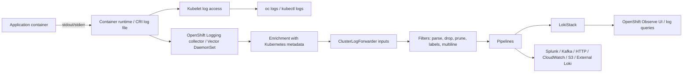
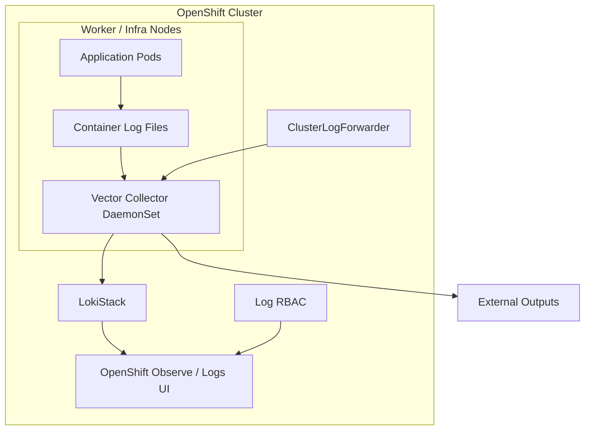

# Application Logs in OpenShift Logging — Advanced OpenShift Administration Guide

**Audience:** Senior OpenShift / Kubernetes administrators, SREs, platform engineers, and candidates preparing for advanced OpenShift administration.

**Scope:** This guide explains application logs in OpenShift Logging at production depth: what they are, how they are generated, collected, enriched, routed, stored, secured, queried, tuned, and troubleshot.

**Version focus:** Modern Red Hat OpenShift Logging 6.x style configuration using `observability.openshift.io/v1` `ClusterLogForwarder`, Vector-based collectors, LokiStack, and OpenShift log RBAC. Older OpenShift Logging 5.x and legacy Elasticsearch/Fluentd notes are included where they matter operationally.

---

## Table of Contents

1. [What Are Application Logs?](#1-what-are-application-logs)
2. [Why Application Logs Matter in OpenShift](#2-why-application-logs-matter-in-openshift)
3. [Application Logs vs Infrastructure Logs vs Audit Logs](#3-application-logs-vs-infrastructure-logs-vs-audit-logs)
4. [End-to-End Log Flow](#4-end-to-end-log-flow)
5. [How Applications Should Emit Logs](#5-how-applications-should-emit-logs)
6. [Native OpenShift / Kubernetes Log Access](#6-native-openshift--kubernetes-log-access)
7. [OpenShift Logging Architecture for Application Logs](#7-openshift-logging-architecture-for-application-logs)
8. [Core Objects and Components](#8-core-objects-and-components)
9. [Installing / Preparing Logging for Application Logs](#9-installing--preparing-logging-for-application-logs)
10. [Collector Service Account and RBAC](#10-collector-service-account-and-rbac)
11. [Basic ClusterLogForwarder: Application Logs to LokiStack](#11-basic-clusterlogforwarder-application-logs-to-lokistack)
12. [Selecting Specific Application Logs](#12-selecting-specific-application-logs)
13. [Pipelines, Outputs, and Multi-Destination Routing](#13-pipelines-outputs-and-multi-destination-routing)
14. [Filters for Application Logs](#14-filters-for-application-logs)
15. [Structured JSON Logs and Parse Strategy](#15-structured-json-logs-and-parse-strategy)
16. [Multi-Line Exception Handling](#16-multi-line-exception-handling)
17. [Application Log RBAC and Tenancy](#17-application-log-rbac-and-tenancy)
18. [Viewing and Querying Application Logs](#18-viewing-and-querying-application-logs)
19. [Tuning, Rate Limits, Durability, and Cost Control](#19-tuning-rate-limits-durability-and-cost-control)
20. [Security, Privacy, and Compliance](#20-security-privacy-and-compliance)
21. [Operational Best Practices](#21-operational-best-practices)
22. [Troubleshooting Playbook](#22-troubleshooting-playbook)
23. [Production Design Patterns](#23-production-design-patterns)
24. [Advanced Lab Scenarios](#24-advanced-lab-scenarios)
25. [Command Cheat Sheet](#25-command-cheat-sheet)
26. [Interview / Real-World Questions](#26-interview--real-world-questions)
27. [Summary](#27-summary)
28. [References](#28-references)

---

## 1. What Are Application Logs?

In OpenShift, **application logs** are the log messages generated by user workloads running in pods. In practical terms, these are usually the messages that application containers write to:

- `stdout`
- `stderr`

Examples:

```text
2026-07-03T10:15:22Z INFO  service=payment-api request_id=abc123 message="payment authorized"
2026-07-03T10:15:23Z ERROR service=payment-api request_id=abc123 message="database timeout"
```

From an OpenShift Logging perspective, the built-in `application` input selects logs from **user-deployed application containers** and excludes infrastructure namespaces such as `openshift-*`, `kube-*`, and `default` depending on the current logging classification rules.

A senior administrator should understand that application logs are not simply text output. They are operational telemetry. They help answer:

- Why did a request fail?
- Which pod handled a transaction?
- Which deployment introduced errors?
- Is latency caused by the app, dependency, DNS, network, database, or storage?
- Is a tenant generating too much logging traffic?
- Are secrets or PII leaking into logs?
- Are logs available to the correct team and hidden from everyone else?

Application logs are one part of observability. They complement:

- **Metrics**: numeric time-series data such as CPU usage, request rate, error rate, latency.
- **Traces**: request flow across services.
- **Events**: Kubernetes object lifecycle events.
- **Audit logs**: API activity and security-relevant actions.

A 10-year experienced administrator does not treat logs as a dumping ground. They design the log pipeline with clear rules for ownership, retention, routing, security, cost, and failure behavior.

---

## 2. Why Application Logs Matter in OpenShift

OpenShift runs dynamic, distributed workloads. Pods are short-lived, nodes are replaceable, and applications scale horizontally. That means local log files inside containers are not enough.

Application logs matter because they provide:

### 2.1 Debugging

When a pod fails, `oc logs` is often the fastest first command. For example:

```bash
oc logs -n payments deploy/payment-api
oc logs -n payments pod/payment-api-6f4dbd9c7d-7tx6m -c api
oc logs -n payments pod/payment-api-6f4dbd9c7d-7tx6m --previous
```

### 2.2 Incident response

During an outage, centralized logs help answer:

- When did errors start?
- Which deployment version was active?
- Which namespace or team is affected?
- Are failures isolated to one node, zone, app, or route?
- Are errors correlated with API server events, DNS errors, image pull failures, or storage problems?

### 2.3 Developer self-service

Developers need logs for their namespaces without requiring cluster-admin access. OpenShift Logging plus LokiStack tenancy and RBAC allows controlled log visibility.

### 2.4 Security and compliance

Application logs can contain sensitive data. Platform teams must prevent accidental leakage of:

- passwords
- tokens
- authorization headers
- cookies
- personal data
- financial data
- session identifiers
- internal endpoint details

### 2.5 Capacity and cost control

Logs can become expensive quickly. A noisy application can generate millions of records per hour. If logs are forwarded to Splunk, CloudWatch, Kafka, S3, or a SaaS logging platform, ingestion and storage costs can increase sharply.

A production-grade log design includes:

- rate limits
- max message sizes
- filters
- retention controls
- routing by namespace/team
- separate short-term and long-term destinations
- alerting on dropped or rate-limited logs

---

## 3. Application Logs vs Infrastructure Logs vs Audit Logs

OpenShift Logging normally classifies logs into three high-level categories.

| Log Type | Source | Typical Owner | Examples | Common Destination |
|---|---|---|---|---|
| Application | User workload containers | App teams / SREs | Java app logs, Node.js API logs, NGINX app container logs | LokiStack, Splunk, Kafka, external Loki |
| Infrastructure | OpenShift and Kubernetes platform components, node journal logs | Platform/SRE team | kubelet, CRI-O, router, registry, operator pods | LokiStack, Elasticsearch, Splunk |
| Audit | API and security activity | Security/compliance team | Kubernetes API audit, OpenShift API audit, OVN audit, node `auditd` | SIEM, S3, secure external archive |

Important distinction:

- A pod running in a normal project such as `payments` produces **application logs**.
- A pod running in `openshift-ingress`, `openshift-apiserver`, or `kube-*` is normally treated as **infrastructure**, even though technically it is also a container.
- API activity is **audit**, not application logging.

This distinction matters because each log type has different RBAC permissions, storage policy, retention policy, and sensitivity.

---

## 4. End-to-End Log Flow

High-level flow:



There are two important paths:

### 4.1 Direct pod log path

`oc logs` talks through the Kubernetes API to retrieve logs from the node where the pod runs.

Use this for immediate troubleshooting:

```bash
oc logs -n myapp pod/myapp-abc123
oc logs -n myapp deploy/myapp --tail=100
oc logs -n myapp deploy/myapp -f
```

This is not a full centralized logging system. It depends on the current pod/node log availability.

### 4.2 Centralized logging path

OpenShift Logging deploys collectors as DaemonSet pods. A collector runs on nodes, reads container logs, enriches them, applies `ClusterLogForwarder` logic, and sends them to one or more outputs.

Use centralized logging for:

- historical troubleshooting
- searching across pods and replicas
- namespace/team-level access
- external forwarding
- retention and compliance workflows
- multi-cluster observability

---

## 5. How Applications Should Emit Logs

### 5.1 Write to stdout and stderr

The Kubernetes-native logging model expects containers to write logs to `stdout` and `stderr`. Avoid writing important logs only to local files inside the container filesystem.

Good container behavior:

```bash
java -jar app.jar
# app logs to stdout/stderr through the runtime logger
```

Bad container behavior:

```bash
java -jar app.jar >> /var/log/myapp/app.log 2>&1
# logs stay inside the container filesystem unless sidecar/agent is added
```

Why stdout/stderr matters:

- `oc logs` can read it.
- Node-level log collectors can collect it.
- Log rotation is handled outside the application.
- Pods can be deleted without needing manual file retrieval.
- Central logging tools can enrich logs with Kubernetes metadata.

### 5.2 Use structured logs where possible

For serious production applications, plain text is less useful than JSON or key-value structured logs.

Plain text:

```text
ERROR failed to connect to db
```

Structured JSON:

```json
{
  "timestamp": "2026-07-03T10:15:22.123Z",
  "level": "error",
  "service": "payment-api",
  "namespace": "payments-prod",
  "trace_id": "7f3c2e8b8a",
  "request_id": "req-12345",
  "user_id_hash": "a91e...",
  "message": "database connection timeout",
  "duration_ms": 2500
}
```

Structured logs make filtering and searching much easier:

- `level=error`
- `service=payment-api`
- `trace_id=...`
- `duration_ms > 1000`
- `http.status_code >= 500`

### 5.3 Include correlation fields

At minimum, application logs should include:

| Field | Purpose |
|---|---|
| `timestamp` | Event time |
| `level` | Debug, info, warning, error, fatal |
| `service` | Logical service name |
| `version` | App version / image tag / git SHA |
| `request_id` | Request correlation |
| `trace_id` | Distributed tracing correlation |
| `span_id` | Trace span correlation |
| `tenant` | Business tenant, if applicable |
| `message` | Human-readable summary |
| `error.kind` | Exception type |
| `error.stack` | Stack trace if needed |

### 5.4 Avoid secrets and PII

Never log:

- passwords
- OAuth tokens
- bearer tokens
- session cookies
- full credit card numbers
- private keys
- full Aadhaar/PAN/passport data
- database connection strings with credentials
- complete authorization headers

Safer patterns:

```text
user_id_hash=2f83d9 action=login result=success
```

Instead of:

```text
user_email=rakesh@example.com password=Secret123 token=eyJhbGciOi...
```

### 5.5 Log levels must be controlled

Production default should usually be `info` or `warning`. `debug` should be temporary and controlled through configuration.

Bad pattern:

```yaml
env:
- name: LOG_LEVEL
  value: debug
```

Better pattern:

```yaml
env:
- name: LOG_LEVEL
  valueFrom:
    configMapKeyRef:
      name: payment-api-config
      key: LOG_LEVEL
```

Then change log level without rebuilding the image.

### 5.6 Do not use logs for metrics

Do not log every metric sample and expect the logging stack to behave like Prometheus. Use logs for events, errors, and diagnostic context. Use metrics for counters, gauges, and histograms.

---

## 6. Native OpenShift / Kubernetes Log Access

Central logging is not required for basic pod log access.

### 6.1 Current pod logs

```bash
oc logs -n myapp pod/myapp-abc123
```

### 6.2 Follow logs

```bash
oc logs -n myapp pod/myapp-abc123 -f
```

### 6.3 Deployment logs

```bash
oc logs -n myapp deploy/myapp
oc logs -n myapp deploy/myapp --tail=200
```

### 6.4 Multi-container pod logs

```bash
oc get pod -n myapp mypod -o jsonpath='{.spec.containers[*].name}'
oc logs -n myapp pod/mypod -c api
oc logs -n myapp pod/mypod -c sidecar
```

### 6.5 Previous crashed container logs

Very important for `CrashLoopBackOff`:

```bash
oc logs -n myapp pod/myapp-abc123 --previous
oc logs -n myapp pod/myapp-abc123 -c api --previous
```

### 6.6 Logs by label

```bash
oc logs -n myapp -l app=payment-api --tail=100
oc logs -n myapp -l app=payment-api --all-containers=true
```

### 6.7 Time-bounded logs

```bash
oc logs -n myapp deploy/payment-api --since=15m
oc logs -n myapp deploy/payment-api --since-time=2026-07-03T10:00:00Z
```

### 6.8 Limit bytes

```bash
oc logs -n myapp pod/myapp-abc123 --limit-bytes=1048576
```

### 6.9 Important limitations of `oc logs`

`oc logs` is excellent for immediate troubleshooting, but it has limitations:

- Logs are tied to pod and node lifecycle.
- Searching across many namespaces is difficult.
- Retention is limited by node/container runtime rotation.
- It is not designed for compliance retention.
- It does not provide rich indexing or team dashboards.
- It is not a replacement for central log forwarding.

---

## 7. OpenShift Logging Architecture for Application Logs

Modern OpenShift Logging is usually built from these parts:



### 7.1 Vector collector

The collector is the log agent. It generally runs as a DaemonSet so every node that hosts workloads has a local collector. Its responsibilities include:

- reading container logs from the node
- detecting log source metadata
- enriching records with Kubernetes metadata
- applying input selection
- applying filters
- forwarding records to outputs
- exposing health/status/metrics

### 7.2 ClusterLogForwarder

`ClusterLogForwarder` is the key custom resource used to define:

- which logs are collected
- which logs are selected by namespace/container/pod labels
- which filters are applied
- which outputs receive the logs
- which service account identity the collector uses
- optional tuning such as rate limits and delivery mode

Modern API example:

```yaml
apiVersion: observability.openshift.io/v1
kind: ClusterLogForwarder
metadata:
  name: instance
  namespace: openshift-logging
spec:
  serviceAccount:
    name: collector
  outputs:
  - name: default-lokistack
    type: lokiStack
    lokiStack:
      target:
        name: logging-loki
        namespace: openshift-logging
  pipelines:
  - name: app-logs-to-loki
    inputRefs:
    - application
    outputRefs:
    - default-lokistack
```

### 7.3 LokiStack

LokiStack is Red Hat managed Loki for OpenShift Logging. It is generally used for short-term, indexed log troubleshooting with OpenShift tenancy integration.

Important points:

- Loki is optimized for label-based log querying.
- LokiStack uses object storage for chunks/index data depending on deployment.
- LokiStack supports OpenShift log tenants such as application, infrastructure, and audit.
- Access is controlled through OpenShift RBAC and LokiStack tenancy.
- For long-term compliance retention, many organizations forward selected logs to S3, Splunk, Kafka, or SIEM.

### 7.4 Cluster Observability UI

The OpenShift web console can expose log viewing through the Observe / Logs experience when required operators and UI plugins are installed.

### 7.5 External outputs

A platform team can send application logs to:

- LokiStack
- external Loki
- Splunk HEC
- Kafka
- HTTP endpoint
- Elasticsearch
- Amazon CloudWatch
- Google Cloud Logging
- Azure Monitor Logs
- syslog
- S3-compatible object storage

The exact supported output types depend on OpenShift Logging version.

---

## 8. Core Objects and Components

### 8.1 Namespace

Most logging resources are deployed in:

```text
openshift-logging
```

Check:

```bash
oc get ns openshift-logging
```

### 8.2 Operators

Common operators:

| Operator | Purpose |
|---|---|
| Red Hat OpenShift Logging Operator | Manages collector and log forwarding |
| Loki Operator | Manages LokiStack |
| Cluster Observability Operator | Provides observability UI/plugin integration |

A forwarding-only deployment might use only the Red Hat OpenShift Logging Operator if logs are sent to external destinations and no in-cluster LokiStack is required.

### 8.3 ClusterLogForwarder CRD

Check the installed API:

```bash
oc api-resources | grep -i clusterlogforwarder
oc explain clusterlogforwarder
oc explain clusterlogforwarder.spec
```

List CLFs:

```bash
oc get clusterlogforwarder -A
```

Inspect status:

```bash
oc get clusterlogforwarder -n openshift-logging instance -o yaml
```

### 8.4 Collector DaemonSet / pods

List collectors:

```bash
oc get pods -n openshift-logging -l app.kubernetes.io/component=collector -o wide
```

If there are multiple `ClusterLogForwarder` resources in a namespace, filter by instance label:

```bash
oc get pods -n openshift-logging \
  -l app.kubernetes.io/component=collector,app.kubernetes.io/instance=instance
```

### 8.5 Cluster roles for collection

Collection permissions are separate by log type:

| ClusterRole | Allows collector to read |
|---|---|
| `collect-application-logs` | User application logs |
| `collect-infrastructure-logs` | Infrastructure logs |
| `collect-audit-logs` | Audit logs |

Do not add `application`, `infrastructure`, or `audit` to `inputRefs` unless the collector service account has the matching role binding.

### 8.6 Log viewing RBAC

Viewing permissions are also separate:

| ClusterRole | Allows user/group to read |
|---|---|
| `cluster-logging-application-view` | Application logs |
| `cluster-logging-infrastructure-view` | Infrastructure logs |
| `cluster-logging-audit-view` | Audit logs |

---

## 9. Installing / Preparing Logging for Application Logs

This section is a practical outline. Always compare with your exact OpenShift and OpenShift Logging release documentation.

### 9.1 Create logging namespace

```bash
oc create namespace openshift-logging
```

### 9.2 Install Loki Operator

Example subscription style:

```yaml
apiVersion: operators.coreos.com/v1alpha1
kind: Subscription
metadata:
  name: loki-operator
  namespace: openshift-operators-redhat
spec:
  channel: stable-6.4
  installPlanApproval: Automatic
  name: loki-operator
  source: redhat-operators
  sourceNamespace: openshift-marketplace
```

Apply:

```bash
oc apply -f loki-subscription.yaml
```

### 9.3 Install OpenShift Logging Operator

```yaml
apiVersion: operators.coreos.com/v1
kind: OperatorGroup
metadata:
  name: cluster-logging
  namespace: openshift-logging
spec:
  upgradeStrategy: Default
---
apiVersion: operators.coreos.com/v1alpha1
kind: Subscription
metadata:
  name: cluster-logging
  namespace: openshift-logging
spec:
  channel: stable-6.4
  installPlanApproval: Automatic
  name: cluster-logging
  source: redhat-operators
  sourceNamespace: openshift-marketplace
```

Apply:

```bash
oc apply -f openshift-logging-operator.yaml
```

### 9.4 Create object storage secret for LokiStack

For S3-compatible storage, a secret generally contains access key, secret key, bucket name, endpoint, and region. Example only:

```yaml
apiVersion: v1
kind: Secret
metadata:
  name: logging-loki-s3
  namespace: openshift-logging
type: Opaque
stringData:
  access_key_id: <access_key>
  access_key_secret: <secret_key>
  bucketnames: <bucket_name>
  endpoint: https://s3.example.com:9000
  region: us-east-1
```

Apply:

```bash
oc apply -f loki-s3-secret.yaml
```

### 9.5 Create LokiStack

Example:

```yaml
apiVersion: loki.grafana.com/v1
kind: LokiStack
metadata:
  name: logging-loki
  namespace: openshift-logging
spec:
  size: 1x.extra-small
  storage:
    schemas:
    - version: v13
      effectiveDate: "2024-10-01"
    secret:
      name: logging-loki-s3
      type: s3
  storageClassName: gp3-csi
  tenants:
    mode: openshift-logging
```

Apply:

```bash
oc apply -f lokistack.yaml
```

Verify:

```bash
oc get lokistack -n openshift-logging
oc get pods -n openshift-logging | grep loki
```

---

## 10. Collector Service Account and RBAC

Before creating a `ClusterLogForwarder` that references application logs, create a service account and grant the matching collection role.

### 10.1 Create service account

```bash
oc create sa collector -n openshift-logging
```

### 10.2 Grant application log collection permission

```bash
oc adm policy add-cluster-role-to-user collect-application-logs \
  system:serviceaccount:openshift-logging:collector
```

### 10.3 Grant infrastructure log collection if required

```bash
oc adm policy add-cluster-role-to-user collect-infrastructure-logs \
  system:serviceaccount:openshift-logging:collector
```

### 10.4 Grant audit log collection only if required

```bash
oc adm policy add-cluster-role-to-user collect-audit-logs \
  system:serviceaccount:openshift-logging:collector
```

### 10.5 Verify bindings

```bash
oc get clusterrolebinding -o wide | grep collect
```

Expected style:

```text
collect-application-logs     ClusterRole/collect-application-logs     system:serviceaccount:openshift-logging:collector
collect-infrastructure-logs  ClusterRole/collect-infrastructure-logs  system:serviceaccount:openshift-logging:collector
```

### 10.6 Critical production warning

If a `ClusterLogForwarder` references a log type that the collector service account is not authorized to collect, the operator can remove the collector DaemonSet to avoid insecure or partial operation. That stops log collection.

For example, this is dangerous if audit permission was not granted:

```yaml
pipelines:
- name: all-logs
  inputRefs:
  - application
  - infrastructure
  - audit
```

Correct sequence:

1. Grant `collect-audit-logs`.
2. Confirm binding exists.
3. Update `ClusterLogForwarder`.
4. Verify CLF conditions.
5. Verify collector pods.

---

## 11. Basic ClusterLogForwarder: Application Logs to LokiStack

### 11.1 Minimal CLF for application logs

```yaml
apiVersion: observability.openshift.io/v1
kind: ClusterLogForwarder
metadata:
  name: instance
  namespace: openshift-logging
spec:
  serviceAccount:
    name: collector
  outputs:
  - name: default-lokistack
    type: lokiStack
    lokiStack:
      target:
        name: logging-loki
        namespace: openshift-logging
  pipelines:
  - name: app-logs-to-loki
    inputRefs:
    - application
    outputRefs:
    - default-lokistack
```

Apply:

```bash
oc apply -f clf-app-to-loki.yaml
```

Verify status:

```bash
oc get clusterlogforwarder instance -n openshift-logging -o yaml
oc get clusterlogforwarder instance -n openshift-logging \
  -o jsonpath='{.status.conditions[?(@.type=="Ready")].status}{"\n"}'
```

Verify collectors:

```bash
oc get pods -n openshift-logging -l app.kubernetes.io/component=collector -o wide
```

### 11.2 Generate sample application logs

```bash
oc new-project app-logs-demo
oc create deployment log-generator \
  --image=registry.access.redhat.com/ubi9/ubi \
  -- /bin/bash -c 'while true; do echo "{\"level\":\"info\",\"service\":\"demo\",\"message\":\"hello from OpenShift\",\"time\":\"$(date -Is)\"}"; sleep 5; done'
```

Check direct logs:

```bash
oc logs -n app-logs-demo deploy/log-generator --tail=10
```

Check central logs in UI or Loki query after the collector forwards them.

---

## 12. Selecting Specific Application Logs

Production clusters rarely send every log from every application to the same destination. You usually need selection by namespace, container, labels, environment, or team.

### 12.1 Include a specific namespace

```yaml
apiVersion: observability.openshift.io/v1
kind: ClusterLogForwarder
metadata:
  name: payments-forwarder
  namespace: openshift-logging
spec:
  serviceAccount:
    name: collector
  outputs:
  - name: default-lokistack
    type: lokiStack
    lokiStack:
      target:
        name: logging-loki
        namespace: openshift-logging
  inputs:
  - name: payments-app-logs
    type: application
    application:
      includes:
      - namespace: payments-prod
  pipelines:
  - name: payments-to-loki
    inputRefs:
    - payments-app-logs
    outputRefs:
    - default-lokistack
```

### 12.2 Include namespace and container

```yaml
inputs:
- name: api-container-logs
  type: application
  application:
    includes:
    - namespace: payments-prod
      container: payment-api
```

### 12.3 Exclude noisy containers

```yaml
inputs:
- name: app-without-sidecar-noise
  type: application
  application:
    includes:
    - namespace: payments-prod
    excludes:
    - namespace: payments-prod
      container: istio-proxy
```

Important: `excludes` takes precedence over `includes`.

### 12.4 Select by pod labels

This is common when multiple applications run in the same namespace.

```yaml
inputs:
- name: frontend-prod-logs
  type: application
  application:
    includes:
    - namespace: retail-prod
    selector:
      matchLabels:
        app: frontend
        environment: production
```

### 12.5 Use match expressions

```yaml
inputs:
- name: selected-app-logs
  type: application
  application:
    selector:
      matchExpressions:
      - key: env
        operator: In
        values: ["prod", "qa"]
      - key: zone
        operator: NotIn
        values: ["test-lab"]
      matchLabels:
        team: payments
```

### 12.6 Design guidance

Use **custom inputs** for source selection. Use **filters** for content transformation and record-level dropping.

Preferred:

```yaml
inputs:
- name: prod-payments
  type: application
  application:
    includes:
    - namespace: payments-prod
```

Less preferred for source selection:

```yaml
filters:
- name: drop-everything-except-payments
  type: drop
```

Why custom inputs are better:

- less collection/processing overhead
- cleaner pipeline semantics
- easier team ownership
- easier troubleshooting
- fewer accidental drops

---

## 13. Pipelines, Outputs, and Multi-Destination Routing

A pipeline connects:

```text
inputRefs -> filterRefs -> outputRefs
```

### 13.1 Application logs to LokiStack and Splunk

```yaml
apiVersion: observability.openshift.io/v1
kind: ClusterLogForwarder
metadata:
  name: app-routing
  namespace: openshift-logging
spec:
  serviceAccount:
    name: collector
  outputs:
  - name: default-lokistack
    type: lokiStack
    lokiStack:
      target:
        name: logging-loki
        namespace: openshift-logging
  - name: splunk-prod
    type: splunk
    splunk:
      url: https://splunk-hec.example.com:8088
      authentication:
        token:
          secretName: splunk-hec-token
          key: token
  pipelines:
  - name: apps-to-loki-and-splunk
    inputRefs:
    - application
    outputRefs:
    - default-lokistack
    - splunk-prod
```

### 13.2 Separate developer and compliance paths

```yaml
apiVersion: observability.openshift.io/v1
kind: ClusterLogForwarder
metadata:
  name: split-app-routing
  namespace: openshift-logging
spec:
  serviceAccount:
    name: collector
  outputs:
  - name: team-loki
    type: lokiStack
    lokiStack:
      target:
        name: logging-loki
        namespace: openshift-logging
  - name: kafka-archive
    type: kafka
    kafka:
      brokers:
      - kafka-1.example.com:9092
      - kafka-2.example.com:9092
      topic: openshift-application-logs
  inputs:
  - name: payments-prod
    type: application
    application:
      includes:
      - namespace: payments-prod
  filters:
  - name: add-prod-labels
    type: openshiftLabels
    openshiftLabels:
      environment: prod
      team: payments
      compliance: pci-reviewed
  pipelines:
  - name: payments-short-term
    inputRefs:
    - payments-prod
    filterRefs:
    - add-prod-labels
    outputRefs:
    - team-loki
  - name: payments-long-term
    inputRefs:
    - payments-prod
    filterRefs:
    - add-prod-labels
    outputRefs:
    - kafka-archive
```

### 13.3 If one output fails

Each output is treated independently. If you send the same record to LokiStack and Splunk and Splunk fails, the collector can continue forwarding to LokiStack. However, the failed output may drop, retry, or buffer depending on tuning and output behavior.

### 13.4 Common output choices

| Destination | Best Use |
|---|---|
| LokiStack | OpenShift-native short-term app troubleshooting |
| External Loki | Enterprise Grafana/Loki platform |
| Splunk HEC | Enterprise search, dashboards, alerting |
| Kafka | Decoupling, streaming, downstream processing |
| HTTP | Custom receiver/webhook/log gateway |
| S3 | Low-cost archive and compliance retention |
| CloudWatch | AWS-native workload operations |
| Syslog | Legacy SIEM or network logging integration |

---

## 14. Filters for Application Logs

Filters transform, enrich, reduce, or drop records before output.

Common filter types:

| Filter | Purpose |
|---|---|
| `drop` | Drop entire records matching conditions |
| `prune` | Remove or keep selected fields |
| `parse` | Parse JSON log messages into structured fields |
| `openshiftLabels` | Add custom OpenShift labels to records |
| `detectMultilineException` | Merge stack traces into one record |
| `kubeAPIAudit` | Audit-specific filtering, not normally for application logs |

### 14.1 Drop noisy debug logs

```yaml
filters:
- name: drop-debug
  type: drop
  drop:
  - test:
    - field: .level
      matches: debug
pipelines:
- name: app-to-loki
  inputRefs:
  - application
  filterRefs:
  - drop-debug
  outputRefs:
  - default-lokistack
```

### 14.2 Keep only important records

This filter drops lower-value logs that do not contain `critical` or `error` and are at info/warning level.

```yaml
filters:
- name: important-only
  type: drop
  drop:
  - test:
    - field: .message
      notMatches: "(?i)critical|error"
    - field: .level
      matches: "info|warning"
```

### 14.3 Drop health check noise

```yaml
filters:
- name: drop-health-checks
  type: drop
  drop:
  - test:
    - field: .message
      matches: "GET /healthz|GET /readyz|GET /metrics"
```

### 14.4 Add ownership labels

```yaml
filters:
- name: team-labels
  type: openshiftLabels
  openshiftLabels:
    team: payments
    environment: production
    costCenter: cc-1024
```

### 14.5 Prune high-volume metadata

```yaml
filters:
- name: prune-app-noise
  type: prune
  prune:
    in:
    - .kubernetes.annotations
    - .kubernetes.labels."pod-template-hash"
```

### 14.6 Keep only selected fields

```yaml
filters:
- name: keep-minimal
  type: prune
  prune:
    notIn:
    - .message
    - .level
    - .log_type
    - .log_source
    - .kubernetes.namespace_name
    - .kubernetes.pod_name
    - .kubernetes.container_name
    - .structured
```

Be careful: some fields are required and cannot be pruned, including key log type/source/message and Kubernetes namespace/pod/container fields. LokiStack also requires default stream label fields.

### 14.7 Filter order matters

Recommended order:

1. `parse` early if you need structured fields.
2. `drop` unwanted records before spending more CPU on them.
3. `prune` fields after deciding the record is useful.
4. `openshiftLabels` near the end for downstream routing/ownership.
5. `detectMultilineException` where stack trace reconstruction is needed.

Example:

```yaml
pipelines:
- name: app-pipeline
  inputRefs:
  - application
  filterRefs:
  - parse-json
  - drop-health-checks
  - prune-app-noise
  - team-labels
  outputRefs:
  - default-lokistack
```

---

## 15. Structured JSON Logs and Parse Strategy

### 15.1 Why parse JSON logs

If an application prints JSON as a string, the log record initially contains that JSON in the `message` field. A parse filter attempts to parse it and add structured fields.

Example application output:

```json
{"level":"error","service":"payment-api","request_id":"req-123","message":"database timeout"}
```

With parsing, downstream systems can query structured fields rather than only full-text message content.

### 15.2 Parse filter example

```yaml
filters:
- name: parse-json
  type: parse
pipelines:
- name: parse-app-logs
  inputRefs:
  - application
  filterRefs:
  - parse-json
  outputRefs:
  - default-lokistack
```

### 15.3 Application JSON logging best practices

Use consistent keys:

```json
{
  "timestamp": "2026-07-03T10:20:00.000Z",
  "level": "info",
  "service": "payment-api",
  "version": "1.4.7",
  "trace_id": "4bf92f3577b34da6a3ce929d0e0e4736",
  "span_id": "00f067aa0ba902b7",
  "request_id": "req-90210",
  "http.method": "POST",
  "http.path": "/payments",
  "http.status_code": 201,
  "duration_ms": 82,
  "message": "payment created"
}
```

Avoid changing field names between services:

Bad:

```json
{"traceId":"..."}
{"trace_id":"..."}
{"x_trace":"..."}
```

Good:

```json
{"trace_id":"..."}
```

### 15.4 Do not over-index labels

With Loki, high-cardinality labels can be expensive and slow. Avoid turning highly unique fields into stream labels:

- request ID
- trace ID
- user ID
- order ID
- session ID

Use those as searchable fields in the log body/structured payload, not as stream labels.

Good labels:

- namespace
- pod
- container
- app
- environment
- team

Bad labels:

- request_id
- user_id
- transaction_id
- stacktrace hash

---

## 16. Multi-Line Exception Handling

Many languages print stack traces over multiple lines:

```text
java.lang.NullPointerException: Cannot invoke "String.toString()"
    at com.example.PaymentService.authorize(PaymentService.java:47)
    at com.example.PaymentController.create(PaymentController.java:19)
    at java.base/jdk.internal.reflect.NativeMethodAccessorImpl.invoke0(Native Method)
```

Without multi-line handling, each line can become a separate log record. That makes searching and alerting harder.

OpenShift Logging supports `detectMultilineException` for common languages such as Java, JavaScript, Ruby, Python, Go, PHP, and Dart.

Example:

```yaml
apiVersion: observability.openshift.io/v1
kind: ClusterLogForwarder
metadata:
  name: multiline-app-logs
  namespace: openshift-logging
spec:
  serviceAccount:
    name: collector
  outputs:
  - name: default-lokistack
    type: lokiStack
    lokiStack:
      target:
        name: logging-loki
        namespace: openshift-logging
  filters:
  - name: detect-stacktraces
    type: detectMultilineException
  pipelines:
  - name: app-errors-to-loki
    inputRefs:
    - application
    filterRefs:
    - detect-stacktraces
    outputRefs:
    - default-lokistack
```

Production caution:

- Multi-line detection can increase CPU and memory usage.
- Test on high-volume namespaces before enabling cluster-wide.
- Prefer structured exception logging from application frameworks when possible.

---

## 17. Application Log RBAC and Tenancy

Collecting logs and viewing logs are separate concerns.

### 17.1 Collector RBAC

Collector service account needs:

```bash
oc adm policy add-cluster-role-to-user collect-application-logs \
  system:serviceaccount:openshift-logging:collector
```

### 17.2 User view RBAC

To allow a user to read application logs in one namespace:

```yaml
kind: RoleBinding
apiVersion: rbac.authorization.k8s.io/v1
metadata:
  name: allow-read-application-logs
  namespace: payments-prod
roleRef:
  apiGroup: rbac.authorization.k8s.io
  kind: ClusterRole
  name: cluster-logging-application-view
subjects:
- kind: User
  apiGroup: rbac.authorization.k8s.io
  name: developer1
```

Apply:

```bash
oc apply -f log-view-rb.yaml
```

### 17.3 Cluster-wide application log read access

For a group:

```yaml
kind: ClusterRoleBinding
apiVersion: rbac.authorization.k8s.io/v1
metadata:
  name: app-logs-readers
roleRef:
  apiGroup: rbac.authorization.k8s.io
  kind: ClusterRole
  name: cluster-logging-application-view
subjects:
- kind: Group
  apiGroup: rbac.authorization.k8s.io
  name: app-sre-team
```

Use cluster-wide access carefully. Application logs can contain sensitive business data.

### 17.4 Admin groups with LokiStack

In LokiStack `openshift-logging` tenancy mode, admin groups can be configured so members can act as log administrators.

Example:

```yaml
apiVersion: loki.grafana.com/v1
kind: LokiStack
metadata:
  name: logging-loki
  namespace: openshift-logging
spec:
  tenants:
    mode: openshift-logging
    openshift:
      adminGroups:
      - cluster-admin
      - logging-admins
```

### 17.5 Namespaced access note

Users with namespace-scoped access must query application logs for namespaces they are allowed to read. Do not expect namespace-scoped users to query across all namespaces.

---

## 18. Viewing and Querying Application Logs

### 18.1 Direct CLI view

```bash
oc logs -n payments-prod deploy/payment-api --tail=50
```

### 18.2 OpenShift web console

In the web console, use Observe / Logs if enabled. The exact UI changes across versions, but the concept is:

1. Select tenant/source such as application logs.
2. Select namespace.
3. Filter by pod/container/app labels.
4. Search message text or structured fields.
5. Change time range.

### 18.3 Loki-style queries

Common label-style patterns:

```logql
{namespace_name="payments-prod"}
```

```logql
{namespace_name="payments-prod", pod_name=~"payment-api-.*"}
```

```logql
{namespace_name="payments-prod"} |= "ERROR"
```

```logql
{namespace_name="payments-prod"} | json | level="error"
```

Label names can differ depending on UI, LokiStack mapping, and logging version. Inspect actual labels in your environment.

### 18.4 Query strategy during incident

Start broad, then narrow:

```text
1. namespace = affected project
2. app/pod/deployment = affected service
3. time range = incident window
4. level = error/warn
5. request_id/trace_id = specific transaction
6. compare previous deployment version
7. correlate with Kubernetes events and metrics
```

Useful commands:

```bash
oc get pods -n payments-prod -o wide
oc get deploy -n payments-prod payment-api -o yaml | grep -i image
oc rollout history deploy/payment-api -n payments-prod
oc get events -n payments-prod --sort-by=.lastTimestamp
oc describe pod -n payments-prod <pod>
```

---

## 19. Tuning, Rate Limits, Durability, and Cost Control

### 19.1 Input rate limit per container

Use this when one application is too noisy.

```yaml
inputs:
- name: high-volume-prod
  type: application
  application:
    includes:
    - namespace: production
    tuning:
      container:
        rateLimitPerContainer:
          maxRecordsPerSecond: 500
```

Meaning: each matching container can produce up to 500 records/sec before excess records are dropped.

### 19.2 Maximum message size

```yaml
inputs:
- name: application
  type: application
  application:
    tuning:
      container:
        maxMessageSize: 16Ki
```

Messages above the configured limit can be dropped after partial lines are merged.

### 19.3 Output rate limit

```yaml
outputs:
- name: limited-splunk
  type: splunk
  splunk:
    url: https://splunk.example.com:8088
    authentication:
      token:
        secretName: splunk-secret
        key: token
  rateLimit:
    maxRecordsPerSecond: 1000
```

Use output rate limits when the external platform has ingestion limits or cost constraints.

### 19.4 Important: rate limits drop logs

When rate limits are exceeded, records are dropped. This is not backpressure with infinite buffering. Monitor collector metrics and tune carefully.

Look for metrics such as:

```text
observability_log_forwarder_output_rate_limited_total
```

### 19.5 Delivery mode

Output tuning can prioritize durability or throughput.

Example:

```yaml
outputs:
- name: default-lokistack
  type: lokiStack
  lokiStack:
    target:
      name: logging-loki
      namespace: openshift-logging
    tuning:
      deliveryMode: AtLeastOnce
      compression: gzip
      maxWrite: 3Mi
      minRetryDuration: 2
      maxRetryDuration: 300
```

Conceptual meaning:

| Mode | Behavior | Tradeoff |
|---|---|---|
| `AtLeastOnce` | Collector attempts to resend logs read but not delivered after restart/failure | More durable, possible duplicates |
| `AtMostOnce` | Collector does not attempt recovery of lost logs after crash | Higher throughput, possible loss |
| unset/in-memory default | Low latency and high performance | Buffered data can be lost on process failure |

Choose based on business need:

- compliance archive: prefer durability
- high-volume debug stream: prefer throughput/cost control
- incident troubleshooting: balance latency and reliability

### 19.6 Compression

Compression reduces network usage but adds CPU overhead. Use it for remote destinations or expensive links. Test before cluster-wide rollout.

### 19.7 Storage cost controls

Control cost at multiple layers:

| Layer | Control |
|---|---|
| Application | log level, sampling, structured concise messages |
| Input | namespace/container selection, max message size, per-container rate limit |
| Filter | drop health checks/debug logs, prune metadata |
| Output | rate limit, compression, routing to cheaper archive |
| Store | retention, lifecycle policy, bucket tiering |

---

## 20. Security, Privacy, and Compliance

### 20.1 Application log sensitivity

Application logs can be more sensitive than infrastructure logs because they may contain customer data, business transaction data, or application payloads.

Security responsibilities:

- prevent secrets in logs
- restrict who can view logs
- prune unnecessary metadata
- route sensitive logs only to approved destinations
- encrypt in transit
- configure destination authentication securely
- define retention policies
- document audit/compliance controls

### 20.2 Secret handling for outputs

Do not hardcode tokens in `ClusterLogForwarder` YAML.

Create a secret:

```bash
oc create secret generic splunk-hec-token \
  -n openshift-logging \
  --from-literal=token='<SPLUNK_HEC_TOKEN>'
```

Reference it:

```yaml
outputs:
- name: splunk-prod
  type: splunk
  splunk:
    url: https://splunk.example.com:8088
    authentication:
      token:
        secretName: splunk-hec-token
        key: token
```

### 20.3 TLS

For external outputs, prefer TLS endpoints:

```yaml
syslog:
  url: tls://syslog.example.com:6514
```

Avoid plain TCP/UDP for sensitive logs unless the network is explicitly controlled and approved.

### 20.4 Prune sensitive fields

If app teams include sensitive fields, fix the application first. Use pruning as a defense-in-depth layer, not the only protection.

```yaml
filters:
- name: remove-sensitive-structured-fields
  type: prune
  prune:
    in:
    - .structured.password
    - .structured.authorization
    - .structured.cookie
    - .structured.token
```

### 20.5 RBAC least privilege

Do not bind `cluster-logging-application-view` to `system:authenticated` unless your organization explicitly accepts that risk.

Prefer:

- namespace RoleBinding for app team
- group-based access
- central logging admin group
- separate audit log access for security team only

### 20.6 Compliance archiving

If application logs are compliance-relevant:

- forward a copy to immutable archive or SIEM
- define retention by data classification
- ensure clock synchronization
- document chain of custody
- restrict deletion permissions
- test restore/search procedures

---

## 21. Operational Best Practices

### 21.1 Platform-level best practices

- Standardize log labels: `app`, `app.kubernetes.io/name`, `app.kubernetes.io/part-of`, `team`, `environment`.
- Separate dev, test, and prod log routing.
- Avoid cluster-wide collection of noisy non-prod debug logs.
- Use custom inputs for high-value namespaces.
- Use separate pipelines for different consumers.
- Use `openshiftLabels` for cost center/team metadata.
- Monitor collector CPU/memory and dropped log metrics.
- Document who owns each pipeline and output.
- Keep CLF YAML in GitOps.
- Test changes in non-prod before prod.

### 21.2 Application team best practices

- Log to stdout/stderr.
- Use structured JSON.
- Include `trace_id` and `request_id`.
- Keep message size reasonable.
- Never log secrets.
- Do not log full payloads by default.
- Use `debug` only temporarily.
- Make log level configurable.
- Use consistent time format, preferably RFC3339/ISO 8601 UTC.
- Include version/build metadata.

### 21.3 SRE incident best practices

During outage:

1. Confirm affected namespaces and deployments.
2. Check `oc get pods -o wide` for node/zone concentration.
3. Check direct logs with `oc logs --previous` for restarts.
4. Query centralized logs for incident window.
5. Correlate with deployments and config changes.
6. Check events, metrics, routes, services, endpoints, DNS, storage.
7. Capture relevant log excerpts with timestamps.
8. After incident, create filters/alerts/dashboards if needed.

### 21.4 GitOps best practices for CLF

Store files such as:

```text
logging/
  base/
    namespace.yaml
    serviceaccount.yaml
    collector-rbac.yaml
    lokistack.yaml
    clusterlogforwarder.yaml
  overlays/
    dev/
    prod/
```

Use PR review for:

- adding new outputs
- changing rate limits
- adding audit logs
- forwarding logs outside the cluster
- changing RBAC
- pruning required fields

---

## 22. Troubleshooting Playbook

### 22.1 User says: “I can see `oc logs`, but not logs in OpenShift console”

Check:

```bash
oc get clusterlogforwarder -A
oc get clusterlogforwarder instance -n openshift-logging -o yaml
oc get pods -n openshift-logging -l app.kubernetes.io/component=collector
oc get lokistack -n openshift-logging
```

Possible causes:

- CLF not created.
- Collector service account missing `collect-application-logs`.
- Collector pods not running.
- Output misconfigured.
- LokiStack not ready.
- User lacks `cluster-logging-application-view`.
- User is querying wrong namespace or time range.
- Application namespace excluded by input selector.

### 22.2 Collector pods are missing

Check CLF conditions:

```bash
oc get clusterlogforwarder instance -n openshift-logging -o yaml
```

Check operator logs:

```bash
oc logs -n openshift-logging deploy/cluster-logging-operator
```

Common cause:

- CLF references `application`, `infrastructure`, or `audit`, but collector service account lacks matching `collect-*` role.

Fix:

```bash
oc adm policy add-cluster-role-to-user collect-application-logs \
  system:serviceaccount:openshift-logging:collector
```

Then re-apply CLF or wait for reconciliation.

### 22.3 CLF Ready condition is False

Check:

```bash
oc get clusterlogforwarder instance -n openshift-logging \
  -o jsonpath='{range .status.conditions[*]}{.type}{"="}{.status}{" reason="}{.reason}{" message="}{.message}{"\n"}{end}'
```

Look for:

- authorization errors
- missing output secret
- invalid field
- unsupported output setting
- invalid prune field
- TLS/auth issue

### 22.4 Logs missing only from one namespace

Check whether the namespace is included/excluded:

```bash
oc get clusterlogforwarder instance -n openshift-logging -o yaml | less
```

Check pod labels:

```bash
oc get pods -n payments-prod --show-labels
```

If using label selector, make sure all required labels match.

### 22.5 Logs missing only from one container

Check container names:

```bash
oc get pod -n payments-prod <pod> -o jsonpath='{.spec.containers[*].name}{"\n"}'
oc get pod -n payments-prod <pod> -o jsonpath='{.spec.initContainers[*].name}{"\n"}'
```

Check CLF `includes` and `excludes` container patterns.

### 22.6 Application writes logs to a file, not stdout/stderr

Symptoms:

- `oc logs` is empty.
- Central logging has no app messages.
- Logs exist only inside the container filesystem.

Confirm:

```bash
oc exec -n myapp deploy/myapp -- ls -l /var/log/myapp/
oc exec -n myapp deploy/myapp -- tail -n 50 /var/log/myapp/app.log
```

Fix options:

1. Change app config to log to stdout/stderr.
2. Add a sidecar that tails the file to stdout.
3. Use an approved file log collection method if supported by your logging design.

Sidecar example pattern:

```yaml
containers:
- name: app
  image: example/myapp:1.0
  volumeMounts:
  - name: applogs
    mountPath: /var/log/myapp
- name: log-sidecar
  image: registry.access.redhat.com/ubi9/ubi
  command: ["/bin/bash", "-c"]
  args:
  - tail -n+1 -F /var/log/myapp/app.log
  volumeMounts:
  - name: applogs
    mountPath: /var/log/myapp
volumes:
- name: applogs
  emptyDir: {}
```

### 22.7 CrashLoopBackOff logs missing

Use previous logs:

```bash
oc logs -n myapp pod/<pod> --previous
```

If the container exits too quickly, increase startup diagnostics, add temporary sleep, or check events:

```bash
oc describe pod -n myapp <pod>
oc get events -n myapp --sort-by=.lastTimestamp
```

### 22.8 Duplicate logs

Possible causes:

- Same input routed through multiple pipelines to same output.
- Sidecar echoes logs that app also writes to stdout.
- Application logs to stdout and file-tail sidecar tails same content.
- `AtLeastOnce` delivery after collector restart can resend some records.

Check pipelines:

```bash
oc get clusterlogforwarder instance -n openshift-logging -o yaml
```

### 22.9 Logs are delayed

Possible causes:

- Output backpressure/retries.
- Network latency to external destination.
- LokiStack ingestion pressure.
- Collector CPU throttling.
- Too many multiline events.
- Large batches or retry settings.

Check:

```bash
oc top pods -n openshift-logging
oc describe pod -n openshift-logging <collector-pod>
oc logs -n openshift-logging <collector-pod>
```

### 22.10 Logs are dropped

Possible causes:

- input rate limit exceeded
- output rate limit exceeded
- max message size exceeded
- drop filter matched
- output rejected payload
- collector crash with non-durable buffering

Check metrics and collector logs. Review:

```yaml
rateLimitPerContainer:
  maxRecordsPerSecond: ...
rateLimit:
  maxRecordsPerSecond: ...
maxMessageSize: ...
```

### 22.11 User cannot view logs

Check RBAC:

```bash
oc auth can-i get pods/log -n payments-prod --as=developer1
oc get rolebinding -n payments-prod
oc get clusterrolebinding | grep cluster-logging-application-view
```

For LokiStack application log access, ensure user/group has `cluster-logging-application-view` via RoleBinding or ClusterRoleBinding as appropriate.

### 22.12 Logs from `openshift-*` namespace not appearing under application tenant

This is expected. Workloads in OpenShift/system namespaces are typically classified as infrastructure logs, not application logs. Use `infrastructure` input and grant `collect-infrastructure-logs`.

### 22.13 Splunk / external output not receiving logs

Check:

- secret exists
- URL is correct
- token valid
- TLS certificate trusted
- network policy allows egress
- proxy settings correct
- output type syntax valid
- external receiver accepts payload format

Commands:

```bash
oc get secret -n openshift-logging splunk-hec-token -o yaml
oc get networkpolicy -n openshift-logging
oc logs -n openshift-logging -l app.kubernetes.io/component=collector --tail=200
```

### 22.14 CLF YAML validates but logs not routed

Common mistakes:

- `inputRefs` references a custom input name typo.
- `outputRefs` references a missing output name.
- `filterRefs` references a missing filter name.
- Label selector does not match pod labels.
- Namespace name is wrong.
- App logs are in infrastructure namespace.
- Collector service account is in a different namespace than expected.

---

## 23. Production Design Patterns

### 23.1 Pattern: All application logs to LokiStack

Use for smaller clusters or initial rollout.

```yaml
pipelines:
- name: all-apps-to-loki
  inputRefs:
  - application
  outputRefs:
  - default-lokistack
```

Pros:

- simple
- quick troubleshooting
- easy developer adoption

Cons:

- cost/noise risk
- limited per-team routing
- less control

### 23.2 Pattern: Production namespaces to Splunk, all namespaces to LokiStack

```yaml
inputs:
- name: prod-apps
  type: application
  application:
    includes:
    - namespace: payments-prod
    - namespace: retail-prod
pipelines:
- name: all-apps-short-term
  inputRefs:
  - application
  outputRefs:
  - default-lokistack
- name: prod-apps-enterprise-search
  inputRefs:
  - prod-apps
  outputRefs:
  - splunk-prod
```

### 23.3 Pattern: Team-based routing

```yaml
inputs:
- name: payments-team
  type: application
  application:
    selector:
      matchLabels:
        team: payments
- name: inventory-team
  type: application
  application:
    selector:
      matchLabels:
        team: inventory
pipelines:
- name: payments-logs
  inputRefs:
  - payments-team
  outputRefs:
  - payments-loki
- name: inventory-logs
  inputRefs:
  - inventory-team
  outputRefs:
  - inventory-loki
```

### 23.4 Pattern: Compliance copy to S3

```yaml
outputs:
- name: short-term-loki
  type: lokiStack
  lokiStack:
    target:
      name: logging-loki
      namespace: openshift-logging
- name: app-archive-s3
  type: s3
  s3:
    url: https://s3.example.com
    bucket: app-log-archive
pipelines:
- name: app-operational
  inputRefs:
  - application
  outputRefs:
  - short-term-loki
- name: app-compliance-archive
  inputRefs:
  - application
  filterRefs:
  - prune-sensitive
  outputRefs:
  - app-archive-s3
```

### 23.5 Pattern: High-volume namespace with rate limit

```yaml
inputs:
- name: noisy-namespace
  type: application
  application:
    includes:
    - namespace: high-volume-app
    tuning:
      container:
        rateLimitPerContainer:
          maxRecordsPerSecond: 200
pipelines:
- name: noisy-to-loki
  inputRefs:
  - noisy-namespace
  outputRefs:
  - default-lokistack
```

### 23.6 Pattern: Keep critical logs, drop normal noise

```yaml
filters:
- name: critical-or-error-only
  type: drop
  drop:
  - test:
    - field: .message
      notMatches: "(?i)critical|error|exception|timeout|failed"
    - field: .level
      matches: "debug|info|notice"
```

---

## 24. Advanced Lab Scenarios

### Lab 1: Application logs to LokiStack

Task:

1. Create namespace `app-logs-demo`.
2. Deploy a log generator.
3. Configure `ClusterLogForwarder` to send application logs to LokiStack.
4. Verify direct `oc logs` and central logs.

Commands:

```bash
oc new-project app-logs-demo
oc create deployment log-generator \
  --image=registry.access.redhat.com/ubi9/ubi \
  -- /bin/bash -c 'while true; do echo "level=info service=demo msg=hello time=$(date -Is)"; sleep 3; done'
oc logs -n app-logs-demo deploy/log-generator --tail=10
```

Expected:

- `oc logs` shows messages.
- Central log UI shows messages under application logs for `app-logs-demo`.

### Lab 2: Namespace-specific input

Task:

- Forward only logs from namespace `payments-prod`.
- Exclude container `istio-proxy`.

YAML snippet:

```yaml
inputs:
- name: payments-only
  type: application
  application:
    includes:
    - namespace: payments-prod
    excludes:
    - namespace: payments-prod
      container: istio-proxy
```

Validation:

```bash
oc get pods -n payments-prod --show-labels
oc logs -n payments-prod deploy/payment-api --tail=20
```

### Lab 3: Pod label selector

Task:

- Forward only pods with `app=checkout` and `environment=prod`.

```yaml
inputs:
- name: checkout-prod
  type: application
  application:
    selector:
      matchLabels:
        app: checkout
        environment: prod
```

Validate labels:

```bash
oc get pods -n retail-prod --show-labels | grep checkout
```

### Lab 4: Drop health check logs

Task:

- Drop log messages containing `/healthz`, `/readyz`, or `/metrics`.

```yaml
filters:
- name: drop-health-checks
  type: drop
  drop:
  - test:
    - field: .message
      matches: "GET /healthz|GET /readyz|GET /metrics"
```

### Lab 5: Parse JSON logs

Task:

- Generate JSON logs.
- Add a `parse` filter.
- Query parsed fields.

```bash
oc create deployment json-logger \
  -n app-logs-demo \
  --image=registry.access.redhat.com/ubi9/ubi \
  -- /bin/bash -c 'while true; do echo "{\"level\":\"error\",\"service\":\"json-demo\",\"message\":\"simulated error\"}"; sleep 10; done'
```

Filter:

```yaml
filters:
- name: parse-json
  type: parse
```

### Lab 6: Missing RBAC failure

Task:

1. Create a CLF that references `infrastructure` without granting `collect-infrastructure-logs`.
2. Observe CLF condition and collector behavior.
3. Fix by granting role.

Fix:

```bash
oc adm policy add-cluster-role-to-user collect-infrastructure-logs \
  system:serviceaccount:openshift-logging:collector
```

### Lab 7: Developer namespace log access

Task:

- Give user `alice` access to application logs only in `payments-prod`.

```yaml
kind: RoleBinding
apiVersion: rbac.authorization.k8s.io/v1
metadata:
  name: alice-read-payment-logs
  namespace: payments-prod
roleRef:
  apiGroup: rbac.authorization.k8s.io
  kind: ClusterRole
  name: cluster-logging-application-view
subjects:
- kind: User
  apiGroup: rbac.authorization.k8s.io
  name: alice
```

Validate:

```bash
oc auth can-i get pods/log -n payments-prod --as=alice
```

---

## 25. Command Cheat Sheet

### 25.1 Pod logs

```bash
oc logs -n <namespace> <pod>
oc logs -n <namespace> deploy/<deployment>
oc logs -n <namespace> <pod> -c <container>
oc logs -n <namespace> <pod> --previous
oc logs -n <namespace> -l app=<app> --tail=100
oc logs -n <namespace> deploy/<deployment> -f
oc logs -n <namespace> deploy/<deployment> --since=30m
```

### 25.2 Logging resources

```bash
oc get clusterlogforwarder -A
oc get clusterlogforwarder <name> -n <namespace> -o yaml
oc explain clusterlogforwarder.spec
oc get lokistack -n openshift-logging
oc get pods -n openshift-logging
oc get pods -n openshift-logging -l app.kubernetes.io/component=collector
```

### 25.3 Collector RBAC

```bash
oc create sa collector -n openshift-logging
oc adm policy add-cluster-role-to-user collect-application-logs \
  system:serviceaccount:openshift-logging:collector
oc adm policy add-cluster-role-to-user collect-infrastructure-logs \
  system:serviceaccount:openshift-logging:collector
oc adm policy add-cluster-role-to-user collect-audit-logs \
  system:serviceaccount:openshift-logging:collector
oc get clusterrolebinding -o wide | grep collect
```

### 25.4 View RBAC

```bash
oc get clusterrole | grep cluster-logging
oc get rolebinding -n <namespace>
oc get clusterrolebinding | grep cluster-logging-application-view
oc auth can-i get pods/log -n <namespace> --as=<user>
```

### 25.5 Status and troubleshooting

```bash
oc get clusterlogforwarder instance -n openshift-logging \
  -o jsonpath='{range .status.conditions[*]}{.type}{"="}{.status}{" reason="}{.reason}{" message="}{.message}{"\n"}{end}'

oc logs -n openshift-logging deploy/cluster-logging-operator
oc logs -n openshift-logging -l app.kubernetes.io/component=collector --tail=200
oc describe pod -n openshift-logging <collector-pod>
oc top pods -n openshift-logging
```

### 25.6 Application troubleshooting correlation

```bash
oc get pods -n <namespace> -o wide
oc get deploy -n <namespace>
oc rollout history deploy/<deployment> -n <namespace>
oc describe pod -n <namespace> <pod>
oc get events -n <namespace> --sort-by=.lastTimestamp
oc get svc,endpoints,route -n <namespace>
```

---

## 26. Interview / Real-World Questions

### Q1. What is an application log in OpenShift?

An application log is a log record produced by user workload containers, normally from stdout/stderr. OpenShift Logging classifies these under the `application` input, excluding infrastructure namespaces.

### Q2. Why can `oc logs` show data but LokiStack does not?

Because `oc logs` reads pod logs directly through Kubernetes, while LokiStack depends on the logging collector, `ClusterLogForwarder`, output configuration, collector RBAC, and LokiStack health. Direct pod logs and central logs are different paths.

### Q3. What role does the collector service account need for application logs?

It needs `collect-application-logs` bound to the collector service account, for example:

```bash
oc adm policy add-cluster-role-to-user collect-application-logs \
  system:serviceaccount:openshift-logging:collector
```

### Q4. What happens if CLF references a log type without permission?

The operator can enter a protective failure state and remove the collector DaemonSet, stopping log collection until the authorization problem is fixed.

### Q5. How do you forward logs only from one namespace?

Create a custom application input:

```yaml
inputs:
- name: my-project-logs
  type: application
  application:
    includes:
    - namespace: my-project
```

Then reference `my-project-logs` in `inputRefs`.

### Q6. How do you drop noisy health-check logs?

Use a `drop` filter matching `.message`:

```yaml
filters:
- name: drop-health
  type: drop
  drop:
  - test:
    - field: .message
      matches: "GET /healthz|GET /readyz|GET /metrics"
```

### Q7. How do you let a developer read logs only in one namespace?

Create a `RoleBinding` in that namespace referencing `cluster-logging-application-view`.

### Q8. Why should apps log to stdout/stderr?

Because Kubernetes and OpenShift collect container stdout/stderr natively. `oc logs` and node-level collectors depend on that model. Logs written only to files inside containers are not automatically visible unless an additional pattern is used.

### Q9. What is a common risk with Loki labels?

High-cardinality labels such as request IDs, user IDs, or transaction IDs can increase cost and reduce query performance. Keep high-cardinality values in the log body/structured fields rather than labels.

### Q10. What is the difference between `AtLeastOnce` and `AtMostOnce` delivery?

`AtLeastOnce` prioritizes durability and can resend logs after collector failure, causing possible duplicates. `AtMostOnce` prioritizes throughput and may lose logs during failure.

---

## 27. Summary

Application logs in OpenShift are more than container text output. They are a critical operational signal for debugging, SRE incident response, developer self-service, security review, and compliance evidence.

A senior OpenShift administrator should be able to:

- explain how stdout/stderr becomes pod logs
- use `oc logs` effectively
- deploy and validate OpenShift Logging components
- configure `ClusterLogForwarder` for application logs
- select logs by namespace, container, and pod labels
- route logs to LokiStack and external systems
- apply parse, drop, prune, label, and multiline filters
- configure collection RBAC and view RBAC
- tune rate limits, message size, delivery mode, and compression
- troubleshoot missing, delayed, duplicate, or dropped logs
- design log pipelines that balance developer usability, SRE visibility, compliance, privacy, and cost

For production, the best architecture is usually not “collect everything forever.” The best architecture is controlled collection, structured logs, secure routing, clear ownership, and continuous monitoring of the logging pipeline itself.

---

## 28. References

- Red Hat OpenShift Logging 6.4 — Configuring logging: https://docs.redhat.com/en/documentation/red_hat_openshift_logging/6.4/html-single/configuring_logging/index
- Red Hat OpenShift Logging 6.4 — Installing logging: https://docs.redhat.com/en/documentation/red_hat_openshift_logging/6.4/html-single/installing_logging/index
- Red Hat OpenShift Logging 6.4 — Creating the LokiStack: https://docs.redhat.com/en/documentation/red_hat_openshift_logging/6.4/html/installing_logging/creating-the-lokistack
- Kubernetes Logging Architecture: https://kubernetes.io/docs/concepts/cluster-administration/logging/
- Kubernetes `kubectl logs` reference: https://kubernetes.io/docs/reference/kubectl/generated/kubectl_logs/

