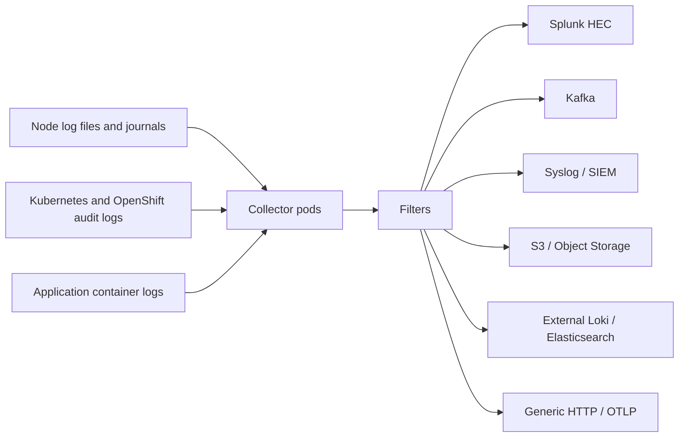

# External Log Forwarding in OpenShift Logging

**Audience:** Advanced OpenShift administrators, SREs, platform engineers, and logging owners with production responsibility.  
**Skill level:** Written for an administrator with around 10 years of Linux, Kubernetes, OpenShift, and enterprise operations experience.  
**Primary API focus:** Red Hat OpenShift Logging 6.x using `ClusterLogForwarder` API `observability.openshift.io/v1`.  
**Last reviewed:** 2026-07-03.

---

## 1. Executive Summary

**External log forwarding** in OpenShift Logging means collecting logs from an OpenShift cluster and sending them to a destination outside the default in-cluster log store. The external destination can be Splunk, Kafka, Elasticsearch, external Loki, syslog, Amazon S3, Amazon CloudWatch, Google Cloud Logging, generic HTTP endpoints, OTLP receivers, SIEM pipelines, compliance archives, or enterprise observability platforms.

In modern OpenShift Logging, external forwarding is configured with a `ClusterLogForwarder` custom resource. A `ClusterLogForwarder` defines:

- **Inputs:** Which logs to collect, for example application, infrastructure, audit, or selected namespaces/pods.
- **Filters:** How to drop, parse, prune, enrich, or reduce logs before forwarding.
- **Outputs:** Where logs are sent, for example Splunk HEC, Kafka brokers, syslog receiver, S3 bucket, external Loki, or HTTP endpoint.
- **Pipelines:** The routing logic that connects inputs, filters, and outputs.
- **Service account identity:** The collector identity used to read log sources and authenticate to some outputs.
- **Tuning:** Delivery behavior, retry behavior, compression, rate limits, and maximum write size.

From a senior admin perspective, log forwarding is not just a YAML task. It is a production data pipeline. You must design it for RBAC, security, TLS, backpressure, destination failures, retention, compliance, cost, network egress, and operational troubleshooting.

---

## 2. What External Log Forwarding Solves

OpenShift clusters generate large volumes of logs from workloads, nodes, operators, API servers, routers, SDN/OVN components, authentication services, and audit systems. Many organizations already have centralized logging or SIEM platforms outside the OpenShift cluster. External log forwarding lets the platform team send only the required logs to the right platform.

Typical business reasons:

| Requirement | External forwarding use case |
|---|---|
| Enterprise SOC/SIEM | Forward audit and security logs to Splunk, QRadar, Sentinel pipeline, or syslog collector. |
| App team troubleshooting | Send namespace-specific application logs to Splunk, external Loki, Elasticsearch, or HTTP collector. |
| Compliance retention | Archive audit logs to S3/object storage with lifecycle policy and immutability. |
| Data lake ingestion | Stream application and infrastructure logs to Kafka or object storage. |
| Hybrid/multi-cluster operations | Normalize logs from many OpenShift clusters into a central observability platform. |
| Cost control | Drop noisy logs and forward only important streams to expensive platforms. |
| Separation of duties | Developers use short-term log store; security teams receive audit logs; platform team receives infrastructure logs. |

---

## 3. Important Version and API Notes

### 3.1 OpenShift Logging 6.x API

In OpenShift Logging 6.x, the main API is:

```yaml
apiVersion: observability.openshift.io/v1
kind: ClusterLogForwarder
```

The `ClusterLogForwarder` resource now represents both collection and forwarding configuration. It is not only a forwarding object; it is the central logging pipeline definition.

### 3.2 Older Logging 5.x API

Older examples on the internet often use:

```yaml
apiVersion: logging.openshift.io/v1
kind: ClusterLogForwarder
```

or a separate:

```yaml
kind: ClusterLogging
```

Do not blindly copy old examples into Logging 6.x clusters. Check your installed API first:

```bash
oc api-resources | grep -i clusterlogforwarder
oc get crd | grep -i clusterlogforwarder
oc explain clusterlogforwarder.spec
```

### 3.3 Singleton vs Multiple ClusterLogForwarders

In older Logging versions, the common pattern was a singleton `ClusterLogForwarder` named `instance` in the `openshift-logging` namespace. In newer versions, multiple `ClusterLogForwarder` resources can exist, including resources with different names and namespaces depending on your supported operator version and design.

For production, keep naming simple unless you have a clear multi-forwarder design:

```text
openshift-logging/instance
openshift-logging/platform-forwarder
openshift-logging/audit-forwarder
```

---

## 4. High-Level Architecture



A simplified flow:

1. Applications write logs to `stdout` and `stderr`.
2. CRI-O writes container log files on each node.
3. Node and infrastructure services write journal logs and component logs.
4. API servers and node services produce audit logs.
5. OpenShift Logging deploys collector pods, generally as node-level collectors.
6. The collector reads authorized log sources.
7. The collector enriches records with Kubernetes metadata.
8. Filters are applied in pipeline order.
9. Output-specific encoders and transport settings are applied.
10. Logs are delivered to one or more external destinations.

---

## 5. Core Objects

### 5.1 `ClusterLogForwarder`

The main custom resource for log collection and forwarding.

Minimal conceptual structure:

```yaml
apiVersion: observability.openshift.io/v1
kind: ClusterLogForwarder
metadata:
  name: instance
  namespace: openshift-logging
spec:
  serviceAccount:
    name: logcollector
  inputs: []
  filters: []
  outputs: []
  pipelines: []
```

### 5.2 Collector Service Account

The collector uses a Kubernetes service account as its identity. This service account must be granted permissions for every log type used in `pipeline.inputRefs`.

Common roles:

```text
collect-application-logs
collect-infrastructure-logs
collect-audit-logs
```

Create service account:

```bash
oc -n openshift-logging create serviceaccount logcollector
```

Grant application log access:

```bash
oc adm policy add-cluster-role-to-user collect-application-logs \
  system:serviceaccount:openshift-logging:logcollector
```

Grant infrastructure log access:

```bash
oc adm policy add-cluster-role-to-user collect-infrastructure-logs \
  system:serviceaccount:openshift-logging:logcollector
```

Grant audit log access:

```bash
oc adm policy add-cluster-role-to-user collect-audit-logs \
  system:serviceaccount:openshift-logging:logcollector
```

**Critical production warning:** Grant RBAC before adding the related log type to `inputRefs`. If a `ClusterLogForwarder` references a log type that the service account is not authorized to collect, the Logging Operator can remove the collector `DaemonSet` and stop log collection for the cluster.

### 5.3 Secret

A Kubernetes `Secret` stores external system credentials, TLS certificate keys, CA bundles, tokens, AWS keys, Splunk HEC token, Kafka SASL password, Elasticsearch credentials, or HTTP basic auth credentials.

The secret must normally exist in the same namespace as the `ClusterLogForwarder`.

Example:

```bash
oc -n openshift-logging create secret generic splunk-hec-secret \
  --from-literal=hecToken='xxxxxxxx-xxxx-xxxx-xxxx-xxxxxxxxxxxx'
```

### 5.4 Inputs

Inputs define log sources.

Built-in input references:

```text
application
infrastructure
audit
```

Custom input example for selected namespaces:

```yaml
inputs:
- name: payments-apps
  type: application
  application:
    includes:
    - namespace: payments-prod
    - namespace: payments-uat
```

Custom input example for pod labels:

```yaml
inputs:
- name: frontend-error-prone-apps
  type: application
  application:
    selector:
      matchLabels:
        app.kubernetes.io/part-of: frontend
```

### 5.5 Filters

Filters modify, parse, enrich, reduce, or drop log records.

Common filter types:

| Filter | Purpose |
|---|---|
| `drop` | Drop complete records based on field matching. |
| `prune` | Remove selected fields or keep only selected fields. |
| `parse` | Parse JSON-formatted message payloads into structured records. |
| `detectMultilineException` | Combine multi-line exception stack traces into a single record. |
| `openshiftLabels` | Add custom labels to records. |
| `kubeAPIAudit` | Reduce or filter Kubernetes API audit events. |

### 5.6 Outputs

Outputs define destinations.

Supported output types in current OpenShift Logging documentation include:

| Output type | Typical use |
|---|---|
| `splunk` | Splunk HTTP Event Collector. |
| `kafka` | Streaming logs into Kafka topics. |
| `syslog` | SIEM/syslog receiver using UDP, TCP, or TLS. |
| `elasticsearch` | External Elasticsearch 6/7/8 cluster. |
| `loki` | External Loki, not the managed in-cluster LokiStack path. |
| `lokiStack` | Red Hat managed in-cluster LokiStack output. Useful, but not usually called external forwarding. |
| `http` | Generic HTTP/HTTPS endpoint. |
| `s3` | Amazon S3 or S3-compatible object storage archival. |
| `cloudwatch` | Amazon CloudWatch logs. |
| `googleCloudLogging` | Google Cloud Logging. |
| `azureMonitor` | Azure Monitor Logs, but deprecated in current documentation. |
| `otlp` | OpenTelemetry Protocol receiver; Technology Preview in current documentation. |

### 5.7 Pipelines

A pipeline connects one or more inputs to one or more outputs, optionally through filters.

Example:

```yaml
pipelines:
- name: apps-to-splunk
  inputRefs:
  - application
  filterRefs:
  - parse-json
  - drop-debug
  outputRefs:
  - splunk-prod
```

A pipeline can send the same input to multiple destinations:

```yaml
pipelines:
- name: audit-to-siem-and-archive
  inputRefs:
  - audit
  filterRefs:
  - reduce-audit-noise
  outputRefs:
  - splunk-soc
  - s3-compliance
```

---

## 6. Log Types in Detail

### 6.1 Application Logs

Application logs are generated by user workloads. These are usually container `stdout` and `stderr` logs from namespaces that are not infrastructure namespaces.

Examples:

```text
payments-api
nginx-frontend
java-service
python-worker
mysql-init-job
```

Use application logs for:

- Developer troubleshooting.
- Error rate investigation.
- Release validation.
- Application security monitoring.
- Business transaction traces when application logs include useful IDs.

Operational considerations:

- High volume and noisy debug logs are common.
- JSON parsing can be useful when applications emit structured logs.
- Namespace-level filtering is important for cost control.
- Avoid forwarding every development namespace to expensive enterprise SIEM unless required.

### 6.2 Infrastructure Logs

Infrastructure logs include platform and node-level logs. They include logs from OpenShift and Kubernetes namespaces such as `openshift-*`, `kube-*`, and `default`, plus node journal logs.

Use infrastructure logs for:

- Node troubleshooting.
- Operator problems.
- API server/router/ingress issues.
- Cluster upgrade troubleshooting.
- Platform availability monitoring.

Operational considerations:

- Infrastructure logs are essential during incidents.
- These logs can expose cluster topology and internal service names.
- Platform teams usually own these logs, not application teams.

### 6.3 Audit Logs

Audit logs track security-relevant actions. Sources can include Kubernetes API server audit logs, OpenShift API audit logs, node `auditd`, and OVN audit logs.

Use audit logs for:

- Compliance.
- Security investigation.
- Privilege escalation analysis.
- Change tracking.
- Forensic reconstruction.

Operational considerations:

- Audit logs can be very large.
- They may include sensitive request and response objects.
- Forwarding should be secured with TLS and strict destination controls.
- Audit logs should often be sent to immutable or retention-controlled storage.
- OpenShift Logging itself should not be treated as a full SIEM or compliance archive unless your architecture explicitly provides that capability.

---

## 7. Production Bootstrap Workflow

### Step 1: Confirm API and operator

```bash
oc get csv -n openshift-logging
oc api-resources | grep -i clusterlogforwarder
oc explain clusterlogforwarder.spec
```

### Step 2: Create collector service account

```bash
oc -n openshift-logging create serviceaccount logcollector
```

### Step 3: Grant log-source permissions

Application only:

```bash
oc adm policy add-cluster-role-to-user collect-application-logs \
  system:serviceaccount:openshift-logging:logcollector
```

Application + infrastructure:

```bash
oc adm policy add-cluster-role-to-user collect-infrastructure-logs \
  system:serviceaccount:openshift-logging:logcollector
```

Audit:

```bash
oc adm policy add-cluster-role-to-user collect-audit-logs \
  system:serviceaccount:openshift-logging:logcollector
```

Verify:

```bash
oc get clusterrolebinding | grep logcollector
oc auth can-i collect applicationlogs --as=system:serviceaccount:openshift-logging:logcollector
```

The exact `oc auth can-i` resource names can vary by API and version, so also use:

```bash
oc describe clusterrole collect-application-logs
oc describe clusterrole collect-infrastructure-logs
oc describe clusterrole collect-audit-logs
```

### Step 4: Create destination secrets

Example Splunk HEC token:

```bash
oc -n openshift-logging create secret generic splunk-hec-secret \
  --from-literal=hecToken='REPLACE_WITH_HEC_TOKEN'
```

Example CA bundle:

```bash
oc -n openshift-logging create secret generic external-ca-secret \
  --from-file=ca-bundle.crt=./ca-bundle.crt
```

Example basic auth:

```bash
oc -n openshift-logging create secret generic http-basic-secret \
  --from-literal=username='loguser' \
  --from-literal=password='REPLACE_WITH_PASSWORD'
```

### Step 5: Apply `ClusterLogForwarder`

```bash
oc apply -f clusterlogforwarder.yaml
```

### Step 6: Verify status

```bash
oc get clusterlogforwarder instance -n openshift-logging \
  -o jsonpath='{.status.conditions}' | python3 -m json.tool
```

Expected conditions:

```text
observability.openshift.io/Authorized=True
observability.openshift.io/Valid=True
Ready=True
```

### Step 7: Verify collector pods

```bash
oc get pods -n openshift-logging -l app.kubernetes.io/component=collector
oc logs -n openshift-logging -l app.kubernetes.io/component=collector --tail=100
```

### Step 8: Verify downstream arrival

Use a known canary log:

```bash
oc new-project log-forward-test
oc run log-canary --image=registry.access.redhat.com/ubi9/ubi \
  --restart=Never --command -- /bin/bash -c 'echo CANARY_LOG_20260703_001; sleep 30'
```

Search the downstream platform for:

```text
CANARY_LOG_20260703_001
namespace=log-forward-test
pod=log-canary
```

---

## 8. Full Production Example: Split Routing to Splunk, Kafka, and S3

Scenario:

- Application logs from production namespaces go to Splunk.
- Infrastructure logs go to Kafka for platform observability pipeline.
- Audit logs go to Splunk SOC and S3 archive.
- Debug logs are dropped before Splunk.
- Large audit objects are pruned before S3.
- JSON application logs are parsed.

```yaml
apiVersion: observability.openshift.io/v1
kind: ClusterLogForwarder
metadata:
  name: instance
  namespace: openshift-logging
spec:
  serviceAccount:
    name: logcollector

  inputs:
  - name: prod-apps
    type: application
    application:
      includes:
      - namespace: payments-prod
      - namespace: orders-prod
      - namespace: frontend-prod
      tuning:
        container:
          maxMessageSize: 64Ki
          rateLimitPerContainer:
            maxRecordsPerSecond: 1000

  - name: infra-only
    type: infrastructure
    infrastructure:
      sources:
      - container
      - node

  - name: audit-all
    type: audit
    audit:
      sources:
      - kubeAPI
      - openshiftAPI
      - auditd
      - ovn

  filters:
  - name: parse-json
    type: parse

  - name: drop-debug-from-apps
    type: drop
    drop:
    - test:
      - field: .level
        matches: "(?i)debug|trace"

  - name: prune-large-audit-fields
    type: prune
    prune:
      in:
      - .audit.requestObject
      - .audit.responseObject
      - .audit.managedFields

  - name: add-platform-labels
    type: openshiftLabels
    openshiftLabels:
      cluster: ocp-prod-01
      environment: production
      owner: platform-team

  outputs:
  - name: splunk-sre
    type: splunk
    splunk:
      url: https://splunk-hec.example.com:8088
      authentication:
        token:
          secretName: splunk-hec-secret
          key: hecToken
      index: '{.log_type||"openshift"}'
      source: '{.log_source||"container"}'
      indexedFields:
      - .log_type
      - .log_source
      - .kubernetes.namespace_name
      tuning:
        compression: gzip
        deliveryMode: AtLeastOnce
        minRetryDuration: 5
        maxRetryDuration: 300
        maxWrite: 2Mi
    tls:
      ca:
        secretName: splunk-ca-secret
        key: ca-bundle.crt
    rateLimit:
      maxRecordsPerSecond: 5000

  - name: kafka-platform
    type: kafka
    kafka:
      brokers:
      - tls://kafka-1.example.com:9093
      - tls://kafka-2.example.com:9093
      - tls://kafka-3.example.com:9093
      topic: 'openshift-{.log_type||"unknown"}'
      authentication:
        sasl:
          mechanism: SCRAM-SHA-512
          username:
            secretName: kafka-secret
            key: username
          password:
            secretName: kafka-secret
            key: password
      tuning:
        compression: gzip
        deliveryMode: AtLeastOnce
        minRetryDuration: 5
        maxRetryDuration: 300
    tls:
      ca:
        secretName: kafka-ca-secret
        key: ca-bundle.crt

  - name: s3-audit-archive
    type: s3
    s3:
      authentication:
        type: awsAccessKey
        awsAccessKey:
          keyId:
            secretName: aws-secret
            key: aws_access_key_id
          keySecret:
            secretName: aws-secret
            key: aws_secret_access_key
      bucket: openshift-audit-prod-archive
      region: ap-south-1
      url: https://s3.ap-south-1.amazonaws.com
      keyPrefix: 'cluster=ocp-prod-01/log_type={.log_type||"unknown"}'
      tuning:
        compression: gzip
        deliveryMode: AtLeastOnce
        minRetryDuration: 10
        maxRetryDuration: 600
        maxWrite: 5Mi

  pipelines:
  - name: prod-apps-to-splunk
    inputRefs:
    - prod-apps
    filterRefs:
    - parse-json
    - drop-debug-from-apps
    - add-platform-labels
    outputRefs:
    - splunk-sre

  - name: infra-to-kafka
    inputRefs:
    - infra-only
    filterRefs:
    - add-platform-labels
    outputRefs:
    - kafka-platform

  - name: audit-to-splunk-and-s3
    inputRefs:
    - audit-all
    filterRefs:
    - prune-large-audit-fields
    - add-platform-labels
    outputRefs:
    - splunk-sre
    - s3-audit-archive
```

Production notes:

- Use `AtLeastOnce` for compliance and audit pipelines, but expect possible duplicates after retries.
- Use downstream deduplication where required.
- Use rate limits to protect expensive or fragile destinations.
- Keep raw audit logs in archive if compliance requires full fidelity. If you prune audit logs, document the policy.
- Do not store long-lived access keys in Git. Use sealed secrets, external secrets, or cloud workload identity where available.

---

## 9. Output Type Deep Dive

## 9.1 Splunk HEC Output

Splunk is common in enterprise SOC and operations environments.

### Use Splunk when

- Security teams already use Splunk.
- Application teams need searchable operational logs.
- You need indexed fields for faster searches.
- You need dashboards and alerting in Splunk.

### Secret

```bash
oc -n openshift-logging create secret generic splunk-hec-secret \
  --from-literal=hecToken='REPLACE_WITH_HEC_TOKEN'
```

### Example

```yaml
apiVersion: observability.openshift.io/v1
kind: ClusterLogForwarder
metadata:
  name: instance
  namespace: openshift-logging
spec:
  serviceAccount:
    name: logcollector
  outputs:
  - name: splunk-prod
    type: splunk
    splunk:
      url: https://splunk.example.com:8088
      authentication:
        token:
          secretName: splunk-hec-secret
          key: hecToken
      index: '{.log_type||"openshift"}'
      source: '{.log_source||"container"}'
      indexedFields:
      - .log_type
      - .log_source
      - .kubernetes.namespace_name
      tuning:
        compression: gzip
        deliveryMode: AtLeastOnce
    tls:
      ca:
        secretName: splunk-ca-secret
        key: ca-bundle.crt
  pipelines:
  - name: apps-infra-to-splunk
    inputRefs:
    - application
    - infrastructure
    outputRefs:
    - splunk-prod
```

### Splunk troubleshooting

| Symptom | Likely cause | Action |
|---|---|---|
| `401 Unauthorized` | Wrong HEC token | Verify secret key and Splunk HEC token. |
| `403 Forbidden` | Token disabled or index not allowed | Check Splunk token index permissions. |
| TLS errors | Missing CA or wrong hostname | Add correct CA bundle and use FQDN matching cert SAN. |
| Logs arrive without useful fields | `payloadKey` too narrow or missing parse | Avoid aggressive `payloadKey`; parse JSON logs. |
| High Splunk license usage | Too many logs | Add `drop`, `prune`, namespace filtering, or rate limits. |

### Senior admin advice

Do not index too many fields. Splunk indexed fields improve search but increase storage and ingestion overhead. Index only high-value dimensions such as namespace, log type, cluster name, and application name.

---

## 9.2 Kafka Output

Kafka is a good decoupling layer between OpenShift and downstream analytics/SIEM/data lake consumers.

### Use Kafka when

- Multiple consumers need the same logs.
- You want buffering outside OpenShift.
- You need replay capability.
- You want log routing handled by a central streaming platform.

### Example

```yaml
apiVersion: observability.openshift.io/v1
kind: ClusterLogForwarder
metadata:
  name: instance
  namespace: openshift-logging
spec:
  serviceAccount:
    name: logcollector
  outputs:
  - name: kafka-logs
    type: kafka
    kafka:
      brokers:
      - tls://kafka-1.example.com:9093
      - tls://kafka-2.example.com:9093
      topic: 'ocp-{.log_type||"unknown"}'
      authentication:
        sasl:
          mechanism: SCRAM-SHA-512
          username:
            secretName: kafka-secret
            key: username
          password:
            secretName: kafka-secret
            key: password
      tuning:
        compression: gzip
        deliveryMode: AtLeastOnce
    tls:
      ca:
        secretName: kafka-ca-secret
        key: ca-bundle.crt
  pipelines:
  - name: all-to-kafka
    inputRefs:
    - application
    - infrastructure
    outputRefs:
    - kafka-logs
```

### Kafka design points

- Use TLS and SASL in enterprise environments.
- Use dynamic topics carefully. Too many topics can overload Kafka operations.
- Keep topic naming predictable.
- Plan retention at Kafka level.
- Ensure partitions are enough for ingestion volume.
- Validate producer ACLs.

### Kafka troubleshooting

| Symptom | Likely cause | Action |
|---|---|---|
| Cannot connect | Network egress, DNS, firewall, wrong port | Test from debug pod or collector node path. |
| SASL auth failure | Wrong mechanism or credentials | Confirm SCRAM/PLAIN mechanism and secret keys. |
| TLS handshake failure | Wrong CA or broker cert SAN mismatch | Check CA bundle and broker FQDN. |
| No records in topic | Wrong topic or ACL | Check Kafka topic existence and producer ACL. |
| Collector backoff | Kafka unavailable or throttling | Check collector logs, Kafka broker health, and quotas. |

---

## 9.3 Syslog Output

Syslog is common for traditional SIEM, network/security appliances, and legacy central logging.

### Use syslog when

- The receiving platform supports RFC3164 or RFC5424.
- Security devices expect syslog.
- You need a simple transport to a central relay.

### Example with TLS

```yaml
apiVersion: observability.openshift.io/v1
kind: ClusterLogForwarder
metadata:
  name: instance
  namespace: openshift-logging
spec:
  serviceAccount:
    name: logcollector
  outputs:
  - name: rsyslog-secure
    type: syslog
    syslog:
      url: tls://syslog.example.com:6514
      rfc: RFC5424
      facility: local0
      severity: informational
      enrichment: KubernetesMinimal
      payloadKey: message
      tuning:
        deliveryMode: AtLeastOnce
    tls:
      ca:
        secretName: syslog-ca-secret
        key: ca-bundle.crt
  pipelines:
  - name: audit-to-syslog
    inputRefs:
    - audit
    outputRefs:
    - rsyslog-secure
```

### Transport comparison

| Transport | Scheme | Production suitability |
|---|---|---|
| UDP | `udp://` | Fast but lossy. Avoid for compliance logs. |
| TCP | `tcp://` | More reliable than UDP but not encrypted. |
| TLS | `tls://` | Recommended for sensitive logs. |

### Syslog troubleshooting

- Verify external receiver listens on correct port.
- Check firewall and egress controls.
- Confirm RFC format expected by the SIEM.
- Use `KubernetesMinimal` enrichment when downstream teams need namespace, pod, and container context.
- Avoid UDP for audit/compliance logs unless there is a documented risk acceptance.

---

## 9.4 Elasticsearch Output

External Elasticsearch is useful when the organization has its own search cluster.

### Use Elasticsearch when

- You already operate Elasticsearch outside OpenShift.
- You need search and analytics with Elastic tooling.
- You need log indexing outside the cluster.

### Example

```yaml
apiVersion: observability.openshift.io/v1
kind: ClusterLogForwarder
metadata:
  name: instance
  namespace: openshift-logging
spec:
  serviceAccount:
    name: logcollector
  outputs:
  - name: external-es
    type: elasticsearch
    elasticsearch:
      url: https://elasticsearch.example.com:9200
      version: 8
      index: '{.log_type||"openshift"}'
      authentication:
        username:
          secretName: es-secret
          key: username
        password:
          secretName: es-secret
          key: password
    tls:
      ca:
        secretName: es-secret
        key: ca-bundle.crt
  pipelines:
  - name: apps-to-external-es
    inputRefs:
    - application
    outputRefs:
    - external-es
```

### Elasticsearch design points

- Confirm target version compatibility.
- Use index lifecycle management on the Elasticsearch side.
- Design index names to support retention and query patterns.
- Avoid sending noisy debug logs without filters.
- Monitor indexing pressure and rejected writes.

---

## 9.5 External Loki Output

External Loki output is different from `lokiStack` output.

- `loki`: external Loki deployment.
- `lokiStack`: Red Hat managed LokiStack, normally inside OpenShift Logging.

### Use external Loki when

- You run Grafana Loki centrally outside this cluster.
- You aggregate logs from multiple clusters.
- You want LogQL but do not want local LokiStack per cluster.

### Example

```yaml
apiVersion: observability.openshift.io/v1
kind: ClusterLogForwarder
metadata:
  name: instance
  namespace: openshift-logging
spec:
  serviceAccount:
    name: logcollector
  outputs:
  - name: external-loki
    type: loki
    loki:
      url: https://loki.example.com:3100
      labelKeys:
      - log_type
      - kubernetes.namespace_name
      - kubernetes.pod_name
      - kubernetes.container_name
      tenantKey: '{.kubernetes.namespace_name||"application"}'
      authentication:
        username:
          secretName: loki-secret
          key: username
        password:
          secretName: loki-secret
          key: password
    tls:
      ca:
        secretName: loki-ca-secret
        key: ca-bundle.crt
  pipelines:
  - name: apps-to-loki
    inputRefs:
    - application
    outputRefs:
    - external-loki
```

### Loki label warning

Loki performance depends heavily on label cardinality. Do not use high-cardinality fields such as pod UID, container ID, request ID, trace ID, or user ID as labels. Use them as log fields, not stream labels.

Good labels:

```text
cluster
namespace
app
container
log_type
```

Bad labels:

```text
request_id
session_id
pod_uid
container_id
user_email
full_url
```

---

## 9.6 Generic HTTP Output

Generic HTTP output is useful for custom collectors, webhooks, internal ingestion APIs, or observability gateways.

### Example

```yaml
apiVersion: observability.openshift.io/v1
kind: ClusterLogForwarder
metadata:
  name: instance
  namespace: openshift-logging
spec:
  serviceAccount:
    name: logcollector
  outputs:
  - name: http-ingest
    type: http
    http:
      url: https://logs-api.example.com/ingest
      timeout: 300
      headers:
        X-Cluster-Name: ocp-prod-01
      authentication:
        username:
          secretName: http-basic-secret
          key: username
        password:
          secretName: http-basic-secret
          key: password
    tls:
      ca:
        secretName: http-ca-secret
        key: ca-bundle.crt
      insecureSkipVerify: false
  pipelines:
  - name: apps-to-http
    inputRefs:
    - application
    outputRefs:
    - http-ingest
```

### Production warning

Do not set `insecureSkipVerify: true` in production unless there is an approved exception. It disables certificate validation and exposes the pipeline to man-in-the-middle risk.

---

## 9.7 Amazon S3 Output

S3 is useful for long-term retention and compliance archive.

### Use S3 when

- You need cheap long-term storage.
- Logs must be retained for months or years.
- Security/compliance teams need immutable archive.
- Data lake tools process logs later.

### Example

```yaml
apiVersion: observability.openshift.io/v1
kind: ClusterLogForwarder
metadata:
  name: instance
  namespace: openshift-logging
spec:
  serviceAccount:
    name: logcollector
  outputs:
  - name: s3-audit
    type: s3
    s3:
      authentication:
        type: awsAccessKey
        awsAccessKey:
          keyId:
            secretName: aws-secret
            key: aws_access_key_id
          keySecret:
            secretName: aws-secret
            key: aws_secret_access_key
      bucket: ocp-prod-audit-logs
      region: ap-south-1
      url: https://s3.ap-south-1.amazonaws.com
      keyPrefix: 'cluster=ocp-prod-01/log_type={.log_type||"unknown"}'
      tuning:
        compression: gzip
        deliveryMode: AtLeastOnce
  pipelines:
  - name: audit-to-s3
    inputRefs:
    - audit
    outputRefs:
    - s3-audit
```

### S3 senior admin notes

- Use bucket lifecycle policies.
- Enable encryption at rest.
- Consider Object Lock if compliance requires immutability.
- Prefer workload identity or short-term credentials where available.
- Confirm VPC endpoint/proxy routing in private clusters.
- Keep key prefix strategy consistent across clusters.

---

## 9.8 Amazon CloudWatch Output

CloudWatch is useful when OpenShift clusters run in or integrate heavily with AWS operations.

### Example

```yaml
apiVersion: observability.openshift.io/v1
kind: ClusterLogForwarder
metadata:
  name: instance
  namespace: openshift-logging
spec:
  serviceAccount:
    name: logcollector
  outputs:
  - name: cloudwatch-prod
    type: cloudwatch
    cloudwatch:
      authentication:
        type: awsAccessKey
        awsAccessKey:
          keyId:
            secretName: cw-secret
            key: aws_access_key_id
          keySecret:
            secretName: cw-secret
            key: aws_secret_access_key
      groupName: 'ocp-prod-{.log_type||"unknown"}'
      region: ap-south-1
  pipelines:
  - name: all-to-cloudwatch
    inputRefs:
    - application
    - infrastructure
    outputRefs:
    - cloudwatch-prod
```

---

## 9.9 Google Cloud Logging Output

Google Cloud Logging is useful when your organization centralizes logs in Google Cloud.

### Example

```yaml
apiVersion: observability.openshift.io/v1
kind: ClusterLogForwarder
metadata:
  name: instance
  namespace: openshift-logging
spec:
  serviceAccount:
    name: logcollector
  outputs:
  - name: gcp-logging
    type: googleCloudLogging
    googleCloudLogging:
      authentication:
        credentials:
          secretName: gcp-secret
          key: google-application-credentials.json
      id:
        type: project
        value: my-gcp-project
      logId: 'ocp-prod-{.log_type||"unknown"}'
  pipelines:
  - name: apps-to-gcp
    inputRefs:
    - application
    outputRefs:
    - gcp-logging
```

---

## 9.10 OTLP Output

OTLP sends logs to an OpenTelemetry receiver. This is useful for vendor-neutral observability pipelines, but check your version support status carefully because current documentation marks OTLP output as Technology Preview.

### Example

```yaml
apiVersion: observability.openshift.io/v1
kind: ClusterLogForwarder
metadata:
  name: clf-otlp
  namespace: openshift-logging
  annotations:
    observability.openshift.io/tech-preview-otlp-output: "enabled"
spec:
  serviceAccount:
    name: logcollector
  outputs:
  - name: otlp
    type: otlp
    otlp:
      url: https://otel-collector.example.com/v1/logs
      tuning:
        compression: gzip
        deliveryMode: AtLeastOnce
        minRetryDuration: 5
        maxRetryDuration: 20
        maxWrite: 10M
  pipelines:
  - name: all-to-otlp
    inputRefs:
    - application
    - infrastructure
    - audit
    outputRefs:
    - otlp
```

### OTLP production advice

Do not use Technology Preview features for strict production SLAs unless your organization has explicitly accepted the support risk.

---

## 9.11 Azure Monitor Output

The `azureMonitor` output exists in current documentation but is marked deprecated and planned for removal/obsolescence in September 2026. For new production designs, avoid building a new long-term architecture around this output unless your Red Hat support matrix and product roadmap confirm it is still appropriate for your environment.

---

## 10. Filtering Strategy

Filtering is where senior administrators reduce cost, improve signal, and protect sensitive data.

### 10.1 Drop Filter

Drops entire records.

Example: Drop debug and trace logs:

```yaml
filters:
- name: drop-debug-trace
  type: drop
  drop:
  - test:
    - field: .level
      matches: "(?i)debug|trace"
```

Example: Drop logs from noisy namespace:

```yaml
filters:
- name: drop-noisy-namespace
  type: drop
  drop:
  - test:
    - field: .kubernetes.namespace_name
      matches: "load-test|perf-test"
```

Pipeline:

```yaml
pipelines:
- name: apps-to-splunk
  inputRefs:
  - application
  filterRefs:
  - drop-debug-trace
  - drop-noisy-namespace
  outputRefs:
  - splunk-prod
```

### 10.2 Prune Filter

Removes selected fields while keeping the record.

Example: Remove large audit fields:

```yaml
filters:
- name: prune-audit-heavy-fields
  type: prune
  prune:
    in:
    - .audit.requestObject
    - .audit.responseObject
    - .audit.managedFields
```

Use prune when:

- Audit payloads are too large.
- You must remove sensitive data before third-party forwarding.
- Downstream storage cost is high.
- You need to preserve message and essential metadata.

Be careful: required fields cannot be removed. If you attempt to prune required fields, validation can fail.

### 10.3 Parse Filter

Parses JSON application logs.

```yaml
filters:
- name: parse-json
  type: parse
```

Use parse when applications emit logs like:

```json
{"level":"error","service":"checkout","trace_id":"abc123","message":"payment failed"}
```

Structured parsing improves queries in Splunk, Elasticsearch, Loki, and downstream systems.

### 10.4 Multiline Exception Detection

Useful for Java, Python, Go panic traces, Node.js stack traces, and frameworks that print exceptions across multiple lines.

```yaml
filters:
- name: detect-stacktraces
  type: detectMultilineException
```

Use it when stack traces are split into separate records and downstream users cannot search the full exception context.

### 10.5 Kubernetes API Audit Filtering

For audit logs, reduce low-value noise while preserving security-relevant events.

Common candidates to reduce:

- `get`, `list`, `watch` events from noisy controllers.
- Successful health checks.
- Known low-risk service account reads.
- Large request/response objects.

Common events to retain carefully:

- `create`, `update`, `patch`, `delete` on RBAC, secrets, SCCs, OAuth, routes, network policies, cluster roles, machine configs.
- `impersonate` activity.
- Failed authentication and authorization.
- Privileged workload changes.
- Changes to image policy, admission, or security controls.

---

## 11. Tuning Throughput and Durability

Forwarding logs to external systems can fail because of network issues, TLS problems, destination overload, throttling, or credentials. Tuning determines how the collector behaves under pressure.

### 11.1 Input Tuning

Example:

```yaml
inputs:
- name: application
  type: application
  application:
    tuning:
      container:
        maxMessageSize: 16Ki
        rateLimitPerContainer:
          maxRecordsPerSecond: 1000
```

Important fields:

| Field | Meaning |
|---|---|
| `maxMessageSize` | Maximum merged message size. Larger messages are dropped. |
| `rateLimitPerContainer.maxRecordsPerSecond` | Per-container log record limit. Excess records are dropped while over the limit. |

### 11.2 Output Tuning

Example:

```yaml
outputs:
- name: splunk-prod
  type: splunk
  splunk:
    url: https://splunk.example.com:8088
    authentication:
      token:
        secretName: splunk-hec-secret
        key: hecToken
    tuning:
      deliveryMode: AtLeastOnce
      compression: gzip
      maxWrite: 2Mi
      minRetryDuration: 5
      maxRetryDuration: 300
```

Important fields:

| Field | Meaning |
|---|---|
| `deliveryMode: AtLeastOnce` | Prioritizes delivery durability and retries. Duplicates can occur. |
| `deliveryMode: AtMostOnce` | Prioritizes throughput/low overhead. Log loss is more likely during failures. |
| `compression` | Reduces bandwidth; common values include `gzip`, `snappy`, or `none` depending on output. |
| `maxWrite` | Maximum size of one write request. Tune for destination limits. |
| `minRetryDuration` | Initial retry wait. |
| `maxRetryDuration` | Maximum retry wait. |

### 11.3 Rate Limit Outputs

Protect expensive or fragile destinations:

```yaml
outputs:
- name: expensive-splunk
  type: splunk
  splunk:
    url: https://splunk.example.com:8088
    authentication:
      token:
        secretName: splunk-hec-secret
        key: hecToken
  rateLimit:
    maxRecordsPerSecond: 500
```

### 11.4 Throughput vs Durability Decision Matrix

| Pipeline | Recommended mode | Reason |
|---|---|---|
| Audit to compliance archive | `AtLeastOnce` | Audit loss is unacceptable. |
| Security logs to SOC | `AtLeastOnce` | Investigation depends on completeness. |
| App debug logs to dev tool | `AtMostOnce` may be acceptable | Debug logs are high-volume and lower criticality. |
| Infrastructure incident logs | `AtLeastOnce` | Needed during outages. |
| Load test namespace logs | Rate-limited or dropped | Avoid overwhelming shared systems. |

---

## 12. TLS, mTLS, Proxy, and Certificates

### 12.1 TLS CA Bundle

For HTTPS/TLS endpoints with private CA:

```bash
oc -n openshift-logging create secret generic external-ca-secret \
  --from-file=ca-bundle.crt=./corp-root-ca.pem
```

Use in output:

```yaml
tls:
  ca:
    secretName: external-ca-secret
    key: ca-bundle.crt
```

### 12.2 mTLS

For outputs that support client certificate authentication:

```bash
oc -n openshift-logging create secret generic mtls-secret \
  --from-file=ca-bundle.crt=./ca.pem \
  --from-file=tls.crt=./client.crt \
  --from-file=tls.key=./client.key
```

Output pattern:

```yaml
tls:
  ca:
    secretName: mtls-secret
    key: ca-bundle.crt
  certificate:
    secretName: mtls-secret
    key: tls.crt
  key:
    secretName: mtls-secret
    key: tls.key
```

### 12.3 Proxy

Some HTTP outputs support `proxyURL`:

```yaml
http:
  url: https://logs-api.example.com/ingest
  proxyURL: http://proxy.corp.example.com:8080
```

For cluster-wide proxy environments, confirm whether the output uses cluster proxy settings or explicit output proxy configuration. Also verify `NO_PROXY` for internal endpoints.

### 12.4 Certificate Troubleshooting Commands

From a debug pod:

```bash
oc run tls-debug -n openshift-logging --image=registry.access.redhat.com/ubi9/ubi \
  --restart=Never -it -- bash
```

Inside pod:

```bash
curl -vk https://splunk.example.com:8088/services/collector/health
openssl s_client -connect splunk.example.com:8088 -servername splunk.example.com -showcerts
```

If the image lacks tools, use an approved internal troubleshooting image that includes `curl`, `openssl`, `nc`, and `dig`.

---

## 13. Network and Firewall Design

External forwarding requires egress from collector pods or nodes to external endpoints.

Check these layers:

1. DNS resolution from cluster.
2. Egress firewall or cloud security group.
3. OpenShift `NetworkPolicy`.
4. `AdminNetworkPolicy` or `EgressFirewall`, if used.
5. Corporate proxy.
6. External endpoint allowlist.
7. TLS interception devices.
8. Destination-side rate limits or IP allowlists.

### 13.1 Test DNS

```bash
oc run net-debug -n openshift-logging --image=registry.access.redhat.com/ubi9/ubi \
  --restart=Never -it -- bash

getent hosts splunk.example.com
```

### 13.2 Test TCP

```bash
curl -vk https://splunk.example.com:8088
```

If `nc` is available:

```bash
nc -zv splunk.example.com 8088
```

### 13.3 Test route through proxy

```bash
curl -vk -x http://proxy.corp.example.com:8080 https://logs-api.example.com/health
```

### 13.4 AdminNetworkPolicy Consideration

If your cluster uses `AdminNetworkPolicy` or strict namespace network controls, ensure collector pods in `openshift-logging` can egress to required external endpoints. An operator-managed namespace-level `NetworkPolicy` is not enough if a higher-priority admin policy blocks traffic.

---

## 14. Security and Compliance Best Practices

### 14.1 Do

- Use TLS for all external forwarding of sensitive logs.
- Use mTLS where the destination supports it.
- Use dedicated service accounts.
- Grant only required `collect-*` roles.
- Store credentials in Kubernetes `Secret`, not ConfigMap.
- Rotate credentials periodically.
- Separate audit, infrastructure, and application pipelines.
- Send audit logs to durable storage.
- Use filters to remove PII or bulky audit objects when allowed by policy.
- Label logs with cluster, environment, region, and owner.
- Document what is dropped and why.
- Monitor collector health and destination ingestion errors.

### 14.2 Do Not

- Do not forward all logs blindly to SIEM without filtering and cost analysis.
- Do not use `insecureSkipVerify: true` in production.
- Do not put tokens in Git repositories.
- Do not use UDP syslog for compliance-critical logs without explicit approval.
- Do not remove required fields using prune filters.
- Do not add `audit` to `inputRefs` before granting `collect-audit-logs`.
- Do not use high-cardinality labels in Loki.
- Do not assume `Ready=True` always means downstream ingestion is successful. Always check collector logs and destination-side metrics.

---

## 15. Observability and Verification

### 15.1 Check `ClusterLogForwarder`

```bash
oc get clusterlogforwarder -A
oc get clusterlogforwarder instance -n openshift-logging -o yaml
oc get clusterlogforwarder instance -n openshift-logging \
  -o jsonpath='{.status.conditions}' | python3 -m json.tool
```

### 15.2 Check collector pods

```bash
oc get pods -n openshift-logging -l app.kubernetes.io/component=collector -o wide
oc describe pod -n openshift-logging -l app.kubernetes.io/component=collector
oc logs -n openshift-logging -l app.kubernetes.io/component=collector --tail=200
```

### 15.3 Check collector rollout

```bash
oc get daemonset -n openshift-logging
oc rollout status daemonset/<collector-daemonset-name> -n openshift-logging
```

The collector DaemonSet name can vary by version and forwarder name. Use:

```bash
oc get ds -n openshift-logging -o name
```

### 15.4 Generate test log

```bash
oc new-project log-test
oc run canary --image=registry.access.redhat.com/ubi9/ubi \
  --restart=Never -- /bin/bash -c 'echo EXTERNAL_FORWARDING_CANARY_001; sleep 10'
```

### 15.5 Search destination

Search for:

```text
EXTERNAL_FORWARDING_CANARY_001
namespace=log-test
pod=canary
cluster=ocp-prod-01
```

### 15.6 Verify all log types

Application:

```bash
oc logs -n log-test pod/canary
```

Infrastructure:

```bash
oc get pods -n openshift-ingress
```

Then search router logs in destination.

Audit:

```bash
oc auth can-i get secrets -n default --as=test-user
```

Then search audit destination for that user/action if audit forwarding is enabled.

---

## 16. Troubleshooting Runbook

## 16.1 `ClusterLogForwarder` Not Ready

Command:

```bash
oc get clusterlogforwarder instance -n openshift-logging \
  -o jsonpath='{.status.conditions}' | python3 -m json.tool
```

Check:

- `Authorized=False`
- `Valid=False`
- `Ready=False`
- Messages in status conditions

Common fixes:

```bash
oc describe clusterlogforwarder instance -n openshift-logging
oc explain clusterlogforwarder.spec.outputs
oc explain clusterlogforwarder.spec.pipelines
```

## 16.2 Collector DaemonSet Missing

Likely cause:

- Service account lacks required `collect-*` role for one of the log types in `inputRefs`.

Fix:

```bash
oc adm policy add-cluster-role-to-user collect-application-logs \
  system:serviceaccount:openshift-logging:logcollector

oc adm policy add-cluster-role-to-user collect-infrastructure-logs \
  system:serviceaccount:openshift-logging:logcollector

oc adm policy add-cluster-role-to-user collect-audit-logs \
  system:serviceaccount:openshift-logging:logcollector
```

Then re-check:

```bash
oc get pods -n openshift-logging -l app.kubernetes.io/component=collector
```

## 16.3 `Ready=True` but Logs Not Arriving

Possible causes:

- Destination rejects logs.
- TLS CA missing or wrong.
- Token expired.
- Network path blocked.
- Destination overloaded or rate-limiting.
- Wrong index/topic/bucket/group name.
- Pipeline does not reference the expected input/output.
- Filter is dropping records.
- Namespace selector does not match workload.

Actions:

```bash
oc logs -n openshift-logging -l app.kubernetes.io/component=collector --tail=300 | egrep -i 'error|warn|failed|retry|tls|certificate|401|403|429|timeout'
```

Check final YAML:

```bash
oc get clusterlogforwarder instance -n openshift-logging -o yaml
```

Generate a new canary log and search downstream.

## 16.4 TLS Certificate Error

Collector log symptoms:

```text
certificate verify failed
x509: certificate signed by unknown authority
certificate is not valid for requested host
```

Fix checklist:

- Use the correct FQDN in output URL.
- Ensure certificate SAN includes that FQDN.
- Add corporate/private CA bundle as a secret.
- Reference the right secret name and key.
- Do not use `insecureSkipVerify: true` except for temporary testing.

## 16.5 Authentication Failure

Symptoms:

```text
401 Unauthorized
403 Forbidden
SASL authentication failed
Invalid token
AccessDenied
SignatureDoesNotMatch
```

Fix checklist:

- Confirm secret keys exist.
- Confirm token/password value is correct.
- Confirm token has required scope/index/topic/bucket permission.
- Confirm cloud credentials are for the expected account/region.
- Confirm clock skew is not causing signed request failures.

## 16.6 429 / Rate Limit / Throttling

Symptoms:

```text
429 Too Many Requests
rate limit exceeded
throttling
retrying after error
```

Fix options:

- Reduce forwarded volume with `drop` filters.
- Use `rateLimit.maxRecordsPerSecond`.
- Increase destination ingestion limit.
- Tune batch size with `maxWrite`.
- Add compression.
- Split pipelines by destination.
- Use Kafka as a buffer if destination cannot absorb direct cluster volume.

## 16.7 Logs Dropped Due to Message Size

Symptoms:

- Large Java stack traces missing.
- Huge JSON audit events missing.
- Collector logs mention oversized messages.

Fix:

```yaml
inputs:
- name: application
  type: application
  application:
    tuning:
      container:
        maxMessageSize: 64Ki
```

Also consider pruning audit fields or fixing application logging behavior.

## 16.8 Filter Accidentally Drops Logs

Check filters:

```bash
oc get clusterlogforwarder instance -n openshift-logging -o yaml | less
```

Temporarily remove suspicious `drop` filters and test with canary logs.

Common mistake:

```yaml
notMatches: "error"
```

This can drop everything except records with `error` depending on logic. Understand AND/OR behavior before applying filters globally.

## 16.9 Namespace or Pod Selector Not Matching

Check namespace and pod labels:

```bash
oc get ns --show-labels
oc get pods -n payments-prod --show-labels
```

Check custom input selectors in CLF.

## 16.10 Kafka Topic Is Empty

Checklist:

```bash
# From approved Kafka client environment
kafka-topics --bootstrap-server kafka-1.example.com:9093 --list
kafka-console-consumer --bootstrap-server kafka-1.example.com:9093 --topic ocp-application --from-beginning
```

Also confirm:

- Producer ACL.
- Topic exists or auto-create policy.
- SASL mechanism.
- TLS CA.
- Broker FQDN.
- Dynamic topic template output.

## 16.11 S3 Objects Not Created

Checklist:

- Bucket exists.
- Region is correct.
- IAM key can `PutObject`.
- Bucket policy permits source identity.
- Key prefix is valid.
- Private cluster has S3 endpoint/proxy/NAT.
- No KMS permission issue.

## 16.12 Splunk Events Missing Fields

Checklist:

- Avoid overly restrictive `payloadKey`.
- Use `parse` filter for JSON app logs.
- Add `indexedFields` only for fields you need.
- Search raw event first before blaming collector.
- Confirm HEC token index routing.

---

## 17. Upgrade and Migration Considerations

### 17.1 Before Upgrade

Export current configuration:

```bash
oc get clusterlogforwarder -A -o yaml > clf-backup.yaml
oc get secrets -n openshift-logging > logging-secrets-list.txt
oc get clusterrolebinding | grep -E 'collect-application|collect-infrastructure|collect-audit'
```

Document:

- Output endpoints.
- Secret names and keys.
- Input log types.
- Filters.
- Pipelines.
- Downstream owners.
- Compliance requirements.

### 17.2 During Migration from Logging 5.x to 6.x

Review:

- API group change.
- Field name changes.
- Collector behavior changes.
- Whether old `ClusterLogging` and `ClusterLogForwarder` separation still applies.
- Whether multiple CLFs are supported in your installed version.
- Output-specific changes.
- Deprecated outputs.

### 17.3 After Upgrade

Validate:

```bash
oc get clusterlogforwarder -A
oc get pods -n openshift-logging
oc logs -n openshift-logging -l app.kubernetes.io/component=collector --tail=200
```

Generate new canary logs and confirm arrival in every external destination.

---

## 18. Operational Runbooks

## 18.1 Rotate Splunk HEC Token

1. Create new token in Splunk.
2. Patch Kubernetes secret:

```bash
oc -n openshift-logging patch secret splunk-hec-secret \
  --type='json' \
  -p='[{"op":"replace","path":"/data/hecToken","value":"'$(printf %s 'NEW_TOKEN' | base64 -w0)'"}]'
```

3. Restart collector if needed:

```bash
oc delete pod -n openshift-logging -l app.kubernetes.io/component=collector
```

4. Generate canary log and verify.

## 18.2 Add Audit Logs to Existing Forwarder

Safe sequence:

```bash
oc adm policy add-cluster-role-to-user collect-audit-logs \
  system:serviceaccount:openshift-logging:logcollector
```

Then edit CLF:

```yaml
pipelines:
- name: audit-to-siem
  inputRefs:
  - audit
  outputRefs:
  - splunk-soc
```

Apply and verify:

```bash
oc apply -f clusterlogforwarder.yaml
oc get clusterlogforwarder instance -n openshift-logging \
  -o jsonpath='{.status.conditions}' | python3 -m json.tool
```

## 18.3 Temporarily Reduce Logging Volume During Incident

Example: Drop load test namespace:

```yaml
filters:
- name: emergency-drop-loadtest
  type: drop
  drop:
  - test:
    - field: .kubernetes.namespace_name
      matches: "loadtest|performance-test"
```

Apply filter only to affected pipeline.

Do not globally drop audit logs during a security incident unless approved by security leadership.

## 18.4 Destination Outage

When external destination is down:

1. Confirm destination outage with owner.
2. Check collector error rate.
3. Check node pressure and collector resource usage.
4. Decide whether to keep retrying or temporarily route to alternate output.
5. If compliance logs are impacted, open incident and document potential loss window.
6. After recovery, confirm backlog behavior and duplicates.

---

## 19. Design Patterns

### 19.1 Single Destination Pattern

All logs go to one enterprise platform.

```yaml
pipelines:
- name: all-to-enterprise
  inputRefs:
  - application
  - infrastructure
  - audit
  outputRefs:
  - enterprise-logging
```

Pros:

- Simple.
- Easy to operate.

Cons:

- Expensive.
- Weak separation of duties.
- Destination overload risk.
- Compliance and developer use cases mixed together.

### 19.2 Split by Log Type

```yaml
pipelines:
- name: apps-to-splunk
  inputRefs: [application]
  outputRefs: [splunk-dev]

- name: infra-to-kafka
  inputRefs: [infrastructure]
  outputRefs: [kafka-platform]

- name: audit-to-s3-and-siem
  inputRefs: [audit]
  outputRefs: [s3-audit, splunk-soc]
```

Recommended for enterprise clusters.

### 19.3 Split by Namespace

```yaml
inputs:
- name: finance-apps
  type: application
  application:
    includes:
    - namespace: finance-prod
    - namespace: finance-uat
```

Good for regulated teams or chargeback.

### 19.4 Central Kafka Fan-Out

OpenShift sends logs to Kafka. Downstream teams consume from Kafka.

Pros:

- Decoupling.
- Replay.
- Multiple consumers.
- Better destination isolation.

Cons:

- Kafka operations complexity.
- Kafka security and retention must be managed.

### 19.5 Local Short-Term Loki + External Long-Term Archive

```yaml
pipelines:
- name: apps-to-local-loki
  inputRefs: [application]
  outputRefs: [default-lokistack]

- name: audit-to-s3
  inputRefs: [audit]
  outputRefs: [s3-audit]
```

Good pattern:

- Developers use local Loki for short-term troubleshooting.
- Compliance uses S3/SIEM for long-term audit.

---

## 20. Common Anti-Patterns

| Anti-pattern | Why it is bad | Better approach |
|---|---|---|
| Forward everything to Splunk | High license/storage cost | Filter, split, and route by log type. |
| Use UDP syslog for audit | Log loss risk | Use TLS/TCP, Splunk HEC, Kafka, or S3. |
| Skip TLS validation | Security risk | Use proper CA bundle. |
| Add audit input without RBAC | Collector can be removed/stopped | Grant `collect-audit-logs` first. |
| High-cardinality Loki labels | Loki performance issues | Keep labels low-cardinality. |
| Store tokens in Git | Credential leak | Use Secrets and secret management. |
| No canary validation | Silent failure possible | Generate and search canary logs. |
| No destination owner | Troubleshooting delays | Document owner and escalation path. |
| No rate limits | Destination overload | Use input/output rate limits. |
| No runbook | Slow incident response | Maintain operational procedures. |

---

## 21. Senior Admin Checklist

Before enabling external forwarding:

```text
[ ] OpenShift Logging Operator installed and healthy
[ ] Correct API version confirmed
[ ] Collector service account created
[ ] Required collect-* ClusterRoleBindings created
[ ] Destination endpoint reachable from cluster
[ ] DNS resolution verified
[ ] Firewall/security group/proxy path verified
[ ] TLS CA bundle available
[ ] Authentication secret created
[ ] Log volume estimated
[ ] Destination capacity confirmed
[ ] Filters reviewed by app/platform/security owners
[ ] Audit/compliance requirements documented
[ ] Canary test plan ready
[ ] Rollback plan ready
[ ] Alerting for collector errors planned
```

After applying:

```text
[ ] ClusterLogForwarder Authorized=True
[ ] ClusterLogForwarder Valid=True
[ ] ClusterLogForwarder Ready=True
[ ] Collector pods running on expected nodes
[ ] Collector logs show no TLS/auth/retry errors
[ ] Canary application log arrived
[ ] Infrastructure log arrived if enabled
[ ] Audit log arrived if enabled
[ ] Destination owner confirmed ingestion
[ ] Monitoring dashboards updated
[ ] Runbook updated with final endpoint and secret names
```

---

## 22. Useful Commands Cheat Sheet

```bash
# List forwarders
oc get clusterlogforwarder -A

# Show full CLF
oc get clusterlogforwarder instance -n openshift-logging -o yaml

# Check status conditions
oc get clusterlogforwarder instance -n openshift-logging \
  -o jsonpath='{.status.conditions}' | python3 -m json.tool

# Explain output schema
oc explain clusterlogforwarder.spec.outputs
oc explain clusterlogforwarder.spec.outputs.splunk
oc explain clusterlogforwarder.spec.outputs.kafka
oc explain clusterlogforwarder.spec.outputs.syslog
oc explain clusterlogforwarder.spec.outputs.http

# Check collector pods
oc get pods -n openshift-logging -l app.kubernetes.io/component=collector -o wide

# Collector logs
oc logs -n openshift-logging -l app.kubernetes.io/component=collector --tail=200

# Search errors in collector logs
oc logs -n openshift-logging -l app.kubernetes.io/component=collector --tail=500 | \
  egrep -i 'error|warn|failed|retry|tls|certificate|401|403|429|timeout|denied'

# Check collect roles
oc describe clusterrole collect-application-logs
oc describe clusterrole collect-infrastructure-logs
oc describe clusterrole collect-audit-logs

# Check role bindings
oc get clusterrolebinding | grep -E 'collect-application|collect-infrastructure|collect-audit'

# Generate application log canary
oc run log-canary --image=registry.access.redhat.com/ubi9/ubi \
  --restart=Never -- /bin/bash -c 'echo OCP_LOG_FORWARDING_CANARY; sleep 10'

# Debug networking
oc run net-debug -n openshift-logging --image=registry.access.redhat.com/ubi9/ubi \
  --restart=Never -it -- bash
```

---

## 23. Interview-Level Explanation

When asked to explain external log forwarding in OpenShift as a senior admin, answer like this:

> External log forwarding in OpenShift Logging is configured through `ClusterLogForwarder`. The collector reads application, infrastructure, and audit logs based on service account permissions. We define outputs for external systems such as Splunk, Kafka, syslog, S3, Elasticsearch, HTTP, or external Loki, then connect inputs to those outputs through pipelines. Filters can parse JSON, drop noisy records, prune sensitive fields, detect multiline exceptions, or reduce audit volume. In production, the important parts are not only YAML syntax. We must grant the correct `collect-*` roles before referencing log types, secure destinations with TLS and Secrets, validate egress and proxy paths, tune delivery mode and rate limits, and verify ingestion with canary logs and collector logs. Audit logs require special care because they are sensitive, high-volume, and often compliance-relevant.

---

## 24. Troubleshooting Decision Tree

```text
Logs not arriving externally
|
+-- Is ClusterLogForwarder Ready=True?
|   |
|   +-- No
|   |   +-- Check status.conditions
|   |   +-- Fix Valid=False YAML/schema issue
|   |   +-- Fix Authorized=False RBAC issue
|   |
|   +-- Yes
|       |
|       +-- Are collector pods running?
|       |   |
|       |   +-- No: check RBAC, operator, daemonset, node scheduling
|       |
|       +-- Collector logs show errors?
|       |   |
|       |   +-- TLS: fix CA/cert/FQDN
|       |   +-- Auth: fix secret/token/ACL
|       |   +-- 429: reduce volume or increase destination limits
|       |   +-- Timeout: check network/proxy/firewall
|       |
|       +-- Pipeline/input correct?
|       |   |
|       |   +-- Check namespace selectors, pod labels, inputRefs, outputRefs
|       |
|       +-- Filters dropping logs?
|       |   |
|       |   +-- Temporarily remove drop filters and retest canary
|       |
|       +-- Destination search/index/topic/bucket correct?
|           |
|           +-- Verify downstream owner, index/topic/bucket, time range, tenant
```

---

## 25. References

- Red Hat OpenShift Logging 6.4 documentation, Configuring logging.
- Red Hat OpenShift Logging 6.3 documentation, Configuring log forwarding.
- Red Hat OpenShift Logging 6.3 documentation, Upgrading logging.
- OpenShift Container Platform Logging documentation, log collection and forwarding.

