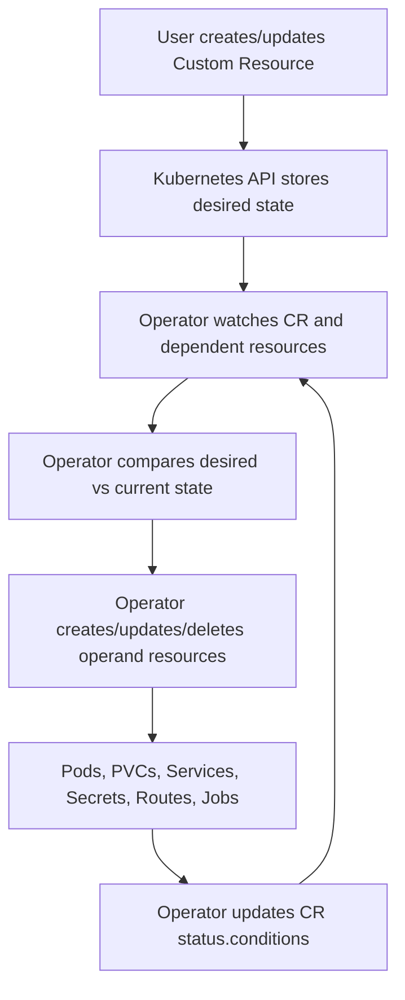

# Operand Troubleshooting in Operator Management

**Audience:** Advanced OpenShift Administration / DO380-style operations / production support engineers  
**Experience level:** Written for administrators with ~10 years of Linux, Kubernetes, OpenShift, and platform operations experience  
**Scope:** OpenShift Container Platform 4.x, OLM-managed Operators, custom resources, Operator-generated workloads, and production troubleshooting patterns

---

## 1. What Is an Operand?

In Operator terminology, an **Operator** is the controller that contains operational logic, and an **operand** is the application, platform component, or workload that the Operator manages.

Examples:

| Operator | Operand |
|---|---|
| OpenShift Logging Operator | LokiStack, collector pods, log forwarding components |
| OpenShift Data Foundation Operator | StorageCluster, Ceph pods, NooBaa components |
| Cert Manager Operator | cert-manager controller/webhook/cainjector workloads and Certificate resources |
| Service Mesh Operator | SMCP, Istiod, gateways, sidecars |
| PostgreSQL Operator | database cluster pods, services, PVCs, backup jobs |
| File Integrity Operator | FileIntegrity CRs and node scanning daemonsets |

Important distinction:

```text
OLM installs and manages the Operator.
The Operator reconciles Custom Resources and manages the operand.
```

So an Operator can appear healthy in OLM while the operand is broken. This is one of the most common mistakes in real OpenShift troubleshooting.

---

## 2. Operator vs Operand Troubleshooting

### 2.1 Operator-layer problem

This means OLM cannot install, upgrade, or run the Operator itself.

Typical objects:

```bash
Subscription
InstallPlan
ClusterServiceVersion
OperatorGroup
CatalogSource
OperatorCondition
Operator pod / deployment
```

Symptoms:

```text
CSV Pending / Failed
Subscription has InstallPlanFailed
CatalogSource unhealthy
Operator pod ImagePullBackOff
Operator deployment unavailable
OperatorGroup mismatch
RBAC installation failure
Manual InstallPlan not approved
```

### 2.2 Operand-layer problem

This means the Operator is installed, but the application or managed resource is unhealthy.

Typical objects:

```bash
Custom Resource
Operand Deployment / StatefulSet / DaemonSet
Pods
PVCs
Services
Routes
Secrets
ConfigMaps
Jobs
NetworkPolicies
SCC / SecurityContextConstraints
RBAC created by the Operator
```

Symptoms:

```text
Custom Resource Ready=False
status.conditions show ReconcileError
status.observedGeneration is stale
Operand pods Pending / CrashLoopBackOff / ImagePullBackOff
PVC Pending
Service has no endpoints
Route returns 503
Finalizer blocks deletion
Upgrade stuck due to operand migration
Operator logs show forbidden / denied / invalid spec
```

---

## 3. Mental Model: How Operand Reconciliation Works

Most Operators work through a reconciliation loop:



A production-grade troubleshooting approach should follow the same chain:

```text
Subscription/CSV healthy?
Operator pod healthy?
Operator watching the correct namespace?
CR exists and is valid?
CR status updated?
Generated resources created?
Generated pods scheduled?
Pods running and ready?
Services/endpoints/routes correct?
External dependencies reachable?
Finalizers/upgrade migrations clean?
```

---

## 4. Golden Rule: Start With the Custom Resource

For operand issues, the **Custom Resource** is usually the best source of truth.

The CR contains:

```text
metadata.generation        Desired-state version
status.observedGeneration  Last spec generation reconciled by the Operator
status.conditions          Human-readable and machine-readable health
metadata.finalizers        Cleanup hooks before deletion
metadata.ownerReferences   Ownership relationship if applicable
spec                       Desired operand configuration
status                     Observed operand state
```

Example:

```bash
oc get <custom-resource-kind> -A
oc describe <custom-resource-kind> <name> -n <namespace>
oc get <custom-resource-kind> <name> -n <namespace> -o yaml
```

Check conditions:

```bash
oc get <kind> <name> -n <namespace> \
  -o jsonpath='{range .status.conditions[*]}{.type}{"\t"}{.status}{"\t"}{.reason}{"\t"}{.message}{"\n"}{end}'
```

Check whether the Operator has reconciled the latest spec:

```bash
oc get <kind> <name> -n <namespace> \
  -o jsonpath='metadata.generation={.metadata.generation}{"\n"}status.observedGeneration={.status.observedGeneration}{"\n"}'
```

Interpretation:

| metadata.generation | status.observedGeneration | Meaning |
|---:|---:|---|
| Same | Same | Operator has seen the latest desired state |
| Higher | Lower or empty | Operator has not reconciled the latest change |
| Higher for long time | Lower for long time | Watch issue, operator crash, RBAC issue, reconcile error, stuck queue |

---

## 5. Step-by-Step Operand Troubleshooting Workflow

Use this workflow when an Operator is installed but its managed application is unhealthy.

---

### Step 1: Identify Operator Namespace and Operand Namespace

Many Operators are installed in one namespace and manage operands in another namespace.

Examples:

```text
Operator namespace: openshift-operators
Operand namespace: openshift-logging

Operator namespace: openshift-storage
Operand namespace: openshift-storage

Operator namespace: team1-operator
Operand namespace: team1
```

Commands:

```bash
oc get operators -A
oc get sub,csv,installplan,operatorgroup -A
oc get pods -A | grep -i operator
```

If you know the Operator namespace:

```bash
OP_NS=<operator-namespace>
oc get sub,csv,installplan,operatorgroup -n $OP_NS
```

---

### Step 2: Verify OLM Is Not the Root Cause

Even if the symptom looks like an operand issue, first ensure the Operator itself is stable.

```bash
oc get sub -n $OP_NS
oc describe sub <subscription-name> -n $OP_NS

oc get csv -n $OP_NS
oc describe csv <csv-name> -n $OP_NS

oc get installplan -n $OP_NS
oc describe installplan <installplan-name> -n $OP_NS

oc get operatorgroup -n $OP_NS
oc describe operatorgroup <operatorgroup-name> -n $OP_NS
```

Look for:

```text
CatalogSourcesUnhealthy
InstallPlanPending
InstallPlanFailed
ConstraintsNotSatisfiable
CSV Failed
CSV Pending
UnsupportedOperatorGroup
TooManyOperatorGroups
InterOperatorGroupOwnerConflict
Forbidden
serviceaccount cannot create/update resource
```

If the Operator is not installed correctly, fix OLM first. Operand troubleshooting is unreliable until the controller is running.

---

### Step 3: Find the CRDs Owned by the Operator

The CSV usually declares which CRDs the Operator owns.

```bash
CSV=<csv-name>
oc get csv $CSV -n $OP_NS \
  -o jsonpath='{range .spec.customresourcedefinitions.owned[*]}{.name}{"\t"}{.kind}{"\t"}{.version}{"\n"}{end}'
```

Also check required CRDs:

```bash
oc get csv $CSV -n $OP_NS \
  -o jsonpath='{range .spec.customresourcedefinitions.required[*]}{.name}{"\t"}{.kind}{"\t"}{.version}{"\n"}{end}'
```

List CRDs directly:

```bash
oc get crd | grep -i <operator-or-product-name>
```

Describe a CRD:

```bash
oc describe crd <crd-name>
oc get crd <crd-name> -o yaml
```

Useful CRD fields:

```text
spec.group
spec.names.kind
spec.names.plural
spec.names.shortNames
spec.scope
spec.versions[*].name
spec.versions[*].served
spec.versions[*].storage
spec.versions[*].schema
status.conditions
```

---

### Step 4: Locate All Custom Resource Instances

After identifying the CRD kind or plural name:

```bash
oc get <plural> -A
oc get <kind> -A
```

If unsure about the resource name:

```bash
oc api-resources | grep -i <keyword>
oc api-resources --api-group=<api-group>
```

Example:

```bash
oc api-resources | grep -i loki
oc get lokistack -A
oc get storagecluster -A
oc get fileintegrity -A
```

Now inspect the relevant CR:

```bash
CR_KIND=<kind>
CR_NAME=<name>
APP_NS=<operand-namespace>

oc describe $CR_KIND $CR_NAME -n $APP_NS
oc get $CR_KIND $CR_NAME -n $APP_NS -o yaml
```

---

### Step 5: Read CR Conditions Like a Senior Admin

Good Operators expose meaningful conditions.

Typical condition types:

```text
Available
Ready
Progressing
Degraded
Upgradeable
Reconciled
Reconciling
Successful
Failed
Valid
Invalid
Initialized
```

Typical reasons:

```text
ReconcileError
ValidationFailed
InvalidConfiguration
DependencyNotReady
OperandNotReady
DeploymentUnavailable
StorageUnavailable
WaitingForPVC
InstallFailed
MigrationInProgress
RBACError
ImagePullFailed
```

Command:

```bash
oc get $CR_KIND $CR_NAME -n $APP_NS \
  -o jsonpath='{range .status.conditions[*]}{.type}{"\t"}{.status}{"\t"}{.reason}{"\t"}{.message}{"\n"}{end}'
```

Interpretation examples:

| Condition | Meaning |
|---|---|
| `Ready=True` | Operand is considered healthy by the Operator |
| `Ready=False` | Operand is unhealthy or incomplete |
| `Progressing=True` | Reconciliation, rollout, migration, or upgrade is still happening |
| `Degraded=True` | Operator detected a serious operand failure |
| `Upgradeable=False` | Operator is blocking upgrade due to unsafe operand state |
| `Available=False` | Required operand component is unavailable |

A CR with no useful status is harder to troubleshoot. In that case, rely on operator logs, generated resources, and events.

---

### Step 6: Check Operator Logs for Reconcile Errors

Find the Operator pod/deployment:

```bash
oc get deploy -n $OP_NS
oc get pods -n $OP_NS
```

Logs:

```bash
oc logs deploy/<operator-deployment> -n $OP_NS --since=30m
oc logs pod/<operator-pod> -n $OP_NS --since=30m
oc logs pod/<operator-pod> -n $OP_NS -c <container-name> --since=30m
```

Filter common errors:

```bash
oc logs deploy/<operator-deployment> -n $OP_NS --since=60m | \
  egrep -i 'error|fail|failed|forbidden|denied|invalid|timeout|reconcile|panic|not found|conflict|quota|scc|permission'
```

Common log messages and interpretation:

| Log pattern | Likely issue |
|---|---|
| `forbidden` | Operator service account lacks RBAC |
| `cannot create resource` | Missing Role/ClusterRole permission |
| `failed to update status` | Missing status subresource permission or conflict |
| `no matches for kind` | Missing CRD or wrong API version |
| `invalid spec` | CR configuration is rejected by Operator validation |
| `context deadline exceeded` | API server, webhook, or external dependency timeout |
| `waiting for deployment rollout` | Operand deployment not available |
| `failed calling webhook` | Admission webhook or cert issue |
| `resource quota exceeded` | Namespace quota blocks operand creation |
| `violates PodSecurity` or `SCC` | Security context rejected |
| `secret not found` | Missing credential/config secret referenced by CR |
| `PVC is not bound` | Storage issue |

---

### Step 7: Confirm the Operator Is Watching the Operand Namespace

A common production issue: the CR exists, but the Operator is not watching that namespace.

Check OperatorGroup:

```bash
oc get operatorgroup -n $OP_NS -o yaml
```

Important fields:

```yaml
spec:
  targetNamespaces:
  - <namespace>
status:
  namespaces:
  - <namespace>
```

Interpretation:

| OperatorGroup configuration | Meaning |
|---|---|
| `spec.targetNamespaces` omitted | Global / all namespaces, if supported |
| `spec.targetNamespaces: [team1]` | Operator watches only `team1` |
| `status.namespaces: [""]` | Global watch indicator |
| Multiple OperatorGroups in same namespace | Usually invalid; can break CSV |
| Target namespace missing operand namespace | CR may never reconcile |

Check CSV install modes:

```bash
oc get csv $CSV -n $OP_NS -o yaml | grep -A20 installModes
```

Install mode matters:

```text
OwnNamespace      Operator watches its own namespace
SingleNamespace   Operator watches one selected namespace
MultiNamespace    Operator watches multiple selected namespaces
AllNamespaces     Operator watches all namespaces
```

If the CR is created in a namespace outside the Operator's watch scope, the Operator may ignore it completely.

---

### Step 8: Trace Generated Operand Resources

Many Operators create resources with labels, ownerReferences, or predictable names.

Start broad:

```bash
oc get all -n $APP_NS
oc get deploy,sts,ds,job,cronjob,svc,route,pvc,secret,cm,sa,role,rolebinding -n $APP_NS
```

Search by label:

```bash
oc get all -n $APP_NS --show-labels
oc get pods -n $APP_NS -l app.kubernetes.io/managed-by=<operator-name>
oc get pods -n $APP_NS -l app.kubernetes.io/instance=<cr-name>
oc get pods -n $APP_NS -l app.kubernetes.io/name=<app-name>
```

Check ownership:

```bash
oc get deploy <name> -n $APP_NS -o yaml | grep -A20 ownerReferences
oc get sts <name> -n $APP_NS -o yaml | grep -A20 ownerReferences
oc get pod <name> -n $APP_NS -o yaml | grep -A20 ownerReferences
```

Not every Operator sets ownerReferences for every resource. Cluster-scoped resources and cross-namespace resources often cannot use simple owner references.

---

## 6. Common Operand Failure Scenarios

---

### Scenario 1: CR Created but No Operand Resources Appear

Symptoms:

```text
CR exists
No Deployment/StatefulSet/DaemonSet created
CR status empty or stale
Operator logs quiet or show RBAC/watch errors
```

Checks:

```bash
oc get $CR_KIND $CR_NAME -n $APP_NS -o yaml
oc get operatorgroup -n $OP_NS -o yaml
oc logs deploy/<operator-deployment> -n $OP_NS --since=30m
oc get csv $CSV -n $OP_NS -o yaml
```

Root causes:

```text
Operator not watching the namespace
Wrong CR apiVersion/kind
CRD installed but Operator controller not running
Invalid CR spec ignored or rejected
Admission webhook rejected create/update
Operator lacks RBAC in target namespace
Operator cache not synced
Multiple Operators conflict over same CRD
Operator is degraded after upgrade
```

Fix approach:

```text
1. Confirm OperatorGroup target namespace.
2. Confirm CR apiVersion matches served CRD version.
3. Confirm Operator pod is running and ready.
4. Check operator logs for reconcile request.
5. Check RBAC with oc auth can-i.
6. Re-apply the CR after correcting spec or namespace.
```

RBAC example:

```bash
SA=<operator-service-account>

oc auth can-i create deployments.apps -n $APP_NS \
  --as=system:serviceaccount:$OP_NS:$SA

oc auth can-i update <plural>/status -n $APP_NS \
  --as=system:serviceaccount:$OP_NS:$SA
```

---

### Scenario 2: CR Status Shows `Ready=False` or `Degraded=True`

Symptoms:

```text
CR status.conditions show failure
Operator is running
Some operand resources exist
Operand not healthy
```

Commands:

```bash
oc describe $CR_KIND $CR_NAME -n $APP_NS
oc get $CR_KIND $CR_NAME -n $APP_NS -o yaml
oc get events -n $APP_NS --sort-by=.lastTimestamp
oc logs deploy/<operator-deployment> -n $OP_NS --since=60m
```

Troubleshooting pattern:

```text
Condition message tells you the high-level cause.
Events tell you Kubernetes-level failures.
Operator logs tell you controller-level failures.
Pod describe tells you scheduling/runtime failures.
```

Do not stop at `Ready=False`. Always read `reason` and `message`.

---

### Scenario 3: Operand Pods Are Pending

Symptoms:

```bash
oc get pods -n $APP_NS
# NAME                    READY   STATUS    RESTARTS   AGE
# app-0                   0/1     Pending   0          10m
```

Inspect:

```bash
oc describe pod <pod-name> -n $APP_NS
oc get events -n $APP_NS --sort-by=.lastTimestamp
```

Common causes:

| Cause | Evidence |
|---|---|
| ResourceQuota exceeded | Events show quota exceeded |
| LimitRange default missing/invalid | Pod rejected or defaulting unexpected |
| Insufficient CPU/memory | Scheduler event: insufficient resources |
| Node selector mismatch | `node(s) didn't match Pod's node affinity/selector` |
| Taint not tolerated | `node(s) had untolerated taint` |
| PVC Pending | `pod has unbound immediate PersistentVolumeClaims` |
| SCC/Pod Security issue | Admission error or security context rejection |
| Missing image pull secret | Image pull events after scheduling |

Commands:

```bash
oc describe quota -n $APP_NS
oc describe limitrange -n $APP_NS
oc get pvc -n $APP_NS
oc describe pvc <pvc-name> -n $APP_NS
oc get nodes --show-labels
oc describe node <node-name>
oc get pod <pod-name> -n $APP_NS -o yaml | grep -A30 -E 'nodeSelector|affinity|tolerations|resources|securityContext'
```

Fix approach:

```text
1. Resolve quota/limits or adjust CR resource requests.
2. Fix storage class/PVC problems.
3. Align nodeSelector/affinity/tolerations.
4. Fix SCC or security context only as narrowly as possible.
5. Let the Operator reconcile instead of editing generated pods directly.
```

---

### Scenario 4: Operand Pods Are CrashLoopBackOff

Symptoms:

```bash
oc get pods -n $APP_NS
# app-0   0/1   CrashLoopBackOff
```

Commands:

```bash
oc describe pod <pod-name> -n $APP_NS
oc logs <pod-name> -n $APP_NS
oc logs <pod-name> -n $APP_NS --previous
oc get events -n $APP_NS --sort-by=.lastTimestamp
```

Common causes:

```text
Bad application configuration generated from CR
Missing Secret or ConfigMap
Wrong credentials
TLS CA mismatch
Wrong database endpoint
Permission denied due to filesystem UID/SCC
Application cannot write to mounted PVC
Probe too aggressive
Unsupported image or architecture
Operand version incompatible with CR spec
```

Useful checks:

```bash
oc get pod <pod-name> -n $APP_NS -o yaml | grep -A50 'env:'
oc get pod <pod-name> -n $APP_NS -o yaml | grep -A50 'volumeMounts:'
oc get secret,cm -n $APP_NS
oc describe deploy <deploy-name> -n $APP_NS
oc describe sts <sts-name> -n $APP_NS
```

Production tip:

```text
For Operator-managed pods, do not permanently patch the Deployment/StatefulSet unless the Operator documentation says it is supported.
The Operator can revert manual changes during the next reconciliation.
Fix the source CR or referenced Secret/ConfigMap instead.
```

---

### Scenario 5: Operand ImagePullBackOff / ErrImagePull

Symptoms:

```text
ImagePullBackOff
ErrImagePull
unauthorized
manifest unknown
x509 certificate signed by unknown authority
repository not found
```

Commands:

```bash
oc describe pod <pod-name> -n $APP_NS
oc get pod <pod-name> -n $APP_NS -o jsonpath='{range .spec.containers[*]}{.name}{"\t"}{.image}{"\n"}{end}'
oc get secret -n $APP_NS
oc get sa -n $APP_NS -o yaml
```

Disconnected cluster checks:

```bash
oc get imagecontentsourcepolicy
oc get imagedigestmirrorset
oc get imagetagmirrorset
oc get catalogsource -n openshift-marketplace
oc describe catalogsource <catalogsource-name> -n openshift-marketplace
```

Root causes:

```text
Operand image not mirrored
Catalog image mirrored but operand image missing
Pull secret missing in operand namespace
Registry CA not trusted
Wrong image tag/digest in CR
Operator hardcodes upstream image unless configured for disconnected mode
```

Fix approach:

```text
1. Confirm the exact image pull spec from the pod.
2. Confirm pull secret access.
3. Confirm mirror mapping covers operand images, not only catalog/bundle images.
4. Confirm custom CA trust if using internal registry.
5. Patch the CR if the Operator supports image override fields.
```

---

### Scenario 6: Operand PVC Pending or Storage Not Ready

Symptoms:

```text
PVC Pending
StatefulSet pod Pending
StorageCluster degraded
Database operand waiting for volume
```

Commands:

```bash
oc get pvc -n $APP_NS
oc describe pvc <pvc-name> -n $APP_NS
oc get pv
oc get sc
oc describe sc <storage-class>
oc get events -n $APP_NS --sort-by=.lastTimestamp
```

Check volume binding mode:

```bash
oc get sc <storage-class> -o yaml | grep -E 'volumeBindingMode|provisioner|allowVolumeExpansion|reclaimPolicy'
```

Common causes:

```text
Wrong storageClassName in CR
No default StorageClass
Dynamic provisioner down
Topology mismatch
WaitForFirstConsumer behavior misunderstood
Requested access mode unsupported
Requested capacity unavailable
Quota blocks PVC creation
PV reclaim policy/manual PV mismatch
```

Fix approach:

```text
1. Confirm the Operator-supported storage fields in the CR.
2. Confirm StorageClass exists and supports requested mode.
3. Confirm provisioner pods are healthy.
4. Fix topology/scheduling conflict if WaitForFirstConsumer is involved.
5. Do not delete PVCs blindly; data loss risk.
```

---

### Scenario 7: Service Has No Endpoints / Route Gives 503

Symptoms:

```text
oc get route shows route exists
curl route returns 503
Service has no endpoints
Pods running but not selected by service
```

Commands:

```bash
oc get svc,route,endpoints,endpointslice -n $APP_NS
oc describe svc <service-name> -n $APP_NS
oc get pods -n $APP_NS --show-labels
oc get endpoints <service-name> -n $APP_NS -o yaml
oc get endpointslice -n $APP_NS -l kubernetes.io/service-name=<service-name> -o yaml
```

Root causes:

```text
Service selector does not match pod labels
Pods not Ready, so endpoints are not published
Wrong targetPort
Operator generated route before backend became ready
TLS termination mismatch
NetworkPolicy blocks traffic
Service mesh sidecar intercept issue
Readiness probe failing
```

Fix approach:

```text
1. Match service selectors with pod labels.
2. Confirm pod readiness.
3. Confirm containerPort and service targetPort.
4. Confirm route termination and backend protocol.
5. Confirm network policies and service mesh policy.
6. Fix the CR if it defines service/route behavior.
```

---

### Scenario 8: NetworkPolicy Blocks Operand Communication

Symptoms:

```text
Pods running but app cannot connect
Database connection timeout
Webhook timeout
Route works internally but not cross-namespace
```

Commands:

```bash
oc get networkpolicy -n $APP_NS
oc describe networkpolicy <policy-name> -n $APP_NS
oc get pods -n $APP_NS --show-labels
oc get ns --show-labels
```

Test from a temporary debug pod:

```bash
oc run net-test -n <source-namespace> --image=registry.access.redhat.com/ubi9/ubi --restart=Never -- sleep 3600
oc rsh -n <source-namespace> net-test
curl -vk https://<service>.<namespace>.svc:443
```

If tools are missing in minimal images, use an image that contains curl/nc or install tools only in disposable debug pods when allowed.

Common causes:

```text
Default-deny policy exists
Namespace selector mismatch
Pod selector mismatch
Wrong port/protocol
Egress blocked from source namespace
Ingress allowed to pods but DNS egress blocked
Operator creates NetworkPolicies but custom policy conflicts
```

Fix approach:

```text
1. Confirm whether namespace has default-deny.
2. Confirm source namespace labels.
3. Confirm destination pod labels.
4. Allow DNS egress if using service names.
5. Avoid broad allow-all unless emergency mitigation is approved.
```

---

### Scenario 9: SCC / Pod Security Admission Blocks Operand

Symptoms:

```text
Pod creation forbidden
violates PodSecurity
unable to validate against any security context constraint
runAsUser invalid
privileged container not allowed
hostPath not allowed
```

Commands:

```bash
oc get events -n $APP_NS --sort-by=.lastTimestamp
oc describe pod <pod-name> -n $APP_NS
oc get pod <pod-name> -n $APP_NS -o yaml | grep -A30 securityContext
oc get sa -n $APP_NS
oc adm policy who-can use scc/anyuid
oc adm policy who-can use scc/privileged
```

Check which SCC admitted a running pod:

```bash
oc get pod <pod-name> -n $APP_NS -o jsonpath='{.metadata.annotations.openshift\.io/scc}{"\n"}'
```

Root causes:

```text
Operator-generated pod requires UID 0 but service account cannot use anyuid SCC
Operand requires privileged SCC
HostPath/hostNetwork/hostPID blocked
Seccomp/capabilities invalid under restricted policy
Namespace Pod Security labels too strict for catalog/operand workload
```

Fix approach:

```text
1. Prefer Operator-documented SCC/RBAC procedure.
2. Bind only the required SCC to the exact service account.
3. Avoid granting privileged SCC broadly.
4. Reconcile through CR or documented Subscription configuration.
```

Example:

```bash
oc adm policy add-scc-to-user anyuid -z <service-account> -n $APP_NS
```

Use this only when the Operator documentation or support guidance requires it.

---

### Scenario 10: Operand Upgrade Stuck

Symptoms:

```text
Subscription upgraded
CSV replaced old version
Operator pod updated
CR shows Progressing=True for long time
Operand pods stuck on old version
OperatorCondition Upgradeable=False
```

Commands:

```bash
oc get sub,csv,installplan -n $OP_NS
oc describe sub <subscription-name> -n $OP_NS
oc describe csv <csv-name> -n $OP_NS
oc get operatorcondition -n $OP_NS
oc describe operatorcondition <name> -n $OP_NS
oc get $CR_KIND $CR_NAME -n $APP_NS -o yaml
oc logs deploy/<operator-deployment> -n $OP_NS --since=2h
```

Root causes:

```text
Manual InstallPlan not approved
Operator condition blocks upgrade
Operand migration running
CR spec incompatible with new version
Webhook conversion failure
CRD version conversion issue
Old operand pods cannot terminate
PVC/data migration failed
Image mirror missing new operand image
New version requires new permission/SCC
```

Fix approach:

```text
1. Determine whether OLM upgrade or operand migration is stuck.
2. Read OperatorCondition and CR status.
3. Check operator logs for migration messages.
4. Confirm new operand images are pullable.
5. Confirm CRD served/storage versions.
6. Do not force-delete old pods/PVCs without understanding migration state.
```

---

### Scenario 11: Operand Deletion Stuck Due to Finalizers

Symptoms:

```text
CR stuck Terminating
Namespace stuck Terminating
Operand resources remain after deleting CR
CR has metadata.finalizers
```

Commands:

```bash
oc get $CR_KIND $CR_NAME -n $APP_NS -o yaml | grep -A20 finalizers
oc get $CR_KIND $CR_NAME -n $APP_NS -o jsonpath='{.metadata.deletionTimestamp}{"\n"}{.metadata.finalizers}{"\n"}'
oc logs deploy/<operator-deployment> -n $OP_NS --since=60m
oc get events -n $APP_NS --sort-by=.lastTimestamp
```

Why this happens:

```text
A finalizer tells Kubernetes not to delete the object until the responsible controller performs cleanup.
If the Operator is absent, broken, or cannot delete external/dependent resources, the finalizer remains and deletion waits forever.
```

Root causes:

```text
Operator uninstalled before deleting CRs
Operator lacks delete permission
External dependency cleanup failed
Webhook unavailable
Dependent PVC/snapshot/backup cannot be removed
Cluster-scoped dependent resource remains
Namespace deletion blocks discovery of remaining CRs
```

Fix approach:

```text
1. Reinstall or repair the Operator if possible.
2. Let the Operator remove the finalizer normally.
3. Delete dependent resources cleanly.
4. Remove finalizers manually only as a last resort and only after confirming cleanup impact.
```

Emergency finalizer removal example:

```bash
oc patch $CR_KIND $CR_NAME -n $APP_NS --type=merge -p '{"metadata":{"finalizers":null}}'
```

Warning:

```text
Removing finalizers can orphan cloud resources, storage resources, DNS records, load balancers, backup objects, or cluster-scoped resources.
Use only after impact review.
```

---

### Scenario 12: Operator Recreates Manual Changes

Symptoms:

```text
Admin patches generated deployment
Change disappears after a few seconds/minutes
Operator logs show reconciliation
```

Explanation:

```text
Generated operand resources are controlled by the Operator.
The CR is the source of truth.
Manual changes to generated Deployments/StatefulSets/Services can be reverted by reconciliation.
```

Correct approach:

```text
1. Check if the CR supports the desired configuration.
2. Update the CR spec.
3. Use documented override fields only.
4. If unsupported, open vendor/support case or use supported customization hooks.
```

Bad practice:

```bash
oc patch deployment <operator-managed-deployment> -n $APP_NS ...
```

Better practice:

```bash
oc edit $CR_KIND $CR_NAME -n $APP_NS
```

---

## 7. Advanced Debugging Commands

### 7.1 Fast Environment Snapshot

```bash
OP_NS=<operator-namespace>
APP_NS=<operand-namespace>

oc get sub,csv,installplan,operatorgroup -n $OP_NS
oc get pods,deploy,rs -n $OP_NS
oc get all -n $APP_NS
oc get events -n $APP_NS --sort-by=.lastTimestamp | tail -50
```

---

### 7.2 Extract CR Health

```bash
CR_KIND=<kind>
CR_NAME=<name>
APP_NS=<namespace>

oc get $CR_KIND $CR_NAME -n $APP_NS \
  -o jsonpath='{.metadata.name}{"\n"}{.metadata.generation}{"\n"}{.status.observedGeneration}{"\n"}'

oc get $CR_KIND $CR_NAME -n $APP_NS \
  -o jsonpath='{range .status.conditions[*]}{.lastTransitionTime}{"\t"}{.type}{"\t"}{.status}{"\t"}{.reason}{"\t"}{.message}{"\n"}{end}'
```

---

### 7.3 Check Operator Service Account Permissions

Find service account from CSV:

```bash
oc get csv $CSV -n $OP_NS -o yaml | grep -A5 serviceAccountName
```

Or from deployment:

```bash
oc get deploy <operator-deployment> -n $OP_NS \
  -o jsonpath='{.spec.template.spec.serviceAccountName}{"\n"}'
```

Test permissions:

```bash
SA=<operator-service-account>

oc auth can-i get pods -n $APP_NS \
  --as=system:serviceaccount:$OP_NS:$SA

oc auth can-i create deployments.apps -n $APP_NS \
  --as=system:serviceaccount:$OP_NS:$SA

oc auth can-i update <plural>/status -n $APP_NS \
  --as=system:serviceaccount:$OP_NS:$SA

oc auth can-i delete persistentvolumeclaims -n $APP_NS \
  --as=system:serviceaccount:$OP_NS:$SA
```

---

### 7.4 Inspect Webhooks

Operators often install admission or conversion webhooks.

```bash
oc get validatingwebhookconfiguration | grep -i <operator>
oc get mutatingwebhookconfiguration | grep -i <operator>
oc get apiservice | grep -i <operator>
```

Describe webhook:

```bash
oc describe validatingwebhookconfiguration <name>
oc describe mutatingwebhookconfiguration <name>
```

Common webhook failures:

```text
Service not found
Webhook service has no endpoints
TLS cert expired
CA bundle mismatch
Webhook pod down
NetworkPolicy blocks API server to webhook
Conversion webhook broken after CRD upgrade
```

---

### 7.5 Inspect API Discovery and CRD Versions

```bash
oc api-resources | grep -i <keyword>
oc explain <kind>.spec
oc explain <kind>.status
oc get crd <crd-name> -o yaml
```

Check served/storage versions:

```bash
oc get crd <crd-name> \
  -o jsonpath='{range .spec.versions[*]}{.name}{"\tserved="}{.served}{"\tstorage="}{.storage}{"\n"}{end}'
```

A broken conversion webhook or removed served version can cause CR reads/updates to fail.

---

### 7.6 Capture Evidence for Support or RCA

```bash
mkdir -p operand-debug

oc get sub,csv,installplan,operatorgroup -n $OP_NS -o yaml > operand-debug/olm.yaml
oc get pods,deploy,rs -n $OP_NS -o wide > operand-debug/operator-workloads.txt
oc get all -n $APP_NS -o wide > operand-debug/operand-workloads.txt
oc get events -n $APP_NS --sort-by=.lastTimestamp > operand-debug/events.txt
oc get $CR_KIND $CR_NAME -n $APP_NS -o yaml > operand-debug/custom-resource.yaml
oc logs deploy/<operator-deployment> -n $OP_NS --since=2h > operand-debug/operator.log
```

OpenShift inspect:

```bash
oc adm inspect ns/$OP_NS ns/$APP_NS crd/<crd-name>
```

Must-gather:

```bash
oc adm must-gather
```

Some Operators provide product-specific must-gather images. Use the vendor or Red Hat documented command when available.

---

## 8. Decision Tree for Operand Troubleshooting

```text
START
 |
 |-- Is Subscription/CSV healthy?
 |      |-- No  -> Fix OLM layer first
 |      '-- Yes
 |
 |-- Is Operator pod running and ready?
 |      |-- No  -> Fix operator deployment, image, SCC, RBAC, node scheduling
 |      '-- Yes
 |
 |-- Is CR in a watched namespace?
 |      |-- No  -> Fix OperatorGroup/install mode or move CR
 |      '-- Yes
 |
 |-- Does CR status.observedGeneration match metadata.generation?
 |      |-- No  -> Check operator logs, watch scope, RBAC, reconcile errors
 |      '-- Yes
 |
 |-- Do CR conditions show Ready=True?
 |      |-- Yes -> Check service/route/external app-level issue
 |      '-- No
 |
 |-- Are generated resources created?
 |      |-- No  -> Check validation, RBAC, operator logs
 |      '-- Yes
 |
 |-- Are pods scheduled?
 |      |-- No  -> Check quota, limits, PVC, node selector, taints, SCC
 |      '-- Yes
 |
 |-- Are pods running and ready?
 |      |-- No  -> Check image pull, logs, probes, config, storage, secrets
 |      '-- Yes
 |
 |-- Is traffic working?
        |-- No  -> Check service selectors, endpoints, route, TLS, NetworkPolicy
        '-- Yes -> Operand healthy; check higher app-level dependencies
```

---

## 9. Production RCA Template

Use this format during incidents.

```markdown
# Operand Incident RCA

## Summary
- Operator:
- Operator namespace:
- Operand CR kind/name:
- Operand namespace:
- Impact:
- Start time:
- End time:

## Detection
- Alert:
- User report:
- CLI evidence:

## OLM State
- Subscription:
- CSV:
- InstallPlan:
- OperatorGroup:
- OperatorCondition:

## Custom Resource State
- metadata.generation:
- status.observedGeneration:
- Ready condition:
- Degraded condition:
- Last transition:
- Finalizers:

## Operand Workload State
- Deployments/StatefulSets/DaemonSets:
- Pods:
- PVCs:
- Services/Routes:
- NetworkPolicies:

## Root Cause
- Primary technical cause:
- Trigger:
- Contributing factors:

## Resolution
- Commands/actions taken:
- Rollback required:
- Data impact:

## Prevention
- Monitoring:
- Quota/SCC/RBAC guardrails:
- Upgrade test:
- Runbook update:
```

---

## 10. Exam and Real-World Tips

### 10.1 For OpenShift exams/labs

Remember:

```text
Operator installed successfully does not mean operand is healthy.
Always check the CR and generated resources.
```

Fast exam workflow:

```bash
oc get sub,csv,installplan -n <operator-ns>
oc get crd | grep -i <keyword>
oc get <cr-kind> -A
oc describe <cr-kind> <name> -n <ns>
oc get pods -n <operand-ns>
oc describe pod <bad-pod> -n <operand-ns>
oc get events -n <operand-ns> --sort-by=.lastTimestamp
oc logs deploy/<operator-deployment> -n <operator-ns>
```

### 10.2 For production

Do:

```text
Change the CR, not generated resources.
Check observedGeneration before assuming the Operator processed your change.
Check OperatorGroup scope before debugging nonexistent bugs.
Check operand image mirroring in disconnected clusters.
Preserve logs/events before deleting pods.
Review finalizers before force deletion.
Use least-privilege SCC/RBAC changes.
```

Avoid:

```text
Deleting PVCs during migration.
Removing finalizers without cleanup review.
Granting privileged SCC to broad groups.
Patching Operator-generated deployments permanently.
Upgrading Operators without checking Operator lifecycle/support policy.
Ignoring Upgradeable=False conditions.
```

---

## 11. Troubleshooting Cheat Sheet

```bash
# OLM health
oc get sub,csv,installplan,operatorgroup -n <operator-ns>
oc describe sub <sub> -n <operator-ns>
oc describe csv <csv> -n <operator-ns>

# Operator pod health
oc get pods,deploy -n <operator-ns>
oc logs deploy/<operator-deployment> -n <operator-ns> --since=60m

# CRD discovery
oc get crd | grep -i <keyword>
oc api-resources | grep -i <keyword>
oc explain <kind>.spec

# CR health
oc get <kind> -A
oc describe <kind> <name> -n <namespace>
oc get <kind> <name> -n <namespace> -o yaml

# CR conditions
oc get <kind> <name> -n <namespace> \
  -o jsonpath='{range .status.conditions[*]}{.type}{"\t"}{.status}{"\t"}{.reason}{"\t"}{.message}{"\n"}{end}'

# Generation check
oc get <kind> <name> -n <namespace> \
  -o jsonpath='gen={.metadata.generation}{"\n"}observed={.status.observedGeneration}{"\n"}'

# Operand resources
oc get all -n <operand-ns>
oc get deploy,sts,ds,job,pvc,svc,route,secret,cm -n <operand-ns>
oc get events -n <operand-ns> --sort-by=.lastTimestamp

# Pod troubleshooting
oc describe pod <pod> -n <operand-ns>
oc logs <pod> -n <operand-ns>
oc logs <pod> -n <operand-ns> --previous

# Service/route
oc get svc,route,endpoints,endpointslice -n <operand-ns>
oc describe svc <svc> -n <operand-ns>

# Storage
oc get pvc,pv,sc -n <operand-ns>
oc describe pvc <pvc> -n <operand-ns>

# Security
oc get pod <pod> -n <operand-ns> -o jsonpath='{.metadata.annotations.openshift\.io/scc}{"\n"}'
oc adm policy who-can use scc/anyuid

# RBAC as Operator service account
oc auth can-i create deployments.apps -n <operand-ns> \
  --as=system:serviceaccount:<operator-ns>:<operator-sa>

# Finalizers
oc get <kind> <name> -n <namespace> \
  -o jsonpath='{.metadata.deletionTimestamp}{"\n"}{.metadata.finalizers}{"\n"}'
```

---

## 12. Key Takeaways

1. **Operand troubleshooting starts at the Custom Resource, not only at pods.**
2. **OLM health and operand health are different layers.**
3. **`metadata.generation` vs `status.observedGeneration` tells whether the Operator processed the latest desired state.**
4. **CR `status.conditions` usually contains the best high-level failure reason.**
5. **Operator logs explain reconcile failures; pod events explain Kubernetes scheduling/runtime failures.**
6. **OperatorGroup scope errors are a major cause of CRs not being reconciled.**
7. **Generated resources are not the source of truth; the CR is.**
8. **Finalizers are cleanup contracts; removing them can orphan resources.**
9. **Disconnected environments require mirroring operand images, not only catalog images.**
10. **Production fixes should be made through supported CR fields, documented overrides, or vendor guidance.**

---

## 13. References

- Red Hat OpenShift Container Platform 4.21 — Operators, Administrator tasks
- Red Hat OpenShift Container Platform 4.21 — OLM v1 overview
- Red Hat OpenShift Container Platform — Operator troubleshooting guidance
- Red Hat OpenShift Operator lifecycle policy
- Kubernetes Documentation — Custom Resources
- Operator SDK Documentation — Advanced topics, status conditions, finalizers

