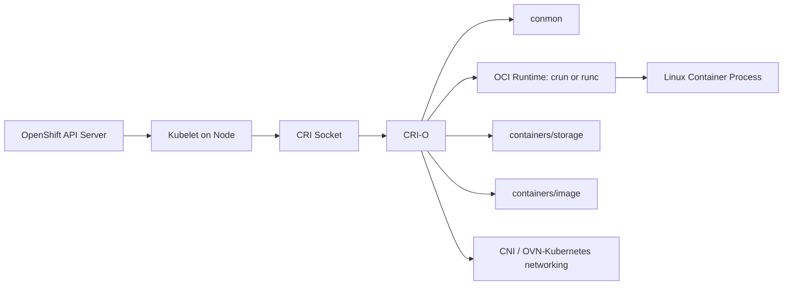
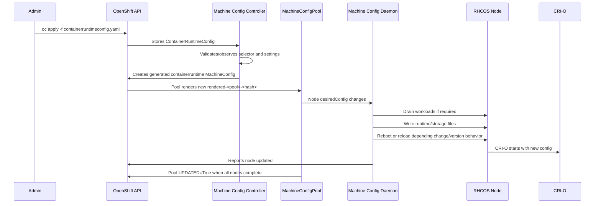

# Container Runtime Config in MachineConfig and Node-Level Administration

**Audience:** Advanced OpenShift administrators, platform engineers, SREs, and Linux administrators with production cluster responsibility.  
**Focus:** `ContainerRuntimeConfig`, CRI-O, Machine Config Operator, MachineConfigPool targeting, node rollout behavior, verification, troubleshooting, and production-safe operations.  
**Context:** Advanced OpenShift Administration / DO380-style node-level administration.

---

## Table of Contents

1. [Executive Summary](#1-executive-summary)
2. [Container Runtime: What Problem It Solves](#2-container-runtime-what-problem-it-solves)
3. [Where Container Runtime Config Fits in OpenShift](#3-where-container-runtime-config-fits-in-openshift)
4. [CRI-O in OpenShift](#4-cri-o-in-openshift)
5. [Important Runtime Files on an OpenShift Node](#5-important-runtime-files-on-an-openshift-node)
6. [Machine Config Operator Relationship](#6-machine-config-operator-relationship)
7. [`ContainerRuntimeConfig` Object](#7-containerruntimeconfig-object)
8. [`ContainerRuntimeConfig` vs `MachineConfig` vs `KubeletConfig`](#8-containerruntimeconfig-vs-machineconfig-vs-kubeletconfig)
9. [How the Change Flows from API to Node](#9-how-the-change-flows-from-api-to-node)
10. [Supported and Commonly Used Settings](#10-supported-and-commonly-used-settings)
11. [MachineConfigPool Targeting](#11-machineconfigpool-targeting)
12. [Production YAML Examples](#12-production-yaml-examples)
13. [Runtime Selection: `crun` vs `runc`](#13-runtime-selection-crun-vs-runc)
14. [Overlay Size Deep Dive](#14-overlay-size-deep-dive)
15. [Runtime Logging Deep Dive](#15-runtime-logging-deep-dive)
16. [Container Log Size and PID Limits](#16-container-log-size-and-pid-limits)
17. [Rollout, Drain, Reboot, and Disruption](#17-rollout-drain-reboot-and-disruption)
18. [Verification Commands](#18-verification-commands)
19. [Troubleshooting](#19-troubleshooting)
20. [Rollback and Cleanup](#20-rollback-and-cleanup)
21. [Production Best Practices](#21-production-best-practices)
22. [Real-World Scenarios](#22-real-world-scenarios)
23. [Interview and Exam Notes](#23-interview-and-exam-notes)
24. [Command Cheat Sheet](#24-command-cheat-sheet)
25. [References](#25-references)

---

## 1. Executive Summary

In OpenShift, the container runtime on Red Hat Enterprise Linux CoreOS nodes is **CRI-O**. The runtime is responsible for pulling images, preparing container root filesystems, talking to OCI runtimes such as `crun` or `runc`, managing container lifecycle through the Kubernetes Container Runtime Interface, and working with helper components such as `conmon`.

For most production administrators, you should **not manually edit** runtime files like:

- `/etc/crio/crio.conf`
- `/etc/crio/crio.conf.d/*.conf`
- `/etc/containers/storage.conf`
- `/etc/containers/registries.conf`

Instead, OpenShift expects node-level configuration to be managed declaratively through the **Machine Config Operator**.

For CRI-O tuning, the primary high-level object is:

```yaml
apiVersion: machineconfiguration.openshift.io/v1
kind: ContainerRuntimeConfig
```

`ContainerRuntimeConfig` lets you tune selected CRI-O runtime parameters for nodes that belong to a selected `MachineConfigPool`. The Machine Config Operator renders those settings into generated `MachineConfig` objects, applies them to matching nodes, and normally performs a controlled node drain/reboot cycle where required.

At a 10-year-experience level, the most important things to understand are:

- `ContainerRuntimeConfig` targets **MachineConfigPools**, not individual nodes directly.
- The selector matches **labels on the MachineConfigPool**, not labels on pods or applications.
- MCO generates machine configs such as `99-worker-generated-containerruntime`.
- Runtime config changes can cause node updates, drains, and reboots.
- Editing generated runtime files manually can create MCO drift and degrade nodes.
- Some settings are version-dependent; always confirm with `oc explain containerruntimeconfig.spec.containerRuntimeConfig` on your actual cluster.
- Runtime changes affect node behavior globally for workloads on the selected pool, so test on a custom pool before broad production rollout.

---

## 2. Container Runtime: What Problem It Solves

Kubernetes itself does not directly start Linux containers. The kubelet delegates container lifecycle operations to a runtime through the **Container Runtime Interface**.

A simplified flow looks like this:



When a pod is scheduled to a node:

1. The scheduler assigns the pod to a node.
2. The kubelet on that node observes the assigned pod.
3. The kubelet calls the CRI endpoint exposed by CRI-O.
4. CRI-O pulls or locates the image.
5. CRI-O prepares the container storage layer.
6. CRI-O creates an OCI runtime spec.
7. `crun` or `runc` creates the actual Linux container process.
8. `conmon` monitors the process and handles logging/exit status.
9. Kubelet reports pod and container state back to the API server.

From an administrator perspective, CRI-O is not just a “binary that runs containers.” It is part of the node control plane. If it is misconfigured, pods may fail to start, logging may behave incorrectly, image storage may be constrained, or nodes may become degraded during MCO reconciliation.

---

## 3. Where Container Runtime Config Fits in OpenShift

OpenShift node administration is layered:

```text
Cluster API objects
  └── MachineConfig / KubeletConfig / ContainerRuntimeConfig
       └── Machine Config Operator
            └── Rendered MachineConfig
                 └── Machine Config Daemon on each node
                      └── RHCOS host files and services
                           ├── kubelet
                           ├── CRI-O
                           ├── systemd
                           ├── kernel args
                           └── node-level OS configuration
```

For container runtime configuration, the common path is:

```text
ContainerRuntimeConfig CR
  → Machine Config Controller renders generated containerruntime MachineConfig
  → MachineConfigPool detects new rendered config
  → Machine Config Daemon applies host file changes
  → Node drains/reboots/reloads as required
  → CRI-O uses new configuration
```

OpenShift gives administrators a declarative model:

- Desired state is stored in cluster API objects.
- The MCO reconciles nodes to that desired state.
- New nodes joining the same pool receive the same runtime config.
- Manual drift is detected and can mark nodes degraded.

This is very different from traditional Linux administration where you SSH into each server and edit `/etc/crio/crio.conf` by hand. In OpenShift, direct node edits are emergency troubleshooting only, not the long-term source of truth.

---

## 4. CRI-O in OpenShift

CRI-O is a Kubernetes-focused container runtime. It implements the Kubernetes CRI and uses OCI-compatible runtimes to create containers.

Important CRI-O responsibilities include:

- Receiving pod/container lifecycle requests from kubelet.
- Pulling images through containers/image libraries.
- Storing image and container layers through containers/storage.
- Creating OCI runtime specifications.
- Starting containers through `crun` or `runc`.
- Integrating with `conmon` for container monitoring and logging.
- Integrating with CNI networking used by OpenShift networking implementations.
- Enforcing runtime-level security features together with SELinux, seccomp, cgroups, capabilities, and namespaces.

In OpenShift 4.x, CRI-O is managed as a systemd service on RHCOS nodes:

```bash
systemctl status crio
journalctl -u crio -b
crio status
crio config
```

Inside an `oc debug node/...` session, you normally inspect CRI-O like this:

```bash
oc debug node/<node-name>
chroot /host
systemctl status crio
crio config | less
journalctl -u crio -b --no-pager
```

---

## 5. Important Runtime Files on an OpenShift Node

The exact files can vary by OpenShift version, but these are the files and directories you should know.

| Path | Purpose | Should you edit manually? |
|---|---|---|
| `/etc/crio/crio.conf` | Main CRI-O configuration | No, use MCO-managed objects |
| `/etc/crio/crio.conf.d/` | Drop-in CRI-O config snippets | Usually MCO-managed |
| `/etc/containers/storage.conf` | Container image/container storage configuration | No, use supported APIs/MCO |
| `/etc/containers/registries.conf` | Registry search, mirrors, insecure/blocked registry config | Use image config resources, IDMS/ITMS/ICSP as appropriate |
| `/etc/containers/policy.json` | Image signature policy | Use supported OpenShift image policy mechanisms |
| `/var/lib/containers/storage` | Local container/image storage | Do not manually modify except under support guidance |
| `/var/log/pods` | Pod log symlinks/files | Do not manually modify |
| `/var/log/containers` | Container log symlinks/files | Do not manually modify |
| `/run/crio/crio.sock` or equivalent | CRI-O socket | Runtime-managed |

A common mistake is to log in to a node and edit `/etc/crio/crio.conf` directly. That might appear to work for a short time, but it creates a mismatch between actual node state and the rendered machine config. The Machine Config Daemon can detect this as drift, and the node can become degraded.

---

## 6. Machine Config Operator Relationship

The Machine Config Operator manages operating system and node-level configuration in OpenShift. It handles changes involving:

- RHCOS updates
- systemd units
- kubelet configuration
- CRI-O configuration
- kernel arguments
- files on the host
- registry-related node files
- SSH key changes
- selected node-level OS features

The main components are:

| Component | Role |
|---|---|
| `machine-config-controller` | Renders and coordinates machine config updates |
| `machine-config-daemon` | Runs on every node and applies rendered config |
| `machine-config-server` | Serves Ignition config to nodes during provisioning/join |
| `MachineConfigPool` | Groups nodes that receive the same rendered config |
| `MachineConfig` | Describes host-level files, units, kernel args, and generated configs |
| `ContainerRuntimeConfig` | High-level API for selected CRI-O settings |
| `KubeletConfig` | High-level API for selected kubelet settings |

Important point:

> `ContainerRuntimeConfig` is not directly written to the node. It is consumed by the MCO, which generates one or more `MachineConfig` objects. Those generated machine configs are then rendered into a final pool configuration.

Example generated object names:

```text
99-worker-generated-containerruntime
99-worker-generated-containerruntime-1
rendered-worker-<hash>
```

---

## 7. `ContainerRuntimeConfig` Object

The object format is:

```yaml
apiVersion: machineconfiguration.openshift.io/v1
kind: ContainerRuntimeConfig
metadata:
  name: <name>
spec:
  machineConfigPoolSelector:
    matchLabels:
      <label-key>: <label-value>
  containerRuntimeConfig:
    <runtime-setting>: <value>
```

A practical example:

```yaml
apiVersion: machineconfiguration.openshift.io/v1
kind: ContainerRuntimeConfig
metadata:
  name: worker-runtime-config
spec:
  machineConfigPoolSelector:
    matchLabels:
      pools.operator.machineconfiguration.openshift.io/worker: ""
  containerRuntimeConfig:
    logLevel: info
    overlaySize: 8G
    defaultRuntime: "crun"
```

Key sections:

### `metadata.name`

The name of the `ContainerRuntimeConfig` object. Keep it meaningful:

```yaml
metadata:
  name: worker-crio-overlay-8g
```

Avoid random names like `test1`, `abc`, or `newconfig`. In production, object names become part of troubleshooting history.

### `spec.machineConfigPoolSelector`

This selects the `MachineConfigPool` to which the config applies.

This selector matches **MCP labels**, not node labels.

Example:

```yaml
machineConfigPoolSelector:
  matchLabels:
    pools.operator.machineconfiguration.openshift.io/worker: ""
```

### `spec.containerRuntimeConfig`

This contains the actual CRI-O tuning values. Common settings include:

```yaml
containerRuntimeConfig:
  logLevel: debug
  overlaySize: 8G
  defaultRuntime: "runc"
```

Depending on OpenShift version and CRD schema, fields such as `logSizeMax` and `pidsLimit` may appear in `oc explain`. Always check your actual cluster.

```bash
oc explain containerruntimeconfig.spec.containerRuntimeConfig
```

---

## 8. `ContainerRuntimeConfig` vs `MachineConfig` vs `KubeletConfig`

These objects are related but not interchangeable.

| Requirement | Preferred Object | Why |
|---|---|---|
| Change supported CRI-O runtime tuning | `ContainerRuntimeConfig` | Higher-level supported abstraction |
| Change kubelet parameters such as `maxPods`, `containerLogMaxSize`, `podPidsLimit` | `KubeletConfig` | Kubelet owns these settings |
| Add custom host file | `MachineConfig` | Writes files through Ignition/MCO |
| Add systemd unit | `MachineConfig` | Native systemd management through MCO |
| Add kernel argument | `MachineConfig` | Kernel args are part of MachineConfig spec |
| Configure default runtime `crun`/`runc` | `ContainerRuntimeConfig` | Runtime-level setting |
| Configure registry mirrors or image source policies | Image config resources / IDMS / ITMS / ICSP depending version | Registry config is not the same as runtime tuning |
| Configure per-pod security context | Pod spec / SCC / SecurityContextConstraints | Workload-level policy, not node runtime config |

### Senior-level rule

Use the most specific supported API first:

```text
Workload-level setting → Pod/Deployment/SCC
Kubelet-level setting  → KubeletConfig
CRI-O-level setting    → ContainerRuntimeConfig
Host OS file/unit      → MachineConfig
Kernel tuning          → MachineConfig or Node Tuning Operator depending setting
```

Do not use a raw `MachineConfig` to overwrite CRI-O files unless:

- the setting is not available through supported higher-level APIs,
- Red Hat documentation or support confirms the approach,
- you have tested it in a non-production pool,
- you understand MCO drift and upgrade risks.

---

## 9. How the Change Flows from API to Node

The reconciliation path is one of the most important topics for advanced administration.



### What you see as an admin

After applying a `ContainerRuntimeConfig`, you usually inspect:

```bash
oc get ctrcfg
oc get mc | grep containerruntime
oc get mcp
oc describe mcp worker
oc get nodes
```

During rollout, `oc get mcp worker` commonly shows:

```text
UPDATED   UPDATING   DEGRADED
False     True       False
```

When complete:

```text
UPDATED   UPDATING   DEGRADED
True      False      False
```

---

## 10. Supported and Commonly Used Settings

The exact schema depends on OpenShift version. Always check your cluster:

```bash
oc explain containerruntimeconfig
oc explain containerruntimeconfig.spec
oc explain containerruntimeconfig.spec.containerRuntimeConfig
```

Common fields you may encounter:

| Field | Type | Purpose | Notes |
|---|---:|---|---|
| `logLevel` | string | CRI-O log verbosity | Common values: `fatal`, `panic`, `error`, `warn`, `info`, `debug`; newer docs may include `trace` |
| `overlaySize` | string | Maximum overlay root filesystem size for containers | Example: `8G` |
| `defaultRuntime` | string | Default OCI runtime for new containers | Usually `crun` or `runc`, version-dependent default |
| `logSizeMax` | string | Maximum container log file size at runtime layer | Validate with `oc explain`; kubelet also has log settings |
| `pidsLimit` | integer | Runtime-level PID limit | Validate version behavior; kubelet also has pod PID settings |

### Very important version note

OpenShift behavior changes across minor versions. For example, newer OpenShift releases use `crun` as default for new installations, while upgraded clusters may preserve `runc` through generated override machine configs. Some PID/log settings are better handled through `KubeletConfig` on modern releases.

Before applying a config from a blog, old lab, or previous exam practice, check:

```bash
oc version
oc get clusterversion
oc explain containerruntimeconfig.spec.containerRuntimeConfig
oc explain kubeletconfig.spec.kubeletConfig
```

---

## 11. MachineConfigPool Targeting

### 11.1 Default worker pool

Most examples target the worker MCP:

```yaml
machineConfigPoolSelector:
  matchLabels:
    pools.operator.machineconfiguration.openshift.io/worker: ""
```

Verify labels:

```bash
oc get mcp worker --show-labels
```

Example output:

```text
NAME     CONFIG              UPDATED   UPDATING   DEGRADED   LABELS
worker   rendered-worker...  True      False      False      machineconfiguration.openshift.io/mco-built-in=,pools.operator.machineconfiguration.openshift.io/worker=
```

### 11.2 Control plane pool

Targeting control plane nodes is risky because it can disrupt API availability if not planned carefully.

```yaml
machineConfigPoolSelector:
  matchLabels:
    pools.operator.machineconfiguration.openshift.io/master: ""
```

Use this only when:

- the setting is required on control plane nodes,
- you understand quorum and API disruption risk,
- you have a maintenance window,
- you have validated worker behavior first,
- you have backup access and a rollback plan.

### 11.3 Custom pool

For production testing, create or use a custom pool first.

Example concept:

```text
worker nodes
  ├── normal workers      → worker MCP
  └── infra/runtime-test  → custom MCP
```

A custom pool allows you to test runtime behavior on a limited node set before applying cluster-wide.

Example custom MCP label:

```yaml
metadata:
  labels:
    custom-crio: overlay-size
```

Then the `ContainerRuntimeConfig` selector can target that label:

```yaml
machineConfigPoolSelector:
  matchLabels:
    custom-crio: overlay-size
```

### 11.4 Common selector mistake

This is wrong if the label exists only on nodes and not on the MCP:

```yaml
machineConfigPoolSelector:
  matchLabels:
    node-role.kubernetes.io/infra: ""
```

The selector is looking at MCP labels. If the MCP does not have that label, the config will not apply as expected.

---

## 12. Production YAML Examples

### 12.1 Worker pool: set log level, overlay size, and default runtime

```yaml
apiVersion: machineconfiguration.openshift.io/v1
kind: ContainerRuntimeConfig
metadata:
  name: worker-crio-standard
spec:
  machineConfigPoolSelector:
    matchLabels:
      pools.operator.machineconfiguration.openshift.io/worker: ""
  containerRuntimeConfig:
    logLevel: info
    overlaySize: 8G
    defaultRuntime: "crun"
```

Apply:

```bash
oc apply -f worker-crio-standard.yaml
```

Monitor:

```bash
oc get ctrcfg
oc get mc | grep containerruntime
oc get mcp worker -w
```

Verify on node:

```bash
NODE=$(oc get node -l node-role.kubernetes.io/worker= -o jsonpath='{.items[0].metadata.name}')
oc debug node/$NODE
chroot /host
crio config | grep -E 'log_level|default_runtime'
head -n 15 /etc/containers/storage.conf
```

### 12.2 Temporary debugging: CRI-O debug logging on selected MCP

Use this carefully. Debug logging can create more node log volume.

```yaml
apiVersion: machineconfiguration.openshift.io/v1
kind: ContainerRuntimeConfig
metadata:
  name: worker-crio-debug-temporary
spec:
  machineConfigPoolSelector:
    matchLabels:
      pools.operator.machineconfiguration.openshift.io/worker: ""
  containerRuntimeConfig:
    logLevel: debug
```

Apply:

```bash
oc apply -f worker-crio-debug-temporary.yaml
oc get mcp worker -w
```

Inspect logs:

```bash
oc debug node/<worker-node>
chroot /host
journalctl -u crio -b --no-pager | tail -200
```

Revert when done:

```bash
oc delete containerruntimeconfig worker-crio-debug-temporary
oc get mcp worker -w
```

### 12.3 Custom MCP: limit overlay root partition to 8G

```yaml
apiVersion: machineconfiguration.openshift.io/v1
kind: ContainerRuntimeConfig
metadata:
  name: infra-overlay-8g
spec:
  machineConfigPoolSelector:
    matchLabels:
      custom-crio: overlay-size
  containerRuntimeConfig:
    overlaySize: 8G
```

The MCP must have the matching label:

```bash
oc label mcp infra custom-crio=overlay-size
```

Monitor:

```bash
oc get mcp infra -w
```

Verify inside a new pod scheduled to that pool:

```bash
oc run overlay-check --image=registry.access.redhat.com/ubi9/ubi --restart=Never -- sleep 3600
oc rsh overlay-check df -h /
```

Expected root filesystem size should reflect the configured overlay size for containers started after the change.

### 12.4 Configure `runc` for workers

```yaml
apiVersion: machineconfiguration.openshift.io/v1
kind: ContainerRuntimeConfig
metadata:
  name: worker-runtime-runc
spec:
  machineConfigPoolSelector:
    matchLabels:
      pools.operator.machineconfiguration.openshift.io/worker: ""
  containerRuntimeConfig:
    defaultRuntime: "runc"
```

Verify:

```bash
oc debug node/<worker-node>
chroot /host
crio status config | grep default_runtime
cat /etc/crio/crio.conf.d/01-ctrcfg-defaultRuntime 2>/dev/null || true
```

Important:

- Changing default runtime affects **new workloads**.
- Existing running workloads generally continue with the runtime they were created with until restarted.
- Restart pods or deployments if you need them recreated under the new default runtime.

### 12.5 Version-dependent example: `logSizeMax`

Only use this after validating with `oc explain` on your actual cluster.

```bash
oc explain containerruntimeconfig.spec.containerRuntimeConfig.logSizeMax
```

If supported:

```yaml
apiVersion: machineconfiguration.openshift.io/v1
kind: ContainerRuntimeConfig
metadata:
  name: worker-crio-log-size
spec:
  machineConfigPoolSelector:
    matchLabels:
      pools.operator.machineconfiguration.openshift.io/worker: ""
  containerRuntimeConfig:
    logSizeMax: "50Mi"
```

For many modern kubelet-controlled log settings, you may instead use `KubeletConfig`, for example `containerLogMaxSize` and `containerLogMaxFiles`, depending on version and requirement.

### 12.6 Version-dependent example: `pidsLimit`

Only use this after validating with:

```bash
oc explain containerruntimeconfig.spec.containerRuntimeConfig.pidsLimit
oc explain kubeletconfig.spec.kubeletConfig.podPidsLimit
```

If the runtime field is supported and appropriate:

```yaml
apiVersion: machineconfiguration.openshift.io/v1
kind: ContainerRuntimeConfig
metadata:
  name: worker-crio-pids-limit
spec:
  machineConfigPoolSelector:
    matchLabels:
      pools.operator.machineconfiguration.openshift.io/worker: ""
  containerRuntimeConfig:
    pidsLimit: 8192
```

For pod-level PID limits in newer OpenShift/Kubernetes behavior, `KubeletConfig` may be more appropriate:

```yaml
apiVersion: machineconfiguration.openshift.io/v1
kind: KubeletConfig
metadata:
  name: worker-pod-pids-limit
spec:
  machineConfigPoolSelector:
    matchLabels:
      pools.operator.machineconfiguration.openshift.io/worker: ""
  kubeletConfig:
    podPidsLimit: 8192
```

---

## 13. Runtime Selection: `crun` vs `runc`

### 13.1 What is the default runtime?

The default runtime is the OCI runtime CRI-O uses to start new containers unless a workload or runtime class causes another runtime to be selected.

Common values:

- `crun`
- `runc`

### 13.2 `crun`

`crun` is a C-based OCI runtime. It is generally considered lightweight and fast. Newer OpenShift releases use `crun` as the default for new installations.

Potential reasons to prefer `crun`:

- Lower overhead in many environments.
- Modern default in newer OpenShift versions.
- Strong fit for cgroup v2 environments.

### 13.3 `runc`

`runc` is the long-standing OCI runtime widely used across Kubernetes and container platforms.

Potential reasons to prefer `runc`:

- Legacy compatibility.
- Conservative runtime choice for older application stacks.
- Alignment with clusters upgraded from older releases.

### 13.4 Upgrade nuance

A newly installed newer OpenShift cluster might default to `crun`, while a cluster upgraded from an older release might continue using `runc` because the upgrade preserved existing runtime behavior through generated override machine configs.

Check your cluster instead of assuming:

```bash
oc get mc | grep -E 'runtime|crio|override'
oc debug node/<node>
chroot /host
crio status config | grep default_runtime
```

### 13.5 Workload impact

Changing `defaultRuntime` does not magically convert already-running containers. The new runtime is used for containers created after the change.

To move workloads to the new runtime:

```bash
oc rollout restart deployment/<name> -n <namespace>
```

or recreate pods safely through the normal controller path.

---

## 14. Overlay Size Deep Dive

### 14.1 What `overlaySize` does

`overlaySize` sets a maximum size for the container root filesystem overlay. Without such a limit, a container may see the host-backed overlay storage as much larger than desired.

Example:

```yaml
containerRuntimeConfig:
  overlaySize: 8G
```

This affects the container writable layer/root filesystem view. It is not the same as:

- PersistentVolume size
- ephemeral-storage request/limit
- node disk capacity
- image registry storage
- `/var/lib/kubelet` capacity

### 14.2 Why use overlay size?

Use cases:

- Prevent a single container root filesystem from consuming too much node local storage.
- Force applications to use proper persistent volumes instead of writing everything to `/`.
- Control blast radius for workloads that write logs, cache files, or temp data into the image filesystem.
- Improve predictability on dense worker nodes.

### 14.3 What overlay size does not solve

It does not replace Kubernetes resource management.

You still need:

```yaml
resources:
  requests:
    ephemeral-storage: 1Gi
  limits:
    ephemeral-storage: 4Gi
```

You also still need monitoring for node filesystem pressure:

```bash
oc adm top node
oc describe node <node> | grep -i pressure -A5
```

### 14.4 Verification

On the node:

```bash
oc debug node/<node>
chroot /host
head -n 20 /etc/containers/storage.conf
```

Look for:

```text
[storage.options]
  size = "8G"
```

Inside a new pod:

```bash
oc run overlay-test --image=registry.access.redhat.com/ubi9/ubi --restart=Never -- sleep 3600
oc rsh overlay-test df -h /
```

Expected:

```text
Filesystem      Size  Used Avail Use% Mounted on
overlay         8.0G  ...  ...   ...  /
```

### 14.5 Common misunderstanding

If you apply `overlaySize` and test an old pod, the old container might not reflect the new limit. Recreate the pod.

```bash
oc delete pod <pod-name>
```

Let the deployment/replicaset recreate it.

---

## 15. Runtime Logging Deep Dive

### 15.1 `logLevel`

`logLevel` controls CRI-O service log verbosity.

Example:

```yaml
containerRuntimeConfig:
  logLevel: debug
```

This changes CRI-O’s own logging, not application logging.

### 15.2 Common values

| Level | Use case |
|---|---|
| `fatal` | Very limited fatal errors only |
| `panic` | Panic-level logs |
| `error` | Errors only |
| `warn` | Warnings and errors |
| `info` | Normal production logging |
| `debug` | Troubleshooting; more verbose |
| `trace` | Very verbose; only if supported and needed |

### 15.3 When to use debug

Use debug logging when troubleshooting:

- Pod sandbox creation failures.
- Runtime image pull behavior.
- CRI-O/kubelet interaction.
- Container startup failures not explained by pod events.
- Runtime hooks or storage-related failures.

### 15.4 When not to use debug

Do not leave debug logging permanently enabled across large clusters unless you have a reason. It can increase journal volume and make logs noisier.

### 15.5 Verification

```bash
oc debug node/<node>
chroot /host
crio config | grep log_level
journalctl -u crio -b --no-pager | tail -100
```

---

## 16. Container Log Size and PID Limits

This area is version-sensitive and often misunderstood.

### 16.1 Container runtime log size vs kubelet log policy

There are two related but different concerns:

1. Runtime-level container log file behavior.
2. Kubelet-level log rotation policy.

Depending on OpenShift version, you might see runtime fields such as:

```yaml
containerRuntimeConfig:
  logSizeMax: "50Mi"
```

But kubelet settings may be the correct place for policy such as:

```yaml
kubeletConfig:
  containerLogMaxSize: 50Mi
  containerLogMaxFiles: 5
```

Always check:

```bash
oc explain containerruntimeconfig.spec.containerRuntimeConfig.logSizeMax
oc explain kubeletconfig.spec.kubeletConfig.containerLogMaxSize
oc explain kubeletconfig.spec.kubeletConfig.containerLogMaxFiles
```

### 16.2 Runtime PID limit vs pod PID limit

Similarly, runtime PID limits and kubelet pod PID limits are related but not identical.

Runtime-oriented field, if supported:

```yaml
containerRuntimeConfig:
  pidsLimit: 8192
```

Kubelet-oriented field:

```yaml
kubeletConfig:
  podPidsLimit: 8192
```

For modern OpenShift administration, always confirm whether your desired limit should be applied at kubelet or runtime layer.

### 16.3 How to inspect current values

On a node:

```bash
oc debug node/<node>
chroot /host
crio config | grep -i pid
crio config | grep -i log
```

For kubelet:

```bash
oc debug node/<node>
chroot /host
cat /etc/kubernetes/kubelet.conf | grep -i -E 'podPidsLimit|containerLog'
```

Or inspect generated kubelet config files depending on version:

```bash
find /etc/kubernetes -type f -maxdepth 3 | sort
```

---

## 17. Rollout, Drain, Reboot, and Disruption

### 17.1 What happens during rollout

Most machine configuration changes cause the MCO to update nodes pool-by-pool and node-by-node. A typical sequence is:

1. Node is marked unschedulable.
2. Workloads are drained where possible.
3. Config is written.
4. Node reboots or services reload depending on change behavior.
5. Node returns Ready.
6. Node is uncordoned.
7. Next node proceeds.

Watch:

```bash
oc get mcp worker -w
oc get nodes -w
```

### 17.2 PodDisruptionBudget impact

If workloads have strict PodDisruptionBudgets, node drains can be delayed.

Check:

```bash
oc get pdb -A
oc describe mcp worker
oc get events -A --sort-by=.lastTimestamp | tail -50
```

A stuck drain may not be a CRI-O problem. It may be workload disruption policy.

### 17.3 Single-node OpenShift and compact clusters

Be extra careful on:

- Single Node OpenShift
- Three-node compact clusters
- Bare metal clusters with local storage
- Clusters with strict PDBs
- Clusters with stateful workloads pinned to specific nodes

Runtime config changes can be more disruptive in these environments.

### 17.4 Pausing a MachineConfigPool

You can pause an MCP to prevent automatic application of changes:

```bash
oc patch mcp worker --type=merge -p '{"spec":{"paused":true}}'
```

Apply changes, inspect rendered objects, then unpause:

```bash
oc patch mcp worker --type=merge -p '{"spec":{"paused":false}}'
oc get mcp worker -w
```

Do not leave pools paused accidentally. A paused pool will not receive important config changes and can interfere with upgrades.

Check paused status:

```bash
oc get mcp worker -o jsonpath='{.spec.paused}{"\n"}'
```

---

## 18. Verification Commands

### 18.1 Check object exists

```bash
oc get containerruntimeconfig
oc get ctrcfg
oc describe ctrcfg <name>
```

### 18.2 Check generated machine config

```bash
oc get mc | grep containerruntime
oc get mc 99-worker-generated-containerruntime -o yaml
```

### 18.3 Check MCP rollout

```bash
oc get mcp
oc describe mcp worker
```

Useful fields:

```text
UPDATED
UPDATING
DEGRADED
MACHINECOUNT
READYMACHINECOUNT
UPDATEDMACHINECOUNT
DEGRADEDMACHINECOUNT
```

### 18.4 Check node annotation

```bash
oc get node <node> -o jsonpath='{.metadata.annotations.machineconfiguration\.openshift\.io/currentConfig}{"\n"}'
oc get node <node> -o jsonpath='{.metadata.annotations.machineconfiguration\.openshift\.io/desiredConfig}{"\n"}'
oc get node <node> -o jsonpath='{.metadata.annotations.machineconfiguration\.openshift\.io/state}{"\n"}'
```

### 18.5 Check CRI-O config on host

```bash
oc debug node/<node>
chroot /host
crio config | grep -E 'log_level|default_runtime|pids|log_size'
head -n 20 /etc/containers/storage.conf
ls -l /etc/crio/crio.conf.d/
cat /etc/crio/crio.conf.d/* 2>/dev/null | less
```

### 18.6 Check CRI-O service

```bash
systemctl status crio
journalctl -u crio -b --no-pager | tail -200
```

### 18.7 Check runtime used by containers

A simple generic check can be difficult from inside the container because the OCI runtime is host-level implementation detail. You can inspect host/runtime state from the node:

```bash
crictl ps
crictl inspect <container-id> | less
crio status config | grep default_runtime
```

If `crictl` is not available or configured in your version, use `crio` commands and journal logs.

---

## 19. Troubleshooting

### 19.1 `ContainerRuntimeConfig` created but no generated MachineConfig

Symptoms:

```bash
oc get ctrcfg
oc get mc | grep containerruntime
```

No new generated machine config appears.

Possible causes:

- MCP selector does not match any MCP label.
- YAML indentation is wrong.
- Unsupported field was used.
- Existing generated config naming limit issue.
- MCO controller is degraded or unavailable.

Checks:

```bash
oc get mcp --show-labels
oc describe ctrcfg <name>
oc get co machine-config
oc logs -n openshift-machine-config-operator deploy/machine-config-controller --tail=200
```

Fix:

- Correct the MCP selector.
- Validate schema with `oc explain`.
- Consolidate settings into one CR per pool.
- Avoid creating many separate `ContainerRuntimeConfig` objects.

### 19.2 MCP stuck `UPDATING=True`

Checks:

```bash
oc get mcp worker
oc describe mcp worker
oc get nodes
oc get pods -A -o wide | grep <node>
```

Possible causes:

- Node drain blocked by PDB.
- Node NotReady.
- Machine Config Daemon failure.
- Reboot pending.
- Disk pressure.
- Workload with local storage cannot be evicted.
- Static pods/control plane conditions if targeting master.

Inspect MCD logs:

```bash
oc logs -n openshift-machine-config-operator ds/machine-config-daemon -c machine-config-daemon --tail=200
```

For a specific node, identify the MCD pod:

```bash
oc get pod -n openshift-machine-config-operator -o wide | grep <node-name>
oc logs -n openshift-machine-config-operator <mcd-pod-name> -c machine-config-daemon --tail=200
```

### 19.3 MCP `DEGRADED=True`

Checks:

```bash
oc describe mcp worker
oc get nodes -o wide
oc get node <node> -o yaml | grep -A5 -B5 machineconfiguration
```

Common causes:

- Manual file edits on a managed file.
- Generated file mismatch.
- Failed systemd unit.
- Invalid config rendered to node.
- CRI-O failed to start after config change.
- Node did not reboot cleanly.

Inspect node:

```bash
oc debug node/<node>
chroot /host
systemctl status crio
journalctl -u crio -b --no-pager | tail -200
journalctl -u machine-config-daemon -b --no-pager | tail -200
```

### 19.4 CRI-O fails after runtime config change

Symptoms:

- Node becomes NotReady.
- Pods fail to start.
- `systemctl status crio` shows failed.
- MCD logs show update failure.

Immediate checks:

```bash
oc debug node/<node>
chroot /host
systemctl status crio --no-pager
journalctl -u crio -b --no-pager | tail -300
crio config
```

Possible fixes:

- Delete or fix the offending `ContainerRuntimeConfig`.
- Wait for MCO rollback render and apply.
- If the node cannot recover automatically, follow documented break-glass/support procedure.

### 19.5 Runtime changed but application behavior unchanged

Cause:

- Existing containers continue using the runtime they were created with.

Fix:

```bash
oc rollout restart deployment/<deployment> -n <namespace>
```

For daemonsets:

```bash
oc rollout restart daemonset/<name> -n <namespace>
```

### 19.6 `overlaySize` not visible inside pod

Possible causes:

- Pod was created before the change.
- Pod is not scheduled on a node in the targeted MCP.
- MCP rollout has not completed.
- Selector targeted the wrong MCP.
- Runtime/storage config did not render as expected.

Checks:

```bash
oc get pod <pod> -o wide
oc get node <node> --show-labels
oc get mcp --show-labels
oc get mcp <pool>
oc debug node/<node>
chroot /host
head -n 20 /etc/containers/storage.conf
```

### 19.7 Too many `ContainerRuntimeConfig` objects

OpenShift imposes a practical limit on generated containerruntime machine configs. The recommended pattern is one `ContainerRuntimeConfig` per MCP containing all required runtime changes for that pool.

Bad pattern:

```text
worker-loglevel
worker-overlay
worker-runtime
worker-pids
worker-logsizemax
```

Better pattern:

```text
worker-crio-standard
```

with all settings consolidated:

```yaml
containerRuntimeConfig:
  logLevel: info
  overlaySize: 8G
  defaultRuntime: crun
```

### 19.8 Pool selector accidentally matches multiple pools

An empty selector can match broad sets depending schema behavior. Avoid unclear selectors.

Be explicit:

```yaml
machineConfigPoolSelector:
  matchLabels:
    pools.operator.machineconfiguration.openshift.io/worker: ""
```

Check affected MCPs:

```bash
oc get mcp --show-labels
oc describe ctrcfg <name>
```

---

## 20. Rollback and Cleanup

### 20.1 Rollback by editing the CR

If you changed the value and want a different desired value:

```bash
oc edit ctrcfg worker-crio-standard
```

or:

```bash
oc patch ctrcfg worker-crio-standard --type=merge -p '{"spec":{"containerRuntimeConfig":{"logLevel":"info"}}}'
```

Monitor:

```bash
oc get mcp worker -w
```

### 20.2 Rollback by deleting the CR

To fully remove the desired runtime config:

```bash
oc delete ctrcfg worker-crio-standard
oc get mcp worker -w
```

Important: Removing a label from the MCP is not the same as deleting the `ContainerRuntimeConfig`. To revert the changes implemented by the CR, delete or modify the CR.

### 20.3 Delete generated MachineConfig manually?

Normally, do not directly delete generated machine configs first. Manage the source object (`ContainerRuntimeConfig`).

If you created multiple generated containerruntime configs and need cleanup, follow version guidance and remove generated configs in reverse suffix order only when appropriate. The safer administrative approach is:

1. Delete or consolidate the source `ContainerRuntimeConfig` objects.
2. Let MCO reconcile.
3. Verify generated configs are removed or superseded.
4. Monitor MCPs.

### 20.4 Emergency rollback strategy

In a production incident:

```bash
oc get ctrcfg
oc delete ctrcfg <suspect-config>
oc get mcp -w
```

If CRI-O is failing on nodes and the cluster cannot self-heal, collect:

```bash
oc adm must-gather
oc get mcp -o yaml
oc get mc -o yaml
oc get ctrcfg -o yaml
```

Then follow Red Hat support guidance.

---

## 21. Production Best Practices

### 21.1 Use one CR per pool

Recommended:

```text
worker-crio-standard
infra-crio-standard
master-crio-standard
```

Avoid one object per tiny change. It complicates generated MC ordering and cleanup.

### 21.2 Test on a custom MCP first

Before changing all workers:

1. Create or identify a small MCP.
2. Move one or two non-critical nodes into that pool.
3. Apply runtime config only to that pool.
4. Run representative workloads.
5. Verify logs, storage, pod startup, and node stability.
6. Roll out to larger pools.

### 21.3 Do not edit node files manually

Avoid:

```bash
vi /etc/crio/crio.conf
vi /etc/containers/storage.conf
```

Use declarative OpenShift objects. Manual changes cause drift and may be overwritten or degraded.

### 21.4 Avoid debug logging permanently

Use `debug` temporarily, collect evidence, then revert to `info` or your standard level.

### 21.5 Watch upgrade behavior

Runtime defaults can change across OpenShift releases. Before upgrades:

```bash
oc get mc | grep -E 'crio|runtime|containerruntime|override'
oc get ctrcfg -o yaml
oc get kubeletconfig -o yaml
```

Document what is intentional and what is legacy.

### 21.6 Coordinate with application owners

Runtime changes may restart nodes. Inform teams about:

- drain/reboot windows,
- PDB requirements,
- local storage risk,
- workload restart expectations,
- validation timeline.

### 21.7 Keep configuration in Git

Store these files in GitOps/source control:

```text
machine-configs/
  containerruntime/
    worker-crio-standard.yaml
    infra-crio-standard.yaml
  kubelet/
  systemd/
  kernel-args/
```

Include a README explaining why each setting exists.

### 21.8 Record baseline before change

Before applying:

```bash
mkdir -p before-crio-change
oc get clusterversion -o yaml > before-crio-change/clusterversion.yaml
oc get mcp -o yaml > before-crio-change/mcp.yaml
oc get mc -o yaml > before-crio-change/mc.yaml
oc get ctrcfg -o yaml > before-crio-change/ctrcfg.yaml
oc get kubeletconfig -o yaml > before-crio-change/kubeletconfig.yaml
oc get nodes -o wide > before-crio-change/nodes.txt
```

After applying, collect the same data for comparison.

---

## 22. Real-World Scenarios

### Scenario 1: Application writes too much data into `/tmp`

Problem:

A workload writes temporary files into the container root filesystem and fills node local storage.

Wrong fix:

```bash
ssh node
rm -rf /var/lib/containers/storage/overlay/...
```

Better approach:

1. Add application-level ephemeral-storage limits.
2. Move data to a PVC if persistent.
3. Configure `overlaySize` if a global/rootfs cap is required for a node pool.
4. Monitor node disk pressure.

Possible `ContainerRuntimeConfig`:

```yaml
apiVersion: machineconfiguration.openshift.io/v1
kind: ContainerRuntimeConfig
metadata:
  name: worker-overlay-8g
spec:
  machineConfigPoolSelector:
    matchLabels:
      pools.operator.machineconfiguration.openshift.io/worker: ""
  containerRuntimeConfig:
    overlaySize: 8G
```

### Scenario 2: Need CRI-O debug logs for intermittent pod sandbox failures

Problem:

Pods intermittently fail with sandbox creation errors.

Approach:

1. Apply debug logging to a limited custom MCP if possible.
2. Reproduce issue.
3. Collect `journalctl -u crio` and kubelet logs.
4. Revert logging level.

Commands:

```bash
oc debug node/<node>
chroot /host
journalctl -u crio -b --no-pager > /tmp/crio.log
journalctl -u kubelet -b --no-pager > /tmp/kubelet.log
```

### Scenario 3: Migrating from `runc` to `crun`

Problem:

Cluster was upgraded from an older release and still uses `runc`; the platform team wants to align with current defaults.

Approach:

1. Check current default runtime.
2. Identify override machine configs.
3. Test `crun` on custom worker pool.
4. Roll out pool-by-pool.
5. Restart workloads gradually.

Checks:

```bash
oc get mc | grep -E 'override|runtime|crio'
oc debug node/<node>
chroot /host
crio status config | grep default_runtime
```

Possible config:

```yaml
apiVersion: machineconfiguration.openshift.io/v1
kind: ContainerRuntimeConfig
metadata:
  name: worker-runtime-crun
spec:
  machineConfigPoolSelector:
    matchLabels:
      pools.operator.machineconfiguration.openshift.io/worker: ""
  containerRuntimeConfig:
    defaultRuntime: "crun"
```

### Scenario 4: MCP degraded after a CRI-O config change

Problem:

After applying a runtime config, `worker` MCP is degraded.

Triage:

```bash
oc get mcp worker
oc describe mcp worker
oc get nodes
oc logs -n openshift-machine-config-operator ds/machine-config-daemon -c machine-config-daemon --tail=300
```

Inspect failing node:

```bash
oc debug node/<node>
chroot /host
systemctl status crio --no-pager
journalctl -u crio -b --no-pager | tail -300
```

Rollback:

```bash
oc delete ctrcfg <recent-config>
oc get mcp worker -w
```

---

## 23. Interview and Exam Notes

### 23.1 High-value explanation

A strong answer:

> `ContainerRuntimeConfig` is an MCO-managed custom resource used to configure selected CRI-O runtime settings for nodes in a MachineConfigPool. The administrator creates the CR with a `machineConfigPoolSelector`; the MCO renders generated `MachineConfig` objects such as `99-worker-generated-containerruntime`, updates the pool’s rendered config, and the Machine Config Daemon applies the change on nodes. Depending on the change, nodes may drain and reboot. Directly editing `/etc/crio/crio.conf` is not recommended because MCO owns the node state and can mark nodes degraded if drift is detected.

### 23.2 Common exam-style commands

```bash
oc get ctrcfg
oc get containerruntimeconfig
oc describe ctrcfg <name>
oc get mc | grep containerruntime
oc get mcp worker -w
oc debug node/<node>
chroot /host
crio config | grep log_level
head -n 20 /etc/containers/storage.conf
```

### 23.3 Common mistakes

| Mistake | Result |
|---|---|
| Selector matches node label instead of MCP label | Config does not apply |
| Creating many CRs for same pool | Confusing generated MC suffixes and limits |
| Editing `/etc/crio/crio.conf` manually | MCO drift/degraded risk |
| Forgetting node reboot/drain impact | Production disruption |
| Testing old pod after runtime change | Looks like setting did not work |
| Leaving debug logs enabled | Excessive log volume |
| Applying to `master` pool casually | Possible control plane disruption |

### 23.4 Quick mental model

```text
ContainerRuntimeConfig = desired CRI-O tuning
MachineConfigPool selector = where to apply
MCO = renderer/controller
MachineConfigDaemon = node applier
CRI-O = runtime consuming final config
```

---

## 24. Command Cheat Sheet

### Discover schema

```bash
oc explain containerruntimeconfig
oc explain containerruntimeconfig.spec
oc explain containerruntimeconfig.spec.containerRuntimeConfig
```

### List configs

```bash
oc get ctrcfg
oc get containerruntimeconfig
oc get kubeletconfig
oc get mc | grep -E 'runtime|crio|containerruntime'
oc get mcp --show-labels
```

### Apply config

```bash
oc apply -f worker-crio-standard.yaml
```

### Monitor rollout

```bash
oc get mcp worker -w
oc describe mcp worker
oc get nodes -w
```

### Inspect generated machine config

```bash
oc get mc | grep containerruntime
oc get mc 99-worker-generated-containerruntime -o yaml
```

### Inspect node config

```bash
oc debug node/<node>
chroot /host
crio config | less
crio status config | grep default_runtime
head -n 20 /etc/containers/storage.conf
ls -l /etc/crio/crio.conf.d/
journalctl -u crio -b --no-pager | tail -200
```

### Check node MCO state

```bash
oc get node <node> -o jsonpath='{.metadata.annotations.machineconfiguration\.openshift\.io/currentConfig}{"\n"}'
oc get node <node> -o jsonpath='{.metadata.annotations.machineconfiguration\.openshift\.io/desiredConfig}{"\n"}'
oc get node <node> -o jsonpath='{.metadata.annotations.machineconfiguration\.openshift\.io/state}{"\n"}'
```

### Pause and unpause pool

```bash
oc patch mcp worker --type=merge -p '{"spec":{"paused":true}}'
oc patch mcp worker --type=merge -p '{"spec":{"paused":false}}'
```

### Rollback

```bash
oc delete ctrcfg <name>
oc get mcp worker -w
```

### Collect support data

```bash
oc adm must-gather
oc get co machine-config
oc get mcp -o yaml
oc get mc -o yaml
oc get ctrcfg -o yaml
oc get nodes -o wide
```

---

## 25. References

These references were used to align this guide with OpenShift 4.x behavior. Always prefer the documentation for your exact OpenShift minor version.

- Red Hat OpenShift Container Platform 4.21 Machine Configuration documentation: `https://docs.redhat.com/en/documentation/openshift_container_platform/4.21/html-single/machine_configuration/index`
- Red Hat OpenShift Container Platform Machine Configuration, configuring MCO-related custom resources: `https://docs.redhat.com/en/documentation/openshift_container_platform/4.16/html/machine_configuration/machine-configs-custom`
- Red Hat OpenShift ContainerRuntimeConfig API reference examples: `https://docs.redhat.com/en/documentation/openshift_container_platform/4.14/observability/machine_apis/index`
- CRI-O project overview: `https://cri-o.io/`

---

## Final Senior Admin Takeaway

`ContainerRuntimeConfig` is the supported OpenShift administration mechanism for selected CRI-O runtime tuning. Treat it as part of node lifecycle management, not as a simple config-file edit. Every runtime change must be evaluated through four questions:

1. **Scope:** Which MachineConfigPool receives this setting?
2. **Disruption:** Will this drain or reboot nodes?
3. **Validation:** How will I prove the node and workloads picked up the change?
4. **Rollback:** How will I safely return to the previous state?

If you can answer those four questions before applying the YAML, you are operating at a senior OpenShift administration level.
