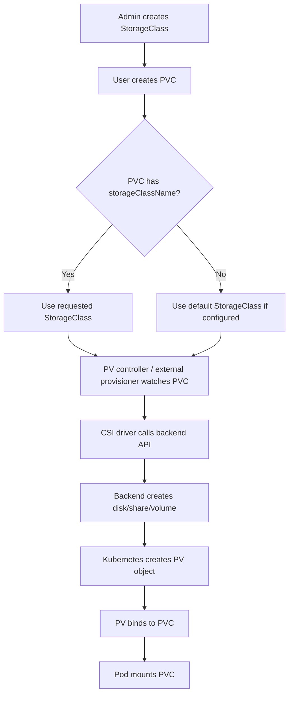

# Dynamic Provisioning in OpenShift Storage and Backup Awareness

**Audience:** Advanced OpenShift Administration / senior Linux, Kubernetes, and OpenShift administrators  
**Level:** 10+ years infrastructure and platform operations experience  
**Scope:** OpenShift 4.x, Kubernetes persistent storage, CSI-based dynamic provisioning, StorageClass design, backup awareness, troubleshooting, and production operations

---

## 1. What Dynamic Provisioning Means

Dynamic provisioning is the OpenShift/Kubernetes mechanism where a user creates a **PersistentVolumeClaim (PVC)** and the cluster automatically creates a matching **PersistentVolume (PV)** by calling a storage backend through a provisioner, usually a **CSI driver**.

In static provisioning, the administrator first creates PV objects manually and users claim them later. In dynamic provisioning, the administrator normally creates one or more **StorageClass** objects, and users request storage through PVCs. OpenShift then provisions the real backend volume on demand.

In simple words:

```text
Static provisioning:
Admin creates storage first -> PV exists -> User creates PVC -> PVC binds to existing PV

Dynamic provisioning:
Admin creates StorageClass -> User creates PVC -> OpenShift creates backend volume + PV automatically
```

The official OpenShift 4.20 documentation describes dynamic provisioning as an approach where the administrator creates a StorageClass instead of manually creating a pool of PVs; OpenShift then triggers the storage backend to create a volume of the requested size and type, creates the PV object, and binds it to the PVC.

Reference: Red Hat OpenShift dynamic provisioning documentation  
https://docs.redhat.com/en/documentation/openshift_container_platform/4.20/html/storage/dynamic-provisioning

---

## 2. Why Dynamic Provisioning Exists

Without dynamic provisioning, every new application request becomes an infrastructure ticket:

1. Developer asks for 20 GiB storage.
2. Storage admin creates LUN, NFS export, Ceph volume, vSphere disk, EBS disk, or similar backend resource.
3. OpenShift admin creates a PV YAML.
4. Developer creates PVC.
5. PV and PVC bind.
6. Pod mounts the PVC.

This model works, but it is slow and error-prone at scale.

Dynamic provisioning removes most of that manual work. The platform team publishes storage offerings as StorageClasses, for example:

```text
fast-block        -> high-performance block storage
standard-block    -> default block storage
shared-file       -> RWX file storage
backup-retain     -> retained storage for critical workloads
encrypted-gold    -> encrypted high-performance storage
```

Application teams request storage using PVCs without needing to understand the backend implementation.

This gives the cluster:

- self-service persistent storage
- better standardization
- fewer manual PV mistakes
- faster application onboarding
- policy-based storage consumption
- easier integration with snapshots, clones, backup, and disaster recovery workflows

---

## 3. Core Objects Involved

Dynamic provisioning depends on several Kubernetes/OpenShift objects.

| Object | Scope | Purpose |
|---|---:|---|
| `StorageClass` | Cluster-scoped | Defines how dynamic storage should be created. |
| `PersistentVolumeClaim` | Namespace-scoped | User request for storage. |
| `PersistentVolume` | Cluster-scoped | Actual cluster storage object bound to a PVC. |
| `Pod` / `Deployment` / `StatefulSet` | Namespace-scoped | Consumes the PVC. |
| CSI Driver | Cluster component | Talks to the storage backend. |
| `VolumeSnapshotClass` | Cluster-scoped | Defines how snapshots are created for a CSI backend. |
| `VolumeSnapshot` | Namespace-scoped | Point-in-time snapshot request for a PVC. |
| `ResourceQuota` | Namespace-scoped | Controls storage consumption by project/namespace. |

The important relationship is:

```text
StorageClass defines policy
PVC requests storage
Provisioner creates backend volume
PV represents provisioned backend volume
Pod consumes PVC
```

---

## 4. Dynamic Provisioning Control Flow

The lifecycle looks like this:



A senior administrator should understand that the PVC is not the actual storage. The PVC is a request. The PV is the cluster representation of the real backend volume. The actual disk/share/block device exists outside Kubernetes, inside the storage system.

---

## 5. StorageClass: The Main Dynamic Provisioning Policy Object

A `StorageClass` describes a class of storage available in the cluster. Kubernetes documentation says a StorageClass gives administrators a way to describe storage offerings, which may map to QoS levels, backup policies, or arbitrary policies chosen by cluster administrators.

Reference: Kubernetes StorageClass documentation  
https://kubernetes.io/docs/concepts/storage/storage-classes/

A typical StorageClass contains:

```yaml
apiVersion: storage.k8s.io/v1
kind: StorageClass
metadata:
  name: fast-block
  annotations:
    storageclass.kubernetes.io/is-default-class: "false"
    kubernetes.io/description: "Fast block storage for latency-sensitive applications"
provisioner: csi.example.com
parameters:
  type: fast
reclaimPolicy: Delete
allowVolumeExpansion: true
volumeBindingMode: WaitForFirstConsumer
```

### Important Fields

#### `metadata.name`

This is the name users reference from PVCs:

```yaml
storageClassName: fast-block
```

Choose meaningful names. Avoid backend-specific names unless the application team must know the backend.

Good examples:

```text
standard-rwo
fast-rwo
gold-rwo
shared-rwx
backup-retain
```

Poor examples:

```text
sc1
class-a
ceph-test-2
managed-premium-copy-old
```

#### `provisioner`

The provisioner is the driver that creates the volume.

Examples:

```text
ebs.csi.aws.com
csi.vsphere.vmware.com
openshift-storage.rbd.csi.ceph.com
openshift-storage.cephfs.csi.ceph.com
manila.csi.openstack.org
```

OpenShift 4.x storage is heavily CSI-oriented. Some older in-tree provisioners still exist in older Kubernetes/OpenShift environments, but modern production designs should prefer CSI drivers where supported.

#### `parameters`

Parameters are provisioner-specific. They may define disk type, filesystem type, encryption, storage pool, replication policy, IOPS profile, availability zone behavior, or backend-specific options.

Examples:

```yaml
parameters:
  type: gp3
  encrypted: "true"
  fsType: ext4
```

or for vSphere:

```yaml
parameters:
  storagepolicyname: "openshift-gold-policy"
```

The same PVC can produce very different backend storage depending on StorageClass parameters.

#### `reclaimPolicy`

Controls what happens to the dynamically provisioned PV and backend storage when the PVC is deleted.

Valid common values:

```text
Delete
Retain
```

- `Delete`: deleting the PVC deletes the PV and usually deletes the backend volume.
- `Retain`: deleting the PVC leaves the PV/backend volume behind for manual recovery or inspection.

For most ephemeral application environments, `Delete` is convenient. For critical databases, regulated workloads, or forensic recovery requirements, `Retain` may be safer.

Production rule:

```text
Use Delete only when you are confident that backup, snapshot, replication, and data ownership processes are mature.
Use Retain when accidental data deletion risk is more important than automation convenience.
```

#### `allowVolumeExpansion`

Controls whether PVCs created from this StorageClass can be expanded.

```yaml
allowVolumeExpansion: true
```

When set to `true`, users can increase the requested size of a PVC, provided the CSI driver and backend support expansion. Red Hat documentation notes that volume expansion requires the StorageClass to have `allowVolumeExpansion: true`.

Reference: Red Hat / OKD expanding persistent volumes documentation  
https://docs.okd.io/latest/storage/expanding-persistent-volumes.html

#### `volumeBindingMode`

Controls when provisioning and binding occur.

```yaml
volumeBindingMode: Immediate
```

or:

```yaml
volumeBindingMode: WaitForFirstConsumer
```

Kubernetes documentation states that `volumeBindingMode` controls when volume binding and dynamic provisioning occur, and if unset, `Immediate` is the default.

Reference: Kubernetes StorageClass volume binding mode documentation  
https://kubernetes.io/docs/concepts/storage/storage-classes/#volume-binding-mode

---

## 6. Immediate vs WaitForFirstConsumer

This field is extremely important in real OpenShift clusters.

### Immediate

With `Immediate`, the volume is provisioned as soon as the PVC is created.

```text
PVC created -> volume provisioned immediately -> PV bound -> Pod scheduled later
```

This works well for storage backends that are not topology-sensitive, such as many shared file systems.

Problem: For zonal block storage, the PV might be created in a zone where the future pod cannot run. This can lead to scheduling failures.

Example failure pattern:

```text
PVC created first
EBS volume created in ap-south-1a
Pod later scheduled wants node in ap-south-1b
Scheduler cannot mount volume across zone
Pod remains Pending
```

### WaitForFirstConsumer

With `WaitForFirstConsumer`, the PVC waits until a pod that uses it is scheduled. Then the scheduler considers node topology, zone, affinity, taints, tolerations, and storage constraints before provisioning the volume.

```text
PVC created -> waits
Pod created -> scheduler selects suitable node/zone
Volume provisioned in correct topology
PV bound
Pod starts
```

For multi-zone clusters and topology-aware CSI drivers, `WaitForFirstConsumer` is generally the safer default.

OpenShift documentation specifically recommends `WaitForFirstConsumer` in relevant cloud storage examples because it allows volume provisioning while considering available worker-node zones.

Reference: Red Hat OpenShift dynamic provisioning documentation  
https://docs.redhat.com/en/documentation/openshift_container_platform/4.20/html/storage/dynamic-provisioning

---

## 7. Default StorageClass Behavior

A default StorageClass is used when a PVC does not specify `storageClassName`.

Example default StorageClass annotation:

```yaml
metadata:
  annotations:
    storageclass.kubernetes.io/is-default-class: "true"
```

Check StorageClasses:

```bash
oc get storageclass
```

Example output:

```text
NAME                 PROVISIONER                         RECLAIMPOLICY   VOLUMEBINDINGMODE      ALLOWVOLUMEEXPANSION
gp3 (default)        ebs.csi.aws.com                     Delete          WaitForFirstConsumer   true
shared-rwx           openshift-storage.cephfs.csi...     Delete          Immediate              true
fast-rwo             openshift-storage.rbd.csi...        Delete          WaitForFirstConsumer   true
```

Set a default StorageClass:

```bash
oc patch storageclass gp3 \
  -p '{"metadata":{"annotations":{"storageclass.kubernetes.io/is-default-class":"true"}}}'
```

Remove default annotation from another StorageClass:

```bash
oc patch storageclass old-default \
  -p '{"metadata":{"annotations":{"storageclass.kubernetes.io/is-default-class":"false"}}}'
```

Red Hat documentation notes that when multiple default StorageClasses exist, a PVC with `storageClassName` unset uses the most recently created default StorageClass, and OpenShift raises a `MultipleDefaultStorageClasses` alert.

Reference: Red Hat OpenShift dynamic provisioning documentation  
https://docs.redhat.com/en/documentation/openshift_container_platform/4.20/html/storage/dynamic-provisioning

### Important Difference: `storageClassName` Nil vs Empty String

This is a common exam and production issue.

PVC with no `storageClassName` field:

```yaml
apiVersion: v1
kind: PersistentVolumeClaim
metadata:
  name: data
spec:
  accessModes:
    - ReadWriteOnce
  resources:
    requests:
      storage: 10Gi
```

Behavior:

```text
Use default StorageClass if one exists.
```

PVC with empty string:

```yaml
apiVersion: v1
kind: PersistentVolumeClaim
metadata:
  name: data-static-only
spec:
  storageClassName: ""
  accessModes:
    - ReadWriteOnce
  resources:
    requests:
      storage: 10Gi
```

Behavior:

```text
Do not use dynamic provisioning. Bind only to a matching static PV with no StorageClass.
```

This distinction is critical when troubleshooting PVCs stuck in `Pending`.

---

## 8. Dynamic Provisioning with a PVC

A basic PVC using a specific StorageClass:

```yaml
apiVersion: v1
kind: PersistentVolumeClaim
metadata:
  name: app-data
  namespace: production
spec:
  accessModes:
    - ReadWriteOnce
  storageClassName: fast-rwo
  resources:
    requests:
      storage: 20Gi
```

Apply it:

```bash
oc apply -f pvc.yaml
```

Check status:

```bash
oc get pvc -n production
oc describe pvc app-data -n production
```

Expected result:

```text
STATUS: Bound
VOLUME: pvc-xxxxxxxx-xxxx-xxxx-xxxx-xxxxxxxxxxxx
STORAGECLASS: fast-rwo
CAPACITY: 20Gi
```

Once the PVC is bound, OpenShift has created a PV object. Check it:

```bash
oc get pv | grep app-data
oc describe pv <pv-name>
```

---

## 9. Using a Dynamically Provisioned PVC in a Deployment

Example Deployment using dynamically provisioned storage:

```yaml
apiVersion: apps/v1
kind: Deployment
metadata:
  name: nginx-storage-demo
  namespace: production
spec:
  replicas: 1
  selector:
    matchLabels:
      app: nginx-storage-demo
  template:
    metadata:
      labels:
        app: nginx-storage-demo
    spec:
      containers:
        - name: nginx
          image: registry.access.redhat.com/ubi9/nginx-120
          ports:
            - containerPort: 8080
          volumeMounts:
            - name: app-data
              mountPath: /usr/share/nginx/html
      volumes:
        - name: app-data
          persistentVolumeClaim:
            claimName: app-data
```

Apply:

```bash
oc apply -f deployment.yaml
```

Validate mount:

```bash
oc get pod -n production
oc describe pod <pod-name> -n production
oc rsh -n production <pod-name>
df -h
mount | grep nginx
```

---

## 10. Dynamic Provisioning in StatefulSets

Stateful workloads usually use `volumeClaimTemplates`. Each replica gets its own dynamically provisioned PVC.

Example:

```yaml
apiVersion: apps/v1
kind: StatefulSet
metadata:
  name: mysql
  namespace: database
spec:
  serviceName: mysql
  replicas: 3
  selector:
    matchLabels:
      app: mysql
  template:
    metadata:
      labels:
        app: mysql
    spec:
      containers:
        - name: mysql
          image: registry.redhat.io/rhel9/mysql-80
          env:
            - name: MYSQL_ROOT_PASSWORD
              valueFrom:
                secretKeyRef:
                  name: mysql-secret
                  key: MYSQL_ROOT_PASSWORD
          volumeMounts:
            - name: mysql-data
              mountPath: /var/lib/mysql/data
  volumeClaimTemplates:
    - metadata:
        name: mysql-data
      spec:
        accessModes:
          - ReadWriteOnce
        storageClassName: fast-rwo
        resources:
          requests:
            storage: 20Gi
```

This creates PVCs like:

```text
mysql-data-mysql-0
mysql-data-mysql-1
mysql-data-mysql-2
```

Each PVC gets its own PV and backend volume.

Important operational point:

```text
Scaling a StatefulSet down does not automatically delete its PVCs.
```

This is by design to protect data. When you scale back up, the pod reuses the same PVC.

---

## 11. Access Modes and Dynamic Provisioning

PVC `accessModes` define how the volume can be mounted.

| Access Mode | Meaning | Typical Backend |
|---|---|---|
| `ReadWriteOnce` / RWO | Mounted read-write by one node | EBS, vSphere disk, Ceph RBD |
| `ReadOnlyMany` / ROX | Mounted read-only by many nodes | NFS, CephFS, object-backed file systems |
| `ReadWriteMany` / RWX | Mounted read-write by many nodes | NFS, CephFS, OpenShift Data Foundation CephFS, Manila |
| `ReadWriteOncePod` / RWOP | Mounted read-write by a single pod | CSI drivers that support it |

The access mode requested by the PVC must be supported by the StorageClass/provisioner/backend. A classic problem is requesting `ReadWriteMany` from a block-only StorageClass.

Example problem:

```yaml
accessModes:
  - ReadWriteMany
storageClassName: gp3
```

If `gp3` maps to AWS EBS block storage, RWX will not work. Use a file-based StorageClass instead, such as EFS, CephFS, NFS provisioner, or Manila, depending on platform design.

---

## 12. Volume Mode: Filesystem vs Block

PVCs can request either filesystem or raw block volume mode.

### Filesystem Mode

Default mode. Kubernetes formats and mounts the volume as a filesystem.

```yaml
spec:
  volumeMode: Filesystem
```

Common for:

```text
MySQL
PostgreSQL
MongoDB
Nginx content
application data directories
```

### Block Mode

Raw block mode exposes the device directly to the container.

```yaml
spec:
  volumeMode: Block
```

Pod example:

```yaml
volumeDevices:
  - name: raw-disk
    devicePath: /dev/xvda
```

Common for:

```text
specialized databases
storage engines
custom filesystems
performance-sensitive workloads
```

Production warning:

```text
Raw block volumes require application-level care. The application must handle formatting, locking, and data safety correctly.
```

---

## 13. Common OpenShift Dynamic Provisioners

The exact available provisioners depend on installation platform and installed storage operators.

### AWS EBS CSI

Provisioner:

```text
ebs.csi.aws.com
```

Typical use:

```text
RWO block storage for databases and single-writer applications
```

Example StorageClass:

```yaml
apiVersion: storage.k8s.io/v1
kind: StorageClass
metadata:
  name: gp3-encrypted
  annotations:
    kubernetes.io/description: "Encrypted AWS EBS gp3 block storage"
provisioner: ebs.csi.aws.com
parameters:
  type: gp3
  encrypted: "true"
reclaimPolicy: Delete
allowVolumeExpansion: true
volumeBindingMode: WaitForFirstConsumer
```

### VMware vSphere CSI

Provisioner:

```text
csi.vsphere.vmware.com
```

Typical use:

```text
RWO VMDK-backed storage for VM-based OpenShift clusters
```

Example:

```yaml
apiVersion: storage.k8s.io/v1
kind: StorageClass
metadata:
  name: vsphere-gold
provisioner: csi.vsphere.vmware.com
parameters:
  storagepolicyname: "openshift-gold-policy"
reclaimPolicy: Delete
allowVolumeExpansion: true
volumeBindingMode: WaitForFirstConsumer
```

### OpenShift Data Foundation / Ceph RBD

Provisioner:

```text
openshift-storage.rbd.csi.ceph.com
```

Typical use:

```text
RWO block storage for databases and application data
```

Example:

```yaml
apiVersion: storage.k8s.io/v1
kind: StorageClass
metadata:
  name: odf-rbd
provisioner: openshift-storage.rbd.csi.ceph.com
parameters:
  clusterID: openshift-storage
  pool: ocs-storagecluster-cephblockpool
  imageFormat: "2"
  imageFeatures: layering
  csi.storage.k8s.io/fstype: ext4
reclaimPolicy: Delete
allowVolumeExpansion: true
volumeBindingMode: WaitForFirstConsumer
```

In many ODF installations, the operator creates StorageClasses automatically. Do not blindly create custom ODF StorageClasses unless you understand the ODF StorageCluster, Ceph pool, secret references, and driver configuration.

### OpenShift Data Foundation / CephFS

Provisioner:

```text
openshift-storage.cephfs.csi.ceph.com
```

Typical use:

```text
RWX shared file storage
```

Example use cases:

```text
shared uploads
CMS content
CI workspace sharing
multi-replica applications needing common file storage
```

### OpenStack Manila CSI

Provisioner:

```text
manila.csi.openstack.org
```

Typical use:

```text
shared file storage on OpenStack
```

Red Hat documentation notes that after installation, the Manila CSI Driver Operator and ManilaDriver can automatically create required StorageClasses for available Manila share types.

Reference: Red Hat OpenShift dynamic provisioning documentation  
https://docs.redhat.com/en/documentation/openshift_container_platform/4.20/html/storage/dynamic-provisioning

---

## 14. StorageClass Design for Production

A 10-year experienced admin should not create one generic StorageClass and expose it to everyone without thought. StorageClass design is a platform architecture decision.

### Recommended StorageClass Categories

```text
standard-rwo
fast-rwo
shared-rwx
backup-retain
encrypted-rwo
dev-delete
db-retain
```

### Example Design Matrix

| StorageClass | Backend | Access | Reclaim | Binding | Expansion | Use Case |
|---|---|---:|---|---|---:|---|
| `standard-rwo` | CSI block | RWO | Delete | WaitForFirstConsumer | Yes | General apps |
| `fast-rwo` | SSD / high IOPS block | RWO | Delete | WaitForFirstConsumer | Yes | Databases |
| `db-retain` | SSD / replicated block | RWO | Retain | WaitForFirstConsumer | Yes | Critical DB |
| `shared-rwx` | CephFS/NFS/Manila | RWX | Delete | Immediate | Yes | Shared content |
| `backup-retain` | Replicated backend | RWO/RWX | Retain | Depends | Yes | Backup-sensitive apps |
| `dev-delete` | Lower-cost backend | RWO | Delete | WaitForFirstConsumer | Yes | Non-prod |

### Naming Guidance

Use names that describe service behavior, not vendor details.

Better:

```text
fast-rwo
shared-rwx
standard-rwo-retain
```

Less portable:

```text
thin-csi-datastore3
ceph-rbd-pool-a
aws-gp3-zone1
```

StorageClass is part of the platform contract. Application manifests often reference it directly, so renaming it later can become painful.

---

## 15. StorageClass and Backup Awareness

Dynamic provisioning is not backup.

A PVC bound to a dynamically provisioned PV only means storage exists. It does not mean:

```text
data is backed up
data is replicated off-cluster
data is application-consistent
data is recoverable after namespace deletion
data survives backend failure
```

### Backup-Aware StorageClass Design

A mature platform may define storage classes based partly on backup behavior:

| StorageClass | Backup Policy |
|---|---|
| `standard-rwo` | daily backup, 7-day retention |
| `gold-rwo` | hourly snapshot, daily backup, 30-day retention |
| `db-retain` | application-aware backup, retained PV, strict restore testing |
| `dev-delete` | no guaranteed backup |
| `shared-rwx` | file-level backup or snapshot depending on backend |

Kubernetes itself does not enforce these backup policies just because the StorageClass name says `gold`. You must integrate with backup tools, snapshot controllers, Velero/OADP, ODF/ACM policies, storage array backup, or custom automation.

### What Admins Must Ask

For every dynamically provisioned StorageClass, ask:

1. Is the backend replicated?
2. Is encryption enabled?
3. Are snapshots supported?
4. Are snapshots crash-consistent or application-consistent?
5. How are snapshots copied off-cluster?
6. What is the RPO?
7. What is the RTO?
8. What happens if the namespace is deleted?
9. What happens if the PVC is deleted?
10. What happens if the StorageClass uses `Delete` reclaim policy?
11. Who owns restore testing?
12. Is this suitable for databases?

---

## 16. Dynamic Provisioning and VolumeSnapshots

VolumeSnapshot support is CSI-dependent. OpenShift supports CSI volume snapshots, but the CSI driver must implement snapshot capability.

Red Hat documentation states that OpenShift supports CSI volume snapshots by default, but a specific CSI driver is required. It also notes that snapshots can be used to create new PVCs, take snapshots of existing PVCs, restore snapshots as different PVCs, and delete snapshots.

Reference: Red Hat OpenShift CSI volume snapshots documentation  
https://docs.redhat.com/en/documentation/openshift_container_platform/4.10/html/storage/using-container-storage-interface-csi#csi-volume-snapshots_using-container-storage-interface-csi

### VolumeSnapshotClass Example

```yaml
apiVersion: snapshot.storage.k8s.io/v1
kind: VolumeSnapshotClass
metadata:
  name: csi-rbd-snapclass
  annotations:
    snapshot.storage.kubernetes.io/is-default-class: "true"
driver: openshift-storage.rbd.csi.ceph.com
deletionPolicy: Delete
```

### Create a Snapshot from a PVC

```yaml
apiVersion: snapshot.storage.k8s.io/v1
kind: VolumeSnapshot
metadata:
  name: mysql-data-snapshot
  namespace: database
spec:
  volumeSnapshotClassName: csi-rbd-snapclass
  source:
    persistentVolumeClaimName: mysql-data-mysql-0
```

Check:

```bash
oc get volumesnapshot -n database
oc describe volumesnapshot mysql-data-snapshot -n database
oc get volumesnapshotcontent
```

### Restore Snapshot into a New PVC

```yaml
apiVersion: v1
kind: PersistentVolumeClaim
metadata:
  name: mysql-restore-pvc
  namespace: database
spec:
  storageClassName: odf-rbd
  dataSource:
    name: mysql-data-snapshot
    kind: VolumeSnapshot
    apiGroup: snapshot.storage.k8s.io
  accessModes:
    - ReadWriteOnce
  resources:
    requests:
      storage: 20Gi
```

Important:

```text
Snapshot restore normally creates a new PVC, not an in-place rollback of the old PVC.
```

### Application Consistency Warning

A storage snapshot is usually crash-consistent unless the application is quiesced or backup software coordinates with the application.

For databases, a reliable process may require:

```text
flush tables / checkpoint
freeze filesystem
pause writes
create snapshot
unfreeze filesystem
verify snapshot restore
```

Do not advertise snapshots as full database backup unless restore has been tested.

---

## 17. Dynamic Provisioning and PVC Expansion

PVC expansion is a common production task.

### Check Whether the StorageClass Allows Expansion

```bash
oc get storageclass fast-rwo -o yaml | grep allowVolumeExpansion
```

Expected:

```yaml
allowVolumeExpansion: true
```

### Expand a PVC

Current PVC:

```bash
oc get pvc app-data -n production
```

Example output:

```text
NAME       STATUS   VOLUME                                     CAPACITY   ACCESS MODES   STORAGECLASS
app-data   Bound    pvc-11111111-2222-3333-4444-555555555555   20Gi       RWO            fast-rwo
```

Patch to 40 GiB:

```bash
oc patch pvc app-data -n production \
  -p '{"spec":{"resources":{"requests":{"storage":"40Gi"}}}}'
```

Watch:

```bash
oc get pvc app-data -n production -w
oc describe pvc app-data -n production
```

Inside pod:

```bash
oc rsh -n production <pod-name>
df -h
```

### Important Rules

```text
PVC size can be increased, not decreased.
Backend and CSI driver must support expansion.
Filesystem resize may happen online or require pod restart depending on driver/filesystem.
Only PVCs from StorageClasses with allowVolumeExpansion=true can expand.
```

---

## 18. Reclaim Policy and Data Protection

Dynamic provisioning often uses `reclaimPolicy: Delete` by default. This can surprise teams.

### Delete Reclaim Policy

```text
User deletes PVC
PV is deleted
Backend volume is deleted
Data is gone unless backup/snapshot exists
```

Good for:

```text
temporary workloads
dev/test namespaces
CI scratch space
cache data
stateless rebuildable data
```

Risky for:

```text
databases
message queues
stateful production apps
legal/audit data
customer-uploaded content
```

### Retain Reclaim Policy

```text
User deletes PVC
PV moves to Released
Backend storage remains
Admin must manually recover, clean, or delete
```

Good for:

```text
critical workloads
manual recovery
forensic investigation
regulated data
accidental PVC deletion protection
```

Operational cost:

```text
Retained volumes can leak storage capacity if nobody cleans them.
```

### Recovery from Retained PV

When a PVC is deleted and PV remains `Released`, recovery may require:

```bash
oc get pv
oc describe pv <pv-name>
```

Then carefully remove the old claimRef if appropriate:

```bash
oc patch pv <pv-name> --type=json \
  -p='[{"op":"remove","path":"/spec/claimRef"}]'
```

Then create a new PVC that matches the PV.

Warning:

```text
Do not randomly remove claimRef in production. Confirm data ownership, namespace, application, and backend volume identity first.
```

---

## 19. Storage ResourceQuota with Dynamic Provisioning

Dynamic provisioning without quotas can lead to uncontrolled backend storage consumption.

Example namespace quota:

```yaml
apiVersion: v1
kind: ResourceQuota
metadata:
  name: storage-quota
  namespace: production
spec:
  hard:
    requests.storage: 500Gi
    persistentvolumeclaims: "20"
```

StorageClass-specific quota:

```yaml
apiVersion: v1
kind: ResourceQuota
metadata:
  name: fast-storage-quota
  namespace: production
spec:
  hard:
    fast-rwo.storageclass.storage.k8s.io/requests.storage: 200Gi
    fast-rwo.storageclass.storage.k8s.io/persistentvolumeclaims: "10"
```

This prevents one namespace from consuming unlimited expensive storage.

Check quota usage:

```bash
oc describe quota -n production
```

---

## 20. LimitRange and PVC Defaults

`LimitRange` is more commonly used for CPU and memory, but in some environments it can also define storage request limits for PVCs.

Example:

```yaml
apiVersion: v1
kind: LimitRange
metadata:
  name: pvc-limits
  namespace: production
spec:
  limits:
    - type: PersistentVolumeClaim
      min:
        storage: 1Gi
      max:
        storage: 100Gi
```

This prevents tiny accidental PVCs and oversized PVC requests.

---

## 21. Security and RBAC Considerations

`StorageClass` is cluster-scoped. Normal project users usually create PVCs, not StorageClasses.

Check who can create StorageClasses:

```bash
oc auth can-i create storageclasses
oc auth can-i create storageclasses --as user1
```

Check who can create PVCs in a namespace:

```bash
oc auth can-i create pvc -n production --as developer1
```

Recommended model:

```text
Cluster/storage admins manage StorageClasses.
Application teams create PVCs within quota.
Backup admins manage VolumeSnapshot policies and backup schedules.
Security/compliance teams define retention and encryption requirements.
```

Do not grant application teams broad rights to edit StorageClasses unless there is a strong platform reason.

---

## 22. Dynamic Provisioning with OpenShift Operators

Many Operators create PVCs automatically from custom resources.

Examples:

```text
PostgreSQL Operator
MongoDB Operator
Kafka Operator
OpenShift Logging / Loki
OpenShift Data Foundation
Quay Operator
GitLab Operator
```

A CR might include storage configuration like:

```yaml
storage:
  size: 100Gi
  storageClassName: fast-rwo
```

Behind the scenes, the Operator creates PVCs. The dynamic provisioning flow remains the same.

Admin concern:

```text
Operators may create many PVCs, especially for clusters like Kafka, Elasticsearch, Loki, or database replicas.
Always check total requested storage before applying production CRs.
```

---

## 23. Dynamic Provisioning and Scheduling

Storage and scheduling are tightly linked.

A pod using a PVC may remain `Pending` because:

```text
PVC is Pending
PV is zone-restricted
node affinity conflicts with PV topology
pod nodeSelector conflicts with storage topology
taints/tolerations block pod from storage-compatible nodes
WaitForFirstConsumer cannot find suitable node
```

Check pod events:

```bash
oc describe pod <pod-name> -n <namespace>
```

Check PVC events:

```bash
oc describe pvc <pvc-name> -n <namespace>
```

Check PV topology:

```bash
oc get pv <pv-name> -o yaml
```

Look for:

```yaml
nodeAffinity:
  required:
    nodeSelectorTerms:
```

Check node labels:

```bash
oc get nodes --show-labels
oc get nodes -L topology.kubernetes.io/zone
```

---

## 24. Troubleshooting PVC Pending

PVC stuck in `Pending` is the most common dynamic provisioning issue.

### Step 1: Check PVC

```bash
oc get pvc -n <namespace>
oc describe pvc <pvc-name> -n <namespace>
```

Look at events.

Common events:

```text
waiting for first consumer to be created before binding
storageclass.storage.k8s.io "xyz" not found
failed to provision volume with StorageClass
no persistent volumes available for this claim and no storage class is set
exceeded quota
access mode not supported
```

### Step 2: Check StorageClass

```bash
oc get sc
oc describe sc <storageclass-name>
oc get sc <storageclass-name> -o yaml
```

Validate:

```text
provisioner exists
parameters are correct
reclaimPolicy is correct
volumeBindingMode is expected
allowVolumeExpansion is set if expansion needed
default annotation is correct
```

### Step 3: Check Default StorageClass

```bash
oc get sc | grep default
```

If the PVC does not specify `storageClassName` and no default exists, PVC may remain pending.

### Step 4: Check Quota

```bash
oc describe quota -n <namespace>
```

Look for exceeded storage quota.

### Step 5: Check CSI Driver Pods

Most OpenShift CSI components run in:

```text
openshift-cluster-csi-drivers
```

Commands:

```bash
oc get pods -n openshift-cluster-csi-drivers
oc get co storage
oc get csv -A | grep -i csi
```

Logs:

```bash
oc logs -n openshift-cluster-csi-drivers <csi-controller-pod> -c csi-provisioner
oc logs -n openshift-cluster-csi-drivers <csi-controller-pod> -c csi-attacher
oc logs -n openshift-cluster-csi-drivers <csi-controller-pod> -c csi-resizer
```

Container names vary by CSI driver, so inspect the pod first:

```bash
oc get pod <pod> -n openshift-cluster-csi-drivers -o jsonpath='{.spec.containers[*].name}'
```

### Step 6: Check Backend

Depending on backend:

```text
AWS: EBS volume, IAM permissions, subnet/zone tags, KMS key
vSphere: datastore capacity, storage policy, CNS health
ODF/Ceph: Ceph health, pool capacity, CSI secrets, OSD status
OpenStack: Cinder/Manila quota, credentials, availability zones
NFS external provisioner: export path, provisioner pod, RBAC, permissions
```

### Step 7: Check Events Cluster-Wide

```bash
oc get events -A --sort-by=.lastTimestamp | tail -50
```

---

## 25. Troubleshooting Pod Stuck Pending Because of Storage

A pod can be `Pending` even when the PVC exists.

Check:

```bash
oc describe pod <pod-name> -n <namespace>
```

Common messages:

```text
pod has unbound immediate PersistentVolumeClaims
0/6 nodes are available: node(s) had volume node affinity conflict
AttachVolume.Attach failed
MountVolume.MountDevice failed
Unable to attach or mount volumes
```

### Cause: Immediate Binding Created Volume in Wrong Zone

Fix options:

```text
Use WaitForFirstConsumer StorageClass.
Recreate PVC if safe.
Adjust pod node affinity.
Use topology-aware StorageClass.
```

### Cause: Access Mode Conflict

Example: two pods on different nodes try to use one RWO PVC.

Fix:

```text
Use only one replica for RWO PVC.
Use StatefulSet with separate PVC per replica.
Use RWX StorageClass if shared writes are required.
```

### Cause: Backend Attach Limit

Cloud providers and hypervisors may limit the number of volumes attached to a node.

Fix:

```text
Spread pods across nodes.
Increase nodes.
Use different instance type.
Use RWX/file storage where appropriate.
Reduce per-pod volume count.
```

---

## 26. Troubleshooting Volume Mount Failures

A PVC can be `Bound`, but pod mount can still fail.

Check pod events:

```bash
oc describe pod <pod-name> -n <namespace>
```

Check kubelet logs on node:

```bash
oc debug node/<node-name>
chroot /host
journalctl -u kubelet -f
```

Check CSI node plugin:

```bash
oc get pods -A -o wide | grep csi
oc logs -n openshift-cluster-csi-drivers <csi-node-pod> -c <driver-container>
```

Common causes:

```text
filesystem corruption
wrong fsType
backend path unavailable
multipath/device issue
SELinux context issue
node plugin not running
permissions problem on NFS/file storage
secret/credential issue
volume already attached elsewhere
```

---

## 27. Dynamic Provisioning and SELinux/SCC

OpenShift adds security layers that may affect storage usage.

Typical storage-related permission symptoms:

```text
Permission denied inside mounted volume
Application cannot write to mounted directory
Container runs as random UID and storage directory is owned by root
```

Fix approaches depend on storage backend and application:

```text
Use fsGroup/securityContext where allowed.
Use init container to set permissions if policy allows.
Use storage backend supporting proper POSIX permissions.
Avoid running privileged unless absolutely required.
Avoid anyuid SCC as a generic storage fix.
```

Example pod security context:

```yaml
spec:
  securityContext:
    fsGroup: 1001
```

OpenShift SCCs may restrict certain securityContext fields. Always validate against project security standards.

---

## 28. Dynamic Provisioning and Databases

Databases are storage-sensitive. Do not treat all dynamic volumes equally.

For databases, evaluate:

```text
latency
IOPS
throughput
fsync behavior
replication
snapshot consistency
backup integration
reclaim policy
expansion support
zone behavior
node drain behavior
restore testing
```

Recommended database PVC characteristics:

```yaml
accessModes:
  - ReadWriteOnce
storageClassName: fast-rwo
resources:
  requests:
    storage: 100Gi
```

Prefer:

```text
RWO block storage for single database instance
StatefulSet volumeClaimTemplates for replicated databases
Retain reclaim policy for critical workloads
application-aware backups
tested restore process
```

Avoid:

```text
RWX shared storage for databases unless vendor explicitly supports it
Delete reclaim policy for critical data without backups
using storage snapshots as the only backup method
running multiple database replicas on same RWO PVC
```

---

## 29. Dynamic Provisioning and Node Drain/Reboot

During node maintenance:

```bash
oc adm cordon <node>
oc adm drain <node> --ignore-daemonsets --delete-emptydir-data
```

Storage considerations:

```text
RWO volumes may need detach from old node and attach to new node.
Detach/attach can take time depending on backend.
Some CSI drivers enforce single-node attachment strictly.
Pods may stay ContainerCreating while volume attaches.
StatefulSet pods may reschedule one by one depending on PDBs.
```

Check:

```bash
oc get pod -A -o wide | grep <node>
oc describe pod <pod> -n <ns>
oc get volumeattachment
```

`VolumeAttachment` objects are useful for CSI attach troubleshooting:

```bash
oc get volumeattachment
oc describe volumeattachment <name>
```

---

## 30. Dynamic Provisioning and Disaster Recovery

Dynamic provisioning simplifies volume creation, but DR needs additional design.

Questions for DR readiness:

```text
Can the dynamically provisioned backend volume be replicated to another site?
Are PV/PVC manifests backed up?
Are snapshots copied off-cluster?
Can PVCs be restored in a different namespace or cluster?
Does the StorageClass name exist in the target cluster?
Does the target cluster use the same CSI driver?
Are application secrets/configmaps backed up with PVC metadata?
```

A common restore issue is missing StorageClass names. If a backup restores a PVC that references `fast-rwo`, but the target cluster has only `standard`, restore fails or requires mapping.

Recommended DR practice:

```text
Standardize StorageClass names across clusters.
Document StorageClass-to-backend mapping.
Test namespace restore regularly.
Use backup tools that understand PV/PVC/VolumeSnapshot relationships.
Avoid relying only on etcd backup for application data.
```

---

## 31. Dynamic Provisioning vs Etcd Backup

This is a critical OpenShift backup concept.

OpenShift etcd backup protects cluster state, such as:

```text
Kubernetes API objects
PVC definitions
PV definitions
StorageClass objects
namespace metadata
secrets/configmaps
```

But etcd backup does not copy the actual data inside backend storage volumes.

Example:

```text
etcd backup contains PVC object for mysql-data
actual MySQL files live on EBS/Ceph/vSphere/NFS backend
```

If the backend volume is lost, etcd restore alone does not recover database contents.

Therefore:

```text
Cluster backup != application data backup
PVC object backup != PV backend data backup
Snapshot metadata != off-cluster backup
```

---

## 32. Dynamic Provisioning and OADP / Velero Awareness

OpenShift APIs for Data Protection (OADP), based on Velero concepts, can protect Kubernetes resources and integrate with snapshots or data movers depending on configuration.

Backup planning should define:

```text
Which namespaces are backed up?
Are PVC snapshots included?
Are snapshots copied outside the cluster/storage system?
Are restores tested?
Are StorageClass mappings required during restore?
Are application quiesce hooks needed?
```

For dynamically provisioned PVCs, backup tools must capture:

```text
PVC object
PV metadata
VolumeSnapshot or backend snapshot
application resources
secrets/configmaps
routes/services
operator CRs
```

For stateful Operators, backing up only the PVC may not be enough. You may need the Operator CR, secrets, service accounts, and application-specific backup procedures.

---

## 33. Dynamic Provisioning Failure Scenarios and Fixes

### Scenario 1: PVC Pending, No Default StorageClass

Symptom:

```text
no persistent volumes available for this claim and no storage class is set
```

Check:

```bash
oc get sc
oc describe pvc <pvc> -n <ns>
```

Fix:

```text
Add storageClassName to PVC, or configure a default StorageClass.
```

Example:

```yaml
storageClassName: standard-rwo
```

### Scenario 2: Wrong StorageClass Name

Symptom:

```text
storageclass.storage.k8s.io "fast" not found
```

Fix:

```bash
oc get sc
```

Correct PVC:

```yaml
storageClassName: fast-rwo
```

### Scenario 3: Quota Exceeded

Symptom:

```text
exceeded quota: storage-quota, requested: requests.storage=100Gi
```

Fix:

```text
Reduce PVC size, increase quota, or use appropriate namespace.
```

Check:

```bash
oc describe quota -n <ns>
```

### Scenario 4: Unsupported Access Mode

Symptom:

```text
failed to provision volume with StorageClass ... access mode not supported
```

Fix:

```text
Use RWO for block storage.
Use RWX-capable StorageClass for shared mounts.
```

### Scenario 5: WaitForFirstConsumer PVC Looks Pending

Symptom:

```text
waiting for first consumer to be created before binding
```

This is not always an error. It means the PVC will provision when a pod uses it.

Fix:

```text
Create the pod/deployment/statefulset that references the PVC.
```

### Scenario 6: Backend Capacity Exhausted

Symptom:

```text
failed to provision volume: insufficient storage
```

Fix:

```text
Expand backend pool, free storage, use another StorageClass, or reduce request.
```

### Scenario 7: CSI Driver Not Healthy

Symptom:

```text
external provisioner is provisioning volume but fails repeatedly
```

Check:

```bash
oc get pods -n openshift-cluster-csi-drivers
oc logs -n openshift-cluster-csi-drivers <pod> -c csi-provisioner
oc get co storage
```

Fix depends on backend:

```text
credentials
permissions
operator health
node plugin daemonset
network connectivity
backend API
quota
certificate/trust
```

### Scenario 8: PVC Bound but Pod Cannot Mount

Symptom:

```text
MountVolume.MountDevice failed
```

Check:

```bash
oc describe pod <pod> -n <ns>
oc get volumeattachment
oc debug node/<node>
```

Fix:

```text
Resolve node plugin, backend attach, filesystem, permissions, or access mode issue.
```

---

## 34. Useful Admin Commands

### StorageClass Commands

```bash
oc get sc
oc describe sc <storageclass>
oc get sc <storageclass> -o yaml
oc patch sc <storageclass> -p '{"metadata":{"annotations":{"storageclass.kubernetes.io/is-default-class":"true"}}}'
```

### PVC Commands

```bash
oc get pvc -A
oc get pvc -n <namespace>
oc describe pvc <pvc> -n <namespace>
oc get pvc <pvc> -n <namespace> -o yaml
```

### PV Commands

```bash
oc get pv
oc describe pv <pv>
oc get pv <pv> -o yaml
```

### Pod Mount Checks

```bash
oc describe pod <pod> -n <namespace>
oc rsh -n <namespace> <pod>
df -h
mount
```

### CSI Checks

```bash
oc get pods -n openshift-cluster-csi-drivers
oc get co storage
oc get volumeattachment
oc get csidriver
oc get csinode
```

### Events

```bash
oc get events -A --sort-by=.lastTimestamp | tail -100
```

### Node-Level Debug

```bash
oc debug node/<node-name>
chroot /host
journalctl -u kubelet -f
```

---

## 35. Exam-Style Dynamic Provisioning Task

### Requirement

Create a PVC named `web-content` in project `page` using dynamic provisioning. It must request 1 GiB from StorageClass `standard-rwo`, and an nginx deployment must mount it at `/usr/share/nginx/html`.

### Solution

```bash
oc new-project page
```

Create PVC:

```yaml
apiVersion: v1
kind: PersistentVolumeClaim
metadata:
  name: web-content
  namespace: page
spec:
  accessModes:
    - ReadWriteOnce
  storageClassName: standard-rwo
  resources:
    requests:
      storage: 1Gi
```

Apply:

```bash
oc apply -f pvc.yaml
```

Create deployment:

```yaml
apiVersion: apps/v1
kind: Deployment
metadata:
  name: web
  namespace: page
spec:
  replicas: 1
  selector:
    matchLabels:
      app: web
  template:
    metadata:
      labels:
        app: web
    spec:
      containers:
        - name: nginx
          image: registry.ocp4.example.com:8443/redhattraining/hello-world-nginx:v1.0
          volumeMounts:
            - name: web-content
              mountPath: /usr/share/nginx/html
      volumes:
        - name: web-content
          persistentVolumeClaim:
            claimName: web-content
```

Apply:

```bash
oc apply -f deployment.yaml
```

Verify:

```bash
oc get pvc -n page
oc get pv
oc get pod -n page
oc describe pod -n page -l app=web
```

If PVC remains pending and StorageClass uses `WaitForFirstConsumer`, create the pod/deployment first and then re-check.

---

## 36. Real Production Checklist

Before exposing a dynamic StorageClass to users, validate:

```text
[ ] CSI driver/operator is healthy.
[ ] Backend credentials are correct.
[ ] Backend quota and capacity are monitored.
[ ] StorageClass name follows platform naming standards.
[ ] Reclaim policy is intentional.
[ ] Binding mode is appropriate for topology.
[ ] Expansion is enabled if supported and required.
[ ] Access modes are documented.
[ ] Snapshot support is documented.
[ ] Backup policy is documented.
[ ] Restore procedure is tested.
[ ] ResourceQuota exists in user namespaces.
[ ] Alerting exists for PVC Pending, backend capacity, and CSI errors.
[ ] DR behavior is documented.
[ ] Multiple default StorageClasses are avoided.
```

---

## 37. Interview-Level Explanation

A strong senior-level explanation:

> Dynamic provisioning in OpenShift is the automated creation of persistent storage based on a PVC request and a StorageClass policy. The StorageClass defines the provisioner, backend parameters, reclaim behavior, expansion support, and binding mode. When a user creates a PVC, the PV controller and CSI external provisioner coordinate with the backend storage system to create the real volume, then create and bind a PV to the PVC. The pod consumes the PVC, not the backend directly. In production, the key design decisions are StorageClass naming, reclaim policy, topology-aware binding with WaitForFirstConsumer, access mode support, quota control, CSI driver health, expansion, snapshot capability, and backup/restore integration. Dynamic provisioning solves storage self-service, but it does not automatically solve backup, application consistency, DR, or data lifecycle management.

---

## 38. Common Mistakes

```text
Mistake 1: Assuming PVC means backup exists.
Mistake 2: Using Delete reclaim policy for critical databases without backup.
Mistake 3: Requesting RWX from block-only StorageClass.
Mistake 4: Forgetting StorageClass is cluster-scoped.
Mistake 5: Creating multiple default StorageClasses.
Mistake 6: Using Immediate binding in multi-zone block storage environments.
Mistake 7: Not setting ResourceQuota for storage.
Mistake 8: Not checking CSI controller logs when PVC provisioning fails.
Mistake 9: Treating snapshots as application-consistent backups without testing.
Mistake 10: Forgetting StatefulSet PVCs remain after scale-down.
Mistake 11: Assuming etcd backup includes application data inside PVs.
Mistake 12: Not standardizing StorageClass names across DR clusters.
```

---

## 39. Dynamic Provisioning Quick Troubleshooting Tree

```text
PVC Pending?
|
|-- oc describe pvc
|   |
|   |-- no storage class set?
|   |      -> add storageClassName or configure default SC
|   |
|   |-- storageclass not found?
|   |      -> fix name
|   |
|   |-- waiting for first consumer?
|   |      -> create pod that uses PVC; check scheduler
|   |
|   |-- quota exceeded?
|   |      -> adjust quota or request
|   |
|   |-- provisioner failed?
|          -> check CSI logs and backend
|
|-- PVC Bound but Pod Pending?
|   |
|   |-- unbound immediate PVC?
|   |      -> check binding mode and pod consumer
|   |
|   |-- volume node affinity conflict?
|   |      -> check zones/topology/node affinity
|   |
|   |-- RWO multi-attach issue?
|          -> reduce replicas or use RWX/separate PVCs
|
|-- PVC Bound but Mount Fails?
    |
    |-- check pod events
    |-- check VolumeAttachment
    |-- check kubelet logs
    |-- check CSI node plugin
    |-- check backend/device/filesystem/permissions
```

---

## 40. Practical Lab: End-to-End Dynamic Provisioning

### Step 1: Check StorageClasses

```bash
oc get sc
```

### Step 2: Create Namespace

```bash
oc new-project dyn-provision-lab
```

### Step 3: Create PVC

```bash
cat <<'EOF_PVC' | oc apply -f -
apiVersion: v1
kind: PersistentVolumeClaim
metadata:
  name: lab-data
  namespace: dyn-provision-lab
spec:
  accessModes:
    - ReadWriteOnce
  storageClassName: standard-rwo
  resources:
    requests:
      storage: 2Gi
EOF_PVC
```

### Step 4: Watch PVC

```bash
oc get pvc -n dyn-provision-lab -w
```

If it waits for first consumer, continue.

### Step 5: Create Pod

```bash
cat <<'EOF_POD' | oc apply -f -
apiVersion: v1
kind: Pod
metadata:
  name: storage-test
  namespace: dyn-provision-lab
spec:
  containers:
    - name: app
      image: registry.access.redhat.com/ubi9/ubi
      command: ["/bin/sh", "-c"]
      args:
        - while true; do date >> /data/test.log; sleep 30; done
      volumeMounts:
        - name: data
          mountPath: /data
  volumes:
    - name: data
      persistentVolumeClaim:
        claimName: lab-data
EOF_POD
```

### Step 6: Validate

```bash
oc get pod -n dyn-provision-lab
oc get pvc -n dyn-provision-lab
oc get pv
oc rsh -n dyn-provision-lab storage-test
cat /data/test.log
```

### Step 7: Delete Pod and Recreate

```bash
oc delete pod storage-test -n dyn-provision-lab
oc apply -f pod.yaml
```

Data should persist because it is stored in the PVC-backed volume, not inside the container filesystem.

---

## 41. Senior Admin Best Practices

1. Treat StorageClass as a platform contract.
2. Prefer CSI drivers over legacy in-tree drivers where supported.
3. Use `WaitForFirstConsumer` for topology-sensitive block storage.
4. Use `Immediate` only where appropriate, such as topology-independent file storage.
5. Avoid multiple default StorageClasses.
6. Use `Retain` for critical workloads when accidental PVC deletion risk is high.
7. Use quotas to prevent uncontrolled storage growth.
8. Document access modes for every StorageClass.
9. Document backup and snapshot behavior for every StorageClass.
10. Test restore, not just backup creation.
11. Monitor CSI controller and node plugin health.
12. Monitor backend capacity outside OpenShift.
13. Standardize StorageClass names across clusters.
14. Avoid giving application teams permission to create StorageClasses.
15. Validate StatefulSet PVC lifecycle before production rollout.
16. Make storage expansion policy clear.
17. Document manual recovery steps for retained PVs.
18. Use alerts for PVC Pending and volume provisioning failures.
19. Keep storage backend credentials and certificates under proper secret management.
20. Review reclaim policy before deleting PVCs in production.

---

## 42. Key Takeaways

Dynamic provisioning is one of the most important storage features in OpenShift because it turns storage allocation into a self-service, policy-driven workflow.

The administrator defines StorageClasses. Users create PVCs. OpenShift and the CSI driver create real backend volumes automatically. This improves speed and consistency, but it also introduces responsibility: StorageClass design, reclaim policy, quota, expansion, topology, CSI health, snapshots, backup, restore, and DR must be planned carefully.

For advanced OpenShift administration, the most important mindset is:

```text
Dynamic provisioning automates volume creation.
It does not automatically guarantee data protection.
```

A strong OpenShift administrator knows both sides: how to make storage easy for users, and how to keep the data safe when something goes wrong.

---

## 43. References

1. Red Hat OpenShift Container Platform 4.20 - Dynamic provisioning  
   https://docs.redhat.com/en/documentation/openshift_container_platform/4.20/html/storage/dynamic-provisioning

2. Kubernetes Documentation - Storage Classes  
   https://kubernetes.io/docs/concepts/storage/storage-classes/

3. Kubernetes Documentation - Persistent Volumes  
   https://kubernetes.io/docs/concepts/storage/persistent-volumes/

4. Red Hat OpenShift - CSI Volume Snapshots  
   https://docs.redhat.com/en/documentation/openshift_container_platform/4.10/html/storage/using-container-storage-interface-csi#csi-volume-snapshots_using-container-storage-interface-csi

5. OKD / OpenShift - Expanding Persistent Volumes  
   https://docs.okd.io/latest/storage/expanding-persistent-volumes.html
