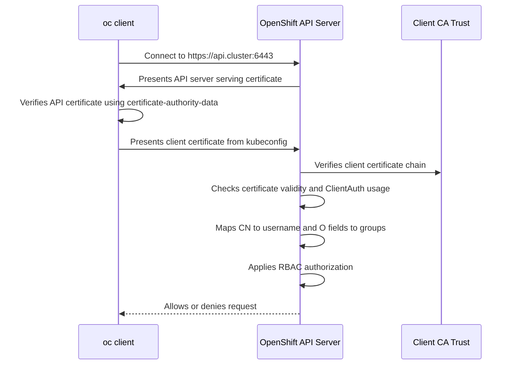

# Kubeconfig Certificate Authentication in OpenShift

**Topic:** Security and Certificates  
**Audience:** Advanced OpenShift Administration / senior Linux-Kubernetes-OpenShift administrators  
**Experience level:** Practical explanation for someone operating production clusters with 10+ years of infrastructure experience  
**Focus:** How kubeconfig-based X.509 client certificate authentication works, how to inspect it, how to generate and use it safely, and how to troubleshoot it in OpenShift.

---

## 1. Executive Summary

A `kubeconfig` file is the client-side connection profile used by `oc`, `kubectl`, client libraries, CI/CD jobs, scripts, and some Operators to communicate with the Kubernetes/OpenShift API server.

A kubeconfig can authenticate a client in different ways:

- OAuth bearer token
- ServiceAccount token
- Exec plugin, for example cloud or OIDC login helpers
- Basic auth in older or special cases
- **X.509 client certificate and private key**

This guide focuses on **certificate-based kubeconfig authentication**, where the kubeconfig contains:

```yaml
users:
- name: system:admin
  user:
    client-certificate-data: <base64-pem-client-certificate>
    client-key-data: <base64-pem-private-key>
```

When `oc` uses this kubeconfig, it performs a mutual TLS-style authentication flow:

1. The `oc` client connects to the API server.
2. The API server presents its serving certificate.
3. The client verifies the API server certificate using `certificate-authority-data`.
4. The client presents its own client certificate from `client-certificate-data`.
5. The API server validates that client certificate against its trusted client CA.
6. The API server extracts the username and groups from the certificate subject.
7. RBAC decides what the authenticated identity is allowed to do.

The key point:

> **Certificate authentication proves identity. RBAC grants permission.**

A valid client certificate alone does not mean the user can create pods, delete projects, approve CSRs, or administer the cluster. Authorization still depends on `RoleBinding` and `ClusterRoleBinding`.

---

## 2. Where Kubeconfig Fits in OpenShift Security

OpenShift has multiple authentication layers:

```text
User / Automation
       |
       | uses oc / kubectl / client library
       v
Kubeconfig
       |
       | cluster endpoint + CA + identity material
       v
OpenShift API Server
       |
       | authentication
       v
Authenticated user + groups
       |
       | authorization
       v
RBAC decision
       |
       | admission controls
       v
Object created / modified / rejected
```

For daily OpenShift administration, many users authenticate through OAuth and store a bearer token in kubeconfig after `oc login`.

For installation, recovery, bootstrap, and high-privilege administrative access, certificate-based kubeconfigs are also common. The installer-generated kubeconfig under the installation directory, for example:

```bash
<install_directory>/auth/kubeconfig
```

is commonly used for initial cluster access.

Example:

```bash
export KUBECONFIG=/root/ocp-install/auth/kubeconfig
oc whoami
oc get clusterversion
```

In production, this type of kubeconfig must be treated like a root SSH private key.

---

## 3. Kubeconfig Anatomy

A kubeconfig has four major areas:

```yaml
apiVersion: v1
kind: Config

clusters:
- name: ocp4
  cluster:
    server: https://api.ocp4.example.com:6443
    certificate-authority-data: LS0tLS1CRUdJTiBDRVJUSUZJQ0FURS0tLS0t...

users:
- name: admin
  user:
    client-certificate-data: LS0tLS1CRUdJTiBDRVJUSUZJQ0FURS0tLS0t...
    client-key-data: LS0tLS1CRUdJTiBSU0EgUFJJVkFURSBLRVktLS0tL...

contexts:
- name: admin@ocp4
  context:
    cluster: ocp4
    user: admin
    namespace: default

current-context: admin@ocp4
```

### 3.1 `clusters`

The `clusters` section tells the client **where the API server is** and **which CA should be trusted** for the API server certificate.

Important fields:

```yaml
clusters:
- name: ocp4
  cluster:
    server: https://api.ocp4.example.com:6443
    certificate-authority-data: <base64 encoded CA bundle>
```

Field meaning:

| Field | Meaning |
|---|---|
| `server` | API server URL, usually `https://api.<cluster>.<base_domain>:6443` |
| `certificate-authority` | Path to a CA file on disk |
| `certificate-authority-data` | Embedded base64-encoded PEM CA bundle |
| `insecure-skip-tls-verify` | Disables API server certificate verification; dangerous except for temporary testing |
| `tls-server-name` | Overrides the hostname used for server certificate validation |

In a healthy production kubeconfig, you normally want:

```yaml
certificate-authority-data: <embedded CA>
```

not:

```yaml
insecure-skip-tls-verify: true
```

### 3.2 `users`

The `users` section defines **how the client authenticates**.

Certificate-based example:

```yaml
users:
- name: platform-admin
  user:
    client-certificate-data: <base64 client certificate>
    client-key-data: <base64 private key>
```

Path-based example:

```yaml
users:
- name: platform-admin
  user:
    client-certificate: /home/admin/.kube/platform-admin.crt
    client-key: /home/admin/.kube/platform-admin.key
```

Token-based example:

```yaml
users:
- name: rakesh
  user:
    token: sha256~xxxx
```

Exec-plugin example:

```yaml
users:
- name: oidc-user
  user:
    exec:
      apiVersion: client.authentication.k8s.io/v1
      command: oidc-login
      args:
      - get-token
```

Important operational rule:

> Do not mix many authentication methods under the same kubeconfig user entry. Keep certificate users, token users, and exec-plugin users separate.

### 3.3 `contexts`

A context connects:

- one cluster
- one user identity
- optionally one namespace

Example:

```yaml
contexts:
- name: admin@ocp4
  context:
    cluster: ocp4
    user: platform-admin
    namespace: openshift-config
```

Use contexts to switch between clusters or users:

```bash
oc config get-contexts
oc config current-context
oc config use-context admin@ocp4
```

### 3.4 `current-context`

This is the default context used when you run `oc` without specifying `--context`.

```yaml
current-context: admin@ocp4
```

For production operations, always check the current context before making changes:

```bash
oc config current-context
oc whoami
oc project
```

A senior admin habit:

```bash
oc whoami && oc config current-context && oc project
```

before running destructive commands.

---

## 4. Client Certificate Authentication Flow

Certificate authentication is not only a kubeconfig setting. It is a complete trust chain.



### 4.1 Server authentication

The client must trust the API server.

The kubeconfig cluster section usually includes:

```yaml
certificate-authority-data: <base64 CA bundle>
```

That CA validates the API server certificate.

If this CA is wrong or missing, you see errors like:

```text
x509: certificate signed by unknown authority
```

or:

```text
x509: certificate is valid for api-int.ocp4.example.com, not api.ocp4.example.com
```

### 4.2 Client authentication

The API server must trust the client certificate.

The kubeconfig user section includes:

```yaml
client-certificate-data: <base64 PEM client certificate>
client-key-data: <base64 PEM private key>
```

The API server validates:

- Was the client certificate signed by a trusted client CA?
- Is it currently valid?
- Is it expired?
- Is it not yet valid?
- Does it have Extended Key Usage for client authentication?
- Does the private key match the certificate?
- What username and groups are encoded in the subject?

If the certificate is accepted, Kubernetes/OpenShift maps:

```text
Subject CN -> username
Subject O  -> group membership
```

Example certificate subject:

```text
Subject: O = platform-admins, O = devops, CN = rakesh
```

Authentication result:

```text
username: rakesh
groups:
- platform-admins
- devops
```

Then RBAC decides what `rakesh` and those groups can do.

---

## 5. Kubeconfig Certificate Data vs File Paths

There are two common kubeconfig patterns.

### 5.1 Embedded certificate material

```yaml
client-certificate-data: LS0tLS1CRUdJTiBDRVJUSUZJQ0FURS0tLS0t...
client-key-data: LS0tLS1CRUdJTiBSU0EgUFJJVkFURSBLRVktLS0tL...
certificate-authority-data: LS0tLS1CRUdJTiBDRVJUSUZJQ0FURS0tLS0t...
```

Advantages:

- Portable single file
- Easy for CI/CD secrets
- Easy to copy to an admin workstation

Disadvantages:

- Contains private key directly
- Easy to leak through Git, ticket systems, chat, backups, shell history, or paste buffers
- Harder to rotate safely if distributed broadly

### 5.2 File-path based certificate material

```yaml
client-certificate: /home/admin/.kube/certs/admin.crt
client-key: /home/admin/.kube/certs/admin.key
certificate-authority: /home/admin/.kube/certs/ca.crt
```

Advantages:

- Private key can be protected separately
- Easier to use OS file permissions
- Easier to replace cert/key without editing kubeconfig

Disadvantages:

- Not portable unless all referenced files are copied
- Breaks if paths are wrong
- More moving parts for automation

### 5.3 Convert path-based kubeconfig to embedded kubeconfig

```bash
oc config view --raw --flatten > kubeconfig.embedded
```

or when creating entries:

```bash
oc config set-cluster ocp4 \
  --server=https://api.ocp4.example.com:6443 \
  --certificate-authority=ca.crt \
  --embed-certs=true \
  --kubeconfig=admin.kubeconfig

oc config set-credentials platform-admin \
  --client-certificate=platform-admin.crt \
  --client-key=platform-admin.key \
  --embed-certs=true \
  --kubeconfig=admin.kubeconfig
```

---

## 6. Inspecting Your Current Kubeconfig

### 6.1 Show current context

```bash
oc config current-context
```

### 6.2 Show contexts

```bash
oc config get-contexts
```

### 6.3 Show current user

```bash
oc whoami
```

### 6.4 Show current API server

```bash
oc whoami --show-server
```

### 6.5 Show raw kubeconfig

Use `--raw` when you need to see embedded certificate or token data:

```bash
oc config view --raw
```

Without `--raw`, sensitive data might be redacted.

### 6.6 Detect whether kubeconfig uses certificate authentication

```bash
oc config view --raw | grep -E 'client-certificate|client-key|token|exec:'
```

Certificate-based user:

```text
client-certificate-data:
client-key-data:
```

Token-based user:

```text
token:
```

Exec-plugin user:

```text
exec:
```

---

## 7. Decode and Inspect a Client Certificate from Kubeconfig

### 7.1 Extract current kubeconfig user name

```bash
CTX=$(oc config current-context)

USER_NAME=$(oc config view -o jsonpath="{.contexts[?(@.name==\"${CTX}\")].context.user}")

echo "$USER_NAME"
```

### 7.2 Extract embedded client certificate

```bash
oc config view --raw \
  -o jsonpath="{.users[?(@.name==\"${USER_NAME}\")].user.client-certificate-data}" \
  | base64 -d > client.crt
```

If your system uses `base64 -D` instead of `base64 -d`, use the correct option for your OS.

### 7.3 Inspect certificate subject, issuer, and expiry

```bash
openssl x509 -in client.crt -noout -subject -issuer -dates
```

Example output:

```text
subject=O = system:masters, CN = system:admin
issuer=CN = kube-apiserver-client-ca
notBefore=Jul  1 10:00:00 2026 GMT
notAfter=Jul  1 10:00:00 2027 GMT
```

### 7.4 Check Extended Key Usage

```bash
openssl x509 -in client.crt -noout -text | grep -A2 "Extended Key Usage"
```

Expected:

```text
TLS Web Client Authentication
```

or:

```text
X509v3 Extended Key Usage:
    TLS Web Client Authentication
```

If the certificate is missing client authentication usage, the API server might reject it.

### 7.5 Check certificate expiration only

```bash
openssl x509 -in client.crt -noout -enddate
```

Example:

```text
notAfter=Jul  1 10:00:00 2027 GMT
```

### 7.6 Check the identity represented by the certificate

```bash
openssl x509 -in client.crt -noout -subject
```

Example:

```text
subject=O = platform-admins, O = sre, CN = rakesh
```

This means:

```text
User: rakesh
Groups:
- platform-admins
- sre
```

---

## 8. Inspect the API Server CA from Kubeconfig

### 8.1 Extract current cluster name

```bash
CTX=$(oc config current-context)

CLUSTER_NAME=$(oc config view -o jsonpath="{.contexts[?(@.name==\"${CTX}\")].context.cluster}")

echo "$CLUSTER_NAME"
```

### 8.2 Extract API server CA

```bash
oc config view --raw \
  -o jsonpath="{.clusters[?(@.name==\"${CLUSTER_NAME}\")].cluster.certificate-authority-data}" \
  | base64 -d > api-ca.crt
```

### 8.3 Inspect CA certificate

```bash
openssl x509 -in api-ca.crt -noout -subject -issuer -dates
```

If the API server uses a chain, the CA bundle may contain multiple certificates. To split and inspect:

```bash
awk 'BEGIN {c=0} /BEGIN CERTIFICATE/ {c++} {print > "ca-" c ".crt"}' api-ca.crt

for f in ca-*.crt; do
  echo "### $f"
  openssl x509 -in "$f" -noout -subject -issuer -dates
done
```

---

## 9. Test API Server TLS Trust

### 9.1 Get API server host from kubeconfig

```bash
oc whoami --show-server
```

Example:

```text
https://api.ocp4.example.com:6443
```

### 9.2 Test with OpenSSL

```bash
openssl s_client \
  -connect api.ocp4.example.com:6443 \
  -servername api.ocp4.example.com \
  -CAfile api-ca.crt </dev/null
```

Look for:

```text
Verify return code: 0 (ok)
```

If verification fails:

```text
Verify return code: 20 (unable to get local issuer certificate)
```

then your kubeconfig CA does not trust the API server certificate chain.

---

## 10. Building a Certificate-Based Kubeconfig Manually

This section is useful for labs, break-glass accounts, or controlled automation.

For normal human users, prefer OpenShift OAuth/OIDC/LDAP/HTPasswd authentication and let `oc login` manage a token-based kubeconfig. For automation, prefer short-lived ServiceAccount tokens where possible.

### 10.1 Generate private key

```bash
openssl genrsa -out rakesh.key 4096
chmod 600 rakesh.key
```

### 10.2 Create CSR

The `CN` becomes the username. Each `O` becomes a group.

```bash
openssl req -new \
  -key rakesh.key \
  -out rakesh.csr \
  -subj "/CN=rakesh/O=platform-admins/O=devops"
```

### 10.3 Create Kubernetes CSR object

```bash
CSR_B64=$(base64 -w0 rakesh.csr)

cat <<EOF | oc apply -f -
apiVersion: certificates.k8s.io/v1
kind: CertificateSigningRequest
metadata:
  name: rakesh-client
spec:
  request: ${CSR_B64}
  signerName: kubernetes.io/kube-apiserver-client
  expirationSeconds: 86400
  usages:
  - client auth
EOF
```

Notes:

- `signerName: kubernetes.io/kube-apiserver-client` requests a client certificate for authenticating to the API server.
- `expirationSeconds` asks for a lifetime. The signer can choose whether to honor it depending on cluster policy.
- CSRs for this signer are not something you should auto-approve blindly.

### 10.4 Review CSR

```bash
oc get csr rakesh-client
oc describe csr rakesh-client
```

Check requester, groups, usages, and signer.

### 10.5 Approve CSR

```bash
oc adm certificate approve rakesh-client
```

### 10.6 Download issued certificate

```bash
oc get csr rakesh-client \
  -o jsonpath='{.status.certificate}' \
  | base64 -d > rakesh.crt
```

### 10.7 Verify issued certificate

```bash
openssl x509 -in rakesh.crt -noout -subject -issuer -dates
openssl x509 -in rakesh.crt -noout -text | grep -A2 "Extended Key Usage"
```

### 10.8 Build kubeconfig

Extract or provide the cluster CA:

```bash
oc config view --raw \
  -o jsonpath="{.clusters[0].cluster.certificate-authority-data}" \
  | base64 -d > ca.crt
```

Set cluster:

```bash
oc config set-cluster ocp4 \
  --server=https://api.ocp4.example.com:6443 \
  --certificate-authority=ca.crt \
  --embed-certs=true \
  --kubeconfig=rakesh.kubeconfig
```

Set certificate credentials:

```bash
oc config set-credentials rakesh \
  --client-certificate=rakesh.crt \
  --client-key=rakesh.key \
  --embed-certs=true \
  --kubeconfig=rakesh.kubeconfig
```

Set context:

```bash
oc config set-context rakesh@ocp4 \
  --cluster=ocp4 \
  --user=rakesh \
  --namespace=default \
  --kubeconfig=rakesh.kubeconfig
```

Use context:

```bash
oc config use-context rakesh@ocp4 --kubeconfig=rakesh.kubeconfig
```

Test:

```bash
KUBECONFIG=./rakesh.kubeconfig oc whoami
KUBECONFIG=./rakesh.kubeconfig oc auth can-i get pods -A
```

---

## 11. RBAC for Certificate Users

Certificate authentication gives OpenShift a username and groups. It does not automatically create permissions.

### 11.1 Bind a role to certificate username

```bash
oc adm policy add-cluster-role-to-user view rakesh
```

Test:

```bash
KUBECONFIG=./rakesh.kubeconfig oc auth can-i get pods -A
```

### 11.2 Bind a role to certificate group

If the certificate subject contains:

```text
O = platform-admins
```

then bind RBAC to that group:

```bash
oc adm policy add-cluster-role-to-group view platform-admins
```

For namespace-scoped admin:

```bash
oc adm policy add-role-to-group admin platform-admins -n dev
```

Test:

```bash
KUBECONFIG=./rakesh.kubeconfig oc auth can-i create deployment -n dev
KUBECONFIG=./rakesh.kubeconfig oc auth can-i create deployment -n prod
```

### 11.3 Avoid direct `cluster-admin` unless truly needed

Dangerous:

```bash
oc adm policy add-cluster-role-to-user cluster-admin rakesh
```

Better:

```bash
oc adm policy add-role-to-user admin rakesh -n app-prod
```

or:

```bash
oc adm policy add-cluster-role-to-group view platform-readonly
```

The senior-admin principle:

> Bind the minimum role to the narrowest subject at the narrowest scope.

---

## 12. `system:admin` and `system:masters`

Many OpenShift admin kubeconfigs authenticate as a powerful certificate identity.

Example:

```text
subject=O = system:masters, CN = system:admin
```

That usually maps to:

```text
username: system:admin
group: system:masters
```

In Kubernetes and OpenShift environments, `system:masters` is a highly privileged group. Treat any kubeconfig containing a `system:masters` client key as a **break-glass credential**.

### 12.1 Good use cases

- Initial cluster bootstrap
- Disaster recovery
- OAuth misconfiguration recovery
- Cluster-admin emergency access
- Lab or exam environment where installer kubeconfig is expected

### 12.2 Bad use cases

- Daily administration
- Shared team kubeconfig
- CI/CD pipelines
- Stored in Git
- Copied to many laptops
- Sent over email or chat
- Used by junior admins without audit separation

### 12.3 Production recommendation

Create named admin identities through proper identity providers and RBAC:

- LDAP
- OIDC
- HTPasswd for labs
- OpenShift OAuth
- Group-based RBAC

Keep `system:admin` limited to emergency use.

---

## 13. Kubeconfig Credential Resolution and Precedence

`oc` can read configuration from different locations.

Common order in practice:

1. Explicit `--kubeconfig`
2. `KUBECONFIG` environment variable
3. Default `~/.kube/config`
4. Explicit CLI flags such as `--server`, `--token`, `--client-certificate`, `--client-key`

Examples:

```bash
oc --kubeconfig ./admin.kubeconfig get nodes
```

```bash
export KUBECONFIG=./admin.kubeconfig
oc get nodes
```

```bash
oc --server=https://api.ocp4.example.com:6443 \
   --client-certificate=admin.crt \
   --client-key=admin.key \
   --certificate-authority=ca.crt \
   get nodes
```

Operational warning:

> Do not assume `oc` is using the kubeconfig you think it is using. Always check `oc whoami` and `oc whoami --show-server`.

---

## 14. Merging Multiple Kubeconfigs

### 14.1 Merge temporary

```bash
export KUBECONFIG=~/kubeconfigs/dev:~/kubeconfigs/prod:~/kubeconfigs/lab
oc config get-contexts
```

### 14.2 Flatten into one file

```bash
oc config view --flatten --raw > ~/.kube/config.merged
```

### 14.3 Replace default config safely

```bash
cp ~/.kube/config ~/.kube/config.backup.$(date +%F-%H%M%S)
mv ~/.kube/config.merged ~/.kube/config
chmod 600 ~/.kube/config
```

### 14.4 Rename context for clarity

```bash
oc config rename-context admin/api-ocp4-example-com:6443/system:admin prod-admin
```

Use meaningful context names:

```text
prod-admin
prod-readonly
dev-admin
dr-breakglass
```

Avoid vague names:

```text
default
admin
kubernetes
```

---

## 15. Security Risks of Certificate-Based Kubeconfig

### 15.1 Private key exposure

If kubeconfig contains:

```yaml
client-key-data:
```

then the kubeconfig contains the private key.

Anyone with this file can act as that identity until:

- the certificate expires,
- RBAC is removed,
- the client CA is rotated,
- or the key is otherwise blocked by cluster-specific controls.

Basic protection:

```bash
chmod 600 ~/.kube/config
chmod 700 ~/.kube
```

Do not store kubeconfigs in:

- Git repositories
- shared NFS directories
- screenshots
- Jira tickets
- email attachments
- Slack/Teams chats
- unencrypted backups
- desktop folders synced to personal cloud storage

### 15.2 No simple per-certificate revocation

Kubernetes client certificate authentication does not behave like a full enterprise PKI with easy CRL/OCSP revocation for each user certificate.

If a client certificate is leaked, common practical responses are:

1. Remove or reduce RBAC for the username/group.
2. Wait for certificate expiration if lifetime is short.
3. Rotate relevant CA material if the risk is severe enough.
4. Replace all dependent kubeconfigs if CA rotation affects them.

Because CA rotation is disruptive, short-lived client certificates are safer than long-lived ones.

### 15.3 Shared identity destroys accountability

If 10 admins use the same kubeconfig:

```text
CN=system:admin
```

then audit logs show the same identity for all 10 people.

Better:

```text
CN=rakesh
CN=neha
CN=platform-ci-prod
```

or use OAuth/OIDC identities tied to real users.

### 15.4 Cluster-admin kubeconfig in CI/CD

This is a major anti-pattern.

Bad:

```text
Jenkins secret = system:admin kubeconfig
```

Better:

- dedicated ServiceAccount
- namespace-scoped Role/RoleBinding
- short-lived projected token
- GitOps controller with scoped permissions
- separate credentials per environment

### 15.5 `insecure-skip-tls-verify`

Avoid this:

```yaml
insecure-skip-tls-verify: true
```

It disables API server certificate validation. That means a client could be tricked into talking to the wrong server in a man-in-the-middle scenario.

Temporary troubleshooting example only:

```bash
oc --insecure-skip-tls-verify=true get nodes
```

Production fix:

- use correct `certificate-authority-data`
- use correct API hostname
- fix API server certificate SANs
- configure proper DNS

---

## 16. Certificate Rotation Strategy

### 16.1 Check expiration regularly

Extract and inspect:

```bash
oc config view --raw \
  -o jsonpath='{.users[0].user.client-certificate-data}' \
  | base64 -d > client.crt

openssl x509 -in client.crt -noout -subject -issuer -enddate
```

### 16.2 Monitor before expiry

Example script:

```bash
#!/usr/bin/env bash
set -euo pipefail

KCFG="${1:-$HOME/.kube/config}"

tmpdir=$(mktemp -d)
trap 'rm -rf "$tmpdir"' EXIT

users=$(oc --kubeconfig "$KCFG" config view -o jsonpath='{range .users[*]}{.name}{"\n"}{end}')

for u in $users; do
  cert_data=$(oc --kubeconfig "$KCFG" config view --raw \
    -o jsonpath="{.users[?(@.name==\"$u\")].user.client-certificate-data}" 2>/dev/null || true)

  if [[ -n "$cert_data" ]]; then
    cert="$tmpdir/$u.crt"
    echo "$cert_data" | base64 -d > "$cert"
    echo "### User: $u"
    openssl x509 -in "$cert" -noout -subject -issuer -enddate
    echo
  fi
done
```

Run:

```bash
bash check-kubeconfig-certs.sh ~/.kube/config
```

### 16.3 Use shorter lifetimes

For manually issued client certs, prefer short validity:

```yaml
expirationSeconds: 86400
```

or a controlled lifetime aligned with your operational policy.

For break-glass kubeconfigs, protect them heavily and rotate on a defined schedule.

### 16.4 Do not confuse certificate rotation types

OpenShift has several certificate categories:

| Certificate type | Purpose |
|---|---|
| API server serving certificate | API server proves identity to clients |
| Kubeconfig client certificate | Client proves identity to API server |
| Kubelet client certificate | Node/kubelet authenticates to API server |
| Kubelet serving certificate | API server connects securely to kubelet |
| Ingress/router certificate | Apps/routes TLS |
| Registry certificate | Image registry TLS |
| Proxy/custom CA bundle | Trust external HTTPS endpoints |

A kubeconfig client certificate problem is different from an Ingress certificate problem, route certificate problem, or registry trust problem.

---

## 17. Troubleshooting Kubeconfig Certificate Authentication

### 17.1 `x509: certificate signed by unknown authority`

Meaning:

The client does not trust the API server certificate.

Common causes:

- Missing `certificate-authority-data`
- Wrong CA bundle
- API server certificate changed
- You copied kubeconfig from a different cluster
- Corporate proxy is intercepting TLS
- API server uses custom certificate but kubeconfig still has old CA

Check:

```bash
oc config view --raw
oc whoami --show-server
openssl s_client -connect api.ocp4.example.com:6443 \
  -servername api.ocp4.example.com \
  -CAfile api-ca.crt </dev/null
```

Fix:

- Use correct kubeconfig for the cluster.
- Update `certificate-authority-data`.
- Use correct API endpoint.
- Avoid `--insecure-skip-tls-verify` except temporary testing.

---

### 17.2 `certificate is valid for X, not Y`

Meaning:

The hostname used by the client does not match the API server certificate SAN.

Example:

```text
x509: certificate is valid for api-int.ocp4.example.com, not api.ocp4.example.com
```

Check:

```bash
oc whoami --show-server
openssl s_client -connect api.ocp4.example.com:6443 \
  -servername api.ocp4.example.com </dev/null 2>/dev/null \
  | openssl x509 -noout -subject -ext subjectAltName
```

Fix:

- Use the correct API hostname.
- Fix DNS.
- Configure correct API server certificate if using a custom hostname.
- Avoid using IP address unless the certificate contains that IP in SAN.

---

### 17.3 `You must be logged in to the server`

Meaning:

Authentication failed or no valid credentials were sent.

Common causes:

- kubeconfig missing credentials
- `client-certificate-data` empty
- `client-key-data` empty
- token expired
- wrong context selected
- certificate expired
- certificate signed by untrusted client CA

Check:

```bash
oc config current-context
oc whoami
oc config view --raw | grep -E 'client-certificate|client-key|token|exec'
```

---

### 17.4 `Unauthorized`

Meaning:

The API server rejected authentication.

Check client certificate:

```bash
openssl x509 -in client.crt -noout -subject -issuer -dates
```

Check key matches cert:

```bash
openssl x509 -in client.crt -noout -modulus | openssl md5
openssl rsa  -in client.key -noout -modulus | openssl md5
```

The hashes must match.

---

### 17.5 `Forbidden`

Meaning:

Authentication succeeded, authorization failed.

Example:

```text
Error from server (Forbidden): pods is forbidden: User "rakesh" cannot list resource "pods" in API group "" in the namespace "default"
```

This is not a certificate issue.

Check:

```bash
oc whoami
oc auth can-i list pods -n default
oc auth can-i list pods -A
```

Fix RBAC:

```bash
oc adm policy add-role-to-user view rakesh -n default
```

or:

```bash
oc adm policy add-cluster-role-to-group view platform-readonly
```

---

### 17.6 `tls: private key does not match public key`

Meaning:

The `client-key-data` does not match `client-certificate-data`.

Check:

```bash
openssl x509 -in client.crt -noout -modulus | openssl md5
openssl rsa  -in client.key -noout -modulus | openssl md5
```

Fix:

- Use the correct private key.
- Rebuild kubeconfig from matching cert/key pair.
- Reissue client certificate if key is lost.

---

### 17.7 Certificate expired

Check:

```bash
openssl x509 -in client.crt -noout -dates
```

Example:

```text
notAfter=Jun 30 10:00:00 2026 GMT
```

Fix:

- Generate a new CSR.
- Approve/sign a new certificate.
- Update kubeconfig.
- Avoid long-lived shared kubeconfigs.

---

### 17.8 Certificate not yet valid

Meaning:

The client certificate starts in the future relative to API server time.

Check time:

```bash
date -u
oc debug node/<node> -- chroot /host date -u
```

Fix:

- Correct NTP/chrony on nodes and admin workstation.
- Reissue certificate after time is corrected.

---

### 17.9 Wrong current context

Symptoms:

- You think you are on dev but command runs against prod.
- `Forbidden` appears unexpectedly.
- Objects are missing.
- `oc whoami` shows another user.

Check:

```bash
oc config get-contexts
oc config current-context
oc whoami
oc whoami --show-server
```

Fix:

```bash
oc config use-context dev-admin
```

Senior production habit:

```bash
alias occtx='oc whoami && oc whoami --show-server && oc config current-context && oc project'
```

---

## 18. Practical Lab: Create Read-Only Certificate User

Goal:

- Create certificate identity `readonly-admin`
- Put it in group `platform-readonly`
- Allow cluster-wide view only
- Build kubeconfig
- Test access

### 18.1 Generate key and CSR

```bash
openssl genrsa -out readonly-admin.key 4096
chmod 600 readonly-admin.key

openssl req -new \
  -key readonly-admin.key \
  -out readonly-admin.csr \
  -subj "/CN=readonly-admin/O=platform-readonly"
```

### 18.2 Create CSR object

```bash
CSR_B64=$(base64 -w0 readonly-admin.csr)

cat <<EOF | oc apply -f -
apiVersion: certificates.k8s.io/v1
kind: CertificateSigningRequest
metadata:
  name: readonly-admin-client
spec:
  request: ${CSR_B64}
  signerName: kubernetes.io/kube-apiserver-client
  expirationSeconds: 604800
  usages:
  - client auth
EOF
```

### 18.3 Approve CSR

```bash
oc adm certificate approve readonly-admin-client
```

### 18.4 Download certificate

```bash
oc get csr readonly-admin-client \
  -o jsonpath='{.status.certificate}' \
  | base64 -d > readonly-admin.crt
```

### 18.5 Grant RBAC

```bash
oc adm policy add-cluster-role-to-group view platform-readonly
```

### 18.6 Build kubeconfig

```bash
oc config view --raw \
  -o jsonpath='{.clusters[0].cluster.certificate-authority-data}' \
  | base64 -d > ca.crt

oc config set-cluster ocp4 \
  --server="$(oc whoami --show-server)" \
  --certificate-authority=ca.crt \
  --embed-certs=true \
  --kubeconfig=readonly-admin.kubeconfig

oc config set-credentials readonly-admin \
  --client-certificate=readonly-admin.crt \
  --client-key=readonly-admin.key \
  --embed-certs=true \
  --kubeconfig=readonly-admin.kubeconfig

oc config set-context readonly-admin@ocp4 \
  --cluster=ocp4 \
  --user=readonly-admin \
  --namespace=default \
  --kubeconfig=readonly-admin.kubeconfig

oc config use-context readonly-admin@ocp4 \
  --kubeconfig=readonly-admin.kubeconfig
```

### 18.7 Test

```bash
KUBECONFIG=./readonly-admin.kubeconfig oc whoami
KUBECONFIG=./readonly-admin.kubeconfig oc get pods -A
KUBECONFIG=./readonly-admin.kubeconfig oc auth can-i delete pods -A
```

Expected:

```text
readonly-admin
yes
no
```

---

## 19. OpenShift-Specific Notes

### 19.1 `oc login` usually creates token-based kubeconfig entries

When you run:

```bash
oc login https://api.ocp4.example.com:6443 -u rakesh -p 'password'
```

the resulting kubeconfig typically uses a token, not a client certificate.

Check:

```bash
oc config view --raw | grep token
```

### 19.2 Installer kubeconfig is different

The installer-generated kubeconfig is commonly certificate based and highly privileged.

Common location:

```bash
<install_directory>/auth/kubeconfig
```

Use:

```bash
export KUBECONFIG=<install_directory>/auth/kubeconfig
```

Protect it like a break-glass credential.

### 19.3 Kubelet CSRs are not normal user kubeconfigs

OpenShift nodes use certificates too. Kubelet client and serving certificates are part of node authentication and node-to-control-plane security.

Do not confuse:

```text
kubelet client certificate
```

with:

```text
human admin kubeconfig client certificate
```

They use similar certificate concepts but serve different identities and automation flows.

### 19.4 OAuth problems may require certificate kubeconfig recovery

If OAuth is broken, normal `oc login` might fail.

Examples:

- Wrong HTPasswd secret
- Broken LDAP bind
- OIDC CA trust issue
- OAuth pods degraded
- Removed `kubeadmin` before configuring another cluster-admin
- Identity provider misconfiguration

A certificate-based admin kubeconfig can be used to recover:

```bash
export KUBECONFIG=/root/ocp-install/auth/kubeconfig
oc get co authentication
oc get pods -n openshift-authentication
oc edit oauth cluster
```

This is one reason break-glass kubeconfigs must be protected and tested.

---

## 20. Security Hardening Checklist

### 20.1 File protection

```bash
mkdir -p ~/.kube
chmod 700 ~/.kube
chmod 600 ~/.kube/config
```

### 20.2 Avoid shared admin kubeconfigs

Bad:

```text
Everyone uses system:admin
```

Good:

```text
Each admin has individual identity through OAuth/OIDC/LDAP.
Break-glass kubeconfig is sealed and audited.
```

### 20.3 Use least privilege

Use:

```bash
oc auth can-i
```

before and after RBAC changes.

Examples:

```bash
oc auth can-i create deployments -n app-dev --as rakesh
oc auth can-i delete nodes --as rakesh
```

### 20.4 Keep certificate lifetime short

For manually issued client certificates:

```yaml
expirationSeconds: 86400
```

or according to organizational policy.

### 20.5 Store kubeconfigs securely

Recommended:

- encrypted password manager
- secrets manager
- sealed secret storage
- enterprise vault
- restricted Linux permissions
- audited break-glass process

Avoid:

- Git
- email
- shared drives
- unmanaged laptops
- plaintext backups

### 20.6 Use separate kubeconfigs per role

Examples:

```text
prod-readonly.kubeconfig
prod-breakglass.kubeconfig
dev-admin.kubeconfig
ci-deploy-app1.kubeconfig
```

Do not reuse one all-powerful kubeconfig everywhere.

### 20.7 Rotate after personnel changes

When an admin leaves the team:

- remove RBAC bindings
- disable identity provider account
- rotate shared emergency credentials if accessed
- check audit logs
- check CI/CD secret stores
- verify no kubeconfig was committed to Git

### 20.8 Audit access

Look for:

- repeated use of `system:admin`
- API calls from unexpected IPs
- high-risk verbs: `delete`, `patch`, `update`, `create`
- sensitive resources: `secrets`, `clusterrolebindings`, `oauth`, `apiservers`, `machinesets`, `nodes`, `csrs`

---

## 21. Common Exam and Interview Questions

### Q1. What is `certificate-authority-data` in kubeconfig?

It is the base64-encoded CA bundle used by the client to verify the API server certificate.

It answers:

> “Am I really talking to the correct OpenShift API server?”

### Q2. What is `client-certificate-data`?

It is the base64-encoded client certificate used by the client to authenticate to the API server.

It answers:

> “Who am I?”

### Q3. What is `client-key-data`?

It is the base64-encoded private key for the client certificate.

It must be protected. Anyone with the client certificate and private key can authenticate as that identity.

### Q4. Does a client certificate grant permissions?

No. It authenticates identity. RBAC grants permissions.

### Q5. How does Kubernetes map a client certificate to a user?

The certificate `CN` maps to username. Certificate `O` fields map to groups.

Example:

```text
/CN=rakesh/O=platform-admins/O=sre
```

maps to:

```text
user: rakesh
groups: platform-admins, sre
```

### Q6. What is the difference between authentication and authorization?

Authentication:

```text
Are you really rakesh?
```

Authorization:

```text
Is rakesh allowed to delete pods in namespace prod?
```

### Q7. Why is `system:admin` dangerous?

Because it normally belongs to a highly privileged group such as `system:masters`, which can bypass normal least-privilege operational controls.

### Q8. What causes `Forbidden` after successful certificate login?

RBAC does not allow the requested action. The certificate worked; authorization failed.

### Q9. What causes `x509: certificate signed by unknown authority`?

The client does not trust the API server certificate chain. Usually the kubeconfig has wrong or missing `certificate-authority-data`.

### Q10. Why should `insecure-skip-tls-verify` not be used?

It disables API server certificate validation and opens the door to man-in-the-middle risks.

---

## 22. Advanced Troubleshooting Command Set

### 22.1 Identity and server

```bash
oc whoami
oc whoami --show-server
oc config current-context
oc project
```

### 22.2 Kubeconfig structure

```bash
oc config view
oc config view --raw
oc config get-contexts
```

### 22.3 Certificate fields

```bash
openssl x509 -in client.crt -noout -subject -issuer -dates
openssl x509 -in client.crt -noout -text | less
```

### 22.4 Key match

```bash
openssl x509 -in client.crt -noout -modulus | openssl md5
openssl rsa  -in client.key -noout -modulus | openssl md5
```

### 22.5 API server certificate

```bash
openssl s_client \
  -connect api.ocp4.example.com:6443 \
  -servername api.ocp4.example.com \
  -CAfile api-ca.crt </dev/null
```

### 22.6 Authorization

```bash
oc auth can-i get pods -A
oc auth can-i create deployments -n app
oc auth can-i '*' '*' -A
```

### 22.7 Simulate another user

```bash
oc auth can-i get pods -n app --as rakesh
oc auth can-i get pods -n app --as rakesh --as-group platform-admins
```

### 22.8 CSR review

```bash
oc get csr
oc describe csr <csr-name>
oc get csr <csr-name> -o yaml
```

### 22.9 Approve or deny CSR

```bash
oc adm certificate approve <csr-name>
oc adm certificate deny <csr-name>
```

---

## 23. Production Design Recommendations

### 23.1 Human administrators

Recommended:

```text
OIDC / LDAP / HTPasswd -> OpenShift OAuth -> token-based kubeconfig -> RBAC
```

Use group-based RBAC:

```bash
oc adm policy add-cluster-role-to-group cluster-admin ocp-platform-admins
```

Avoid giving every person a long-lived certificate kubeconfig.

### 23.2 Automation

Recommended options:

- namespace-scoped ServiceAccount
- short-lived bound ServiceAccount token
- GitOps controller with minimal permissions
- dedicated certificate identity only if strongly required
- separate credentials for dev, test, prod

Avoid:

```text
One cluster-admin kubeconfig used by all pipelines
```

### 23.3 Break-glass

Maintain a sealed emergency kubeconfig with:

- restricted access
- documented use case
- approval workflow
- audit review after use
- rotation schedule
- offline backup

### 23.4 Multi-cluster operations

Use clearly named contexts:

```bash
oc config get-contexts
```

Recommended naming:

```text
prod-admin
prod-readonly
dr-admin
dev-admin
lab-admin
```

Before destructive commands:

```bash
oc whoami
oc whoami --show-server
oc config current-context
oc project
```

---

## 24. Real-World Failure Scenarios

### Scenario 1: Admin copied wrong kubeconfig to production bastion

Symptom:

```bash
oc get nodes
```

returns dev cluster nodes.

Root cause:

`current-context` points to dev.

Prevention:

- clear context names
- shell prompt integration
- pre-change checklist
- separate bastions for prod/non-prod

---

### Scenario 2: API certificate changed after custom API cert update

Symptom:

```text
x509: certificate signed by unknown authority
```

Root cause:

kubeconfig still has old CA data.

Fix:

- update kubeconfig CA
- verify certificate chain
- distribute updated kubeconfig

---

### Scenario 3: CI pipeline uses expired client certificate

Symptom:

```text
You must be logged in to the server
```

Root cause:

client cert in CI kubeconfig expired.

Fix:

- reissue cert
- use shorter but monitored lifetime
- prefer ServiceAccount token flow where suitable
- add expiry checks to pipeline secret management

---

### Scenario 4: User authenticates but cannot list pods

Symptom:

```text
Error from server (Forbidden)
```

Root cause:

certificate is valid, RBAC missing.

Fix:

```bash
oc adm policy add-role-to-user view rakesh -n app
```

---

### Scenario 5: `system:admin` kubeconfig leaked

Impact:

Potential full cluster compromise.

Response:

1. Remove exposed file from all locations.
2. Check Git/chat/ticket history.
3. Review audit logs.
4. Remove unnecessary RBAC if identity is not `system:masters`.
5. Consider CA rotation if risk is high.
6. Reissue dependent kubeconfigs.
7. Improve secret handling process.

---

## 25. Quick Reference Cheat Sheet

### Check current identity

```bash
oc whoami
oc whoami --show-server
oc config current-context
```

### Find certificate auth in kubeconfig

```bash
oc config view --raw | grep -E 'client-certificate|client-key'
```

### Extract client cert

```bash
USER_NAME=$(oc config view -o jsonpath="{.contexts[?(@.name==\"$(oc config current-context)\")].context.user}")

oc config view --raw \
  -o jsonpath="{.users[?(@.name==\"$USER_NAME\")].user.client-certificate-data}" \
  | base64 -d > client.crt
```

### Inspect client cert

```bash
openssl x509 -in client.crt -noout -subject -issuer -dates
```

### Create CSR

```bash
openssl genrsa -out user.key 4096
openssl req -new -key user.key -out user.csr -subj "/CN=user/O=group"
```

### Submit CSR

```bash
cat <<EOF | oc apply -f -
apiVersion: certificates.k8s.io/v1
kind: CertificateSigningRequest
metadata:
  name: user-client
spec:
  request: $(base64 -w0 user.csr)
  signerName: kubernetes.io/kube-apiserver-client
  expirationSeconds: 86400
  usages:
  - client auth
EOF
```

### Approve CSR

```bash
oc adm certificate approve user-client
```

### Download certificate

```bash
oc get csr user-client -o jsonpath='{.status.certificate}' | base64 -d > user.crt
```

### Build kubeconfig

```bash
oc config set-cluster ocp4 \
  --server=https://api.ocp4.example.com:6443 \
  --certificate-authority=ca.crt \
  --embed-certs=true \
  --kubeconfig=user.kubeconfig

oc config set-credentials user \
  --client-certificate=user.crt \
  --client-key=user.key \
  --embed-certs=true \
  --kubeconfig=user.kubeconfig

oc config set-context user@ocp4 \
  --cluster=ocp4 \
  --user=user \
  --namespace=default \
  --kubeconfig=user.kubeconfig

oc config use-context user@ocp4 --kubeconfig=user.kubeconfig
```

### Test

```bash
KUBECONFIG=./user.kubeconfig oc whoami
KUBECONFIG=./user.kubeconfig oc auth can-i get pods -A
```

---

## 26. Senior Admin Best Practices

1. Treat kubeconfig files with private keys as secrets.
2. Never commit kubeconfigs to Git.
3. Prefer OAuth/OIDC/LDAP for humans.
4. Prefer ServiceAccount tokens or GitOps-native auth for automation.
5. Avoid shared `system:admin`.
6. Use short-lived certificates for manually created certificate identities.
7. Use group-based RBAC instead of direct user bindings where possible.
8. Check `oc whoami` and `oc whoami --show-server` before production changes.
9. Avoid `insecure-skip-tls-verify`.
10. Monitor certificate expiry.
11. Keep break-glass kubeconfigs sealed, audited, and rotated.
12. Separate kubeconfigs by cluster and privilege level.
13. Review audit logs for high-privilege certificate identities.
14. Remove RBAC immediately when access is no longer required.
15. Test recovery access before an incident.

---

## 27. Summary

Kubeconfig certificate authentication is one of the most powerful access methods in OpenShift. It is simple in structure but critical in impact.

The kubeconfig stores:

```text
API server endpoint
API server CA trust
client certificate
client private key
context mapping
```

The API server authenticates the client certificate by validating its trust chain and then maps certificate subject fields to a Kubernetes/OpenShift user and groups.

The most important rule:

> A kubeconfig with `client-key-data` is not just a config file. It is an active credential.

For production-grade OpenShift administration:

- understand the certificate trust chain,
- inspect kubeconfig contents before using them,
- avoid shared admin certs,
- use RBAC least privilege,
- protect private keys,
- monitor expiration,
- maintain controlled break-glass access,
- and prefer identity-provider-based login for normal users.

---

## References

- Kubernetes kubeconfig v1 reference: https://kubernetes.io/docs/reference/config-api/kubeconfig.v1/
- Kubernetes authentication and X.509 client certificates: https://kubernetes.io/docs/reference/access-authn-authz/authentication/
- Kubernetes `kubectl config set-credentials` reference: https://kubernetes.io/docs/reference/kubectl/generated/kubectl_config/kubectl_config_set-credentials/
- Red Hat OpenShift certificate types and descriptions: https://docs.redhat.com/en/documentation/openshift_container_platform/
- Red Hat OpenShift CertificateSigningRequest API reference: https://docs.redhat.com/en/documentation/openshift_container_platform/
- Red Hat OpenShift CLI tools documentation: https://docs.redhat.com/en/documentation/openshift_container_platform/
