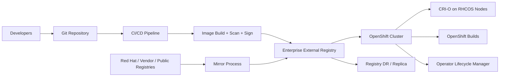
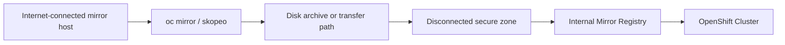
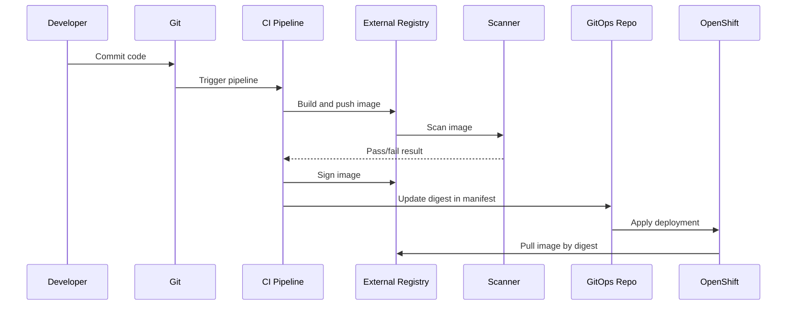

# External Registry Integration in Enterprise Architecture for Advanced OpenShift Administration

**Audience:** Senior OpenShift administrators, platform engineers, SREs, cloud architects, DevSecOps engineers  
**Experience level:** Designed for engineers with ~10 years of Linux, Kubernetes, DevOps, and enterprise infrastructure experience  
**Platform focus:** Red Hat OpenShift Container Platform 4.x, with modern OpenShift 4.20-style concepts where applicable  
**Document type:** Enterprise Architecture deep-dive Markdown guide

---

## 1. Executive Summary

External registry integration is the enterprise architecture practice of connecting OpenShift clusters to image registries outside the cluster so that workloads, builds, Operators, platform payloads, and CI/CD systems can securely pull and sometimes push container images.

In a small lab, this may look like a simple `imagePullSecret`. In a real enterprise OpenShift environment, it becomes a platform-wide design involving:

- Private container registries such as Red Hat Quay, Harbor, Artifactory, Nexus, GitLab Container Registry, Azure Container Registry, AWS ECR, Google Artifact Registry, or an internal registry service.
- Authentication and authorization models for users, nodes, builds, service accounts, and automated pipelines.
- Registry CA trust and TLS design.
- Global pull secret management.
- Namespace-level pull secrets.
- Image allowlists and blocklists.
- Image mirroring using `ImageDigestMirrorSet` and `ImageTagMirrorSet`.
- Disconnected and restricted-network clusters.
- Operator catalog mirroring.
- Release image mirroring.
- Supply-chain security, image scanning, signing, and admission control.
- Resilience, performance, caching, geo-replication, and disaster recovery.

For an advanced OpenShift administrator, external registry integration is not just a command task. It is a **security boundary**, **software supply-chain control point**, **availability dependency**, and **cluster lifecycle dependency**.

---

## 2. Why External Registry Integration Matters in Enterprise Architecture

OpenShift runs containers. Containers come from images. Images come from registries. Therefore, registry integration directly affects:

1. **Cluster installation**  
   The cluster may need Red Hat release images from `quay.io`, `registry.redhat.io`, or an internal mirror.

2. **Cluster upgrades**  
   The Cluster Version Operator needs access to release payload images or mirrored release payloads.

3. **Operator installation**  
   Operator Lifecycle Manager may need external catalog images and operand images.

4. **Application deployment**  
   Workloads may pull images from private enterprise registries.

5. **Build pipelines**  
   Builds may pull base images and push output images to an external registry.

6. **Security compliance**  
   Enterprises often require only approved, scanned, signed, and internally mirrored images.

7. **Disaster recovery**  
   A registry outage can stop new pods from starting even if the cluster itself is healthy.

8. **Disconnected environments**  
   Defense, banking, telecom, government, and regulated sectors often run OpenShift without direct internet access.

In production, a registry outage can cause `ImagePullBackOff`, failed rollouts, failed node replacement, failed upgrades, failed builds, and failed Operator installations. Because of that, an enterprise architect must treat the registry as a **tier-0 or tier-1 dependency** for the platform.

---

## 3. Core Registry Types in an OpenShift Enterprise

### 3.1 Internal OpenShift Image Registry

OpenShift includes an integrated image registry managed by the Image Registry Operator. It is commonly used for:

- BuildConfig output images.
- Internal application image storage.
- ImageStreams.
- Namespace-scoped image workflows.

Typical internal service endpoint:

```text
image-registry.openshift-image-registry.svc:5000
```

The internal registry is useful, but enterprises often use an external registry as the long-term source of truth for images because external registries usually provide stronger enterprise features such as replication, retention policies, vulnerability scanning, robot accounts, image signing, and external CI/CD integration.

### 3.2 External Private Registry

Examples:

- Red Hat Quay
- Harbor
- JFrog Artifactory
- Sonatype Nexus Repository
- GitLab Container Registry
- AWS ECR
- Azure Container Registry
- Google Artifact Registry
- IBM Cloud Container Registry
- Docker Trusted Registry

This registry usually stores:

- Application runtime images.
- Golden base images.
- Middleware images.
- Third-party product images.
- Mirrored Red Hat images.
- Operator catalog images.
- Disconnected installation images.

### 3.3 External Public Registry

Examples:

- `quay.io`
- `registry.redhat.io`
- `registry.access.redhat.com`
- `docker.io`
- `ghcr.io`

Public registries are convenient but risky if used directly in production. Common enterprise controls include:

- Block direct workload pulls from public registries.
- Mirror public images into an approved internal registry.
- Allow only selected vendor registries.
- Require vulnerability scanning before promotion.
- Pin images by digest.
- Enforce admission policies.

### 3.4 Mirror Registry

A mirror registry stores copies of images from another source registry. It is used for:

- Disconnected installations.
- Restricted network clusters.
- Faster local pulls.
- Compliance approval workflows.
- Reducing dependency on the internet.
- Cluster upgrade stability.

In OpenShift 4.x, modern mirror configuration is usually expressed through:

- `ImageDigestMirrorSet` / `IDMS`
- `ImageTagMirrorSet` / `ITMS`

Older clusters may still use:

- `ImageContentSourcePolicy` / `ICSP`

For new designs, prefer `IDMS` and `ITMS` unless a legacy constraint requires ICSP.

---

## 4. Enterprise Architecture View

### 4.1 High-Level Architecture



### 4.2 Registry as a Platform Control Plane Dependency

OpenShift does not store every image layer inside etcd. Pods pull images through the node container runtime, usually CRI-O. If the required image is not already cached on the node and the registry is unreachable, the pod cannot start.

Because of this, registry design must be included in:

- Cluster design.
- Namespace design.
- Network design.
- Certificate design.
- Authentication design.
- Upgrade design.
- Backup and DR design.
- Security boundary design.
- GitOps design.
- Compliance design.

### 4.3 Registry Integration Planes

| Plane | What It Controls | Example |
|---|---|---|
| Node runtime plane | How CRI-O pulls images on cluster nodes | `/etc/containers/registries.conf`, global pull secret |
| Kubernetes workload plane | How pods authenticate to private registries | `imagePullSecrets`, service accounts |
| Build plane | How builds pull base images and push output images | BuildConfig, build service account, output registry credentials |
| Operator plane | How OLM pulls catalog and operand images | CatalogSource, mirror registry, global pull secret |
| Cluster lifecycle plane | How install/upgrade payloads are pulled | Release image mirrors, IDMS, global pull secret |
| Security governance plane | What registries are allowed, blocked, trusted, scanned, signed | `image.config.openshift.io/cluster`, admission policies |

---

## 5. External Registry Integration Patterns

### Pattern 1: Namespace-Level Pull Secret

Use this when only specific namespaces need access to a private registry.

**Use cases:**

- One application team uses a private registry.
- Credentials differ per namespace.
- Multi-tenant platform with team-owned registry projects.
- You want blast radius limited to a namespace.

**Example:**

```bash
oc create secret docker-registry app-registry-creds \
  --docker-server=registry.example.com \
  --docker-username=app-pull-user \
  --docker-password='REDACTED' \
  --docker-email=unused@example.com \
  -n payments-prod

oc secrets link default app-registry-creds --for=pull -n payments-prod
```

Workload example:

```yaml
apiVersion: apps/v1
kind: Deployment
metadata:
  name: payment-api
  namespace: payments-prod
spec:
  replicas: 3
  selector:
    matchLabels:
      app: payment-api
  template:
    metadata:
      labels:
        app: payment-api
    spec:
      imagePullSecrets:
      - name: app-registry-creds
      containers:
      - name: payment-api
        image: registry.example.com/payments/payment-api@sha256:REPLACE_WITH_DIGEST
        ports:
        - containerPort: 8080
```

**Advantages:**

- Least privilege.
- Easy tenant separation.
- Different teams can use different registry credentials.
- Does not expose one credential to the entire cluster.

**Disadvantages:**

- Operational overhead across many namespaces.
- Credentials must be replicated or automated.
- Does not work for all mirror scenarios; mirrored registries configured through IDMS/ITMS require global pull secret usage.

### Pattern 2: Global Cluster Pull Secret

Use this when all nodes or platform components need registry credentials.

**Use cases:**

- Private registry used cluster-wide.
- Mirrored release payloads.
- Mirrored Operator catalogs.
- External registry is the standard image source for all workloads.
- Disconnected or restricted network clusters.

The global pull secret is stored in:

```text
namespace: openshift-config
secret: pull-secret
key: .dockerconfigjson
```

Typical process:

```bash
oc get secret/pull-secret -n openshift-config \
  --template='{{index .data ".dockerconfigjson" | base64decode}}' \
  > pull-secret.json

oc registry login \
  --registry="registry.example.com" \
  --auth-basic="robot-pull-user:REDACTED" \
  --to=pull-secret.json

oc set data secret/pull-secret -n openshift-config \
  --from-file=.dockerconfigjson=pull-secret.json
```

**Important production behavior:**

Updating the global pull secret propagates credentials to cluster nodes. Plan this as a controlled platform change, especially in large clusters.

**Advantages:**

- Works for cluster-level pulls.
- Required for mirrored registries in IDMS/ITMS/ICSP patterns.
- Centralized registry authentication.
- Suitable for disconnected clusters.

**Disadvantages:**

- Larger blast radius if credentials are compromised.
- Needs stronger change control.
- Rotation must be planned carefully.
- Poor fit for tenant-specific credentials unless architecture intentionally centralizes image access.

### Pattern 3: Registry Mirror Integration

Use this when OpenShift should redirect pulls from a source registry to a mirror registry.

**Use cases:**

- Pull `registry.redhat.io/...` content from `mirror.example.com/...`.
- Pull release payloads from internal Quay.
- Pull Operator catalog images from internal Harbor or Quay.
- Keep workload image references stable while moving the actual source to an internal registry.

Example `ImageDigestMirrorSet`:

```yaml
apiVersion: config.openshift.io/v1
kind: ImageDigestMirrorSet
metadata:
  name: redhat-runtime-mirror
spec:
  imageDigestMirrors:
  - source: registry.redhat.io/ubi9
    mirrors:
    - mirror.example.com/redhat/ubi9
    mirrorSourcePolicy: NeverContactSource
```

Example `ImageTagMirrorSet`:

```yaml
apiVersion: config.openshift.io/v1
kind: ImageTagMirrorSet
metadata:
  name: app-tag-mirror
spec:
  imageTagMirrors:
  - source: registry.example.com/apps
    mirrors:
    - mirror-dr.example.com/apps
    mirrorSourcePolicy: AllowContactingSource
```

**Digest mirror vs tag mirror:**

| Object | Best For | Why |
|---|---|---|
| `ImageDigestMirrorSet` | Production, release images, immutable images | Digest is content-addressed and safer |
| `ImageTagMirrorSet` | Tag-based workflows where tags are required | Useful but tag mutability increases risk |

For production workloads, prefer digest references:

```text
registry.example.com/team/app@sha256:<digest>
```

instead of mutable tags:

```text
registry.example.com/team/app:latest
```

### Pattern 4: Disconnected Registry Architecture

Use this when the cluster cannot directly access the internet.

Typical flow:

1. Internet-connected mirror host downloads required images.
2. Images are saved to disk or pushed to a mirror registry.
3. Storage media or controlled network path transfers content to disconnected environment.
4. Disconnected registry stores release images, Operators, and application images.
5. OpenShift uses IDMS/ITMS, CatalogSource, UpdateService, signatures, and global pull secret to consume mirrored content.

High-level disconnected design:



---

## 6. Authentication Design

### 6.1 Credential Types

Common registry credential models:

| Credential Type | Recommended Use |
|---|---|
| Human username/password | Avoid for production automation |
| Robot account / service account | Preferred for cluster pulls and CI/CD |
| Token-based credentials | Preferred when supported |
| Cloud IAM integration | Good for managed cloud registries, but validate OpenShift support and node identity model |
| Short-lived tokens | Strong security, but requires automation for renewal |

### 6.2 Enterprise Credential Principles

A mature registry integration design should follow these rules:

1. **Never use personal user credentials for cluster pulls.**  
   Use robot/service accounts.

2. **Separate pull and push identities.**  
   The cluster runtime usually needs pull-only access. CI systems may need push access.

3. **Separate environments.**  
   Dev, test, stage, and prod should not share the same broad credential unless formally approved.

4. **Separate tenants where needed.**  
   Multi-tenant clusters should avoid exposing a single enterprise-wide pull credential to all namespaces unless the registry ACL model already protects image access.

5. **Rotate credentials regularly.**  
   Registry credentials should be part of enterprise secret rotation policy.

6. **Audit registry access.**  
   The registry must log pull, push, delete, tag, and admin actions.

7. **Avoid wildcard write permissions.**  
   CI/CD push credentials should write only to the required repository path.

### 6.3 Namespace Pull Secret Design

Recommended naming convention:

```text
<registry-short-name>-pull-secret
```

Examples:

```text
quay-pull-secret
harbor-pull-secret
artifactory-pull-secret
acr-pull-secret
```

Recommended service account binding:

```bash
oc secrets link default harbor-pull-secret --for=pull -n myapp-prod
oc secrets link builder harbor-pull-secret --for=pull -n myapp-prod
```

Check service account linkage:

```bash
oc get sa default -n myapp-prod -o yaml
```

### 6.4 Build Push Secret Design

If OpenShift builds push output images to an external registry, the build service account may need push credentials.

Example:

```bash
oc create secret docker-registry external-registry-push \
  --docker-server=registry.example.com \
  --docker-username=build-push-user \
  --docker-password='REDACTED' \
  --docker-email=unused@example.com \
  -n build-tools

oc secrets link builder external-registry-push --for=pull,mount -n build-tools
```

BuildConfig output example:

```yaml
apiVersion: build.openshift.io/v1
kind: BuildConfig
metadata:
  name: app-build
  namespace: build-tools
spec:
  source:
    type: Git
    git:
      uri: https://git.example.com/apps/app.git
  strategy:
    type: Docker
    dockerStrategy: {}
  output:
    to:
      kind: DockerImage
      name: registry.example.com/apps/app:1.0.0
    pushSecret:
      name: external-registry-push
```

---

## 7. TLS and CA Trust Design

### 7.1 Why Registry Trust Matters

If the external registry uses a certificate signed by a private enterprise CA, OpenShift nodes and build components must trust that CA. Otherwise, pulls fail with errors similar to:

```text
x509: certificate signed by unknown authority
```

### 7.2 Image Registry CA Trust

For registry-specific trust, create a ConfigMap in `openshift-config` and reference it from the cluster image configuration.

Example ConfigMap:

```yaml
apiVersion: v1
kind: ConfigMap
metadata:
  name: registry-ca-bundle
  namespace: openshift-config
data:
  registry.example.com: |
    -----BEGIN CERTIFICATE-----
    REPLACE_WITH_CA_CERT
    -----END CERTIFICATE-----
  registry-with-port.example.com..5000: |
    -----BEGIN CERTIFICATE-----
    REPLACE_WITH_CA_CERT
    -----END CERTIFICATE-----
```

Notice the hostname-with-port format:

```text
registry-with-port.example.com..5000
```

OpenShift uses `..` instead of `:` in the ConfigMap key because `:` is not valid in a ConfigMap key for this use case.

Patch the image configuration:

```bash
oc patch image.config.openshift.io/cluster --type=merge \
  -p '{"spec":{"additionalTrustedCA":{"name":"registry-ca-bundle"}}}'
```

Verify:

```bash
oc get image.config.openshift.io/cluster -o yaml
```

### 7.3 Cluster-Wide Proxy Trust vs Registry Trust

Do not confuse these two trust models:

| Trust Location | Purpose | OpenShift Resource |
|---|---|---|
| Registry CA trust | Trust external image registries for image pull/push | `image.config.openshift.io/cluster.spec.additionalTrustedCA` |
| Cluster-wide proxy trust | Trust custom CA for platform egress HTTPS/proxy use | `proxy/cluster.spec.trustedCA` |

In some enterprises, both are needed:

- Registry uses private CA: configure `additionalTrustedCA` in image config.
- Egress proxy uses private CA or TLS interception: configure `proxy/cluster.spec.trustedCA`.

### 7.4 Insecure Registry Design

OpenShift can allow insecure registries, but this should be an exception for labs, migrations, or temporary break-glass situations.

Example:

```yaml
apiVersion: config.openshift.io/v1
kind: Image
metadata:
  name: cluster
spec:
  registrySources:
    insecureRegistries:
    - insecure-registry.example.com
```

Production recommendation:

- Avoid insecure registries.
- Use valid TLS certificates.
- Fix the CA trust chain instead of disabling TLS validation.
- Document exception approval and expiry date if insecure registry use is unavoidable.

---

## 8. Image Registry Policy Design

OpenShift provides cluster-wide image registry configuration through:

```text
image.config.openshift.io/cluster
```

### 8.1 Allowing Registries

Use `allowedRegistries` when you want a strict allowlist for image pull and push operations.

Example:

```yaml
apiVersion: config.openshift.io/v1
kind: Image
metadata:
  name: cluster
spec:
  registrySources:
    allowedRegistries:
    - registry.redhat.io
    - quay.io
    - image-registry.openshift-image-registry.svc:5000
    - registry.example.com
    - mirror.example.com
```

**Critical warning:**  
When you define `allowedRegistries`, every registry not listed is blocked. You must explicitly include registries needed by OpenShift platform payloads, Operators, internal registry, and mirrors.

A safe production allowlist should include:

- Red Hat registries needed by your support model or mirror process.
- Internal OpenShift registry, if used.
- Enterprise external registry.
- Mirror registry.
- Approved vendor registries, if direct access is allowed.

### 8.2 Blocking Registries

Use `blockedRegistries` when you want to block known untrusted registries while allowing everything else.

Example:

```yaml
apiVersion: config.openshift.io/v1
kind: Image
metadata:
  name: cluster
spec:
  registrySources:
    blockedRegistries:
    - docker.io
    - untrusted.example.com
```

This is less strict than an allowlist. It is easier to operate but weaker from a compliance perspective.

### 8.3 `allowedRegistriesForImport`

This setting controls where normal users can import images from, especially for ImageStreams.

Example:

```yaml
apiVersion: config.openshift.io/v1
kind: Image
metadata:
  name: cluster
spec:
  allowedRegistriesForImport:
  - domainName: registry.example.com
    insecure: false
  - domainName: quay.io
    insecure: false
```

Use this to stop users from importing arbitrary public images into cluster image workflows.

### 8.4 Short Name Search Registries

Container image short names such as `nginx` are risky because they rely on search registries and can cause ambiguity or supply-chain risk.

Avoid this in production:

```text
nginx:latest
```

Prefer this:

```text
registry.example.com/platform/nginx@sha256:<digest>
```

Production recommendation:

- Use fully qualified image names.
- Use digests for production workloads.
- Avoid `latest`.
- Do not rely on short-name search for critical workloads.

---

## 9. Image Mirroring Design with IDMS and ITMS

### 9.1 Why Mirroring Exists

Mirroring lets OpenShift pull from an internal registry even when the image reference points to an upstream registry.

Example application image reference:

```text
registry.redhat.io/ubi9/ubi@sha256:abc123...
```

Runtime pull after mirror configuration:

```text
mirror.example.com/redhat/ubi9/ubi@sha256:abc123...
```

The workload spec can remain stable while the node runtime redirects to the mirror.

### 9.2 `ImageDigestMirrorSet`

Use this for digest-based references.

```yaml
apiVersion: config.openshift.io/v1
kind: ImageDigestMirrorSet
metadata:
  name: ubi9-digest-mirror
spec:
  imageDigestMirrors:
  - source: registry.redhat.io/ubi9
    mirrors:
    - mirror.example.com/redhat/ubi9
    mirrorSourcePolicy: NeverContactSource
```

**Recommended for:**

- Release images.
- Operator images.
- Production application images.
- Security-sensitive environments.
- Disconnected clusters.

### 9.3 `ImageTagMirrorSet`

Use this for tag-based references.

```yaml
apiVersion: config.openshift.io/v1
kind: ImageTagMirrorSet
metadata:
  name: app-tag-mirror
spec:
  imageTagMirrors:
  - source: registry.example.com/apps
    mirrors:
    - mirror.example.com/apps
    mirrorSourcePolicy: AllowContactingSource
```

**Recommended for:**

- Development or transition cases.
- Vendor images available only by tag.
- Legacy workloads that cannot yet move to digest references.

### 9.4 `mirrorSourcePolicy`

Common values:

| Policy | Meaning | Enterprise Use |
|---|---|---|
| `AllowContactingSource` | If mirror fails, source registry may be contacted | Useful in connected clusters |
| `NeverContactSource` | Source registry is blocked for this mirror rule | Required for strict disconnected/compliance designs |

In regulated environments, prefer:

```yaml
mirrorSourcePolicy: NeverContactSource
```

### 9.5 IDMS/ITMS and Global Pull Secret

When using IDMS, ITMS, or legacy ICSP mirror configuration, plan credentials at the **global pull secret** level for mirrored registries. Namespace-level pull secrets are not sufficient for all mirrored registry pull paths.

### 9.6 Migration from ICSP

Older OpenShift designs may have `ImageContentSourcePolicy` resources.

List them:

```bash
oc get imagecontentsourcepolicy
```

Migrate YAML definitions:

```bash
oc adm migrate icsp icsp.yaml --dest-dir idms-files
```

Apply generated IDMS:

```bash
oc apply -f idms-files/
```

After validation, remove legacy ICSP according to your change procedure.

---

## 10. Disconnected and Restricted Network Registry Design

### 10.1 Disconnected Registry Content Scope

A disconnected registry must contain all images required by:

- OpenShift installation.
- OpenShift upgrades.
- Cluster Operators.
- Red Hat Operators.
- Certified Operators.
- Community Operators, if permitted.
- Custom application images.
- Base images.
- CI/CD tool images.
- Security scanners.
- Monitoring/logging components.
- Backup/restore operators.
- Service mesh, GitOps, Pipelines, Quay, ODF, ACS, ACM, etc.

### 10.2 oc-mirror v2 Workflow

A modern disconnected image management workflow commonly uses `oc mirror --v2` with an image set configuration.

High-level steps:

1. Prepare registry credentials.
2. Create ImageSetConfiguration.
3. Mirror from internet to disk or directly to registry.
4. Transfer archive if needed.
5. Mirror from disk to disconnected registry.
6. Apply generated cluster resources such as IDMS, ITMS, CatalogSource, UpdateService, and signature config maps.
7. Validate installation, Operator availability, and upgrade graph.

Example direct mirror concept:

```bash
oc mirror -c imageset-config.yaml docker://mirror.example.com/ocp --v2
```

Example mirror-to-disk concept:

```bash
oc mirror -c imageset-config.yaml file:///mnt/mirror-workspace --v2
```

Example disk-to-registry concept:

```bash
oc mirror -c imageset-config.yaml \
  --from file:///mnt/mirror-workspace \
  docker://mirror.example.com/ocp \
  --v2
```

### 10.3 Example ImageSetConfiguration

```yaml
apiVersion: mirror.openshift.io/v2alpha1
kind: ImageSetConfiguration
mirror:
  platform:
    channels:
    - name: stable-4.20
      minVersion: 4.20.0
      maxVersion: 4.20.3
  operators:
  - catalog: registry.redhat.io/redhat/redhat-operator-index:v4.20
    packages:
    - name: openshift-gitops-operator
    - name: openshift-pipelines-operator-rh
    - name: advanced-cluster-management
  additionalImages:
  - name: registry.redhat.io/ubi9/ubi:latest
  - name: registry.example.com/platform/base-java@sha256:REPLACE_WITH_DIGEST
```

Adjust version, channel, packages, and images based on your actual support matrix.

### 10.4 Disconnected Validation Checklist

Before declaring the disconnected registry production-ready:

- Confirm all OpenShift release payload images are mirrored.
- Confirm release signatures are applied.
- Confirm Operator catalogs are mirrored.
- Confirm operand images are mirrored.
- Confirm application images are mirrored.
- Confirm global pull secret contains mirror registry credentials.
- Confirm registry CA is trusted by OpenShift.
- Confirm IDMS/ITMS resources are applied.
- Confirm `oc adm upgrade` shows expected upgrade path.
- Confirm OLM can install Operators from mirrored CatalogSource.
- Confirm new worker node can join and pull required images.
- Confirm no workload pulls directly from internet.
- Confirm registry backup and restore procedure.

---

## 11. Network Architecture

### 11.1 Required Network Paths

At minimum, OpenShift worker and infrastructure nodes must reach the registry endpoint.

| Source | Destination | Purpose |
|---|---|---|
| Worker nodes | External registry | Pull workload images |
| Control plane nodes | Registry/mirror | Pull platform images when needed |
| Build pods | Registry | Pull base images, push output images |
| CI/CD runners | Registry | Push application images |
| Mirror host | Source registries | Download external content |
| Mirror host | Internal registry | Push mirrored content |
| Security scanners | Registry | Scan images and metadata |
| GitOps tools | Registry indirectly through workloads | Deploy image references |

### 11.2 Ports

Common registry access:

```text
TCP 443   HTTPS registry access
TCP 5000  Common internal registry or custom registry port
TCP 8443  Common lab/private registry HTTPS port
```

Production recommendation:

- Use HTTPS on TCP 443 where possible.
- Avoid custom ports unless required.
- If custom ports are used, include them in certificates, firewall rules, proxy rules, and CA ConfigMap keys.

### 11.3 DNS Design

Registry FQDNs must resolve consistently from:

- OpenShift nodes.
- Build pods.
- Mirror hosts.
- CI/CD systems.
- Admin workstations.

Examples:

```text
registry.example.com
mirror.example.com
quay-dr.example.com
```

Avoid designs that depend on `/etc/hosts` entries. Use enterprise DNS.

### 11.4 Proxy Design

If OpenShift uses an egress proxy:

- Registry traffic may need to go through proxy or bypass proxy.
- Internal registry FQDNs should usually be in `noProxy`.
- The proxy CA may need cluster-wide trust.
- Large image layer downloads can stress proxy capacity.

Example proxy object inspection:

```bash
oc get proxy/cluster -o yaml
```

### 11.5 Firewall Design

Firewall rules should be precise:

- Allow OpenShift node subnets to registry endpoints.
- Allow CI/CD runners to push to registry.
- Allow mirror host to pull from approved external sources.
- Deny direct internet registry access from production clusters if using strict mirror model.
- Log denied traffic for troubleshooting.

---

## 12. Security Architecture

### 12.1 Threat Model

External registry integration introduces supply-chain risks:

| Threat | Example | Mitigation |
|---|---|---|
| Malicious image | Public image contains backdoor | Approved registry, scanning, signing, admission |
| Tag mutation | `latest` points to different content | Digest pinning |
| Credential theft | Pull secret leaked | Robot accounts, least privilege, rotation |
| MITM | Registry TLS not trusted properly | Valid TLS, CA trust, no insecure registry |
| Registry compromise | Attacker pushes modified image | RBAC, audit, signing, immutable tags |
| Uncontrolled public pulls | Users deploy random internet images | Registry allowlist, admission policy |
| Stale vulnerable images | Old base image remains in use | Scanning, rebuild policy, lifecycle management |

### 12.2 Image Promotion Model

A mature enterprise often uses a promotion flow:

```text
External Source → Quarantine → Scan → Sign → Dev Registry → Test Registry → Prod Registry
```

Example repository layout:

```text
registry.example.com/quarantine/vendor/nginx
registry.example.com/dev/apps/payment-api
registry.example.com/test/apps/payment-api
registry.example.com/prod/apps/payment-api
```

Promotion should copy immutable digests, not rebuild or retag blindly.

### 12.3 Image Scanning

Registry scanning should check:

- OS package CVEs.
- Language dependencies.
- Secrets in image layers.
- Malware indicators.
- License policy.
- End-of-life base images.
- Misconfigurations.

Scanning tools may include:

- Red Hat Advanced Cluster Security for Kubernetes.
- Quay Security Scanner.
- Clair.
- Trivy.
- Anchore.
- Enterprise vulnerability management platforms.

### 12.4 Image Signing and Verification

Production-grade image supply chain should include image signing.

Possible tooling:

- Sigstore/cosign.
- Simple signing.
- Enterprise signing systems.
- Admission controllers that enforce signatures.

Policy example:

- Dev namespace: unsigned images allowed with warning.
- Test namespace: signed images required for selected apps.
- Prod namespace: signed images required, digest pinning required, approved registry required.

### 12.5 Admission Control

Registry controls can be enforced using:

- Built-in OpenShift image configuration.
- Validating admission policies.
- Gatekeeper/OPA.
- Kyverno.
- Red Hat Advanced Cluster Security policies.
- Custom admission webhooks.

Example policy goals:

- Block `:latest` in production.
- Require digest references in production.
- Allow only `registry.example.com/prod/*` in production namespaces.
- Block `docker.io` direct pulls.
- Require signed images.
- Require vulnerability scan pass before deployment.

---

## 13. Multi-Tenant Design

### 13.1 Tenant Registry Models

| Model | Description | Good For | Risk |
|---|---|---|---|
| Shared enterprise registry | All teams use one registry with namespace/repo isolation | Standardization | Needs strong registry RBAC |
| Per-business-unit registry | Each BU has its own registry project or registry instance | Large enterprises | More operational overhead |
| Per-environment registry | Separate dev/test/prod registries | Strong environment separation | Image promotion complexity |
| Per-cluster registry mirror | Each cluster/site has a local mirror | Edge/disconnected | Synchronization complexity |

### 13.2 Namespace-to-Registry Mapping

Example mapping:

| OpenShift Namespace | Registry Repository | Credential Scope |
|---|---|---|
| `payments-dev` | `registry.example.com/dev/payments/*` | pull dev images |
| `payments-test` | `registry.example.com/test/payments/*` | pull test images |
| `payments-prod` | `registry.example.com/prod/payments/*` | pull prod images only |
| `platform-tools` | `registry.example.com/platform/*` | pull platform images |

### 13.3 RBAC Separation

Registry RBAC should align with OpenShift RBAC:

- Developers can push to dev repositories.
- CI/CD can promote to test.
- Release managers or automation can promote to prod.
- OpenShift cluster runtime can pull from prod.
- No human should push directly to prod without controlled workflow.

---

## 14. CI/CD and GitOps Integration

### 14.1 CI/CD Build and Push Flow



### 14.2 Recommended GitOps Image Reference

Avoid:

```yaml
image: registry.example.com/apps/payment-api:latest
```

Prefer:

```yaml
image: registry.example.com/apps/payment-api@sha256:8f3d...
```

This ensures the manifest points to exactly one image artifact.

### 14.3 Promotion Without Rebuild

Do not rebuild the same code separately for dev, test, and prod. Build once, then promote the immutable artifact.

Bad pattern:

```text
Build dev image → build test image → build prod image
```

Good pattern:

```text
Build once → scan → sign → promote same digest across environments
```

---

## 15. Operator and Catalog Registry Integration

OpenShift Operators add another registry dependency. Operator installation may require:

- Catalog index image.
- Bundle images.
- Operator controller image.
- Operand images.
- Related images.

In disconnected environments, it is not enough to mirror only the catalog image. You must ensure all related images are mirrored and referenced correctly.

Example CatalogSource:

```yaml
apiVersion: operators.coreos.com/v1alpha1
kind: CatalogSource
metadata:
  name: redhat-operators-mirror
  namespace: openshift-marketplace
spec:
  sourceType: grpc
  image: mirror.example.com/redhat/redhat-operator-index:v4.20
  displayName: Red Hat Operators Mirror
  publisher: Red Hat
```

Validation:

```bash
oc get catalogsource -n openshift-marketplace
oc get pods -n openshift-marketplace
oc get packagemanifests | grep -i gitops
```

Troubleshooting:

```bash
oc describe catalogsource redhat-operators-mirror -n openshift-marketplace
oc logs -n openshift-marketplace <catalog-pod-name>
```

---

## 16. Registry Resilience and Disaster Recovery

### 16.1 Registry Availability Requirements

Define registry SLOs:

| Requirement | Example Target |
|---|---|
| Availability | 99.9% or better for production registry |
| RPO | 15 minutes to 24 hours depending on environment |
| RTO | 30 minutes to 4 hours depending on criticality |
| Pull latency | Should not delay normal pod startup significantly |
| Backup frequency | Daily full + frequent metadata backup, based on registry type |

### 16.2 Registry HA Design

A production external registry should have:

- Highly available registry application layer.
- Highly available database, if registry uses one.
- Durable object storage or replicated storage.
- Load balancer or route endpoint.
- TLS certificate automation.
- Monitoring and alerting.
- Regular backup validation.

### 16.3 Registry DR Patterns

| Pattern | Description | Pros | Cons |
|---|---|---|---|
| Active-passive | Primary registry replicates to DR registry | Simple failover | DNS/failover process needed |
| Active-active | Multiple active registry endpoints | Better resilience | Complexity and consistency challenges |
| Per-site mirror | Each OpenShift site has local mirror | Fast local pulls | Sync management overhead |
| Object storage replication | Registry blob storage replicated | Good for large image layers | Metadata DB still needs DR |

### 16.4 OpenShift Mirror Failover

IDMS/ITMS supports multiple mirrors. Order matters from an operational perspective.

Example:

```yaml
apiVersion: config.openshift.io/v1
kind: ImageDigestMirrorSet
metadata:
  name: app-mirror-ha
spec:
  imageDigestMirrors:
  - source: registry.example.com/prod
    mirrors:
    - registry-primary.example.com/prod
    - registry-dr.example.com/prod
    mirrorSourcePolicy: NeverContactSource
```

### 16.5 Node Image Cache Is Not a DR Strategy

A node may already have image layers cached, so existing pods may restart successfully on the same node. But cache is not reliable for:

- New nodes.
- Evicted pods scheduled to different nodes.
- Upgrades.
- New deployments.
- Autoscaling events.

Do not rely on node cache as your registry availability plan.

---

## 17. Performance and Scale Design

### 17.1 Registry Performance Bottlenecks

Common bottlenecks:

- Slow object storage.
- Small registry VM or pod resources.
- Under-sized database.
- TLS termination bottleneck.
- Proxy bottleneck.
- WAN latency.
- Too many parallel pulls during rollout.
- No local registry mirror at remote sites.
- Large image layers.

### 17.2 Image Optimization

Platform teams should enforce:

- Minimal base images.
- Multi-stage builds.
- No unnecessary packages.
- No build tools in runtime images.
- Layer reuse.
- Regular base image refresh.
- Compression-aware registry design.
- Avoid huge monolithic images.

### 17.3 Rollout Storm Control

During mass deployments or node replacement, hundreds of pods may pull images simultaneously. Mitigations:

- Use local mirrors near clusters.
- Pre-pull critical images through DaemonSets where appropriate.
- Stagger deployments.
- Use PodDisruptionBudgets and maxUnavailable controls.
- Use digest-pinned images to improve cache predictability.
- Avoid clearing node image cache unnecessarily.

Example pre-pull DaemonSet concept:

```yaml
apiVersion: apps/v1
kind: DaemonSet
metadata:
  name: prepull-critical-images
  namespace: platform-tools
spec:
  selector:
    matchLabels:
      app: prepull-critical-images
  template:
    metadata:
      labels:
        app: prepull-critical-images
    spec:
      containers:
      - name: prepull
        image: registry.example.com/platform/critical-base@sha256:REPLACE
        command: ["/bin/sh", "-c", "sleep 3600"]
      tolerations:
      - operator: Exists
```

Use this carefully. It consumes resources and should be part of a controlled operational pattern.

---

## 18. Operational Procedures

### 18.1 Create Namespace Pull Secret

```bash
NAMESPACE=demo
REGISTRY=registry.example.com
SECRET=registry-pull-secret
USER=robot-pull
PASSWORD='REDACTED'

oc create secret docker-registry ${SECRET} \
  --docker-server=${REGISTRY} \
  --docker-username=${USER} \
  --docker-password=${PASSWORD} \
  --docker-email=unused@example.com \
  -n ${NAMESPACE}

oc secrets link default ${SECRET} --for=pull -n ${NAMESPACE}
```

Test:

```bash
oc run pull-test \
  --image=registry.example.com/apps/test@sha256:REPLACE \
  --restart=Never \
  -n ${NAMESPACE}

oc describe pod pull-test -n ${NAMESPACE}
```

### 18.2 Update Global Pull Secret

```bash
oc get secret/pull-secret -n openshift-config \
  --template='{{index .data ".dockerconfigjson" | base64decode}}' \
  > pull-secret.json

cp pull-secret.json pull-secret.backup.$(date +%F-%H%M%S).json

oc registry login \
  --registry="registry.example.com" \
  --auth-basic="robot-pull:REDACTED" \
  --to=pull-secret.json

jq . pull-secret.json > /dev/null

oc set data secret/pull-secret -n openshift-config \
  --from-file=.dockerconfigjson=pull-secret.json
```

Monitor:

```bash
oc get mcp
oc get nodes
```

### 18.3 Configure Registry CA Trust

```bash
oc create configmap registry-ca-bundle \
  --from-file=registry.example.com=/path/to/registry-ca.crt \
  -n openshift-config

oc patch image.config.openshift.io/cluster --type=merge \
  -p '{"spec":{"additionalTrustedCA":{"name":"registry-ca-bundle"}}}'
```

For registry with port `5000`, use this key format:

```bash
oc create configmap registry-ca-bundle \
  --from-file=registry.example.com..5000=/path/to/registry-ca.crt \
  -n openshift-config
```

### 18.4 Configure Registry Allowlist

```bash
oc patch image.config.openshift.io/cluster --type=merge -p '
{
  "spec": {
    "registrySources": {
      "allowedRegistries": [
        "registry.redhat.io",
        "quay.io",
        "image-registry.openshift-image-registry.svc:5000",
        "registry.example.com",
        "mirror.example.com"
      ]
    }
  }
}'
```

Validate carefully before applying this in production. Missing required registries can break pods, Operators, builds, or upgrades.

### 18.5 Configure IDMS

```yaml
apiVersion: config.openshift.io/v1
kind: ImageDigestMirrorSet
metadata:
  name: enterprise-redhat-mirror
spec:
  imageDigestMirrors:
  - source: registry.redhat.io
    mirrors:
    - mirror.example.com/redhat
    mirrorSourcePolicy: NeverContactSource
  - source: quay.io/openshift-release-dev
    mirrors:
    - mirror.example.com/openshift-release-dev
    mirrorSourcePolicy: NeverContactSource
```

Apply:

```bash
oc apply -f idms.yaml
```

Check generated runtime config on a node:

```bash
oc debug node/<node-name>
chroot /host
cat /etc/containers/registries.conf
exit
exit
```

---

## 19. Troubleshooting External Registry Integration

### 19.1 Common Pod Statuses

| Status | Meaning |
|---|---|
| `ImagePullBackOff` | Kubelet/CRI-O repeatedly failed to pull image |
| `ErrImagePull` | Initial image pull failed |
| `InvalidImageName` | Image reference format is wrong |
| `CreateContainerConfigError` | Secret/config issue before container start |

### 19.2 Troubleshooting Workflow

Start with the pod:

```bash
oc describe pod <pod-name> -n <namespace>
```

Look for events:

```text
Failed to pull image
unauthorized: authentication required
x509: certificate signed by unknown authority
manifest unknown
connection refused
i/o timeout
no such host
```

Check image reference:

```bash
oc get pod <pod-name> -n <namespace> -o jsonpath='{.spec.containers[*].image}{"\n"}'
```

Check service account pull secrets:

```bash
oc get pod <pod-name> -n <namespace> -o jsonpath='{.spec.serviceAccountName}{"\n"}'
oc get sa <service-account> -n <namespace> -o yaml
```

Check secret type:

```bash
oc get secret <secret-name> -n <namespace> -o jsonpath='{.type}{"\n"}'
```

Expected:

```text
kubernetes.io/dockerconfigjson
```

Check secret JSON:

```bash
oc get secret <secret-name> -n <namespace> \
  -o jsonpath='{.data.\.dockerconfigjson}' | base64 -d | jq .
```

Check global pull secret:

```bash
oc get secret pull-secret -n openshift-config \
  -o jsonpath='{.data.\.dockerconfigjson}' | base64 -d | jq .auths
```

Check image config:

```bash
oc get image.config.openshift.io/cluster -o yaml
```

Check IDMS/ITMS:

```bash
oc get imagedigestmirrorset
oc get imagetagmirrorset
oc describe imagedigestmirrorset <name>
```

Check node runtime config:

```bash
oc debug node/<node-name>
chroot /host
cat /etc/containers/registries.conf
cat /etc/containers/policy.json
cat /var/lib/kubelet/config.json | jq .
exit
exit
```

### 19.3 Error: `unauthorized: authentication required`

Likely causes:

- Missing pull secret.
- Wrong registry hostname in secret.
- Wrong credentials.
- Secret linked to wrong service account.
- Token expired.
- Registry repository permission missing.
- Mirror registry requires global pull secret, but only namespace secret exists.

Fix approach:

```bash
oc create secret docker-registry registry-pull-secret \
  --docker-server=registry.example.com \
  --docker-username=robot-pull \
  --docker-password='REDACTED' \
  --docker-email=unused@example.com \
  -n app-prod

oc secrets link default registry-pull-secret --for=pull -n app-prod
```

For mirror/global issue, update global pull secret.

### 19.4 Error: `x509: certificate signed by unknown authority`

Likely causes:

- Registry uses private CA.
- Intermediate CA missing.
- Wrong hostname in certificate SAN.
- CA ConfigMap key does not match registry host/port.
- `additionalTrustedCA` not configured.

Fix approach:

```bash
oc get image.config.openshift.io/cluster -o yaml | grep -A5 additionalTrustedCA
oc get configmap registry-ca-bundle -n openshift-config -o yaml
```

Ensure ConfigMap key exactly matches registry hostname:

```text
registry.example.com
registry.example.com..5000
```

### 19.5 Error: `manifest unknown`

Likely causes:

- Image tag does not exist.
- Digest does not exist.
- Wrong repository path.
- Mirror incomplete.
- Multi-arch manifest missing.
- Image was garbage-collected.

Fix:

```bash
skopeo inspect docker://registry.example.com/apps/app:1.0.0
skopeo inspect docker://registry.example.com/apps/app@sha256:<digest>
```

### 19.6 Error: `no such host`

Likely causes:

- DNS issue from node.
- Registry FQDN not resolvable in cluster network.
- Wrong registry hostname.
- Split-horizon DNS mismatch.

Debug from node:

```bash
oc debug node/<node-name>
chroot /host
getent hosts registry.example.com
curl -vk https://registry.example.com/v2/
exit
exit
```

### 19.7 Error: `connection refused` or `i/o timeout`

Likely causes:

- Firewall blocked.
- Registry service down.
- Wrong port.
- Proxy issue.
- Load balancer issue.
- NetworkPolicy if testing from pod.

Debug:

```bash
oc debug node/<node-name>
chroot /host
curl -vk https://registry.example.com/v2/
nc -vz registry.example.com 443
exit
exit
```

If `nc` is unavailable, use:

```bash
curl -vk --connect-timeout 5 https://registry.example.com/v2/
```

### 19.8 Error After Enabling Allowlist

Likely cause:

- Required registry not included in `allowedRegistries`.

Check:

```bash
oc get image.config.openshift.io/cluster -o yaml
```

Ensure these are included if required by your environment:

```text
registry.redhat.io
quay.io
image-registry.openshift-image-registry.svc:5000
mirror.example.com
registry.example.com
```

---

## 20. Monitoring and Alerting

### 20.1 What to Monitor

Registry platform:

- Registry availability.
- HTTP 5xx errors.
- HTTP 401/403 spikes.
- Blob storage latency.
- Database health.
- Replication lag.
- Disk/object storage capacity.
- Certificate expiry.
- Garbage collection results.
- Scan queue backlog.

OpenShift side:

- `ImagePullBackOff` events.
- Failed builds due to image pull/push.
- OLM catalog pod failures.
- Cluster upgrade failures due to image pull.
- MachineConfigPool degraded after image config change.
- Node-level CRI-O pull errors.

### 20.2 Useful OpenShift Queries

Find pods with image pull issues:

```bash
oc get pods -A | egrep 'ImagePullBackOff|ErrImagePull|InvalidImageName'
```

Watch events:

```bash
oc get events -A --sort-by=.lastTimestamp | tail -100
```

Check MachineConfigPools:

```bash
oc get mcp
```

Check cluster operators:

```bash
oc get co
```

### 20.3 Alert Examples

Create alerts for:

- High number of pods in `ImagePullBackOff`.
- Registry endpoint unavailable from cluster nodes.
- Registry certificate expiring in less than 30 days.
- Mirror sync failure.
- Registry storage above 80%.
- Quay/Harbor/Artifactory replication lag.
- Failed Operator catalog pulls.

---

## 21. Change Management

### 21.1 Changes That Require Extra Care

Treat these as controlled platform changes:

- Updating global pull secret.
- Adding or removing registry allowlist entries.
- Blocking registries.
- Configuring insecure registries.
- Changing registry CA bundle.
- Adding or modifying IDMS/ITMS.
- Migrating ICSP to IDMS.
- Changing mirror source policy.
- Rotating registry robot account credentials.
- Changing registry DNS or load balancer.
- Upgrading the registry platform itself.

### 21.2 Pre-Change Checklist

- Backup current global pull secret.
- Export current image config.
- Export current IDMS/ITMS/ICSP.
- Validate new registry credentials with `podman login` or `skopeo inspect`.
- Validate registry TLS chain.
- Validate DNS from nodes.
- Confirm firewall rules.
- Confirm rollback plan.
- Confirm maintenance window if node drain/reboot is expected.
- Notify application teams.

Commands:

```bash
mkdir -p registry-change-backup-$(date +%F-%H%M%S)
cd registry-change-backup-*

oc get secret pull-secret -n openshift-config -o yaml > pull-secret.yaml
oc get image.config.openshift.io/cluster -o yaml > image-config.yaml
oc get imagedigestmirrorset -o yaml > idms.yaml
oc get imagetagmirrorset -o yaml > itms.yaml
oc get imagecontentsourcepolicy -o yaml > icsp.yaml || true
```

### 21.3 Post-Change Checklist

- Confirm `oc get mcp` is healthy.
- Confirm `oc get co` is healthy.
- Confirm test pod can pull from external registry.
- Confirm build can pull/push if applicable.
- Confirm Operator catalog is healthy.
- Confirm node runtime config contains expected registry configuration.
- Confirm no unexpected `ImagePullBackOff` surge.
- Confirm registry audit logs show expected access.

---

## 22. Enterprise Reference Design

### 22.1 Recommended Production Model

For a serious enterprise OpenShift platform, use this model:

1. **Enterprise registry as approved source**  
   All production workloads pull from `registry.example.com` or approved mirrors.

2. **Digest-pinned production deployments**  
   Production manifests use `@sha256` digests.

3. **Robot accounts**  
   Cluster pull uses robot pull-only account.

4. **Namespace isolation**  
   Teams get namespace-level pull secrets where possible.

5. **Global pull secret only for platform/mirror requirements**  
   Do not use global secret as a lazy substitute for tenant secret design.

6. **Registry CA trust configured correctly**  
   Avoid insecure registries.

7. **Strict allowlist for high-security clusters**  
   Include all required platform registries and mirrors.

8. **IDMS for mirrored production content**  
   Prefer digest-based mirror rules.

9. **oc-mirror for disconnected content lifecycle**  
   Manage release images, Operators, and additional images declaratively.

10. **Scanning, signing, and admission enforcement**  
   Registry integration must be part of software supply-chain security.

11. **Registry HA and DR**  
   Registry must be backed up, replicated, monitored, and tested.

### 22.2 Example Enterprise Registry Layout

```text
registry.example.com/
├── platform/
│   ├── ubi9/
│   ├── java-base/
│   ├── nginx-base/
│   └── tools/
├── redhat-mirror/
│   ├── openshift-release-dev/
│   ├── redhat-operators/
│   └── ubi9/
├── dev/
│   ├── payments/
│   ├── claims/
│   └── customer/
├── test/
│   ├── payments/
│   ├── claims/
│   └── customer/
└── prod/
    ├── payments/
    ├── claims/
    └── customer/
```

### 22.3 Example Production Policy

```text
Production namespace policy:
- Images must come from registry.example.com/prod/* or approved platform paths.
- Images must use digest, not mutable tags.
- Images must be scanned with no critical vulnerabilities older than exception SLA.
- Images must be signed.
- Pull secret must be linked to the workload service account.
- Direct docker.io, ghcr.io, and random public registry pulls are blocked.
```

---

## 23. Advanced Exam and Interview-Level Points

For Advanced OpenShift Administration, know these points clearly:

1. **Namespace pull secret vs global pull secret**  
   Namespace secrets are for workload-level private image pulls. Global pull secret is for cluster-wide node/platform pull access.

2. **IDMS/ITMS vs ICSP**  
   IDMS and ITMS are the modern mirror objects. ICSP is legacy but may still exist after upgrades.

3. **IDMS uses digest references**  
   Best for production and disconnected release content.

4. **ITMS uses tag references**  
   Useful but less secure because tags can move.

5. **CA trust is not the same as credentials**  
   Authentication failure and x509 failure are different problems.

6. **Allowlist can break the cluster**  
   If you configure `allowedRegistries` and forget `registry.redhat.io`, `quay.io`, internal registry, or mirrors, workloads or platform components may fail.

7. **Disconnected means all dependencies must be mirrored**  
   Release payload, Operators, operands, application images, base images, and signatures.

8. **Global pull secret changes are platform changes**  
   They roll out to nodes and need monitoring.

9. **ImagePullBackOff is a symptom, not a root cause**  
   Always inspect events, secret linkage, registry DNS, TLS, auth, and mirror config.

10. **Digest pinning is enterprise-grade**  
    Tags are convenient; digests are deterministic.

---

## 24. Practical Lab: Complete External Registry Integration

### Scenario

You have:

```text
External registry: registry.example.com
Namespace: finance-prod
Application image: registry.example.com/prod/finance-api@sha256:REPLACE
Registry user: finance-pull
Registry CA: /tmp/registry-ca.crt
```

Goal:

- Trust registry CA.
- Create namespace pull secret.
- Link pull secret to service account.
- Deploy application.
- Validate pull.

### Step 1: Configure Registry CA

```bash
oc create configmap registry-ca-bundle \
  --from-file=registry.example.com=/tmp/registry-ca.crt \
  -n openshift-config

oc patch image.config.openshift.io/cluster --type=merge \
  -p '{"spec":{"additionalTrustedCA":{"name":"registry-ca-bundle"}}}'
```

### Step 2: Create Namespace

```bash
oc new-project finance-prod
```

### Step 3: Create Pull Secret

```bash
oc create secret docker-registry finance-registry-pull \
  --docker-server=registry.example.com \
  --docker-username=finance-pull \
  --docker-password='REDACTED' \
  --docker-email=unused@example.com \
  -n finance-prod
```

### Step 4: Link Secret to Service Account

```bash
oc secrets link default finance-registry-pull --for=pull -n finance-prod
```

### Step 5: Deploy Application

```yaml
apiVersion: apps/v1
kind: Deployment
metadata:
  name: finance-api
  namespace: finance-prod
spec:
  replicas: 2
  selector:
    matchLabels:
      app: finance-api
  template:
    metadata:
      labels:
        app: finance-api
    spec:
      containers:
      - name: finance-api
        image: registry.example.com/prod/finance-api@sha256:REPLACE
        ports:
        - containerPort: 8080
```

Apply:

```bash
oc apply -f finance-api.yaml
```

### Step 6: Validate

```bash
oc get pods -n finance-prod
oc describe pod -l app=finance-api -n finance-prod
oc get events -n finance-prod --sort-by=.lastTimestamp
```

---

## 25. Production Checklist

Use this checklist before approving external registry integration:

### Registry Platform

- [ ] Registry is highly available.
- [ ] Registry storage is durable and backed up.
- [ ] Registry has monitoring and alerting.
- [ ] Registry certificates are valid and monitored for expiry.
- [ ] Registry supports audit logging.
- [ ] Registry has documented DR procedure.
- [ ] Registry restore has been tested.

### OpenShift Trust and Authentication

- [ ] Registry CA is configured through `additionalTrustedCA` if private CA is used.
- [ ] Global pull secret includes only required cluster-wide credentials.
- [ ] Namespace pull secrets are used for tenant-specific workload pulls.
- [ ] Pull credentials are robot/service accounts.
- [ ] Pull and push credentials are separate.
- [ ] Credentials have least privilege.
- [ ] Credential rotation process exists.

### Registry Policy

- [ ] Approved registries are documented.
- [ ] Public registry usage is controlled.
- [ ] `allowedRegistries` or `blockedRegistries` design is approved.
- [ ] `allowedRegistriesForImport` is configured if ImageStream import needs control.
- [ ] Insecure registries are not used, or exception is documented.

### Mirroring

- [ ] IDMS/ITMS resources are documented.
- [ ] ICSP legacy resources are identified.
- [ ] Mirror source policy is appropriate.
- [ ] Mirrored images are complete.
- [ ] Operator catalogs and operands are mirrored.
- [ ] Release signatures are applied for mirrored release images.

### Security

- [ ] Images are scanned.
- [ ] Image signing process exists.
- [ ] Production images are digest-pinned.
- [ ] Admission policy blocks unapproved images.
- [ ] Registry audit logs are reviewed.
- [ ] Vulnerability exception process exists.

### Operations

- [ ] Troubleshooting runbook exists.
- [ ] Change rollback process exists.
- [ ] `ImagePullBackOff` alerting exists.
- [ ] Registry outage scenario has been tested.
- [ ] New node image pull validation has been tested.
- [ ] Cluster upgrade with mirror registry has been tested.

---

## 26. Common Mistakes

1. Using a namespace pull secret when the mirror registry requires global pull secret access.
2. Adding `allowedRegistries` and forgetting OpenShift payload registries.
3. Using insecure registries instead of fixing CA trust.
4. Using personal credentials in pull secrets.
5. Using `latest` in production.
6. Mirroring catalog images but forgetting operand images.
7. Not applying release image signatures in disconnected environments.
8. Not monitoring registry certificate expiry.
9. Assuming cached images on nodes protect against registry outage.
10. Sharing one broad push credential across all CI/CD pipelines.
11. Forgetting firewall/DNS validation from OpenShift nodes.
12. Not testing new worker node provisioning after registry changes.
13. Not backing up registry metadata and storage consistently.
14. Not validating multi-architecture manifests when clusters use mixed architectures.
15. Treating registry design as an application team problem instead of a platform dependency.

---

## 27. Quick Command Reference

```bash
# Show cluster image config
oc get image.config.openshift.io/cluster -o yaml

# Edit cluster image config
oc edit image.config.openshift.io/cluster

# Create docker-registry secret
oc create secret docker-registry regcred \
  --docker-server=registry.example.com \
  --docker-username=user \
  --docker-password='password' \
  --docker-email=unused@example.com \
  -n myns

# Link pull secret to default service account
oc secrets link default regcred --for=pull -n myns

# Extract global pull secret
oc get secret/pull-secret -n openshift-config \
  --template='{{index .data ".dockerconfigjson" | base64decode}}' > pull-secret.json

# Add registry login to pull secret file
oc registry login --registry=registry.example.com \
  --auth-basic='user:password' \
  --to=pull-secret.json

# Update global pull secret
oc set data secret/pull-secret -n openshift-config \
  --from-file=.dockerconfigjson=pull-secret.json

# Create registry CA config map
oc create configmap registry-ca-bundle \
  --from-file=registry.example.com=/path/to/ca.crt \
  -n openshift-config

# Patch image config with trusted CA
oc patch image.config.openshift.io/cluster --type=merge \
  -p '{"spec":{"additionalTrustedCA":{"name":"registry-ca-bundle"}}}'

# List mirror configs
oc get imagedigestmirrorset
oc get imagetagmirrorset
oc get imagecontentsourcepolicy

# Debug node registry config
oc debug node/<node-name>
chroot /host
cat /etc/containers/registries.conf
cat /etc/containers/policy.json
cat /var/lib/kubelet/config.json | jq .
exit
exit

# Check image pull errors
oc get pods -A | egrep 'ImagePullBackOff|ErrImagePull|InvalidImageName'
oc get events -A --sort-by=.lastTimestamp | tail -100
```

---

## 28. References

The concepts and commands in this guide align with Red Hat OpenShift Container Platform documentation and common enterprise implementation patterns. Validate exact API behavior against your cluster version before production changes.

- Red Hat OpenShift Container Platform 4.20 Documentation: Image configuration resources.
- Red Hat OpenShift Container Platform 4.20 Documentation: Managing images and image pull secrets.
- Red Hat OpenShift Container Platform 4.20 Documentation: Disconnected environments and `oc-mirror` v2.
- Red Hat OpenShift Container Platform 4.20 Documentation: Registry additional trusted CA configuration.
- OpenShift `oc-mirror` project documentation.

---

## 29. Final Architect-Level Takeaway

External registry integration is not only about making `oc create secret docker-registry` work. At enterprise scale, it defines how trusted software enters the platform.

A strong OpenShift external registry architecture should answer these questions clearly:

- Which registries are trusted?
- Which images are approved?
- Who can push images?
- Who can pull images?
- How are credentials rotated?
- How are private CAs trusted?
- How are public images mirrored?
- How are disconnected clusters updated?
- How are Operators mirrored?
- How are images scanned and signed?
- What happens if the registry is down?
- How do we prove compliance?

If you can answer these questions and implement them with OpenShift image configuration, pull secrets, registry CA trust, IDMS/ITMS, CI/CD promotion, and admission control, you are operating at an advanced enterprise OpenShift administration level.
