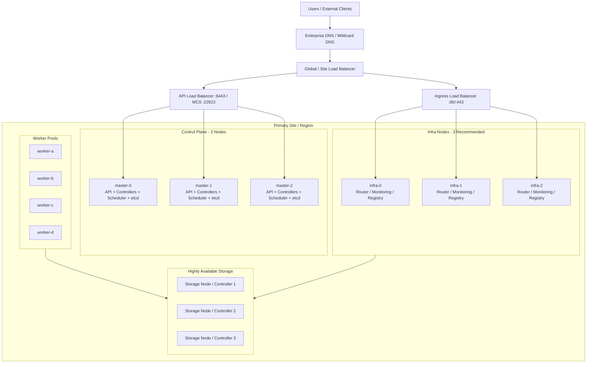
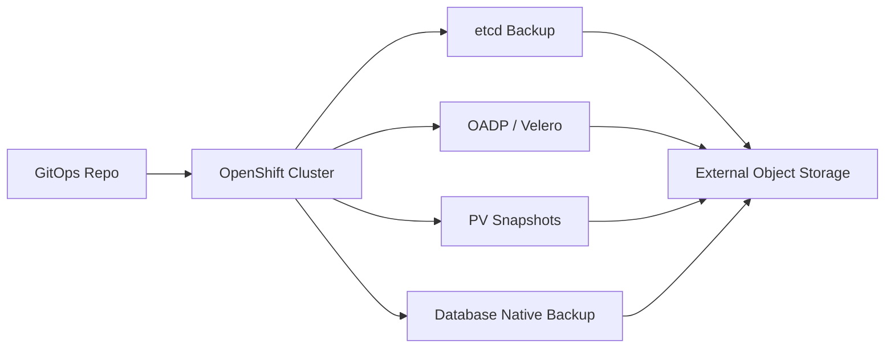

# High Availability Design in Enterprise Architecture for Advanced OpenShift Administration

**Audience:** Senior Linux/OpenShift/Kubernetes administrators, platform engineers, SREs, and enterprise architects with around 10 years of infrastructure experience.  
**Scope:** Enterprise high availability (HA) design for Red Hat OpenShift Container Platform, with practical architecture decisions, operational commands, design patterns, validation checks, and failure scenarios.  
**Primary platform focus:** OpenShift Container Platform 4.x, aligned with current OpenShift 4.21 concepts where relevant.  
**Goal:** Help you design, review, operate, and troubleshoot an HA OpenShift platform in a production enterprise environment.

---

## Table of Contents

1. [What High Availability Means in OpenShift Enterprise Architecture](#1-what-high-availability-means-in-openshift-enterprise-architecture)
2. [HA vs DR vs Fault Tolerance vs Resilience](#2-ha-vs-dr-vs-fault-tolerance-vs-resilience)
3. [Enterprise HA Design Principles](#3-enterprise-ha-design-principles)
4. [Failure Domains and Blast Radius](#4-failure-domains-and-blast-radius)
5. [Reference HA Architecture](#5-reference-ha-architecture)
6. [Control Plane HA Design](#6-control-plane-ha-design)
7. [etcd HA and Quorum Design](#7-etcd-ha-and-quorum-design)
8. [API and Machine Config Server Load Balancing](#8-api-and-machine-config-server-load-balancing)
9. [Worker Node HA Design](#9-worker-node-ha-design)
10. [Infrastructure Node HA Design](#10-infrastructure-node-ha-design)
11. [Ingress and Router HA Design](#11-ingress-and-router-ha-design)
12. [Cluster DNS, Internal Services, and Service Discovery HA](#12-cluster-dns-internal-services-and-service-discovery-ha)
13. [Network HA Design](#13-network-ha-design)
14. [Storage HA Design](#14-storage-ha-design)
15. [Application HA Design](#15-application-ha-design)
16. [Stateful Workload HA Design](#16-stateful-workload-ha-design)
17. [Scheduling, Anti-Affinity, and Topology Spread](#17-scheduling-anti-affinity-and-topology-spread)
18. [Resource Management for HA](#18-resource-management-for-ha)
19. [Autoscaling and Capacity HA](#19-autoscaling-and-capacity-ha)
20. [Pod Disruption Budgets and Maintenance HA](#20-pod-disruption-budgets-and-maintenance-ha)
21. [Machine Health Checks and Node Remediation](#21-machine-health-checks-and-node-remediation)
22. [Upgrade HA Design](#22-upgrade-ha-design)
23. [Monitoring, Alerting, and Observability for HA](#23-monitoring-alerting-and-observability-for-ha)
24. [Backup, Restore, and HA Boundaries](#24-backup-restore-and-ha-boundaries)
25. [Multi-Cluster HA Design](#25-multi-cluster-ha-design)
26. [Security Components and HA](#26-security-components-and-ha)
27. [HA Validation Commands](#27-ha-validation-commands)
28. [Failure Testing and Game Days](#28-failure-testing-and-game-days)
29. [Troubleshooting HA Incidents](#29-troubleshooting-ha-incidents)
30. [Enterprise HA Design Checklist](#30-enterprise-ha-design-checklist)
31. [Common Anti-Patterns](#31-common-anti-patterns)
32. [Interview and Architecture Review Notes](#32-interview-and-architecture-review-notes)
33. [Summary](#33-summary)
34. [References](#34-references)

---

## 1. What High Availability Means in OpenShift Enterprise Architecture

High availability design means building the OpenShift platform so that a single component failure does not cause a platform outage or application outage.

In enterprise architecture, HA is not only about running three master nodes or multiple pod replicas. It is a complete design discipline across:

- Physical or cloud infrastructure
- Network and load balancers
- DNS
- OpenShift control plane
- etcd
- Worker capacity
- Infrastructure services such as ingress, registry, monitoring, and logging
- Storage backends
- Application deployment patterns
- Maintenance and upgrade behavior
- Security and identity services
- Backup and recovery processes
- Operational readiness

A production OpenShift HA design should answer these questions clearly:

| Question | Enterprise HA Meaning |
|---|---|
| What happens if one control plane node fails? | API, scheduler, controllers, OAuth, and etcd remain healthy. |
| What happens if one worker node fails? | Application replicas reschedule or remain available on other nodes. |
| What happens if one availability zone fails? | Critical apps continue if designed for multi-zone placement and storage supports it. |
| What happens if a router pod fails? | External traffic continues through another router replica. |
| What happens if storage path fails? | Volumes remain accessible or fail over according to storage architecture. |
| What happens during cluster upgrade? | Workloads remain available because PDBs, replicas, and capacity are designed correctly. |
| What happens if the entire cluster fails? | HA stops here; disaster recovery or multi-cluster design must take over. |

A senior OpenShift administrator must understand that HA is not automatic for every workload. OpenShift provides the building blocks, but the architect must design the failure domains, replica placement, storage protection, traffic routing, and recovery operations.

---

## 2. HA vs DR vs Fault Tolerance vs Resilience

These terms are often mixed, but in enterprise architecture they mean different things.

### High Availability

HA keeps a service available during common component failures.

Examples:

- Three control plane nodes instead of one
- Multiple router replicas
- Application Deployment with three replicas
- Worker nodes distributed across racks or zones
- Load balancer health checks removing unhealthy backends

HA focuses on **continuity during expected failures**.

### Disaster Recovery

DR restores service after a larger failure where the primary environment is unavailable.

Examples:

- Restore etcd snapshot after control plane loss
- Restore applications with OADP or backup tooling
- Fail over workloads to another OpenShift cluster
- Use OpenShift Data Foundation disaster recovery or storage replication

DR focuses on **recovery after a serious outage**.

### Fault Tolerance

Fault tolerance means the system continues with near-zero interruption even while a component fails.

Examples:

- Stateless app with active-active replicas
- Load balancer removing failed pods immediately
- Storage system tolerating disk/node failure without app impact

Fault tolerance is stronger than basic HA and usually costs more.

### Resilience

Resilience is the system's ability to absorb failure, degrade gracefully, recover, and avoid repeated failure.

Examples:

- Circuit breakers in applications
- Retry with backoff
- Graceful shutdown handling
- Well-defined SLOs and alerts
- Capacity headroom
- Tested runbooks

In OpenShift, real enterprise HA requires all four thinking models: HA, DR, fault tolerance, and resilience.

---

## 3. Enterprise HA Design Principles

### 3.1 Design for Failure, Not for Normal Operation

A weak HA design looks healthy only when everything is working. A good HA design assumes failure will happen:

- One node will fail.
- One zone may fail.
- One storage path may fail.
- One router replica may crash.
- One application release may be bad.
- One certificate may expire.
- One dependency may be unavailable.

The architecture should keep critical services running when these failures occur.

### 3.2 Remove Single Points of Failure

Common OpenShift single points of failure include:

- One external load balancer without HA pair
- One DNS server
- One NTP source
- One bastion host for operations
- One storage controller
- One router pod
- One worker node for all critical apps
- One replica of a production application
- One identity provider endpoint
- One monitoring route or Alertmanager receiver

A senior admin should review every layer and ask: **If this fails, what breaks?**

### 3.3 Separate Platform HA from Application HA

OpenShift platform HA keeps the cluster functional. Application HA keeps business services functional.

For example:

- The cluster can be healthy while an application has one replica and goes down during node maintenance.
- An application can have three replicas but all on the same node because anti-affinity or topology spread was not configured.
- The platform can recover a failed pod, but if the app needs five minutes to start and has no readiness probe, users still see errors.

Therefore, HA design must cover both platform and application.

### 3.4 Use Failure Domains Explicitly

Do not rely on luck. Use labels and scheduling controls.

Examples:

```bash
oc get nodes -L topology.kubernetes.io/zone
oc get nodes -L node-role.kubernetes.io/worker
oc get nodes -L node-role.kubernetes.io/infra
```

Application pods should be distributed across nodes, racks, or zones using:

- `topologySpreadConstraints`
- pod anti-affinity
- node affinity
- machine sets per zone
- storage topology awareness

### 3.5 Keep Enough Spare Capacity

HA needs spare capacity. If the cluster runs at 95% CPU and memory utilization, it cannot tolerate node failure.

A practical enterprise rule:

- For N+1 worker HA, keep enough free capacity to lose one worker node.
- For zone HA, keep enough free capacity to lose one zone for critical workloads, or explicitly document that zone failure causes degraded service.
- For infra HA, keep enough capacity for ingress and monitoring pods to move.

### 3.6 Automate, But Keep Human Safety Gates

OpenShift supports automated node remediation with Machine Health Checks on supported platforms. Automation is useful, but unsafe remediation can make incidents worse.

For control plane health checks, remediation must be conservative. If multiple control plane nodes look unhealthy, the issue may be etcd, network, DNS, or storage. Automatic deletion of multiple control plane machines can worsen the outage.

---

## 4. Failure Domains and Blast Radius

A failure domain is a boundary where failure can occur independently.

Common failure domains:

| Failure Domain | Examples |
|---|---|
| Pod | Container crash, bad config, OOMKilled |
| Node | Hardware failure, VM failure, kubelet issue, disk full |
| Rack | Power failure, ToR switch failure |
| Availability zone | Cloud zone failure, datacenter room failure |
| Storage domain | Storage array, Ceph failure domain, SAN path failure |
| Network domain | VLAN, firewall, load balancer, router, DNS |
| Cluster | etcd quorum loss, total API failure, bad upgrade |
| Site/Region | Datacenter outage, cloud region outage |

Blast radius is the amount of damage a failure can cause.

A good OpenShift HA design reduces blast radius by:

- Spreading replicas across failure domains
- Using namespace isolation
- Using separate node pools for critical workloads
- Avoiding all critical services on one infra node
- Avoiding one cluster for every business-critical workload without DR
- Separating production and non-production where required
- Using controlled rollout strategies

---

## 5. Reference HA Architecture

The following is a common enterprise OpenShift HA model for production.



### Design Notes

- Control plane nodes should be exactly three for normal production OpenShift deployments.
- API and ingress should use highly available external load balancers.
- Worker nodes should be distributed across failure domains.
- Infrastructure components should run on dedicated infra nodes in larger production clusters.
- Storage must be designed separately; OpenShift does not magically make all persistent data highly available.
- Applications must use replicas, probes, PDBs, topology spread, and graceful shutdown.

---

## 6. Control Plane HA Design

The OpenShift control plane manages the cluster. It includes Kubernetes and OpenShift services such as:

- Kubernetes API server
- etcd
- Kubernetes controller manager
- Kubernetes scheduler
- OpenShift API server
- OpenShift controller manager
- OAuth API server
- OAuth server
- Cluster Operators

### 6.1 Production Control Plane Size

For normal production OpenShift deployments, design with **three control plane nodes**.

Why three?

- etcd needs quorum.
- Control plane components are spread across multiple nodes.
- One control plane node can fail while the cluster remains operational.
- Upgrades can reboot one control plane node at a time.

A one-node control plane is not production HA. Two control plane nodes do not provide safe quorum behavior for standard etcd-based HA. More than three control plane nodes can increase etcd complexity and latency and is not the standard production pattern for OpenShift.

### 6.2 Control Plane Failure Behavior

| Failure | Expected HA Behavior |
|---|---|
| One master node down | API remains available through remaining masters; etcd quorum remains. |
| One API server pod down | Load balancer routes to healthy API backend. |
| One scheduler/controller instance down | Leader election moves active leadership to another instance. |
| One etcd member down | etcd quorum remains with two of three members. |
| Two master nodes down | etcd quorum is lost; cluster control plane is not healthy. |
| All masters down | Cluster management unavailable; running workloads may continue temporarily but cannot be managed. |

### 6.3 Control Plane Placement

In cloud environments, distribute control plane nodes across availability zones when the platform supports it.

Example design:

| Node | Zone |
|---|---|
| master-0 | zone-a |
| master-1 | zone-b |
| master-2 | zone-c |

For bare metal or virtualization, use equivalent failure domains:

- Different physical hosts
- Different racks
- Different power feeds
- Different top-of-rack switches
- Separate storage fault domains if using virtual machines

### 6.4 Control Plane Resource Sizing

Control plane sizing depends on:

- Number of nodes
- Number of namespaces/projects
- Number of pods
- Number of routes
- Number of secrets/configmaps
- API request rate
- Operators installed
- Monitoring and metrics load
- CI/CD automation frequency

Enterprise guidance:

- Do not undersize control plane nodes.
- Keep fast disk for etcd.
- Keep low-latency network between control plane nodes.
- Avoid noisy neighbor placement in virtualization platforms.
- Avoid hosting unrelated workloads on control plane nodes.

### 6.5 Control Plane Operational Rules

A senior admin should follow these rules:

- Never reboot all control plane nodes together.
- Never drain all control plane nodes together.
- During upgrades, keep `maxUnavailable` conservative for control plane machine config pool.
- Keep etcd backups before upgrades and major changes.
- Monitor etcd latency, API latency, and ClusterOperator health.
- Treat control plane DNS, certificates, and load balancer health as critical dependencies.

### 6.6 Control Plane Health Commands

```bash
# Cluster version and operator health
oc get clusterversion
oc get clusteroperators

# Nodes and roles
oc get nodes -o wide
oc get nodes -L node-role.kubernetes.io/master,node-role.kubernetes.io/worker

# Control plane pods
oc get pods -n openshift-kube-apiserver -o wide
oc get pods -n openshift-kube-controller-manager -o wide
oc get pods -n openshift-kube-scheduler -o wide
oc get pods -n openshift-etcd -o wide
oc get pods -n openshift-authentication -o wide

# API readiness
oc get --raw='/readyz?verbose'
oc get --raw='/livez?verbose'

# Cluster events
oc get events -A --sort-by='.lastTimestamp' | tail -50
```

---

## 7. etcd HA and Quorum Design

etcd is the persistent key-value store for OpenShift control plane state. Almost every cluster object state is stored in etcd.

Examples of objects stored in etcd:

- Namespaces/projects
- Deployments
- Services
- Routes
- Secrets
- ConfigMaps
- RBAC objects
- Operators' custom resources
- Node and pod metadata

### 7.1 etcd Quorum Basics

In a three-member etcd cluster:

- Majority/quorum = 2
- One member can fail
- Two members failing means quorum is lost

| etcd Members Healthy | Quorum? | Cluster State |
|---|---:|---|
| 3/3 | Yes | Healthy |
| 2/3 | Yes | Degraded but operational |
| 1/3 | No | Control plane unavailable |
| 0/3 | No | Control plane unavailable |

### 7.2 Why etcd Latency Matters

etcd is latency-sensitive. High disk latency or network latency can cause:

- Slow API responses
- Operator degradation
- Leader changes
- Failed writes
- Cluster instability
- Upgrade failures

Design requirements:

- Use fast, reliable storage for control plane disks.
- Avoid oversubscribed virtualization storage.
- Keep control plane nodes close from a latency perspective.
- Do not stretch a single etcd cluster across distant datacenters unless the platform-specific guidance explicitly supports the design and latency is validated.

### 7.3 etcd Backup Strategy

etcd backup is not application backup; it is cluster control plane state backup.

Important principles:

- Back up etcd regularly.
- Store backups outside the OpenShift cluster.
- Encrypt and protect backup access.
- Take an etcd backup before upgrades and risky administrative changes.
- Do not take separate backups from every master as a routine backup strategy; use the supported backup method from one control plane host.
- Ensure the backup version matches restore requirements.

Example backup process pattern:

```bash
# SSH to one control plane node, then run the cluster-backup script.
# Exact path and procedure must follow your OpenShift version documentation.

sudo -i
/usr/local/bin/cluster-backup.sh /home/core/assets/backup
```

After backup:

```bash
ls -lh /home/core/assets/backup
```

You should normally see:

- etcd snapshot database
- static pod resource archive

### 7.4 etcd Restore Boundary

Restoring etcd restores cluster object state. It does **not** automatically restore external persistent volumes, external databases, object storage, or application data stored outside etcd.

Example:

If a MySQL pod uses a PV and the PV storage is deleted, restoring etcd may bring back the PVC/PV object metadata, but the actual storage backend data must be restored separately.

### 7.5 etcd HA Checklist

- [ ] Three healthy control plane nodes
- [ ] etcd pods spread across control plane nodes
- [ ] Low disk latency
- [ ] Low network latency
- [ ] Regular etcd backups
- [ ] Backup stored outside cluster
- [ ] Restore procedure tested
- [ ] etcd alerts monitored
- [ ] No unsupported stretched topology

---

## 8. API and Machine Config Server Load Balancing

The OpenShift API is the main control endpoint. The Machine Config Server (MCS) is used by nodes for ignition and machine configuration access.

### 8.1 Required Load Balancer Endpoints

Typical enterprise OpenShift load balancing includes:

| Endpoint | Port | Purpose | Backend |
|---|---:|---|---|
| `api.<cluster>.<domain>` | 6443 | OpenShift/Kubernetes API | Control plane nodes |
| Machine Config Server | 22623 | Ignition/startup config for nodes | Control plane nodes |
| `*.apps.<cluster>.<domain>` | 80/443 | Application ingress | Router/ingress nodes |

### 8.2 API Load Balancer HA

The API load balancer must itself be highly available.

Good designs:

- Cloud provider managed load balancer
- F5/AVI/HAProxy pair with VRRP/keepalived
- Redundant appliance pair
- MetalLB where appropriate for bare metal ingress/service exposure, depending on architecture

Bad designs:

- One HAProxy VM with no failover
- One DNS A record pointing to one master
- One firewall NAT rule without HA
- Manual failover only

### 8.3 Health Checks

Use health checks that reflect actual service health.

Examples:

```bash
# API health check from a client/network location
curl -k https://api.ocp4.example.com:6443/readyz

# Machine Config Server check from node networks where applicable
curl -k https://api-int.ocp4.example.com:22623/healthz
```

For ingress/router health checks, use router health endpoint where supported by your load balancer configuration, commonly involving the router stats/health endpoint on the backend.

### 8.4 API Load Balancer Design Table

| Design Item | Recommendation |
|---|---|
| API frontend | Highly available VIP or managed LB |
| API port | 6443 |
| MCS port | 22623; restrict to internal/node networks |
| Backends | Three control plane nodes |
| Health checks | `/readyz` for API, supported health URL for MCS/router |
| Timeout | Avoid aggressive timeout that removes healthy nodes during brief load |
| TLS | Usually pass-through for API; do not break cluster certificates unexpectedly |
| DNS | Stable records for `api` and `api-int` |

---

## 9. Worker Node HA Design

Worker nodes run application workloads. A highly available control plane does not guarantee application availability if worker design is weak.

### 9.1 Minimum Worker Strategy

For production application HA, design at least:

- Three worker nodes for general workloads
- More nodes for larger clusters
- Separate node pools for workload types when needed

Why three?

- Enables pod spreading
- Tolerates one worker failure
- Allows maintenance while keeping replicas available
- Supports quorum-like app patterns if required by middleware

### 9.2 Worker Node Failure Behavior

| Failure | Expected Behavior |
|---|---|
| One worker node fails | Pods on that node reschedule if managed by controllers and capacity exists. |
| One worker is drained | PDBs protect minimum availability; pods move gracefully. |
| One worker has disk pressure | Scheduler avoids or evicts according to pressure rules. |
| One zone of workers fails | Apps remain available only if replicas, capacity, and storage are zone-aware. |

### 9.3 MachineSet Distribution

On cloud platforms, create or use compute MachineSets per zone.

Example pattern:

```bash
oc get machinesets -n openshift-machine-api
```

Expected style:

```text
prod-worker-us-east-1a
prod-worker-us-east-1b
prod-worker-us-east-1c
```

Scale each zone intentionally:

```bash
oc scale machineset prod-worker-us-east-1a -n openshift-machine-api --replicas=3
oc scale machineset prod-worker-us-east-1b -n openshift-machine-api --replicas=3
oc scale machineset prod-worker-us-east-1c -n openshift-machine-api --replicas=3
```

### 9.4 Worker Pool Segmentation

Common enterprise node pools:

| Pool | Purpose |
|---|---|
| worker-general | Normal stateless applications |
| worker-stateful | Databases, middleware, queue systems |
| worker-gpu | GPU workloads |
| worker-build | CI/CD builds |
| infra | Routers, registry, monitoring, logging |
| dedicated-regulated | High compliance workloads |

Use labels and taints to isolate workloads:

```bash
oc label node worker-01 node-role.kubernetes.io/app=""
oc adm taint nodes worker-01 dedicated=payments:NoSchedule
```

Pod toleration example:

```yaml
tolerations:
- key: "dedicated"
  operator: "Equal"
  value: "payments"
  effect: "NoSchedule"
```

### 9.5 Worker HA Checklist

- [ ] Minimum three workers for production apps
- [ ] Workers spread across failure domains
- [ ] MachineSets per zone where available
- [ ] Enough spare capacity after one node failure
- [ ] MachineHealthChecks configured on supported platforms
- [ ] Application replicas spread across workers
- [ ] Node labels/taints documented
- [ ] Critical apps not concentrated on one node

---

## 10. Infrastructure Node HA Design

Infrastructure nodes host platform services that are not business applications but are critical for cluster operations.

Typical infra workloads:

- Ingress/router pods
- Image registry
- Monitoring stack
- Alertmanager
- Logging/observability components
- Some security or service mesh components, depending on design

### 10.1 Why Dedicated Infra Nodes?

Dedicated infra nodes help by:

- Isolating platform services from application workload spikes
- Protecting ingress and monitoring capacity
- Simplifying chargeback and subscriptions where applicable
- Improving operational predictability
- Reducing blast radius of noisy applications

### 10.2 Infra Node Count

For production enterprise clusters, three infra nodes are commonly recommended for HA design.

Minimum practical patterns:

| Cluster Type | Infra Node Pattern |
|---|---|
| Small non-prod | May run infra on workers if documented |
| Medium production | 3 infra nodes |
| Large production | 3+ infra nodes sized by metrics, route count, and traffic |
| Multi-zone production | Infra nodes spread across zones |

### 10.3 Moving Routers to Infra Nodes

Example node selector design:

```bash
oc label node infra-0 node-role.kubernetes.io/infra=""
oc label node infra-1 node-role.kubernetes.io/infra=""
oc label node infra-2 node-role.kubernetes.io/infra=""
```

IngressController placement example:

```yaml
apiVersion: operator.openshift.io/v1
kind: IngressController
metadata:
  name: default
  namespace: openshift-ingress-operator
spec:
  replicas: 3
  nodePlacement:
    nodeSelector:
      matchLabels:
        node-role.kubernetes.io/infra: ""
    tolerations:
    - key: node-role.kubernetes.io/infra
      operator: Exists
      effect: NoSchedule
```

### 10.4 Monitoring Placement Example

```yaml
apiVersion: v1
kind: ConfigMap
metadata:
  name: cluster-monitoring-config
  namespace: openshift-monitoring
data:
  config.yaml: |
    prometheusK8s:
      nodeSelector:
        node-role.kubernetes.io/infra: ""
      tolerations:
      - key: node-role.kubernetes.io/infra
        operator: Exists
        effect: NoSchedule
    alertmanagerMain:
      nodeSelector:
        node-role.kubernetes.io/infra: ""
      tolerations:
      - key: node-role.kubernetes.io/infra
        operator: Exists
        effect: NoSchedule
```

### 10.5 Infra HA Checklist

- [ ] Three infra nodes for production
- [ ] Infra nodes spread across failure domains
- [ ] Routers have multiple replicas
- [ ] Monitoring has persistent storage and enough memory
- [ ] Registry backend storage is HA
- [ ] Infra workloads tolerate infra taints
- [ ] External load balancer points only to router-capable nodes
- [ ] Infra node capacity includes failover headroom

---

## 11. Ingress and Router HA Design

Ingress is the entry point for application traffic. If ingress is weak, all applications can appear down even when pods are healthy.

### 11.1 Ingress Components

OpenShift application ingress commonly includes:

- External DNS wildcard, such as `*.apps.ocp4.example.com`
- External load balancer
- IngressController
- Router pods in `openshift-ingress`
- Routes created by applications
- Services and endpoints behind routes

### 11.2 Router Replica Design

For production:

- Use at least two router replicas.
- Use three replicas when using three infra nodes.
- Spread router replicas across nodes/zones.
- Ensure load balancer health checks remove failed router backends.

Check current IngressController:

```bash
oc get ingresscontroller -n openshift-ingress-operator
oc describe ingresscontroller default -n openshift-ingress-operator
oc get pods -n openshift-ingress -o wide
```

Patch replicas:

```bash
oc patch ingresscontroller default \
  -n openshift-ingress-operator \
  --type=merge \
  -p '{"spec":{"replicas":3}}'
```

### 11.3 Ingress Load Balancer Backend Selection

If routers run on infra nodes, the external ingress load balancer should send traffic only to infra nodes running router pods.

Ports:

| Port | Purpose |
|---:|---|
| 80 | HTTP routes |
| 443 | HTTPS routes |
| 1936 | Router stats/health endpoint, depending on configuration |

### 11.4 Route-Level HA

A route is only as available as the backend service and pods.

Check route to service to endpoints:

```bash
oc get route -n myapp
oc get svc -n myapp
oc get endpoints -n myapp
oc get pods -n myapp -o wide
```

If `endpoints` is empty, the route exists but no ready pod is backing it.

### 11.5 Ingress Failure Scenarios

| Failure | Good HA Result |
|---|---|
| One router pod crashes | LB sends traffic to remaining router pods. |
| One infra node fails | Router pod reschedules or other replicas serve traffic. |
| One route backend pod fails | Service endpoints remove unready pod. |
| One zone fails | Traffic continues if router and app replicas exist in other zones. |
| Wildcard DNS fails | All route access can fail; DNS must be HA. |
| External LB fails | All app access can fail; LB must be HA. |

---

## 12. Cluster DNS, Internal Services, and Service Discovery HA

DNS and service discovery are often ignored until incidents happen.

### 12.1 OpenShift DNS

OpenShift DNS provides internal service name resolution, such as:

```text
myservice.myproject.svc.cluster.local
```

Check DNS pods:

```bash
oc get pods -n openshift-dns -o wide
oc get daemonset -n openshift-dns
```

DNS usually runs as a DaemonSet so nodes have local DNS availability.

### 12.2 External DNS HA

External DNS is required for:

- `api.<cluster>.<domain>`
- `api-int.<cluster>.<domain>`
- `*.apps.<cluster>.<domain>`
- Custom application hostnames

Enterprise DNS HA requirements:

- At least two DNS servers
- Proper TTL design
- DNS records documented
- Wildcard DNS tested
- Internal and external split-horizon behavior understood

### 12.3 Service Discovery Checklist

- [ ] CoreDNS/OpenShift DNS pods healthy
- [ ] Internal service DNS works from pods
- [ ] External wildcard DNS resolves correctly
- [ ] API DNS resolves from admin clients and nodes
- [ ] DNS TTL does not prevent failover
- [ ] DNS servers are redundant

Test from a debug pod:

```bash
oc run dns-test -it --rm --image=registry.access.redhat.com/ubi9/ubi -- bash

# Inside pod:
curl -I http://myservice.myproject.svc.cluster.local:8080
getent hosts kubernetes.default.svc.cluster.local
```

---

## 13. Network HA Design

Network HA covers both underlay and overlay networking.

### 13.1 Underlay Network

Underlay is the physical/cloud network below OpenShift.

Enterprise checks:

- Redundant NICs or cloud network paths
- Redundant switches
- Correct MTU end-to-end
- Stable routing
- Firewall rules for cluster ports
- Load balancer reachability
- DNS and NTP reachability
- No asymmetric routing surprises

### 13.2 Overlay Network

OpenShift uses a cluster network plugin such as OVN-Kubernetes in modern releases.

Overlay network HA depends on:

- Node health
- CNI daemon health
- MTU correctness
- Kubernetes service routing
- Network policy correctness
- DNS availability

Check network operator:

```bash
oc get co network
oc get pods -n openshift-ovn-kubernetes -o wide
oc get network.operator cluster -o yaml
```

### 13.3 NetworkPolicy and HA

NetworkPolicy is a security control, but it can cause availability incidents if designed incorrectly.

Common issue:

- App is healthy.
- Service endpoint exists.
- Route works at ingress.
- Backend cannot reach database due to NetworkPolicy.

Validate allowed paths:

```bash
oc get networkpolicy -A
oc describe networkpolicy -n database
```

Use temporary debug pods carefully:

```bash
oc run net-test -n frontend -it --rm --image=registry.access.redhat.com/ubi9/ubi -- bash
```

### 13.4 Egress HA

For applications that call external services, design egress availability:

- Redundant firewall/NAT
- Egress IP HA, where used
- Proxy HA
- External DNS HA
- Allowlist both primary and failover egress paths

### 13.5 Network HA Checklist

- [ ] API reachable through HA LB
- [ ] Ingress reachable through HA LB
- [ ] Node-to-node network stable
- [ ] MTU validated
- [ ] Network Operator healthy
- [ ] DNS healthy
- [ ] NetworkPolicies tested
- [ ] Egress dependencies redundant
- [ ] Firewall changes controlled and documented

---

## 14. Storage HA Design

Storage is one of the most important HA topics because many applications are stateful.

OpenShift can orchestrate persistent volumes, but the storage backend provides the actual data availability.

### 14.1 Storage Questions for Architecture Review

Ask these before approving production workloads:

1. Is the storage backend highly available?
2. What failure domains does it tolerate?
3. Does it support the required access mode: RWO, RWX, or ROX?
4. Is storage topology-aware?
5. What happens if a node fails while a volume is attached?
6. What happens if a zone fails?
7. Is data replicated synchronously or asynchronously?
8. What is the RPO?
9. How are snapshots taken?
10. How is restore tested?

### 14.2 Access Modes and HA Implications

| Access Mode | Meaning | HA Concern |
|---|---|---|
| RWO | ReadWriteOnce | Usually attached to one node at a time; failover may require detach/attach. |
| RWX | ReadWriteMany | Multiple pods/nodes can mount; backend must support it. |
| ROX | ReadOnlyMany | Multiple readers; useful for shared static data. |

### 14.3 Dynamic Provisioning

StorageClass controls dynamic volume provisioning.

Check storage classes:

```bash
oc get storageclass
oc describe storageclass <name>
```

Important StorageClass fields:

- `provisioner`
- `reclaimPolicy`
- `volumeBindingMode`
- `allowVolumeExpansion`
- parameters specific to storage provider

### 14.4 WaitForFirstConsumer

`WaitForFirstConsumer` delays volume binding until a pod is scheduled. This helps topology-aware provisioning because the scheduler can consider node/zone placement before creating or binding the volume.

Check:

```bash
oc get sc -o yaml | grep -A5 volumeBindingMode
```

### 14.5 OpenShift Data Foundation HA Concept

OpenShift Data Foundation, based on Ceph technologies, can provide storage HA when designed correctly.

Typical enterprise considerations:

- Minimum node count for storage cluster
- Failure domain configuration
- Disk type and performance
- Network bandwidth
- Separate storage network if required
- Capacity headroom
- Recovery time during disk/node failure
- Monitoring of Ceph health

Check ODF health if installed:

```bash
oc get pods -n openshift-storage -o wide
oc get cephcluster -n openshift-storage
oc get storagecluster -n openshift-storage
```

### 14.6 Storage Failure Scenarios

| Failure | Expected Design Response |
|---|---|
| Worker node fails with RWO volume | Pod reschedules after volume detach/attach if backend supports it. |
| Storage node fails | Replicated storage keeps data available if within failure tolerance. |
| Zone fails | App availability depends on storage replication and volume topology. |
| PVC deleted | Reclaim policy and backup determine recovery. |
| Backend storage corrupts data | HA may not help; backup/restore needed. |

### 14.7 Storage HA Checklist

- [ ] Storage backend itself is HA
- [ ] Failure domain defined
- [ ] StorageClass documented
- [ ] Access modes match application architecture
- [ ] Volume snapshots configured where required
- [ ] Backup tested
- [ ] Restore tested
- [ ] Performance tested
- [ ] Capacity alerts configured
- [ ] Stateful workloads have documented failover behavior

---

## 15. Application HA Design

Application HA is where many OpenShift projects fail. The platform may be HA, but the application is deployed like a single VM.

### 15.1 Stateless Application HA

A stateless app is easiest to make HA.

Minimum design:

- Deployment with at least two replicas, preferably three for production
- Readiness probe
- Liveness probe
- Resource requests and limits
- Rolling update strategy
- PodDisruptionBudget
- Topology spread constraints
- External dependencies redundant

Example:

```yaml
apiVersion: apps/v1
kind: Deployment
metadata:
  name: webapp
  namespace: prod-web
spec:
  replicas: 3
  strategy:
    type: RollingUpdate
    rollingUpdate:
      maxUnavailable: 1
      maxSurge: 1
  selector:
    matchLabels:
      app: webapp
  template:
    metadata:
      labels:
        app: webapp
    spec:
      terminationGracePeriodSeconds: 30
      topologySpreadConstraints:
      - maxSkew: 1
        topologyKey: kubernetes.io/hostname
        whenUnsatisfiable: ScheduleAnyway
        labelSelector:
          matchLabels:
            app: webapp
      containers:
      - name: webapp
        image: quay.io/example/webapp:1.0
        ports:
        - containerPort: 8080
        resources:
          requests:
            cpu: 100m
            memory: 256Mi
          limits:
            cpu: 500m
            memory: 512Mi
        readinessProbe:
          httpGet:
            path: /ready
            port: 8080
          initialDelaySeconds: 10
          periodSeconds: 5
          timeoutSeconds: 2
          failureThreshold: 3
        livenessProbe:
          httpGet:
            path: /health
            port: 8080
          initialDelaySeconds: 30
          periodSeconds: 10
          timeoutSeconds: 2
          failureThreshold: 3
```

Service:

```yaml
apiVersion: v1
kind: Service
metadata:
  name: webapp
  namespace: prod-web
spec:
  selector:
    app: webapp
  ports:
  - name: http
    port: 8080
    targetPort: 8080
```

Route:

```yaml
apiVersion: route.openshift.io/v1
kind: Route
metadata:
  name: webapp
  namespace: prod-web
spec:
  host: webapp.apps.ocp4.example.com
  to:
    kind: Service
    name: webapp
  port:
    targetPort: http
  tls:
    termination: edge
```

### 15.2 Readiness vs Liveness

Readiness probe answers: **Should this pod receive traffic?**

Liveness probe answers: **Should kubelet restart this container?**

Wrong design:

- Liveness probe checks a dependency database.
- Database is briefly slow.
- All app containers restart.
- Outage becomes worse.

Better design:

- Readiness checks dependency availability if needed.
- Liveness checks only whether the process is stuck beyond recovery.
- Startup probe is used for slow-starting apps.

### 15.3 Graceful Shutdown

During node drain or rolling update, OpenShift sends SIGTERM to the container. The application should:

1. Stop accepting new requests.
2. Complete in-flight requests.
3. Close database connections cleanly.
4. Exit before `terminationGracePeriodSeconds` expires.

Use `preStop` hook if required:

```yaml
lifecycle:
  preStop:
    exec:
      command: ["/bin/sh", "-c", "sleep 10"]
```

### 15.4 Application HA Checklist

- [ ] Minimum two or three replicas
- [ ] Readiness probe configured
- [ ] Liveness probe configured carefully
- [ ] Startup probe for slow apps
- [ ] Resource requests set
- [ ] Rolling update strategy safe
- [ ] PDB configured
- [ ] Pods spread across nodes/zones
- [ ] External dependencies redundant
- [ ] App supports graceful shutdown
- [ ] Logs and metrics available

---

## 16. Stateful Workload HA Design

Stateful workloads need extra care. A database with three pods is not automatically HA unless the database replication and storage model are correct.

Examples of stateful workloads:

- PostgreSQL
- MySQL
- MongoDB
- Kafka
- Redis
- Elasticsearch/OpenSearch
- RabbitMQ
- Keycloak
- Quay
- GitLab

### 16.1 StatefulSet vs Deployment

Use StatefulSet when the app needs:

- Stable pod identity
- Stable network identity
- Ordered startup/shutdown
- Persistent volume per replica

Example:

```text
postgres-0
postgres-1
postgres-2
```

### 16.2 Stateful HA Requirements

For stateful HA, verify:

- Application-level replication
- Leader election or primary/replica behavior
- Data consistency model
- Storage replication
- Backup and point-in-time recovery
- Quorum rules
- Anti-affinity across nodes/zones
- PDB that does not break quorum

### 16.3 StatefulSet Anti-Affinity Example

```yaml
affinity:
  podAntiAffinity:
    requiredDuringSchedulingIgnoredDuringExecution:
    - labelSelector:
        matchLabels:
          app: postgres
      topologyKey: kubernetes.io/hostname
```

### 16.4 Stateful Workload PDB Example

For a three-node quorum-based app:

```yaml
apiVersion: policy/v1
kind: PodDisruptionBudget
metadata:
  name: postgres-pdb
  namespace: prod-db
spec:
  minAvailable: 2
  selector:
    matchLabels:
      app: postgres
```

### 16.5 Stateful HA Questions

Before production approval, answer:

- Can the app survive one pod failure?
- Can it survive one node failure?
- Can it survive one zone failure?
- What happens during node drain?
- What happens during storage detach delay?
- What is the backup interval?
- What is the tested restore time?
- Does failover require manual action?
- How is split-brain prevented?

---

## 17. Scheduling, Anti-Affinity, and Topology Spread

Scheduling controls decide where pods run. Without them, replicas may land in the same failure domain.

### 17.1 Pod Anti-Affinity

Hard anti-affinity prevents matching pods from co-locating on the same topology domain.

```yaml
affinity:
  podAntiAffinity:
    requiredDuringSchedulingIgnoredDuringExecution:
    - labelSelector:
        matchExpressions:
        - key: app
          operator: In
          values:
          - webapp
      topologyKey: kubernetes.io/hostname
```

Use hard anti-affinity carefully. If there are not enough nodes, pods may remain Pending.

### 17.2 Preferred Anti-Affinity

Preferred anti-affinity gives the scheduler flexibility.

```yaml
affinity:
  podAntiAffinity:
    preferredDuringSchedulingIgnoredDuringExecution:
    - weight: 100
      podAffinityTerm:
        labelSelector:
          matchLabels:
            app: webapp
        topologyKey: kubernetes.io/hostname
```

### 17.3 Topology Spread Constraints

Topology spread is often better for enterprise HA because it provides controlled distribution.

```yaml
topologySpreadConstraints:
- maxSkew: 1
  topologyKey: topology.kubernetes.io/zone
  whenUnsatisfiable: ScheduleAnyway
  labelSelector:
    matchLabels:
      app: webapp
- maxSkew: 1
  topologyKey: kubernetes.io/hostname
  whenUnsatisfiable: ScheduleAnyway
  labelSelector:
    matchLabels:
      app: webapp
```

Use `DoNotSchedule` for strict HA only when capacity is guaranteed:

```yaml
whenUnsatisfiable: DoNotSchedule
```

### 17.4 Node Affinity

Use node affinity to target specific node pools.

```yaml
affinity:
  nodeAffinity:
    requiredDuringSchedulingIgnoredDuringExecution:
      nodeSelectorTerms:
      - matchExpressions:
        - key: node-role.kubernetes.io/app
          operator: Exists
```

### 17.5 Taints and Tolerations

Taints repel pods. Tolerations allow pods onto tainted nodes.

Infra node example:

```bash
oc adm taint nodes infra-0 node-role.kubernetes.io/infra=:NoSchedule
```

Pod toleration:

```yaml
tolerations:
- key: node-role.kubernetes.io/infra
  operator: Exists
  effect: NoSchedule
```

---

## 18. Resource Management for HA

HA requires predictable scheduling and runtime behavior. Resource requests and limits are critical.

### 18.1 Requests

Requests are used by the scheduler. If you do not set requests, OpenShift cannot accurately place workloads.

Example:

```yaml
resources:
  requests:
    cpu: 200m
    memory: 512Mi
  limits:
    cpu: 1
    memory: 1Gi
```

### 18.2 Limits

Limits protect nodes from noisy workloads but can also cause throttling or OOM kills.

CPU limits can cause throttling. Memory limits can cause OOMKilled.

### 18.3 Quotas and LimitRanges

At namespace level:

- `ResourceQuota` prevents teams from consuming all cluster resources.
- `LimitRange` applies default requests/limits and min/max constraints.

Example ResourceQuota:

```yaml
apiVersion: v1
kind: ResourceQuota
metadata:
  name: prod-quota
  namespace: prod-web
spec:
  hard:
    requests.cpu: "20"
    requests.memory: 40Gi
    limits.cpu: "40"
    limits.memory: 80Gi
    pods: "100"
```

Example LimitRange:

```yaml
apiVersion: v1
kind: LimitRange
metadata:
  name: default-limits
  namespace: prod-web
spec:
  limits:
  - type: Container
    defaultRequest:
      cpu: 100m
      memory: 256Mi
    default:
      cpu: 500m
      memory: 512Mi
```

### 18.4 HA Capacity Rule

For each critical namespace, calculate:

```text
Required HA Capacity = Normal Peak Load + Failure Headroom + Upgrade Headroom
```

Do not plan only for average usage.

---

## 19. Autoscaling and Capacity HA

Autoscaling improves availability during load spikes, but it must be designed carefully.

### 19.1 Horizontal Pod Autoscaler

HPA scales pods based on metrics such as CPU, memory, or custom metrics.

Example:

```yaml
apiVersion: autoscaling/v2
kind: HorizontalPodAutoscaler
metadata:
  name: webapp-hpa
  namespace: prod-web
spec:
  scaleTargetRef:
    apiVersion: apps/v1
    kind: Deployment
    name: webapp
  minReplicas: 3
  maxReplicas: 10
  metrics:
  - type: Resource
    resource:
      name: cpu
      target:
        type: Utilization
        averageUtilization: 60
```

Important:

- Set requests; HPA CPU utilization depends on requests.
- Set `minReplicas` high enough for HA.
- Ensure cluster has capacity for `maxReplicas`.
- Monitor scaling behavior.

### 19.2 Cluster Autoscaler

Cluster Autoscaler adds/removes worker nodes on supported platforms.

HA considerations:

- Do not depend on autoscaler for immediate failover; node provisioning takes time.
- Keep spare capacity for instant HA.
- Use autoscaler for sustained load, not only failure capacity.
- Ensure MachineSets exist across zones.

### 19.3 Overprovisioning

A common SRE technique is low-priority pause pods to reserve capacity. During real workload pressure, high-priority pods preempt them.

This is advanced and should be used carefully with PriorityClasses.

### 19.4 Capacity HA Checklist

- [ ] Requests and limits configured
- [ ] HPA min replicas support HA
- [ ] Cluster capacity supports failover
- [ ] Autoscaler tested
- [ ] Quotas do not block scaling
- [ ] PDB does not block node drain forever
- [ ] Monitoring alerts before saturation

---

## 20. Pod Disruption Budgets and Maintenance HA

A PodDisruptionBudget (PDB) protects applications during voluntary disruptions, such as:

- Node drain
- Cluster upgrade
- MachineConfigPool update
- Admin pod eviction
- Planned maintenance

### 20.1 PDB Example for Stateless App

For three replicas, allow one unavailable:

```yaml
apiVersion: policy/v1
kind: PodDisruptionBudget
metadata:
  name: webapp-pdb
  namespace: prod-web
spec:
  minAvailable: 2
  selector:
    matchLabels:
      app: webapp
```

Alternative:

```yaml
spec:
  maxUnavailable: 1
```

### 20.2 Bad PDB Example

For one replica:

```yaml
minAvailable: 1
```

This prevents voluntary eviction, so node drain can hang. If the app has only one replica, it is not HA anyway.

### 20.3 PDB and Upgrades

During cluster upgrades, OpenShift drains/reboots nodes according to machine config pool behavior. PDBs help keep applications available, but poor PDBs can block maintenance.

Good pattern:

- App has 3 replicas.
- PDB minAvailable 2.
- Pods spread across nodes.
- Cluster has spare capacity.

Bad pattern:

- App has 2 replicas.
- Both pods on same node.
- PDB minAvailable 2.
- Drain cannot proceed.

### 20.4 PDB Validation Commands

```bash
oc get pdb -A
oc describe pdb webapp-pdb -n prod-web
oc get pods -n prod-web -l app=webapp -o wide
```

During drain testing:

```bash
oc adm drain <node> --ignore-daemonsets --delete-emptydir-data --dry-run=server
```

---

## 21. Machine Health Checks and Node Remediation

MachineHealthCheck (MHC) helps automatically remediate unhealthy machines on supported platforms.

### 21.1 What MHC Does

MHC watches machine/node health conditions. If a machine is unhealthy for the configured timeout, the controller remediates it, typically by deleting and replacing the machine. On bare metal, power-based remediation can be used depending on configuration.

### 21.2 Worker MHC Example

```yaml
apiVersion: machine.openshift.io/v1beta1
kind: MachineHealthCheck
metadata:
  name: worker-healthcheck
  namespace: openshift-machine-api
spec:
  selector:
    matchLabels:
      machine.openshift.io/cluster-api-machine-role: worker
      machine.openshift.io/cluster-api-machine-type: worker
  unhealthyConditions:
  - type: Ready
    status: "False"
    timeout: 300s
  - type: Ready
    status: "Unknown"
    timeout: 300s
  maxUnhealthy: "40%"
  nodeStartupTimeout: 10m
```

### 21.3 Control Plane MHC Caution

If you configure MHC for control plane machines, use conservative limits. For control plane, `maxUnhealthy: 1` is the safe design pattern because multiple unhealthy masters may indicate a deeper etcd or network issue.

### 21.4 MHC Validation

```bash
oc get machinehealthcheck -n openshift-machine-api
oc describe machinehealthcheck -n openshift-machine-api
oc get machines -n openshift-machine-api
oc get nodes
```

### 21.5 When Not to Use Aggressive Remediation

Avoid aggressive remediation when:

- Network is unstable
- Storage is unstable
- Many nodes show NotReady together
- etcd is degraded
- Cloud API is rate-limited
- Bare metal BMC credentials are unreliable
- Workload disruption tolerance is low

Automation should help recovery, not amplify incidents.

---

## 22. Upgrade HA Design

OpenShift upgrades are designed to be rolling, but application availability depends on architecture.

### 22.1 Upgrade Readiness

Before upgrade:

```bash
oc get clusterversion
oc adm upgrade
oc get co
oc get mcp
oc get nodes
oc get pdb -A
oc adm top nodes
oc adm top pods -A
```

Take etcd backup before upgrade.

### 22.2 MachineConfigPool Behavior

Machine Config Operator applies new configuration and reboots nodes according to `maxUnavailable`. The conservative production pattern is one node unavailable at a time for critical pools, especially control plane.

Check MCP:

```bash
oc get mcp
oc describe mcp master
oc describe mcp worker
```

### 22.3 Application Upgrade Safety

During cluster upgrade:

- PDBs must allow node drain.
- Replicas must be spread across nodes.
- Apps must have readiness probes.
- Apps must tolerate pod restart.
- Stateful apps must maintain quorum.
- Capacity must absorb evicted pods.

### 22.4 Upgrade HA Checklist

- [ ] Cluster Operators healthy
- [ ] No degraded MCPs
- [ ] Nodes Ready
- [ ] etcd backup taken
- [ ] PDBs reviewed
- [ ] Critical app replicas spread
- [ ] Monitoring watched during upgrade
- [ ] Rollback expectations understood; OpenShift cluster version rollback is not a normal supported operation

---

## 23. Monitoring, Alerting, and Observability for HA

HA without monitoring is guesswork.

### 23.1 Platform Signals

Monitor:

- ClusterOperator health
- Node Ready status
- etcd health and latency
- API server latency and errors
- Ingress/router availability
- DNS errors
- MachineConfigPool updating/degraded state
- Pod crash loops
- Persistent volume errors
- Storage cluster health
- Network plugin health

Commands:

```bash
oc get co
oc get nodes
oc get mcp
oc get pods -A | egrep 'CrashLoopBackOff|Error|Pending|ImagePullBackOff'
oc get events -A --sort-by='.lastTimestamp' | tail -100
```

### 23.2 Application Signals

Monitor:

- Request latency
- HTTP 5xx rate
- Error rate
- Saturation
- Pod restarts
- HPA scaling
- Queue depth
- Database connections
- Business transaction success rate

### 23.3 Alert Quality

Bad alert:

```text
Pod restarted once.
```

Better alert:

```text
Payment API has >2% 5xx for 5 minutes and available replicas below 2.
```

Alert design should focus on user impact and leading indicators.

### 23.4 Useful OpenShift Checks

```bash
# Cluster health summary
oc get co | grep -v 'True        False         False'

# Unhealthy pods
oc get pods -A --field-selector=status.phase!=Running,status.phase!=Succeeded

# Node pressure
oc describe node <node> | egrep -i 'Pressure|Ready|Allocatable|Allocated'

# Router pods
oc get pods -n openshift-ingress -o wide

# DNS pods
oc get pods -n openshift-dns -o wide

# etcd member pods
oc get pods -n openshift-etcd -o wide
```

---

## 24. Backup, Restore, and HA Boundaries

HA does not replace backup. Backup does not replace HA.

### 24.1 What etcd Backup Protects

etcd backup protects cluster state:

- Kubernetes/OpenShift objects
- RBAC
- namespace metadata
- routes/services/deployments
- secrets/configmaps stored in etcd
- operator custom resources

### 24.2 What etcd Backup Does Not Fully Protect

- PV data on storage backend
- External database data
- Object storage buckets
- External identity provider
- External DNS records
- External load balancer configuration
- Git repositories
- CI/CD systems

### 24.3 Application Backup

Use application-aware backup for:

- Databases
- Message queues
- Object stores
- Stateful middleware
- Persistent volumes

OpenShift API for Data Protection (OADP), storage snapshots, database-native backups, and GitOps repositories are common parts of the design.

### 24.4 Backup Architecture Pattern



### 24.5 Backup Checklist

- [ ] etcd backup scheduled
- [ ] Backup stored outside cluster
- [ ] Application data backup defined
- [ ] PV snapshot policy defined
- [ ] Restore tested
- [ ] Backup encryption enabled
- [ ] Access controlled
- [ ] RTO/RPO documented
- [ ] Runbook available

---

## 25. Multi-Cluster HA Design

A single OpenShift cluster can be highly available within its failure domain, but it is not a complete regional disaster tolerance solution.

### 25.1 When to Use Multi-Cluster

Use multi-cluster architecture when requirements include:

- Site failure tolerance
- Region failure tolerance
- Production/non-production separation
- Regulatory isolation
- Major upgrade risk isolation
- Multi-team blast radius reduction
- Latency locality
- Active-active or active-passive application design

### 25.2 Do Not Treat One Stretched Cluster as the Default

A common anti-pattern is stretching one OpenShift cluster across distant datacenters to avoid multi-cluster design. This often creates latency and quorum problems.

Better pattern:

- One cluster per site/region
- Manage clusters using ACM/multicluster tooling
- Use GitOps for consistent deployment
- Use global load balancing for traffic steering
- Use storage/application replication for data

### 25.3 Active-Passive Pattern

```text
Primary Cluster: active traffic
Secondary Cluster: standby
Data Replication: async or scheduled
Failover: DNS/GSLB/manual or automated
RPO: depends on replication interval
RTO: depends on failover automation and app startup
```

### 25.4 Active-Active Pattern

```text
Cluster A: serves traffic
Cluster B: serves traffic
Global LB: distributes users
Data: must support multi-writer or conflict-safe design
```

Active-active is complex. The hardest part is usually data consistency, not pod scheduling.

### 25.5 Multi-Cluster Checklist

- [ ] Business RTO/RPO defined
- [ ] Traffic failover method defined
- [ ] Data replication method defined
- [ ] GitOps deployment model defined
- [ ] Secrets management replicated safely
- [ ] Certificate/DNS process automated
- [ ] Failover tested
- [ ] Failback tested
- [ ] Monitoring covers both clusters

---

## 26. Security Components and HA

Security services are often availability dependencies.

### 26.1 Identity Provider HA

OpenShift authentication may depend on:

- LDAP
- Active Directory
- OIDC
- SAML through external provider
- HTPasswd for local/test scenarios

Enterprise design:

- Use redundant LDAP/AD/OIDC endpoints.
- Validate CA trust.
- Monitor authentication failures.
- Keep emergency break-glass access.
- Do not remove kubeadmin or local break-glass access until external identity is fully validated and alternative admin access exists.

### 26.2 Certificate HA

Certificates affect availability when they expire or are misconfigured.

Monitor:

```bash
oc get co authentication
oc get co kube-apiserver
oc get co ingress
oc get secret -n openshift-ingress
```

Certificate design:

- Track ingress cert expiry
- Track API cert expiry
- Track external IdP CA expiry
- Track registry trust bundles
- Automate renewal where possible

### 26.3 RBAC and SCC Availability Risks

Incorrect RBAC or SCC changes can break applications.

Examples:

- ServiceAccount loses access to required resources
- SCC restriction prevents pod startup
- ImagePullSecret removed
- NetworkPolicy blocks dependency

Change security policy through GitOps and review pipelines where possible.

---

## 27. HA Validation Commands

This section is a practical command checklist for administrators.

### 27.1 Cluster Health

```bash
oc get clusterversion
oc get co
oc get nodes -o wide
oc get mcp
```

### 27.2 Control Plane

```bash
oc get pods -n openshift-kube-apiserver -o wide
oc get pods -n openshift-kube-controller-manager -o wide
oc get pods -n openshift-kube-scheduler -o wide
oc get pods -n openshift-etcd -o wide
oc get --raw='/readyz?verbose'
```

### 27.3 Ingress

```bash
oc get ingresscontroller -n openshift-ingress-operator
oc get pods -n openshift-ingress -o wide
oc get route -A | head
curl -k https://console-openshift-console.apps.<cluster-domain>
```

### 27.4 DNS

```bash
oc get pods -n openshift-dns -o wide
oc run dns-test -it --rm --image=registry.access.redhat.com/ubi9/ubi -- bash
```

Inside pod:

```bash
getent hosts kubernetes.default.svc.cluster.local
```

### 27.5 Machine API

```bash
oc get machinesets -n openshift-machine-api
oc get machines -n openshift-machine-api
oc get machinehealthcheck -n openshift-machine-api
```

### 27.6 Workload HA

```bash
oc get deploy -A
oc get statefulset -A
oc get hpa -A
oc get pdb -A
oc get pods -A -o wide
```

### 27.7 Storage

```bash
oc get sc
oc get pv
oc get pvc -A
oc get volumesnapshotclass
oc get pods -n openshift-storage -o wide
```

### 27.8 Events and Failures

```bash
oc get events -A --sort-by='.lastTimestamp' | tail -100
oc get pods -A | egrep 'Pending|CrashLoopBackOff|ImagePullBackOff|Error|Unknown'
```

---

## 28. Failure Testing and Game Days

HA must be tested. Documentation alone is not enough.

### 28.1 Safe Failure Tests

Perform in non-production first.

| Test | Expected Result |
|---|---|
| Delete one stateless app pod | ReplicaSet recreates pod; service remains available. |
| Drain one worker | PDB respected; app remains available. |
| Delete one router pod | Ingress remains available. |
| Reboot one worker | Pods recover or reschedule. |
| Reboot one infra node | Router/monitoring remain available. |
| Reboot one control plane node | API remains available; etcd quorum remains. |
| Simulate bad readiness | Service stops sending traffic to bad pod. |
| Fill namespace quota | Scaling failure alert triggers. |

### 28.2 Worker Drain Test

```bash
oc adm cordon <worker-node>
oc adm drain <worker-node> --ignore-daemonsets --delete-emptydir-data

# Validate apps
oc get pods -A -o wide
oc get pdb -A

# Return node
oc adm uncordon <worker-node>
```

### 28.3 Router Pod Test

```bash
oc get pods -n openshift-ingress -o wide
oc delete pod <router-pod> -n openshift-ingress
oc get pods -n openshift-ingress -w
```

Validate route externally:

```bash
curl -Ik https://myapp.apps.ocp4.example.com
```

### 28.4 Control Plane Reboot Test

Only after proper approval:

```bash
oc get nodes
oc get pods -n openshift-etcd -o wide
```

Reboot one control plane node, then monitor:

```bash
oc get co
oc get nodes
oc get pods -n openshift-etcd -o wide
oc get --raw='/readyz?verbose'
```

### 28.5 Game Day Rules

- Define success criteria before test.
- Notify stakeholders.
- Have rollback plan.
- Record metrics before/during/after.
- Convert findings into backlog items.
- Repeat after major architecture changes.

---

## 29. Troubleshooting HA Incidents

### 29.1 Incident Flow

Use this flow:

1. Is the user impact real?
2. Is ingress reachable?
3. Is route/service/endpoints healthy?
4. Are pods ready?
5. Are nodes healthy?
6. Are DNS and network working?
7. Are storage volumes attached and healthy?
8. Are cluster operators degraded?
9. Did a recent change occur?
10. Is this one app, one namespace, one node, one zone, or whole cluster?

### 29.2 App Down but Cluster Healthy

Check:

```bash
oc get route,svc,endpoints,pods -n <namespace>
oc describe pod <pod> -n <namespace>
oc logs <pod> -n <namespace>
oc get events -n <namespace> --sort-by='.lastTimestamp'
```

Common causes:

- No ready endpoints
- Wrong service selector
- Readiness probe failing
- ImagePullBackOff
- CrashLoopBackOff
- PVC pending
- NetworkPolicy blocking dependency
- Secret/config missing

### 29.3 Route Exists but No Traffic

Check:

```bash
oc get route <route> -n <namespace> -o yaml
oc get svc <service> -n <namespace> -o yaml
oc get endpoints <service> -n <namespace> -o yaml
oc get pods -n <namespace> --show-labels
```

Most common issue: service selector does not match pod labels.

### 29.4 Pods Pending

Check:

```bash
oc describe pod <pod> -n <namespace>
oc get nodes
oc describe node <node>
oc get quota -n <namespace>
oc get limitrange -n <namespace>
oc get pvc -n <namespace>
```

Common causes:

- Insufficient CPU/memory
- PVC pending
- Node selector mismatch
- Taint not tolerated
- Anti-affinity too strict
- Quota exceeded
- SCC admission issue

### 29.5 Node NotReady

Check:

```bash
oc describe node <node>
oc get events -A --field-selector involvedObject.name=<node>
oc debug node/<node>
```

Inside debug shell:

```bash
chroot /host
systemctl status kubelet
journalctl -u kubelet -b --no-pager | tail -100
crictl ps
```

Common causes:

- kubelet down
- disk pressure
- memory pressure
- network unavailable
- CRI-O issue
- certificate issue
- node cannot reach API

### 29.6 Cluster Operators Degraded

```bash
oc get co
oc describe co <operator-name>
```

Then inspect related namespace:

```bash
oc get pods -n openshift-<component>
oc logs -n openshift-<component> <pod>
```

### 29.7 etcd Degraded

```bash
oc get pods -n openshift-etcd -o wide
oc describe co etcd
oc get events -n openshift-etcd --sort-by='.lastTimestamp'
```

If quorum is at risk, avoid random restarts. Follow official recovery procedure and involve Red Hat support in production.

---

## 30. Enterprise HA Design Checklist

### 30.1 Platform Layer

- [ ] Three control plane nodes
- [ ] Control plane spread across failure domains
- [ ] etcd healthy and backed up
- [ ] API load balancer HA
- [ ] MCS endpoint correctly restricted
- [ ] Worker nodes spread across failure domains
- [ ] MachineSets per zone where supported
- [ ] MachineHealthChecks configured safely
- [ ] Infra nodes designed and sized
- [ ] Router replicas >= 2, preferably 3 for production
- [ ] Monitoring and Alertmanager HA
- [ ] Registry storage HA

### 30.2 Network Layer

- [ ] Redundant DNS
- [ ] Redundant load balancers
- [ ] Firewall rules documented
- [ ] Node-to-node connectivity tested
- [ ] MTU validated
- [ ] Egress dependencies redundant
- [ ] NetworkPolicies tested

### 30.3 Storage Layer

- [ ] Storage backend HA
- [ ] Storage failure domain documented
- [ ] StorageClass design approved
- [ ] PV backup/snapshot configured
- [ ] Restore tested
- [ ] Performance and capacity monitored

### 30.4 Application Layer

- [ ] Replicas >= 2 or 3
- [ ] Readiness/liveness/startup probes
- [ ] PDB configured
- [ ] Topology spread/anti-affinity
- [ ] Resource requests/limits
- [ ] HPA where useful
- [ ] Graceful shutdown
- [ ] External dependencies HA
- [ ] Application backup defined

### 30.5 Operations Layer

- [ ] HA runbooks written
- [ ] Game days performed
- [ ] Upgrade process tested
- [ ] Incident escalation path defined
- [ ] Break-glass access documented
- [ ] Monitoring alerts tuned
- [ ] Capacity review scheduled

---

## 31. Common Anti-Patterns

### Anti-Pattern 1: Three Masters, One Load Balancer

The control plane has three nodes, but the API load balancer is one VM. If that VM fails, admins and automation cannot reach the API.

Fix:

- Use HA load balancer pair or cloud managed LB.

### Anti-Pattern 2: Three App Replicas on One Node

Replica count is three, but all pods run on one node. Node failure takes down all replicas.

Fix:

- Use topology spread constraints or anti-affinity.

### Anti-Pattern 3: PDB on Single Replica App

`minAvailable: 1` for a one-replica app blocks node drain but does not provide HA.

Fix:

- Increase replicas or accept downtime for maintenance.

### Anti-Pattern 4: No Resource Requests

Pods have no requests, so scheduling is inaccurate. During failover, pods may not fit.

Fix:

- Define requests/limits and use namespace defaults.

### Anti-Pattern 5: Stretched Cluster Across Distant Sites

One cluster spans multiple distant datacenters. etcd latency becomes unstable.

Fix:

- Use one cluster per site/region and manage with ACM/GitOps.

### Anti-Pattern 6: HA Platform, Non-HA Storage

Apps have replicas, but all persistent data sits on one non-redundant NFS server.

Fix:

- Use HA storage backend and backups.

### Anti-Pattern 7: Readiness and Liveness Same Endpoint

Both probes check deep dependency health. A dependency issue restarts every app pod.

Fix:

- Separate readiness from liveness semantics.

### Anti-Pattern 8: No Restore Testing

Backups exist but restore was never tested.

Fix:

- Schedule restore drills.

### Anti-Pattern 9: Router Replicas but LB Sends to Wrong Nodes

Router pods run on infra nodes, but external LB points to old worker nodes.

Fix:

- Align LB backend pool with router placement.

### Anti-Pattern 10: Aggressive Machine Remediation

MHC remediates too many nodes during a network incident.

Fix:

- Set conservative `maxUnhealthy`; use manual intervention for broad failures.

---

## 32. Interview and Architecture Review Notes

### 32.1 10-Year Experience Style Explanation

When explaining HA design in an interview or architecture review, say:

> In OpenShift, HA must be designed layer by layer. I start from failure domains: control plane, etcd, API load balancer, ingress, worker nodes, storage, DNS, and application replicas. For production, I use three control plane nodes for etcd quorum, redundant API and ingress load balancers, multiple worker and infra nodes spread across zones or racks, router replicas, and storage that can survive node or disk failure. Then I enforce application HA using replicas, readiness/liveness probes, PodDisruptionBudgets, topology spread constraints, resource requests, and tested backup/restore. I also validate HA through node drain tests, router pod deletion, etcd backup checks, cluster operator health, and upgrade readiness reviews.

### 32.2 Key Points to Mention

- HA is not only cluster installation; it is full lifecycle design.
- etcd quorum is central to control plane HA.
- Application HA requires replicas and correct scheduling.
- PDB protects during voluntary disruption but can block maintenance if wrong.
- Storage HA must be provided by storage architecture.
- Backup is not HA, but HA without backup is incomplete.
- Multi-cluster is required for site/region failure requirements.
- Operational testing is mandatory.

### 32.3 Architecture Review Questions

Ask these questions:

1. What failure do we need to survive: node, rack, zone, site, or region?
2. What is the business RTO/RPO?
3. Are control plane nodes spread across failure domains?
4. Is the API LB HA?
5. Are router pods redundant and correctly targeted by LB?
6. Are worker nodes sized for N+1?
7. Are applications using PDBs and topology spread?
8. Is storage HA tested?
9. Are backup and restore tested?
10. How will upgrades affect availability?

---

## 33. Summary

High availability design in OpenShift is a complete enterprise architecture discipline.

A production-ready HA design includes:

- Three control plane nodes
- Healthy etcd quorum and regular etcd backups
- Redundant API and ingress load balancers
- Worker nodes spread across failure domains
- Dedicated and redundant infra nodes for routers, monitoring, and registry in enterprise clusters
- HA storage backend and tested backup/restore
- Applications with multiple replicas, probes, PDBs, resource requests, and topology spread
- Safe MachineHealthCheck remediation
- Upgrade-aware design
- Monitoring, alerting, runbooks, and failure testing
- Multi-cluster strategy for site/region-level resilience

The most important mindset is this:

> OpenShift provides HA building blocks, but enterprise HA is achieved only when platform, network, storage, applications, operations, and business recovery objectives are designed together.

---

## 34. References

The following public documentation was checked while preparing this guide:

1. Red Hat OpenShift Container Platform 4.21 - Architecture overview  
   https://docs.redhat.com/en/documentation/openshift_container_platform/4.21/html-single/architecture/index

2. Red Hat OpenShift Container Platform 4.21 - Control plane backup and restore  
   https://docs.redhat.com/en/documentation/openshift_container_platform/4.21/html/backup_and_restore/control-plane-backup-and-restore

3. Red Hat OpenShift Container Platform 4.20 - Guidance for clusters that span data centers  
   https://docs.redhat.com/en/documentation/openshift_container_platform/4.20/html/etcd/guidance-for-clusters-that-span-data-centers

4. Red Hat OpenShift Container Platform 4.21 - Machine health checks  
   https://docs.redhat.com/en/documentation/openshift_container_platform/4.21/html/machine_management/deploying-machine-health-checks

5. Red Hat OpenShift Container Platform 4.21 - Updating clusters  
   https://docs.redhat.com/en/documentation/openshift_container_platform/4.21/html-single/updating_clusters/index

6. Red Hat OpenShift Container Platform 4.21 - Recommended performance and scalability practices  
   https://docs.redhat.com/en/documentation/openshift_container_platform/4.21/html/scalability_and_performance/recommended-performance-and-scalability-practices-2

7. Red Hat OpenShift Container Platform 4.19 - Ingress and load balancing / user-managed load balancer prerequisites  
   https://docs.redhat.com/en/documentation/openshift_container_platform/4.19/html/ingress_and_load_balancing/load-balancing-openstack

8. Kubernetes Documentation - PodDisruptionBudget  
   https://kubernetes.io/docs/tasks/run-application/configure-pdb/

9. Kubernetes Documentation - Liveness, readiness, and startup probes  
   https://kubernetes.io/docs/concepts/workloads/pods/probes/

10. Kubernetes Documentation - Horizontal Pod Autoscaling  
    https://kubernetes.io/docs/concepts/workloads/autoscaling/horizontal-pod-autoscale/
